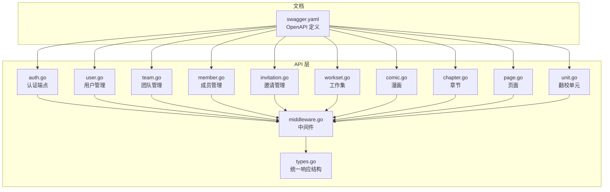
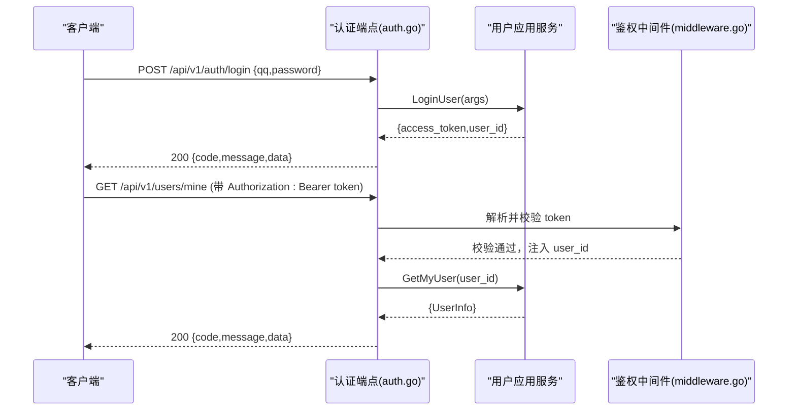
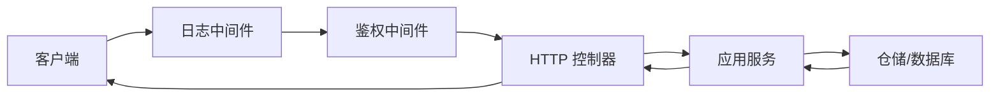

# API 参考

<cite>
**本文引用的文件**
- [swagger.yaml](file://backend/backend-v1/docs/swagger.yaml)
- [auth.go](file://backend/backend-v1/internal/api/http/auth.go)
- [user.go](file://backend/backend-v1/internal/api/http/user.go)
- [team.go](file://backend/backend-v1/internal/api/http/team.go)
- [comic.go](file://backend/backend-v1/internal/api/http/comic.go)
- [chapter.go](file://backend/backend-v1/internal/api/http/chapter.go)
- [page.go](file://backend/backend-v1/internal/api/http/page.go)
- [member.go](file://backend/backend-v1/internal/api/http/member.go)
- [invitation.go](file://backend/backend-v1/internal/api/http/invitation.go)
- [workset.go](file://backend/backend-v1/internal/api/http/workset.go)
- [unit.go](file://backend/backend-v1/internal/api/http/unit.go)
- [types.go](file://backend/backend-v1/internal/api/http/types.go)
- [middleware.go](file://backend/backend-v1/internal/api/http/middleware.go)
</cite>

## 目录
1. [简介](#简介)
2. [项目结构](#项目结构)
3. [核心组件](#核心组件)
4. [架构总览](#架构总览)
5. [详细组件分析](#详细组件分析)
6. [依赖关系分析](#依赖关系分析)
7. [性能与安全](#性能与安全)
8. [故障排查指南](#故障排查指南)
9. [结论](#结论)
10. [附录](#附录)

## 简介
本文件为 Poprako 后端 v1 的完整 API 参考，覆盖认证、用户管理、团队与成员、邀请、工作集、漫画、章节、页面与翻校单元等模块。文档基于 Swagger 定义与源代码注释整理，提供每个端点的 HTTP 方法、URL 模式、请求/响应模型、认证要求、参数说明、错误处理与最佳实践建议。

- API 基础路径：/api/v1
- 默认版本：v1
- 认证方式：Authorization 头部携带 Bearer Token
- 统一响应格式：见“核心组件”小节

## 项目结构
后端采用按功能域划分的层次化组织，API 层位于 internal/api/http，负责路由与控制器；领域模型与应用服务位于 internal/application、domain、repository 等目录；Swagger 文档位于 docs。

图表来源
- [swagger.yaml](file://backend/backend-v1/docs/swagger.yaml)
- [auth.go](file://backend/backend-v1/internal/api/http/auth.go)
- [user.go](file://backend/backend-v1/internal/api/http/user.go)
- [team.go](file://backend/backend-v1/internal/api/http/team.go)
- [member.go](file://backend/backend-v1/internal/api/http/member.go)
- [invitation.go](file://backend/backend-v1/internal/api/http/invitation.go)
- [workset.go](file://backend/backend-v1/internal/api/http/workset.go)
- [comic.go](file://backend/backend-v1/internal/api/http/comic.go)
- [chapter.go](file://backend/backend-v1/internal/api/http/chapter.go)
- [page.go](file://backend/backend-v1/internal/api/http/page.go)
- [unit.go](file://backend/backend-v1/internal/api/http/unit.go)
- [types.go](file://backend/backend-v1/internal/api/http/types.go)
- [middleware.go](file://backend/backend-v1/internal/api/http/middleware.go)

章节来源
- [swagger.yaml](file://backend/backend-v1/docs/swagger.yaml)
- [auth.go](file://backend/backend-v1/internal/api/http/auth.go)
- [user.go](file://backend/backend-v1/internal/api/http/user.go)
- [team.go](file://backend/backend-v1/internal/api/http/team.go)
- [member.go](file://backend/backend-v1/internal/api/http/member.go)
- [invitation.go](file://backend/backend-v1/internal/api/http/invitation.go)
- [workset.go](file://backend/backend-v1/internal/api/http/workset.go)
- [comic.go](file://backend/backend-v1/internal/api/http/comic.go)
- [chapter.go](file://backend/backend-v1/internal/api/http/chapter.go)
- [page.go](file://backend/backend-v1/internal/api/http/page.go)
- [unit.go](file://backend/backend-v1/internal/api/http/unit.go)
- [types.go](file://backend/backend-v1/internal/api/http/types.go)
- [middleware.go](file://backend/backend-v1/internal/api/http/middleware.go)

## 核心组件
- 统一响应结构
  - 字段：code（数字）、message（字符串）、data（任意对象，成功时返回）
  - 示例路径参考：[types.go](file://backend/backend-v1/internal/api/http/types.go)
- 认证与授权
  - 请求头：Authorization: Bearer <token>
  - 中间件负责解析并校验 JWT，失败返回 401
  - 示例路径参考：[middleware.go](file://backend/backend-v1/internal/api/http/middleware.go)
- 数据模型
  - 所有请求/响应模型均在 Swagger 定义中声明，如用户、团队、漫画、章节、页面、翻校单元、邀请、成员、工作集等
  - 示例路径参考：[swagger.yaml](file://backend/backend-v1/docs/swagger.yaml)

章节来源
- [types.go](file://backend/backend-v1/internal/api/http/types.go)
- [middleware.go](file://backend/backend-v1/internal/api/http/middleware.go)
- [swagger.yaml](file://backend/backend-v1/docs/swagger.yaml)

## 架构总览
以下序列图展示一次典型登录流程，体现认证端点、应用层与鉴权中间件的协作。

图表来源
- [auth.go](file://backend/backend-v1/internal/api/http/auth.go)
- [user.go](file://backend/backend-v1/internal/api/http/user.go)
- [middleware.go](file://backend/backend-v1/internal/api/http/middleware.go)

## 详细组件分析

### 认证模块
- 登录
  - 方法与路径：POST /api/v1/auth/login
  - 请求体：value.LoginUserArgs（qq, password）
  - 响应体：value.LoginUserResult（access_token, user_id）
  - 认证：无需已登录
  - 示例路径参考：[auth.go](file://backend/backend-v1/internal/api/http/auth.go)，[swagger.yaml](file://backend/backend-v1/docs/swagger.yaml)
- 注册
  - 方法与路径：POST /api/v1/auth/register
  - 请求体：value.RegisterUserArgs（invitation_code, name, password, qq）
  - 响应体：value.RegisterUserResult（access_token, user_id）
  - 认证：无需已登录
  - 示例路径参考：[auth.go](file://backend/backend-v1/internal/api/http/auth.go)，[swagger.yaml](file://backend/backend-v1/docs/swagger.yaml)

章节来源
- [auth.go](file://backend/backend-v1/internal/api/http/auth.go)
- [swagger.yaml](file://backend/backend-v1/docs/swagger.yaml)

### 用户模块
- 获取指定用户信息
  - 方法与路径：GET /api/v1/users/{user_id}
  - 路径参数：user_id（字符串）
  - 认证：ApiKeyAuth（Bearer）
  - 响应体：value.UserInfo
  - 示例路径参考：[user.go](file://backend/backend-v1/internal/api/http/user.go)，[swagger.yaml](file://backend/backend-v1/docs/swagger.yaml)
- 获取当前登录用户信息
  - 方法与路径：GET /api/v1/users/mine
  - 认证：ApiKeyAuth（Bearer）
  - 响应体：value.UserInfo
  - 示例路径参考：[user.go](file://backend/backend-v1/internal/api/http/user.go)，[swagger.yaml](file://backend/backend-v1/docs/swagger.yaml)
- 更新用户
  - 方法与路径：PUT /api/v1/users/{user_id}
  - 路径参数：user_id（字符串）
  - 请求体：value.UpdateUserArgs（name, password, qq, user_id）
  - 认证：ApiKeyAuth（Bearer）
  - 示例路径参考：[user.go](file://backend/backend-v1/internal/api/http/user.go)，[swagger.yaml](file://backend/backend-v1/docs/swagger.yaml)
- 删除用户
  - 方法与路径：DELETE /api/v1/users/{user_id}
  - 路径参数：user_id（字符串）
  - 认证：ApiKeyAuth（Bearer）
  - 示例路径参考：[user.go](file://backend/backend-v1/internal/api/http/user.go)，[swagger.yaml](file://backend/backend-v1/docs/swagger.yaml)
- 预留用户头像上传
  - 方法与路径：POST /api/v1/users/{user_id}/avatar
  - 路径参数：user_id（字符串）
  - 认证：ApiKeyAuth（Bearer）
  - 响应体：value.ReserveUserAvatarResult（put_url）
  - 示例路径参考：[user.go](file://backend/backend-v1/internal/api/http/user.go)，[swagger.yaml](file://backend/backend-v1/docs/swagger.yaml)
- 确认用户头像已上传
  - 方法与路径：POST /api/v1/users/{user_id}/avatar/confirm
  - 路径参数：user_id（字符串）
  - 认证：ApiKeyAuth（Bearer）
  - 示例路径参考：[user.go](file://backend/backend-v1/internal/api/http/user.go)，[swagger.yaml](file://backend/backend-v1/docs/swagger.yaml)

章节来源
- [user.go](file://backend/backend-v1/internal/api/http/user.go)
- [swagger.yaml](file://backend/backend-v1/docs/swagger.yaml)

### 团队模块
- 创建团队
  - 方法与路径：POST /api/v1/teams
  - 请求体：value.CreateTeamArgs（name, description）
  - 响应体：value.CreateTeamResult（id）
  - 认证：ApiKeyAuth（Bearer）
  - 示例路径参考：[team.go](file://backend/backend-v1/internal/api/http/team.go)，[swagger.yaml](file://backend/backend-v1/docs/swagger.yaml)
- 获取所有团队列表
  - 方法与路径：GET /api/v1/teams
  - 查询参数：offset（整数）、limit（整数）
  - 响应体：[]value.TeamInfo
  - 认证：ApiKeyAuth（Bearer）
  - 示例路径参考：[team.go](file://backend/backend-v1/internal/api/http/team.go)，[swagger.yaml](file://backend/backend-v1/docs/swagger.yaml)
- 获取当前用户所在团队列表
  - 方法与路径：GET /api/v1/teams/mine
  - 查询参数：offset（整数）、limit（整数）
  - 响应体：[]value.TeamInfo
  - 认证：ApiKeyAuth（Bearer）
  - 示例路径参考：[team.go](file://backend/backend-v1/internal/api/http/team.go)，[swagger.yaml](file://backend/backend-v1/docs/swagger.yaml)
- 更新团队
  - 方法与路径：PUT /api/v1/teams/{team_id}
  - 路径参数：team_id（字符串）
  - 请求体：value.UpdateTeamArgs（id, name, description）
  - 认证：ApiKeyAuth（Bearer）
  - 示例路径参考：[team.go](file://backend/backend-v1/internal/api/http/team.go)，[swagger.yaml](file://backend/backend-v1/docs/swagger.yaml)
- 删除团队
  - 方法与路径：DELETE /api/v1/teams/{team_id}
  - 路径参数：team_id（字符串）
  - 认证：ApiKeyAuth（Bearer）
  - 示例路径参考：[team.go](file://backend/backend-v1/internal/api/http/team.go)，[swagger.yaml](file://backend/backend-v1/docs/swagger.yaml)
- 预留团队头像上传
  - 方法与路径：POST /api/v1/teams/{team_id}/avatar
  - 路径参数：team_id（字符串）
  - 响应体：value.ReserveTeamAvatarResult（avatar_oss_key, put_url）
  - 认证：ApiKeyAuth（Bearer）
  - 示例路径参考：[team.go](file://backend/backend-v1/internal/api/http/team.go)，[swagger.yaml](file://backend/backend-v1/docs/swagger.yaml)
- 确认团队头像已上传
  - 方法与路径：POST /api/v1/teams/{team_id}/avatar/confirm
  - 路径参数：team_id（字符串）
  - 认证：ApiKeyAuth（Bearer）
  - 示例路径参考：[team.go](file://backend/backend-v1/internal/api/http/team.go)，[swagger.yaml](file://backend/backend-v1/docs/swagger.yaml)

章节来源
- [team.go](file://backend/backend-v1/internal/api/http/team.go)
- [swagger.yaml](file://backend/backend-v1/docs/swagger.yaml)

### 成员模块
- 创建成员
  - 方法与路径：POST /api/v1/members
  - 请求体：value.CreateMemberArgs（team_id, user_id, roles）
  - 响应体：value.CreateMemberResult（member_id）
  - 认证：ApiKeyAuth（Bearer）
  - 示例路径参考：[member.go](file://backend/backend-v1/internal/api/http/member.go)，[swagger.yaml](file://backend/backend-v1/docs/swagger.yaml)
- 获取指定团队成员列表
  - 方法与路径：GET /api/v1/members
  - 查询参数：team_id（字符串）、includes[]（可选：user）、offset（整数）、limit（整数）
  - 响应体：[]value.MemberInfo
  - 认证：ApiKeyAuth（Bearer）
  - 示例路径参考：[member.go](file://backend/backend-v1/internal/api/http/member.go)，[swagger.yaml](file://backend/backend-v1/docs/swagger.yaml)
- 获取当前用户成员身份列表
  - 方法与路径：GET /api/v1/members/mine
  - 查询参数：includes[]（可选：team）、offset（整数）、limit（整数）
  - 响应体：[]value.MemberInfo
  - 认证：ApiKeyAuth（Bearer）
  - 示例路径参考：[member.go](file://backend/backend-v1/internal/api/http/member.go)，[swagger.yaml](file://backend/backend-v1/docs/swagger.yaml)
- 更新成员角色
  - 方法与路径：PUT /api/v1/members/{member_id}
  - 路径参数：member_id（字符串）
  - 请求体：value.UpdateMemberRoleArgs（id, roles）
  - 认证：ApiKeyAuth（Bearer）
  - 示例路径参考：[member.go](file://backend/backend-v1/internal/api/http/member.go)，[swagger.yaml](file://backend/backend-v1/docs/swagger.yaml)
- 通过邀请码加入团队
  - 方法与路径：POST /api/v1/members/join
  - 请求体：value.JoinTeamArgs（invitation_code）
  - 认证：ApiKeyAuth（Bearer）
  - 示例路径参考：[member.go](file://backend/backend-v1/internal/api/http/member.go)，[swagger.yaml](file://backend/backend-v1/docs/swagger.yaml)
- 移除成员
  - 方法与路径：DELETE /api/v1/members/{member_id}
  - 路径参数：member_id（字符串）
  - 认证：ApiKeyAuth（Bearer）
  - 示例路径参考：[member.go](file://backend/backend-v1/internal/api/http/member.go)，[swagger.yaml](file://backend/backend-v1/docs/swagger.yaml)

章节来源
- [member.go](file://backend/backend-v1/internal/api/http/member.go)
- [swagger.yaml](file://backend/backend-v1/docs/swagger.yaml)

### 邀请模块
- 获取团队邀请列表
  - 方法与路径：GET /api/v1/invitations
  - 查询参数：team_id（字符串）、offset（整数）、limit（整数）、includes[]（可选：invitor）
  - 响应体：[]value.InvitationInfo
  - 认证：ApiKeyAuth（Bearer）
  - 示例路径参考：[invitation.go](file://backend/backend-v1/internal/api/http/invitation.go)，[swagger.yaml](file://backend/backend-v1/docs/swagger.yaml)
- 创建邀请
  - 方法与路径：POST /api/v1/invitations
  - 请求体：value.CreateInvitationArgs（team_id, invitee_qq, roles）
  - 响应体：value.InvitationInfo
  - 认证：ApiKeyAuth（Bearer）
  - 示例路径参考：[invitation.go](file://backend/backend-v1/internal/api/http/invitation.go)，[swagger.yaml](file://backend/backend-v1/docs/swagger.yaml)
- 更新未使用邀请
  - 方法与路径：PUT /api/v1/invitations/{invitation_id}
  - 路径参数：invitation_id（字符串）
  - 请求体：value.UpdateInvitationArgs（id, team_id, roles）
  - 认证：ApiKeyAuth（Bearer）
  - 示例路径参考：[invitation.go](file://backend/backend-v1/internal/api/http/invitation.go)，[swagger.yaml](file://backend/backend-v1/docs/swagger.yaml)
- 删除邀请
  - 方法与路径：DELETE /api/v1/invitations/{invitation_id}
  - 路径参数：invitation_id（字符串）
  - 认证：ApiKeyAuth（Bearer）
  - 示例路径参考：[invitation.go](file://backend/backend-v1/internal/api/http/invitation.go)，[swagger.yaml](file://backend/backend-v1/docs/swagger.yaml)

章节来源
- [invitation.go](file://backend/backend-v1/internal/api/http/invitation.go)
- [swagger.yaml](file://backend/backend-v1/docs/swagger.yaml)

### 工作集模块
- 获取团队工作集列表
  - 方法与路径：GET /api/v1/worksets
  - 查询参数：team_id（字符串）、includes[]（可选：team）、offset（整数）、limit（整数）
  - 响应体：[]value.WorksetInfo
  - 认证：ApiKeyAuth（Bearer）
  - 示例路径参考：[workset.go](file://backend/backend-v1/internal/api/http/workset.go)，[swagger.yaml](file://backend/backend-v1/docs/swagger.yaml)
- 创建工作集
  - 方法与路径：POST /api/v1/worksets
  - 请求体：value.CreateWorksetArgs（team_id, name, description）
  - 响应体：value.CreateWorksetResult（id）
  - 认证：ApiKeyAuth（Bearer）
  - 示例路径参考：[workset.go](file://backend/backend-v1/internal/api/http/workset.go)，[swagger.yaml](file://backend/backend-v1/docs/swagger.yaml)
- 更新工作集
  - 方法与路径：PUT /api/v1/worksets/{workset_id}
  - 路径参数：workset_id（字符串）
  - 请求体：value.UpdateWorksetArgs（id, name, description）
  - 认证：ApiKeyAuth（Bearer）
  - 示例路径参考：[workset.go](file://backend/backend-v1/internal/api/http/workset.go)，[swagger.yaml](file://backend/backend-v1/docs/swagger.yaml)
- 删除工作集
  - 方法与路径：DELETE /api/v1/worksets/{workset_id}
  - 路径参数：workset_id（字符串）
  - 认证：ApiKeyAuth（Bearer）
  - 示例路径参考：[workset.go](file://backend/backend-v1/internal/api/http/workset.go)，[swagger.yaml](file://backend/backend-v1/docs/swagger.yaml)

章节来源
- [workset.go](file://backend/backend-v1/internal/api/http/workset.go)
- [swagger.yaml](file://backend/backend-v1/docs/swagger.yaml)

### 漫画模块
- 获取工作集漫画列表
  - 方法与路径：GET /api/v1/comics
  - 查询参数：workset_id（字符串）、offset（整数）、limit（整数）、includes[]（可选：workset, creator）
  - 响应体：[]value.ComicInfo
  - 认证：ApiKeyAuth（Bearer）
  - 示例路径参考：[comic.go](file://backend/backend-v1/internal/api/http/comic.go)，[swagger.yaml](file://backend/backend-v1/docs/swagger.yaml)
- 创建漫画
  - 方法与路径：POST /api/v1/comics
  - 请求体：value.CreateComicArgs（workset_id, title, author, description）
  - 响应体：value.CreateComicResult（id）
  - 认证：ApiKeyAuth（Bearer）
  - 示例路径参考：[comic.go](file://backend/backend-v1/internal/api/http/comic.go)，[swagger.yaml](file://backend/backend-v1/docs/swagger.yaml)
- 更新漫画
  - 方法与路径：PUT /api/v1/comics/{comic_id}
  - 路径参数：comic_id（字符串）
  - 请求体：value.UpdateComicArgs（id, title, author, description）
  - 认证：ApiKeyAuth（Bearer）
  - 示例路径参考：[comic.go](file://backend/backend-v1/internal/api/http/comic.go)，[swagger.yaml](file://backend/backend-v1/docs/swagger.yaml)
- 删除漫画
  - 方法与路径：DELETE /api/v1/comics/{comic_id}
  - 路径参数：comic_id（字符串）
  - 认证：ApiKeyAuth（Bearer）
  - 示例路径参考：[comic.go](file://backend/backend-v1/internal/api/http/comic.go)，[swagger.yaml](file://backend/backend-v1/docs/swagger.yaml)

章节来源
- [comic.go](file://backend/backend-v1/internal/api/http/comic.go)
- [swagger.yaml](file://backend/backend-v1/docs/swagger.yaml)

### 章节模块
- 获取漫画章节列表
  - 方法与路径：GET /api/v1/chapters
  - 查询参数：comic_id（字符串）、offset（整数）、limit（整数）、includes[]（可选：creator）
  - 响应体：[]value.ChapterInfo
  - 认证：ApiKeyAuth（Bearer）
  - 示例路径参考：[chapter.go](file://backend/backend-v1/internal/api/http/chapter.go)，[swagger.yaml](file://backend/backend-v1/docs/swagger.yaml)
- 创建章节
  - 方法与路径：POST /api/v1/chapters
  - 请求体：value.CreateChapterArgs（comic_id, subtitle）
  - 响应体：value.CreateChapterResult（id）
  - 认证：ApiKeyAuth（Bearer）
  - 示例路径参考：[chapter.go](file://backend/backend-v1/internal/api/http/chapter.go)，[swagger.yaml](file://backend/backend-v1/docs/swagger.yaml)
- 更新章节
  - 方法与路径：PATCH /api/v1/chapters/{chapter_id}
  - 路径参数：chapter_id（字符串）
  - 请求体：value.UpdateChapterArgs（chapter_id, subtitle, upload_status, translate_status, review_status, proofread_status, publish_status, typeset_status）
  - 认证：ApiKeyAuth（Bearer）
  - 示例路径参考：[chapter.go](file://backend/backend-v1/internal/api/http/chapter.go)，[swagger.yaml](file://backend/backend-v1/docs/swagger.yaml)
- 删除章节
  - 方法与路径：DELETE /api/v1/chapters/{chapter_id}
  - 路径参数：chapter_id（字符串）
  - 认证：ApiKeyAuth（Bearer）
  - 示例路径参考：[chapter.go](file://backend/backend-v1/internal/api/http/chapter.go)，[swagger.yaml](file://backend/backend-v1/docs/swagger.yaml)

章节来源
- [chapter.go](file://backend/backend-v1/internal/api/http/chapter.go)
- [swagger.yaml](file://backend/backend-v1/docs/swagger.yaml)

### 页面模块
- 获取章节页面列表
  - 方法与路径：GET /api/v1/pages
  - 查询参数：chapter_id（字符串）、offset（整数）、limit（整数）、includes[]（可选：creator）
  - 响应体：[]value.PageInfo
  - 认证：ApiKeyAuth（Bearer）
  - 示例路径参考：[page.go](file://backend/backend-v1/internal/api/http/page.go)，[swagger.yaml](file://backend/backend-v1/docs/swagger.yaml)
- 预留章节页面并生成上传地址
  - 方法与路径：POST /api/v1/pages
  - 请求体：value.ReserveChapterPagesArgs（chapter_id, page_count）
  - 响应体：value.ReserveChapterPagesResult（creations[]: {page_id, put_url}）
  - 认证：ApiKeyAuth（Bearer）
  - 示例路径参考：[page.go](file://backend/backend-v1/internal/api/http/page.go)，[swagger.yaml](file://backend/backend-v1/docs/swagger.yaml)
- 更新页面
  - 方法与路径：PUT /api/v1/pages/{page_id}
  - 路径参数：page_id（字符串）
  - 请求体：value.UpdatePageArgs（id, is_uploaded）
  - 认证：ApiKeyAuth（Bearer）
  - 示例路径参考：[page.go](file://backend/backend-v1/internal/api/http/page.go)，[swagger.yaml](file://backend/backend-v1/docs/swagger.yaml)
- 删除章节所有页面
  - 方法与路径：DELETE /api/v1/pages/{chapter_id}
  - 路径参数：chapter_id（字符串）
  - 认证：ApiKeyAuth（Bearer）
  - 示例路径参考：[page.go](file://backend/backend-v1/internal/api/http/page.go)，[swagger.yaml](file://backend/backend-v1/docs/swagger.yaml)

章节来源
- [page.go](file://backend/backend-v1/internal/api/http/page.go)
- [swagger.yaml](file://backend/backend-v1/docs/swagger.yaml)

### 翻校单元模块
- 获取页面单元列表
  - 方法与路径：GET /api/v1/units
  - 查询参数：page_id（字符串）
  - 响应体：[]value.UnitInfo
  - 认证：ApiKeyAuth（Bearer）
  - 示例路径参考：[unit.go](file://backend/backend-v1/internal/api/http/unit.go)，[swagger.yaml](file://backend/backend-v1/docs/swagger.yaml)
- 保存页面单元 diff
  - 方法与路径：PUT /api/v1/units
  - 请求体：value.SavePageUnitArgs（page_id, unit_diff）
  - 认证：ApiKeyAuth（Bearer）
  - 示例路径参考：[unit.go](file://backend/backend-v1/internal/api/http/unit.go)，[swagger.yaml](file://backend/backend-v1/docs/swagger.yaml)

章节来源
- [unit.go](file://backend/backend-v1/internal/api/http/unit.go)
- [swagger.yaml](file://backend/backend-v1/docs/swagger.yaml)

### 分配（Assignment）模块
- 获取章节分配列表
  - 方法与路径：GET /api/v1/assignments
  - 查询参数：chapter_id（字符串）、offset（整数）、limit（整数）、includes[]（可选：user, chapter, chapter.comic, chapter.creator）
  - 响应体：[]value.AssignmentInfo
  - 认证：ApiKeyAuth（Bearer）
  - 示例路径参考：[swagger.yaml](file://backend/backend-v1/docs/swagger.yaml)
- 创建章节分配
  - 方法与路径：POST /api/v1/assignments
  - 请求体：value.CreateChapterAssignmentArgs（chapter_id, user_id, role）
  - 响应体：value.CreateChapterAssignmentResult（id）
  - 认证：ApiKeyAuth（Bearer）
  - 示例路径参考：[swagger.yaml](file://backend/backend-v1/docs/swagger.yaml)
- 更新分配角色（PUT）
  - 方法与路径：PUT /api/v1/assignments/{assignment_id}
  - 路径参数：assignment_id（字符串）
  - 请求体：value.UpdateAssignmentArgs（id, role）
  - 认证：ApiKeyAuth（Bearer）
  - 示例路径参考：[swagger.yaml](file://backend/backend-v1/docs/swagger.yaml)
- 删除分配
  - 方法与路径：DELETE /api/v1/assignments/{assignment_id}
  - 路径参数：assignment_id（字符串）
  - 认证：ApiKeyAuth（Bearer）
  - 示例路径参考：[swagger.yaml](file://backend/backend-v1/docs/swagger.yaml)
- 获取我的分配列表
  - 方法与路径：GET /api/v1/assignments/mine
  - 查询参数：offset（整数）、limit（整数）、includes[]（可选：chapter, chapter.comic, chapter.creator）
  - 响应体：[]value.AssignmentInfo
  - 认证：ApiKeyAuth（Bearer）
  - 示例路径参考：[swagger.yaml](file://backend/backend-v1/docs/swagger.yaml)

章节来源
- [swagger.yaml](file://backend/backend-v1/docs/swagger.yaml)

## 依赖关系分析
- 中间件链路
  - 日志中间件：记录请求方法、路径、状态码、耗时等（开发环境）
  - 鉴权中间件：解析 Authorization 头，校验 JWT，注入 user_id
- 控制器到应用服务
  - 每个 HTTP 控制器通过 AppState 获取对应的 Application 层实例，执行业务逻辑并返回统一响应
- Swagger 与控制器的契约
  - 所有控制器注释与 Swagger 定义保持一致，确保文档与实现同步

图表来源
- [middleware.go](file://backend/backend-v1/internal/api/http/middleware.go)
- [types.go](file://backend/backend-v1/internal/api/http/types.go)

章节来源
- [middleware.go](file://backend/backend-v1/internal/api/http/middleware.go)
- [types.go](file://backend/backend-v1/internal/api/http/types.go)

## 性能与安全
- 性能
  - 建议对高频查询使用 includes[] 限定关联加载，避免 N+1 查询
  - 分页参数（offset/limit）需合理设置，避免一次性返回大量数据
- 安全
  - 所有受保护端点必须携带有效的 Bearer Token
  - 头像上传采用预签名 URL，客户端上传完成后需调用确认接口
  - 敏感操作（删除团队、删除成员、删除漫画等）需具备相应角色权限
- 版本控制
  - API 基于 /api/v1，当前版本为 v1；未来升级遵循向后兼容或新增版本路径策略
- 速率限制
  - 当前仓库未发现显式的速率限制实现；建议在网关或中间件层引入限流策略

[本节为通用指导，不直接分析具体文件]

## 故障排查指南
- 401 未授权
  - 检查 Authorization 头是否为 Bearer <token> 格式
  - 确认 token 未过期且签名有效
  - 示例路径参考：[middleware.go](file://backend/backend-v1/internal/api/http/middleware.go)
- 403 禁止访问
  - 可能为权限不足或目标资源归属不符（如删除他人团队）
  - 示例路径参考：[team.go](file://backend/backend-v1/internal/api/http/team.go)，[member.go](file://backend/backend-v1/internal/api/http/member.go)
- 400 请求错误
  - 检查请求体 JSON 格式与必填字段
  - 路径参数与请求体 ID 不匹配时会返回 400
  - 示例路径参考：[user.go](file://backend/backend-v1/internal/api/http/user.go)，[page.go](file://backend/backend-v1/internal/api/http/page.go)
- 200 成功但数据为空
  - 当集合为空时，接口可能返回 null 而非空数组，请前端做兼容处理
  - 示例路径参考：[swagger.yaml](file://backend/backend-v1/docs/swagger.yaml)

章节来源
- [middleware.go](file://backend/backend-v1/internal/api/http/middleware.go)
- [user.go](file://backend/backend-v1/internal/api/http/user.go)
- [page.go](file://backend/backend-v1/internal/api/http/page.go)
- [team.go](file://backend/backend-v1/internal/api/http/team.go)
- [member.go](file://backend/backend-v1/internal/api/http/member.go)
- [swagger.yaml](file://backend/backend-v1/docs/swagger.yaml)

## 结论
本 API 参考文档基于 Swagger 定义与源代码注释整理，覆盖了认证、用户、团队、成员、邀请、工作集、漫画、章节、页面与翻校单元等核心模块。通过统一响应结构与鉴权中间件，系统提供了清晰的调用规范与错误处理指引。建议在生产环境中结合速率限制、审计日志与细粒度权限控制进一步完善安全体系。

[本节为总结性内容，不直接分析具体文件]

## 附录
- 统一响应结构
  - 字段：code、message、data（可选）
  - 示例路径参考：[types.go](file://backend/backend-v1/internal/api/http/types.go)
- Swagger 文档
  - OpenAPI 定义文件：[swagger.yaml](file://backend/backend-v1/docs/swagger.yaml)
- 客户端实现建议
  - 使用 Authorization: Bearer <token> 访问受保护端点
  - 对头像上传采用预签名 URL 并在上传后调用确认接口
  - 对分页查询使用 offset/limit 控制数据规模
  - 对 includes[] 进行必要裁剪，减少不必要的关联加载

章节来源
- [types.go](file://backend/backend-v1/internal/api/http/types.go)
- [swagger.yaml](file://backend/backend-v1/docs/swagger.yaml)