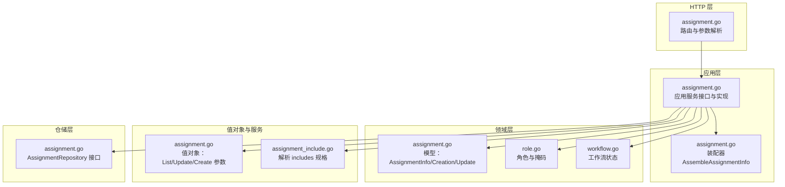
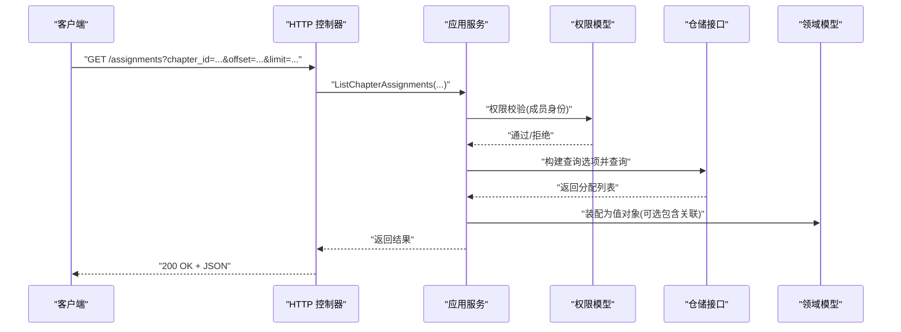
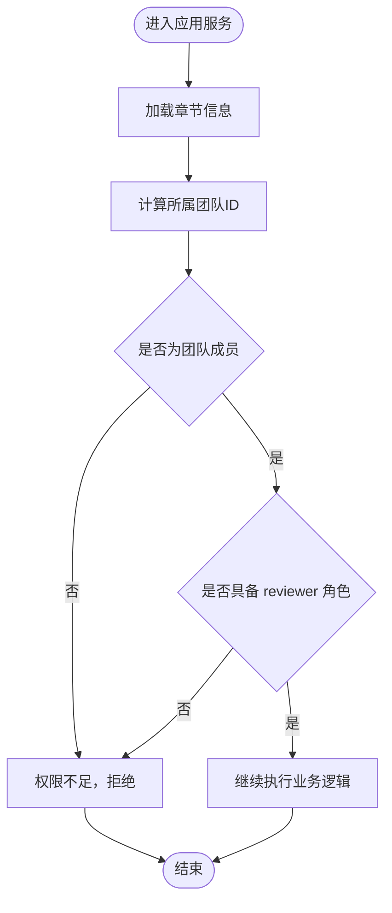
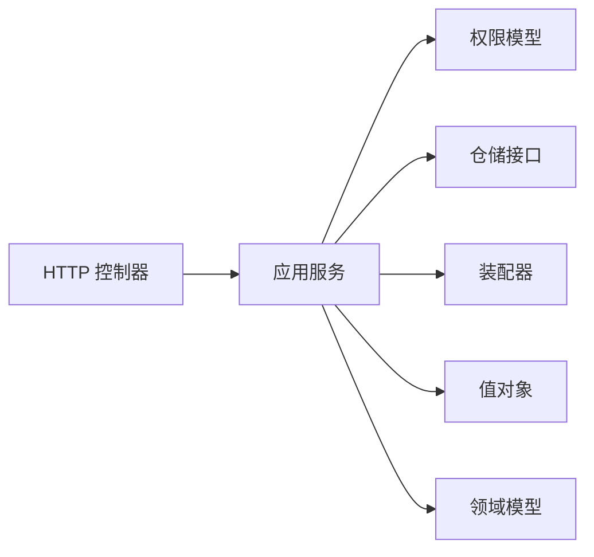

# 任务分配 API

<cite>
**本文引用的文件**
- [assignment.go](file://backend/backend-v1/internal/api/http/assignment.go)
- [assignment.go](file://backend/backend-v1/internal/application/assignment.go)
- [assignment.go](file://backend/backend-v1/internal/application/assembler/assignment.go)
- [assignment.go](file://backend/backend-v1/internal/domain/repository/assignment.go)
- [assignment_include.go](file://backend/backend-v1/internal/domain/service/assignment_include.go)
- [assignment.go](file://backend/backend-v1/internal/value/assignment.go)
- [assignment.go](file://backend/backend-v1/internal/domain/model/assignment.go)
- [permission.go](file://backend/backend-v1/internal/domain/model/permission.go)
- [role.go](file://backend/backend-v1/internal/domain/model/role.go)
- [workflow.go](file://backend/backend-v1/internal/domain/model/workflow.go)
- [swagger.yaml](file://backend/backend-v1/docs/swagger.yaml)
</cite>

## 目录
1. [简介](#简介)
2. [项目结构](#项目结构)
3. [核心组件](#核心组件)
4. [架构总览](#架构总览)
5. [详细组件分析](#详细组件分析)
6. [依赖分析](#依赖分析)
7. [性能考虑](#性能考虑)
8. [故障排查指南](#故障排查指南)
9. [结论](#结论)
10. [附录](#附录)

## 简介
本文件为“任务分配与工作流程”模块的完整 API 文档，覆盖以下主题：
- 任务分配的创建、更新、删除、查询接口规范
- 工作流状态管理与任务完成确认接口说明
- 任务优先级设置、截止日期管理、负责人分配的 API 使用指南
- 权限验证与工作流控制机制
- 实际使用场景示例与最佳实践建议

本模块围绕“章节分配”展开，支持按章节或按用户的分配列表查询，并通过角色掩码进行多角色分工管理。工作流状态通过统一的状态枚举进行约束。

## 项目结构
后端采用分层架构：HTTP 层负责路由与参数解析；应用层封装业务逻辑与权限校验；领域模型定义数据结构与规则；值对象与装配器负责 DTO 转换与序列化；仓库层抽象持久化操作；服务层提供 include 规格解析等辅助能力。

**图表来源**
- [assignment.go:1-228](file://backend/backend-v1/internal/api/http/assignment.go#L1-L228)
- [assignment.go:1-358](file://backend/backend-v1/internal/application/assignment.go#L1-L358)
- [assignment.go:1-39](file://backend/backend-v1/internal/application/assembler/assignment.go#L1-L39)
- [assignment.go:1-190](file://backend/backend-v1/internal/domain/model/assignment.go#L1-L190)
- [role.go:1-56](file://backend/backend-v1/internal/domain/model/role.go#L1-L56)
- [workflow.go:1-36](file://backend/backend-v1/internal/domain/model/workflow.go#L1-L36)
- [assignment.go:1-131](file://backend/backend-v1/internal/value/assignment.go#L1-L131)
- [assignment_include.go:1-67](file://backend/backend-v1/internal/domain/service/assignment_include.go#L1-L67)
- [assignment.go:1-15](file://backend/backend-v1/internal/domain/repository/assignment.go#L1-L15)

**章节来源**
- [assignment.go:1-228](file://backend/backend-v1/internal/api/http/assignment.go#L1-L228)
- [assignment.go:1-358](file://backend/backend-v1/internal/application/assignment.go#L1-L358)
- [assignment.go:1-39](file://backend/backend-v1/internal/application/assembler/assignment.go#L1-L39)
- [assignment.go:1-190](file://backend/backend-v1/internal/domain/model/assignment.go#L1-L190)
- [role.go:1-56](file://backend/backend-v1/internal/domain/model/role.go#L1-L56)
- [workflow.go:1-36](file://backend/backend-v1/internal/domain/model/workflow.go#L1-L36)
- [assignment.go:1-131](file://backend/backend-v1/internal/value/assignment.go#L1-L131)
- [assignment_include.go:1-67](file://backend/backend-v1/internal/domain/service/assignment_include.go#L1-L67)
- [assignment.go:1-15](file://backend/backend-v1/internal/domain/repository/assignment.go#L1-L15)

## 核心组件
- HTTP 控制器：提供章节分配列表、我的分配列表、创建分配、更新分配、删除分配等接口。
- 应用服务：封装权限校验、参数校验、查询选项构建、仓储调用与结果装配。
- 领域模型：定义分配信息、创建与更新结构、角色掩码与工作流状态。
- 值对象：定义 API 请求/响应参数与分页参数。
- 仓储接口：抽象分配的增删改查与加锁等操作。
- 包装器：将领域模型转换为对外值对象，支持按需包含关联信息。
- 权限模型：基于角色与组织关系的细粒度权限控制。

**章节来源**
- [assignment.go:10-228](file://backend/backend-v1/internal/api/http/assignment.go#L10-L228)
- [assignment.go:20-46](file://backend/backend-v1/internal/application/assignment.go#L20-L46)
- [assignment.go:5-190](file://backend/backend-v1/internal/domain/model/assignment.go#L5-L190)
- [assignment.go:9-131](file://backend/backend-v1/internal/value/assignment.go#L9-L131)
- [assignment.go:5-15](file://backend/backend-v1/internal/domain/repository/assignment.go#L5-L15)
- [assignment.go:9-39](file://backend/backend-v1/internal/application/assembler/assignment.go#L9-L39)
- [permission.go:541-621](file://backend/backend-v1/internal/domain/model/permission.go#L541-L621)

## 架构总览
下图展示从 HTTP 请求到应用服务再到仓储与权限校验的整体流程。

**图表来源**
- [assignment.go:25-52](file://backend/backend-v1/internal/api/http/assignment.go#L25-L52)
- [assignment.go:92-157](file://backend/backend-v1/internal/application/assignment.go#L92-L157)
- [permission.go:553-579](file://backend/backend-v1/internal/domain/model/permission.go#L553-L579)
- [assignment.go:7-12](file://backend/backend-v1/internal/domain/repository/assignment.go#L7-L12)
- [assignment.go:11-38](file://backend/backend-v1/internal/application/assembler/assignment.go#L11-L38)

## 详细组件分析

### 1) 任务分配接口总览
- 获取章节分配列表
  - 方法与路径：GET /assignments
  - 权限：汉化组成员
  - 查询参数：chapter_id（必填）、includes[]（可选：user/chapter/chapter.comic/chapter.creator）、offset（必填）、limit（必填）
  - 返回：数组，元素为 AssignmentInfo
- 获取我的分配列表
  - 方法与路径：GET /assignments/mine
  - 权限：登录用户
  - 查询参数：includes[]（可选：chapter/chapter.comic/chapter.creator）、offset（必填）、limit（必填）
  - 返回：数组，元素为 AssignmentInfo
- 创建章节分配
  - 方法与路径：POST /assignments
  - 权限：当前用户在该章节中拥有 reviewer 角色
  - 请求体：CreateChapterAssignmentArgs（chapter_id、user_id、role）
  - 返回：CreateChapterAssignmentResult（id）
- 更新分配角色（全量替换）
  - 方法与路径：PUT /assignments/{assignment_id}
  - 权限：当前用户在该章节中拥有 reviewer 角色
  - 路径参数：assignment_id（必填）
  - 请求体：UpdateAssignmentArgs（id、role）
  - 返回：空（200）
- 删除分配
  - 方法与路径：DELETE /assignments/{assignment_id}
  - 权限：当前用户在该章节中拥有 reviewer 角色
  - 路径参数：assignment_id（必填）
  - 返回：空（200）

**章节来源**
- [assignment.go:10-228](file://backend/backend-v1/internal/api/http/assignment.go#L10-L228)
- [swagger.yaml:645-787](file://backend/backend-v1/docs/swagger.yaml#L645-L787)

### 2) 数据模型与值对象
- AssignmentInfo（对外值对象）
  - 字段：id、user_id、user（可选）、chapter_id、chapter（可选）、各角色分配时间戳（assigned_*_at，单位毫秒 UNIX 时间）、created_at、updated_at
- ListAssignmentArgs / ListChapterAssignmentArgs
  - 支持 includes[]、分页参数（offset、limit）
- CreateChapterAssignmentArgs
  - 字段：chapter_id、user_id、role（角色掩码）
- UpdateAssignmentArgs
  - 字段：id、role（角色掩码）
- 领域模型 AssignmentInfo/Creation/Update
  - 与值对象字段一一对应，但存储为时间指针与标准时间类型
- 角色与掩码
  - 角色常量：raw_provider、translator、proofreader、typesetter、reviewer、publisher、admin
  - 掩码：RoleMask，支持多角色组合
- 工作流状态
  - Workflow：uploading、translating、proofreading、typesetting、reviewing、publishing
  - WorkflowStatus：pending、in_progress、completed、unset
  - 提供组合有效性校验

**章节来源**
- [assignment.go:9-131](file://backend/backend-v1/internal/value/assignment.go#L9-L131)
- [assignment.go:5-190](file://backend/backend-v1/internal/domain/model/assignment.go#L5-L190)
- [role.go:7-56](file://backend/backend-v1/internal/domain/model/role.go#L7-L56)
- [workflow.go:3-36](file://backend/backend-v1/internal/domain/model/workflow.go#L3-L36)

### 3) 权限控制与工作流控制
- 权限模型
  - PermAssignmentList/PermAssignmentCreate/PermAssignmentUpdate/PermAssignmentDelete
  - 校验逻辑：先定位章节所属漫画与工作集，再判断当前用户是否为汉化组成员；创建/更新/删除还要求用户在该章节具备 reviewer 角色
- 工作流控制
  - 工作流状态枚举与组合有效性校验，确保状态变更符合预期
  - 章节状态更新接口（如翻译、校对、排版、审阅、发布）支持状态枚举与部分字段更新

**图表来源**
- [permission.go:553-621](file://backend/backend-v1/internal/domain/model/permission.go#L553-L621)

**章节来源**
- [permission.go:541-621](file://backend/backend-v1/internal/domain/model/permission.go#L541-L621)
- [assignment.go:234-241](file://backend/backend-v1/internal/application/assignment.go#L234-L241)
- [assignment.go:297-304](file://backend/backend-v1/internal/application/assignment.go#L297-L304)

### 4) 关联信息与 include 规格
- 支持的 includes 值：
  - 列表接口：user、chapter、chapter.comic、chapter.creator
  - 我的列表接口：chapter、chapter.comic、chapter.creator
- 解析逻辑：
  - 根据 includes[] 动态决定是否包含用户、章节、漫画、作者等关联信息
  - 仅在需要时进行关联查询，避免不必要的开销

**章节来源**
- [assignment_include.go:13-66](file://backend/backend-v1/internal/domain/service/assignment_include.go#L13-L66)
- [assignment.go:124-141](file://backend/backend-v1/internal/application/assignment.go#L124-L141)
- [assignment.go:179-196](file://backend/backend-v1/internal/application/assignment.go#L179-L196)

### 5) API 使用指南与最佳实践
- 创建分配
  - 步骤：准备 CreateChapterAssignmentArgs（chapter_id、user_id、role），调用 POST /assignments
  - 注意：同一用户在同一章节不可重复分配
- 更新分配
  - 步骤：准备 UpdateAssignmentArgs（id、role），调用 PUT /assignments/{assignment_id}
  - 语义：全量替换，未显式提供的角色将被清空
- 删除分配
  - 步骤：调用 DELETE /assignments/{assignment_id}
- 查询分配
  - 章节列表：GET /assignments，带 chapter_id、includes[]、分页参数
  - 我的列表：GET /assignments/mine，带 includes[]、分页参数
- 关联信息
  - 通过 includes[] 指定需要的关联，减少冗余数据传输
- 权限与角色
  - 创建/更新/删除分配需要 reviewer 角色
  - 查询分配需要为团队成员
- 工作流状态
  - 使用统一状态枚举，遵循组合有效性校验
  - 章节状态更新接口支持部分字段更新

**章节来源**
- [assignment.go:97-228](file://backend/backend-v1/internal/api/http/assignment.go#L97-L228)
- [assignment.go:214-265](file://backend/backend-v1/internal/application/assignment.go#L214-L265)
- [assignment.go:267-315](file://backend/backend-v1/internal/application/assignment.go#L267-L315)
- [assignment.go:317-357](file://backend/backend-v1/internal/application/assignment.go#L317-L357)
- [swagger.yaml:645-787](file://backend/backend-v1/docs/swagger.yaml#L645-L787)

## 依赖分析
- 组件耦合
  - HTTP 控制器仅依赖应用服务与通用工具函数
  - 应用服务依赖权限模型、仓储接口、装配器与值对象
  - 领域模型与值对象相互映射，装配器负责转换
- 外部依赖
  - 仓储接口抽象数据库访问，便于替换实现
  - Swagger 文档定义了 API 的输入输出契约

**图表来源**
- [assignment.go:25-228](file://backend/backend-v1/internal/api/http/assignment.go#L25-L228)
- [assignment.go:48-90](file://backend/backend-v1/internal/application/assignment.go#L48-L90)
- [assignment.go:11-38](file://backend/backend-v1/internal/application/assembler/assignment.go#L11-L38)
- [assignment.go:5-15](file://backend/backend-v1/internal/domain/repository/assignment.go#L5-L15)

**章节来源**
- [assignment.go:1-228](file://backend/backend-v1/internal/api/http/assignment.go#L1-L228)
- [assignment.go:1-358](file://backend/backend-v1/internal/application/assignment.go#L1-L358)
- [assignment.go:1-39](file://backend/backend-v1/internal/application/assembler/assignment.go#L1-L39)
- [assignment.go:1-15](file://backend/backend-v1/internal/domain/repository/assignment.go#L1-L15)

## 性能考虑
- 分页与限制
  - 所有列表接口均支持 offset/limit，避免一次性返回大量数据
- 懒加载与按需关联
  - 通过 includes[] 决定是否加载关联信息，降低查询成本
- PUT 全量替换
  - 更新分配时仅更新必要字段，避免冗余写入
- 日志与追踪
  - 应用服务记录调用日志与参数，便于问题定位与性能分析

[本节为通用指导，无需特定文件引用]

## 故障排查指南
- 常见错误与原因
  - 参数错误：请求体或查询参数格式不正确
  - 权限不足：非团队成员或不具备 reviewer 角色
  - 重复分配：同一用户在同一章节已存在分配记录
  - 无法获取分配信息：分配不存在或加载失败
- 排查步骤
  - 确认当前用户是否为团队成员
  - 确认用户在目标章节是否具备 reviewer 角色
  - 检查请求参数是否满足校验规则
  - 查看应用服务日志中的错误信息与堆栈

**章节来源**
- [assignment.go:99-102](file://backend/backend-v1/internal/application/assignment.go#L99-L102)
- [assignment.go:234-241](file://backend/backend-v1/internal/application/assignment.go#L234-L241)
- [assignment.go:243-254](file://backend/backend-v1/internal/application/assignment.go#L243-L254)
- [assignment.go:288-295](file://backend/backend-v1/internal/application/assignment.go#L288-L295)

## 结论
本模块提供了完善的任务分配与工作流程接口，具备清晰的权限控制与工作流状态约束。通过角色掩码与 includes 规格，既能灵活表达多角色分工，又能按需加载关联信息，兼顾功能完整性与性能表现。建议在生产环境中结合日志与监控，持续优化查询与权限校验路径。

[本节为总结性内容，无需特定文件引用]

## 附录

### A. API 定义与示例
- 获取章节分配列表
  - 方法：GET /assignments
  - 示例：GET /assignments?chapter_id=CH123&offset=0&limit=20&includes[]=user&includes[]=chapter.comic
- 获取我的分配列表
  - 方法：GET /assignments/mine
  - 示例：GET /assignments/mine?offset=0&limit=20&includes[]=chapter.creator
- 创建章节分配
  - 方法：POST /assignments
  - 示例请求体：
    - chapter_id: "CH123"
    - user_id: "U456"
    - role: 18（reviewer + publisher）
- 更新分配角色
  - 方法：PUT /assignments/{assignment_id}
  - 示例请求体：
    - id: "ASS789"
    - role: 2（translator）
- 删除分配
  - 方法：DELETE /assignments/{assignment_id}

**章节来源**
- [swagger.yaml:645-787](file://backend/backend-v1/docs/swagger.yaml#L645-L787)
- [assignment.go:57-107](file://backend/backend-v1/internal/value/assignment.go#L57-L107)

### B. 工作流状态与章节更新
- 支持的状态枚举：pending、in_progress、completed、unset
- 章节状态更新接口支持字段：
  - translate_status、proofread_status、typeset_status、review_status、publish_status、upload_status、subtitle
- 状态组合有效性：不同工作流区分“待处理/进行中/已完成”的组合

**章节来源**
- [workflow.go:14-36](file://backend/backend-v1/internal/domain/model/workflow.go#L14-L36)
- [swagger.yaml:501-532](file://backend/backend-v1/docs/swagger.yaml#L501-L532)