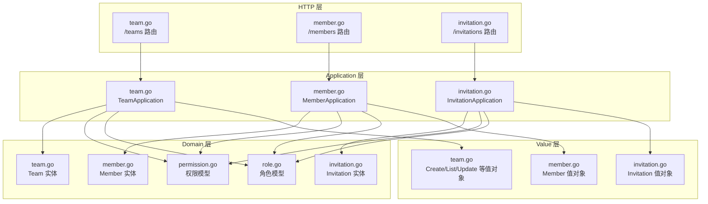
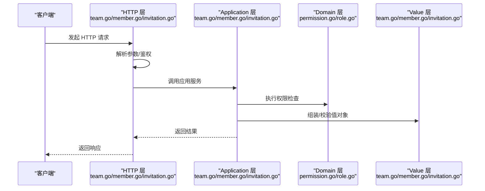
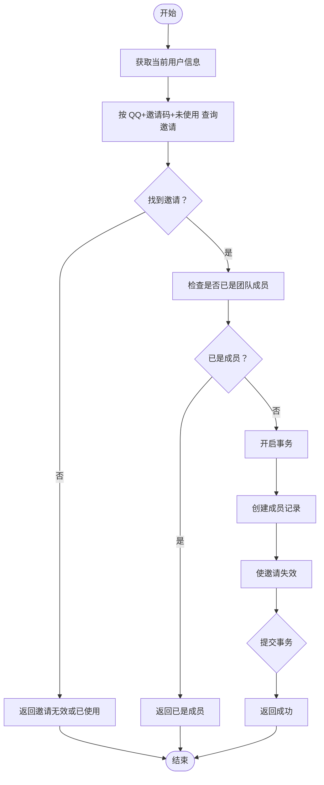
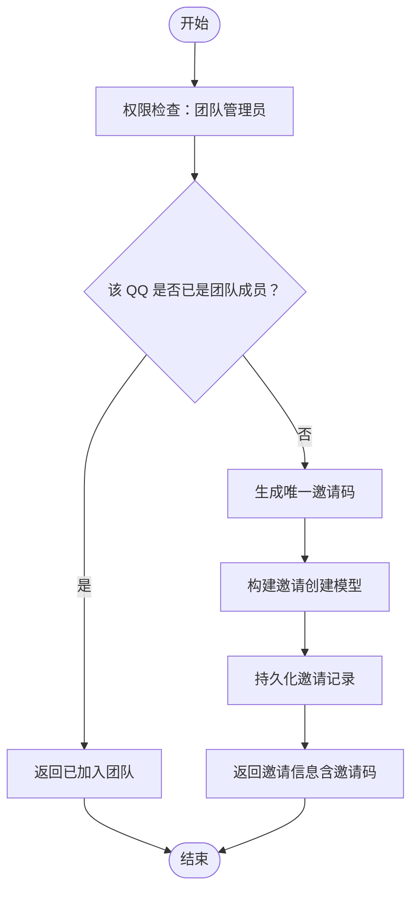
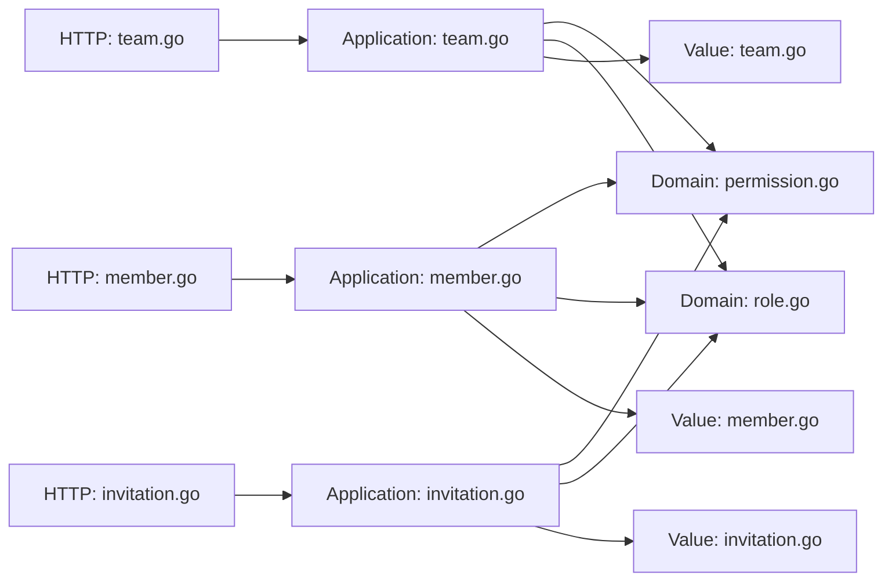

# 团队管理 API

<cite>
**本文引用的文件**
- [team.go](file://backend/backend-v1/internal/api/http/team.go)
- [member.go](file://backend/backend-v1/internal/api/http/member.go)
- [invitation.go](file://backend/backend-v1/internal/api/http/invitation.go)
- [team.go](file://backend/backend-v1/internal/application/team.go)
- [member.go](file://backend/backend-v1/internal/application/member.go)
- [invitation.go](file://backend/backend-v1/internal/application/invitation.go)
- [team.go](file://backend/backend-v1/internal/domain/model/team.go)
- [member.go](file://backend/backend-v1/internal/domain/model/member.go)
- [invitation.go](file://backend/backend-v1/internal/domain/model/invitation.go)
- [permission.go](file://backend/backend-v1/internal/domain/model/permission.go)
- [role.go](file://backend/backend-v1/internal/domain/model/role.go)
- [team.go](file://backend/backend-v1/internal/value/team.go)
- [member.go](file://backend/backend-v1/internal/value/member.go)
- [invitation.go](file://backend/backend-v1/internal/value/invitation.go)
- [swagger.yaml](file://backend/backend-v1/docs/swagger.yaml)
</cite>

## 目录
1. [简介](#简介)
2. [项目结构](#项目结构)
3. [核心组件](#核心组件)
4. [架构总览](#架构总览)
5. [详细组件分析](#详细组件分析)
6. [依赖关系分析](#依赖关系分析)
7. [性能考虑](#性能考虑)
8. [故障排除指南](#故障排除指南)
9. [结论](#结论)
10. [附录](#附录)

## 简介
本文件为团队管理模块的全面 API 文档，覆盖团队 CRUD、成员管理、邀请管理及权限控制。内容基于后端实现与 Swagger 定义，提供接口规范、数据模型、权限模型、错误处理策略与使用示例。

## 项目结构
团队管理相关代码按职责分层组织：
- HTTP 层：定义路由与请求处理，负责鉴权、参数解析与响应封装
- Application 层：业务编排，执行权限检查与领域模型转换
- Domain 层：权限模型、角色模型与实体模型
- Value 层：请求/响应参数与结果值对象
- Docs 层：OpenAPI/Swagger 定义

图表来源
- [team.go:1-289](file://backend/backend-v1/internal/api/http/team.go#L1-L289)
- [member.go:1-272](file://backend/backend-v1/internal/api/http/member.go#L1-L272)
- [invitation.go:1-185](file://backend/backend-v1/internal/api/http/invitation.go#L1-L185)
- [team.go:1-415](file://backend/backend-v1/internal/application/team.go#L1-L415)
- [member.go:1-448](file://backend/backend-v1/internal/application/member.go#L1-L448)
- [invitation.go:1-304](file://backend/backend-v1/internal/application/invitation.go#L1-L304)
- [permission.go:1-845](file://backend/backend-v1/internal/domain/model/permission.go#L1-L845)
- [role.go:1-56](file://backend/backend-v1/internal/domain/model/role.go#L1-L56)
- [team.go:1-63](file://backend/backend-v1/internal/domain/model/team.go#L1-L63)
- [member.go:1-205](file://backend/backend-v1/internal/domain/model/member.go#L1-L205)
- [invitation.go:1-158](file://backend/backend-v1/internal/domain/model/invitation.go#L1-L158)
- [team.go:1-112](file://backend/backend-v1/internal/value/team.go#L1-L112)
- [member.go:1-139](file://backend/backend-v1/internal/value/member.go#L1-L139)
- [invitation.go:1-93](file://backend/backend-v1/internal/value/invitation.go#L1-L93)

章节来源
- [team.go:1-289](file://backend/backend-v1/internal/api/http/team.go#L1-L289)
- [member.go:1-272](file://backend/backend-v1/internal/api/http/member.go#L1-L272)
- [invitation.go:1-185](file://backend/backend-v1/internal/api/http/invitation.go#L1-L185)

## 核心组件
- 团队服务：提供团队创建、查询、更新、删除、头像上传预留与确认等能力
- 成员服务：提供成员创建、列表查询、角色更新、移除、加入团队（邀请码）等能力
- 邀请服务：提供邀请创建、列表查询、更新（未使用）、删除（未使用）等能力
- 权限模型：基于用户角色与团队成员身份的细粒度权限控制
- 角色模型：以位掩码表达的多角色分配与校验

章节来源
- [team.go:1-415](file://backend/backend-v1/internal/application/team.go#L1-L415)
- [member.go:1-448](file://backend/backend-v1/internal/application/member.go#L1-L448)
- [invitation.go:1-304](file://backend/backend-v1/internal/application/invitation.go#L1-L304)
- [permission.go:198-395](file://backend/backend-v1/internal/domain/model/permission.go#L198-L395)
- [role.go:1-56](file://backend/backend-v1/internal/domain/model/role.go#L1-L56)

## 架构总览
团队管理 API 的调用链路如下：

图表来源
- [team.go:23-47](file://backend/backend-v1/internal/api/http/team.go#L23-L47)
- [member.go:23-51](file://backend/backend-v1/internal/api/http/member.go#L23-L51)
- [invitation.go:68-97](file://backend/backend-v1/internal/api/http/invitation.go#L68-L97)
- [team.go:92-130](file://backend/backend-v1/internal/application/team.go#L92-L130)
- [member.go:84-139](file://backend/backend-v1/internal/application/member.go#L84-L139)
- [invitation.go:133-213](file://backend/backend-v1/internal/application/invitation.go#L133-L213)
- [permission.go:314-349](file://backend/backend-v1/internal/domain/model/permission.go#L314-L349)

## 详细组件分析

### 团队管理（/teams）
- 路由与方法
  - POST /teams：创建团队（仅超级管理员）
  - GET /teams：获取团队列表（仅超级管理员）
  - GET /teams/mine：获取当前用户所在团队列表
  - PUT /teams/{team_id}：更新团队信息（超级管理员或团队管理员）
  - DELETE /teams/{team_id}：删除团队（仅超级管理员）
  - POST /teams/{team_id}/avatar：预留团队头像上传（团队管理员）
  - POST /teams/{team_id}/avatar/confirm：确认头像上传完成（团队管理员）

- 数据模型
  - 请求体：CreateTeamArgs、UpdateTeamArgs
  - 响应体：TeamInfo、ReserveTeamAvatarResult
  - 分页参数：PaginationParams（offset、limit）

- 权限控制
  - 创建/列表/删除：仅超级管理员
  - 更新/头像操作：超级管理员或团队管理员
  - 头像上传流程：预留 OSS Key 并返回预签名 PUT URL，客户端上传后再确认

- 错误处理
  - 参数校验失败：返回参数错误
  - 权限不足：返回禁止访问
  - 业务异常：返回具体错误信息

- 使用示例
  - 创建团队
    - 方法：POST /teams
    - 请求体字段：name、description
    - 成功：201 Created，返回 {id}
  - 获取团队列表
    - 方法：GET /teams
    - 查询参数：offset、limit
    - 成功：200 OK，返回团队数组或 null
  - 更新团队
    - 方法：PUT /teams/{team_id}
    - 路径参数：team_id
    - 请求体字段：id、name、description
    - 成功：200 OK
  - 删除团队
    - 方法：DELETE /teams/{team_id}
    - 路径参数：team_id
    - 成功：200 OK
  - 预留头像
    - 方法：POST /teams/{team_id}/avatar
    - 路径参数：team_id
    - 成功：200 OK，返回 {avatar_oss_key, put_url}
  - 确认头像上传
    - 方法：POST /teams/{team_id}/avatar/confirm
    - 路径参数：team_id
    - 成功：200 OK

章节来源
- [team.go:10-289](file://backend/backend-v1/internal/api/http/team.go#L10-L289)
- [team.go:92-415](file://backend/backend-v1/internal/application/team.go#L92-L415)
- [team.go:8-112](file://backend/backend-v1/internal/value/team.go#L8-L112)
- [permission.go:314-349](file://backend/backend-v1/internal/domain/model/permission.go#L314-L349)

### 成员管理（/members）
- 路由与方法
  - POST /members：创建成员（仅超级管理员）
  - GET /members：获取团队成员列表（仅团队管理员）
  - GET /members/mine：获取当前用户的成员身份列表
  - PUT /members/{member_id}：更新成员角色（仅团队管理员）
  - DELETE /members/{member_id}：移除成员（仅团队管理员）
  - POST /members/join：通过邀请码加入团队（已登录用户）

- 数据模型
  - 请求体：CreateMemberArgs、UpdateMemberRoleArgs、JoinTeamArgs
  - 响应体：MemberInfo、CreateMemberResult
  - 查询参数：ListTeamMemberArgs、ListMyMemberArgs（includes 支持 user/team）

- 权限控制
  - 创建成员：仅超级管理员
  - 查看成员列表/更新/移除：仅团队管理员
  - 加入团队：使用邀请码，系统自动校验 QQ 与邀请状态

- 流程图：通过邀请码加入团队

图表来源
- [member.go:340-447](file://backend/backend-v1/internal/application/member.go#L340-L447)

- 使用示例
  - 创建成员
    - 方法：POST /members
    - 请求体字段：user_id、team_id、roles
    - 成功：201 Created，返回 {member_id}
  - 获取团队成员列表
    - 方法：GET /members
    - 查询参数：team_id、includes[]、offset、limit
    - 成功：200 OK，返回成员数组或 null
  - 获取我的成员身份
    - 方法：GET /members/mine
    - 查询参数：includes[]、offset、limit
    - 成功：200 OK，返回成员数组或 null
  - 更新成员角色
    - 方法：PUT /members/{member_id}
    - 路径参数：member_id
    - 请求体字段：id、roles
    - 成功：200 OK
  - 移除成员
    - 方法：DELETE /members/{member_id}
    - 路径参数：member_id
    - 成功：200 OK
  - 通过邀请码加入团队
    - 方法：POST /members/join
    - 请求体字段：invitation_code
    - 成功：200 OK

章节来源
- [member.go:10-272](file://backend/backend-v1/internal/api/http/member.go#L10-L272)
- [member.go:84-448](file://backend/backend-v1/internal/application/member.go#L84-L448)
- [member.go:9-139](file://backend/backend-v1/internal/value/member.go#L9-L139)
- [permission.go:363-395](file://backend/backend-v1/internal/domain/model/permission.go#L363-L395)

### 邀请管理（/invitations）
- 路由与方法
  - GET /invitations：获取团队邀请列表（仅团队管理员）
  - POST /invitations：创建邀请（仅团队管理员）
  - PUT /invitations/{invitation_id}：更新未使用邀请（仅团队管理员）
  - DELETE /invitations/{invitation_id}：删除未使用邀请（仅团队管理员）

- 数据模型
  - 请求体：CreateInvitationArgs、UpdateInvitationArgs
  - 响应体：InvitationInfo
  - 查询参数：ListTeamInvitationArgs（includes 支持 invitor）

- 权限控制
  - 列表/创建/更新/删除：仅团队管理员

- 流程图：创建邀请

图表来源
- [invitation.go:133-213](file://backend/backend-v1/internal/application/invitation.go#L133-L213)

- 使用示例
  - 创建邀请
    - 方法：POST /invitations
    - 请求体字段：team_id、invitee_qq、roles
    - 成功：201 Created，返回 {id, invitor_id, invitee_qq, invitation_code, pending, roles, created_at}
  - 获取邀请列表
    - 方法：GET /invitations
    - 查询参数：team_id、includes[]、offset、limit
    - 成功：200 OK，返回邀请数组或 null
  - 更新未使用邀请
    - 方法：PUT /invitations/{invitation_id}
    - 路径参数：invitation_id
    - 请求体字段：id、team_id、roles
    - 成功：200 OK
  - 删除未使用邀请
    - 方法：DELETE /invitations/{invitation_id}
    - 路径参数：invitation_id
    - 成功：200 OK

章节来源
- [invitation.go:10-185](file://backend/backend-v1/internal/api/http/invitation.go#L10-L185)
- [invitation.go:71-304](file://backend/backend-v1/internal/application/invitation.go#L71-L304)
- [invitation.go:9-93](file://backend/backend-v1/internal/value/invitation.go#L9-L93)
- [permission.go:212-246](file://backend/backend-v1/internal/domain/model/permission.go#L212-L246)

### 权限控制与角色分配
- 权限模型
  - 团队维度：超级管理员、团队管理员
  - 成员维度：列表、创建、更新、移除
  - 邀请维度：列表、创建、更新、删除
  - 权限检查通过用户信息加载器与成员信息加载器组合判断

- 角色模型
  - 角色标志：原始提供者、翻译、校对、排版、审阅、发布、管理员
  - 角色掩码：以位掩码表达多角色集合，支持掩码与解码

- 权限检查要点
  - 超级管理员可绕过团队限制
  - 团队管理员仅在所属团队内有效
  - 更新/移除成员时，使用数据库查询到的可信 TeamID 进行二次校验

章节来源
- [permission.go:198-395](file://backend/backend-v1/internal/domain/model/permission.go#L198-L395)
- [role.go:1-56](file://backend/backend-v1/internal/domain/model/role.go#L1-L56)
- [member.go:245-338](file://backend/backend-v1/internal/application/member.go#L245-L338)
- [invitation.go:215-303](file://backend/backend-v1/internal/application/invitation.go#L215-L303)

## 依赖关系分析
- HTTP 层依赖 Application 层提供的服务接口
- Application 层依赖 Domain 层的权限模型与实体模型
- Application 层依赖 Value 层的参数与结果值对象
- Swagger 定义与 HTTP 层注释保持一致，确保接口契约清晰

图表来源
- [team.go:1-289](file://backend/backend-v1/internal/api/http/team.go#L1-L289)
- [member.go:1-272](file://backend/backend-v1/internal/api/http/member.go#L1-L272)
- [invitation.go:1-185](file://backend/backend-v1/internal/api/http/invitation.go#L1-L185)
- [team.go:1-415](file://backend/backend-v1/internal/application/team.go#L1-L415)
- [member.go:1-448](file://backend/backend-v1/internal/application/member.go#L1-L448)
- [invitation.go:1-304](file://backend/backend-v1/internal/application/invitation.go#L1-L304)
- [permission.go:1-845](file://backend/backend-v1/internal/domain/model/permission.go#L1-L845)
- [role.go:1-56](file://backend/backend-v1/internal/domain/model/role.go#L1-L56)
- [team.go:1-112](file://backend/backend-v1/internal/value/team.go#L1-L112)
- [member.go:1-139](file://backend/backend-v1/internal/value/member.go#L1-L139)
- [invitation.go:1-93](file://backend/backend-v1/internal/value/invitation.go#L1-L93)

章节来源
- [swagger.yaml:1047-1565](file://backend/backend-v1/docs/swagger.yaml#L1047-L1565)

## 性能考虑
- 分页参数：所有列表接口均支持 offset/limit，建议前端按需分页，避免一次性拉取大量数据
- N+1 查询：团队列表在“我的团队”场景下采用 N+1 查询，用户成员数通常较小，影响可控
- 预签名 URL：头像上传采用预签名 URL，减少服务端压力
- 事务一致性：加入团队与更新邀请状态在单事务中保证一致性

## 故障排除指南
- 参数错误
  - 现象：请求体或查询参数格式不正确
  - 处理：检查字段类型与必填项，参考值对象校验规则
- 权限不足
  - 现象：返回禁止访问
  - 处理：确认当前用户角色与目标团队关系，确保为超级管理员或团队管理员
- 记录不存在
  - 现象：查询或更新时提示记录不存在
  - 处理：确认 ID 是否正确，或目标资源是否已被删除
- 业务约束冲突
  - 现象：重复加入团队、重复创建成员、邀请码无效或已使用
  - 处理：检查成员状态与邀请状态，避免重复操作

章节来源
- [team.go:92-130](file://backend/backend-v1/internal/application/team.go#L92-L130)
- [member.go:84-139](file://backend/backend-v1/internal/application/member.go#L84-L139)
- [invitation.go:133-213](file://backend/backend-v1/internal/application/invitation.go#L133-L213)

## 结论
团队管理 API 提供了完整的团队生命周期管理能力，结合严格的权限模型与角色系统，能够满足多角色协作场景下的团队治理需求。通过 Swagger 定义与清晰的分层架构，便于前后端协同开发与维护。

## 附录

### 接口一览（摘要）
- 团队
  - POST /teams：创建团队
  - GET /teams：获取团队列表
  - GET /teams/mine：获取我的团队列表
  - PUT /teams/{team_id}：更新团队
  - DELETE /teams/{team_id}：删除团队
  - POST /teams/{team_id}/avatar：预留头像
  - POST /teams/{team_id}/avatar/confirm：确认头像上传
- 成员
  - POST /members：创建成员
  - GET /members：获取团队成员列表
  - GET /members/mine：获取我的成员身份
  - PUT /members/{member_id}：更新成员角色
  - DELETE /members/{member_id}：移除成员
  - POST /members/join：通过邀请码加入团队
- 邀请
  - GET /invitations：获取邀请列表
  - POST /invitations：创建邀请
  - PUT /invitations/{invitation_id}：更新未使用邀请
  - DELETE /invitations/{invitation_id}：删除未使用邀请

章节来源
- [swagger.yaml:1047-1565](file://backend/backend-v1/docs/swagger.yaml#L1047-L1565)