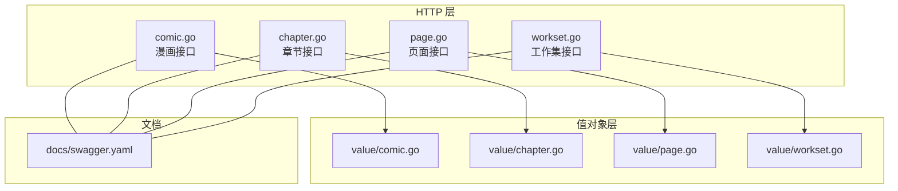
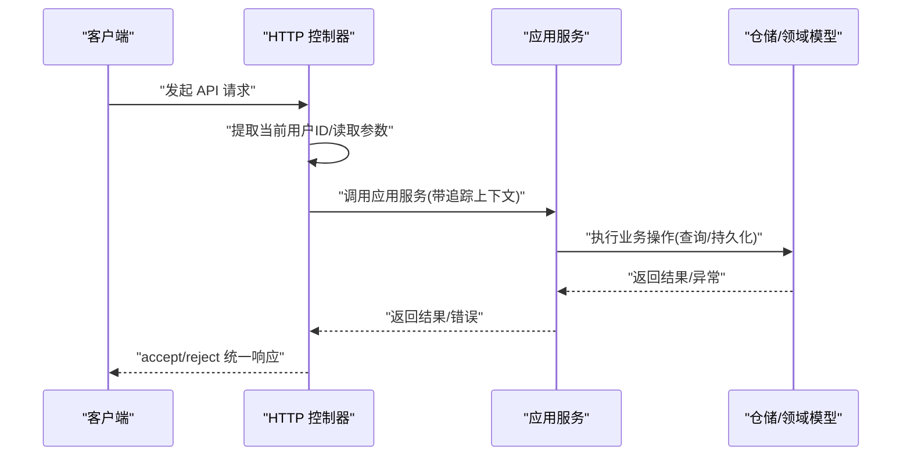
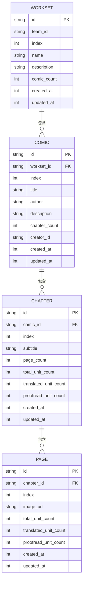

# 漫画内容 API

<cite>
**本文引用的文件**
- [backend/internal/api/http/comic.go](file://backend/internal/api/http/comic.go)
- [backend/internal/api/http/chapter.go](file://backend/internal/api/http/chapter.go)
- [backend/internal/api/http/page.go](file://backend/internal/api/http/page.go)
- [backend/internal/api/http/workset.go](file://backend/internal/api/http/workset.go)
- [backend/docs/swagger.yaml](file://backend/docs/swagger.yaml)
- [backend/internal/value/comic.go](file://backend/internal/value/comic.go)
- [backend/internal/value/chapter.go](file://backend/internal/value/chapter.go)
- [backend/internal/value/page.go](file://backend/internal/value/page.go)
- [backend/internal/value/workset.go](file://backend/internal/value/workset.go)
</cite>

## 目录
1. [简介](#简介)
2. [项目结构](#项目结构)
3. [核心组件](#核心组件)
4. [架构总览](#架构总览)
5. [详细组件分析](#详细组件分析)
6. [依赖分析](#依赖分析)
7. [性能考虑](#性能考虑)
8. [故障排查指南](#故障排查指南)
9. [结论](#结论)
10. [附录](#附录)

## 简介
本文件为“漫画内容管理模块”的详细 API 文档，覆盖以下能力范围：
- 漫画作品管理：创建、查询、更新、删除
- 章节管理：列表查询、创建、更新、删除
- 页面管理：列表查询、批量预留页面并获取预签名上传地址、页面更新、删除章节全部页面
- 工作集管理：列表查询、创建、更新、删除
- 发布流程与工作流状态：章节层面的上传、翻译、校对、排版、审阅、发布等状态流转
- 权限与访问控制：基于 ApiKey 的鉴权、资源可见性与操作权限
- 批量操作与最佳实践：批量预留页面、分页查询、include 关联加载

## 项目结构
后端采用分层架构，HTTP 层负责路由与参数解析，应用层负责业务编排，值对象用于接口契约与参数校验。

图表来源
- [backend/internal/api/http/comic.go:1-189](file://backend/internal/api/http/comic.go#L1-L189)
- [backend/internal/api/http/chapter.go:1-185](file://backend/internal/api/http/chapter.go#L1-L185)
- [backend/internal/api/http/page.go:1-189](file://backend/internal/api/http/page.go#L1-L189)
- [backend/internal/api/http/workset.go:1-189](file://backend/internal/api/http/workset.go#L1-L189)
- [backend/docs/swagger.yaml:1-1872](file://backend/docs/swagger.yaml#L1-L1872)
- [backend/internal/value/comic.go:1-124](file://backend/internal/value/comic.go#L1-L124)
- [backend/internal/value/chapter.go:1-148](file://backend/internal/value/chapter.go#L1-L148)
- [backend/internal/value/page.go:1-95](file://backend/internal/value/page.go#L1-L95)
- [backend/internal/value/workset.go:1-89](file://backend/internal/value/workset.go#L1-L89)

章节来源
- [backend/internal/api/http/comic.go:1-189](file://backend/internal/api/http/comic.go#L1-L189)
- [backend/internal/api/http/chapter.go:1-185](file://backend/internal/api/http/chapter.go#L1-L185)
- [backend/internal/api/http/page.go:1-189](file://backend/internal/api/http/page.go#L1-L189)
- [backend/internal/api/http/workset.go:1-189](file://backend/internal/api/http/workset.go#L1-L189)
- [backend/docs/swagger.yaml:1-1872](file://backend/docs/swagger.yaml#L1-L1872)
- [backend/internal/value/comic.go:1-124](file://backend/internal/value/comic.go#L1-L124)
- [backend/internal/value/chapter.go:1-148](file://backend/internal/value/chapter.go#L1-L148)
- [backend/internal/value/page.go:1-95](file://backend/internal/value/page.go#L1-L95)
- [backend/internal/value/workset.go:1-89](file://backend/internal/value/workset.go#L1-L89)

## 核心组件
- HTTP 控制器：封装路由、鉴权、参数解析、错误处理与响应包装
- 值对象（value.*）：定义请求/响应模型、分页参数、校验逻辑
- 文档（Swagger）：统一的 API 规范与数据模型定义

章节来源
- [backend/internal/api/http/comic.go:10-52](file://backend/internal/api/http/comic.go#L10-L52)
- [backend/internal/api/http/chapter.go:10-52](file://backend/internal/api/http/chapter.go#L10-L52)
- [backend/internal/api/http/page.go:10-52](file://backend/internal/api/http/page.go#L10-L52)
- [backend/internal/api/http/workset.go:10-52](file://backend/internal/api/http/workset.go#L10-L52)
- [backend/docs/swagger.yaml:1-1872](file://backend/docs/swagger.yaml#L1-L1872)

## 架构总览
HTTP 层接收请求，提取当前用户 ID，读取查询参数或请求体，调用应用服务执行业务逻辑，最终以统一的 accept/reject 包装响应返回。

图表来源
- [backend/internal/api/http/comic.go:25-51](file://backend/internal/api/http/comic.go#L25-L51)
- [backend/internal/api/http/chapter.go:25-51](file://backend/internal/api/http/chapter.go#L25-L51)
- [backend/internal/api/http/page.go:25-51](file://backend/internal/api/http/page.go#L25-L51)
- [backend/internal/api/http/workset.go:25-51](file://backend/internal/api/http/workset.go#L25-L51)

## 详细组件分析

### 工作集管理 API
- 列表查询
  - 方法与路径：GET /worksets
  - 认证：ApiKeyAuth
  - 查询参数：
    - team_id：汉化组 ID（必填）
    - includes[]：可选，支持包含 team
    - offset、limit：分页
  - 响应：WorksetInfo 数组或 null
- 创建
  - 方法与路径：POST /worksets
  - 请求体：CreateWorksetArgs（team_id、name、description）
  - 响应：CreateWorksetResult
- 更新
  - 方法与路径：PUT /worksets/{workset_id}
  - 路径参数：workset_id
  - 请求体：UpdateWorksetArgs（id、name、description）
  - 响应：200
- 删除
  - 方法与路径：DELETE /worksets/{workset_id}
  - 路径参数：workset_id
  - 响应：200

请求/响应要点
- includes 支持嵌套关联信息加载
- 分页参数统一校验
- 更新采用 PUT 语义，未传字段不更新

章节来源
- [backend/internal/api/http/workset.go:10-52](file://backend/internal/api/http/workset.go#L10-L52)
- [backend/internal/api/http/workset.go:54-95](file://backend/internal/api/http/workset.go#L54-L95)
- [backend/internal/api/http/workset.go:97-148](file://backend/internal/api/http/workset.go#L97-L148)
- [backend/internal/api/http/workset.go:150-189](file://backend/internal/api/http/workset.go#L150-L189)
- [backend/docs/swagger.yaml:1-1872](file://backend/docs/swagger.yaml#L1-L1872)
- [backend/internal/value/workset.go:22-43](file://backend/internal/value/workset.go#L22-L43)
- [backend/internal/value/workset.go:45-65](file://backend/internal/value/workset.go#L45-L65)
- [backend/internal/value/workset.go:71-89](file://backend/internal/value/workset.go#L71-L89)

### 漫画作品管理 API
- 列表查询
  - 方法与路径：GET /comics
  - 查询参数：
    - workset_id：工作集 ID（必填）
    - includes[]：可选，支持包含 workset、creator
    - offset、limit：分页
  - 响应：ComicInfo 数组或 null
- 创建
  - 方法与路径：POST /comics
  - 请求体：CreateComicArgs（workset_id、title、author、description）
  - 响应：CreateComicResult
- 更新
  - 方法与路径：PUT /comics/{comic_id}
  - 路径参数：comic_id
  - 请求体：UpdateComicArgs（id、title、author、description）
  - 响应：200
- 删除
  - 方法与路径：DELETE /comics/{comic_id}
  - 路径参数：comic_id
  - 响应：200

请求/响应要点
- 标题、作者、描述长度均有约束
- 更新时需确保请求体 ID 与路径一致

章节来源
- [backend/internal/api/http/comic.go:10-52](file://backend/internal/api/http/comic.go#L10-L52)
- [backend/internal/api/http/comic.go:54-95](file://backend/internal/api/http/comic.go#L54-L95)
- [backend/internal/api/http/comic.go:97-148](file://backend/internal/api/http/comic.go#L97-L148)
- [backend/internal/api/http/comic.go:150-189](file://backend/internal/api/http/comic.go#L150-L189)
- [backend/docs/swagger.yaml:1-1872](file://backend/docs/swagger.yaml#L1-L1872)
- [backend/internal/value/comic.go:30-51](file://backend/internal/value/comic.go#L30-L51)
- [backend/internal/value/comic.go:53-85](file://backend/internal/value/comic.go#L53-L85)
- [backend/internal/value/comic.go:91-124](file://backend/internal/value/comic.go#L91-L124)

### 章节管理 API
- 列表查询
  - 方法与路径：GET /chapters
  - 查询参数：
    - comic_id：漫画 ID（必填）
    - includes[]：可选，支持包含 creator
    - offset、limit：分页
  - 响应：ChapterInfo 数组或 null
- 创建
  - 方法与路径：POST /chapters
  - 请求体：CreateChapterArgs（comic_id、subtitle）
  - 响应：CreateChapterResult
- 更新
  - 方法与路径：PATCH /chapters/{chapter_id}
  - 路径参数：chapter_id
  - 请求体：UpdateChapterArgs（chapter_id、subtitle、upload_status、translate_status、proofread_status、typeset_status、review_status、publish_status）
  - 响应：200
- 删除
  - 方法与路径：DELETE /chapters/{chapter_id}
  - 路径参数：chapter_id
  - 响应：200

请求/响应要点
- 支持多维工作流状态更新（上传、翻译、校对、排版、审阅、发布）
- 状态变更需满足合法组合规则

章节来源
- [backend/internal/api/http/chapter.go:10-52](file://backend/internal/api/http/chapter.go#L10-L52)
- [backend/internal/api/http/chapter.go:54-95](file://backend/internal/api/http/chapter.go#L54-L95)
- [backend/internal/api/http/chapter.go:97-144](file://backend/internal/api/http/chapter.go#L97-L144)
- [backend/internal/api/http/chapter.go:146-185](file://backend/internal/api/http/chapter.go#L146-L185)
- [backend/docs/swagger.yaml:1-1872](file://backend/docs/swagger.yaml#L1-L1872)
- [backend/internal/value/chapter.go:41-61](file://backend/internal/value/chapter.go#L41-L61)
- [backend/internal/value/chapter.go:63-82](file://backend/internal/value/chapter.go#L63-L82)
- [backend/internal/value/chapter.go:88-106](file://backend/internal/value/chapter.go#L88-L106)
- [backend/internal/value/chapter.go:108-147](file://backend/internal/value/chapter.go#L108-L147)

### 页面管理 API
- 列表查询
  - 方法与路径：GET /pages
  - 查询参数：
    - chapter_id：章节 ID（必填）
    - includes[]：可选，支持包含 creator
    - offset、limit：分页
  - 响应：PageInfo 数组或 null
- 批量预留页面并获取预签名上传地址
  - 方法与路径：POST /pages
  - 请求体：ReserveChapterPagesArgs（chapter_id、page_count）
  - 响应：ReserveChapterPagesResult（含每个页面的 page_id 与 put_url）
- 更新页面
  - 方法与路径：PUT /pages/{page_id}
  - 路径参数：page_id
  - 请求体：UpdatePageArgs（id、is_uploaded）
  - 响应：200
- 删除章节所有页面
  - 方法与路径：DELETE /pages/{chapter_id}
  - 路径参数：chapter_id
  - 响应：200

请求/响应要点
- 采用预签名上传，客户端上传完成后需调用更新接口标记上传完成
- 批量预留返回每个页面独立的上传地址

章节来源
- [backend/internal/api/http/page.go:10-52](file://backend/internal/api/http/page.go#L10-L52)
- [backend/internal/api/http/page.go:54-95](file://backend/internal/api/http/page.go#L54-L95)
- [backend/internal/api/http/page.go:97-148](file://backend/internal/api/http/page.go#L97-L148)
- [backend/internal/api/http/page.go:150-189](file://backend/internal/api/http/page.go#L150-L189)
- [backend/docs/swagger.yaml:1-1872](file://backend/docs/swagger.yaml#L1-L1872)
- [backend/internal/value/page.go:7-26](file://backend/internal/value/page.go#L7-L26)
- [backend/internal/value/page.go#L28-L35)
- [backend/internal/value/page.go#L37-L54)
- [backend/internal/value/page.go#L74-L94)

### 数据模型与参数校验
- ComicInfo：漫画基本信息，包含索引、标题、作者、描述、章节计数、创建者、时间戳等
- ChapterInfo：章节信息，包含索引、副标题、页面数与单元统计、各阶段时间戳、创建者、时间戳等
- PageInfo：页面信息，包含章节 ID、索引、创建者、图片 URL、单元统计、时间戳等
- WorksetInfo：工作集信息，包含团队 ID、索引、名称、描述、漫画计数、时间戳等
- 分页参数：PaginationParams（offset、limit），统一校验
- 校验规则：
  - 标题长度 1~100 字符
  - 作者长度 1~50 字符
  - 描述长度不超过 500 字符
  - 页面数量必须大于 0
  - 章节副标题长度不超过 10 字符
  - 工作集名称不能为空
  - 汉化组 ID、漫画 ID、章节 ID、页面 ID 等关键标识不能为空

章节来源
- [backend/internal/value/comic.go:8-28](file://backend/internal/value/comic.go#L8-L28)
- [backend/internal/value/comic.go:30-51](file://backend/internal/value/comic.go#L30-L51)
- [backend/internal/value/comic.go:53-85](file://backend/internal/value/comic.go#L53-L85)
- [backend/internal/value/comic.go:91-124](file://backend/internal/value/comic.go#L91-L124)
- [backend/internal/value/chapter.go:10-39](file://backend/internal/value/chapter.go#L10-L39)
- [backend/internal/value/chapter.go:41-61](file://backend/internal/value/chapter.go#L41-L61)
- [backend/internal/value/chapter.go:63-82](file://backend/internal/value/chapter.go#L63-L82)
- [backend/internal/value/chapter.go:88-106](file://backend/internal/value/chapter.go#L88-L106)
- [backend/internal/value/page.go:56-72](file://backend/internal/value/page.go#L56-L72)
- [backend/internal/value/page.go:74-94](file://backend/internal/value/page.go#L74-L94)
- [backend/internal/value/workset.go:7-20](file://backend/internal/value/workset.go#L7-L20)
- [backend/internal/value/workset.go:22-43](file://backend/internal/value/workset.go#L22-L43)
- [backend/internal/value/workset.go:45-65](file://backend/internal/value/workset.go#L45-L65)
- [backend/internal/value/workset.go:71-89](file://backend/internal/value/workset.go#L71-L89)

## 依赖分析
- HTTP 控制器依赖值对象进行参数解析与校验
- Swagger 文档统一描述了所有接口、数据模型与枚举
- 工作集与漫画存在一对多关系，漫画与章节存在一对多关系，章节与页面存在一对多关系

图表来源
- [backend/docs/swagger.yaml:1-1872](file://backend/docs/swagger.yaml#L1-L1872)
- [backend/internal/value/workset.go:7-20](file://backend/internal/value/workset.go#L7-L20)
- [backend/internal/value/comic.go:8-28](file://backend/internal/value/comic.go#L8-L28)
- [backend/internal/value/chapter.go:10-39](file://backend/internal/value/chapter.go#L10-L39)
- [backend/internal/value/page.go:56-72](file://backend/internal/value/page.go#L56-L72)

## 性能考虑
- 分页查询：合理设置 offset 与 limit，避免一次性拉取大量数据
- include 关联：按需启用，避免不必要的 N+1 查询
- 批量预留页面：根据章节规模批量申请，减少多次往返
- 预签名上传：客户端直传对象存储，降低服务端带宽压力

## 故障排查指南
常见错误与定位建议
- 参数格式错误：检查请求体 JSON 结构与字段类型
- 查询参数无效：确认分页参数与必填项
- 权限不足：确认 ApiKey 是否有效、当前用户是否属于目标团队/拥有相应角色
- 状态更新非法：核对工作流状态枚举与组合规则
- 上传未完成：确认客户端上传后调用了页面更新接口标记 is_uploaded

章节来源
- [backend/internal/api/http/comic.go:34-50](file://backend/internal/api/http/comic.go#L34-L50)
- [backend/internal/api/http/chapter.go:34-51](file://backend/internal/api/http/chapter.go#L34-L51)
- [backend/internal/api/http/page.go:34-51](file://backend/internal/api/http/page.go#L34-L51)
- [backend/internal/api/http/workset.go:34-51](file://backend/internal/api/http/workset.go#L34-L51)
- [backend/internal/value/chapter.go:108-147](file://backend/internal/value/chapter.go#L108-L147)
- [backend/internal/value/page.go:37-54](file://backend/internal/value/page.go#L37-L54)

## 结论
本模块提供了完整的漫画内容生命周期管理能力，涵盖工作集、漫画、章节、页面的增删改查与批量操作，并通过预签名上传与工作流状态实现高效协作。建议在生产环境中严格遵循参数校验、分页策略与权限控制，结合 Swagger 文档进行集成与测试。

## 附录

### 发布流程与工作流状态
- 章节工作流状态（部分）：上传、翻译、校对、排版、审阅、发布
- 更新接口支持局部更新任一状态字段，状态变更需满足合法组合规则
- 页面上传完成后需调用更新接口标记完成

章节来源
- [backend/docs/swagger.yaml:1-1872](file://backend/docs/swagger.yaml#L1-L1872)
- [backend/internal/value/chapter.go:88-106](file://backend/internal/value/chapter.go#L88-L106)
- [backend/internal/value/chapter.go:108-147](file://backend/internal/value/chapter.go#L108-L147)
- [backend/internal/value/page.go:37-42](file://backend/internal/value/page.go#L37-L42)

### 权限与访问控制
- 所有受保护接口均要求 ApiKeyAuth
- 操作权限与资源归属由应用层与仓储层共同保证（例如仅团队成员可访问）

章节来源
- [backend/internal/api/http/comic.go:15-16](file://backend/internal/api/http/comic.go#L15-L16)
- [backend/internal/api/http/chapter.go:14-16](file://backend/internal/api/http/chapter.go#L14-L16)
- [backend/internal/api/http/page.go:14-16](file://backend/internal/api/http/page.go#L14-L16)
- [backend/internal/api/http/workset.go:14-16](file://backend/internal/api/http/workset.go#L14-L16)
- [backend/docs/swagger.yaml:1-1872](file://backend/docs/swagger.yaml#L1-L1872)