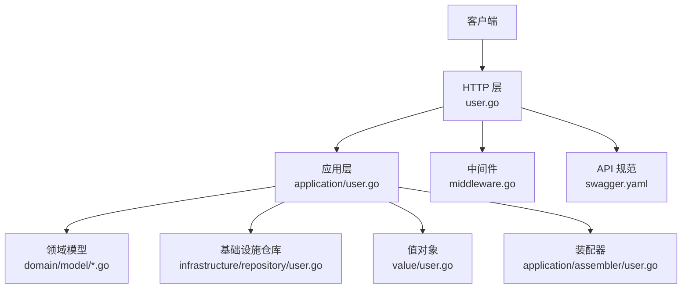
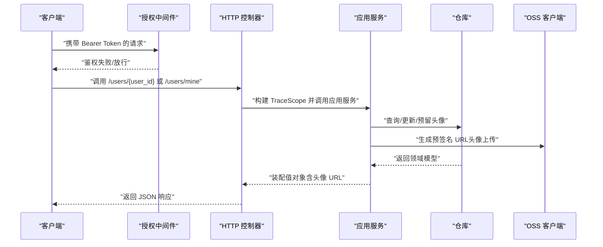
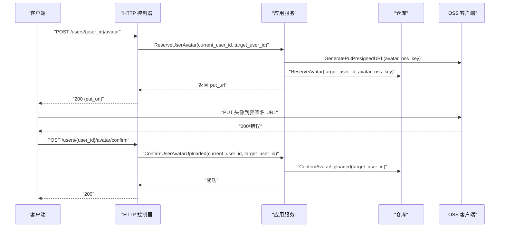
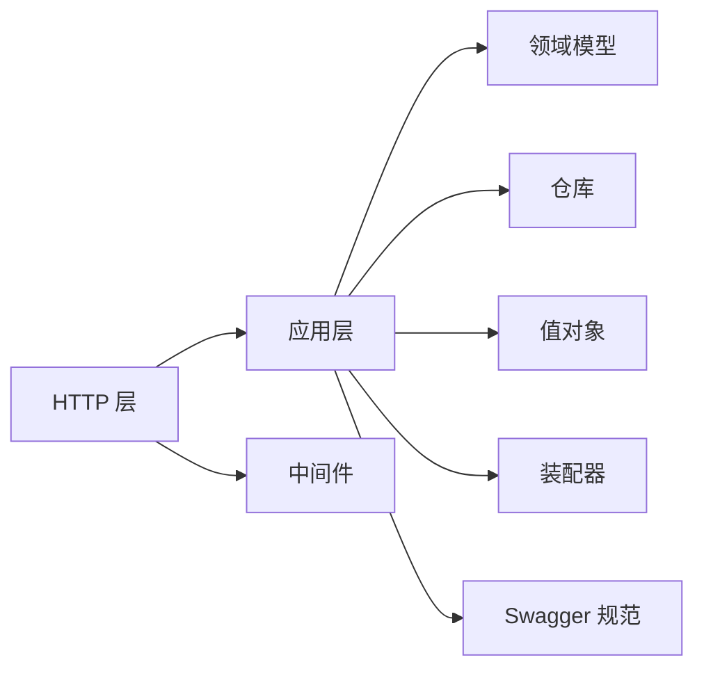

# 用户管理 API

<cite>
**本文引用的文件**
- [backend-v1/internal/api/http/user.go](file://backend/backend-v1/internal/api/http/user.go)
- [backend-v1/internal/application/user.go](file://backend/backend-v1/internal/application/user.go)
- [backend-v1/internal/application/assembler/user.go](file://backend/backend-v1/internal/application/assembler/user.go)
- [backend-v1/internal/infrastructure/repository/user.go](file://backend/backend-v1/internal/infrastructure/repository/user.go)
- [backend-v1/internal/value/user.go](file://backend/backend-v1/internal/value/user.go)
- [backend-v1/internal/api/http/auth.go](file://backend/backend-v1/internal/api/http/auth.go)
- [backend-v1/internal/api/http/middleware.go](file://backend/backend-v1/internal/api/http/middleware.go)
- [backend-v1/internal/domain/model/permission.go](file://backend/backend-v1/internal/domain/model/permission.go)
- [backend-v1/internal/domain/model/user.go](file://backend/backend-v1/internal/domain/model/user.go)
- [backend-v1/docs/swagger.yaml](file://backend/backend-v1/docs/swagger.yaml)
- [backend-v1/internal/config/config.go](file://backend/backend-v1/internal/config/config.go)
</cite>

## 目录
1. [简介](#简介)
2. [项目结构](#项目结构)
3. [核心组件](#核心组件)
4. [架构总览](#架构总览)
5. [详细组件分析](#详细组件分析)
6. [依赖分析](#依赖分析)
7. [性能考虑](#性能考虑)
8. [故障排查指南](#故障排查指南)
9. [结论](#结论)
10. [附录](#附录)

## 简介
本文件为“用户管理”模块的完整 API 文档，覆盖以下能力：
- 获取当前登录用户信息（/users/mine）
- 根据用户 ID 获取用户详情（/users/{user_id}）
- 更新用户资料（PUT /users/{user_id}）
- 头像上传预留与确认流程（POST /users/{user_id}/avatar、POST /users/{user_id}/avatar/confirm）
- 权限验证机制与数据安全策略
- 请求/响应规范、错误处理与最佳实践

## 项目结构
用户管理相关代码位于后端子项目 backend-v1 中，采用分层架构：
- HTTP 层：路由定义与请求/响应封装
- 应用层：业务编排与权限校验
- 领域模型：用户实体与权限模型
- 基础设施：数据库仓库与 OSS 客户端
- 值对象：对外暴露的数据结构与参数校验

图表来源
- [backend-v1/internal/api/http/user.go:1-292](file://backend/backend-v1/internal/api/http/user.go#L1-L292)
- [backend-v1/internal/application/user.go:1-594](file://backend/backend-v1/internal/application/user.go#L1-L594)
- [backend-v1/internal/domain/model/permission.go:248-300](file://backend/backend-v1/internal/domain/model/permission.go#L248-L300)
- [backend-v1/internal/infrastructure/repository/user.go:1-150](file://backend/backend-v1/internal/infrastructure/repository/user.go#L1-L150)
- [backend-v1/internal/value/user.go:1-171](file://backend/backend-v1/internal/value/user.go#L1-L171)
- [backend-v1/internal/application/assembler/user.go:1-34](file://backend/backend-v1/internal/application/assembler/user.go#L1-L34)
- [backend-v1/internal/api/http/middleware.go:1-80](file://backend/backend-v1/internal/api/http/middleware.go#L1-L80)
- [backend-v1/docs/swagger.yaml:644-700](file://backend/backend-v1/docs/swagger.yaml#L644-L700)

章节来源
- [backend-v1/internal/api/http/user.go:1-292](file://backend/backend-v1/internal/api/http/user.go#L1-L292)
- [backend-v1/internal/application/user.go:1-594](file://backend/backend-v1/internal/application/user.go#L1-L594)

## 核心组件
- HTTP 控制器：负责路由、参数解析、鉴权中间件接入与响应封装
- 应用服务：执行业务逻辑、权限校验、调用仓库与外部服务
- 领域模型：用户信息、权限模型与角色掩码
- 值对象：对外暴露的用户信息结构、参数校验与结果结构
- 装配器：将领域模型转换为对外值对象，处理头像 URL 生成
- 基础设施仓库：数据库操作（查询、插入、更新、软删除等）

章节来源
- [backend-v1/internal/api/http/user.go:1-292](file://backend/backend-v1/internal/api/http/user.go#L1-L292)
- [backend-v1/internal/application/user.go:21-104](file://backend/backend-v1/internal/application/user.go#L21-L104)
- [backend-v1/internal/domain/model/user.go:1-100](file://backend/backend-v1/internal/domain/model/user.go#L1-L100)
- [backend-v1/internal/value/user.go:76-171](file://backend/backend-v1/internal/value/user.go#L76-L171)
- [backend-v1/internal/application/assembler/user.go:10-34](file://backend/backend-v1/internal/application/assembler/user.go#L10-L34)
- [backend-v1/internal/infrastructure/repository/user.go:54-150](file://backend/backend-v1/internal/infrastructure/repository/user.go#L54-L150)

## 架构总览
用户管理 API 的调用链路如下：

图表来源
- [backend-v1/internal/api/http/user.go:22-48](file://backend/backend-v1/internal/api/http/user.go#L22-L48)
- [backend-v1/internal/application/user.go:280-361](file://backend/backend-v1/internal/application/user.go#L280-L361)
- [backend-v1/internal/infrastructure/repository/user.go:108-140](file://backend/backend-v1/internal/infrastructure/repository/user.go#L108-L140)
- [backend-v1/internal/application/assembler/user.go:10-34](file://backend/backend-v1/internal/application/assembler/user.go#L10-L34)
- [backend-v1/internal/api/http/middleware.go:47-80](file://backend/backend-v1/internal/api/http/middleware.go#L47-L80)

## 详细组件分析

### 1) 获取当前用户信息（/users/mine）
- 方法与路径：GET /users/mine
- 权限：需携带有效 Bearer Token
- 功能：返回当前登录用户信息（含头像 URL）
- 参数：无
- 成功响应：200，返回值对象 UserInfo
- 错误响应：401 未授权，403 禁止访问（如权限不足）

请求示例
- 请求头：Authorization: Bearer <access_token>
- 响应体字段：id、name、qq、avatar_url、is_avatar_uploaded、is_super_admin、created_at、updated_at

章节来源
- [backend-v1/internal/api/http/user.go:263-291](file://backend/backend-v1/internal/api/http/user.go#L263-L291)
- [backend-v1/internal/application/user.go:321-361](file://backend/backend-v1/internal/application/user.go#L321-L361)
- [backend-v1/internal/application/assembler/user.go:10-34](file://backend/backend-v1/internal/application/assembler/user.go#L10-L34)
- [backend-v1/internal/value/user.go:76-89](file://backend/backend-v1/internal/value/user.go#L76-L89)

### 2) 根据用户 ID 获取用户详情（/users/{user_id}）
- 方法与路径：GET /users/{user_id}
- 路径参数：user_id（目标用户 ID）
- 查询参数：无
- 权限：普通用户仅可查看自己；超级管理员可查看任意用户
- 成功响应：200，返回值对象 UserInfo
- 错误响应：400 缺少参数/参数错误，403 禁止访问，500 服务器内部错误

请求示例
- 请求头：Authorization: Bearer <access_token>
- 响应体字段：id、name、qq、avatar_url、is_avatar_uploaded、is_super_admin、created_at、updated_at

章节来源
- [backend-v1/internal/api/http/user.go:10-49](file://backend/backend-v1/internal/api/http/user.go#L10-L49)
- [backend-v1/internal/application/user.go:280-319](file://backend/backend-v1/internal/application/user.go#L280-L319)
- [backend-v1/internal/domain/model/permission.go:267-275](file://backend/backend-v1/internal/domain/model/permission.go#L267-L275)

### 3) 更新用户资料（PUT /users/{user_id}）
- 方法与路径：PUT /users/{user_id}
- 路径参数：user_id（目标用户 ID）
- 请求体：UpdateUserArgs（name、qq、password）
- 权限：用户本人或超级管理员
- 成功响应：200，无响应体
- 错误响应：400 参数错误/业务错误，403 禁止访问

请求示例
- 请求头：Authorization: Bearer <access_token>
- 请求体：{ "user_id": "...", "name": "...", "qq": "...", "password": "..." }

章节来源
- [backend-v1/internal/api/http/user.go:177-225](file://backend/backend-v1/internal/api/http/user.go#L177-L225)
- [backend-v1/internal/application/user.go:470-519](file://backend/backend-v1/internal/application/user.go#L470-L519)
- [backend-v1/internal/value/user.go:122-171](file://backend/backend-v1/internal/value/user.go#L122-L171)
- [backend-v1/internal/domain/model/permission.go:277-287](file://backend/backend-v1/internal/domain/model/permission.go#L277-L287)

### 4) 头像上传预留与确认流程
- 预留头像上传（POST /users/{user_id}/avatar）
  - 功能：为指定用户生成预签名 PUT URL，并预留 avatar_oss_key
  - 权限：用户本人或超级管理员
  - 成功响应：200，返回 ReserveUserAvatarResult.put_url
  - 错误响应：400 参数错误/业务错误，403 禁止访问

- 确认头像已上传（POST /users/{user_id}/avatar/confirm）
  - 功能：客户端上传完成后，调用此接口确认头像状态
  - 权限：用户本人或超级管理员
  - 成功响应：200，无响应体
  - 错误响应：400 参数错误/业务错误，403 禁止访问

图表来源
- [backend-v1/internal/api/http/user.go:96-175](file://backend/backend-v1/internal/api/http/user.go#L96-L175)
- [backend-v1/internal/application/user.go:426-555](file://backend/backend-v1/internal/application/user.go#L426-L555)
- [backend-v1/internal/infrastructure/repository/user.go:108-127](file://backend/backend-v1/internal/infrastructure/repository/user.go#L108-L127)

章节来源
- [backend-v1/internal/api/http/user.go:96-175](file://backend/backend-v1/internal/api/http/user.go#L96-L175)
- [backend-v1/internal/application/user.go:426-555](file://backend/backend-v1/internal/application/user.go#L426-L555)
- [backend-v1/internal/infrastructure/repository/user.go:108-127](file://backend/backend-v1/internal/infrastructure/repository/user.go#L108-L127)

### 5) 用户 ID 获取与用户详情查询
- 用户 ID 获取：通过 /users/mine 获取当前登录用户 ID
- 用户详情查询：通过 /users/{user_id} 获取指定用户详情
- 注意：普通用户仅能查看自己的信息；超级管理员可查看任意用户

章节来源
- [backend-v1/internal/api/http/user.go:10-49](file://backend/backend-v1/internal/api/http/user.go#L10-L49)
- [backend-v1/internal/api/http/user.go:263-291](file://backend/backend-v1/internal/api/http/user.go#L263-L291)
- [backend-v1/internal/application/user.go:280-361](file://backend/backend-v1/internal/application/user.go#L280-L361)

## 依赖分析
- HTTP 层依赖应用层；应用层依赖领域模型、仓库与外部服务（OSS）；值对象用于参数校验与对外输出；装配器负责将领域模型转换为对外值对象
- 权限模型提供统一的权限判定入口，应用层在关键操作前进行权限检查
- 中间件负责鉴权，将用户 ID 注入上下文供后续处理使用

图表来源
- [backend-v1/internal/api/http/user.go:1-292](file://backend/backend-v1/internal/api/http/user.go#L1-L292)
- [backend-v1/internal/application/user.go:1-594](file://backend/backend-v1/internal/application/user.go#L1-L594)
- [backend-v1/internal/domain/model/permission.go:248-300](file://backend/backend-v1/internal/domain/model/permission.go#L248-L300)
- [backend-v1/internal/application/assembler/user.go:1-34](file://backend/backend-v1/internal/application/assembler/user.go#L1-L34)
- [backend-v1/docs/swagger.yaml:644-700](file://backend/backend-v1/docs/swagger.yaml#L644-L700)

章节来源
- [backend-v1/internal/api/http/user.go:1-292](file://backend/backend-v1/internal/api/http/user.go#L1-L292)
- [backend-v1/internal/application/user.go:1-594](file://backend/backend-v1/internal/application/user.go#L1-L594)
- [backend-v1/internal/domain/model/permission.go:248-300](file://backend/backend-v1/internal/domain/model/permission.go#L248-L300)

## 性能考虑
- 头像 URL 生成采用预签名方式，避免将敏感凭据暴露给客户端
- 查询用户信息时，装配器在生成头像 URL 失败时仅记录日志并返回空 URL，保证主流程不受影响
- 数据库层使用带过滤条件的查询与更新，避免不必要的扫描

## 故障排查指南
常见错误与处理建议
- 400 参数错误
  - 检查请求体格式与必填字段是否满足参数校验规则
  - 参考参数校验定义：登录、注册、更新用户等
- 401 未授权
  - 确认 Authorization 头部格式为 Bearer <token>，且 token 未过期
  - 确认 JWT_SECRET_KEY 环境变量已正确配置
- 403 禁止访问
  - 检查当前用户是否具备目标资源的操作权限（如查看他人信息、更新他人资料、删除用户）
  - 确认超级管理员身份或操作对象为本人
- 500 服务器内部错误
  - 查看服务端日志定位具体异常；关注仓库层与外部服务调用失败情况

章节来源
- [backend-v1/internal/api/http/user.go:34-44](file://backend/backend-v1/internal/api/http/user.go#L34-L44)
- [backend-v1/internal/api/http/middleware.go:50-78](file://backend/backend-v1/internal/api/http/middleware.go#L50-L78)
- [backend-v1/internal/config/config.go:74-83](file://backend/backend-v1/internal/config/config.go#L74-L83)
- [backend-v1/internal/application/user.go:294-301](file://backend/backend-v1/internal/application/user.go#L294-L301)

## 结论
用户管理模块通过清晰的分层设计与严格的权限控制，提供了安全、稳定的用户信息获取、资料更新与头像上传能力。配合预签名 URL 与参数校验，既保障了用户体验，也强化了数据安全。

## 附录

### A. 权限验证机制与数据安全
- 鉴权中间件
  - 从 Authorization 头部提取 Bearer Token
  - 解析并校验 JWT，注入用户 ID 至上下文
- 权限模型
  - 查看用户：普通用户仅可查看自己；超级管理员可查看任意用户
  - 更新用户：用户本人或超级管理员
  - 删除用户：仅超级管理员，且不可删除自己
- 数据安全
  - 头像上传采用预签名 URL，避免泄露密钥
  - 用户凭证仅用于登录校验，不对外暴露
  - 密码在更新时进行哈希处理

章节来源
- [backend-v1/internal/api/http/middleware.go:47-80](file://backend/backend-v1/internal/api/http/middleware.go#L47-L80)
- [backend-v1/internal/domain/model/permission.go:267-300](file://backend/backend-v1/internal/domain/model/permission.go#L267-L300)
- [backend-v1/internal/domain/model/user.go:43-54](file://backend/backend-v1/internal/domain/model/user.go#L43-L54)
- [backend-v1/internal/application/user.go:500-504](file://backend/backend-v1/internal/application/user.go#L500-L504)

### B. API 规范与示例（摘要）
- 获取当前用户信息
  - 方法：GET /users/mine
  - 成功响应：200，返回 UserInfo
- 获取用户详情
  - 方法：GET /users/{user_id}
  - 成功响应：200，返回 UserInfo
- 更新用户资料
  - 方法：PUT /users/{user_id}
  - 请求体：UpdateUserArgs
  - 成功响应：200
- 预留头像上传
  - 方法：POST /users/{user_id}/avatar
  - 成功响应：200，返回 put_url
- 确认头像上传
  - 方法：POST /users/{user_id}/avatar/confirm
  - 成功响应：200

章节来源
- [backend-v1/docs/swagger.yaml:644-700](file://backend/backend-v1/docs/swagger.yaml#L644-L700)
- [backend-v1/internal/api/http/user.go:10-49](file://backend/backend-v1/internal/api/http/user.go#L10-L49)
- [backend-v1/internal/api/http/user.go:96-175](file://backend/backend-v1/internal/api/http/user.go#L96-L175)
- [backend-v1/internal/api/http/user.go:177-225](file://backend/backend-v1/internal/api/http/user.go#L177-L225)
- [backend-v1/internal/api/http/user.go:263-291](file://backend/backend-v1/internal/api/http/user.go#L263-L291)