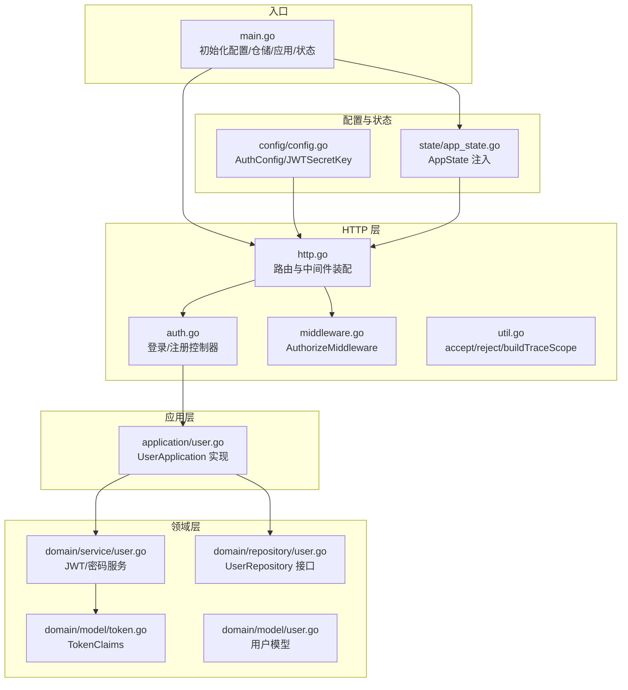
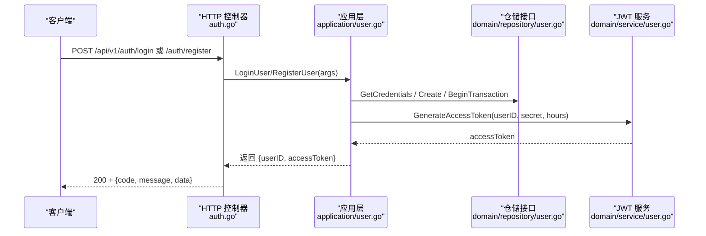
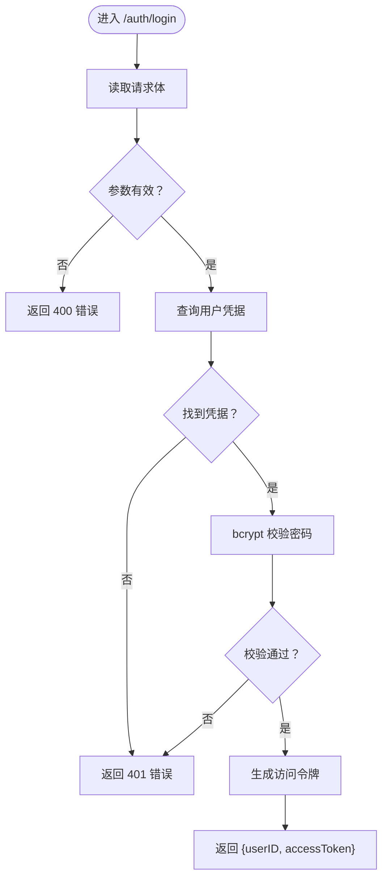
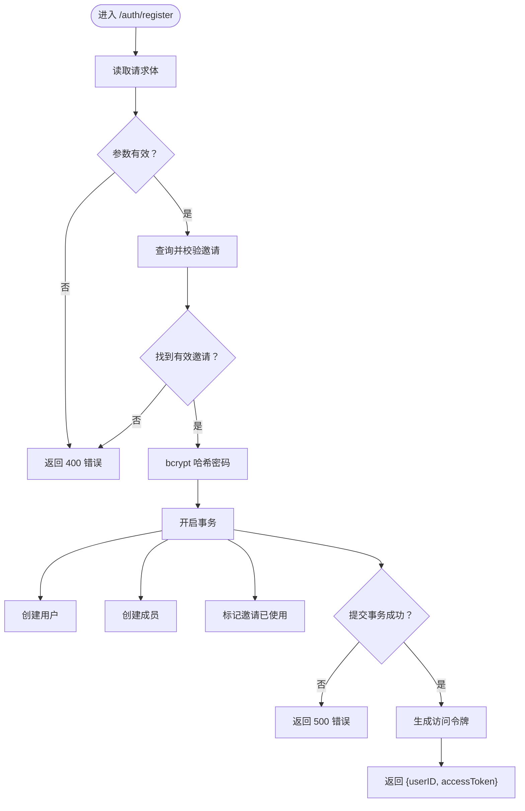
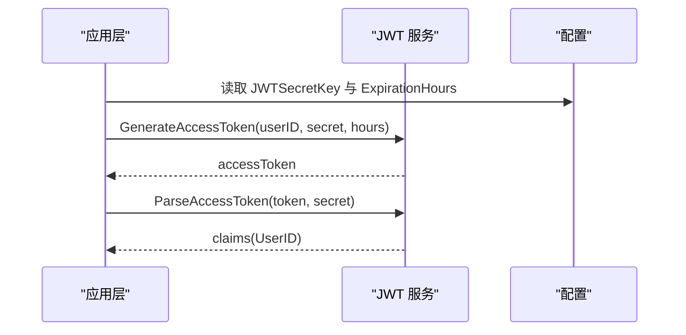
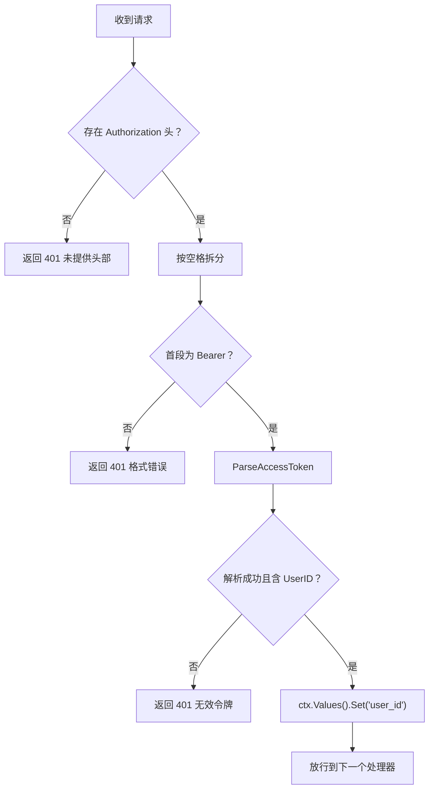
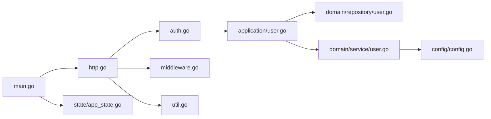

# 认证 API

<cite>
**本文引用的文件**
- [backend/backend-v1/internal/api/http/auth.go](file://backend/backend-v1/internal/api/http/auth.go)
- [backend/backend-v1/internal/api/http/http.go](file://backend/backend-v1/internal/api/http/http.go)
- [backend/backend-v1/internal/api/http/middleware.go](file://backend/backend-v1/internal/api/http/middleware.go)
- [backend/backend-v1/internal/api/http/util.go](file://backend/backend-v1/internal/api/http/util.go)
- [backend/backend-v1/internal/application/user.go](file://backend/backend-v1/internal/application/user.go)
- [backend/backend-v1/internal/domain/service/user.go](file://backend/backend-v1/internal/domain/service/user.go)
- [backend/backend-v1/internal/domain/model/token.go](file://backend/backend-v1/internal/domain/model/token.go)
- [backend/backend-v1/internal/domain/model/user.go](file://backend/backend-v1/internal/domain/model/user.go)
- [backend/backend-v1/internal/domain/repository/user.go](file://backend/backend-v1/internal/domain/repository/user.go)
- [backend/backend-v1/internal/config/config.go](file://backend/backend-v1/internal/config/config.go)
- [backend/backend-v1/internal/state/app_state.go](file://backend/backend-v1/internal/state/app_state.go)
- [backend/backend-v1/main.go](file://backend/backend-v1/main.go)
</cite>

## 目录
1. [简介](#简介)
2. [项目结构](#项目结构)
3. [核心组件](#核心组件)
4. [架构总览](#架构总览)
5. [详细组件分析](#详细组件分析)
6. [依赖分析](#依赖分析)
7. [性能考虑](#性能考虑)
8. [故障排查指南](#故障排查指南)
9. [结论](#结论)
10. [附录](#附录)

## 简介
本文件为 Poprako 认证模块的详细 API 文档，聚焦于用户登录与注册两个核心端点：
- POST /api/v1/auth/login
- POST /api/v1/auth/register

内容涵盖：
- 请求参数与响应格式
- 完整认证流程与错误处理
- JWT 令牌生成、验证与刷新机制
- 实际请求/响应示例（以路径代替示例内容）
- 认证中间件工作原理与安全考量
- 客户端集成指南与最佳实践

## 项目结构
认证相关代码主要分布在以下层次：
- 表层 HTTP 层：路由定义、控制器、中间件与通用响应封装
- 应用层：用户应用服务，负责业务编排与事务控制
- 领域层：模型、服务（JWT、密码哈希）、仓储接口
- 配置与状态：应用配置、JWT 密钥、应用状态注入
- 入口：main 初始化各应用与仓储实例，启动 HTTP 服务器

**图表来源**
- [backend/backend-v1/main.go:25-146](file://backend/backend-v1/main.go#L25-L146)
- [backend/backend-v1/internal/api/http/http.go:26-151](file://backend/backend-v1/internal/api/http/http.go#L26-L151)
- [backend/backend-v1/internal/api/http/auth.go:10-73](file://backend/backend-v1/internal/api/http/auth.go#L10-L73)
- [backend/backend-v1/internal/api/http/middleware.go:47-80](file://backend/backend-v1/internal/api/http/middleware.go#L47-L80)
- [backend/backend-v1/internal/api/http/util.go:11-59](file://backend/backend-v1/internal/api/http/util.go#L11-L59)
- [backend/backend-v1/internal/application/user.go:106-278](file://backend/backend-v1/internal/application/user.go#L106-L278)
- [backend/backend-v1/internal/domain/service/user.go:15-93](file://backend/backend-v1/internal/domain/service/user.go#L15-L93)
- [backend/backend-v1/internal/domain/model/token.go:5-9](file://backend/backend-v1/internal/domain/model/token.go#L5-L9)
- [backend/backend-v1/internal/domain/model/user.go:7-100](file://backend/backend-v1/internal/domain/model/user.go#L7-L100)
- [backend/backend-v1/internal/domain/repository/user.go:5-16](file://backend/backend-v1/internal/domain/repository/user.go#L5-L16)
- [backend/backend-v1/internal/config/config.go:69-83](file://backend/backend-v1/internal/config/config.go#L69-L83)
- [backend/backend-v1/internal/state/app_state.go:8-50](file://backend/backend-v1/internal/state/app_state.go#L8-L50)

**章节来源**
- [backend/backend-v1/internal/api/http/http.go:26-151](file://backend/backend-v1/internal/api/http/http.go#L26-L151)
- [backend/backend-v1/internal/api/http/auth.go:10-73](file://backend/backend-v1/internal/api/http/auth.go#L10-L73)
- [backend/backend-v1/internal/api/http/middleware.go:47-80](file://backend/backend-v1/internal/api/http/middleware.go#L47-L80)
- [backend/backend-v1/internal/api/http/util.go:11-59](file://backend/backend-v1/internal/api/http/util.go#L11-L59)
- [backend/backend-v1/internal/application/user.go:106-278](file://backend/backend-v1/internal/application/user.go#L106-L278)
- [backend/backend-v1/internal/domain/service/user.go:15-93](file://backend/backend-v1/internal/domain/service/user.go#L15-L93)
- [backend/backend-v1/internal/domain/model/token.go:5-9](file://backend/backend-v1/internal/domain/model/token.go#L5-L9)
- [backend/backend-v1/internal/domain/model/user.go:7-100](file://backend/backend-v1/internal/domain/model/user.go#L7-L100)
- [backend/backend-v1/internal/domain/repository/user.go:5-16](file://backend/backend-v1/internal/domain/repository/user.go#L5-L16)
- [backend/backend-v1/internal/config/config.go:69-83](file://backend/backend-v1/internal/config/config.go#L69-L83)
- [backend/backend-v1/internal/state/app_state.go:8-50](file://backend/backend-v1/internal/state/app_state.go#L8-L50)
- [backend/backend-v1/main.go:25-146](file://backend/backend-v1/main.go#L25-L146)

## 核心组件
- 登录控制器：接收 JSON 请求体，调用应用层 LoginUser，返回 AccessToken
- 注册控制器：接收 JSON 请求体，调用应用层 RegisterUser，返回 AccessToken
- 认证中间件：从 Authorization 头解析 Bearer Token，验证并注入 user_id
- JWT 服务：生成与解析访问令牌，使用 HS256 签名
- 密码服务：bcrypt 哈希与校验
- 应用层：参数校验、仓储交互、事务控制、权限检查
- 配置：JWT 密钥与过期时长由环境变量提供

**章节来源**
- [backend/backend-v1/internal/api/http/auth.go:10-73](file://backend/backend-v1/internal/api/http/auth.go#L10-L73)
- [backend/backend-v1/internal/api/http/middleware.go:47-80](file://backend/backend-v1/internal/api/http/middleware.go#L47-L80)
- [backend/backend-v1/internal/domain/service/user.go:15-93](file://backend/backend-v1/internal/domain/service/user.go#L15-L93)
- [backend/backend-v1/internal/application/user.go:106-278](file://backend/backend-v1/internal/application/user.go#L106-L278)
- [backend/backend-v1/internal/config/config.go:69-83](file://backend/backend-v1/internal/config/config.go#L69-L83)

## 架构总览
下图展示了认证端点从请求到响应的关键调用链路。

**图表来源**
- [backend/backend-v1/internal/api/http/auth.go:22-72](file://backend/backend-v1/internal/api/http/auth.go#L22-L72)
- [backend/backend-v1/internal/application/user.go:106-278](file://backend/backend-v1/internal/application/user.go#L106-L278)
- [backend/backend-v1/internal/domain/repository/user.go:5-16](file://backend/backend-v1/internal/domain/repository/user.go#L5-L16)
- [backend/backend-v1/internal/domain/service/user.go:15-41](file://backend/backend-v1/internal/domain/service/user.go#L15-L41)

## 详细组件分析

### 登录接口 /api/v1/auth/login
- 方法与路径
  - POST /api/v1/auth/login
- 请求体参数
  - QQ：字符串，用户标识
  - Password：字符串，明文密码
- 成功响应
  - code：200
  - message：成功提示
  - data：包含 userID 与 accessToken 的对象
- 失败响应
  - 400：请求体格式错误
  - 401：用户不存在或密码错误
- 业务流程
  - 读取请求体并校验
  - 通过 UserRepository 获取用户凭据（含密码哈希）
  - 使用 bcrypt 校验密码
  - 生成访问令牌（HS256，带过期时间）
  - 返回 userID 与 accessToken

**图表来源**
- [backend/backend-v1/internal/api/http/auth.go:22-40](file://backend/backend-v1/internal/api/http/auth.go#L22-L40)
- [backend/backend-v1/internal/application/user.go:106-154](file://backend/backend-v1/internal/application/user.go#L106-L154)
- [backend/backend-v1/internal/domain/service/user.go:70-84](file://backend/backend-v1/internal/domain/service/user.go#L70-L84)

**章节来源**
- [backend/backend-v1/internal/api/http/auth.go:10-40](file://backend/backend-v1/internal/api/http/auth.go#L10-L40)
- [backend/backend-v1/internal/application/user.go:106-154](file://backend/backend-v1/internal/application/user.go#L106-L154)
- [backend/backend-v1/internal/domain/service/user.go:70-84](file://backend/backend-v1/internal/domain/service/user.go#L70-L84)

### 注册接口 /api/v1/auth/register
- 方法与路径
  - POST /api/v1/auth/register
- 请求体参数
  - Name：字符串，用户姓名
  - QQ：字符串，用户标识
  - Password：字符串，明文密码
  - InvitationCode：字符串，邀请码
- 成功响应
  - code：200
  - message：成功提示
  - data：包含 userID 与 accessToken 的对象
- 失败响应
  - 400：请求体格式错误或业务错误（如邀请信息无效）
- 业务流程
  - 读取请求体并校验
  - 校验邀请码与 QQ 对应的待使用邀请
  - bcrypt 哈希密码
  - 开启事务：创建用户、创建成员、标记邀请为已使用
  - 生成访问令牌
  - 返回 userID 与 accessToken

**图表来源**
- [backend/backend-v1/internal/api/http/auth.go:42-72](file://backend/backend-v1/internal/api/http/auth.go#L42-L72)
- [backend/backend-v1/internal/application/user.go:156-278](file://backend/backend-v1/internal/application/user.go#L156-L278)
- [backend/backend-v1/internal/domain/service/user.go:76-84](file://backend/backend-v1/internal/domain/service/user.go#L76-L84)

**章节来源**
- [backend/backend-v1/internal/api/http/auth.go:42-72](file://backend/backend-v1/internal/api/http/auth.go#L42-L72)
- [backend/backend-v1/internal/application/user.go:156-278](file://backend/backend-v1/internal/application/user.go#L156-L278)
- [backend/backend-v1/internal/domain/service/user.go:76-84](file://backend/backend-v1/internal/domain/service/user.go#L76-L84)

### JWT 令牌生成、验证与刷新
- 生成访问令牌
  - 使用 HS256 签名，载荷包含用户 ID 与标准声明（签发时间、过期时间等）
  - 过期时长来自配置 AuthConfig.ExpirationHours
- 验证访问令牌
  - 校验签名算法与密钥
  - 校验令牌有效性与用户 ID
- 刷新机制
  - 当前代码未实现刷新端点；建议在前端缓存 accessToken，并在 401 时引导重新登录获取新令牌

**图表来源**
- [backend/backend-v1/internal/domain/service/user.go:15-68](file://backend/backend-v1/internal/domain/service/user.go#L15-L68)
- [backend/backend-v1/internal/config/config.go:69-83](file://backend/backend-v1/internal/config/config.go#L69-L83)

**章节来源**
- [backend/backend-v1/internal/domain/service/user.go:15-68](file://backend/backend-v1/internal/domain/service/user.go#L15-L68)
- [backend/backend-v1/internal/config/config.go:69-83](file://backend/backend-v1/internal/config/config.go#L69-L83)

### 认证中间件与安全考虑
- 中间件职责
  - 从 Authorization 头提取 Bearer Token
  - 使用相同密钥与算法解析并验证令牌
  - 将 user_id 注入请求上下文，供后续处理器使用
- 安全要点
  - 严格校验头部格式（Bearer <token>）
  - 令牌缺失或无效时返回 401
  - 令牌必须包含用户 ID
  - 建议配合 HTTPS 传输，避免令牌泄露
  - 建议定期轮换 JWT 密钥

**图表来源**
- [backend/backend-v1/internal/api/http/middleware.go:47-80](file://backend/backend-v1/internal/api/http/middleware.go#L47-L80)

**章节来源**
- [backend/backend-v1/internal/api/http/middleware.go:47-80](file://backend/backend-v1/internal/api/http/middleware.go#L47-L80)

### 客户端集成指南与最佳实践
- 登录
  - 发送 POST /api/v1/auth/login，Body 包含 QQ 与 Password
  - 成功后保存 accessToken 并在后续请求头中携带 Authorization: Bearer <token>
- 注册
  - 发送 POST /api/v1/auth/register，Body 包含 Name、QQ、Password、InvitationCode
  - 成功后同样保存 accessToken
- 令牌管理
  - 本地持久化 accessToken（建议加密存储）
  - 在每次请求前检查令牌是否即将过期
  - 401 时主动触发重新登录流程
- 错误处理
  - 400：检查请求体格式与必填字段
  - 401：重新登录或刷新流程
  - 403：权限不足，提示用户联系管理员
- 安全建议
  - 仅在 HTTPS 下传输
  - 限制请求频率，防暴力破解
  - 前端不打印敏感日志

**章节来源**
- [backend/backend-v1/internal/api/http/auth.go:10-73](file://backend/backend-v1/internal/api/http/auth.go#L10-L73)
- [backend/backend-v1/internal/api/http/middleware.go:47-80](file://backend/backend-v1/internal/api/http/middleware.go#L47-L80)
- [backend/backend-v1/internal/domain/service/user.go:15-41](file://backend/backend-v1/internal/domain/service/user.go#L15-L41)

## 依赖分析
- 控制器依赖应用层
- 应用层依赖仓储接口与领域服务
- 领域服务依赖配置中的 JWT 密钥与过期时长
- HTTP 层依赖中间件与通用响应工具

**图表来源**
- [backend/backend-v1/internal/api/http/auth.go:22-72](file://backend/backend-v1/internal/api/http/auth.go#L22-L72)
- [backend/backend-v1/internal/application/user.go:106-278](file://backend/backend-v1/internal/application/user.go#L106-L278)
- [backend/backend-v1/internal/domain/repository/user.go:5-16](file://backend/backend-v1/internal/domain/repository/user.go#L5-L16)
- [backend/backend-v1/internal/domain/service/user.go:15-93](file://backend/backend-v1/internal/domain/service/user.go#L15-L93)
- [backend/backend-v1/internal/config/config.go:69-83](file://backend/backend-v1/internal/config/config.go#L69-L83)
- [backend/backend-v1/internal/api/http/http.go:26-151](file://backend/backend-v1/internal/api/http/http.go#L26-L151)
- [backend/backend-v1/internal/api/http/middleware.go:47-80](file://backend/backend-v1/internal/api/http/middleware.go#L47-L80)
- [backend/backend-v1/internal/api/http/util.go:11-59](file://backend/backend-v1/internal/api/http/util.go#L11-L59)
- [backend/backend-v1/main.go:25-146](file://backend/backend-v1/main.go#L25-L146)
- [backend/backend-v1/internal/state/app_state.go:8-50](file://backend/backend-v1/internal/state/app_state.go#L8-L50)

**章节来源**
- [backend/backend-v1/internal/api/http/auth.go:22-72](file://backend/backend-v1/internal/api/http/auth.go#L22-L72)
- [backend/backend-v1/internal/application/user.go:106-278](file://backend/backend-v1/internal/application/user.go#L106-L278)
- [backend/backend-v1/internal/domain/repository/user.go:5-16](file://backend/backend-v1/internal/domain/repository/user.go#L5-L16)
- [backend/backend-v1/internal/domain/service/user.go:15-93](file://backend/backend-v1/internal/domain/service/user.go#L15-L93)
- [backend/backend-v1/internal/config/config.go:69-83](file://backend/backend-v1/internal/config/config.go#L69-L83)
- [backend/backend-v1/internal/api/http/http.go:26-151](file://backend/backend-v1/internal/api/http/http.go#L26-L151)
- [backend/backend-v1/internal/api/http/middleware.go:47-80](file://backend/backend-v1/internal/api/http/middleware.go#L47-L80)
- [backend/backend-v1/internal/api/http/util.go:11-59](file://backend/backend-v1/internal/api/http/util.go#L11-L59)
- [backend/backend-v1/main.go:25-146](file://backend/backend-v1/main.go#L25-L146)
- [backend/backend-v1/internal/state/app_state.go:8-50](file://backend/backend-v1/internal/state/app_state.go#L8-L50)

## 性能考虑
- 密码哈希成本：bcrypt 默认成本较高，建议在高并发场景下评估登录延迟并适当调整成本
- 令牌生成：HS256 为对称签名，CPU 开销低，适合高吞吐场景
- 事务注册：注册涉及多表写入，建议优化索引与批量操作
- 日志与追踪：开发环境记录详细日志，生产环境适度降级，避免 I/O 抖动

## 故障排查指南
- 常见错误与定位
  - 400 请求体格式错误：检查 Content-Type 与 JSON 结构
  - 401 未提供/无效/不含用户信息的 Authorization 头：确认 Bearer 格式与令牌有效性
  - 用户不存在或密码错误：区分真实错误与占位错误，避免用户枚举
  - 生成访问令牌失败：检查 JWT 密钥与过期时长配置
  - 注册失败：关注事务回滚与邀请码状态
- 排查步骤
  - 查看服务端日志（开发模式下会输出请求详情）
  - 核对环境变量与配置文件
  - 使用 Swagger UI 测试端点（非生产环境）

**章节来源**
- [backend/backend-v1/internal/api/http/util.go:11-39](file://backend/backend-v1/internal/api/http/util.go#L11-L39)
- [backend/backend-v1/internal/api/http/middleware.go:47-80](file://backend/backend-v1/internal/api/http/middleware.go#L47-L80)
- [backend/backend-v1/internal/application/user.go:106-154](file://backend/backend-v1/internal/application/user.go#L106-L154)
- [backend/backend-v1/internal/application/user.go:156-278](file://backend/backend-v1/internal/application/user.go#L156-L278)
- [backend/backend-v1/internal/config/config.go:69-83](file://backend/backend-v1/internal/config/config.go#L69-L83)

## 结论
Poprako 认证模块采用清晰的分层设计：HTTP 层负责路由与中间件，应用层编排业务与事务，领域层提供 JWT 与密码服务，配置层集中管理密钥与过期策略。当前实现覆盖登录与注册两大核心能力，并通过中间件统一鉴权。建议后续补充令牌刷新与更完善的错误码体系，以提升用户体验与可观测性。

## 附录
- 端点一览
  - POST /api/v1/auth/login
  - POST /api/v1/auth/register
- 请求头
  - Content-Type: application/json
  - Authorization: Bearer <token>（受保护路由）
- 关键配置
  - JWT_SECRET_KEY：JWT 密钥（必需）
  - AUTH_EXPIRATION_HOURS：访问令牌过期小时数（可选）
- 示例参考路径
  - 登录请求体示例：[backend/backend-v1/internal/api/http/auth.go:26](file://backend/backend-v1/internal/api/http/auth.go#L26)
  - 注册请求体示例：[backend/backend-v1/internal/api/http/auth.go:58](file://backend/backend-v1/internal/api/http/auth.go#L58)
  - 成功响应封装：[backend/backend-v1/internal/api/http/util.go:24-39](file://backend/backend-v1/internal/api/http/util.go#L24-L39)
  - 401 未授权响应封装：[backend/backend-v1/internal/api/http/util.go:11-22](file://backend/backend-v1/internal/api/http/util.go#L11-L22)