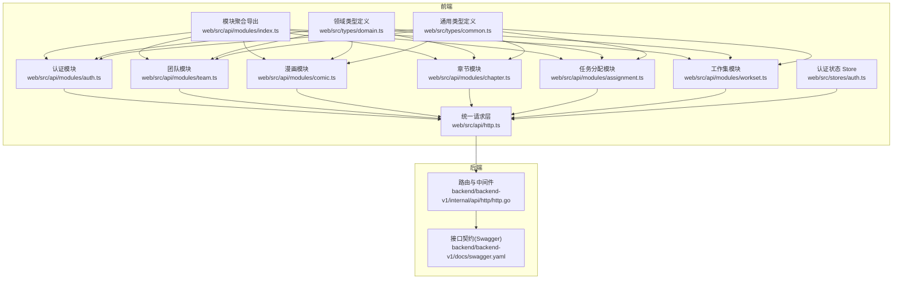
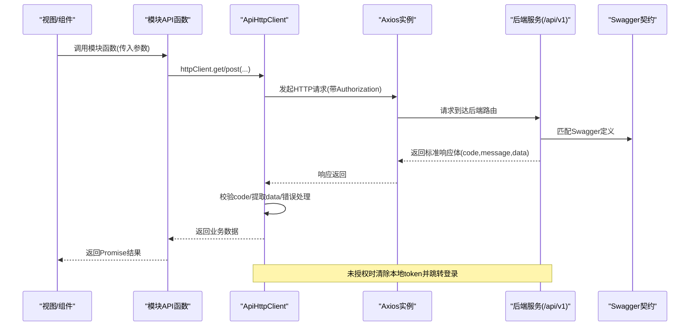
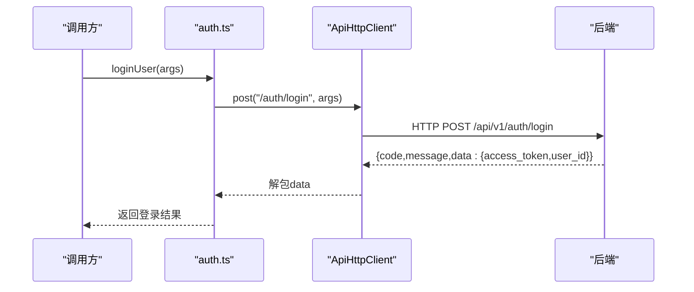
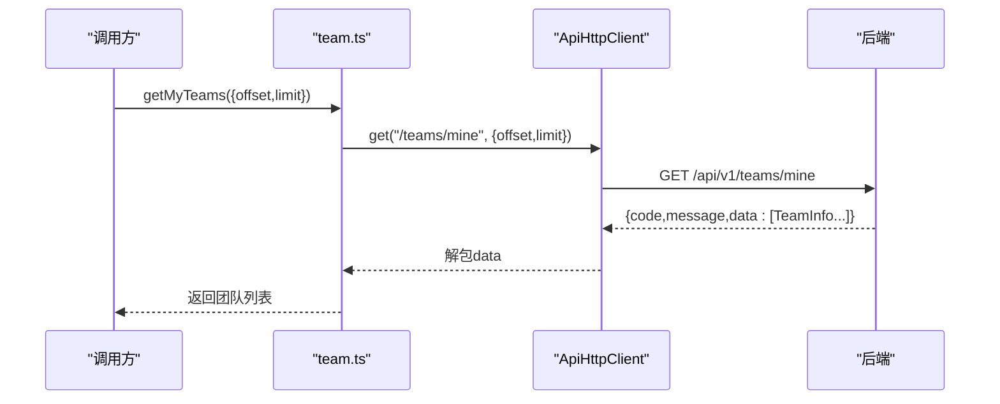
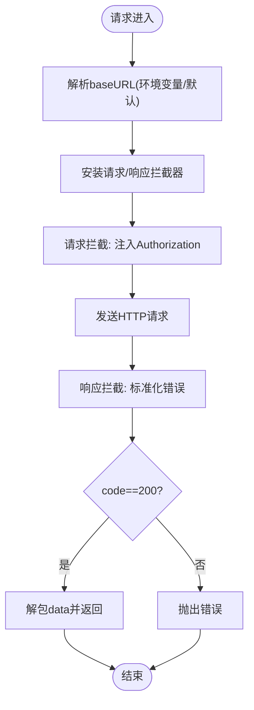
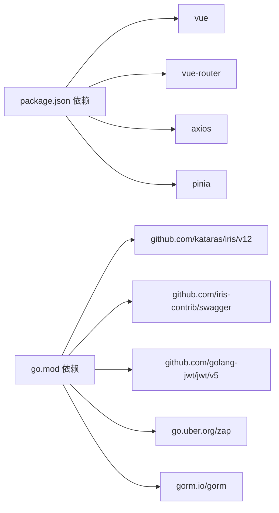

# API 模块化设计

<cite>
**本文引用的文件**
- [web/src/api/modules/index.ts](file://web/src/api/modules/index.ts)
- [web/src/api/http.ts](file://web/src/api/http.ts)
- [web/src/types/common.ts](file://web/src/types/common.ts)
- [web/src/types/domain.ts](file://web/src/types/domain.ts)
- [web/src/api/modules/auth.ts](file://web/src/api/modules/auth.ts)
- [web/src/api/modules/team.ts](file://web/src/api/modules/team.ts)
- [web/src/api/modules/comic.ts](file://web/src/api/modules/comic.ts)
- [web/src/api/modules/chapter.ts](file://web/src/api/modules/chapter.ts)
- [web/src/api/modules/assignment.ts](file://web/src/api/modules/assignment.ts)
- [web/src/api/modules/workset.ts](file://web/src/api/modules/workset.ts)
- [web/src/stores/auth.ts](file://web/src/stores/auth.ts)
- [backend/backend-v1/internal/api/http/http.go](file://backend/backend-v1/internal/api/http/http.go)
- [backend/backend-v1/docs/swagger.yaml](file://backend/backend-v1/docs/swagger.yaml)
- [web/package.json](file://web/package.json)
- [backend/backend-v1/go.mod](file://backend/backend-v1/go.mod)
</cite>

## 目录
1. [引言](#引言)
2. [项目结构](#项目结构)
3. [核心组件](#核心组件)
4. [架构总览](#架构总览)
5. [详细组件分析](#详细组件分析)
6. [依赖关系分析](#依赖关系分析)
7. [性能考虑](#性能考虑)
8. [故障排查指南](#故障排查指南)
9. [结论](#结论)
10. [附录](#附录)

## 引言
本文件面向 Poprako 前端 API 模块化设计，系统性阐述基于功能模块的接口封装策略与实现细节。文档覆盖认证、团队管理、漫画管理、章节管理、任务分配与工作集六大模块的职责边界、接口定义、请求参数、响应结构与错误处理；解释模块间依赖与调用模式；给出批量操作、分页查询与条件筛选的实现方法；提供测试策略、Mock 数据与联调指南，并总结接口版本控制、向后兼容与废弃接口处理策略，以及扩展与自定义模块开发的最佳实践。

## 项目结构
前端采用“按功能模块”组织 API 层，统一通过一个 Axios 封装的请求客户端进行 HTTP 交互，配合 Pinia 全局状态管理维护访问令牌，类型定义与后端 Swagger 对齐，确保前后端契约清晰。

**图表来源**
- [web/src/api/modules/index.ts:1-10](file://web/src/api/modules/index.ts#L1-L10)
- [web/src/api/http.ts:1-196](file://web/src/api/http.ts#L1-L196)
- [web/src/api/modules/auth.ts:1-157](file://web/src/api/modules/auth.ts#L1-L157)
- [web/src/api/modules/team.ts:1-135](file://web/src/api/modules/team.ts#L1-L135)
- [web/src/api/modules/comic.ts:1-70](file://web/src/api/modules/comic.ts#L1-L70)
- [web/src/api/modules/chapter.ts:1-72](file://web/src/api/modules/chapter.ts#L1-L72)
- [web/src/api/modules/assignment.ts:1-101](file://web/src/api/modules/assignment.ts#L1-L101)
- [web/src/api/modules/workset.ts:1-72](file://web/src/api/modules/workset.ts#L1-L72)
- [web/src/stores/auth.ts:1-52](file://web/src/stores/auth.ts#L1-L52)
- [backend/backend-v1/internal/api/http/http.go:1-167](file://backend/backend-v1/internal/api/http/http.go#L1-L167)
- [backend/backend-v1/docs/swagger.yaml:1-200](file://backend/backend-v1/docs/swagger.yaml#L1-L200)

**章节来源**
- [web/src/api/modules/index.ts:1-10](file://web/src/api/modules/index.ts#L1-L10)
- [web/src/api/http.ts:1-196](file://web/src/api/http.ts#L1-L196)
- [web/src/stores/auth.ts:1-52](file://web/src/stores/auth.ts#L1-L52)
- [backend/backend-v1/internal/api/http/http.go:1-167](file://backend/backend-v1/internal/api/http/http.go#L1-L167)
- [backend/backend-v1/docs/swagger.yaml:1-200](file://backend/backend-v1/docs/swagger.yaml#L1-L200)

## 核心组件
- 统一请求客户端：封装 Axios，集中处理基础 URL、超时、请求头注入（Authorization）、响应解包与错误标准化、未授权跳转。
- 类型系统：领域模型与通用类型与后端 Swagger 对齐，保证契约一致性。
- 模块化 API：按功能拆分，每个模块暴露明确的函数与类型，统一通过 httpClient 调用后端接口。
- 全局认证状态：Pinia Store 统一维护访问令牌与登录态，驱动请求头注入与未授权处理。

**章节来源**
- [web/src/api/http.ts:14-196](file://web/src/api/http.ts#L14-L196)
- [web/src/types/common.ts:1-41](file://web/src/types/common.ts#L1-L41)
- [web/src/types/domain.ts:1-89](file://web/src/types/domain.ts#L1-L89)
- [web/src/stores/auth.ts:15-52](file://web/src/stores/auth.ts#L15-L52)

## 架构总览
前端通过模块化的 API 函数发起请求，统一经由 ApiHttpClient 进行序列化、鉴权与错误处理；后端以 Iris 框架提供 /api/v1 路由，Swagger 描述接口契约；Pinia Store 提供认证状态，驱动请求头与未授权行为。

**图表来源**
- [web/src/api/http.ts:33-196](file://web/src/api/http.ts#L33-L196)
- [backend/backend-v1/internal/api/http/http.go:38-167](file://backend/backend-v1/internal/api/http/http.go#L38-L167)
- [backend/backend-v1/docs/swagger.yaml:1-200](file://backend/backend-v1/docs/swagger.yaml#L1-L200)

## 详细组件分析

### 认证模块（auth）
- 职责边界：登录、注册、获取当前用户资料、用户头像上传预留与确认。
- 接口要点：
  - 登录/注册：请求体为用户凭据，返回含访问令牌与用户ID的结果。
  - 获取当前用户：无参数，返回用户信息。
  - 头像上传：预留上传凭证，随后确认上传完成。
- 参数与响应：
  - 登录/注册参数类型与结果类型分别定义于模块内。
  - 用户信息类型来自领域类型定义。
- 错误处理：统一由 ApiHttpClient 标准化，未授权自动清理本地 token 并跳转登录。

**图表来源**
- [web/src/api/modules/auth.ts:102-132](file://web/src/api/modules/auth.ts#L102-L132)
- [web/src/api/http.ts:102-135](file://web/src/api/http.ts#L102-L135)

**章节来源**
- [web/src/api/modules/auth.ts:1-157](file://web/src/api/modules/auth.ts#L1-L157)
- [web/src/types/domain.ts:7-16](file://web/src/types/domain.ts#L7-L16)

### 团队模块（team）
- 职责边界：团队列表、我的团队、创建团队、团队头像上传预留与确认。
- 查询参数：支持分页查询。
- 响应类型：团队信息数组或单个团队详情。
- 错误处理：同统一客户端。

**图表来源**
- [web/src/api/modules/team.ts:78-89](file://web/src/api/modules/team.ts#L78-L89)
- [web/src/api/http.ts:117-124](file://web/src/api/http.ts#L117-L124)

**章节来源**
- [web/src/api/modules/team.ts:1-135](file://web/src/api/modules/team.ts#L1-L135)
- [web/src/types/domain.ts:21-32](file://web/src/types/domain.ts#L21-L32)

### 漫画模块（comic）
- 职责边界：漫画列表、创建漫画。
- 查询参数：分页 + 所属工作集过滤。
- 响应类型：漫画信息数组或单个漫画详情。

**章节来源**
- [web/src/api/modules/comic.ts:1-70](file://web/src/api/modules/comic.ts#L1-L70)
- [web/src/types/domain.ts:51-60](file://web/src/types/domain.ts#L51-L60)

### 章节模块（chapter）
- 职责边界：章节列表、创建章节。
- 查询参数：分页 + 关联展开 + 所属漫画过滤。
- 响应类型：章节信息数组或单个章节详情。

**章节来源**
- [web/src/api/modules/chapter.ts:1-72](file://web/src/api/modules/chapter.ts#L1-L72)
- [web/src/types/domain.ts:65-74](file://web/src/types/domain.ts#L65-L74)
- [web/src/types/common.ts:21-26](file://web/src/types/common.ts#L21-L26)

### 任务分配模块（assignment）
- 职责边界：分配列表、我的分配、创建分配。
- 查询参数：分页 + 关联展开 + 所属章节过滤。
- 响应类型：分配信息数组或单个分配详情。

**章节来源**
- [web/src/api/modules/assignment.ts:1-101](file://web/src/api/modules/assignment.ts#L1-L101)
- [web/src/types/domain.ts:79-88](file://web/src/types/domain.ts#L79-L88)
- [web/src/types/common.ts:7-16](file://web/src/types/common.ts#L7-L16)
- [web/src/types/common.ts:21-26](file://web/src/types/common.ts#L21-L26)

### 工作集模块（workset）
- 职责边界：工作集列表、创建工作集。
- 查询参数：分页 + 所属团队过滤。
- 响应类型：工作集信息数组或单个工作集详情。

**章节来源**
- [web/src/api/modules/workset.ts:1-72](file://web/src/api/modules/workset.ts#L1-L72)
- [web/src/types/domain.ts:37-46](file://web/src/types/domain.ts#L37-L46)

### 统一请求层（http）
- 功能特性：
  - 自动注入 Authorization: Bearer token。
  - 标准化响应解包与错误处理。
  - 支持 includes[] 数组查询参数序列化。
  - 默认 base URL 优先读取环境变量，否则回退至 /api/v1。
- 错误处理：
  - 401 未授权：清除本地 token 并跳转登录。
  - 其他错误：抛出标准化错误消息。

**图表来源**
- [web/src/api/http.ts:20-196](file://web/src/api/http.ts#L20-L196)

**章节来源**
- [web/src/api/http.ts:1-196](file://web/src/api/http.ts#L1-L196)

### 类型系统（common 与 domain）
- 通用类型：分页参数、关联展开 includes 查询、统一错误结构。
- 领域类型：用户、团队、工作集、漫画、章节、分配等信息结构，与 Swagger 定义一一对应。

**章节来源**
- [web/src/types/common.ts:1-41](file://web/src/types/common.ts#L1-L41)
- [web/src/types/domain.ts:1-89](file://web/src/types/domain.ts#L1-L89)

### 全局认证状态（store）
- 维护访问令牌与登录态，提供设置与清空方法，用于驱动请求头与未授权处理。

**章节来源**
- [web/src/stores/auth.ts:1-52](file://web/src/stores/auth.ts#L1-L52)

## 依赖关系分析
- 前端依赖：
  - Vue 3、Pinia、Vue Router、Ant Design Vue、Axios。
  - 后端依赖：Iris、Swagger、GORM、Postgres 等。
- 模块耦合：
  - 各模块仅依赖统一请求客户端与类型定义，低耦合高内聚。
  - 模块聚合导出统一入口，便于按需引入。

**图表来源**
- [web/package.json:13-35](file://web/package.json#L13-L35)
- [backend/backend-v1/go.mod:5-18](file://backend/backend-v1/go.mod#L5-L18)

**章节来源**
- [web/package.json:1-36](file://web/package.json#L1-36)
- [backend/backend-v1/go.mod:1-114](file://backend/backend-v1/go.mod#L1-L114)

## 性能考虑
- 请求超时与重试：统一请求客户端设置超时，避免阻塞；如需重试建议在上层业务调用处按需实现。
- 查询参数序列化：includes[] 数组参数正确序列化，减少后端解析开销。
- 分页策略：合理设置 limit，避免一次性拉取过多数据；结合懒加载与虚拟滚动优化渲染。
- 缓存策略：对只读列表可引入内存缓存与失效策略，降低重复请求。

## 故障排查指南
- 未授权/频繁跳转登录：
  - 检查本地是否保存有效 access_token。
  - 确认请求头 Authorization 是否正确注入。
  - 观察 401 错误是否触发清理逻辑。
- 响应解包失败：
  - 核对后端返回的 code 字段是否为 200。
  - 确认 data 结构与预期类型一致。
- 查询参数无效：
  - includes[] 数组参数需正确序列化为 includes[]=a&includes[]=b。
  - 分页参数 offset/limit 合法范围检查。
- 联调定位：
  - 使用 Swagger UI 查看接口定义与示例。
  - 打印请求 URL 与响应体，核对路径与参数。

**章节来源**
- [web/src/api/http.ts:82-97](file://web/src/api/http.ts#L82-L97)
- [web/src/api/http.ts:172-189](file://web/src/api/http.ts#L172-L189)
- [backend/backend-v1/docs/swagger.yaml:1-200](file://backend/backend-v1/docs/swagger.yaml#L1-L200)

## 结论
Poprako 前端 API 模块化设计以“按功能模块”为核心，结合统一请求层与类型系统，实现了清晰的职责边界、可维护的接口契约与一致的错误处理。通过 Pinia 认证状态与 Axios 拦截器，进一步简化了鉴权与错误传播。建议在后续迭代中完善接口版本控制策略、补充批量操作与条件筛选示例，并持续完善测试与 Mock 方案。

## 附录

### 接口版本控制与兼容策略
- 版本路径：/api/v1，便于未来迁移至 /api/v2。
- 向后兼容：新增字段采用可选，避免破坏既有客户端；变更字段通过新字段并保留旧字段过渡期。
- 废弃接口：保留过渡期并标注 deprecation，逐步引导客户端迁移。

### 批量操作、分页与条件筛选
- 批量操作：建议后端提供批量接口（如批量创建/更新），前端以分批提交与并发控制提升吞吐。
- 分页：统一使用 offset/limit；后端提供总数统计以便前端计算页数。
- 条件筛选：利用 includes[] 展开关联字段，结合查询参数实现多维筛选。

### 测试策略、Mock 与联调
- 单元测试：针对模块函数与类型定义编写断言，验证参数与返回值结构。
- Mock 数据：基于 Swagger 定义生成示例数据，模拟不同 code 场景与错误分支。
- 联调指南：先以 Swagger UI 验证契约，再接入前端模块；关注 includes[] 序列化与分页参数。

### 扩展与自定义模块最佳实践
- 新增模块：遵循现有命名与导出规范，统一使用 httpClient，定义清晰的请求/响应类型。
- 类型对齐：严格与 Swagger 定义保持一致，避免类型漂移。
- 错误处理：复用统一客户端错误处理逻辑，保证用户体验一致。