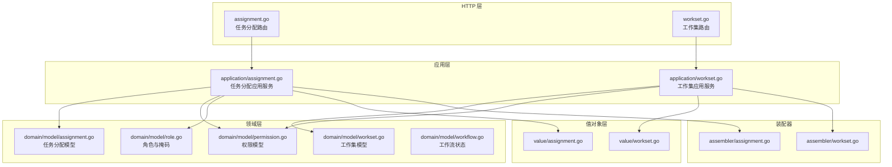
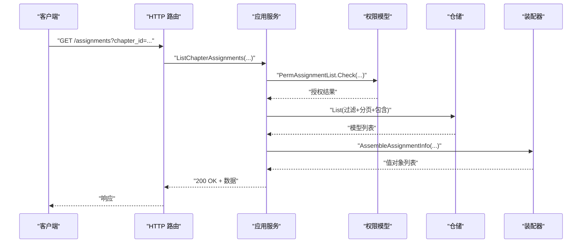
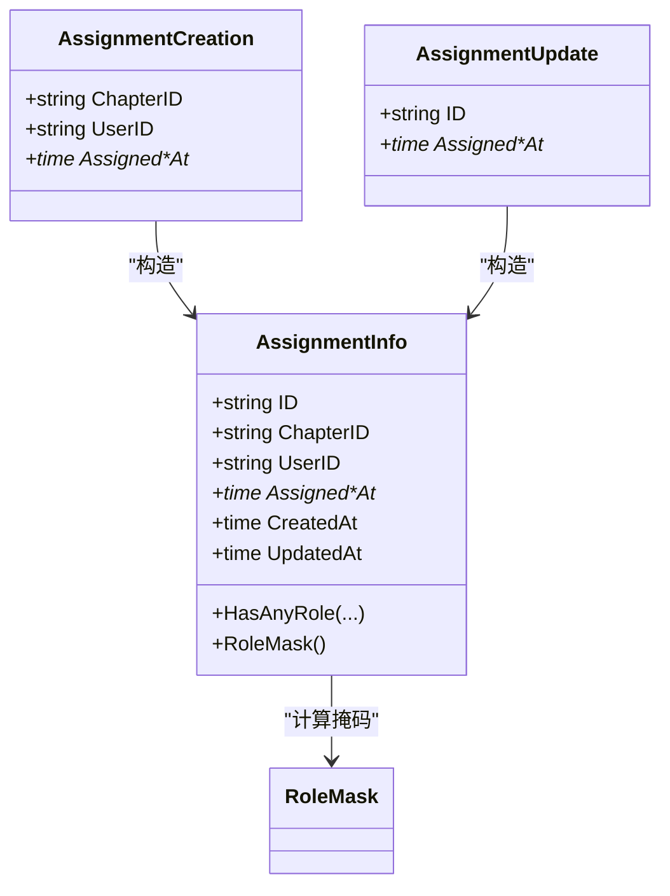
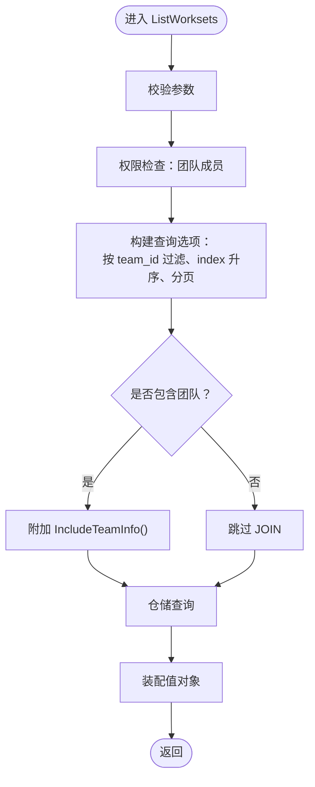
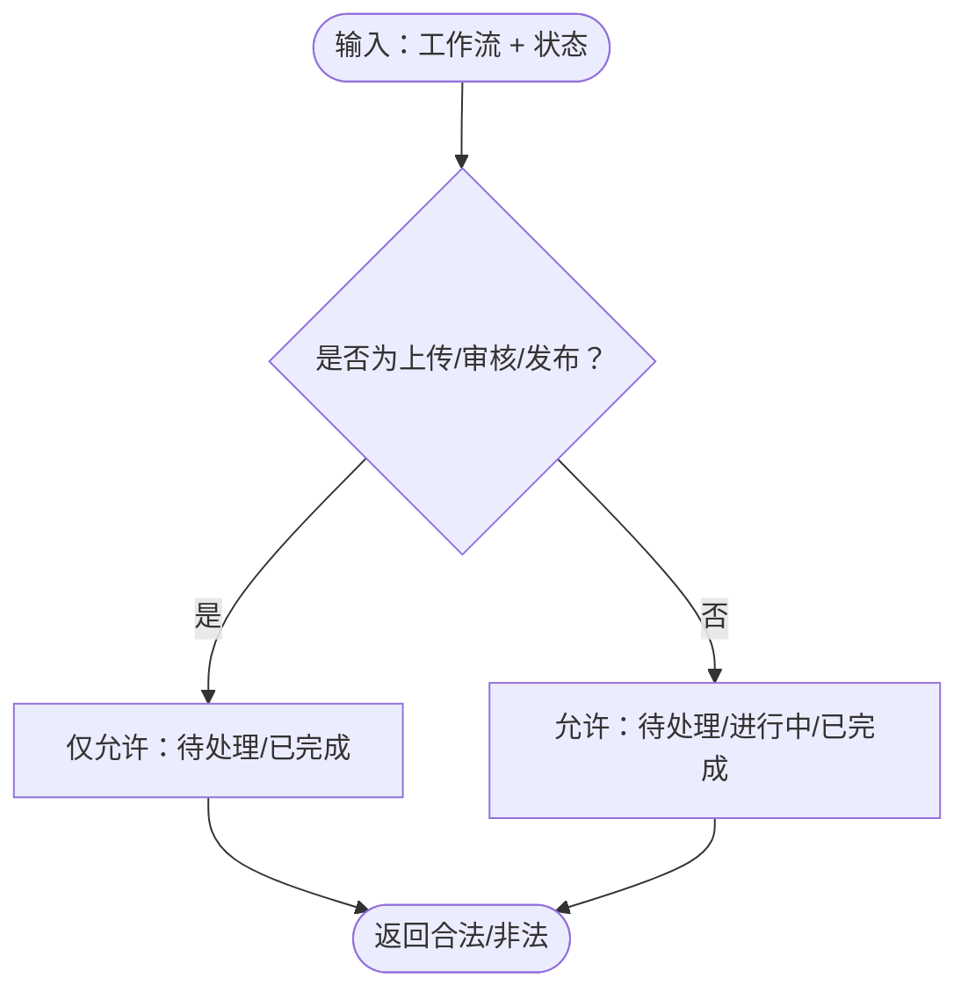
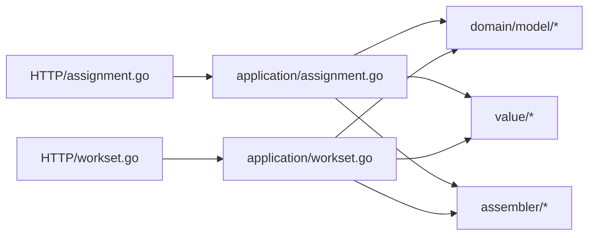

# 任务分配与工作流模块

<cite>
**本文引用的文件**
- [assignment.go](file://backend/backend-v1/internal/api/http/assignment.go)
- [workset.go](file://backend/backend-v1/internal/api/http/workset.go)
- [assignment.go](file://backend/backend-v1/internal/application/assignment.go)
- [workset.go](file://backend/backend-v1/internal/application/workset.go)
- [assignment.go](file://backend/backend-v1/internal/domain/model/assignment.go)
- [workset.go](file://backend/backend-v1/internal/domain/model/workset.go)
- [permission.go](file://backend/backend-v1/internal/domain/model/permission.go)
- [role.go](file://backend/backend-v1/internal/domain/model/role.go)
- [workflow.go](file://backend/backend-v1/internal/domain/model/workflow.go)
- [assignment.go](file://backend/backend-v1/internal/value/assignment.go)
- [workset.go](file://backend/backend-v1/internal/value/workset.go)
- [assignment.go](file://backend/backend-v1/internal/application/assembler/assignment.go)
- [workset.go](file://backend/backend-v1/internal/application/assembler/workset.go)
- [workset-include-internal-logic.md](file://backend/backend-v1/docs/workset-include-internal-logic.md)
</cite>

## 目录
1. [简介](#简介)
2. [项目结构](#项目结构)
3. [核心组件](#核心组件)
4. [架构总览](#架构总览)
5. [详细组件分析](#详细组件分析)
6. [依赖分析](#依赖分析)
7. [性能考虑](#性能考虑)
8. [故障排查指南](#故障排查指南)
9. [结论](#结论)
10. [附录](#附录)

## 简介
本文件系统性梳理 Poprako 任务分配与工作流模块，覆盖以下主题：
- 任务分配：API、数据模型、状态流转、权限控制
- 工作集：概念、组织结构、管理接口与包含关系解析
- 工作流：状态管理、进度跟踪与组合校验
- 关联关系与一致性：任务与用户、漫画章节的绑定与一致性保障
- 批量处理、优先级与自动化：现有能力与扩展建议
- 历史记录、审计与统计：现状与落地建议

## 项目结构
后端采用分层架构，HTTP 层负责路由与鉴权，Application 层编排业务，Domain 层承载模型与权限，Infrastructure 层提供仓储与外部服务适配。

图表来源
- [assignment.go:1-228](file://backend/backend-v1/internal/api/http/assignment.go#L1-L228)
- [workset.go:1-189](file://backend/backend-v1/internal/api/http/workset.go#L1-L189)
- [assignment.go:1-358](file://backend/backend-v1/internal/application/assignment.go#L1-L358)
- [workset.go:1-310](file://backend/backend-v1/internal/application/workset.go#L1-L310)
- [assignment.go:1-190](file://backend/backend-v1/internal/domain/model/assignment.go#L1-L190)
- [workset.go:1-82](file://backend/backend-v1/internal/domain/model/workset.go#L1-L82)
- [permission.go:541-621](file://backend/backend-v1/internal/domain/model/permission.go#L541-L621)
- [role.go:1-56](file://backend/backend-v1/internal/domain/model/role.go#L1-L56)
- [workflow.go:1-36](file://backend/backend-v1/internal/domain/model/workflow.go#L1-L36)
- [assignment.go:1-131](file://backend/backend-v1/internal/value/assignment.go#L1-L131)
- [workset.go:1-89](file://backend/backend-v1/internal/value/workset.go#L1-L89)
- [assignment.go:1-39](file://backend/backend-v1/internal/application/assembler/assignment.go#L1-L39)
- [workset.go:1-27](file://backend/backend-v1/internal/application/assembler/workset.go#L1-L27)

章节来源
- [assignment.go:1-228](file://backend/backend-v1/internal/api/http/assignment.go#L1-L228)
- [workset.go:1-189](file://backend/backend-v1/internal/api/http/workset.go#L1-L189)

## 核心组件
- HTTP 路由层：提供任务分配与工作集的 REST 接口，统一鉴权与响应封装。
- 应用服务层：编排权限校验、查询选项构建、事务与锁控制、装配结果。
- 领域模型层：角色掩码、权限策略、工作流状态与组合校验。
- 值对象层：API 输入输出结构与参数校验。
- 装配器层：将领域模型转换为对外值对象，支持按需包含关联。

章节来源
- [assignment.go:20-46](file://backend/backend-v1/internal/application/assignment.go#L20-L46)
- [workset.go:20-41](file://backend/backend-v1/internal/application/workset.go#L20-L41)
- [assignment.go:5-190](file://backend/backend-v1/internal/domain/model/assignment.go#L5-L190)
- [workset.go:5-82](file://backend/backend-v1/internal/domain/model/workset.go#L5-L82)
- [assignment.go:9-131](file://backend/backend-v1/internal/value/assignment.go#L9-L131)
- [workset.go:7-89](file://backend/backend-v1/internal/value/workset.go#L7-L89)

## 架构总览
任务分配与工作集遵循“HTTP → 应用服务 → 领域模型/权限 → 值对象/装配器”的清晰分层，配合仓储查询选项与事务控制，确保权限与一致性。

图表来源
- [assignment.go:10-52](file://backend/backend-v1/internal/api/http/assignment.go#L10-L52)
- [assignment.go:92-157](file://backend/backend-v1/internal/application/assignment.go#L92-L157)
- [permission.go:553-579](file://backend/backend-v1/internal/domain/model/permission.go#L553-L579)
- [assignment.go:9-39](file://backend/backend-v1/internal/application/assembler/assignment.go#L9-L39)

## 详细组件分析

### 任务分配模块
- API 能力
  - 列表查询：按章节或按用户查询，支持分页与关联包含。
  - 创建分配：基于角色掩码创建，校验 reviewer 权限。
  - 更新分配：PUT 语义全量替换，保留已有角色时间戳。
  - 删除分配：校验 reviewer 权限。
- 数据模型
  - AssignmentInfo：包含各角色的分配时间戳字段，支持 HasAnyRole 与 RoleMask 计算。
  - AssignmentCreation/AssignmentUpdate：构造创建与更新参数，自动处理时间戳。
- 权限控制
  - 列表：汉化组成员可查看。
  - 创建/更新/删除：仅 reviewer 可操作。
- 处理流程
  - 参数校验 → 权限检查 → 构建查询选项（含包含） → 仓储查询 → 装配值对象 → 返回。

图表来源
- [assignment.go:5-190](file://backend/backend-v1/internal/domain/model/assignment.go#L5-L190)
- [role.go:1-56](file://backend/backend-v1/internal/domain/model/role.go#L1-L56)

章节来源
- [assignment.go:10-228](file://backend/backend-v1/internal/api/http/assignment.go#L10-L228)
- [assignment.go:92-358](file://backend/backend-v1/internal/application/assignment.go#L92-L358)
- [assignment.go:5-190](file://backend/backend-v1/internal/domain/model/assignment.go#L5-L190)
- [permission.go:541-621](file://backend/backend-v1/internal/domain/model/permission.go#L541-L621)
- [assignment.go:9-131](file://backend/backend-v1/internal/value/assignment.go#L9-L131)
- [assignment.go:9-39](file://backend/backend-v1/internal/application/assembler/assignment.go#L9-L39)

### 工作集模块
- API 能力
  - 列表：按团队查询，支持按 index 升序与包含团队信息。
  - 创建：开启事务，按团队内数量自动生成索引，插入新工作集。
  - 更新/删除：鉴权后更新或删除。
- 数据模型
  - WorksetInfo：包含团队、索引、名称、描述、漫画数等。
  - WorksetCreation/WorksetUpdate：创建与更新参数。
- 包含关系解析
  - 通过纯函数解析 includes，仅在需要时 JOIN 团队信息，避免过度返回。
- 流程图

图表来源
- [workset.go:72-126](file://backend/backend-v1/internal/application/workset.go#L72-L126)
- [workset-include-internal-logic.md:24-51](file://backend/backend-v1/docs/workset-include-internal-logic.md#L24-L51)

章节来源
- [workset.go:10-189](file://backend/backend-v1/internal/api/http/workset.go#L10-L189)
- [workset.go:72-310](file://backend/backend-v1/internal/application/workset.go#L72-L310)
- [workset.go:5-82](file://backend/backend-v1/internal/domain/model/workset.go#L5-L82)
- [workset.go:7-89](file://backend/backend-v1/internal/value/workset.go#L7-L89)
- [workset-include-internal-logic.md:1-87](file://backend/backend-v1/docs/workset-include-internal-logic.md#L1-L87)

### 工作流状态管理
- 工作流类型与状态
  - 支持上传、翻译、校对、排版、审核、发布六类工作流。
  - 状态分为待处理、进行中、已完成；部分工作流不区分进行中。
- 组合校验
  - 通过 IsValidWorkflowCombination 校验工作流与状态的合法性，避免非法组合。

图表来源
- [workflow.go:24-36](file://backend/backend-v1/internal/domain/model/workflow.go#L24-L36)

章节来源
- [workflow.go:1-36](file://backend/backend-v1/internal/domain/model/workflow.go#L1-L36)

### 关联关系与一致性
- 关联关系
  - 任务分配绑定章节与用户；章节属于漫画；漫画属于工作集；工作集属于团队。
- 一致性保障
  - 权限检查贯穿章节/漫画/工作集/团队链路，确保用户仅能访问所属团队资源。
  - 创建工作集使用事务与行级锁，保证索引生成的一致性。
  - 装配器按需包含关联，避免不必要的 JOIN 与数据膨胀。

章节来源
- [permission.go:541-621](file://backend/backend-v1/internal/domain/model/permission.go#L541-L621)
- [workset.go:158-213](file://backend/backend-v1/internal/application/workset.go#L158-L213)
- [assignment.go:9-39](file://backend/backend-v1/internal/application/assembler/assignment.go#L9-L39)
- [workset.go:8-27](file://backend/backend-v1/internal/application/assembler/workset.go#L8-L27)

### 批量处理、优先级与自动化
- 批量处理
  - 当前未提供批量任务分配接口；可在应用层扩展批量创建/更新，结合事务与锁控制。
- 优先级
  - 代码中未体现优先级字段；可在值对象与模型层增加字段，并在应用层暴露排序与筛选。
- 自动化工作流
  - 工作流状态校验为纯函数，可作为自动化规则的基础；可扩展事件驱动的状态推进。

章节来源
- [assignment.go:9-131](file://backend/backend-v1/internal/value/assignment.go#L9-L131)
- [workset.go:7-89](file://backend/backend-v1/internal/value/workset.go#L7-L89)
- [workflow.go:24-36](file://backend/backend-v1/internal/domain/model/workflow.go#L24-L36)

### 历史记录、审计与统计
- 历史记录与审计
  - 任务分配模型包含创建/更新时间戳，可用于审计追踪。
  - HTTP 层统一日志与追踪作用域，便于审计。
- 统计分析
  - 工作集模型包含漫画数量字段，可作为统计入口；可扩展按团队/工作流维度的聚合查询。

章节来源
- [assignment.go:5-25](file://backend/backend-v1/internal/domain/model/assignment.go#L5-L25)
- [workset.go:5-18](file://backend/backend-v1/internal/domain/model/workset.go#L5-L18)
- [assignment.go:25-52](file://backend/backend-v1/internal/api/http/assignment.go#L25-L52)

## 依赖分析
- 组件耦合
  - HTTP 层仅依赖应用服务；应用层依赖领域模型、权限与仓储；装配器解耦模型与值对象。
- 外部依赖
  - OSS 客户端用于生成预签名 URL（在装配阶段使用）。
- 循环依赖
  - 未发现循环依赖迹象，分层清晰。

图表来源
- [assignment.go:1-228](file://backend/backend-v1/internal/api/http/assignment.go#L1-L228)
- [workset.go:1-189](file://backend/backend-v1/internal/api/http/workset.go#L1-L189)
- [assignment.go:1-358](file://backend/backend-v1/internal/application/assignment.go#L1-L358)
- [workset.go:1-310](file://backend/backend-v1/internal/application/workset.go#L1-L310)

章节来源
- [assignment.go:48-90](file://backend/backend-v1/internal/application/assignment.go#L48-L90)
- [workset.go:43-70](file://backend/backend-v1/internal/application/workset.go#L43-L70)

## 性能考虑
- 查询优化
  - 使用查询选项构建精确过滤与排序，避免全表扫描。
  - 按需包含关联，减少 JOIN 与字段传输。
- 事务与锁
  - 创建工作集使用事务与锁，降低并发冲突概率。
- 装配成本
  - 装配器仅在包含时填充关联，避免不必要的对象构造。

章节来源
- [workset.go:158-213](file://backend/backend-v1/internal/application/workset.go#L158-L213)
- [workset.go:102-126](file://backend/backend-v1/internal/application/workset.go#L102-L126)
- [assignment.go:9-39](file://backend/backend-v1/internal/application/assembler/assignment.go#L9-L39)

## 故障排查指南
- 常见错误与定位
  - 参数校验失败：检查请求参数与分页参数。
  - 权限不足：确认用户在团队内的角色与目标资源归属。
  - 无法获取资源：确认资源 ID 存在且未被删除。
- 日志与追踪
  - 应用层记录调用与错误日志，便于定位问题。
- 建议
  - 在 HTTP 层统一错误响应格式，增强可观测性。

章节来源
- [assignment.go:92-157](file://backend/backend-v1/internal/application/assignment.go#L92-L157)
- [workset.go:72-126](file://backend/backend-v1/internal/application/workset.go#L72-L126)

## 结论
本模块以清晰的分层设计实现了任务分配与工作集管理，配合完善的权限模型与包含关系解析，满足汉化组协作场景下的核心需求。工作流状态校验为后续自动化与统计分析提供了基础。建议在现有基础上扩展批量处理、优先级与自动化规则，并完善审计与统计能力。

## 附录
- API 示例（概念性）
  - 任务创建：POST /assignments（需要 reviewer 权限）
  - 任务列表：GET /assignments?chapter_id=...&offset=&limit=
  - 我的任务：GET /assignments/mine?offset=&limit=
  - 工作集列表：GET /worksets?team_id=...&offset=&limit=
  - 创建工作集：POST /worksets
  - 更新/删除工作集：PUT /worksets/{id} / DELETE /worksets/{id}