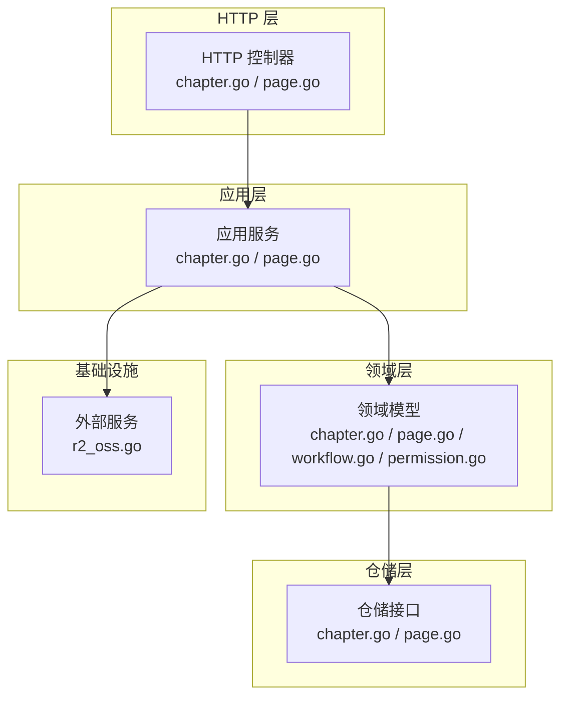
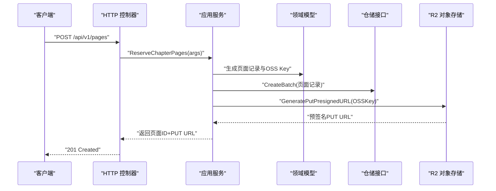
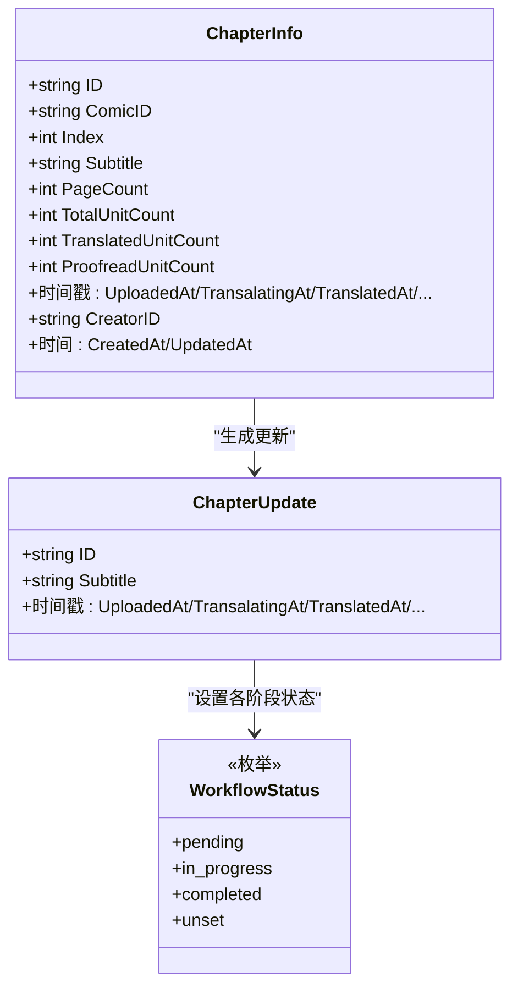
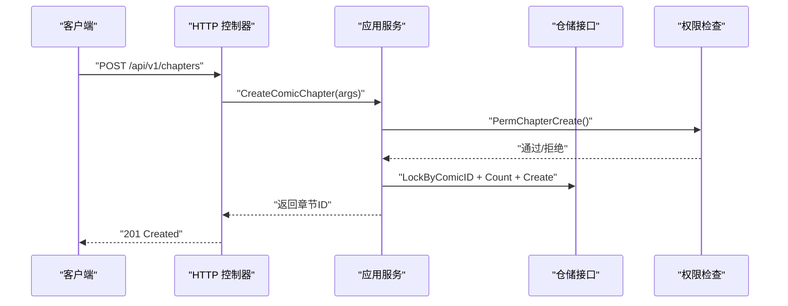
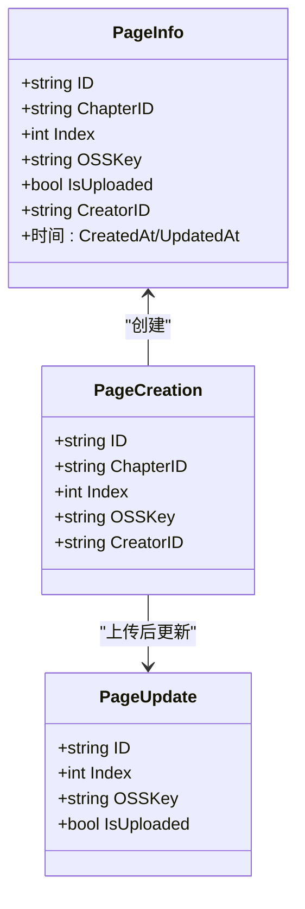
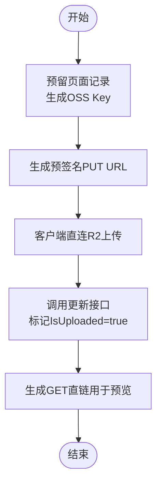
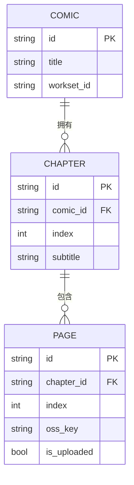
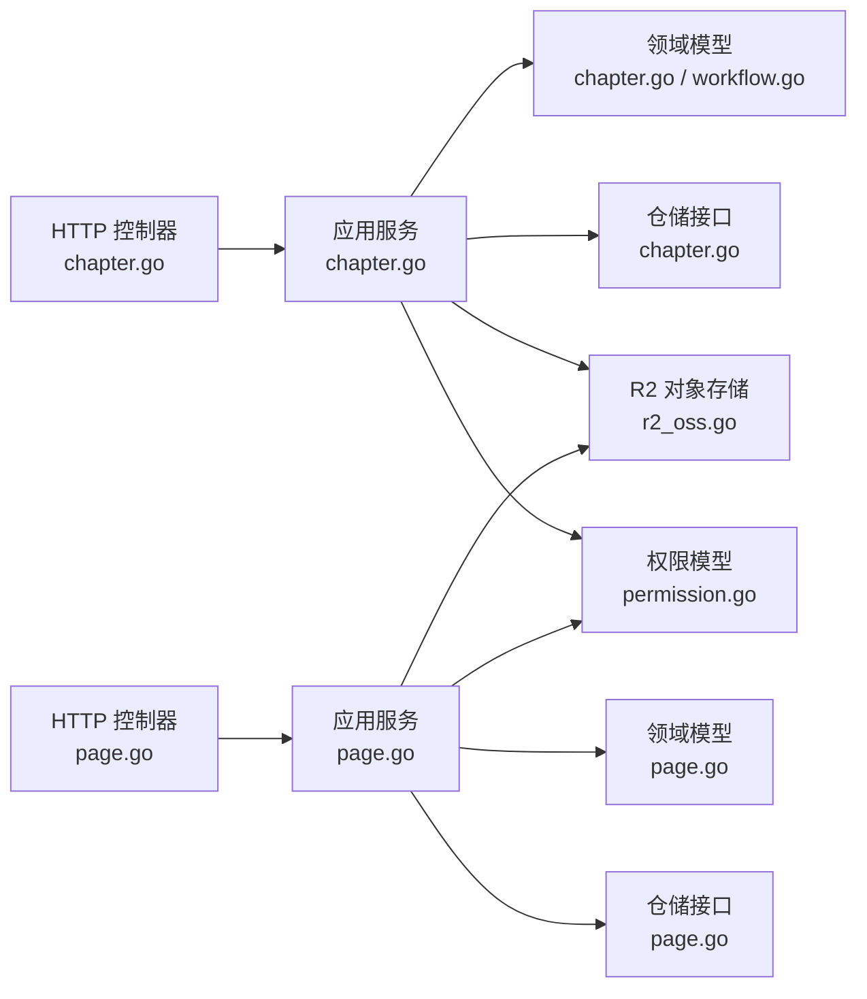

# 内容章节页面模块

<cite>
**本文引用的文件**
- [chapter.go](file://backend/backend-v1/internal/api/http/chapter.go)
- [page.go](file://backend/backend-v1/internal/api/http/page.go)
- [chapter.go](file://backend/backend-v1/internal/application/chapter.go)
- [page.go](file://backend/backend-v1/internal/application/page.go)
- [chapter.go](file://backend/backend-v1/internal/domain/model/chapter.go)
- [page.go](file://backend/backend-v1/internal/domain/model/page.go)
- [workflow.go](file://backend/backend-v1/internal/domain/model/workflow.go)
- [chapter.go](file://backend/backend-v1/internal/value/chapter.go)
- [page.go](file://backend/backend-v1/internal/value/page.go)
- [chapter.go](file://backend/backend-v1/internal/domain/repository/chapter.go)
- [page.go](file://backend/backend-v1/internal/domain/repository/page.go)
- [r2_oss.go](file://backend/backend-v1/internal/infrastructure/external/r2_oss.go)
- [permission.go](file://backend/backend-v1/internal/domain/model/permission.go)
- [swagger.yaml](file://backend/backend-v1/docs/swagger.yaml)
</cite>

## 目录
1. [简介](#简介)
2. [项目结构](#项目结构)
3. [核心组件](#核心组件)
4. [架构总览](#架构总览)
5. [详细组件分析](#详细组件分析)
6. [依赖关系分析](#依赖关系分析)
7. [性能考虑](#性能考虑)
8. [故障排查指南](#故障排查指南)
9. [结论](#结论)
10. [附录](#附录)

## 简介
本文件面向 Poprako 内容章节页面模块，系统性梳理漫画章节与页面的管理能力，覆盖数据模型、排序规则、发布状态控制、文件上传与预览、版本控制机制、层级关系与导航、访问控制、内容审核与质量控制、批量操作、缓存与 CDN、性能优化以及搜索与推荐接口设计思路。文档以代码为依据，辅以图示帮助读者快速理解前后端协作流程与关键实现。

## 项目结构
- 后端采用分层架构：HTTP 层负责路由与参数解析；应用层封装业务逻辑；领域层定义模型与权限；仓储层抽象数据访问；基础设施层对接外部服务（如 R2 对象存储）。
- 章节与页面模块分别由独立的 HTTP 控制器、应用服务、领域模型与仓储接口组成，通过值对象（value）在边界间传递数据。

**图表来源**
- [chapter.go:1-185](file://backend/backend-v1/internal/api/http/chapter.go#L1-L185)
- [page.go:1-189](file://backend/backend-v1/internal/api/http/page.go#L1-L189)
- [chapter.go:1-330](file://backend/backend-v1/internal/application/chapter.go#L1-L330)
- [page.go:1-402](file://backend/backend-v1/internal/application/page.go#L1-L402)
- [chapter.go:1-260](file://backend/backend-v1/internal/domain/model/chapter.go#L1-L260)
- [page.go:1-134](file://backend/backend-v1/internal/domain/model/page.go#L1-L134)
- [workflow.go:1-36](file://backend/backend-v1/internal/domain/model/workflow.go#L1-L36)
- [permission.go:463-727](file://backend/backend-v1/internal/domain/model/permission.go#L463-L727)
- [chapter.go:1-19](file://backend/backend-v1/internal/domain/repository/chapter.go#L1-L19)
- [page.go:1-18](file://backend/backend-v1/internal/domain/repository/page.go#L1-L18)
- [r2_oss.go:1-250](file://backend/backend-v1/internal/infrastructure/external/r2_oss.go#L1-L250)

**章节来源**
- [chapter.go:1-185](file://backend/backend-v1/internal/api/http/chapter.go#L1-L185)
- [page.go:1-189](file://backend/backend-v1/internal/api/http/page.go#L1-L189)

## 核心组件
- HTTP 控制器：提供章节与页面的 CRUD 与列表查询接口，统一鉴权与参数校验，调用应用服务并返回标准响应。
- 应用服务：编排业务流程，执行权限检查、事务控制、仓储交互与外部服务调用。
- 领域模型：定义章节与页面的数据结构、工作流状态与统计字段，提供状态转换逻辑。
- 值对象：在 HTTP 与应用层之间传递参数与结果，包含分页、包含信息等约定。
- 仓储接口：抽象章节与页面的增删改查、批量操作与统计更新。
- 外部服务：R2 对象存储客户端，提供预签名上传、直链读取与批量删除能力。

**章节来源**
- [chapter.go:20-80](file://backend/backend-v1/internal/application/chapter.go#L20-L80)
- [page.go:21-91](file://backend/backend-v1/internal/application/page.go#L21-L91)
- [chapter.go:5-81](file://backend/backend-v1/internal/domain/model/chapter.go#L5-L81)
- [page.go:5-52](file://backend/backend-v1/internal/domain/model/page.go#L5-L52)
- [chapter.go:10-86](file://backend/backend-v1/internal/value/chapter.go#L10-L86)
- [page.go:7-54](file://backend/backend-v1/internal/value/page.go#L7-L54)
- [chapter.go:5-18](file://backend/backend-v1/internal/domain/repository/chapter.go#L5-L18)
- [page.go:5-17](file://backend/backend-v1/internal/domain/repository/page.go#L5-L17)
- [r2_oss.go:21-91](file://backend/backend-v1/internal/infrastructure/external/r2_oss.go#L21-L91)

## 架构总览
章节与页面模块遵循“控制器-应用-领域-仓储-外部”的分层模式，HTTP 层负责安全与参数校验，应用层组织业务流程与事务，领域层承载模型与规则，仓储层屏蔽持久化细节，外部服务提供对象存储能力。

**图表来源**
- [page.go:54-95](file://backend/backend-v1/internal/api/http/page.go#L54-L95)
- [page.go:93-187](file://backend/backend-v1/internal/application/page.go#L93-L187)
- [r2_oss.go:93-114](file://backend/backend-v1/internal/infrastructure/external/r2_oss.go#L93-L114)

## 详细组件分析

### 章节管理模块

#### 数据模型与状态控制
- 章节信息包含索引、副标题、页面数与单位统计，以及多阶段工作流时间戳（上传、翻译、校对、排版、审阅、发布）。
- 工作流状态枚举支持“待处理/进行中/已完成/未设置”，不同阶段允许的状态集合不同，应用层在更新时进行合法性校验。

**图表来源**
- [chapter.go:5-81](file://backend/backend-v1/internal/domain/model/chapter.go#L5-L81)
- [chapter.go:126-259](file://backend/backend-v1/internal/domain/model/chapter.go#L126-L259)
- [workflow.go:14-35](file://backend/backend-v1/internal/domain/model/workflow.go#L14-L35)

**章节来源**
- [chapter.go:1-260](file://backend/backend-v1/internal/domain/model/chapter.go#L1-L260)
- [workflow.go:1-36](file://backend/backend-v1/internal/domain/model/workflow.go#L1-L36)

#### 排序规则与发布状态
- 列表按章节索引降序排列，索引为 0-based，新章节索引等于当前该漫画下章节数。
- 发布状态通过专用字段记录完成时间，配合工作流状态实现内容生命周期管理。

**章节来源**
- [chapter.go:200-204](file://backend/backend-v1/internal/application/chapter.go#L200-L204)
- [chapter.go:145-151](file://backend/backend-v1/internal/application/chapter.go#L145-L151)

#### 访问控制
- 权限检查基于用户角色与分工，章节创建/更新/删除与页面创建/更新/删除均需满足相应权限。
- 权限类型涵盖团队管理员、评审员、原图提供者等角色，应用层在执行业务前进行权限校验。

**章节来源**
- [permission.go:496-539](file://backend/backend-v1/internal/domain/model/permission.go#L496-L539)
- [permission.go:663-727](file://backend/backend-v1/internal/domain/model/permission.go#L663-L727)

#### API 流程（创建章节）

**图表来源**
- [chapter.go:54-95](file://backend/backend-v1/internal/api/http/chapter.go#L54-L95)
- [chapter.go:82-165](file://backend/backend-v1/internal/application/chapter.go#L82-L165)
- [permission.go:496-509](file://backend/backend-v1/internal/domain/model/permission.go#L496-L509)

**章节来源**
- [chapter.go:54-95](file://backend/backend-v1/internal/api/http/chapter.go#L54-L95)
- [chapter.go:82-165](file://backend/backend-v1/internal/application/chapter.go#L82-L165)

### 页面管理模块

#### 数据模型与版本控制
- 页面信息包含章节ID、索引（0-based）、OSS Key、是否已上传及单位统计。
- 版本控制通过“预留记录+预签名上传+显式确认”实现：先在数据库创建页面记录并生成预签名URL，客户端上传完成后调用更新接口标记已上传，确保数据一致性。

**图表来源**
- [page.go:5-52](file://backend/backend-v1/internal/domain/model/page.go#L5-L52)
- [page.go:76-99](file://backend/backend-v1/internal/domain/model/page.go#L76-L99)
- [page.go:101-133](file://backend/backend-v1/internal/domain/model/page.go#L101-L133)

**章节来源**
- [page.go:1-134](file://backend/backend-v1/internal/domain/model/page.go#L1-L134)

#### 文件上传、预览与版本控制
- 预留页面：应用层生成页面记录与 OSS Key，随后为每个页面生成预签名 PUT URL 返回给客户端。
- 上传与确认：客户端直接向 R2 上传图片；上传完成后调用更新接口将页面标记为已上传，应用层据此更新状态。
- 预览：应用层为页面生成 GET 链接（优先使用自定义域名直链），便于前端展示。

**图表来源**
- [page.go:93-187](file://backend/backend-v1/internal/application/page.go#L93-L187)
- [page.go:54-95](file://backend/backend-v1/internal/api/http/page.go#L54-L95)
- [page.go:97-148](file://backend/backend-v1/internal/api/http/page.go#L97-L148)
- [r2_oss.go:93-129](file://backend/backend-v1/internal/infrastructure/external/r2_oss.go#L93-L129)

**章节来源**
- [page.go:93-187](file://backend/backend-v1/internal/application/page.go#L93-L187)
- [page.go:54-148](file://backend/backend-v1/internal/api/http/page.go#L54-L148)
- [r2_oss.go:93-129](file://backend/backend-v1/internal/infrastructure/external/r2_oss.go#L93-L129)

#### 批量操作与删除
- 批量删除章节下的所有页面：应用层锁定章节、查询页面列表、删除数据库记录并批量删除 R2 对象，最后提交事务。
- 删除接口支持章节维度的批量清理，保障数据与对象存储的一致性。

**章节来源**
- [page.go:313-401](file://backend/backend-v1/internal/application/page.go#L313-L401)
- [page.go:150-189](file://backend/backend-v1/internal/api/http/page.go#L150-L189)

### 层级关系、导航与访问控制

**图表来源**
- [chapter.go:5-35](file://backend/backend-v1/internal/domain/model/chapter.go#L5-L35)
- [page.go:5-22](file://backend/backend-v1/internal/domain/model/page.go#L5-L22)

- 导航结构：漫画 -> 章节 -> 页面，页面按索引升序排列，便于顺序阅读。
- 访问控制：章节与页面的列表、创建、更新、删除均受权限与分工约束，确保只有具备相应角色的用户才能操作。

**章节来源**
- [chapter.go:198-221](file://backend/backend-v1/internal/application/chapter.go#L198-L221)
- [page.go:189-248](file://backend/backend-v1/internal/application/page.go#L189-L248)
- [permission.go:635-727](file://backend/backend-v1/internal/domain/model/permission.go#L635-L727)

### 内容管理操作示例

- 创建章节
  - 步骤：鉴权 -> 校验参数 -> 锁定漫画 -> 统计章节数 -> 创建章节 -> 提交事务 -> 返回章节ID。
  - 参考：[chapter.go:54-95](file://backend/backend-v1/internal/api/http/chapter.go#L54-L95)、[chapter.go:82-165](file://backend/backend-v1/internal/application/chapter.go#L82-L165)

- 预留并上传页面
  - 步骤：鉴权 -> 锁定章节 -> 批量创建页面记录 -> 生成预签名PUT URL -> 客户端上传 -> 更新页面标记已上传。
  - 参考：[page.go:54-148](file://backend/backend-v1/internal/api/http/page.go#L54-L148)、[page.go:93-187](file://backend/backend-v1/internal/application/page.go#L93-L187)

- 删除章节下所有页面
  - 步骤：鉴权 -> 锁定章节 -> 查询页面 -> 删除数据库记录 -> 批量删除对象 -> 提交事务。
  - 参考：[page.go:150-189](file://backend/backend-v1/internal/api/http/page.go#L150-L189)、[page.go:313-401](file://backend/backend-v1/internal/application/page.go#L313-L401)

**章节来源**
- [chapter.go:54-95](file://backend/backend-v1/internal/api/http/chapter.go#L54-L95)
- [page.go:54-189](file://backend/backend-v1/internal/api/http/page.go#L54-L189)
- [chapter.go:82-165](file://backend/backend-v1/internal/application/chapter.go#L82-L165)
- [page.go:93-187](file://backend/backend-v1/internal/application/page.go#L93-L187)
- [page.go:313-401](file://backend/backend-v1/internal/application/page.go#L313-L401)

### 内容审核流程与质量控制
- 工作流阶段：上传、翻译、校对、排版、审阅、发布，每个阶段支持“待处理/进行中/已完成”，应用层在更新时校验状态组合有效性。
- 质量控制：页面与章节均维护单位统计字段，可用于质量监控与进度追踪。
- 审核接口：通过更新章节工作流状态实现内容审核与发布流程。

**章节来源**
- [workflow.go:24-35](file://backend/backend-v1/internal/domain/model/workflow.go#L24-L35)
- [chapter.go:88-147](file://backend/backend-v1/internal/value/chapter.go#L88-L147)
- [chapter.go:126-259](file://backend/backend-v1/internal/domain/model/chapter.go#L126-L259)

### 搜索、标签与推荐（接口设计建议）
- 搜索：可在章节与页面列表接口中扩展查询参数（如标题、副标题、作者、创建时间范围等），结合仓储层的查询选项实现。
- 标签：可在漫画或章节模型中引入标签字段，配合值对象扩展查询与过滤。
- 推荐：基于章节阅读历史、评分与相似度计算，结合章节与页面的统计信息构建推荐候选集。

[本节为概念性设计说明，不直接分析具体文件，故无“章节来源”]

## 依赖关系分析

**图表来源**
- [chapter.go:1-185](file://backend/backend-v1/internal/api/http/chapter.go#L1-L185)
- [page.go:1-189](file://backend/backend-v1/internal/api/http/page.go#L1-L189)
- [chapter.go:1-330](file://backend/backend-v1/internal/application/chapter.go#L1-L330)
- [page.go:1-402](file://backend/backend-v1/internal/application/page.go#L1-L402)
- [chapter.go:1-260](file://backend/backend-v1/internal/domain/model/chapter.go#L1-L260)
- [page.go:1-134](file://backend/backend-v1/internal/domain/model/page.go#L1-L134)
- [workflow.go:1-36](file://backend/backend-v1/internal/domain/model/workflow.go#L1-L36)
- [chapter.go:1-19](file://backend/backend-v1/internal/domain/repository/chapter.go#L1-L19)
- [page.go:1-18](file://backend/backend-v1/internal/domain/repository/page.go#L1-L18)
- [r2_oss.go:1-250](file://backend/backend-v1/internal/infrastructure/external/r2_oss.go#L1-L250)
- [permission.go:463-727](file://backend/backend-v1/internal/domain/model/permission.go#L463-L727)

**章节来源**
- [chapter.go:43-80](file://backend/backend-v1/internal/application/chapter.go#L43-L80)
- [page.go:44-91](file://backend/backend-v1/internal/application/page.go#L44-L91)

## 性能考虑
- 预签名上传：客户端直连 R2 上传，降低服务端带宽压力与延迟。
- 事务与锁：章节与页面的批量创建/删除采用数据库锁与事务，保证并发一致性。
- 缓存策略：章节与页面列表可结合分页与包含信息（includes）减少冗余数据传输；GET 链路可利用 CDN 加速静态资源。
- 并发控制：章节索引通过数据库唯一约束与锁避免并发冲突；页面批量操作采用批量删除与重试机制提升可靠性。

[本节提供通用指导，不直接分析具体文件，故无“章节来源”]

## 故障排查指南
- 参数校验失败：检查请求体与查询参数格式，确保必填字段与长度限制符合要求。
- 权限不足：确认用户角色与分工，检查权限检查函数返回值。
- 事务失败：关注应用层事务开启、执行与回滚日志，定位具体仓储操作异常。
- 预签名生成失败：检查 R2 凭证与自定义域名配置，确认对象 Key 规范。
- 批量删除异常：查看删除对象的错误列表，处理 NoSuchKey 等非致命错误。

**章节来源**
- [chapter.go:34-50](file://backend/backend-v1/internal/api/http/chapter.go#L34-L50)
- [page.go:34-51](file://backend/backend-v1/internal/api/http/page.go#L34-L51)
- [page.go:123-187](file://backend/backend-v1/internal/application/page.go#L123-L187)
- [r2_oss.go:131-222](file://backend/backend-v1/internal/infrastructure/external/r2_oss.go#L131-L222)

## 结论
Poprako 的章节与页面模块通过清晰的分层设计与严格的权限控制，实现了从内容创建、上传到发布的全链路管理。借助预签名上传与 CDN，系统在性能与可靠性方面具备良好基础；配合工作流状态与统计字段，能够支撑内容审核与质量控制需求。后续可在搜索、标签与推荐方面进一步扩展接口与算法，完善内容生态。

## 附录

### Swagger 接口概览（摘录）
- 章节接口
  - GET /api/v1/chapters：分页列出章节，支持 includes 参数。
  - POST /api/v1/chapters：创建章节。
  - PATCH /api/v1/chapters/{chapter_id}：更新章节。
  - DELETE /api/v1/chapters/{chapter_id}：删除章节。
- 页面接口
  - GET /api/v1/pages：分页列出页面，支持 includes 参数。
  - POST /api/v1/pages：预留页面并生成预签名上传地址。
  - PUT /api/v1/pages/{page_id}：更新页面。
  - DELETE /api/v1/pages/{chapter_id}：删除章节下所有页面。

**章节来源**
- [swagger.yaml:1-200](file://backend/backend-v1/docs/swagger.yaml#L1-L200)
- [chapter.go:10-185](file://backend/backend-v1/internal/api/http/chapter.go#L10-L185)
- [page.go:10-189](file://backend/backend-v1/internal/api/http/page.go#L10-L189)