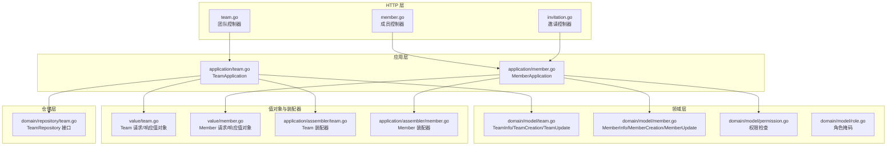
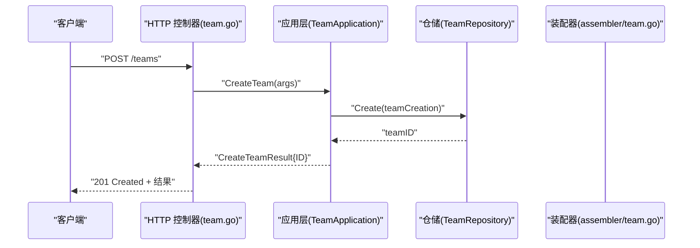
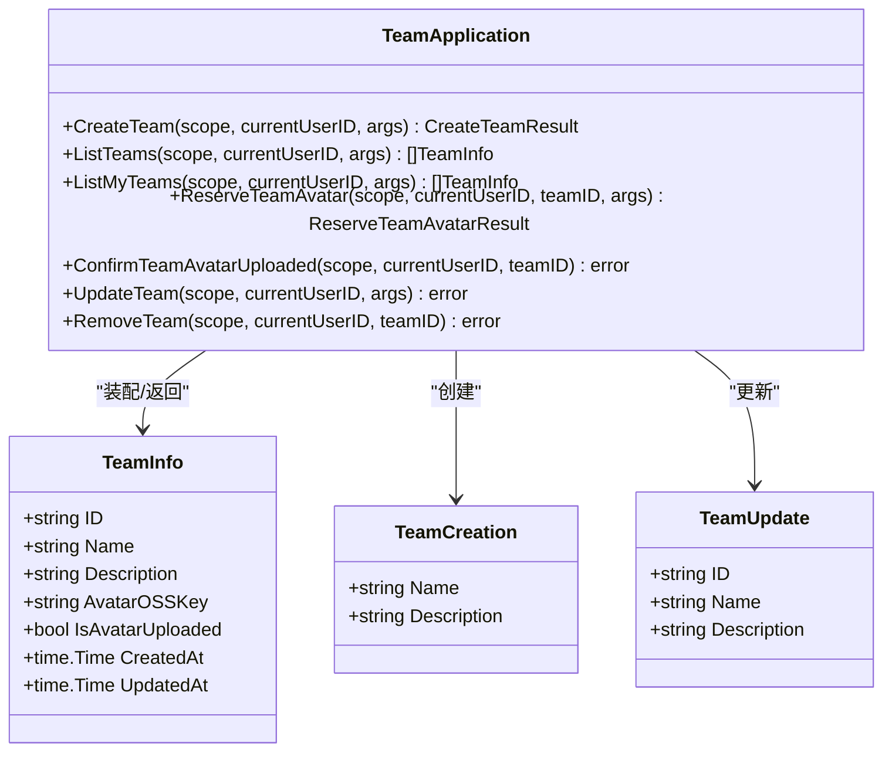
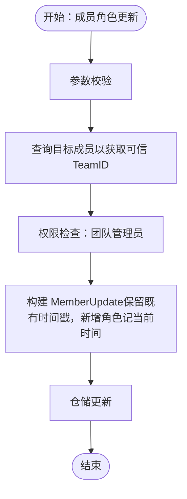
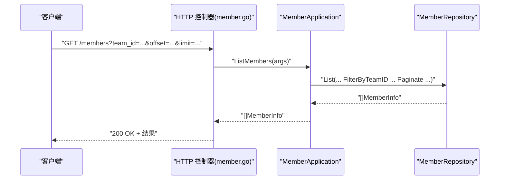
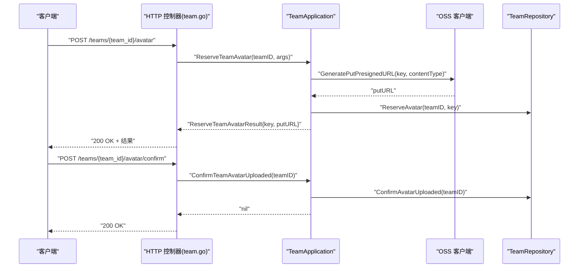
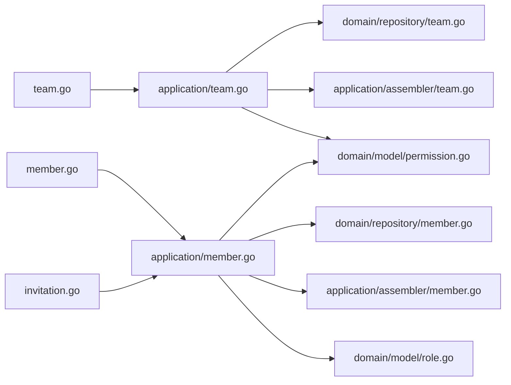

# 团队管理模块

<cite>
**本文档引用的文件**
- [backend-v1/internal/api/http/team.go](file://backend/backend-v1/internal/api/http/team.go)
- [backend-v1/internal/application/team.go](file://backend/backend-v1/internal/application/team.go)
- [backend-v1/internal/domain/model/team.go](file://backend/backend-v1/internal/domain/model/team.go)
- [backend-v1/internal/value/team.go](file://backend/backend-v1/internal/value/team.go)
- [backend-v1/internal/application/assembler/team.go](file://backend/backend-v1/internal/application/assembler/team.go)
- [backend-v1/internal/domain/repository/team.go](file://backend/backend-v1/internal/domain/repository/team.go)
- [backend-v1/internal/api/http/member.go](file://backend/backend-v1/internal/api/http/member.go)
- [backend-v1/internal/application/member.go](file://backend/backend-v1/internal/application/member.go)
- [backend-v1/internal/domain/model/member.go](file://backend/backend-v1/internal/domain/model/member.go)
- [backend-v1/internal/domain/model/permission.go](file://backend/backend-v1/internal/domain/model/permission.go)
- [backend-v1/internal/domain/model/role.go](file://backend/backend-v1/internal/domain/model/role.go)
- [backend-v1/internal/value/member.go](file://backend/backend-v1/internal/value/member.go)
- [backend-v1/internal/application/assembler/member.go](file://backend/backend-v1/internal/application/assembler/member.go)
- [backend-v1/internal/api/http/invitation.go](file://backend/backend-v1/internal/api/http/invitation.go)
</cite>

## 目录
1. [简介](#简介)
2. [项目结构](#项目结构)
3. [核心组件](#核心组件)
4. [架构总览](#架构总览)
5. [详细组件分析](#详细组件分析)
6. [依赖关系分析](#依赖关系分析)
7. [性能考虑](#性能考虑)
8. [故障排查指南](#故障排查指南)
9. [结论](#结论)
10. [附录](#附录)

## 简介
本文件为 Poprako 团队管理模块的全面技术文档，覆盖团队创建、团队信息查询、团队成员管理、成员角色权限与邀请机制的接口设计与实现细节。文档同时阐述团队搜索、过滤与分页查询的实现方法，提供团队操作的完整使用示例，说明团队状态管理、实时更新与冲突解决机制，并给出缓存策略、批量操作与性能优化建议，以及团队与用户、漫画作品的关联关系与数据一致性保障。

## 项目结构
团队管理模块位于后端服务的分层架构中，遵循 HTTP 控制器 -> 应用层 -> 领域模型/仓储 -> 值对象/装配器 的职责分离。前端通过 HTTP 接口与应用层交互，应用层负责权限校验、业务编排与数据组装，领域模型承载业务规则，仓储负责持久化，值对象用于对外传输。

**图表来源**
- [backend-v1/internal/api/http/team.go:1-298](file://backend/backend-v1/internal/api/http/team.go#L1-L298)
- [backend-v1/internal/application/team.go:1-422](file://backend/backend-v1/internal/application/team.go#L1-L422)
- [backend-v1/internal/domain/model/team.go:1-63](file://backend/backend-v1/internal/domain/model/team.go#L1-L63)
- [backend-v1/internal/value/team.go:1-128](file://backend/backend-v1/internal/value/team.go#L1-L128)
- [backend-v1/internal/application/assembler/team.go:1-32](file://backend/backend-v1/internal/application/assembler/team.go#L1-L32)
- [backend-v1/internal/domain/repository/team.go:1-14](file://backend/backend-v1/internal/domain/repository/team.go#L1-L14)
- [backend-v1/internal/api/http/member.go:1-272](file://backend/backend-v1/internal/api/http/member.go#L1-L272)
- [backend-v1/internal/application/member.go:1-448](file://backend/backend-v1/internal/application/member.go#L1-L448)
- [backend-v1/internal/domain/model/member.go:1-205](file://backend/backend-v1/internal/domain/model/member.go#L1-L205)
- [backend-v1/internal/domain/model/permission.go:1-845](file://backend/backend-v1/internal/domain/model/permission.go#L1-L845)
- [backend-v1/internal/domain/model/role.go:1-56](file://backend/backend-v1/internal/domain/model/role.go#L1-L56)
- [backend-v1/internal/value/member.go:1-139](file://backend/backend-v1/internal/value/member.go#L1-L139)
- [backend-v1/internal/application/assembler/member.go:1-38](file://backend/backend-v1/internal/application/assembler/member.go#L1-L38)

**章节来源**
- [backend-v1/internal/api/http/team.go:1-298](file://backend/backend-v1/internal/api/http/team.go#L1-L298)
- [backend-v1/internal/application/team.go:1-422](file://backend/backend-v1/internal/application/team.go#L1-L422)
- [backend-v1/internal/api/http/member.go:1-272](file://backend/backend-v1/internal/api/http/member.go#L1-L272)
- [backend-v1/internal/application/member.go:1-448](file://backend/backend-v1/internal/application/member.go#L1-L448)

## 核心组件
- 团队控制器：提供团队创建、列表查询、更新、头像上传预留与确认、删除等 HTTP 接口。
- 成员控制器：提供成员创建、列表查询、角色更新、成员移除、加入团队等接口。
- 邀请控制器：提供邀请列表、创建、更新（部分字段）、删除等接口。
- 应用层服务：封装业务逻辑，执行权限校验、参数校验、调用仓储与外部服务（如 OSS）。
- 领域模型：定义团队与成员的数据结构、角色掩码与权限检查函数。
- 值对象：定义对外传输的数据结构及参数校验规则。
- 装配器：将领域模型转换为对外值对象，处理头像 URL 等。

**章节来源**
- [backend-v1/internal/api/http/team.go:10-298](file://backend/backend-v1/internal/api/http/team.go#L10-L298)
- [backend-v1/internal/application/team.go:20-57](file://backend/backend-v1/internal/application/team.go#L20-L57)
- [backend-v1/internal/api/http/member.go:10-272](file://backend/backend-v1/internal/api/http/member.go#L10-L272)
- [backend-v1/internal/application/member.go:20-51](file://backend/backend-v1/internal/application/member.go#L20-L51)
- [backend-v1/internal/domain/model/team.go:5-63](file://backend/backend-v1/internal/domain/model/team.go#L5-L63)
- [backend-v1/internal/domain/model/member.go:48-205](file://backend/backend-v1/internal/domain/model/member.go#L48-L205)
- [backend-v1/internal/domain/model/role.go:9-56](file://backend/backend-v1/internal/domain/model/role.go#L9-L56)
- [backend-v1/internal/value/team.go:8-128](file://backend/backend-v1/internal/value/team.go#L8-L128)
- [backend-v1/internal/value/member.go:9-139](file://backend/backend-v1/internal/value/member.go#L9-L139)
- [backend-v1/internal/application/assembler/team.go:10-32](file://backend/backend-v1/internal/application/assembler/team.go#L10-L32)
- [backend-v1/internal/application/assembler/member.go:9-38](file://backend/backend-v1/internal/application/assembler/member.go#L9-L38)

## 架构总览
团队管理模块采用清晰的分层架构，HTTP 层负责路由与参数解析，应用层负责业务编排与权限控制，领域层承载业务规则，仓储层负责数据持久化，值对象与装配器负责数据转换与输出。

**图表来源**
- [backend-v1/internal/api/http/team.go:23-47](file://backend/backend-v1/internal/api/http/team.go#L23-L47)
- [backend-v1/internal/application/team.go:93-131](file://backend/backend-v1/internal/application/team.go#L93-L131)
- [backend-v1/internal/domain/repository/team.go:8-9](file://backend/backend-v1/internal/domain/repository/team.go#L8-L9)
- [backend-v1/internal/application/assembler/team.go:10-32](file://backend/backend-v1/internal/application/assembler/team.go#L10-L32)

## 详细组件分析

### 团队数据模型与 API
- 数据模型
  - TeamInfo：团队基本信息（含头像 OSS Key 与上传状态），创建/更新时间。
  - TeamCreation/TeamUpdate：团队创建与更新的输入模型。
- 值对象
  - CreateTeamArgs/UpdateTeamArgs：请求参数校验与结构。
  - TeamInfo：对外响应结构，包含头像 URL 与上传状态。
- 应用层
  - CreateTeam：参数校验、权限检查（超级管理员）、创建团队并返回 ID。
  - ListTeams/ListMyTeams：分页查询团队列表，支持头像预签名 URL 组装。
  - UpdateTeam：参数校验、权限检查（超级管理员或团队管理员）、更新团队信息。
  - ReserveTeamAvatar/ConfirmTeamAvatarUploaded：头像上传预留与确认，结合 OSS 客户端生成预签名 URL 并写入团队记录。
  - RemoveTeam：权限检查（超级管理员）、删除团队。

**图表来源**
- [backend-v1/internal/domain/model/team.go:5-63](file://backend/backend-v1/internal/domain/model/team.go#L5-L63)
- [backend-v1/internal/application/team.go:20-57](file://backend/backend-v1/internal/application/team.go#L20-L57)

**章节来源**
- [backend-v1/internal/domain/model/team.go:5-63](file://backend/backend-v1/internal/domain/model/team.go#L5-L63)
- [backend-v1/internal/value/team.go:8-95](file://backend/backend-v1/internal/value/team.go#L8-L95)
- [backend-v1/internal/application/team.go:93-131](file://backend/backend-v1/internal/application/team.go#L93-L131)
- [backend-v1/internal/application/assembler/team.go:10-32](file://backend/backend-v1/internal/application/assembler/team.go#L10-L32)

### 成员角色权限与邀请机制
- 角色与权限
  - 角色掩码：原始素材提供者、翻译、校对、排版、审核、发布、管理员。
  - 权限检查：超级管理员拥有最高权限；团队管理员可管理本团队资源。
- 成员管理
  - CreateMember：超级管理员直接创建成员记录，避免重复加入。
  - ListMembers/ListMyMembers：支持 include user/team，分页查询。
  - UpdateMemberRole：PUT 语义进行全量角色替换，保留已有角色时间戳。
  - RemoveMember：移除成员。
  - JoinTeam：通过邀请码加入团队，事务内创建成员并使邀请失效。
- 邀请管理
  - ListInvitations/CreateInvitation/PatchInvitation/DeleteInvitation：团队管理员可管理邀请。

**图表来源**
- [backend-v1/internal/application/member.go:245-294](file://backend/backend-v1/internal/application/member.go#L245-L294)
- [backend-v1/internal/domain/model/member.go:177-204](file://backend/backend-v1/internal/domain/model/member.go#L177-L204)
- [backend-v1/internal/domain/model/permission.go:358-395](file://backend/backend-v1/internal/domain/model/permission.go#L358-L395)

**章节来源**
- [backend-v1/internal/domain/model/role.go:9-56](file://backend/backend-v1/internal/domain/model/role.go#L9-L56)
- [backend-v1/internal/domain/model/permission.go:302-395](file://backend/backend-v1/internal/domain/model/permission.go#L302-L395)
- [backend-v1/internal/api/http/member.go:10-272](file://backend/backend-v1/internal/api/http/member.go#L10-L272)
- [backend-v1/internal/application/member.go:84-338](file://backend/backend-v1/internal/application/member.go#L84-L338)
- [backend-v1/internal/value/member.go:9-139](file://backend/backend-v1/internal/value/member.go#L9-L139)
- [backend-v1/internal/application/assembler/member.go:9-38](file://backend/backend-v1/internal/application/assembler/member.go#L9-L38)
- [backend-v1/internal/api/http/invitation.go:10-185](file://backend/backend-v1/internal/api/http/invitation.go#L10-L185)

### 团队搜索、过滤与分页查询
- 列表查询
  - ListTeams：按更新时间倒序，支持分页。
  - ListMyTeams：基于当前用户成员记录筛选所在团队，再分页查询。
- 成员查询
  - ListMembers：按团队过滤，支持 include user，分页。
  - ListMyMembers：按当前用户过滤，支持 include team，分页。
- 邀请查询
  - ListInvitations：按团队过滤，支持 include invitor，分页。

**图表来源**
- [backend-v1/internal/api/http/member.go:68-96](file://backend/backend-v1/internal/api/http/member.go#L68-L96)
- [backend-v1/internal/application/member.go:141-197](file://backend/backend-v1/internal/application/member.go#L141-L197)

**章节来源**
- [backend-v1/internal/application/team.go:133-185](file://backend/backend-v1/internal/application/team.go#L133-L185)
- [backend-v1/internal/application/team.go:241-306](file://backend/backend-v1/internal/application/team.go#L241-L306)
- [backend-v1/internal/application/member.go:141-243](file://backend/backend-v1/internal/application/member.go#L141-L243)
- [backend-v1/internal/api/http/member.go:68-136](file://backend/backend-v1/internal/api/http/member.go#L68-L136)

### 团队头像上传流程
- 预留上传
  - ReserveTeamAvatar：生成头像 OSS Key 与预签名 PUT URL，写入团队记录。
- 确认上传
  - ConfirmTeamAvatarUploaded：标记头像已上传，后续可通过预签名 GET URL 下载。
- 头像 URL 组装
  - 应用层在返回团队信息时，使用 OSS 客户端生成 GET 预签名 URL。

**图表来源**
- [backend-v1/internal/api/http/team.go:187-261](file://backend/backend-v1/internal/api/http/team.go#L187-L261)
- [backend-v1/internal/application/team.go:187-239](file://backend/backend-v1/internal/application/team.go#L187-L239)
- [backend-v1/internal/application/team.go:352-387](file://backend/backend-v1/internal/application/team.go#L352-L387)

**章节来源**
- [backend-v1/internal/application/team.go:187-239](file://backend/backend-v1/internal/application/team.go#L187-L239)
- [backend-v1/internal/application/team.go:352-387](file://backend/backend-v1/internal/application/team.go#L352-L387)

### 团队状态管理、实时更新与冲突解决
- 状态管理
  - 团队头像上传状态：通过 IsAvatarUploaded 字段与 ConfirmTeamAvatarUploaded 流程配合。
- 实时更新
  - 头像 URL 通过预签名链接生成，避免直接暴露存储凭证。
- 冲突解决
  - 成员角色更新采用全量替换策略，保留已有角色的时间戳，减少并发冲突影响。
  - 加入团队使用事务，确保成员创建与邀请失效的一致性。

**章节来源**
- [backend-v1/internal/domain/model/team.go:10-11](file://backend/backend-v1/internal/domain/model/team.go#L10-L11)
- [backend-v1/internal/application/team.go:352-387](file://backend/backend-v1/internal/application/team.go#L352-L387)
- [backend-v1/internal/application/member.go:245-294](file://backend/backend-v1/internal/application/member.go#L245-L294)
- [backend-v1/internal/application/member.go:402-447](file://backend/backend-v1/internal/application/member.go#L402-L447)

### 使用示例

- 团队创建流程
  - 步骤：鉴权（超级管理员）→ 参数校验 → 创建团队 → 返回团队 ID。
  - 参考接口：[CreateTeam:23-47](file://backend/backend-v1/internal/api/http/team.go#L23-L47)，[TeamApplication.CreateTeam:93-131](file://backend/backend-v1/internal/application/team.go#L93-L131)。

- 成员邀请与加入
  - 创建邀请：团队管理员鉴权 → 创建邀请（含角色掩码）。
  - 用户加入：提供邀请码 → 校验邀请有效性 → 事务创建成员并使邀请失效。
  - 参考接口：[CreateInvitation:68-96](file://backend/backend-v1/internal/api/http/invitation.go#L68-L96)，[JoinTeam:204-231](file://backend/backend-v1/internal/api/http/member.go#L204-L231)，[MemberApplication.JoinTeam:340-447](file://backend/backend-v1/internal/application/member.go#L340-L447)。

- 权限分配与角色更新
  - 更新成员角色：鉴权（团队管理员）→ 查询目标成员可信 TeamID → 构建 MemberUpdate → 仓储更新。
  - 参考接口：[UpdateMemberRole:152-189](file://backend/backend-v1/internal/api/http/member.go#L152-L189)，[MemberApplication.UpdateMemberRole:245-294](file://backend/backend-v1/internal/application/member.go#L245-L294)。

- 团队头像上传
  - 预留上传：生成 PUT 预签名 URL 与 OSS Key → 写入团队记录。
  - 确认上传：标记头像已上传 → 后续可下载。
  - 参考接口：[ReserveTeamAvatar:187-221](file://backend/backend-v1/internal/api/http/team.go#L187-L221)，[ConfirmTeamAvatarUploaded:235-261](file://backend/backend-v1/internal/api/http/team.go#L235-L261)，[TeamApplication.ReserveTeamAvatar/ConfirmTeamAvatarUploaded:187-239](file://backend/backend-v1/internal/application/team.go#L187-L239)。

**章节来源**
- [backend-v1/internal/api/http/team.go:23-261](file://backend/backend-v1/internal/api/http/team.go#L23-L261)
- [backend-v1/internal/application/team.go:93-131](file://backend/backend-v1/internal/application/team.go#L93-L131)
- [backend-v1/internal/api/http/invitation.go:68-96](file://backend/backend-v1/internal/api/http/invitation.go#L68-L96)
- [backend-v1/internal/api/http/member.go:152-231](file://backend/backend-v1/internal/api/http/member.go#L152-L231)
- [backend-v1/internal/application/member.go:245-447](file://backend/backend-v1/internal/application/member.go#L245-L447)

## 依赖关系分析
- 控制器依赖应用层，应用层依赖仓储与外部服务（OSS），装配器负责领域模型到值对象的转换。
- 权限检查贯穿应用层，确保操作符合角色与团队关系。
- 角色掩码与权限类型化，便于扩展与维护。

**图表来源**
- [backend-v1/internal/api/http/team.go:1-298](file://backend/backend-v1/internal/api/http/team.go#L1-L298)
- [backend-v1/internal/application/team.go:1-422](file://backend/backend-v1/internal/application/team.go#L1-L422)
- [backend-v1/internal/api/http/member.go:1-272](file://backend/backend-v1/internal/api/http/member.go#L1-L272)
- [backend-v1/internal/application/member.go:1-448](file://backend/backend-v1/internal/application/member.go#L1-L448)
- [backend-v1/internal/domain/model/permission.go:1-845](file://backend/backend-v1/internal/domain/model/permission.go#L1-L845)
- [backend-v1/internal/domain/model/role.go:1-56](file://backend/backend-v1/internal/domain/model/role.go#L1-L56)
- [backend-v1/internal/application/assembler/team.go:1-32](file://backend/backend-v1/internal/application/assembler/team.go#L1-L32)
- [backend-v1/internal/application/assembler/member.go:1-38](file://backend/backend-v1/internal/application/assembler/member.go#L1-L38)

**章节来源**
- [backend-v1/internal/domain/repository/team.go:5-14](file://backend/backend-v1/internal/domain/repository/team.go#L5-L14)
- [backend-v1/internal/domain/model/permission.go:302-395](file://backend/backend-v1/internal/domain/model/permission.go#L302-L395)
- [backend-v1/internal/domain/model/role.go:9-56](file://backend/backend-v1/internal/domain/model/role.go#L9-L56)

## 性能考虑
- 分页查询
  - 使用分页参数（offset/limit）限制单次返回量，避免一次性加载过多数据。
- N+1 查询优化
  - ListMyTeams 中先查询当前用户的所有成员记录，再以成员团队 ID 数组批量查询团队信息，减少多次查询。
- 头像 URL 生成
  - 通过预签名 URL 减少存储服务鉴权开销，避免在应用层频繁访问存储服务。
- 事务一致性
  - 加入团队使用事务，确保成员创建与邀请失效原子性，降低并发冲突风险。
- 缓存策略
  - 建议对团队头像 URL 与常用团队列表结果进行短期缓存，结合版本号或变更时间戳实现失效策略。

[本节为通用性能建议，无需特定文件来源]

## 故障排查指南
- 参数校验失败
  - 检查请求体字段与长度限制（团队名称 1~20，描述不超过 100，角色掩码非空等）。
  - 参考：[CreateTeamArgs.Validate:13-29](file://backend/backend-v1/internal/value/team.go#L13-L29)，[UpdateTeamArgs.Validate:75-95](file://backend/backend-v1/internal/value/team.go#L75-L95)，[UpdateMemberRoleArgs.Validate:15-29](file://backend/backend-v1/internal/value/member.go#L15-L29)。
- 权限不足
  - 确认当前用户是否为超级管理员或团队管理员；检查团队 ID 是否正确。
  - 参考：[权限检查函数:302-395](file://backend/backend-v1/internal/domain/model/permission.go#L302-L395)。
- 头像上传异常
  - 确认预留阶段生成的 PUT URL 与 OSS Key 是否正确写入；确认上传后调用确认接口。
  - 参考：[ReserveTeamAvatar:187-239](file://backend/backend-v1/internal/application/team.go#L187-L239)，[ConfirmTeamAvatarUploaded:352-387](file://backend/backend-v1/internal/application/team.go#L352-L387)。
- 成员加入失败
  - 检查邀请码是否有效、是否已过期或被使用；确认用户未重复加入。
  - 参考：[JoinTeam:340-447](file://backend/backend-v1/internal/application/member.go#L340-L447)。

**章节来源**
- [backend-v1/internal/value/team.go:13-95](file://backend/backend-v1/internal/value/team.go#L13-L95)
- [backend-v1/internal/value/member.go:15-29](file://backend/backend-v1/internal/value/member.go#L15-L29)
- [backend-v1/internal/domain/model/permission.go:302-395](file://backend/backend-v1/internal/domain/model/permission.go#L302-L395)
- [backend-v1/internal/application/team.go:187-239](file://backend/backend-v1/internal/application/team.go#L187-L239)
- [backend-v1/internal/application/team.go:352-387](file://backend/backend-v1/internal/application/team.go#L352-L387)
- [backend-v1/internal/application/member.go:340-447](file://backend/backend-v1/internal/application/member.go#L340-L447)

## 结论
团队管理模块通过清晰的分层设计与严格的权限控制，提供了完整的团队生命周期管理能力。应用层在保证安全性的前提下，实现了高效的查询与更新流程；通过预签名 URL 与事务处理，兼顾了性能与一致性。建议在生产环境中结合缓存与监控，持续优化查询与写入性能，并完善日志与告警体系以提升可观测性。

[本节为总结性内容，无需特定文件来源]

## 附录
- 团队与用户、漫画作品的关联关系
  - 团队与用户：通过成员表建立多对多关系，成员记录包含角色掩码与分配时间戳。
  - 团队与漫画：漫画属于工作集，工作集属于团队，权限检查通过漫画/工作集/团队链路判定。
- 数据一致性保障
  - 事务用于成员加入与邀请失效；预签名 URL 降低鉴权复杂度；装配器统一输出结构，避免脏数据传播。

[本节为概念性说明，无需特定文件来源]