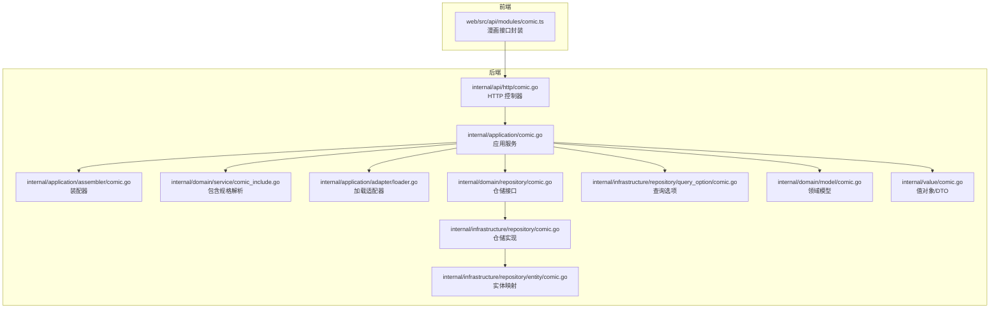
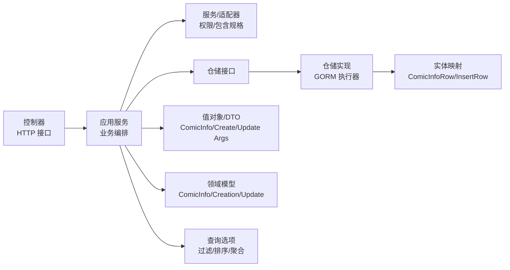
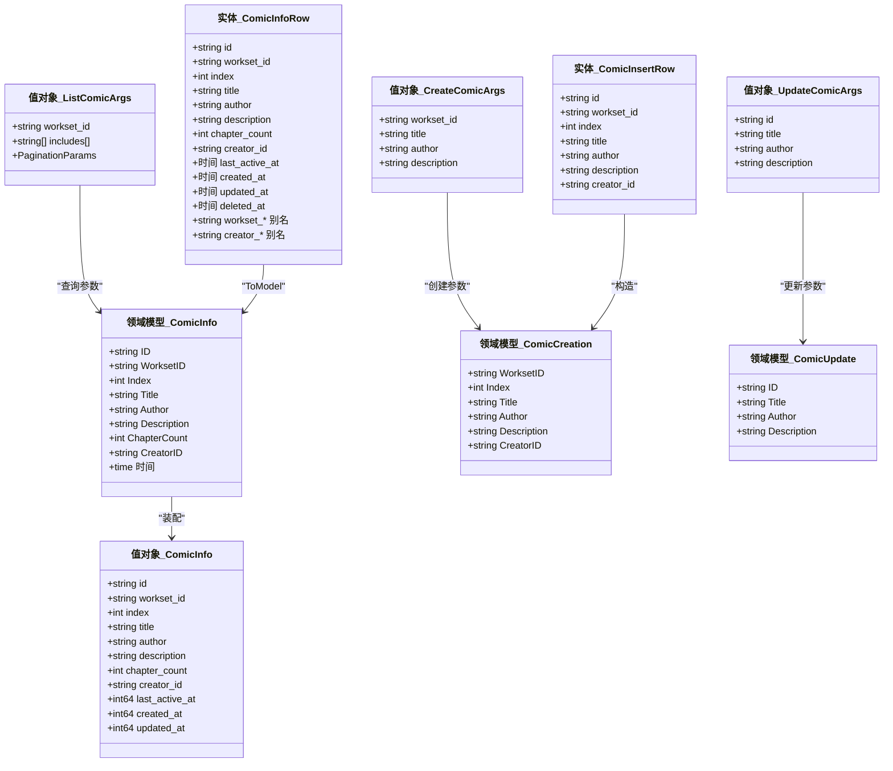
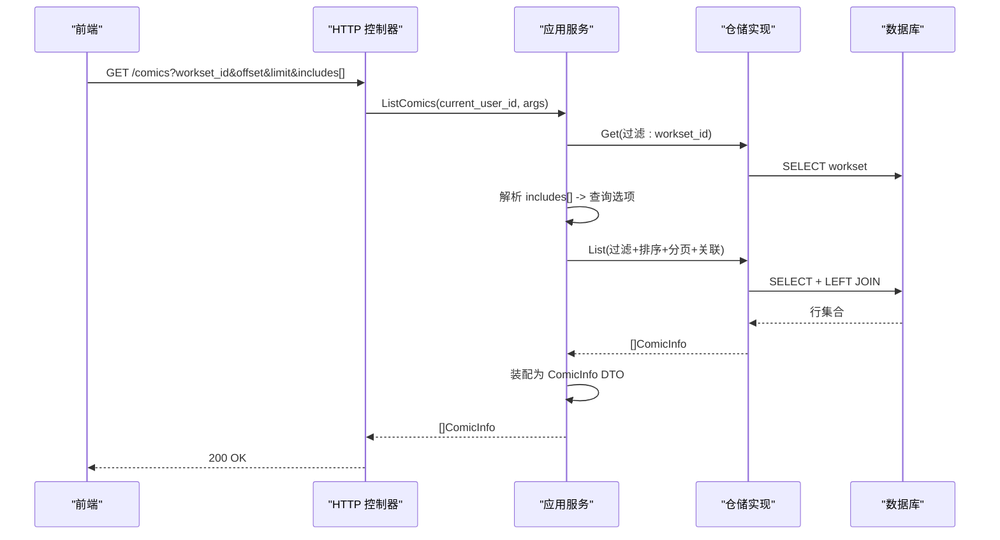
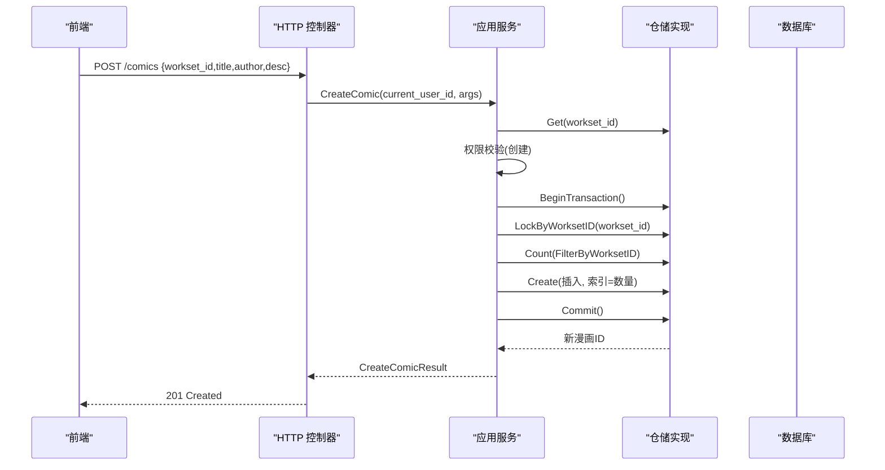
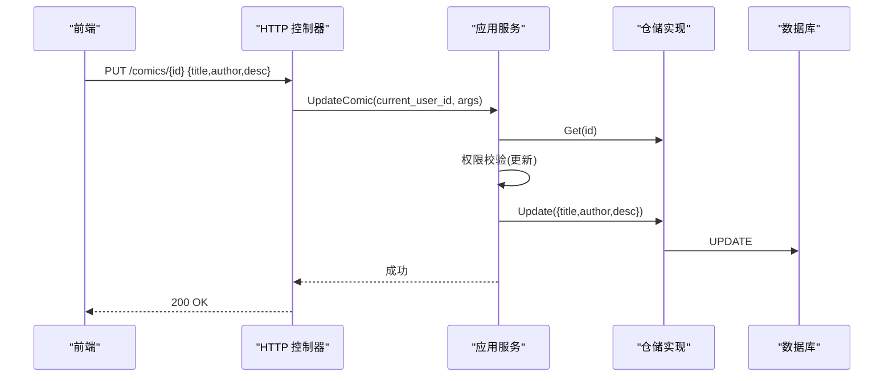
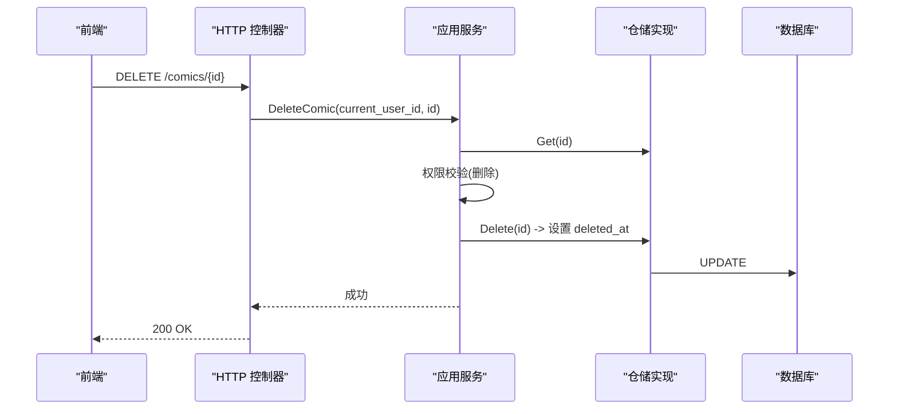
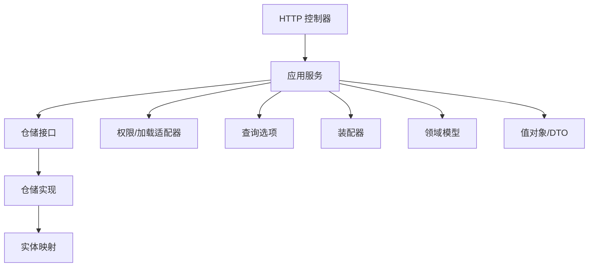
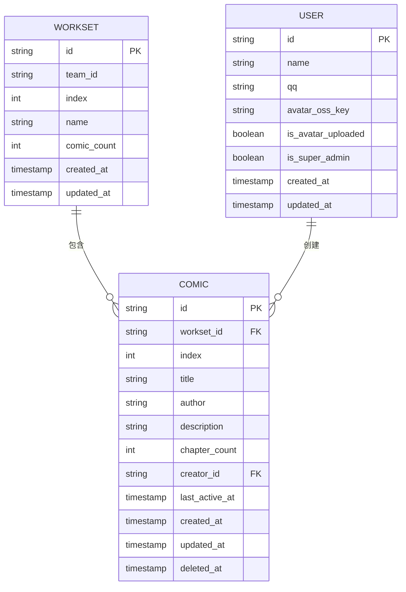

# 漫画管理模块

<cite>
**本文引用的文件**
- [backend-v1/internal/api/http/comic.go](file://backend/backend-v1/internal/api/http/comic.go)
- [backend-v1/internal/application/comic.go](file://backend/backend-v1/internal/application/comic.go)
- [backend-v1/internal/application/assembler/comic.go](file://backend/backend-v1/internal/application/assembler/comic.go)
- [backend-v1/internal/domain/repository/comic.go](file://backend/backend-v1/internal/domain/repository/comic.go)
- [backend-v1/internal/domain/model/comic.go](file://backend/backend-v1/internal/domain/model/comic.go)
- [backend-v1/internal/infrastructure/repository/comic.go](file://backend/backend-v1/internal/infrastructure/repository/comic.go)
- [backend-v1/internal/infrastructure/repository/entity/comic.go](file://backend/backend-v1/internal/infrastructure/repository/entity/comic.go)
- [backend-v1/internal/infrastructure/repository/query_option/comic.go](file://backend/backend-v1/internal/infrastructure/repository/query_option/comic.go)
- [backend-v1/internal/domain/service/comic_include.go](file://backend/backend-v1/internal/domain/service/comic_include.go)
- [backend-v1/internal/application/adapter/loader.go](file://backend/backend-v1/internal/application/adapter/loader.go)
- [backend-v1/internal/value/comic.go](file://backend/backend-v1/internal/value/comic.go)
- [web/src/api/modules/comic.ts](file://web/src/api/modules/comic.ts)
</cite>

## 目录
1. [简介](#简介)
2. [项目结构](#项目结构)
3. [核心组件](#核心组件)
4. [架构总览](#架构总览)
5. [详细组件分析](#详细组件分析)
6. [依赖关系分析](#依赖关系分析)
7. [性能考虑](#性能考虑)
8. [故障排查指南](#故障排查指南)
9. [结论](#结论)
10. [附录](#附录)

## 简介
本文件系统性梳理 Poprako 后端漫画管理模块的设计与实现，覆盖以下方面：
- 漫画的创建、编辑、查询与删除接口设计与实现
- 漫画数据模型、基本信息、封面管理、状态控制与元数据处理
- 漫画分类、标签管理与搜索过滤的 API 设计思路
- 完整操作流程示例：作品创建、信息更新与批量管理
- 漫画与章节、页面的关系处理与数据同步机制
- 漫画状态变更、版本管理与历史记录功能建议
- 数据导入导出、批量操作与性能优化策略

## 项目结构
漫画管理模块位于后端 Go 工程的分层架构中，采用“HTTP 控制器 → 应用服务 → 领域模型/仓储 → 基础设施”的分层组织方式。前端通过统一的 HTTP 客户端封装调用后端接口。

**图表来源**
- [backend-v1/internal/api/http/comic.go:1-189](file://backend/backend-v1/internal/api/http/comic.go#L1-L189)
- [backend-v1/internal/application/comic.go:1-354](file://backend/backend-v1/internal/application/comic.go#L1-L354)
- [backend-v1/internal/application/assembler/comic.go:1-35](file://backend/backend-v1/internal/application/assembler/comic.go#L1-L35)
- [backend-v1/internal/domain/service/comic_include.go:1-25](file://backend/backend-v1/internal/domain/service/comic_include.go#L1-L25)
- [backend-v1/internal/application/adapter/loader.go:1-71](file://backend/backend-v1/internal/application/adapter/loader.go#L1-L71)
- [backend-v1/internal/domain/repository/comic.go:1-15](file://backend/backend-v1/internal/domain/repository/comic.go#L1-L15)
- [backend-v1/internal/infrastructure/repository/comic.go:1-140](file://backend/backend-v1/internal/infrastructure/repository/comic.go#L1-L140)
- [backend-v1/internal/infrastructure/repository/entity/comic.go:1-112](file://backend/backend-v1/internal/infrastructure/repository/entity/comic.go#L1-L112)
- [backend-v1/internal/infrastructure/repository/query_option/comic.go:1-91](file://backend/backend-v1/internal/infrastructure/repository/query_option/comic.go#L1-L91)
- [backend-v1/internal/domain/model/comic.go:1-107](file://backend/backend-v1/internal/domain/model/comic.go#L1-L107)
- [backend-v1/internal/value/comic.go:1-124](file://backend/backend-v1/internal/value/comic.go#L1-L124)

**章节来源**
- [backend-v1/internal/api/http/comic.go:1-189](file://backend/backend-v1/internal/api/http/comic.go#L1-L189)
- [web/src/api/modules/comic.ts:1-70](file://web/src/api/modules/comic.ts#L1-L70)

## 核心组件
- HTTP 控制器：提供漫画列表、创建、更新、删除的 REST 接口，负责参数解析、鉴权与响应封装。
- 应用服务：编排业务流程，执行权限校验、事务控制、装配结果。
- 仓储接口与实现：抽象数据库访问，提供查询、插入、更新、软删除等能力。
- 实体与值对象：定义漫画信息、创建/更新参数、列表查询参数等数据结构。
- 装配器与适配器：将仓储层返回的领域模型转换为对外 DTO，并提供权限检查所需的加载器。
- 查询选项：构建复杂查询（过滤、排序、关联聚合）。

**章节来源**
- [backend-v1/internal/api/http/comic.go:10-189](file://backend/backend-v1/internal/api/http/comic.go#L10-L189)
- [backend-v1/internal/application/comic.go:19-74](file://backend/backend-v1/internal/application/comic.go#L19-L74)
- [backend-v1/internal/infrastructure/repository/comic.go:34-140](file://backend/backend-v1/internal/infrastructure/repository/comic.go#L34-L140)
- [backend-v1/internal/value/comic.go:30-124](file://backend/backend-v1/internal/value/comic.go#L30-L124)

## 架构总览
漫画管理模块遵循整洁架构分层，HTTP 层只做参数与响应处理；应用层负责业务编排与事务；仓储层屏蔽底层存储细节；模型与值对象承载数据契约。

**图表来源**
- [backend-v1/internal/api/http/comic.go:25-52](file://backend/backend-v1/internal/api/http/comic.go#L25-L52)
- [backend-v1/internal/application/comic.go:76-147](file://backend/backend-v1/internal/application/comic.go#L76-L147)
- [backend-v1/internal/infrastructure/repository/comic.go:34-140](file://backend/backend-v1/internal/infrastructure/repository/comic.go#L34-L140)
- [backend-v1/internal/infrastructure/repository/entity/comic.go:11-112](file://backend/backend-v1/internal/infrastructure/repository/entity/comic.go#L11-L112)
- [backend-v1/internal/infrastructure/repository/query_option/comic.go:13-91](file://backend/backend-v1/internal/infrastructure/repository/query_option/comic.go#L13-L91)
- [backend-v1/internal/value/comic.go:8-124](file://backend/backend-v1/internal/value/comic.go#L8-L124)
- [backend-v1/internal/domain/model/comic.go:5-107](file://backend/backend-v1/internal/domain/model/comic.go#L5-L107)

## 详细组件分析

### 数据模型与值对象
- 领域模型
  - ComicInfo：漫画信息，包含工作集 ID、索引、标题、作者、描述、章节数、创建者 ID、最后活跃时间、创建/更新时间等。
  - ComicCreation：创建参数，包含工作集 ID、索引、标题、作者、描述、创建者 ID。
  - ComicUpdate：更新参数，包含 ID、标题、作者、描述。
- 值对象/DTO
  - ComicInfo：对外 JSON 结构，包含 workset、creator 的可选嵌套信息，时间戳以毫秒整型表示。
  - ListComicArgs：列表查询参数，包含工作集 ID、includes[]、分页参数。
  - CreateComicArgs/UpdateComicArgs：创建与更新请求体参数，含长度校验。
- 实体映射
  - ComicInfoRow：仓储查询返回行，支持关联字段别名（工作集与创建者），用于装配。
  - ComicInsertRow：插入行，仅包含写入所需字段。

**图表来源**
- [backend-v1/internal/domain/model/comic.go:5-107](file://backend/backend-v1/internal/domain/model/comic.go#L5-L107)
- [backend-v1/internal/value/comic.go:8-124](file://backend/backend-v1/internal/value/comic.go#L8-L124)
- [backend-v1/internal/infrastructure/repository/entity/comic.go:11-112](file://backend/backend-v1/internal/infrastructure/repository/entity/comic.go#L11-L112)

**章节来源**
- [backend-v1/internal/domain/model/comic.go:5-107](file://backend/backend-v1/internal/domain/model/comic.go#L5-L107)
- [backend-v1/internal/value/comic.go:8-124](file://backend/backend-v1/internal/value/comic.go#L8-L124)
- [backend-v1/internal/infrastructure/repository/entity/comic.go:11-112](file://backend/backend-v1/internal/infrastructure/repository/entity/comic.go#L11-L112)

### API 设计与流程

#### 列表查询
- 接口：GET /comics
- 功能：按工作集分页查询漫画，支持 includes[] 聚合查询工作集与创建者信息。
- 参数：workset_id、offset、limit、includes[]（可选）
- 流程要点：
  - 参数校验与分页参数校验
  - 通过工作集 ID 获取团队 ID，进行权限校验（列表权限）
  - 解析 includes[]，动态拼接关联查询（工作集/创建者）
  - 查询并装配为对外 DTO

**图表来源**
- [backend-v1/internal/api/http/comic.go:25-52](file://backend/backend-v1/internal/api/http/comic.go#L25-L52)
- [backend-v1/internal/application/comic.go:76-147](file://backend/backend-v1/internal/application/comic.go#L76-L147)
- [backend-v1/internal/infrastructure/repository/comic.go:34-54](file://backend/backend-v1/internal/infrastructure/repository/comic.go#L34-L54)
- [backend-v1/internal/infrastructure/repository/query_option/comic.go:13-91](file://backend/backend-v1/internal/infrastructure/repository/query_option/comic.go#L13-L91)
- [backend-v1/internal/application/assembler/comic.go:8-35](file://backend/backend-v1/internal/application/assembler/comic.go#L8-L35)

**章节来源**
- [backend-v1/internal/api/http/comic.go:10-52](file://backend/backend-v1/internal/api/http/comic.go#L10-L52)
- [backend-v1/internal/application/comic.go:76-147](file://backend/backend-v1/internal/application/comic.go#L76-L147)
- [backend-v1/internal/infrastructure/repository/query_option/comic.go:13-91](file://backend/backend-v1/internal/infrastructure/repository/query_option/comic.go#L13-L91)
- [backend-v1/internal/application/assembler/comic.go:8-35](file://backend/backend-v1/internal/application/assembler/comic.go#L8-L35)

#### 创建漫画
- 接口：POST /comics
- 功能：在指定工作集中创建新漫画，自动分配顺序索引。
- 参数：workset_id、title、author、description
- 流程要点：
  - 参数校验（长度限制）
  - 通过工作集获取团队 ID，进行权限校验（创建权限）
  - 开启事务，锁定工作集下漫画记录，统计数量并生成新索引
  - 插入记录，提交事务
  - 返回创建结果（漫画 ID）

**图表来源**
- [backend-v1/internal/api/http/comic.go:67-95](file://backend/backend-v1/internal/api/http/comic.go#L67-L95)
- [backend-v1/internal/application/comic.go:149-246](file://backend/backend-v1/internal/application/comic.go#L149-L246)
- [backend-v1/internal/infrastructure/repository/comic.go:72-117](file://backend/backend-v1/internal/infrastructure/repository/comic.go#L72-L117)

**章节来源**
- [backend-v1/internal/api/http/comic.go:54-95](file://backend/backend-v1/internal/api/http/comic.go#L54-L95)
- [backend-v1/internal/application/comic.go:149-246](file://backend/backend-v1/internal/application/comic.go#L149-L246)
- [backend-v1/internal/infrastructure/repository/comic.go:72-117](file://backend/backend-v1/internal/infrastructure/repository/comic.go#L72-L117)

#### 更新漫画
- 接口：PUT /comics/{comic_id}
- 功能：更新指定漫画的标题、作者与描述。
- 参数：路径 comic_id 与请求体 UpdateComicArgs
- 流程要点：
  - 参数校验（ID 与长度限制）
  - 获取目标漫画，进行权限校验（更新权限）
  - 执行更新操作

**图表来源**
- [backend-v1/internal/api/http/comic.go:111-148](file://backend/backend-v1/internal/api/http/comic.go#L111-L148)
- [backend-v1/internal/application/comic.go:248-303](file://backend/backend-v1/internal/application/comic.go#L248-L303)
- [backend-v1/internal/infrastructure/repository/comic.go:119-130](file://backend/backend-v1/internal/infrastructure/repository/comic.go#L119-L130)

**章节来源**
- [backend-v1/internal/api/http/comic.go:97-148](file://backend/backend-v1/internal/api/http/comic.go#L97-L148)
- [backend-v1/internal/application/comic.go:248-303](file://backend/backend-v1/internal/application/comic.go#L248-L303)
- [backend-v1/internal/infrastructure/repository/comic.go:119-130](file://backend/backend-v1/internal/infrastructure/repository/comic.go#L119-L130)

#### 删除漫画
- 接口：DELETE /comics/{comic_id}
- 功能：软删除指定漫画。
- 参数：路径 comic_id
- 流程要点：
  - 参数校验
  - 获取目标漫画，进行权限校验（删除权限）
  - 执行软删除（设置 deleted_at）

**图表来源**
- [backend-v1/internal/api/http/comic.go:162-188](file://backend/backend-v1/internal/api/http/comic.go#L162-L188)
- [backend-v1/internal/application/comic.go:305-353](file://backend/backend-v1/internal/application/comic.go#L305-L353)
- [backend-v1/internal/infrastructure/repository/comic.go:132-139](file://backend/backend-v1/internal/infrastructure/repository/comic.go#L132-L139)

**章节来源**
- [backend-v1/internal/api/http/comic.go:150-188](file://backend/backend-v1/internal/api/http/comic.go#L150-L188)
- [backend-v1/internal/application/comic.go:305-353](file://backend/backend-v1/internal/application/comic.go#L305-L353)
- [backend-v1/internal/infrastructure/repository/comic.go:132-139](file://backend/backend-v1/internal/infrastructure/repository/comic.go#L132-L139)

### 权限与包含规格
- 权限检查
  - 列表：基于目标工作集所属团队的“列表”权限
  - 创建：基于目标团队的“创建”权限
  - 更新/删除：基于目标漫画的“更新/删除”权限
  - 适配器提供加载成员、漫画、工作集信息的回调，供权限策略使用
- 包含规格解析
  - includes[] 支持 workset、creator，解析为 NeedWorkset/NeedCreator 规格，驱动查询选项拼接关联

**章节来源**
- [backend-v1/internal/application/comic.go:107-114](file://backend/backend-v1/internal/application/comic.go#L107-L114)
- [backend-v1/internal/application/comic.go:180-187](file://backend/backend-v1/internal/application/comic.go#L180-L187)
- [backend-v1/internal/application/comic.go:278-287](file://backend/backend-v1/internal/application/comic.go#L278-L287)
- [backend-v1/internal/application/adapter/loader.go:10-42](file://backend/backend-v1/internal/application/adapter/loader.go#L10-L42)
- [backend-v1/internal/domain/service/comic_include.go:10-24](file://backend/backend-v1/internal/domain/service/comic_include.go#L10-L24)

### 查询选项与关系处理
- 过滤：按工作集 ID、创建者 ID 精确过滤
- 排序：按最后活跃时间降序
- 关联：支持聚合查询工作集与创建者信息，便于 includes[] 的按需加载
- 分页：基于 offset/limit 的分页查询

**章节来源**
- [backend-v1/internal/infrastructure/repository/query_option/comic.go:13-91](file://backend/backend-v1/internal/infrastructure/repository/query_option/comic.go#L13-L91)
- [backend-v1/internal/infrastructure/repository/comic.go:34-54](file://backend/backend-v1/internal/infrastructure/repository/comic.go#L34-L54)

### 前端对接
- 前端提供漫画列表与创建的接口封装，分别对应后端 GET /comics 与 POST /comics
- 类型定义与后端 DTO 对齐，确保参数与响应结构一致

**章节来源**
- [web/src/api/modules/comic.ts:11-70](file://web/src/api/modules/comic.ts#L11-L70)

## 依赖关系分析
- HTTP 控制器依赖应用服务与状态上下文
- 应用服务依赖仓储接口、权限适配器、查询选项与装配器
- 仓储实现依赖 GORM 执行器与实体映射
- 值对象/DTO 与领域模型相互转换，装配器承担转换职责
- 查询选项与实体映射共同决定 SQL 的过滤、排序与关联

**图表来源**
- [backend-v1/internal/api/http/comic.go:25-52](file://backend/backend-v1/internal/api/http/comic.go#L25-L52)
- [backend-v1/internal/application/comic.go:49-74](file://backend/backend-v1/internal/application/comic.go#L49-L74)
- [backend-v1/internal/infrastructure/repository/comic.go:30-32](file://backend/backend-v1/internal/infrastructure/repository/comic.go#L30-L32)
- [backend-v1/internal/application/assembler/comic.go:8-35](file://backend/backend-v1/internal/application/assembler/comic.go#L8-L35)

**章节来源**
- [backend-v1/internal/application/comic.go:42-74](file://backend/backend-v1/internal/application/comic.go#L42-L74)
- [backend-v1/internal/infrastructure/repository/comic.go:14-32](file://backend/backend-v1/internal/infrastructure/repository/comic.go#L14-L32)

## 性能考虑
- 查询性能
  - 使用 includes[] 按需关联，避免不必要的 JOIN
  - 通过过滤与排序减少扫描范围
- 并发与一致性
  - 创建漫画时对工作集加锁并统计数量，保证索引唯一性
  - 使用事务包裹创建流程，失败回滚
- 缓存与装配
  - 装配器将时间戳转为毫秒整型，减少前端重复计算
- 批量操作
  - 当前接口未提供批量导入/导出，建议后续扩展批量创建/更新接口，并结合分页与事务批处理

[本节为通用性能建议，无需特定文件引用]

## 故障排查指南
- 参数错误
  - 列表/创建/更新接口均包含参数校验，若返回 400，检查 workset_id、ID、标题/作者长度等
- 权限不足
  - 若返回 403，确认当前用户在目标团队或目标漫画上的权限是否满足
- 事务与并发
  - 创建漫画可能因并发导致索引冲突，建议重试或捕获约束错误
- 软删除
  - 删除为软删除，查询时注意过滤 deleted_at 字段

**章节来源**
- [backend-v1/internal/api/http/comic.go:34-38](file://backend/backend-v1/internal/api/http/comic.go#L34-L38)
- [backend-v1/internal/api/http/comic.go:76-80](file://backend/backend-v1/internal/api/http/comic.go#L76-L80)
- [backend-v1/internal/api/http/comic.go:126-130](file://backend/backend-v1/internal/api/http/comic.go#L126-L130)
- [backend-v1/internal/application/comic.go:83-86](file://backend/backend-v1/internal/application/comic.go#L83-L86)
- [backend-v1/internal/application/comic.go:156-159](file://backend/backend-v1/internal/application/comic.go#L156-L159)
- [backend-v1/internal/application/comic.go:255-258](file://backend/backend-v1/internal/application/comic.go#L255-L258)
- [backend-v1/internal/infrastructure/repository/comic.go:205-210](file://backend/backend-v1/internal/infrastructure/repository/comic.go#L205-L210)

## 结论
漫画管理模块以清晰的分层架构实现了完整的 CRUD 能力，并通过权限适配器与查询选项提供了灵活的鉴权与查询能力。当前实现聚焦于基础数据模型与接口，后续可在以下方向演进：
- 引入封面管理与元数据扩展（如分类、标签、搜索过滤）
- 增强状态控制与版本/历史记录能力
- 提供批量导入/导出与更丰富的搜索过滤
- 优化并发与事务策略，提升高并发场景稳定性

[本节为总结性内容，无需特定文件引用]

## 附录

### API 定义概览
- 列表查询
  - 方法：GET
  - 路径：/comics
  - 查询参数：workset_id、offset、limit、includes[]（可选）
  - 响应：漫画信息数组
- 创建漫画
  - 方法：POST
  - 路径：/comics
  - 请求体：workset_id、title、author、description
  - 响应：创建结果（含漫画 ID）
- 更新漫画
  - 方法：PUT
  - 路径：/comics/{comic_id}
  - 路径参数：comic_id
  - 请求体：title、author、description
  - 响应：空
- 删除漫画
  - 方法：DELETE
  - 路径：/comics/{comic_id}
  - 路径参数：comic_id
  - 响应：空

**章节来源**
- [backend-v1/internal/api/http/comic.go:10-189](file://backend/backend-v1/internal/api/http/comic.go#L10-L189)
- [web/src/api/modules/comic.ts:51-70](file://web/src/api/modules/comic.ts#L51-L70)

### 数据模型与关系图

**图表来源**
- [backend-v1/internal/infrastructure/repository/entity/comic.go:11-47](file://backend/backend-v1/internal/infrastructure/repository/entity/comic.go#L11-L47)
- [backend-v1/internal/domain/model/workset.go:5-42](file://backend/backend-v1/internal/domain/model/workset.go#L5-L42)
- [backend-v1/internal/domain/model/user.go:7-41](file://backend/backend-v1/internal/domain/model/user.go#L7-L41)