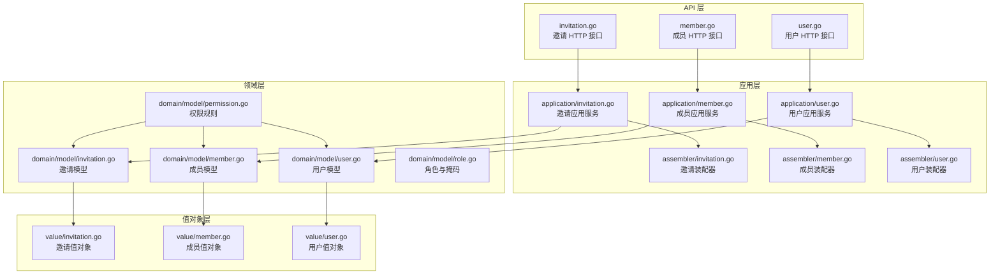
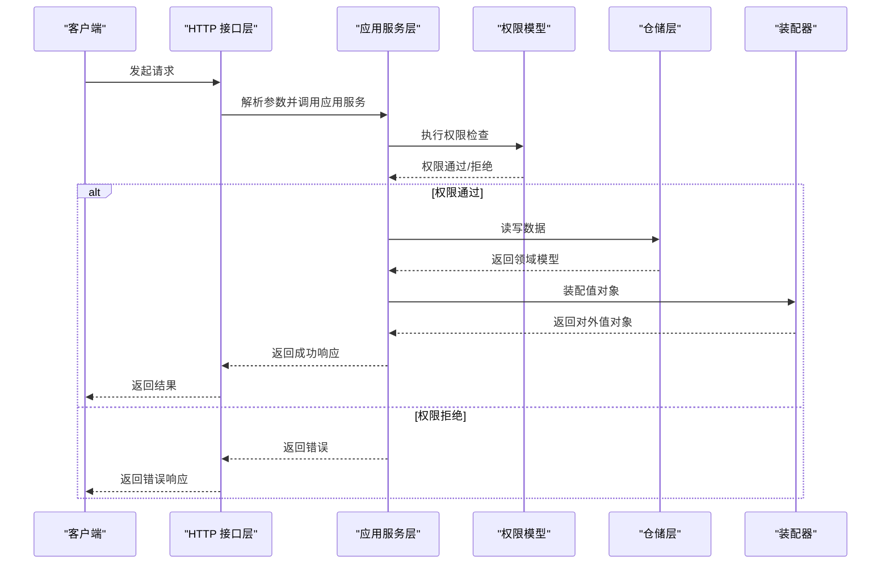
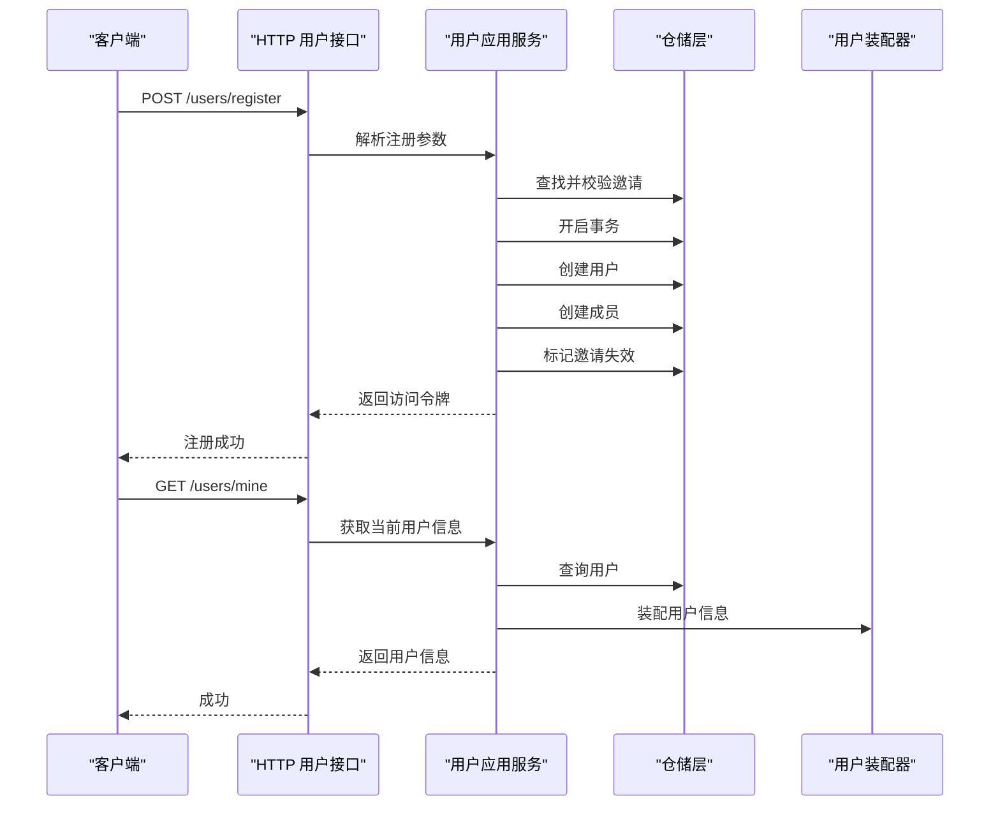
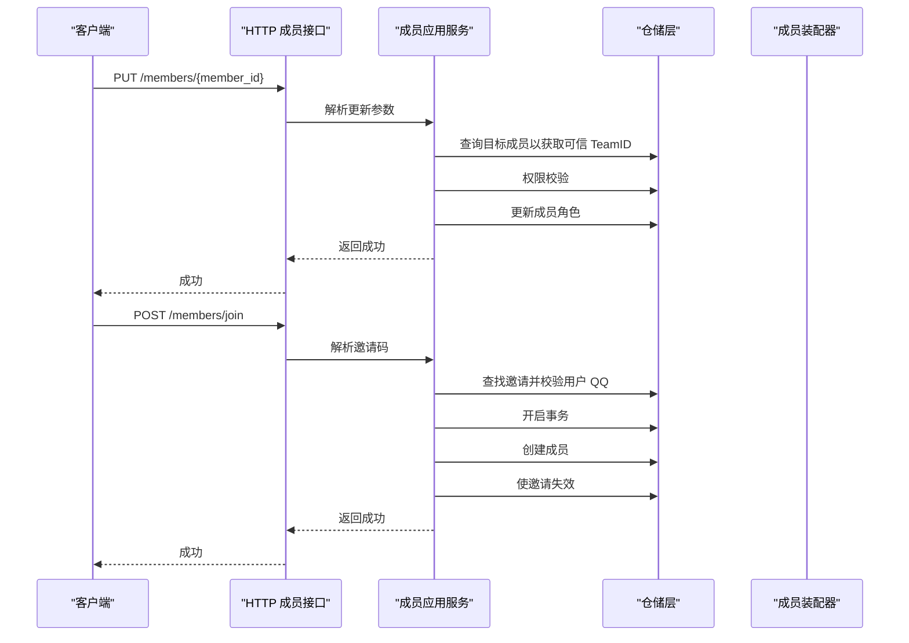
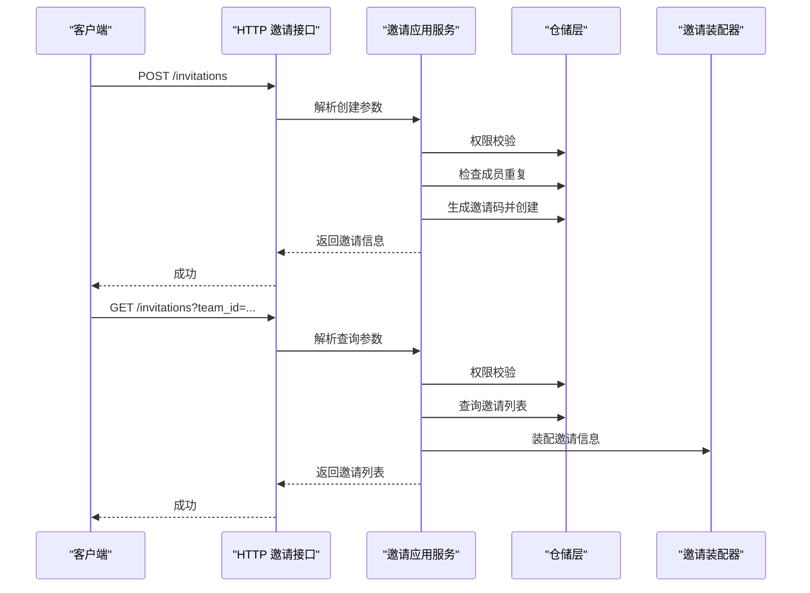
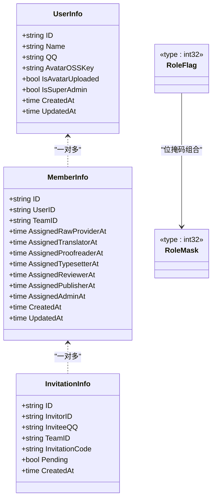
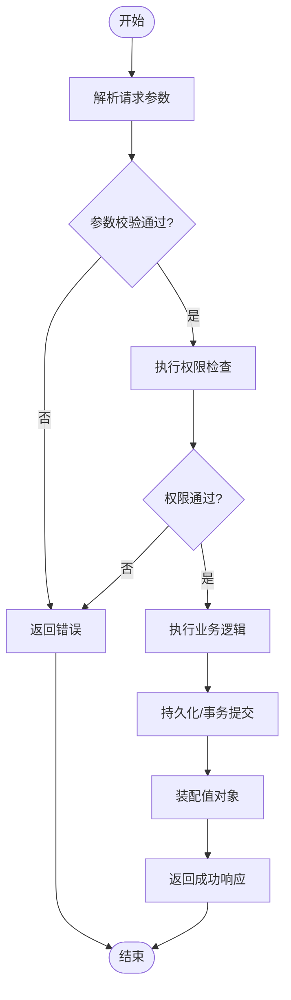
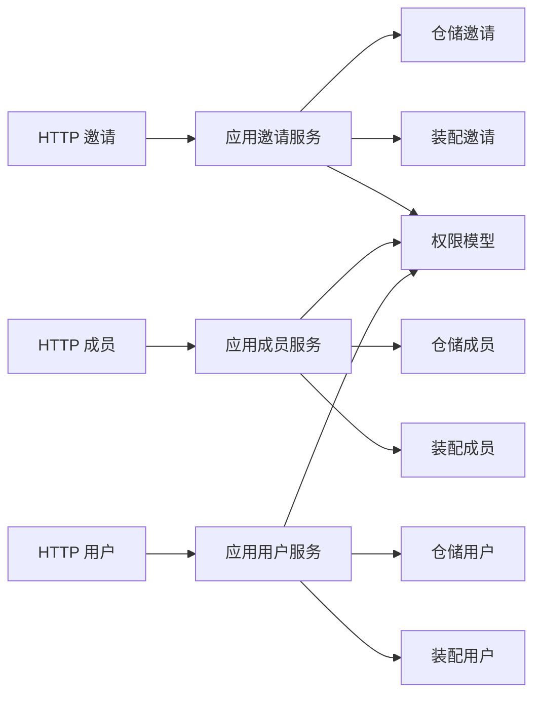

# 用户成员邀请模块

<cite>
**本文档引用的文件**
- [invitation.go](file://backend/backend-v1/internal/api/http/invitation.go)
- [member.go](file://backend/backend-v1/internal/api/http/member.go)
- [user.go](file://backend/backend-v1/internal/api/http/user.go)
- [invitation.go](file://backend/backend-v1/internal/domain/model/invitation.go)
- [member.go](file://backend/backend-v1/internal/domain/model/member.go)
- [user.go](file://backend/backend-v1/internal/domain/model/user.go)
- [role.go](file://backend/backend-v1/internal/domain/model/role.go)
- [permission.go](file://backend/backend-v1/internal/domain/model/permission.go)
- [invitation.go](file://backend/backend-v1/internal/application/invitation.go)
- [member.go](file://backend/backend-v1/internal/application/member.go)
- [user.go](file://backend/backend-v1/internal/application/user.go)
- [invitation.go](file://backend/backend-v1/internal/application/assembler/invitation.go)
- [member.go](file://backend/backend-v1/internal/application/assembler/member.go)
- [user.go](file://backend/backend-v1/internal/application/assembler/user.go)
- [invitation.go](file://backend/backend-v1/internal/value/invitation.go)
- [member.go](file://backend/backend-v1/internal/value/member.go)
- [user.go](file://backend/backend-v1/internal/value/user.go)
</cite>

## 目录
1. [简介](#简介)
2. [项目结构](#项目结构)
3. [核心组件](#核心组件)
4. [架构总览](#架构总览)
5. [详细组件分析](#详细组件分析)
6. [依赖关系分析](#依赖关系分析)
7. [性能考虑](#性能考虑)
8. [故障排除指南](#故障排除指南)
9. [结论](#结论)
10. [附录](#附录)

## 简介
本模块围绕 Poprako 的用户成员邀请体系，提供完整的用户信息管理、成员关系维护与邀请机制的 API 实现。系统通过清晰的分层设计（HTTP 层、应用层、领域层、基础设施层）实现以下能力：
- 用户信息管理：用户注册、登录、资料更新、头像上传与确认、删除等
- 成员关系维护：成员列表查询、个人成员身份查询、成员角色更新、移除成员、主动加入团队
- 邀请机制：创建邀请、列出邀请、更新未使用邀请、删除邀请、通过邀请码加入团队
- 权限控制：基于角色的细粒度权限模型，支持超级管理员与汉化组管理员两级权限
- 数据一致性：事务保障关键业务流程（注册、加入团队），避免竞态条件
- 安全与审计：鉴权、参数校验、日志记录、头像预签名 URL 等

## 项目结构
模块采用分层架构，API 层负责路由与参数解析，应用层编排业务流程，领域层承载模型与权限规则，值对象层定义对外传输结构。

**图表来源**
- [invitation.go:1-185](file://backend/backend-v1/internal/api/http/invitation.go#L1-L185)
- [member.go:1-272](file://backend/backend-v1/internal/api/http/member.go#L1-L272)
- [user.go:1-301](file://backend/backend-v1/internal/api/http/user.go#L1-L301)
- [invitation.go:1-304](file://backend/backend-v1/internal/application/invitation.go#L1-L304)
- [member.go:1-448](file://backend/backend-v1/internal/application/member.go#L1-L448)
- [user.go:1-601](file://backend/backend-v1/internal/application/user.go#L1-L601)
- [invitation.go:1-25](file://backend/backend-v1/internal/application/assembler/invitation.go#L1-L25)
- [member.go:1-38](file://backend/backend-v1/internal/application/assembler/member.go#L1-L38)
- [user.go:1-34](file://backend/backend-v1/internal/application/assembler/user.go#L1-L34)
- [invitation.go:1-158](file://backend/backend-v1/internal/domain/model/invitation.go#L1-L158)
- [member.go:1-205](file://backend/backend-v1/internal/domain/model/member.go#L1-L205)
- [user.go:1-100](file://backend/backend-v1/internal/domain/model/user.go#L1-L100)
- [role.go:1-56](file://backend/backend-v1/internal/domain/model/role.go#L1-L56)
- [permission.go:1-845](file://backend/backend-v1/internal/domain/model/permission.go#L1-L845)
- [invitation.go:1-93](file://backend/backend-v1/internal/value/invitation.go#L1-L93)
- [member.go:1-139](file://backend/backend-v1/internal/value/member.go#L1-L139)
- [user.go:1-187](file://backend/backend-v1/internal/value/user.go#L1-L187)

**章节来源**
- [invitation.go:1-185](file://backend/backend-v1/internal/api/http/invitation.go#L1-L185)
- [member.go:1-272](file://backend/backend-v1/internal/api/http/member.go#L1-L272)
- [user.go:1-301](file://backend/backend-v1/internal/api/http/user.go#L1-L301)

## 核心组件
- HTTP 接口层：提供 RESTful API，负责参数读取、鉴权、错误处理与响应封装
- 应用服务层：编排业务流程，执行权限校验、参数校验、事务控制与装配结果
- 领域模型层：定义用户、成员、邀请、角色与权限的核心数据结构与行为
- 值对象层：定义对外传输的数据结构，确保 API 输出的一致性与安全性

**章节来源**
- [invitation.go:1-304](file://backend/backend-v1/internal/application/invitation.go#L1-L304)
- [member.go:1-448](file://backend/backend-v1/internal/application/member.go#L1-L448)
- [user.go:1-601](file://backend/backend-v1/internal/application/user.go#L1-L601)
- [invitation.go:1-158](file://backend/backend-v1/internal/domain/model/invitation.go#L1-L158)
- [member.go:1-205](file://backend/backend-v1/internal/domain/model/member.go#L1-L205)
- [user.go:1-100](file://backend/backend-v1/internal/domain/model/user.go#L1-L100)
- [role.go:1-56](file://backend/backend-v1/internal/domain/model/role.go#L1-L56)
- [permission.go:1-845](file://backend/backend-v1/internal/domain/model/permission.go#L1-L845)
- [invitation.go:1-93](file://backend/backend-v1/internal/value/invitation.go#L1-L93)
- [member.go:1-139](file://backend/backend-v1/internal/value/member.go#L1-L139)
- [user.go:1-187](file://backend/backend-v1/internal/value/user.go#L1-L187)

## 架构总览
系统遵循 Clean Architecture 思想，HTTP 层只负责协议与参数，应用层编排业务，领域层承载不变的业务规则，值对象层隔离外部接口。

**图表来源**
- [invitation.go:25-53](file://backend/backend-v1/internal/api/http/invitation.go#L25-L53)
- [member.go:23-51](file://backend/backend-v1/internal/api/http/member.go#L23-L51)
- [user.go:24-51](file://backend/backend-v1/internal/api/http/user.go#L24-L51)
- [invitation.go:71-131](file://backend/backend-v1/internal/application/invitation.go#L71-L131)
- [member.go:141-197](file://backend/backend-v1/internal/application/member.go#L141-L197)
- [user.go:281-320](file://backend/backend-v1/internal/application/user.go#L281-L320)
- [permission.go:212-246](file://backend/backend-v1/internal/domain/model/permission.go#L212-L246)

## 详细组件分析

### 用户信息管理
- 登录与注册：登录基于 QQ+密码校验，注册需有效邀请码并在事务中完成用户创建、成员创建与邀请失效
- 用户资料：支持更新姓名、QQ、密码；头像上传采用预签名 URL 流程，先预留 OSS Key，再由客户端直传，最后确认上传完成
- 自身信息：提供“获取我的信息”接口，便于前端保持登录状态
- 删除用户：仅超级管理员可删除，且禁止自删

**图表来源**
- [user.go:24-51](file://backend/backend-v1/internal/api/http/user.go#L24-L51)
- [user.go:157-279](file://backend/backend-v1/internal/application/user.go#L157-L279)
- [user.go:322-362](file://backend/backend-v1/internal/application/user.go#L322-L362)
- [user.go:10-33](file://backend/backend-v1/internal/application/assembler/user.go#L10-L33)

**章节来源**
- [user.go:1-301](file://backend/backend-v1/internal/api/http/user.go#L1-L301)
- [user.go:1-601](file://backend/backend-v1/internal/application/user.go#L1-L601)
- [user.go:1-34](file://backend/backend-v1/internal/application/assembler/user.go#L1-L34)
- [user.go:1-187](file://backend/backend-v1/internal/value/user.go#L1-L187)

### 成员关系维护
- 成员列表：支持按团队过滤、分页与可选关联信息（用户/团队）
- 个人成员身份：查询当前用户在各团队的身份
- 角色更新：PUT 语义，按目标角色全量替换，保留已有角色的时间戳
- 移除成员：仅管理员可执行
- 加入团队：通过邀请码加入，内部使用事务确保原子性

**图表来源**
- [member.go:152-189](file://backend/backend-v1/internal/api/http/member.go#L152-L189)
- [member.go:204-231](file://backend/backend-v1/internal/api/http/member.go#L204-L231)
- [member.go:245-294](file://backend/backend-v1/internal/application/member.go#L245-L294)
- [member.go:340-447](file://backend/backend-v1/internal/application/member.go#L340-L447)
- [member.go:9-37](file://backend/backend-v1/internal/application/assembler/member.go#L9-L37)

**章节来源**
- [member.go:1-272](file://backend/backend-v1/internal/api/http/member.go#L1-L272)
- [member.go:1-448](file://backend/backend-v1/internal/application/member.go#L1-L448)
- [member.go:1-38](file://backend/backend-v1/internal/application/assembler/member.go#L1-L38)
- [member.go:1-139](file://backend/backend-v1/internal/value/member.go#L1-L139)

### 邀请机制
- 创建邀请：校验当前用户在目标团队的管理员权限，检查目标 QQ 是否已是成员，生成唯一邀请码并持久化
- 列出邀请：支持 includes=invitor，按团队过滤与分页
- 更新邀请：仅管理员可更新未使用邀请的角色集合
- 删除邀请：仅管理员可删除
- 接受邀请：通过邀请码与当前用户 QQ 匹配，原子性创建成员并标记邀请失效

**图表来源**
- [invitation.go:68-97](file://backend/backend-v1/internal/api/http/invitation.go#L68-L97)
- [invitation.go:25-53](file://backend/backend-v1/internal/api/http/invitation.go#L25-L53)
- [invitation.go:133-213](file://backend/backend-v1/internal/application/invitation.go#L133-L213)
- [invitation.go:71-131](file://backend/backend-v1/internal/application/invitation.go#L71-L131)
- [invitation.go:8-24](file://backend/backend-v1/internal/application/assembler/invitation.go#L8-L24)

**章节来源**
- [invitation.go:1-185](file://backend/backend-v1/internal/api/http/invitation.go#L1-L185)
- [invitation.go:1-304](file://backend/backend-v1/internal/application/invitation.go#L1-L304)
- [invitation.go:1-25](file://backend/backend-v1/internal/application/assembler/invitation.go#L1-L25)
- [invitation.go:1-93](file://backend/backend-v1/internal/value/invitation.go#L1-L93)

### 数据模型与权限
- 用户模型：包含 ID、姓名、QQ、头像 OSS Key、是否上传头像、是否超级管理员及时间戳
- 成员模型：包含用户 ID、团队 ID、各角色的授予时间戳、创建与更新时间
- 邀请模型：包含邀请者 ID、目标团队 ID、被邀请 QQ、邀请码、角色掩码、创建时间与状态
- 角色与掩码：使用位掩码表达多角色组合，支持掩码与角色数组互转
- 权限模型：基于用户角色与团队成员身份判定，支持邀请、成员、用户等维度的权限

**图表来源**
- [user.go:7-41](file://backend/backend-v1/internal/domain/model/user.go#L7-L41)
- [member.go:48-99](file://backend/backend-v1/internal/domain/model/member.go#L48-L99)
- [invitation.go:63-84](file://backend/backend-v1/internal/domain/model/invitation.go#L63-L84)
- [role.go:3-56](file://backend/backend-v1/internal/domain/model/role.go#L3-L56)

**章节来源**
- [user.go:1-100](file://backend/backend-v1/internal/domain/model/user.go#L1-L100)
- [member.go:1-205](file://backend/backend-v1/internal/domain/model/member.go#L1-L205)
- [invitation.go:1-158](file://backend/backend-v1/internal/domain/model/invitation.go#L1-L158)
- [role.go:1-56](file://backend/backend-v1/internal/domain/model/role.go#L1-L56)
- [permission.go:1-845](file://backend/backend-v1/internal/domain/model/permission.go#L1-L845)

### API 定义与参数校验
- 邀请 API：支持创建、列出、更新、删除邀请，参数包含团队 ID、被邀请 QQ、角色掩码、分页与 includes
- 成员 API：支持创建成员（超级管理员）、列出成员、列出我的成员、更新成员角色、移除成员、通过邀请码加入团队
- 用户 API：支持获取用户、获取我的用户、更新用户、预留头像上传、确认头像上传、删除用户

**图表来源**
- [invitation.go:21-51](file://backend/backend-v1/internal/value/invitation.go#L21-L51)
- [member.go:66-92](file://backend/backend-v1/internal/value/member.go#L66-L92)
- [user.go:13-69](file://backend/backend-v1/internal/value/user.go#L13-L69)

**章节来源**
- [invitation.go:1-93](file://backend/backend-v1/internal/value/invitation.go#L1-L93)
- [member.go:1-139](file://backend/backend-v1/internal/value/member.go#L1-L139)
- [user.go:1-187](file://backend/backend-v1/internal/value/user.go#L1-L187)

## 依赖关系分析
- 组件耦合：HTTP 层仅依赖应用服务接口；应用层依赖仓储接口与装配器；领域层独立于外部实现
- 权限依赖：权限检查依赖成员仓储加载成员信息，避免绕过安全边界
- 事务依赖：注册与加入团队使用事务保证一致性，避免竞态条件

**图表来源**
- [invitation.go:1-185](file://backend/backend-v1/internal/api/http/invitation.go#L1-L185)
- [member.go:1-272](file://backend/backend-v1/internal/api/http/member.go#L1-L272)
- [user.go:1-301](file://backend/backend-v1/internal/api/http/user.go#L1-L301)
- [invitation.go:1-304](file://backend/backend-v1/internal/application/invitation.go#L1-L304)
- [member.go:1-448](file://backend/backend-v1/internal/application/member.go#L1-L448)
- [user.go:1-601](file://backend/backend-v1/internal/application/user.go#L1-L601)
- [permission.go:1-845](file://backend/backend-v1/internal/domain/model/permission.go#L1-L845)

**章节来源**
- [invitation.go:42-69](file://backend/backend-v1/internal/application/invitation.go#L42-L69)
- [member.go:53-82](file://backend/backend-v1/internal/application/member.go#L53-L82)
- [user.go:67-105](file://backend/backend-v1/internal/application/user.go#L67-L105)

## 性能考虑
- 分页与过滤：列表接口均支持分页与过滤，避免一次性返回大量数据
- includes 机制：按需加载关联信息（如 invitor、user、team），减少不必要的查询
- 事务范围：仅在关键流程使用事务，降低锁竞争与延迟
- 缓存与预签名：头像上传采用预签名 URL，减轻服务器压力

## 故障排除指南
- 权限错误：检查当前用户在目标团队的角色，确认是否具备相应权限
- 参数错误：核对请求体字段与查询参数，确保必填项与格式正确
- 记录不存在：确认 ID、邀请码、QQ 等标识符是否正确
- 事务失败：关注应用层日志中的事务回滚信息，定位具体失败步骤

**章节来源**
- [invitation.go:71-131](file://backend/backend-v1/internal/application/invitation.go#L71-L131)
- [member.go:141-197](file://backend/backend-v1/internal/application/member.go#L141-L197)
- [user.go:281-320](file://backend/backend-v1/internal/application/user.go#L281-L320)

## 结论
本模块通过清晰的分层设计与严格的权限控制，实现了用户、成员与邀请的完整生命周期管理。应用层在关键流程中使用事务保证一致性，HTTP 层与值对象层确保接口稳定与安全。建议在后续迭代中进一步细化用户可见性策略与审计日志覆盖范围。

## 附录
- 操作示例（路径参考）
  - 创建邀请：POST /invitations
  - 列出邀请：GET /invitations?team_id={teamId}&offset={offset}&limit={limit}
  - 更新邀请：PUT /invitations/{invitation_id}
  - 删除邀请：DELETE /invitations/{invitation_id}
  - 创建成员：POST /members（超级管理员）
  - 列出成员：GET /members?team_id={teamId}&offset={offset}&limit={limit}
  - 列出我的成员：GET /members/mine?offset={offset}&limit={limit}
  - 更新成员角色：PUT /members/{member_id}
  - 移除成员：DELETE /members/{member_id}
  - 通过邀请加入：POST /members/join
  - 获取用户：GET /users/{user_id}
  - 获取我的用户：GET /users/mine
  - 更新用户：PUT /users/{user_id}
  - 预留头像上传：POST /users/{user_id}/avatar
  - 确认头像上传：POST /users/{user_id}/avatar/confirm
  - 删除用户：DELETE /users/{user_id}