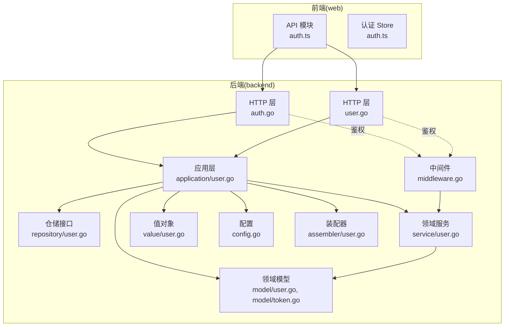
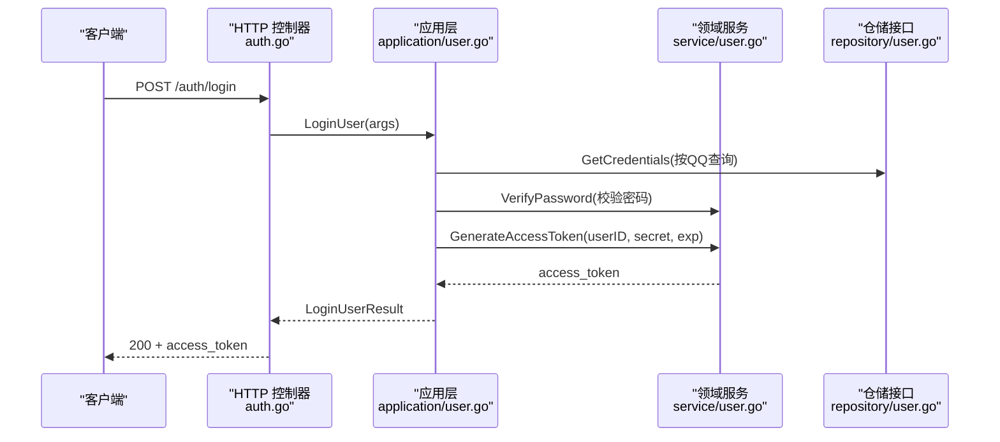
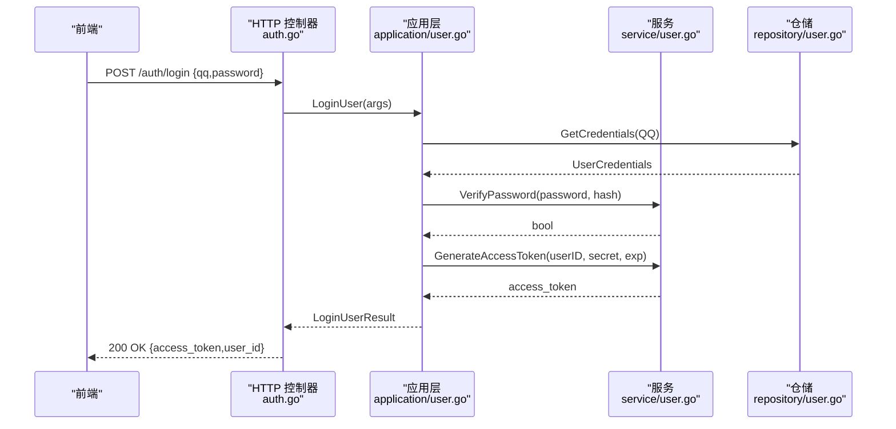
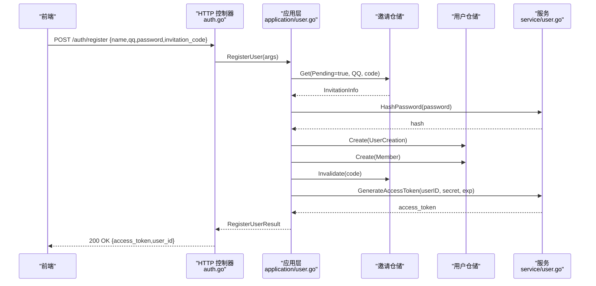
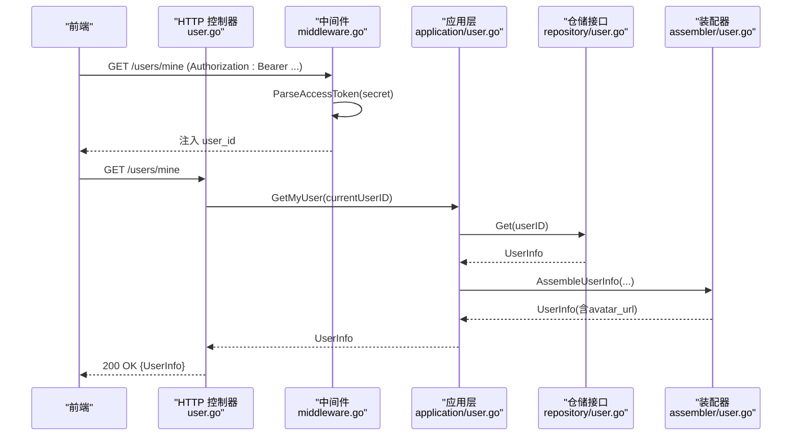
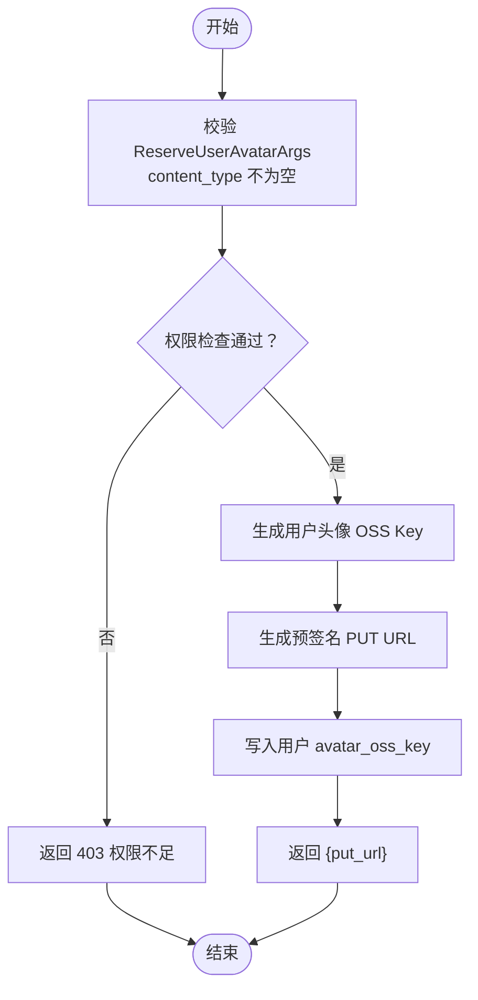
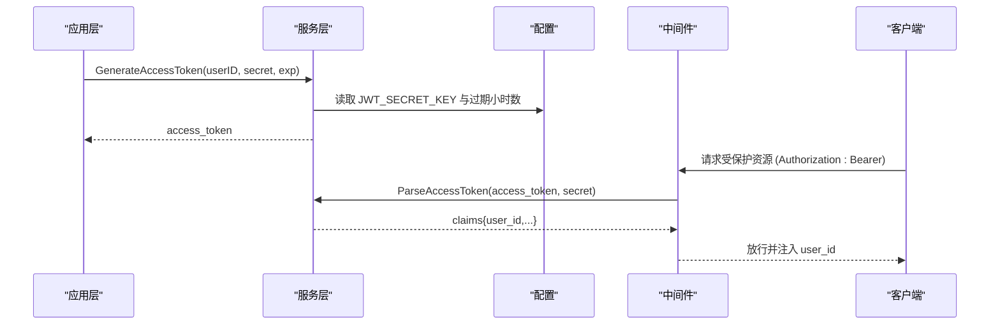
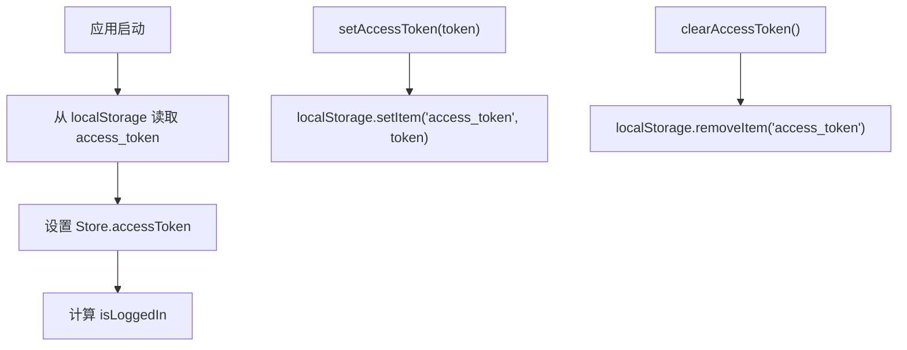
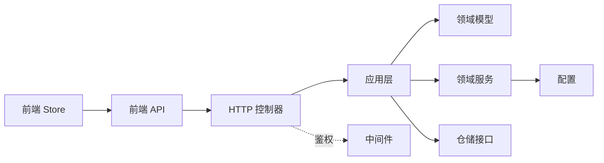

# 认证模块

<cite>
**本文引用的文件**
- [backend-v1/internal/api/http/auth.go](file://backend/backend-v1/internal/api/http/auth.go)
- [backend-v1/internal/api/http/user.go](file://backend/backend-v1/internal/api/http/user.go)
- [backend-v1/internal/api/http/middleware.go](file://backend/backend-v1/internal/api/http/middleware.go)
- [backend-v1/internal/api/http/types.go](file://backend/backend-v1/internal/api/http/types.go)
- [backend-v1/internal/application/user.go](file://backend/backend-v1/internal/application/user.go)
- [backend-v1/internal/application/assembler/user.go](file://backend/backend-v1/internal/application/assembler/user.go)
- [backend-v1/internal/domain/model/user.go](file://backend/backend-v1/internal/domain/model/user.go)
- [backend-v1/internal/domain/model/token.go](file://backend/backend-v1/internal/domain/model/token.go)
- [backend-v1/internal/domain/repository/user.go](file://backend/backend-v1/internal/domain/repository/user.go)
- [backend-v1/internal/domain/service/user.go](file://backend/backend-v1/internal/domain/service/user.go)
- [backend-v1/internal/value/user.go](file://backend/backend-v1/internal/value/user.go)
- [backend-v1/internal/config/config.go](file://backend/backend-v1/internal/config/config.go)
- [web/src/api/modules/auth.ts](file://web/src/api/modules/auth.ts)
- [web/src/stores/auth.ts](file://web/src/stores/auth.ts)
</cite>

## 目录
1. [简介](#简介)
2. [项目结构](#项目结构)
3. [核心组件](#核心组件)
4. [架构总览](#架构总览)
5. [详细组件分析](#详细组件分析)
6. [依赖关系分析](#依赖关系分析)
7. [性能考量](#性能考量)
8. [故障排查指南](#故障排查指南)
9. [结论](#结论)
10. [附录](#附录)

## 简介
本文件系统性梳理 Poprako 认证模块的完整实现，覆盖登录、注册、当前用户信息获取以及头像上传相关接口。文档重点说明：
- 接口参数类型、响应结构与错误处理
- JWT 令牌的生成、验证与刷新流程
- QQ 登录集成与密码注册的安全实现
- 使用示例（参数校验、响应处理、异常捕获）
- 认证状态管理、本地存储策略与会话持久化
- 安全最佳实践、令牌过期处理与多设备登录管理

## 项目结构
认证模块由前后端协作完成：
- 后端采用分层架构：HTTP 层负责路由与请求/响应包装；应用层编排业务逻辑；领域层定义模型与服务；值对象层承载输入输出结构；配置层提供密钥与过期时间等参数。
- 前端通过 API 模块封装认证与用户信息接口，Pinia Store 统一管理访问令牌与登录态，并持久化至本地存储。

图表来源
- [backend-v1/internal/api/http/auth.go:1-73](file://backend/backend-v1/internal/api/http/auth.go#L1-L73)
- [backend-v1/internal/api/http/user.go:1-301](file://backend/backend-v1/internal/api/http/user.go#L1-L301)
- [backend-v1/internal/api/http/middleware.go:1-80](file://backend/backend-v1/internal/api/http/middleware.go#L1-L80)
- [backend-v1/internal/application/user.go:1-601](file://backend/backend-v1/internal/application/user.go#L1-L601)
- [backend-v1/internal/domain/model/user.go:1-100](file://backend/backend-v1/internal/domain/model/user.go#L1-L100)
- [backend-v1/internal/domain/model/token.go:1-9](file://backend/backend-v1/internal/domain/model/token.go#L1-L9)
- [backend-v1/internal/domain/repository/user.go:1-16](file://backend/backend-v1/internal/domain/repository/user.go#L1-L16)
- [backend-v1/internal/domain/service/user.go:1-93](file://backend/backend-v1/internal/domain/service/user.go#L1-L93)
- [backend-v1/internal/value/user.go:1-187](file://backend/backend-v1/internal/value/user.go#L1-L187)
- [backend-v1/internal/config/config.go:1-101](file://backend/backend-v1/internal/config/config.go#L1-L101)
- [backend-v1/internal/application/assembler/user.go:1-34](file://backend/backend-v1/internal/application/assembler/user.go#L1-L34)
- [web/src/api/modules/auth.ts:1-157](file://web/src/api/modules/auth.ts#L1-L157)
- [web/src/stores/auth.ts:1-52](file://web/src/stores/auth.ts#L1-L52)

章节来源
- [backend-v1/internal/api/http/auth.go:1-73](file://backend/backend-v1/internal/api/http/auth.go#L1-L73)
- [backend-v1/internal/api/http/user.go:1-301](file://backend/backend-v1/internal/api/http/user.go#L1-L301)
- [web/src/api/modules/auth.ts:1-157](file://web/src/api/modules/auth.ts#L1-L157)
- [web/src/stores/auth.ts:1-52](file://web/src/stores/auth.ts#L1-L52)

## 核心组件
- HTTP 层路由与控制器：提供 /auth/login、/auth/register、/users/mine、/users/{user_id}/avatar、/users/{user_id}/avatar/confirm 等接口。
- 应用层编排：LoginUser、RegisterUser、GetMyUser、ReserveUserAvatar、ConfirmUserAvatarUploaded 等业务流程。
- 领域模型与服务：TokenClaims、UserCredentials、GenerateAccessToken/ParseAccessToken、VerifyPassword/HashPassword。
- 值对象：LoginUserArgs/LoginUserResult、RegisterUserArgs/RegisterUserResult、UserInfo、ReserveUserAvatarArgs/Result。
- 中间件：日志与鉴权中间件，统一从 Authorization 头提取 Bearer 令牌并解析。
- 前端 API 封装与 Pinia Store：统一封装登录/注册/获取当前用户/头像预留/确认上传等方法，并持久化访问令牌。

章节来源
- [backend-v1/internal/api/http/auth.go:10-72](file://backend/backend-v1/internal/api/http/auth.go#L10-L72)
- [backend-v1/internal/api/http/user.go:98-300](file://backend/backend-v1/internal/api/http/user.go#L98-L300)
- [backend-v1/internal/application/user.go:21-105](file://backend/backend-v1/internal/application/user.go#L21-L105)
- [backend-v1/internal/domain/model/token.go:1-9](file://backend/backend-v1/internal/domain/model/token.go#L1-L9)
- [backend-v1/internal/domain/service/user.go:15-93](file://backend/backend-v1/internal/domain/service/user.go#L15-L93)
- [backend-v1/internal/value/user.go:8-114](file://backend/backend-v1/internal/value/user.go#L8-L114)
- [backend-v1/internal/api/http/middleware.go:47-80](file://backend/backend-v1/internal/api/http/middleware.go#L47-L80)
- [web/src/api/modules/auth.ts:102-156](file://web/src/api/modules/auth.ts#L102-L156)
- [web/src/stores/auth.ts:15-51](file://web/src/stores/auth.ts#L15-L51)

## 架构总览
认证模块遵循“HTTP 控制器 → 应用层 → 领域模型/服务 → 仓储接口”的分层设计。JWT 令牌在登录成功后生成并返回给前端；后续受保护接口通过中间件解析并注入用户上下文。

图表来源
- [backend-v1/internal/api/http/auth.go:22-40](file://backend/backend-v1/internal/api/http/auth.go#L22-L40)
- [backend-v1/internal/application/user.go:107-155](file://backend/backend-v1/internal/application/user.go#L107-L155)
- [backend-v1/internal/domain/service/user.go:15-41](file://backend/backend-v1/internal/domain/service/user.go#L15-L41)
- [backend-v1/internal/domain/repository/user.go:9-9](file://backend/backend-v1/internal/domain/repository/user.go#L9-L9)

章节来源
- [backend-v1/internal/api/http/auth.go:10-40](file://backend/backend-v1/internal/api/http/auth.go#L10-L40)
- [backend-v1/internal/application/user.go:107-155](file://backend/backend-v1/internal/application/user.go#L107-L155)
- [backend-v1/internal/domain/service/user.go:15-41](file://backend/backend-v1/internal/domain/service/user.go#L15-L41)

## 详细组件分析

### 登录接口 loginUser
- 功能：使用 QQ 与密码登录，成功返回访问令牌与用户 ID。
- 请求路径：POST /auth/login
- 请求体类型：LoginUserRequest（对应 LoginUserArgs）
- 响应体类型：LoginUserResponse（对应 LoginUserResult）
- 参数校验：QQ 与密码均不能为空；前端/后端均有校验保障。
- 错误处理：
  - 请求体格式错误：400
  - 用户不存在或密码错误：401
  - 生成访问令牌失败：500
- 响应字段：
  - access_token：JWT 访问令牌
  - user_id：登录用户标识

图表来源
- [web/src/api/modules/auth.ts:102-109](file://web/src/api/modules/auth.ts#L102-L109)
- [backend-v1/internal/api/http/auth.go:22-40](file://backend/backend-v1/internal/api/http/auth.go#L22-L40)
- [backend-v1/internal/application/user.go:107-155](file://backend/backend-v1/internal/application/user.go#L107-L155)
- [backend-v1/internal/domain/service/user.go:15-41](file://backend/backend-v1/internal/domain/service/user.go#L15-L41)
- [backend-v1/internal/domain/repository/user.go:9-9](file://backend/backend-v1/internal/domain/repository/user.go#L9-L9)

章节来源
- [backend-v1/internal/api/http/auth.go:10-40](file://backend/backend-v1/internal/api/http/auth.go#L10-L40)
- [backend-v1/internal/value/user.go:8-32](file://backend/backend-v1/internal/value/user.go#L8-L32)
- [web/src/api/modules/auth.ts:102-109](file://web/src/api/modules/auth.ts#L102-L109)

### 注册接口 registerUser
- 功能：使用 QQ、密码、姓名与邀请码注册，成功返回访问令牌与新用户 ID。
- 请求路径：POST /auth/register
- 请求体类型：RegisterUserRequest（对应 RegisterUserArgs）
- 响应体类型：RegisterUserResponse（对应 RegisterUserResult）
- 参数校验：QQ 长度 5–20，密码长度 6–30，姓名长度 2–20，邀请码必填；前后端均有校验。
- 错误处理：
  - 请求体格式错误：400
  - 无法获取邀请信息：400
  - 创建用户失败（事务回滚/提交失败）：500
  - 生成访问令牌失败：500
- 响应字段：access_token、user_id

图表来源
- [web/src/api/modules/auth.ts:116-123](file://web/src/api/modules/auth.ts#L116-L123)
- [backend-v1/internal/api/http/auth.go:54-72](file://backend/backend-v1/internal/api/http/auth.go#L54-L72)
- [backend-v1/internal/application/user.go:157-279](file://backend/backend-v1/internal/application/user.go#L157-L279)
- [backend-v1/internal/domain/service/user.go:15-41](file://backend/backend-v1/internal/domain/service/user.go#L15-L41)
- [backend-v1/internal/domain/repository/user.go:9-9](file://backend/backend-v1/internal/domain/repository/user.go#L9-L9)

章节来源
- [backend-v1/internal/api/http/auth.go:42-72](file://backend/backend-v1/internal/api/http/auth.go#L42-L72)
- [backend-v1/internal/value/user.go:34-74](file://backend/backend-v1/internal/value/user.go#L34-L74)
- [backend-v1/internal/application/user.go:157-279](file://backend/backend-v1/internal/application/user.go#L157-L279)
- [web/src/api/modules/auth.ts:116-123](file://web/src/api/modules/auth.ts#L116-L123)

### 当前用户信息获取 getCurrentUserProfile
- 功能：获取当前登录用户的详细信息，用于保持登录状态。
- 请求路径：GET /users/mine
- 鉴权：需携带 Bearer 令牌，中间件解析并注入 user_id。
- 响应体类型：GetCurrentUserProfileResponse（对应 UserInfo）
- 错误处理：
  - 未提供 Authorization 或格式错误：401
  - 令牌无效或不含用户信息：401
  - 无权限查看或用户不存在：403
- 响应字段：id、name、qq、avatar_url、is_avatar_uploaded、is_super_admin、created_at、updated_at

图表来源
- [web/src/api/modules/auth.ts:130-132](file://web/src/api/modules/auth.ts#L130-L132)
- [backend-v1/internal/api/http/user.go:283-300](file://backend/backend-v1/internal/api/http/user.go#L283-L300)
- [backend-v1/internal/api/http/middleware.go:47-80](file://backend/backend-v1/internal/api/http/middleware.go#L47-L80)
- [backend-v1/internal/application/user.go:322-362](file://backend/backend-v1/internal/application/user.go#L322-L362)
- [backend-v1/internal/application/assembler/user.go:10-33](file://backend/backend-v1/internal/application/assembler/user.go#L10-L33)
- [backend-v1/internal/domain/repository/user.go:8-8](file://backend/backend-v1/internal/domain/repository/user.go#L8-L8)

章节来源
- [backend-v1/internal/api/http/user.go:272-300](file://backend/backend-v1/internal/api/http/user.go#L272-L300)
- [backend-v1/internal/api/http/middleware.go:47-80](file://backend/backend-v1/internal/api/http/middleware.go#L47-L80)
- [backend-v1/internal/application/user.go:322-362](file://backend/backend-v1/internal/application/user.go#L322-L362)
- [backend-v1/internal/application/assembler/user.go:10-33](file://backend/backend-v1/internal/application/assembler/user.go#L10-L33)
- [web/src/api/modules/auth.ts:130-132](file://web/src/api/modules/auth.ts#L130-L132)

### 头像上传相关接口
- 预留头像上传 reserveUserAvatar
  - 功能：为指定用户生成预签名 PUT URL，并预留 avatar_oss_key。
  - 请求路径：POST /users/{user_id}/avatar
  - 请求体：ReserveUserAvatarArgs（content_type 必填）
  - 响应体：ReserveUserAvatarResponse（put_url）
  - 权限：仅被授权用户可操作
  - 错误：400/401/403，生成 URL 或写入 OSS Key 失败时返回 500
- 确认头像上传 confirmUserAvatarUploaded
  - 功能：客户端上传完成后，确认用户头像上传状态。
  - 请求路径：POST /users/{user_id}/avatar/confirm
  - 响应：200 成功，否则 400/401/403

图表来源
- [backend-v1/internal/api/http/user.go:110-144](file://backend/backend-v1/internal/api/http/user.go#L110-L144)
- [backend-v1/internal/application/user.go:427-475](file://backend/backend-v1/internal/application/user.go#L427-L475)
- [backend-v1/internal/domain/service/user.go:86-88](file://backend/backend-v1/internal/domain/service/user.go#L86-L88)

章节来源
- [backend-v1/internal/api/http/user.go:98-184](file://backend/backend-v1/internal/api/http/user.go#L98-L184)
- [backend-v1/internal/application/user.go:427-562](file://backend/backend-v1/internal/application/user.go#L427-L562)
- [backend-v1/internal/value/user.go:95-109](file://backend/backend-v1/internal/value/user.go#L95-L109)
- [web/src/api/modules/auth.ts:139-156](file://web/src/api/modules/auth.ts#L139-L156)

### JWT 令牌生成、验证与刷新
- 生成：应用层在登录/注册成功后调用服务层生成访问令牌，包含用户 ID、签发时间、过期时间与签发者等声明。
- 验证：中间件从 Authorization 头解析 Bearer 令牌，使用相同密钥与 HS256 算法验证有效性，并将 user_id 注入上下文。
- 刷新：当前代码未实现专用刷新接口；建议在生产环境引入 refresh token 流程，避免频繁重新登录。

图表来源
- [backend-v1/internal/application/user.go:141-149](file://backend/backend-v1/internal/application/user.go#L141-L149)
- [backend-v1/internal/domain/service/user.go:15-68](file://backend/backend-v1/internal/domain/service/user.go#L15-L68)
- [backend-v1/internal/config/config.go:69-83](file://backend/backend-v1/internal/config/config.go#L69-L83)
- [backend-v1/internal/api/http/middleware.go:47-79](file://backend/backend-v1/internal/api/http/middleware.go#L47-L79)

章节来源
- [backend-v1/internal/domain/model/token.go:5-8](file://backend/backend-v1/internal/domain/model/token.go#L5-L8)
- [backend-v1/internal/domain/service/user.go:15-68](file://backend/backend-v1/internal/domain/service/user.go#L15-L68)
- [backend-v1/internal/config/config.go:69-83](file://backend/backend-v1/internal/config/config.go#L69-L83)
- [backend-v1/internal/api/http/middleware.go:47-79](file://backend/backend-v1/internal/api/http/middleware.go#L47-L79)

### QQ 登录集成与密码注册安全
- QQ 登录：登录接口使用 QQ 作为唯一标识，结合密码校验完成身份认证。
- 密码注册：注册接口要求有效邀请码，密码经 bcrypt 哈希后存入数据库；应用层在事务中完成用户与成员信息创建及邀请失效处理，保证一致性。
- 安全要点：
  - 密码使用 bcrypt 哈希，避免明文存储
  - 参数校验严格，防止越界与空值
  - 事务保证注册过程原子性
  - 令牌过期时间可配置，降低长期暴露风险

章节来源
- [backend-v1/internal/application/user.go:107-155](file://backend/backend-v1/internal/application/user.go#L107-L155)
- [backend-v1/internal/application/user.go:157-279](file://backend/backend-v1/internal/application/user.go#L157-L279)
- [backend-v1/internal/domain/service/user.go:70-84](file://backend/backend-v1/internal/domain/service/user.go#L70-L84)
- [backend-v1/internal/value/user.go:34-69](file://backend/backend-v1/internal/value/user.go#L34-L69)

### 使用示例（参数验证、响应处理、异常捕获）
- 登录
  - 参数：{ qq, password }
  - 响应：{ access_token, user_id }
  - 异常：400 请求体格式错误；401 未授权（用户不存在或密码错误）
- 注册
  - 参数：{ name, qq, password, invitation_code }
  - 响应：{ access_token, user_id }
  - 异常：400 邀请无效或参数校验失败；500 生成令牌或创建失败
- 获取当前用户
  - 参数：无
  - 响应：UserInfo
  - 异常：401 令牌无效；403 权限不足或用户不存在
- 头像预留/确认
  - 参数：ReserveUserAvatarArgs（content_type）、目标用户 ID
  - 响应：ReserveUserAvatarResponse（put_url）、确认无响应体
  - 异常：400/401/403；生成 URL 或写入失败 500

章节来源
- [web/src/api/modules/auth.ts:102-156](file://web/src/api/modules/auth.ts#L102-L156)
- [backend-v1/internal/value/user.go:8-114](file://backend/backend-v1/internal/value/user.go#L8-L114)
- [backend-v1/internal/api/http/user.go:98-184](file://backend/backend-v1/internal/api/http/user.go#L98-L184)

### 认证状态管理、本地存储策略与会话持久化
- 前端 Store
  - 存储键名：access_token
  - 方法：setAccessToken、clearAccessToken
  - 计算属性：isLoggedIn（基于 access_token 长度判断）
- 会话持久化：初始化时从 localStorage 读取 access_token；每次设置/清除同步到本地存储。
- 建议：在路由守卫中读取 Store 的 isLoggedIn 决定页面放行；在请求拦截器中将 access_token 注入 Authorization 头。

图表来源
- [web/src/stores/auth.ts:15-51](file://web/src/stores/auth.ts#L15-L51)

章节来源
- [web/src/stores/auth.ts:1-52](file://web/src/stores/auth.ts#L1-L52)

## 依赖关系分析
- 控制器依赖应用层；应用层依赖领域模型、服务与仓储接口；服务层依赖配置与第三方库（JWT、bcrypt）。
- 中间件依赖配置中的 JWT 密钥与服务层的令牌解析。
- 前端 API 模块依赖 HTTP 客户端与类型定义；Store 依赖浏览器本地存储。

图表来源
- [backend-v1/internal/api/http/auth.go:22-40](file://backend/backend-v1/internal/api/http/auth.go#L22-L40)
- [backend-v1/internal/application/user.go:67-105](file://backend/backend-v1/internal/application/user.go#L67-L105)
- [backend-v1/internal/domain/service/user.go:15-41](file://backend/backend-v1/internal/domain/service/user.go#L15-L41)
- [backend-v1/internal/config/config.go:69-83](file://backend/backend-v1/internal/config/config.go#L69-L83)
- [backend-v1/internal/api/http/middleware.go:47-79](file://backend/backend-v1/internal/api/http/middleware.go#L47-L79)
- [web/src/api/modules/auth.ts:102-156](file://web/src/api/modules/auth.ts#L102-L156)
- [web/src/stores/auth.ts:15-51](file://web/src/stores/auth.ts#L15-L51)

章节来源
- [backend-v1/internal/api/http/auth.go:1-73](file://backend/backend-v1/internal/api/http/auth.go#L1-L73)
- [backend-v1/internal/application/user.go:1-105](file://backend/backend-v1/internal/application/user.go#L1-L105)
- [backend-v1/internal/domain/service/user.go:1-41](file://backend/backend-v1/internal/domain/service/user.go#L1-L41)
- [backend-v1/internal/config/config.go:1-83](file://backend/backend-v1/internal/config/config.go#L1-L83)
- [backend-v1/internal/api/http/middleware.go:1-80](file://backend/backend-v1/internal/api/http/middleware.go#L1-L80)
- [web/src/api/modules/auth.ts:1-157](file://web/src/api/modules/auth.ts#L1-L157)
- [web/src/stores/auth.ts:1-52](file://web/src/stores/auth.ts#L1-L52)

## 性能考量
- 令牌生成与解析：HS256 算法开销极低，性能影响可忽略。
- 密码哈希：bcrypt 默认成本在高安全与性能间平衡，注册/登录时延主要来自哈希计算。
- 数据库事务：注册流程在单事务内完成多表写入，减少往返与锁竞争。
- 前端缓存：Store 仅缓存 access_token，避免冗余状态；头像 URL 由后端预签名，前端直接上传，减少额外请求。

## 故障排查指南
- 400 请求体格式错误
  - 检查请求体 JSON 结构与字段类型是否符合 LoginUserArgs/RegisterUserArgs/ReserveUserAvatarArgs。
  - 前端可通过类型约束与校验函数提前发现。
- 401 未提供或无效 Authorization
  - 确认请求头 Authorization: Bearer <token> 格式正确。
  - 检查 JWT_SECRET_KEY 是否与服务端一致。
- 403 权限不足
  - 确认当前用户对目标资源具备更新/查看权限。
  - 超级管理员可绕过部分限制。
- 500 生成访问令牌失败/预留头像失败
  - 检查服务层日志与配置项（JWT_SECRET_KEY、过期小时数）。
  - 确认 OSS 客户端可用并具备生成预签名 URL 权限。

章节来源
- [backend-v1/internal/api/http/auth.go:27-36](file://backend/backend-v1/internal/api/http/auth.go#L27-L36)
- [backend-v1/internal/api/http/user.go:125-143](file://backend/backend-v1/internal/api/http/user.go#L125-L143)
- [backend-v1/internal/application/user.go:141-149](file://backend/backend-v1/internal/application/user.go#L141-L149)
- [backend-v1/internal/api/http/middleware.go:50-78](file://backend/backend-v1/internal/api/http/middleware.go#L50-L78)

## 结论
Poprako 认证模块以清晰的分层架构实现了登录、注册、当前用户信息获取与头像上传能力。通过严格的参数校验、bcrypt 密码哈希、JWT 令牌与中间件鉴权，以及事务化的注册流程，系统在安全性与可维护性上表现良好。建议后续补充刷新令牌与多设备登录管理策略，进一步提升用户体验与安全性。

## 附录
- 关键类型映射
  - LoginUserArgs/LoginUserResult：登录接口参数与响应
  - RegisterUserArgs/RegisterUserResult：注册接口参数与响应
  - UserInfo：用户信息值对象
  - ReserveUserAvatarArgs/ReserveUserAvatarResult：头像预留参数与响应
- 配置项
  - JWT_SECRET_KEY：JWT 密钥（必需）
  - expiration_hours：访问令牌过期小时数（可配置）

章节来源
- [backend-v1/internal/value/user.go:8-114](file://backend/backend-v1/internal/value/user.go#L8-L114)
- [backend-v1/internal/config/config.go:69-83](file://backend/backend-v1/internal/config/config.go#L69-L83)