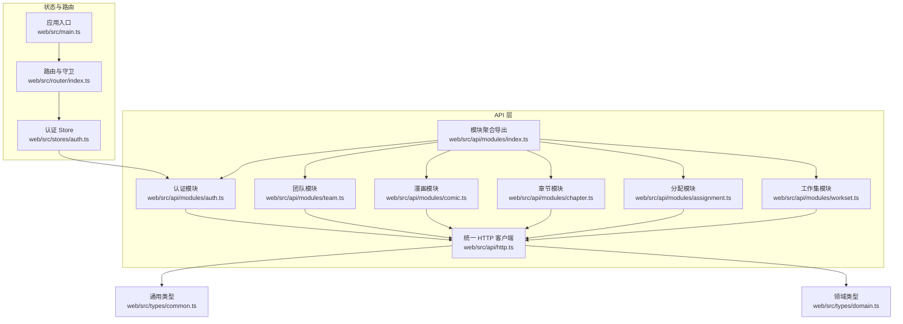
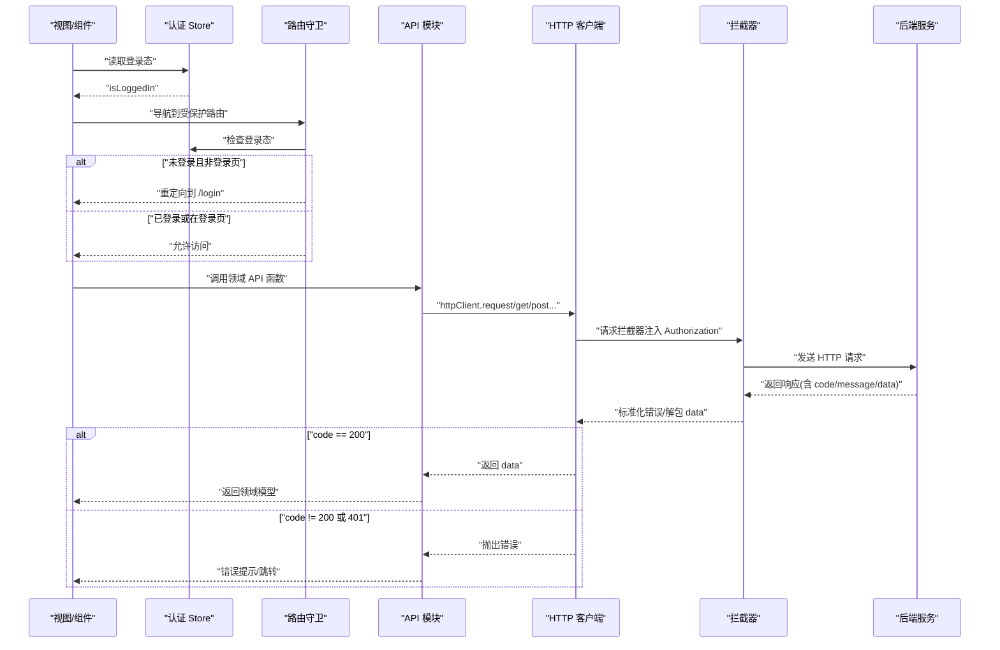
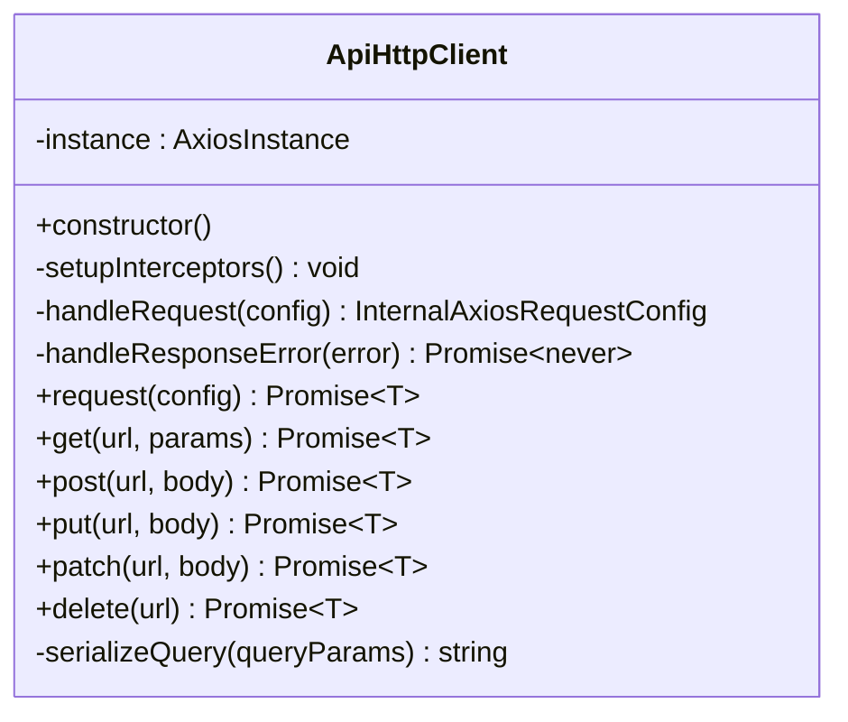
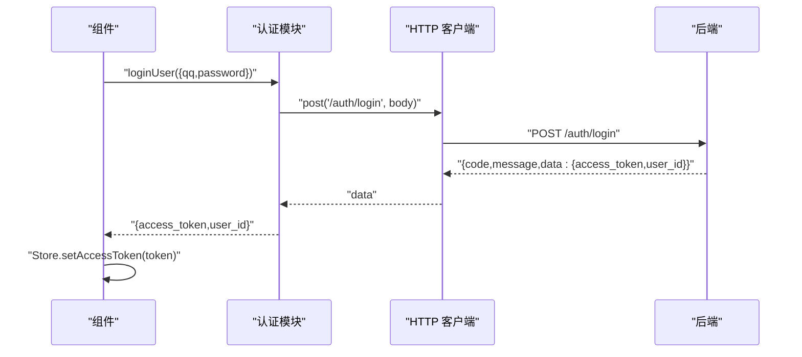
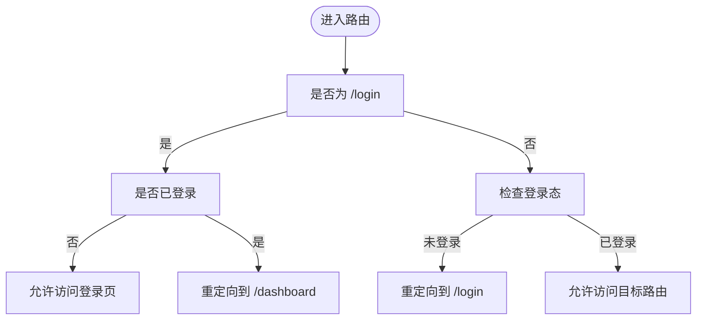
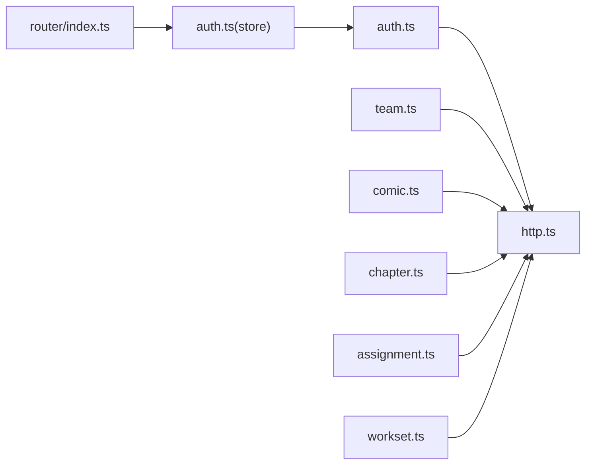
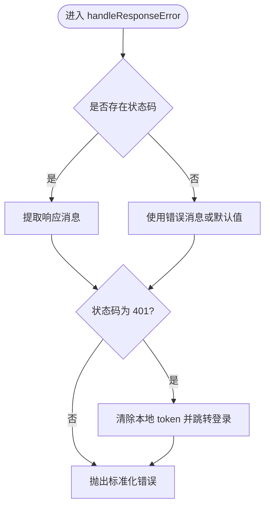
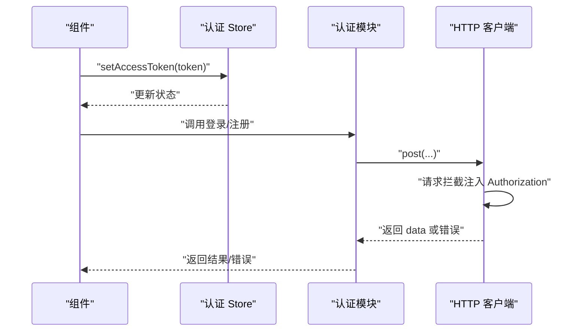

# API 集成

<cite>
**本文引用的文件**
- [web/src/api/http.ts](file://web/src/api/http.ts)
- [web/src/api/modules/index.ts](file://web/src/api/modules/index.ts)
- [web/src/api/modules/auth.ts](file://web/src/api/modules/auth.ts)
- [web/src/api/modules/team.ts](file://web/src/api/modules/team.ts)
- [web/src/api/modules/comic.ts](file://web/src/api/modules/comic.ts)
- [web/src/api/modules/chapter.ts](file://web/src/api/modules/chapter.ts)
- [web/src/api/modules/assignment.ts](file://web/src/api/modules/assignment.ts)
- [web/src/api/modules/workset.ts](file://web/src/api/modules/workset.ts)
- [web/src/stores/auth.ts](file://web/src/stores/auth.ts)
- [web/src/times/common.ts](file://web/src/times/common.ts)
- [web/src/times/domain.ts](file://web/src/times/domain.ts)
- [web/src/router/index.ts](file://web/src/router/index.ts)
- [web/src/main.ts](file://web/src/main.ts)
</cite>

## 目录
1. [引言](#引言)
2. [项目结构](#项目结构)
3. [核心组件](#核心组件)
4. [架构总览](#架构总览)
5. [详细组件分析](#详细组件分析)
6. [依赖关系分析](#依赖关系分析)
7. [性能考量](#性能考量)
8. [故障排查指南](#故障排查指南)
9. [结论](#结论)
10. [附录](#附录)

## 引言
本文件面向 Poprako 前端的 API 集成，系统性阐述基于 Axios 的统一 HTTP 客户端封装、模块化 API 设计、拦截器与错误处理机制、认证状态与 API 调用的联动、响应数据类型定义与约束、以及网络错误处理、超时与离线策略、版本控制与缓存建议、调试与日志最佳实践。目标是帮助开发者快速理解并正确使用 API 层，同时为扩展与维护提供清晰指引。

## 项目结构
前端 API 相关代码集中在 web/src/api 目录，采用“统一客户端 + 按功能模块拆分”的组织方式：
- 统一客户端：封装 Axios 实例、请求/响应拦截器、HTTP 方法封装与查询参数序列化。
- 模块化 API：按领域拆分，如认证、团队、漫画、章节、分配、工作集等，每个模块导出一组强类型的请求函数。
- 类型定义：在 types 目录中定义通用分页与领域模型类型，确保前后端契约一致。
- 认证状态：通过 Pinia Store 管理访问令牌与登录态，并与路由守卫联动。
- 路由与入口：路由守卫保障登录态，应用入口初始化框架与插件。

图表来源
- [web/src/api/http.ts:1-196](file://web/src/api/http.ts#L1-L196)
- [web/src/api/modules/index.ts:1-10](file://web/src/api/modules/index.ts#L1-L10)
- [web/src/api/modules/auth.ts:1-157](file://web/src/api/modules/auth.ts#L1-L157)
- [web/src/api/modules/team.ts:1-135](file://web/src/api/modules/team.ts#L1-L135)
- [web/src/api/modules/comic.ts:1-70](file://web/src/api/modules/comic.ts#L1-L70)
- [web/src/api/modules/chapter.ts:1-72](file://web/src/api/modules/chapter.ts#L1-L72)
- [web/src/api/modules/assignment.ts:1-101](file://web/src/api/modules/assignment.ts#L1-L101)
- [web/src/api/modules/workset.ts:1-72](file://web/src/api/modules/workset.ts#L1-L72)
- [web/src/stores/auth.ts:1-52](file://web/src/stores/auth.ts#L1-L52)
- [web/src/router/index.ts:1-59](file://web/src/router/index.ts#L1-L59)
- [web/src/main.ts:1-26](file://web/src/main.ts#L1-L26)
- [web/src/times/common.ts:1-41](file://web/src/times/common.ts#L1-L41)
- [web/src/times/domain.ts:1-89](file://web/src/times/domain.ts#L1-L89)

章节来源
- [web/src/api/http.ts:1-196](file://web/src/api/http.ts#L1-L196)
- [web/src/api/modules/index.ts:1-10](file://web/src/api/modules/index.ts#L1-L10)
- [web/src/stores/auth.ts:1-52](file://web/src/stores/auth.ts#L1-L52)
- [web/src/router/index.ts:1-59](file://web/src/router/index.ts#L1-L59)
- [web/src/main.ts:1-26](file://web/src/main.ts#L1-L26)

## 核心组件
- 统一 HTTP 客户端
  - 基于 Axios 创建实例，支持动态 base URL 与 15 秒超时。
  - 请求拦截：自动从本地存储读取访问令牌并注入 Authorization 头。
  - 响应拦截：标准化错误消息；当状态码为 401 时清理本地 token 并跳转至登录页。
  - 请求封装：提供 get/post/put/patch/delete 等方法；对查询参数进行序列化以兼容 includes[] 等数组格式。
  - 响应解包：统一期望的响应信封结构，仅在 code 为 200 时返回 data，否则抛出错误。
- 模块化 API
  - 每个领域模块导出一组强类型函数，函数签名明确请求路径、入参与返回类型。
  - 通过 httpClient 封装的通用方法发起请求，保证一致性与可测试性。
- 类型系统
  - 通用类型：分页参数、包含字段数组、统一错误结构。
  - 领域类型：用户、团队、工作集、漫画、章节、分配等实体模型。
- 认证状态与路由
  - Pinia Store 统一维护 access_token 与登录态，支持设置与清空。
  - 路由守卫根据登录态进行跳转控制，避免未登录访问受保护页面。

章节来源
- [web/src/api/http.ts:20-196](file://web/src/api/http.ts#L20-L196)
- [web/src/api/modules/auth.ts:1-157](file://web/src/api/modules/auth.ts#L1-L157)
- [web/src/api/modules/team.ts:1-135](file://web/src/api/modules/team.ts#L1-L135)
- [web/src/api/modules/comic.ts:1-70](file://web/src/api/modules/comic.ts#L1-L70)
- [web/src/api/modules/chapter.ts:1-72](file://web/src/api/modules/chapter.ts#L1-L72)
- [web/src/api/modules/assignment.ts:1-101](file://web/src/api/modules/assignment.ts#L1-L101)
- [web/src/api/modules/workset.ts:1-72](file://web/src/api/modules/workset.ts#L1-L72)
- [web/src/stores/auth.ts:1-52](file://web/src/stores/auth.ts#L1-L52)
- [web/src/times/common.ts:1-41](file://web/src/times/common.ts#L1-L41)
- [web/src/times/domain.ts:1-89](file://web/src/times/domain.ts#L1-L89)
- [web/src/router/index.ts:44-56](file://web/src/router/index.ts#L44-L56)

## 架构总览
下图展示了从前端调用到后端响应的整体流程，以及认证状态与路由守卫的协作关系。

图表来源
- [web/src/stores/auth.ts:15-51](file://web/src/stores/auth.ts#L15-L51)
- [web/src/router/index.ts:44-56](file://web/src/router/index.ts#L44-L56)
- [web/src/api/modules/auth.ts:102-132](file://web/src/api/modules/auth.ts#L102-L132)
- [web/src/api/http.ts:53-112](file://web/src/api/http.ts#L53-L112)

## 详细组件分析

### 统一 HTTP 客户端（ApiHttpClient）
- 职责
  - 统一基地址解析、超时配置、请求头注入、错误标准化、响应解包与通用 HTTP 方法封装。
  - 提供查询参数序列化，兼容 includes[] 等数组参数格式。
- 关键点
  - 请求拦截：从 localStorage 读取 access_token，若存在则设置 Authorization: Bearer。
  - 响应拦截：提取状态码与消息，401 清理 token 并跳转登录；其余错误统一包装为 Error 抛出。
  - request：对后端统一响应信封进行解包，仅在 code=200 时返回 data。
  - get/post/put/patch/delete：对常用方法进行薄封装，减少重复样板代码。
  - serializeQuery：将数组值转换为 includes[]=a&includes[]=b 的形式，适配后端查询约定。

图表来源
- [web/src/api/http.ts:33-196](file://web/src/api/http.ts#L33-L196)

章节来源
- [web/src/api/http.ts:20-196](file://web/src/api/http.ts#L20-L196)

### 认证模块（auth）
- 功能
  - 登录/注册：接收账号密码，返回 access_token 与 user_id。
  - 获取当前用户资料：返回 UserInfo。
  - 头像上传预留：返回预签名 PUT URL，随后确认上传完成。
- 类型约束
  - LoginUserArgs/RegisterUserArgs：必填字段与类型约束。
  - LoginUserResult/RegisterUserResult：返回令牌与用户标识。
  - GetCurrentUserProfileResponse：UserInfo。
  - ReserveUserAvatarArgs/ReserveUserAvatarResult：Content-Type 与预签名 URL。
- 使用建议
  - 登录成功后通过 Store 设置 access_token，触发路由守卫放行。
  - 头像上传流程需严格匹配 Content-Type，完成后调用确认接口。

图表来源
- [web/src/api/modules/auth.ts:102-123](file://web/src/api/modules/auth.ts#L102-L123)
- [web/src/api/http.ts:102-112](file://web/src/api/http.ts#L102-L112)
- [web/src/stores/auth.ts:31-35](file://web/src/stores/auth.ts#L31-L35)

章节来源
- [web/src/api/modules/auth.ts:1-157](file://web/src/api/modules/auth.ts#L1-L157)
- [web/src/stores/auth.ts:1-52](file://web/src/stores/auth.ts#L1-L52)

### 团队模块（team）
- 功能
  - 获取我的团队列表、获取全部团队列表、创建团队。
  - 团队头像上传预留与确认。
- 类型约束
  - TeamListQuery：继承分页参数。
  - CreateTeamArgs：name 必填，description 可选。
  - GetMyTeamsResponse/GetTeamListResponse：TeamInfo[]。
  - CreateTeamResponse：TeamInfo。
  - ReserveTeamAvatarArgs/ReserveTeamAvatarResult：OSS Key 与预签名 URL。

章节来源
- [web/src/api/modules/team.ts:1-135](file://web/src/api/modules/team.ts#L1-L135)
- [web/src/times/common.ts:1-41](file://web/src/times/common.ts#L1-L41)
- [web/src/times/domain.ts:18-32](file://web/src/times/domain.ts#L18-L32)

### 漫画模块（comic）
- 功能
  - 获取漫画列表、创建漫画。
- 类型约束
  - ComicListQuery：workset_id 必填，结合分页参数。
  - CreateComicArgs：workset_id、title 必填。
  - GetComicListResponse：ComicInfo[]。
  - CreateComicResponse：ComicInfo。

章节来源
- [web/src/api/modules/comic.ts:1-70](file://web/src/api/modules/comic.ts#L1-L70)
- [web/src/times/domain.ts:48-60](file://web/src/times/domain.ts#L48-L60)

### 章节模块（chapter）
- 功能
  - 获取章节列表、创建章节。
- 类型约束
  - ChapterListQuery：comic_id 必填，支持 includes[]。
  - CreateChapterArgs：comic_id、title、index 必填。
  - GetChapterListResponse：ChapterInfo[]。
  - CreateChapterResponse：ChapterInfo。

章节来源
- [web/src/api/modules/chapter.ts:1-72](file://web/src/api/modules/chapter.ts#L1-L72)
- [web/src/times/common.ts:19-26](file://web/src/times/common.ts#L19-L26)
- [web/src/times/domain.ts:62-74](file://web/src/times/domain.ts#L62-L74)

### 分配模块（assignment）
- 功能
  - 获取章节分配列表、获取我的分配列表、创建分配记录。
- 类型约束
  - AssignmentListQuery：chapter_id 必填，支持 includes[]。
  - GetMyAssignmentsRequest：分页参数。
  - CreateAssignmentArgs：chapter_id、user_id、role 必填。
  - GetAssignmentListResponse/GetMyAssignmentsResponse：AssignmentInfo[]。
  - CreateAssignmentResponse：AssignmentInfo。

章节来源
- [web/src/api/modules/assignment.ts:1-101](file://web/src/api/modules/assignment.ts#L1-L101)
- [web/src/times/common.ts:19-26](file://web/src/times/common.ts#L19-L26)
- [web/src/times/domain.ts:76-88](file://web/src/times/domain.ts#L76-L88)

### 工作集模块（workset）
- 功能
  - 获取工作集列表、创建工作集。
- 类型约束
  - WorksetListQuery：team_id 必填，结合分页参数。
  - CreateWorksetArgs：team_id、name、description 可选。
  - GetWorksetListResponse：WorksetInfo[]。
  - CreateWorksetResponse：WorksetInfo。

章节来源
- [web/src/api/modules/workset.ts:1-72](file://web/src/api/modules/workset.ts#L1-L72)
- [web/src/times/domain.ts:34-46](file://web/src/times/domain.ts#L34-L46)

### 模块聚合导出（modules/index）
- 作用
  - 统一导出各领域模块，便于上层按需引入或全量导入。

章节来源
- [web/src/api/modules/index.ts:1-10](file://web/src/api/modules/index.ts#L1-L10)

### 类型系统（common 与 domain）
- 通用类型
  - PaginationQuery：offset、limit。
  - IncludeQuery：includes[]。
  - ApiErrorPayload：统一错误结构。
- 领域类型
  - UserInfo、TeamInfo、WorksetInfo、ComicInfo、ChapterInfo、AssignmentInfo。

章节来源
- [web/src/times/common.ts:1-41](file://web/src/times/common.ts#L1-L41)
- [web/src/times/domain.ts:1-89](file://web/src/times/domain.ts#L1-L89)

### 认证状态与路由守卫
- 认证 Store
  - 维护 access_token 与 isLoggedIn，提供设置与清空方法。
- 路由守卫
  - 非登录访问受保护路由时重定向至 /login；
  - 已登录访问 /login 时重定向至 /dashboard。
- 与 HTTP 客户端的配合
  - 请求拦截自动注入 Authorization；
  - 响应拦截 401 清理 token 并跳转登录，形成闭环。

图表来源
- [web/src/router/index.ts:44-56](file://web/src/router/index.ts#L44-L56)
- [web/src/stores/auth.ts:26-26](file://web/src/stores/auth.ts#L26-L26)

章节来源
- [web/src/stores/auth.ts:1-52](file://web/src/stores/auth.ts#L1-L52)
- [web/src/router/index.ts:1-59](file://web/src/router/index.ts#L1-L59)

## 依赖关系分析
- 模块耦合
  - 各 API 模块仅依赖统一 HTTP 客户端，降低耦合度，便于替换或扩展。
  - 模块间无直接依赖，通过类型共享实现契约一致。
- 外部依赖
  - Axios：HTTP 客户端与拦截器。
  - Pinia：认证状态管理。
  - Vue Router：路由守卫。
- 可能的循环依赖
  - 当前结构清晰，未见模块间循环导入迹象。

图表来源
- [web/src/api/modules/auth.ts:1-157](file://web/src/api/modules/auth.ts#L1-L157)
- [web/src/api/modules/team.ts:1-135](file://web/src/api/modules/team.ts#L1-L135)
- [web/src/api/modules/comic.ts:1-70](file://web/src/api/modules/comic.ts#L1-L70)
- [web/src/api/modules/chapter.ts:1-72](file://web/src/api/modules/chapter.ts#L1-L72)
- [web/src/api/modules/assignment.ts:1-101](file://web/src/api/modules/assignment.ts#L1-L101)
- [web/src/api/modules/workset.ts:1-72](file://web/src/api/modules/workset.ts#L1-L72)
- [web/src/api/http.ts:1-196](file://web/src/api/http.ts#L1-L196)
- [web/src/stores/auth.ts:1-52](file://web/src/stores/auth.ts#L1-L52)
- [web/src/router/index.ts:1-59](file://web/src/router/index.ts#L1-L59)

章节来源
- [web/src/api/http.ts:1-196](file://web/src/api/http.ts#L1-L196)
- [web/src/api/modules/index.ts:1-10](file://web/src/api/modules/index.ts#L1-L10)

## 性能考量
- 超时与并发
  - 默认 15 秒超时，可根据网络环境调整；对长耗时请求考虑拆分或增加进度反馈。
- 缓存策略
  - 对只读列表与静态资源建议在业务层做内存缓存；对频繁查询的列表可引入 LRU 缓存。
- 批量操作
  - 后端未提供批量接口时，可在前端进行批处理（如合并多次请求），但需注意幂等性与错误回滚。
- 网络质量
  - 在弱网环境下建议增加重试与退避策略，但需避免无限重试导致资源浪费。
- 建议
  - 为关键接口埋点统计成功率与耗时，结合浏览器 Network 面板定位瓶颈。
  - 对大列表分页加载，避免一次性拉取过多数据。

## 故障排查指南
- 401 未授权
  - 现象：收到 401，自动清除 token 并跳转登录。
  - 排查：确认本地 token 是否过期或被覆盖；检查后端签发策略与刷新机制。
- 响应 code 非 200
  - 现象：抛出错误，message 来自后端。
  - 排查：查看后端返回的 message 与 code，定位业务异常原因。
- 查询参数无效
  - 现象：includes[] 未生效。
  - 排查：确认序列化逻辑是否正确，必要时在开发工具中对比生成的查询串。
- 路由跳转异常
  - 现象：登录后未进入仪表盘，或未登录被重定向到登录页。
  - 排查：检查 Store 中的 isLoggedIn 与 token 状态；确认路由守卫逻辑。

章节来源
- [web/src/api/http.ts:82-97](file://web/src/api/http.ts#L82-L97)
- [web/src/router/index.ts:44-56](file://web/src/router/index.ts#L44-L56)
- [web/src/stores/auth.ts:26-43](file://web/src/stores/auth.ts#L26-L43)

## 结论
Poprako 前端 API 集成采用“统一客户端 + 模块化 API + 类型约束 + 认证状态 + 路由守卫”的架构，具备良好的可维护性与扩展性。通过强类型定义与拦截器机制，实现了请求标准化、错误统一化与登录态自动化。建议在现有基础上完善离线策略、重试与缓存、版本控制与批量操作能力，并持续优化监控与日志体系。

## 附录

### API 响应信封与错误处理流程

图表来源
- [web/src/api/http.ts:82-97](file://web/src/api/http.ts#L82-L97)

### 认证状态与 API 调用集成

图表来源
- [web/src/stores/auth.ts:31-35](file://web/src/stores/auth.ts#L31-L35)
- [web/src/api/modules/auth.ts:102-123](file://web/src/api/modules/auth.ts#L102-L123)
- [web/src/api/http.ts:66-77](file://web/src/api/http.ts#L66-L77)