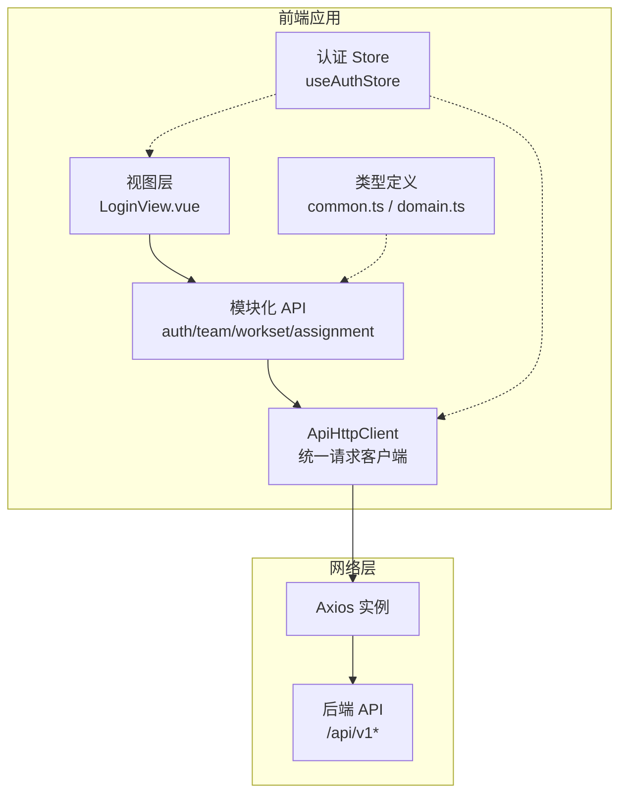
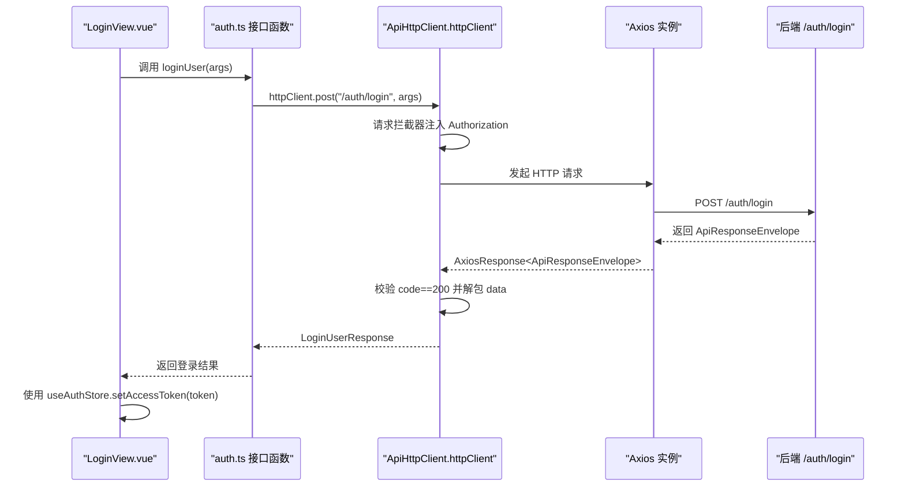
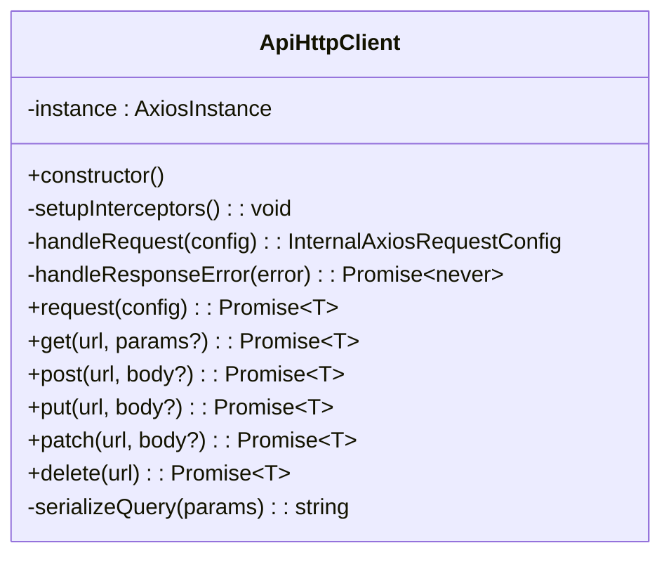
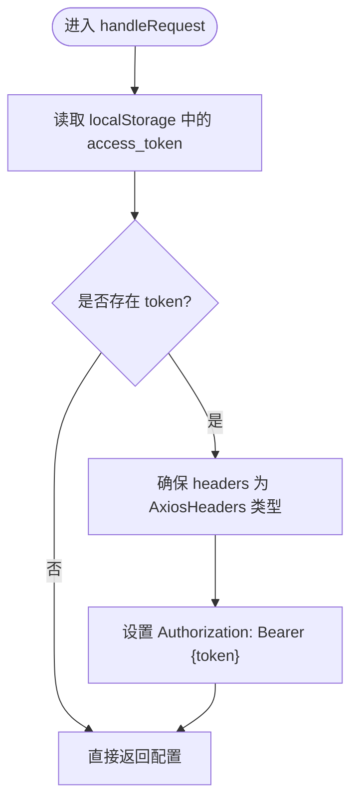
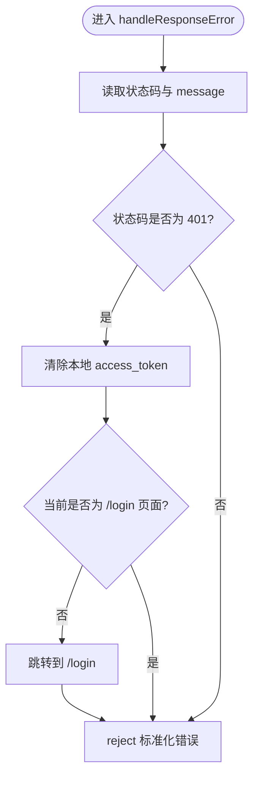
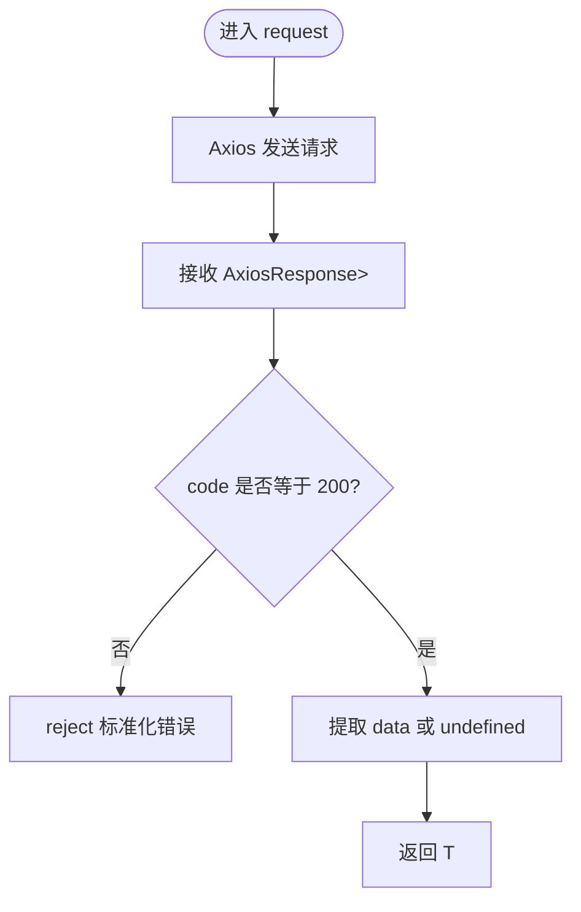
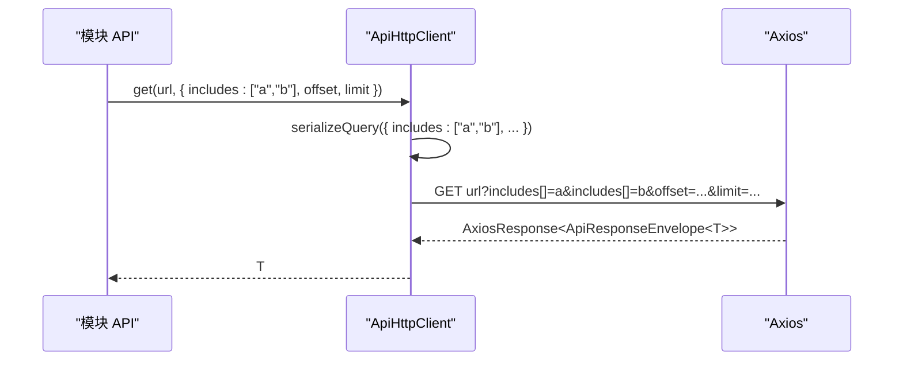
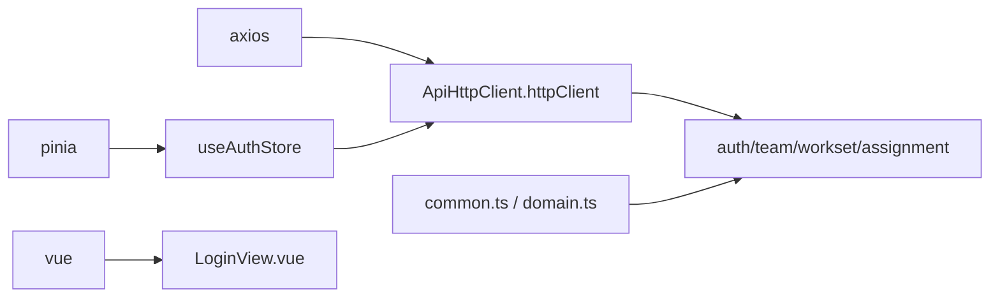

# HTTP 客户端配置

<cite>
**本文引用的文件**
- [web/src/api/http.ts](file://web/src/api/http.ts)
- [web/src/stores/auth.ts](file://web/src/stores/auth.ts)
- [web/src/types/common.ts](file://web/src/types/common.ts)
- [web/src/env.d.ts](file://web/src/env.d.ts)
- [web/src/main.ts](file://web/src/main.ts)
- [web/src/api/modules/auth.ts](file://web/src/api/modules/auth.ts)
- [web/src/api/modules/team.ts](file://web/src/api/modules/team.ts)
- [web/src/api/modules/workset.ts](file://web/src/api/modules/workset.ts)
- [web/src/api/modules/assignment.ts](file://web/src/api/modules/assignment.ts)
- [web/src/views/LoginView.vue](file://web/src/views/LoginView.vue)
- [web/package.json](file://web/package.json)
- [web/vite.config.ts](file://web/vite.config.ts)
</cite>

## 目录
1. [引言](#引言)
2. [项目结构](#项目结构)
3. [核心组件](#核心组件)
4. [架构总览](#架构总览)
5. [详细组件分析](#详细组件分析)
6. [依赖关系分析](#依赖关系分析)
7. [性能考虑](#性能考虑)
8. [故障排查指南](#故障排查指南)
9. [结论](#结论)
10. [附录](#附录)

## 引言
本文件面向 Poprako 前端的 HTTP 客户端配置，系统性阐述基于 Axios 的统一请求客户端实现，重点覆盖以下方面：
- ApiHttpClient 类的设计理念与职责边界
- 请求拦截器与响应拦截器的实现机制（含访问令牌自动注入、请求头设置、请求预处理、错误标准化、401 未授权处理与自动跳转登录）
- 统一响应解包机制（ApiResponseEnvelope 数据结构、状态码校验、错误处理策略）
- 请求方法封装（GET、POST、PUT、PATCH、DELETE）与查询参数序列化（includes[] 数组格式支持）
- 环境变量配置、超时设置与 baseURL 解析
- 实际使用示例与最佳实践

## 项目结构
前端 HTTP 客户端位于 web/src/api/http.ts，围绕该文件形成“统一客户端 + 模块化 API 封装”的架构：
- 统一客户端：ApiHttpClient 提供 Axios 实例、拦截器、通用请求与 HTTP 方法封装、查询参数序列化
- 模块化 API：web/src/api/modules 下按领域拆分（如 auth、team、workset、assignment），每个模块通过 httpClient 调用后端接口
- 全局状态：Pinia 认证 Store 统一管理 access_token 的读写与登录态
- 类型体系：common.ts 定义通用类型（分页、includes[]、统一错误结构），domain.ts 定义领域模型
- 环境类型：env.d.ts 为 import.meta.env 提供类型提示

图表来源
- [web/src/api/http.ts:33-196](file://web/src/api/http.ts#L33-L196)
- [web/src/api/modules/auth.ts:1-157](file://web/src/api/modules/auth.ts#L1-L157)
- [web/src/api/modules/team.ts:1-135](file://web/src/api/modules/team.ts#L1-L135)
- [web/src/api/modules/workset.ts:1-72](file://web/src/api/modules/workset.ts#L1-L72)
- [web/src/api/modules/assignment.ts:1-101](file://web/src/api/modules/assignment.ts#L1-L101)
- [web/src/stores/auth.ts:15-51](file://web/src/stores/auth.ts#L15-L51)
- [web/src/views/LoginView.vue:50-82](file://web/src/views/LoginView.vue#L50-L82)
- [web/src/types/common.ts:1-41](file://web/src/types/common.ts#L1-L41)

章节来源
- [web/src/api/http.ts:1-196](file://web/src/api/http.ts#L1-L196)
- [web/src/main.ts:16-26](file://web/src/main.ts#L16-L26)
- [web/src/env.d.ts:6-12](file://web/src/env.d.ts#L6-L12)

## 核心组件
- ApiHttpClient：Axios 统一请求客户端，负责
  - Axios 实例创建与配置（baseURL、timeout）
  - 请求拦截器：自动注入 Authorization: Bearer token
  - 响应拦截器：标准化错误、处理 401 未授权并跳转登录
  - 统一请求入口 request：解包 ApiResponseEnvelope，校验 code 并提取 data
  - HTTP 方法封装：get/post/put/patch/delete
  - 查询参数序列化：支持 includes[] 数组格式
- httpClient：ApiHttpClient 的全局单例，作为项目唯一请求出口
- useAuthStore：Pinia 认证 Store，统一维护 access_token 与登录态
- 通用类型：PaginationQuery、IncludeQuery、ApiErrorPayload

章节来源
- [web/src/api/http.ts:33-196](file://web/src/api/http.ts#L33-L196)
- [web/src/stores/auth.ts:15-51](file://web/src/stores/auth.ts#L15-L51)
- [web/src/types/common.ts:7-41](file://web/src/types/common.ts#L7-L41)

## 架构总览
下面以序列图展示一次典型登录流程的调用链，体现请求拦截器注入 token、统一响应解包与认证 Store 的协作。

图表来源
- [web/src/api/modules/auth.ts:102-109](file://web/src/api/modules/auth.ts#L102-L109)
- [web/src/api/http.ts:102-112](file://web/src/api/http.ts#L102-L112)
- [web/src/api/http.ts:53-77](file://web/src/api/http.ts#L53-L77)
- [web/src/views/LoginView.vue:69-82](file://web/src/views/LoginView.vue#L69-L82)
- [web/src/stores/auth.ts:31-35](file://web/src/stores/auth.ts#L31-L35)

## 详细组件分析

### ApiHttpClient 设计与实现
- 设计理念
  - 单一职责：集中处理鉴权、错误处理、响应解包与 HTTP 方法封装
  - 统一出口：通过 httpClient 单例对外提供能力，避免分散的 Axios 配置
  - 易扩展：新增领域接口只需在 modules 下新增文件，复用 httpClient
- 关键实现要点
  - Axios 实例创建：baseURL 来源于 resolveApiBaseURL，超时 15 秒
  - 请求拦截器：从 localStorage 读取 access_token，存在则设置 Authorization 头
  - 响应拦截器：标准化错误消息；当状态码为 401 时清理本地 token 并跳转登录
  - 统一请求入口：request 对后端返回的 ApiResponseEnvelope 进行解包，code 非 200 时抛错
  - HTTP 方法封装：get/post/put/patch/delete，均通过 request 统一处理
  - 查询参数序列化：serializeQuery 支持 includes[] 数组格式，将数组值转换为 key[]=v1&key[]=v2 形式

图表来源
- [web/src/api/http.ts:33-196](file://web/src/api/http.ts#L33-L196)

章节来源
- [web/src/api/http.ts:20-27](file://web/src/api/http.ts#L20-L27)
- [web/src/api/http.ts:42-48](file://web/src/api/http.ts#L42-L48)
- [web/src/api/http.ts:53-61](file://web/src/api/http.ts#L53-L61)
- [web/src/api/http.ts:66-77](file://web/src/api/http.ts#L66-L77)
- [web/src/api/http.ts:82-97](file://web/src/api/http.ts#L82-L97)
- [web/src/api/http.ts:102-112](file://web/src/api/http.ts#L102-L112)
- [web/src/api/http.ts:117-167](file://web/src/api/http.ts#L117-L167)
- [web/src/api/http.ts:172-189](file://web/src/api/http.ts#L172-L189)

### 请求拦截器与访问令牌注入
- 自动注入逻辑：在 handleRequest 中从 localStorage 读取 access_token，若存在则设置 Authorization: Bearer {token}
- 头部类型安全：当 config.headers 不是 AxiosHeaders 时，先转换再设置，保证类型一致性
- 适用范围：所有经 httpClient 发起的请求都会自动携带该头

图表来源
- [web/src/api/http.ts:66-77](file://web/src/api/http.ts#L66-L77)

章节来源
- [web/src/api/http.ts:66-77](file://web/src/api/http.ts#L66-L77)

### 响应拦截器与错误处理
- 错误标准化：优先使用后端返回的 message，其次使用 error.message，最后回退为“请求失败”
- 401 未授权处理：当状态码为 401 时，清理本地 token，并在非登录页时跳转至 /login
- Promise 拒绝：最终以标准化后的错误消息 reject，便于上层捕获

图表来源
- [web/src/api/http.ts:82-97](file://web/src/api/http.ts#L82-L97)

章节来源
- [web/src/api/http.ts:82-97](file://web/src/api/http.ts#L82-L97)

### 统一响应解包机制
- 数据结构：ApiResponseEnvelope 包含 code、message、data 字段
- 解包策略：request 在收到响应后检查 code 是否为 200，否则 reject；成功时返回 data 或 undefined
- 适用范围：所有通过 httpClient.request/get/post/put/patch/delete 返回的数据均遵循此解包规则

图表来源
- [web/src/api/http.ts:14-18](file://web/src/api/http.ts#L14-L18)
- [web/src/api/http.ts:102-112](file://web/src/api/http.ts#L102-L112)

章节来源
- [web/src/api/http.ts:14-18](file://web/src/api/http.ts#L14-L18)
- [web/src/api/http.ts:102-112](file://web/src/api/http.ts#L102-L112)

### 请求方法封装与查询参数序列化
- 方法封装：get/post/put/patch/delete 均通过 request 统一处理，确保拦截器与解包一致
- 查询参数序列化：serializeQuery 支持 includes[] 数组格式，将数组值转换为 key[]=v1&key[]=v2 形式，便于后端解析
- 使用示例：模块中通过 httpClient.get(url, params) 传入分页与 includes[] 参数

图表来源
- [web/src/api/http.ts:117-124](file://web/src/api/http.ts#L117-L124)
- [web/src/api/http.ts:172-189](file://web/src/api/http.ts#L172-L189)
- [web/src/api/modules/assignment.ts:63-70](file://web/src/api/modules/assignment.ts#L63-L70)

章节来源
- [web/src/api/http.ts:117-167](file://web/src/api/http.ts#L117-L167)
- [web/src/api/http.ts:172-189](file://web/src/api/http.ts#L172-L189)
- [web/src/api/modules/assignment.ts:11-14](file://web/src/api/modules/assignment.ts#L11-L14)

### 环境变量、超时与 baseURL 解析
- 环境变量：通过 import.meta.env.VITE_API_BASE_URL 指定后端 baseURL；未配置时默认 “/api/v1”
- 超时：Axios 实例超时时间为 15 秒
- baseURL 解析：resolveApiBaseURL 优先使用环境变量，其次回退到默认值

章节来源
- [web/src/env.d.ts:6-8](file://web/src/env.d.ts#L6-L8)
- [web/src/api/http.ts:20-27](file://web/src/api/http.ts#L20-L27)
- [web/src/api/http.ts:43-46](file://web/src/api/http.ts#L43-L46)

### 实际使用示例与最佳实践
- 登录流程
  - 视图层触发登录，调用 auth.ts 的 loginUser，得到 access_token
  - 使用 useAuthStore.setAccessToken 写入本地存储
  - 之后所有请求自动携带 Authorization 头
- 列表查询
  - 通过模块 API 的 get 方法传入分页与 includes[] 参数
  - httpClient 会自动序列化并发起请求
- 最佳实践
  - 统一通过 httpClient 调用接口，避免分散的 Axios 配置
  - 在 401 时不要手动删除 token，交由响应拦截器处理
  - includes[] 数组参数请使用数组形式传入，由序列化逻辑自动转换
  - 错误处理建议在模块层捕获并提示用户，避免在拦截器中做 UI 交互

章节来源
- [web/src/api/modules/auth.ts:102-109](file://web/src/api/modules/auth.ts#L102-L109)
- [web/src/views/LoginView.vue:69-82](file://web/src/views/LoginView.vue#L69-L82)
- [web/src/stores/auth.ts:31-35](file://web/src/stores/auth.ts#L31-L35)
- [web/src/api/modules/assignment.ts:63-70](file://web/src/api/modules/assignment.ts#L63-L70)

## 依赖关系分析
- 外部依赖
  - axios：HTTP 客户端核心
  - pinia：全局状态管理
  - vue/vue-router：前端框架与路由
- 内部依赖
  - httpClient 作为全局单例被各模块 API 使用
  - useAuthStore 与 httpClient 协作维护登录态
  - common.ts 与 domain.ts 为模块 API 提供类型支撑

图表来源
- [web/src/api/http.ts:4-11](file://web/src/api/http.ts#L4-L11)
- [web/src/stores/auth.ts:4-5](file://web/src/stores/auth.ts#L4-L5)
- [web/src/views/LoginView.vue:54-55](file://web/src/views/LoginView.vue#L54-L55)
- [web/src/api/modules/index.ts:4-9](file://web/src/api/modules/index.ts#L4-L9)
- [web/src/types/common.ts:1-41](file://web/src/types/common.ts#L1-L41)

章节来源
- [web/package.json:13-20](file://web/package.json#L13-L20)
- [web/src/api/http.ts:4-11](file://web/src/api/http.ts#L4-L11)
- [web/src/api/modules/index.ts:4-9](file://web/src/api/modules/index.ts#L4-L9)

## 性能考虑
- 超时设置：默认 15 秒，可根据网络环境调整（通过修改 Axios 实例配置）
- 请求头注入：仅在存在 token 时设置，避免不必要的头部操作
- 响应解包：在客户端进行统一封装，减少重复判断逻辑
- 查询参数序列化：对 includes[] 的数组参数进行高效拼接，避免多次遍历

## 故障排查指南
- 无法访问接口或频繁超时
  - 检查 VITE_API_BASE_URL 是否正确，确认 baseURL 解析逻辑
  - 检查网络连通性与代理配置
- 401 未授权频繁出现
  - 确认登录成功后 access_token 已写入 localStorage
  - 确认响应拦截器未被覆盖或禁用
  - 检查后端 token 有效期与刷新策略
- includes[] 参数无效
  - 确认传入的是数组而非字符串
  - 确认模块 API 调用时传参正确
- 登录后仍提示未登录
  - 确认 handleResponseError 未被自定义覆盖
  - 确认当前页面不是 /login

章节来源
- [web/src/env.d.ts:6-8](file://web/src/env.d.ts#L6-L8)
- [web/src/api/http.ts:20-27](file://web/src/api/http.ts#L20-L27)
- [web/src/api/http.ts:82-97](file://web/src/api/http.ts#L82-L97)
- [web/src/api/http.ts:172-189](file://web/src/api/http.ts#L172-L189)

## 结论
ApiHttpClient 通过统一的拦截器、响应解包与方法封装，实现了前端 HTTP 请求的一致性与可维护性。结合 Pinia 认证 Store 与模块化 API 设计，开发者可以专注于业务逻辑，而无需关心底层网络细节。建议在后续迭代中：
- 将 baseURL 与超时等配置项抽象为可配置常量
- 在拦截器中增加重试与埋点能力
- 为常见错误场景提供更细粒度的错误类型

## 附录
- 环境变量与类型声明
  - VITE_API_BASE_URL：后端 API 基础地址
  - import.meta.env 类型在 env.d.ts 中声明
- 构建与运行
  - Vite 配置支持开发/预览端口与主机绑定
  - 项目脚本包含 dev、build、preview 等命令

章节来源
- [web/src/env.d.ts:6-12](file://web/src/env.d.ts#L6-L12)
- [web/vite.config.ts:21-43](file://web/vite.config.ts#L21-L43)
- [web/package.json:6-12](file://web/package.json#L6-L12)