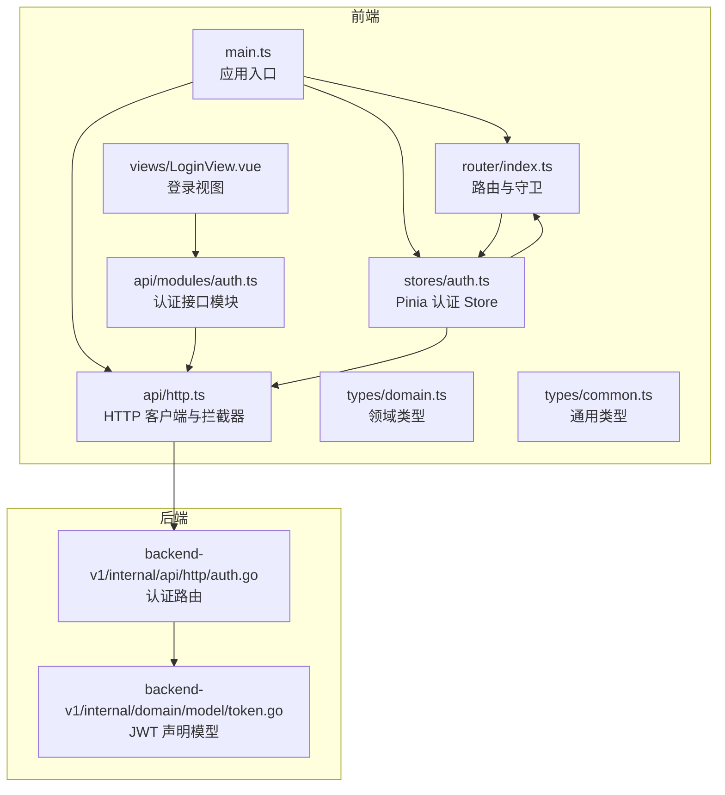
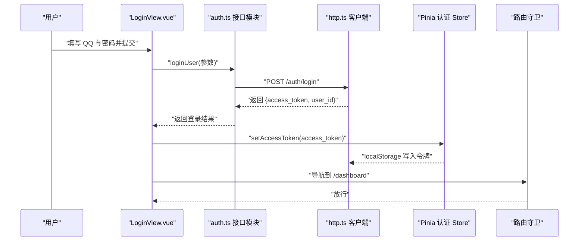
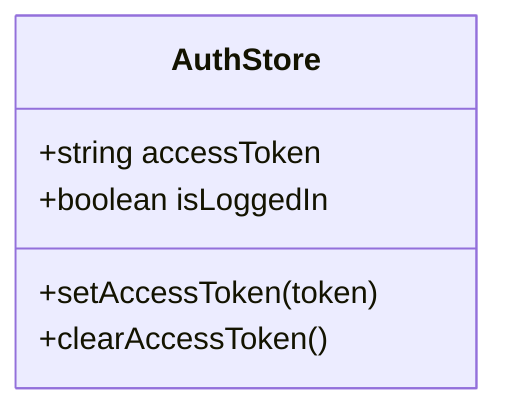
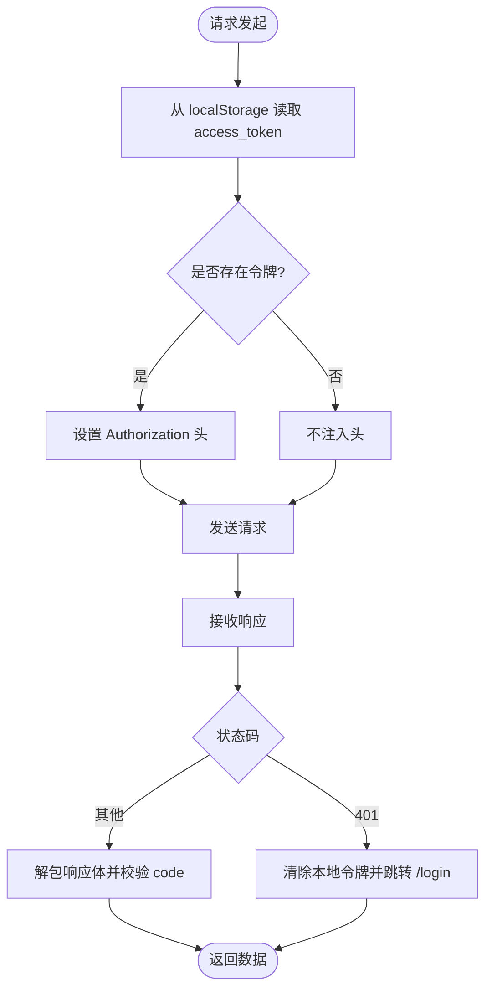
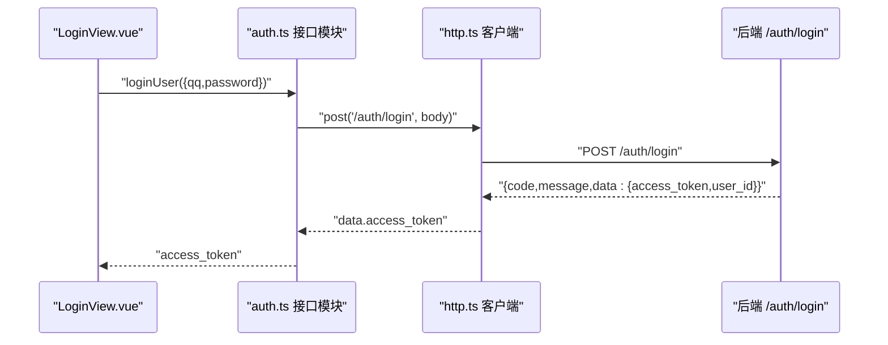
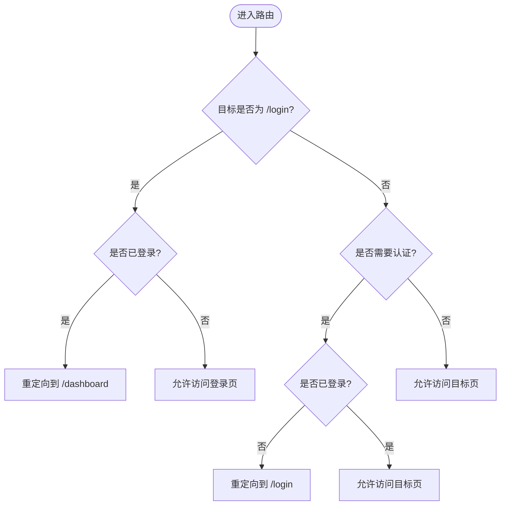
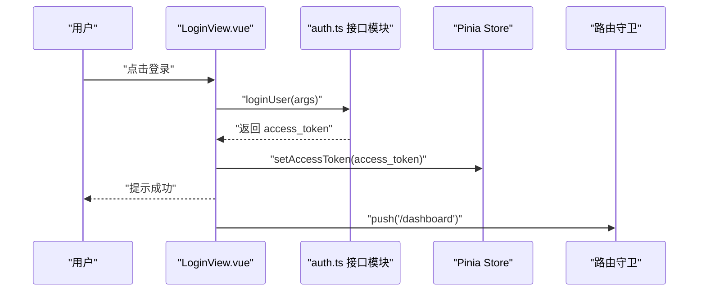
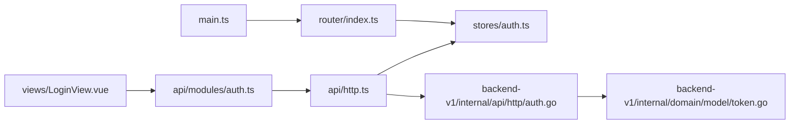

# 认证集成

<cite>
**本文引用的文件**
- [web/src/stores/auth.ts](file://web/src/stores/auth.ts)
- [web/src/api/http.ts](file://web/src/api/http.ts)
- [web/src/api/modules/auth.ts](file://web/src/api/modules/auth.ts)
- [web/src/router/index.ts](file://web/src/router/index.ts)
- [web/src/views/LoginView.vue](file://web/src/views/LoginView.vue)
- [web/src/main.ts](file://web/src/main.ts)
- [web/src/types/domain.ts](file://web/src/types/domain.ts)
- [web/src/types/common.ts](file://web/src/types/common.ts)
- [backend/backend-v1/internal/api/http/auth.go](file://backend/backend-v1/internal/api/http/auth.go)
- [backend/backend-v1/internal/domain/model/token.go](file://backend/backend-v1/internal/domain/model/token.go)
</cite>

## 目录
1. [简介](#简介)
2. [项目结构](#项目结构)
3. [核心组件](#核心组件)
4. [架构总览](#架构总览)
5. [详细组件分析](#详细组件分析)
6. [依赖分析](#依赖分析)
7. [性能考量](#性能考量)
8. [故障排查指南](#故障排查指南)
9. [结论](#结论)
10. [附录](#附录)

## 简介
本文件系统性梳理 Poprako 前端认证集成的实现，覆盖登录、注册、登出与令牌刷新机制；解释 JWT 令牌在 localStorage 的存储策略、安全与过期处理；阐述基于 Pinia 的认证状态管理（状态持久化与响应式更新）；说明自动认证拦截器（请求前缀检查、令牌注入与无权限处理）；给出认证错误处理策略（401 自动登出与用户提示）；说明第三方登录（QQ）的实现流程与回调处理；并补充接口安全性（CSRF、XSS、令牌安全）、调试与日志、性能监控以及多设备登录与会话管理等主题。

## 项目结构
前端认证相关代码主要分布在以下模块：
- 全局状态：Pinia Store（认证状态与令牌）
- HTTP 层：Axios 封装与拦截器（请求头注入、错误处理）
- 接口模块：认证相关 API（登录、注册、获取当前用户）
- 路由守卫：登录态校验与页面跳转
- 视图层：登录页表单与交互
- 类型定义：领域模型与通用错误结构
- 后端接口：认证路由与 JWT 声明模型

图表来源
- [web/src/main.ts:1-26](file://web/src/main.ts#L1-L26)
- [web/src/router/index.ts:1-59](file://web/src/router/index.ts#L1-L59)
- [web/src/stores/auth.ts:1-52](file://web/src/stores/auth.ts#L1-L52)
- [web/src/api/http.ts:1-196](file://web/src/api/http.ts#L1-L196)
- [web/src/api/modules/auth.ts:1-157](file://web/src/api/modules/auth.ts#L1-L157)
- [web/src/views/LoginView.vue:1-157](file://web/src/views/LoginView.vue#L1-L157)
- [web/src/types/domain.ts:1-89](file://web/src/types/domain.ts#L1-L89)
- [web/src/types/common.ts:1-41](file://web/src/types/common.ts#L1-L41)
- [backend/backend-v1/internal/api/http/auth.go:1-73](file://backend/backend-v1/internal/api/http/auth.go#L1-L73)
- [backend/backend-v1/internal/domain/model/token.go:1-9](file://backend/backend-v1/internal/domain/model/token.go#L1-L9)

章节来源
- [web/src/main.ts:1-26](file://web/src/main.ts#L1-L26)
- [web/src/router/index.ts:1-59](file://web/src/router/index.ts#L1-L59)
- [web/src/stores/auth.ts:1-52](file://web/src/stores/auth.ts#L1-L52)
- [web/src/api/http.ts:1-196](file://web/src/api/http.ts#L1-L196)
- [web/src/api/modules/auth.ts:1-157](file://web/src/api/modules/auth.ts#L1-L157)
- [web/src/views/LoginView.vue:1-157](file://web/src/views/LoginView.vue#L1-L157)
- [web/src/types/domain.ts:1-89](file://web/src/types/domain.ts#L1-L89)
- [web/src/types/common.ts:1-41](file://web/src/types/common.ts#L1-L41)
- [backend/backend-v1/internal/api/http/auth.go:1-73](file://backend/backend-v1/internal/api/http/auth.go#L1-L73)
- [backend/backend-v1/internal/domain/model/token.go:1-9](file://backend/backend-v1/internal/domain/model/token.go#L1-L9)

## 核心组件
- Pinia 认证 Store：集中管理访问令牌与登录态，提供设置与清空令牌的方法，并与 localStorage 同步。
- HTTP 客户端与拦截器：统一注入 Authorization 头、标准化响应与错误处理；在 401 时清除令牌并重定向至登录页。
- 认证接口模块：封装登录、注册与获取当前用户信息等 API。
- 路由守卫：非登录页访问前检查登录态，避免未授权访问。
- 登录视图：表单收集 QQ 与密码，调用登录接口并写入令牌。
- 类型系统：定义 UserInfo、分页与错误结构等，保证前后端契约一致。

章节来源
- [web/src/stores/auth.ts:15-51](file://web/src/stores/auth.ts#L15-L51)
- [web/src/api/http.ts:33-195](file://web/src/api/http.ts#L33-L195)
- [web/src/api/modules/auth.ts:102-132](file://web/src/api/modules/auth.ts#L102-L132)
- [web/src/router/index.ts:47-56](file://web/src/router/index.ts#L47-L56)
- [web/src/views/LoginView.vue:69-82](file://web/src/views/LoginView.vue#L69-L82)
- [web/src/types/domain.ts:7-16](file://web/src/types/domain.ts#L7-L16)
- [web/src/types/common.ts:31-40](file://web/src/types/common.ts#L31-L40)

## 架构总览
前端通过 Pinia Store 维护认证状态，HTTP 客户端在请求前自动注入 Bearer 令牌，在响应中处理 401 并触发登出；路由守卫保障页面访问的合法性；登录视图完成用户输入与接口调用，成功后写入令牌并跳转。

图表来源
- [web/src/views/LoginView.vue:69-82](file://web/src/views/LoginView.vue#L69-L82)
- [web/src/api/modules/auth.ts:102-109](file://web/src/api/modules/auth.ts#L102-L109)
- [web/src/api/http.ts:102-112](file://web/src/api/http.ts#L102-L112)
- [web/src/stores/auth.ts:31-35](file://web/src/stores/auth.ts#L31-L35)
- [web/src/router/index.ts:47-56](file://web/src/router/index.ts#L47-L56)

## 详细组件分析

### Pinia 认证 Store（状态管理与持久化）
- 存储键名：使用 localStorage 保存访问令牌，键名为固定常量。
- 状态属性：
  - accessToken：当前访问令牌，初始化自 localStorage。
  - isLoggedIn：基于 accessToken 长度计算的只读登录态。
- 方法：
  - setAccessToken：规范化传入值后更新内存与本地存储。
  - clearAccessToken：清空内存与本地存储。
- 响应式更新：accessToken 为 ref，isLoggedIn 为 computed，确保视图与守卫实时感知登录态变化。

图表来源
- [web/src/stores/auth.ts:15-51](file://web/src/stores/auth.ts#L15-L51)

章节来源
- [web/src/stores/auth.ts:15-51](file://web/src/stores/auth.ts#L15-L51)

### HTTP 客户端与自动认证拦截器
- 基础配置：支持环境变量配置基础 URL，默认 /api/v1；统一超时时间。
- 请求拦截：
  - 从 localStorage 读取 access_token。
  - 若存在则在请求头添加 Authorization: Bearer <token>。
- 响应拦截：
  - 标准化错误消息：优先使用后端返回 message，其次 axios message。
  - 401 时清除本地令牌并重定向至 /login（若当前不在登录页）。
- 统一请求入口：封装通用 request、get、post、put、patch、delete 方法，自动解包后端响应体并校验 code 字段。

图表来源
- [web/src/api/http.ts:66-97](file://web/src/api/http.ts#L66-L97)
- [web/src/api/http.ts:102-112](file://web/src/api/http.ts#L102-L112)

章节来源
- [web/src/api/http.ts:20-27](file://web/src/api/http.ts#L20-L27)
- [web/src/api/http.ts:53-61](file://web/src/api/http.ts#L53-L61)
- [web/src/api/http.ts:66-77](file://web/src/api/http.ts#L66-L77)
- [web/src/api/http.ts:82-97](file://web/src/api/http.ts#L82-L97)
- [web/src/api/http.ts:102-112](file://web/src/api/http.ts#L102-L112)

### 认证接口模块（登录、注册、当前用户）
- 登录接口：POST /auth/login，请求体包含 qq 与 password，返回 access_token 与 user_id。
- 注册接口：POST /auth/register，请求体包含 username、qq、password，返回 access_token 与 user_id。
- 获取当前用户：GET /users/mine，返回 UserInfo。
- 头像预留与确认：POST /users/{user_id}/avatar 与 POST /users/{user_id}/avatar/confirm（用于后续上传流程）。

图表来源
- [web/src/api/modules/auth.ts:102-109](file://web/src/api/modules/auth.ts#L102-L109)
- [web/src/api/http.ts:102-112](file://web/src/api/http.ts#L102-L112)
- [backend/backend-v1/internal/api/http/auth.go:22-40](file://backend/backend-v1/internal/api/http/auth.go#L22-L40)

章节来源
- [web/src/api/modules/auth.ts:102-132](file://web/src/api/modules/auth.ts#L102-L132)
- [backend/backend-v1/internal/api/http/auth.go:22-40](file://backend/backend-v1/internal/api/http/auth.go#L22-L40)

### 路由守卫（登录态校验）
- 非登录页访问：若未登录则重定向至 /login。
- 登录页访问：若已登录则重定向至 /dashboard。
- 与 Pinia 认证 Store 的 isLoggedIn 响应式联动，确保页面访问受控。

图表来源
- [web/src/router/index.ts:47-56](file://web/src/router/index.ts#L47-L56)
- [web/src/stores/auth.ts:26](file://web/src/stores/auth.ts#L26)

章节来源
- [web/src/router/index.ts:47-56](file://web/src/router/index.ts#L47-L56)
- [web/src/stores/auth.ts:26](file://web/src/stores/auth.ts#L26)

### 登录视图（表单与交互）
- 表单字段：qq、password。
- 提交流程：提交后调用登录接口，成功后写入令牌、提示成功并跳转到仪表盘。
- 错误处理：捕获异常并提示错误信息。

图表来源
- [web/src/views/LoginView.vue:69-82](file://web/src/views/LoginView.vue#L69-L82)
- [web/src/api/modules/auth.ts:102-109](file://web/src/api/modules/auth.ts#L102-L109)
- [web/src/stores/auth.ts:31-35](file://web/src/stores/auth.ts#L31-L35)
- [web/src/router/index.ts:47-56](file://web/src/router/index.ts#L47-L56)

章节来源
- [web/src/views/LoginView.vue:69-82](file://web/src/views/LoginView.vue#L69-L82)

### 类型系统（领域与通用）
- UserInfo：id、username、qq、avatar（可选）。
- 分页与包含查询：PaginationQuery、IncludeQuery。
- 统一错误结构：ApiErrorPayload（code、message）。

章节来源
- [web/src/types/domain.ts:7-16](file://web/src/types/domain.ts#L7-L16)
- [web/src/types/common.ts:7-26](file://web/src/types/common.ts#L7-L26)
- [web/src/types/common.ts:31-40](file://web/src/types/common.ts#L31-L40)

### 后端认证与 JWT 声明
- 认证路由：/auth/login 与 /auth/register，返回登录/注册结果（含 access_token 与 user_id）。
- JWT 声明：TokenClaims 包含 RegisteredClaims 与自定义字段 user_id。

章节来源
- [backend/backend-v1/internal/api/http/auth.go:22-72](file://backend/backend-v1/internal/api/http/auth.go#L22-L72)
- [backend/backend-v1/internal/domain/model/token.go:5-8](file://backend/backend-v1/internal/domain/model/token.go#L5-L8)

## 依赖分析
- 前端依赖关系：
  - main.ts 初始化应用并注入 Pinia 与路由。
  - router/index.ts 依赖 stores/auth.ts 的 isLoggedIn 进行守卫判断。
  - views/LoginView.vue 依赖 api/modules/auth.ts 与 stores/auth.ts。
  - api/http.ts 依赖 stores/auth.ts 的令牌写入与路由守卫联动。
- 后端依赖关系：
  - /auth/login 与 /auth/register 路由处理来自前端的登录/注册请求，返回包含 access_token 的结果。

图表来源
- [web/src/main.ts:16-23](file://web/src/main.ts#L16-L23)
- [web/src/router/index.ts:47-56](file://web/src/router/index.ts#L47-L56)
- [web/src/stores/auth.ts:15-51](file://web/src/stores/auth.ts#L15-L51)
- [web/src/views/LoginView.vue:54-55](file://web/src/views/LoginView.vue#L54-L55)
- [web/src/api/modules/auth.ts:102-109](file://web/src/api/modules/auth.ts#L102-L109)
- [web/src/api/http.ts:102-112](file://web/src/api/http.ts#L102-L112)
- [backend/backend-v1/internal/api/http/auth.go:22-40](file://backend/backend-v1/internal/api/http/auth.go#L22-L40)
- [backend/backend-v1/internal/domain/model/token.go:5-8](file://backend/backend-v1/internal/domain/model/token.go#L5-L8)

章节来源
- [web/src/main.ts:16-23](file://web/src/main.ts#L16-L23)
- [web/src/router/index.ts:47-56](file://web/src/router/index.ts#L47-L56)
- [web/src/stores/auth.ts:15-51](file://web/src/stores/auth.ts#L15-L51)
- [web/src/views/LoginView.vue:54-55](file://web/src/views/LoginView.vue#L54-L55)
- [web/src/api/modules/auth.ts:102-109](file://web/src/api/modules/auth.ts#L102-L109)
- [web/src/api/http.ts:102-112](file://web/src/api/http.ts#L102-L112)
- [backend/backend-v1/internal/api/http/auth.go:22-40](file://backend/backend-v1/internal/api/http/auth.go#L22-L40)
- [backend/backend-v1/internal/domain/model/token.go:5-8](file://backend/backend-v1/internal/domain/model/token.go#L5-L8)

## 性能考量
- 请求超时：默认 15 秒，避免长时间阻塞。
- 令牌注入：仅在存在令牌时才注入，减少无效头部开销。
- 响应解包：统一解包与 code 校验，避免重复判断。
- 路由守卫：轻量计算（computed），不引入额外异步逻辑。
- 建议优化：
  - 对高频接口启用缓存（如用户信息短期缓存）。
  - 在网络不佳时提供加载状态与重试策略。
  - 对大查询参数进行序列化优化（已内置 includes[] 支持）。

[本节为通用建议，无需特定文件引用]

## 故障排查指南
- 401 未授权：
  - 现象：请求返回 401，自动清除本地令牌并跳转登录页。
  - 处理：检查后端 JWT 签发与有效期；确认前端拦截器正确注入 Authorization 头。
- 登录失败：
  - 现象：登录接口报错或无返回。
  - 处理：核对请求体字段（qq、password）；查看后端路由 /auth/login 的参数解析与业务逻辑。
- 无法访问受保护页面：
  - 现象：非登录页被重定向至登录页。
  - 处理：确认 Pinia Store 的 isLoggedIn 状态与 localStorage 令牌一致性。
- 令牌未注入：
  - 现象：请求缺少 Authorization 头。
  - 处理：检查 handleRequest 中的令牌读取与 headers 设置逻辑。

章节来源
- [web/src/api/http.ts:82-97](file://web/src/api/http.ts#L82-L97)
- [web/src/api/http.ts:66-77](file://web/src/api/http.ts#L66-L77)
- [web/src/router/index.ts:47-56](file://web/src/router/index.ts#L47-L56)
- [web/src/stores/auth.ts:31-35](file://web/src/stores/auth.ts#L31-L35)

## 结论
Poprako 前端认证体系以 Pinia Store 管理令牌与登录态为核心，结合 Axios 拦截器实现自动注入与统一错误处理，并通过路由守卫保障页面访问安全。登录流程简洁清晰，注册与当前用户信息接口完备。整体设计具备良好的可扩展性，便于后续接入第三方登录与完善令牌刷新机制。

[本节为总结，无需特定文件引用]

## 附录

### 第三方登录（QQ）实现与回调
- 当前前端实现：登录接口使用 qq 与 password 参数，未见显式的第三方登录回调处理。
- 建议方案：
  - 后端新增第三方登录路由，返回 access_token。
  - 前端在登录页增加“QQ 登录”按钮，跳转至后端授权地址，回调后携带授权码换取 access_token。
  - 成功后调用 setAccessToken 并跳转仪表盘。
- 注意事项：
  - 回调地址需与后端配置一致。
  - 严格校验授权码与 state，防止 CSRF。

[本节为概念性建议，无需特定文件引用]

### 认证接口安全性
- CSRF 防护：后端应校验来源与同源策略，必要时引入 anti-CSRF token。
- XSS 防护：输入校验与输出编码；避免在前端存储敏感信息于可见 DOM。
- 令牌安全：
  - 仅通过 HTTPS 传输。
  - 前端避免在 URL 中暴露令牌。
  - localStorage 不防 XSRF，建议配合 HttpOnly Cookie（后端实现）或采用更安全的存储方案（如内存令牌+后端会话）。

[本节为通用建议，无需特定文件引用]

### 调试工具、日志与性能监控
- 日志记录：
  - 在 handleRequest 与 handleResponseError 中打印关键信息（如状态码、错误消息）。
  - 使用浏览器开发者工具 Network 面板观察 Authorization 头与响应体。
- 性能监控：
  - 记录请求耗时与失败率。
  - 对高频接口进行缓存与去抖处理。
- 建议：
  - 引入统一日志 SDK 或浏览器控制台增强。
  - 对 401 场景记录用户行为轨迹以便复现。

[本节为通用建议，无需特定文件引用]

### 多设备登录、会话管理与安全退出
- 多设备登录：
  - 后端可引入设备指纹与会话并发策略；前端可在登录时提示“已在其他设备登录”的会话冲突。
- 会话管理：
  - 前端提供“退出登录”按钮，调用 clearAccessToken 并重定向至登录页。
  - 后端在 /auth/logout 中撤销会话或使令牌失效。
- 安全退出：
  - 清除 localStorage 令牌与相关缓存。
  - 强制刷新页面以移除内存中的敏感数据。

章节来源
- [web/src/stores/auth.ts:40-43](file://web/src/stores/auth.ts#L40-L43)
- [web/src/api/http.ts:89-94](file://web/src/api/http.ts#L89-L94)