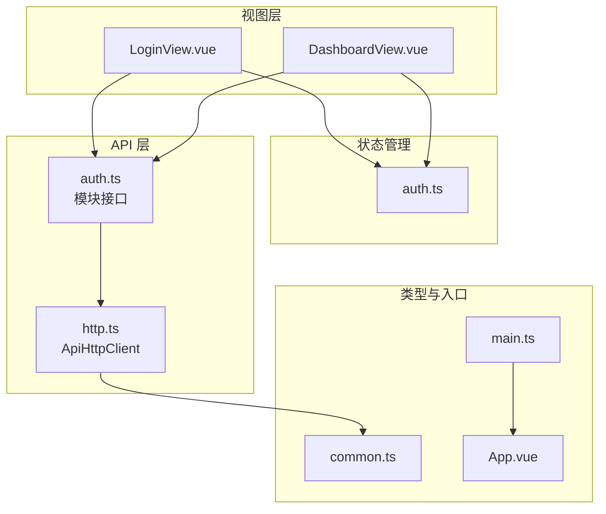
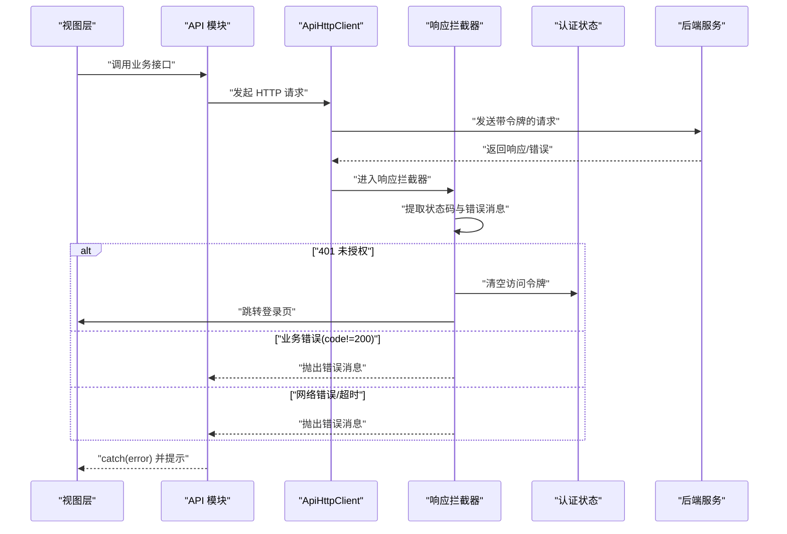
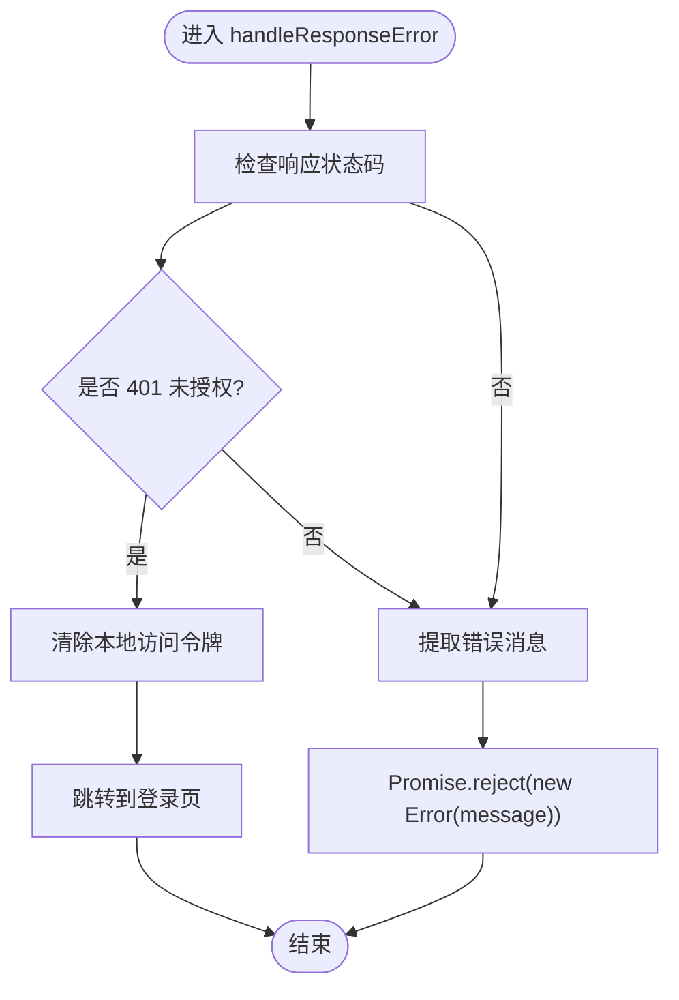
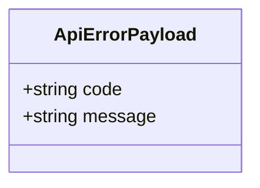
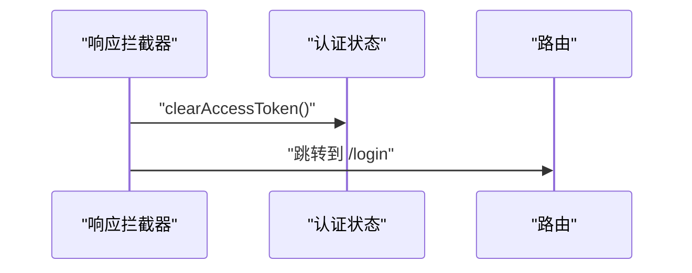
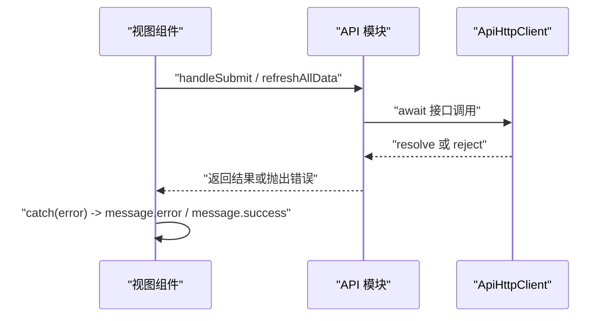
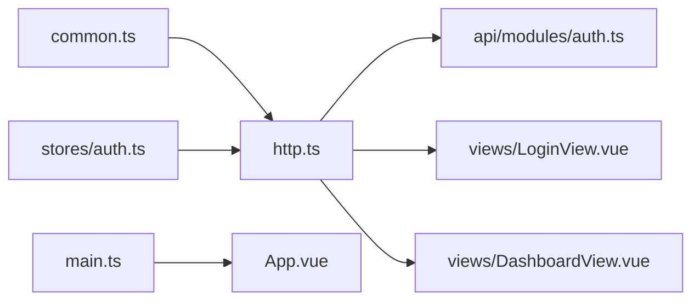

# 错误处理与调试

<cite>
**本文引用的文件**
- [web/src/api/http.ts](file://web/src/api/http.ts)
- [web/src/types/common.ts](file://web/src/types/common.ts)
- [web/src/stores/auth.ts](file://web/src/stores/auth.ts)
- [web/src/api/modules/auth.ts](file://web/src/api/modules/auth.ts)
- [web/src/views/LoginView.vue](file://web/src/views/LoginView.vue)
- [web/src/views/DashboardView.vue](file://web/src/views/DashboardView.vue)
- [web/src/main.ts](file://web/src/main.ts)
- [web/src/App.vue](file://web/src/App.vue)
</cite>

## 目录
1. [简介](#简介)
2. [项目结构](#项目结构)
3. [核心组件](#核心组件)
4. [架构总览](#架构总览)
5. [详细组件分析](#详细组件分析)
6. [依赖关系分析](#依赖关系分析)
7. [性能考量](#性能考量)
8. [故障排查指南](#故障排查指南)
9. [结论](#结论)
10. [附录](#附录)

## 简介
本文件面向 Poprako 前端，系统性梳理统一错误处理与调试机制，覆盖以下方面：
- HTTP 错误、业务错误与网络错误的分类与处理策略
- ApiErrorPayload 类型定义与统一错误响应格式
- 错误拦截器的实现（错误捕获、消息提取、用户提示）
- 网络错误处理策略（超时、重试、离线检测）
- 错误恢复机制（自动重试、降级、用户引导）
- 错误日志记录（堆栈、上下文、上报）
- 调试工具与开发辅助（请求日志、响应监控、性能分析）
- 错误监控与告警（第三方监控服务集成建议）
- 常见错误场景诊断与最佳实践

## 项目结构
前端采用模块化组织，API 层通过统一客户端集中处理鉴权、错误与响应解包；各业务模块通过该客户端发起请求；视图层负责用户交互与错误提示；Pinia 状态管理维护认证令牌。

**图表来源**
- [web/src/api/http.ts:1-196](file://web/src/api/http.ts#L1-L196)
- [web/src/types/common.ts:1-41](file://web/src/types/common.ts#L1-L41)
- [web/src/stores/auth.ts:1-52](file://web/src/stores/auth.ts#L1-L52)
- [web/src/api/modules/auth.ts:1-157](file://web/src/api/modules/auth.ts#L1-L157)
- [web/src/views/LoginView.vue:1-157](file://web/src/views/LoginView.vue#L1-L157)
- [web/src/views/DashboardView.vue:1-363](file://web/src/views/DashboardView.vue#L1-L363)
- [web/src/main.ts:1-26](file://web/src/main.ts#L1-L26)
- [web/src/App.vue:1-45](file://web/src/App.vue#L1-L45)

**章节来源**
- [web/src/main.ts:1-26](file://web/src/main.ts#L1-L26)
- [web/src/App.vue:1-45](file://web/src/App.vue#L1-L45)

## 核心组件
- 统一 HTTP 客户端：集中处理鉴权头注入、响应解包、错误拦截与通用 HTTP 方法封装。
- 统一错误结构：ApiErrorPayload 规范化后端错误响应。
- 认证状态管理：维护访问令牌并在 401 时触发登出。
- 视图层错误提示：基于 Ant Design Vue 的 message 组件进行用户提示。

**章节来源**
- [web/src/api/http.ts:33-196](file://web/src/api/http.ts#L33-L196)
- [web/src/types/common.ts:29-41](file://web/src/types/common.ts#L29-L41)
- [web/src/stores/auth.ts:15-52](file://web/src/stores/auth.ts#L15-L52)
- [web/src/views/LoginView.vue:69-82](file://web/src/views/LoginView.vue#L69-L82)
- [web/src/views/DashboardView.vue:221-240](file://web/src/views/DashboardView.vue#L221-L240)

## 架构总览
统一错误处理与调试的端到端流程如下：

**图表来源**
- [web/src/api/http.ts:53-97](file://web/src/api/http.ts#L53-L97)
- [web/src/stores/auth.ts:31-43](file://web/src/stores/auth.ts#L31-L43)
- [web/src/api/modules/auth.ts:102-132](file://web/src/api/modules/auth.ts#L102-L132)
- [web/src/views/LoginView.vue:69-82](file://web/src/views/LoginView.vue#L69-L82)

## 详细组件分析

### 统一 HTTP 客户端与错误拦截器
- 请求拦截：自动从本地存储读取访问令牌并注入 Authorization 头。
- 响应拦截：标准化错误消息；当状态码为 401 时，清除本地令牌并跳转至登录页；对业务错误（code 不等于 200）抛出错误；对网络异常与超时也统一抛出错误。
- 响应解包：统一期望响应体包含 code、message、data 字段；仅当 code 为 200 时返回 data，否则 reject 错误。
- HTTP 方法封装：提供 get/post/put/patch/delete 等常用方法，内部复用 request。

**图表来源**
- [web/src/api/http.ts:82-97](file://web/src/api/http.ts#L82-L97)

**章节来源**
- [web/src/api/http.ts:33-196](file://web/src/api/http.ts#L33-L196)

### ApiErrorPayload 类型定义与统一错误格式
- ApiErrorPayload：后端错误响应的统一结构，包含可选的业务错误码与必填的错误消息字段。
- 前端约定：后端返回的响应体需包含 code、message；当 code 非 200 时，前端视为业务错误并抛出 message。

**图表来源**
- [web/src/types/common.ts:31-40](file://web/src/types/common.ts#L31-L40)

**章节来源**
- [web/src/types/common.ts:29-41](file://web/src/types/common.ts#L29-L41)

### 认证状态与 401 自动登出
- 认证 Store：维护访问令牌与登录态，支持设置与清除令牌。
- 401 行为：响应拦截器检测到 401 时，清除本地令牌并跳转登录页，避免出现“已过期但未登出”的状态。

**图表来源**
- [web/src/api/http.ts:89-94](file://web/src/api/http.ts#L89-L94)
- [web/src/stores/auth.ts:39-43](file://web/src/stores/auth.ts#L39-L43)

**章节来源**
- [web/src/stores/auth.ts:15-52](file://web/src/stores/auth.ts#L15-L52)
- [web/src/api/http.ts:89-94](file://web/src/api/http.ts#L89-L94)

### 视图层错误提示与用户引导
- 登录页：在登录提交中捕获错误并通过消息组件提示用户；成功后设置令牌并跳转。
- 仪表盘：批量数据刷新时统一 try/catch 并提示；按钮 loading 状态提升用户体验。

**图表来源**
- [web/src/views/LoginView.vue:69-82](file://web/src/views/LoginView.vue#L69-L82)
- [web/src/views/DashboardView.vue:221-240](file://web/src/views/DashboardView.vue#L221-L240)

**章节来源**
- [web/src/views/LoginView.vue:69-82](file://web/src/views/LoginView.vue#L69-L82)
- [web/src/views/DashboardView.vue:221-240](file://web/src/views/DashboardView.vue#L221-L240)

### 网络错误处理策略
- 超时处理：Axios 实例设置了默认超时时间，超出则视为网络错误并抛出。
- 重试机制：当前未内置自动重试；可在上层调用处按需实现指数退避重试。
- 离线状态检测：可通过浏览器在线状态事件与请求失败次数统计实现离线引导与缓存降级。

**章节来源**
- [web/src/api/http.ts:43-47](file://web/src/api/http.ts#L43-L47)

### 错误恢复机制
- 自动重试：建议在业务层对幂等请求进行有限次数重试，并结合退避策略。
- 降级处理：在网络错误或业务错误时，优先返回兜底数据或空态，保证核心功能可用。
- 用户引导：错误发生时提供明确的操作指引（如重新登录、稍后重试、检查网络）。

**章节来源**
- [web/src/api/http.ts:82-97](file://web/src/api/http.ts#L82-L97)

### 错误日志记录与上报
- 前端日志：在错误拦截器与视图层 catch 中收集错误消息、URL、方法、时间戳与用户上下文（如用户 ID），并上报至监控平台。
- 上报建议：使用异步上报，避免阻塞主线程；对重复错误进行采样与去重。

**章节来源**
- [web/src/api/http.ts:82-97](file://web/src/api/http.ts#L82-L97)
- [web/src/views/LoginView.vue:76-78](file://web/src/views/LoginView.vue#L76-L78)
- [web/src/views/DashboardView.vue:234-236](file://web/src/views/DashboardView.vue#L234-L236)

### 调试工具与开发辅助
- 请求日志：在请求拦截器中打印 URL、方法、头信息与入参；在响应拦截器中打印状态码与响应摘要。
- 响应监控：对慢请求与错误率进行统计，辅助定位性能瓶颈。
- 性能分析：结合浏览器性能面板与网络面板，分析首屏与交互延迟。

**章节来源**
- [web/src/api/http.ts:66-77](file://web/src/api/http.ts#L66-L77)
- [web/src/api/http.ts:102-112](file://web/src/api/http.ts#L102-L112)

## 依赖关系分析
- ApiHttpClient 依赖 ApiErrorPayload 类型定义，确保前后端错误结构一致。
- API 模块通过 httpClient 统一发起请求，避免分散的错误处理逻辑。
- 视图层通过 Pinia 访问认证状态，配合拦截器实现 401 自动登出。
- 入口文件负责应用初始化，确保拦截器与组件库正确注入。

**图表来源**
- [web/src/types/common.ts:29-41](file://web/src/types/common.ts#L29-L41)
- [web/src/api/http.ts:12-13](file://web/src/api/http.ts#L12-L13)
- [web/src/api/modules/auth.ts:4-5](file://web/src/api/modules/auth.ts#L4-L5)
- [web/src/views/LoginView.vue:54-55](file://web/src/views/LoginView.vue#L54-L55)
- [web/src/views/DashboardView.vue:109-111](file://web/src/views/DashboardView.vue#L109-L111)
- [web/src/stores/auth.ts:15-52](file://web/src/stores/auth.ts#L15-L52)
- [web/src/main.ts:16-23](file://web/src/main.ts#L16-L23)
- [web/src/App.vue:1-13](file://web/src/App.vue#L1-L13)

**章节来源**
- [web/src/api/http.ts:1-196](file://web/src/api/http.ts#L1-L196)
- [web/src/types/common.ts:1-41](file://web/src/types/common.ts#L1-L41)
- [web/src/stores/auth.ts:1-52](file://web/src/stores/auth.ts#L1-L52)
- [web/src/api/modules/auth.ts:1-157](file://web/src/api/modules/auth.ts#L1-L157)
- [web/src/views/LoginView.vue:1-157](file://web/src/views/LoginView.vue#L1-L157)
- [web/src/views/DashboardView.vue:1-363](file://web/src/views/DashboardView.vue#L1-L363)
- [web/src/main.ts:1-26](file://web/src/main.ts#L1-L26)
- [web/src/App.vue:1-45](file://web/src/App.vue#L1-L45)

## 性能考量
- 超时与重试：合理设置超时阈值，避免长时间阻塞；对关键路径启用有限重试。
- 错误提示：避免频繁弹窗，合并同类错误，减少 UI 抖动。
- 日志上报：异步与采样上报，降低对主流程的影响。
- 缓存与降级：在网络不稳定时提供兜底数据，提升可用性。

## 故障排查指南
- 登录失败/提示“登录失败”：检查后端返回的错误消息；确认 ApiErrorPayload.message 是否存在；查看拦截器是否正确提取。
- 401 未授权循环跳转：确认响应拦截器是否正确清除令牌并跳转；检查路由守卫与登录页路径。
- 业务错误（code 非 200）：核对后端响应结构；确保前端 request 解包逻辑与后端一致。
- 网络错误/超时：检查网络面板与请求头；确认 Vite 环境变量与代理配置；评估重试策略。
- 视图层未提示：确认 catch 分支是否正确提取错误消息并调用消息组件。

**章节来源**
- [web/src/api/http.ts:82-97](file://web/src/api/http.ts#L82-L97)
- [web/src/views/LoginView.vue:76-78](file://web/src/views/LoginView.vue#L76-L78)
- [web/src/views/DashboardView.vue:234-236](file://web/src/views/DashboardView.vue#L234-L236)

## 结论
Poprako 前端通过统一 HTTP 客户端实现了集中化的错误处理与用户提示，结合认证状态管理与视图层反馈，形成了清晰的错误闭环。建议在此基础上补充自动重试、离线降级与监控上报能力，以进一步提升稳定性与可观测性。

## 附录
- 最佳实践清单
  - 统一错误结构：前后端严格遵循 ApiErrorPayload。
  - 明确错误分类：区分网络错误、HTTP 错误、业务错误。
  - 用户友好提示：错误消息简洁明确，提供操作指引。
  - 401 自动登出：拦截器与状态管理协同。
  - 开发辅助：开启请求/响应日志，便于定位问题。
  - 监控与告警：接入第三方监控平台，建立告警阈值。