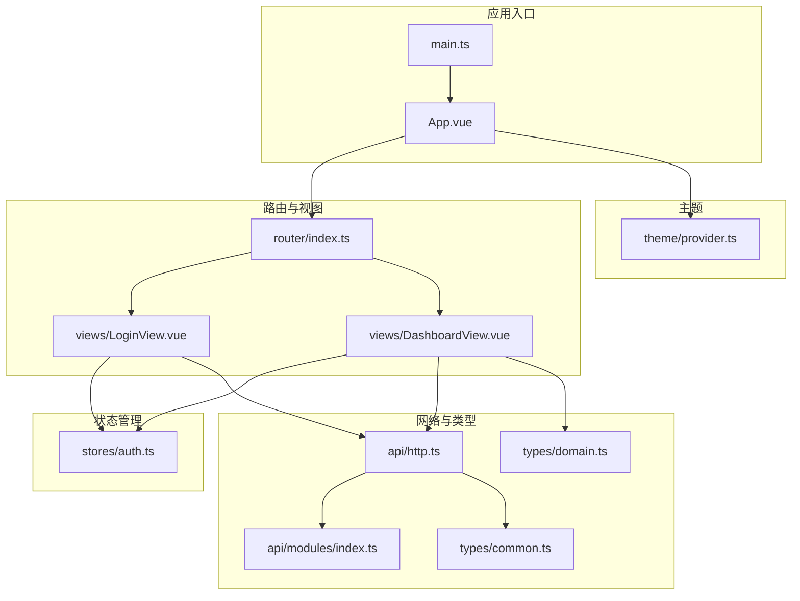
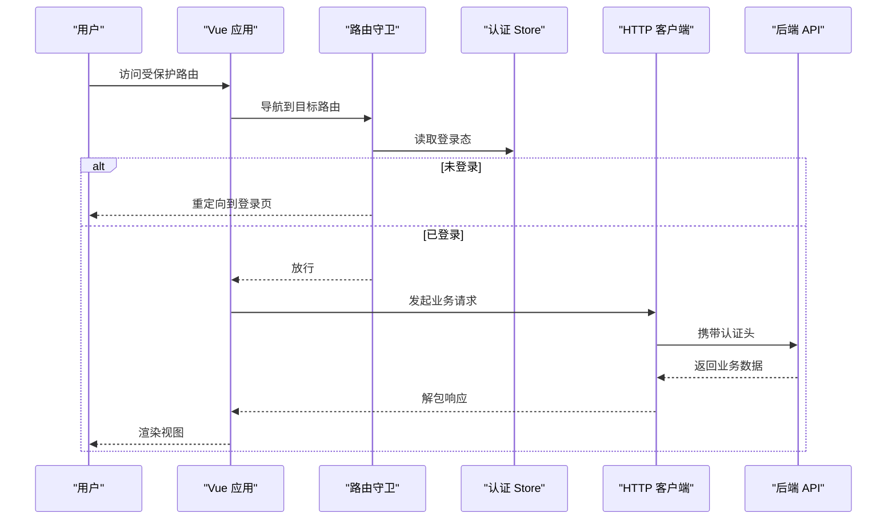
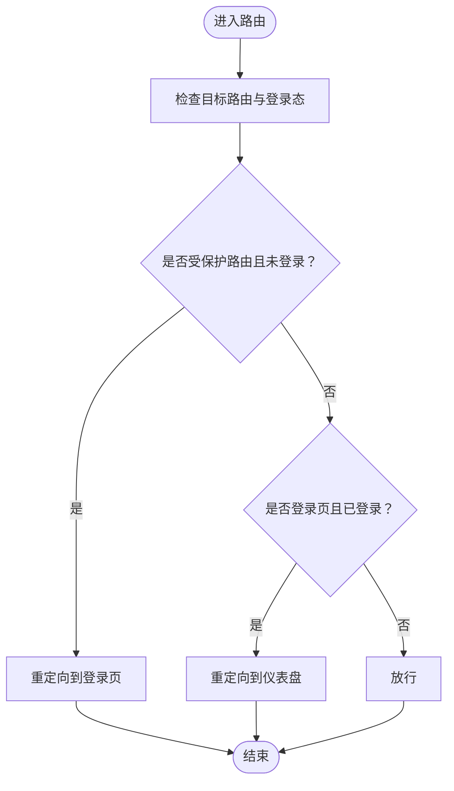
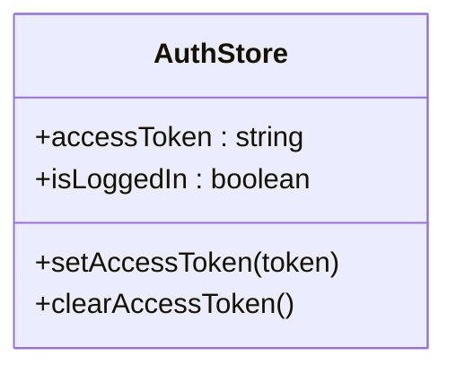
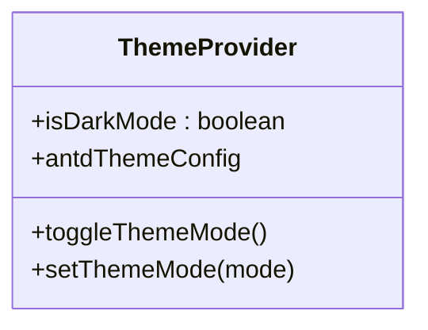
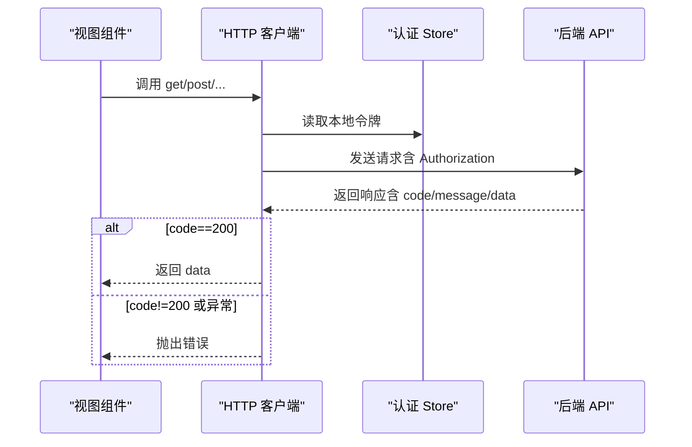
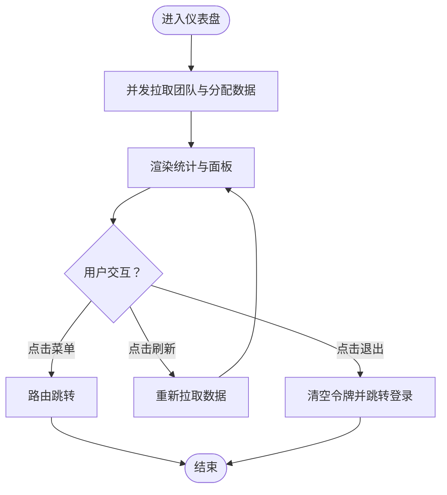
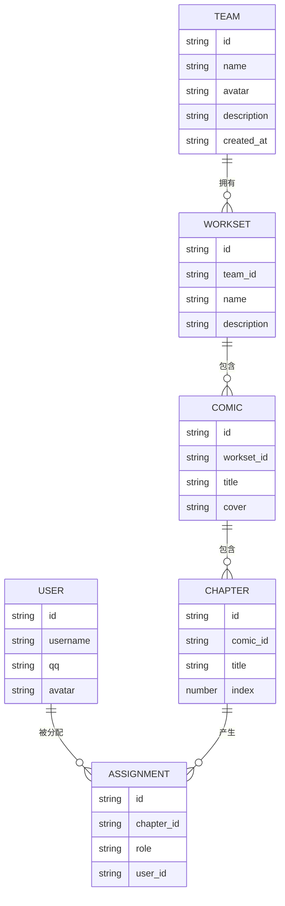
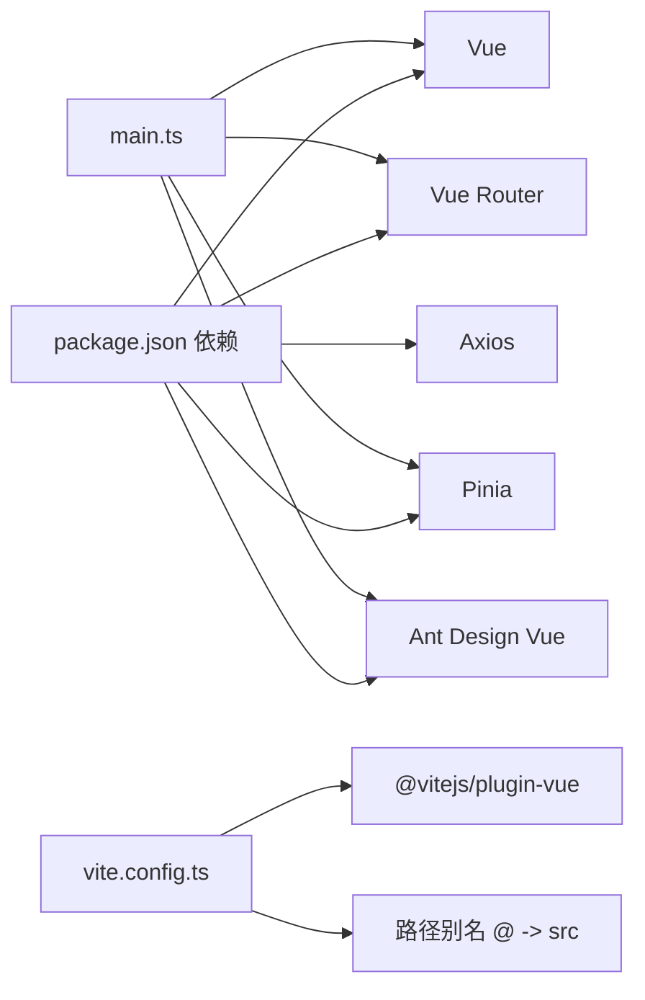

# 前端开发

<cite>
**本文引用的文件**
- [package.json](file://web/package.json)
- [vite.config.ts](file://web/vite.config.ts)
- [main.ts](file://web/src/main.ts)
- [App.vue](file://web/src/App.vue)
- [router/index.ts](file://web/src/router/index.ts)
- [stores/auth.ts](file://web/src/stores/auth.ts)
- [theme/provider.ts](file://web/src/theme/provider.ts)
- [api/http.ts](file://web/src/api/http.ts)
- [api/modules/index.ts](file://web/src/api/modules/index.ts)
- [types/common.ts](file://web/src/types/common.ts)
- [types/domain.ts](file://web/src/types/domain.ts)
- [views/LoginView.vue](file://web/src/views/LoginView.vue)
- [views/DashboardView.vue](file://web/src/views/DashboardView.vue)
- [style.scss](file://web/src/style.scss)
- [tsconfig.app.json](file://web/tsconfig.app.json)
</cite>

## 目录
1. [简介](#简介)
2. [项目结构](#项目结构)
3. [核心组件](#核心组件)
4. [架构总览](#架构总览)
5. [详细组件分析](#详细组件分析)
6. [依赖分析](#依赖分析)
7. [性能考虑](#性能考虑)
8. [故障排查指南](#故障排查指南)
9. [结论](#结论)
10. [附录](#附录)

## 简介
本文件面向 Poprako 前端开发，围绕 Vue.js 3.5.13 + TypeScript + Vite 6.2.2 技术栈，系统梳理应用的组件结构、路由设计、状态管理模式与 Pinia 使用实践，详解 Ant Design Vue 4.2.6 的集成与自定义主题配置，给出 API 集成（HTTP 客户端、认证状态管理、错误处理）的完整指导，并总结用户界面设计模式、交互逻辑、响应式与可访问性、性能优化策略以及开发、构建与部署流程。

## 项目结构
前端工程位于 web 目录，采用“功能域+分层”的组织方式：
- 入口与根组件：main.ts、App.vue
- 路由：router/index.ts
- 状态管理：stores/auth.ts
- 主题：theme/provider.ts
- API 层：api/http.ts、api/modules/*
- 类型定义：types/common.ts、types/domain.ts
- 视图：views/*.vue
- 样式：style.scss
- 构建与类型：vite.config.ts、tsconfig.app.json、package.json

图表来源
- [main.ts:1-26](file://web/src/main.ts#L1-L26)
- [App.vue:1-45](file://web/src/App.vue#L1-L45)
- [router/index.ts:1-59](file://web/src/router/index.ts#L1-L59)
- [stores/auth.ts:1-52](file://web/src/stores/auth.ts#L1-L52)
- [theme/provider.ts:1-97](file://web/src/theme/provider.ts#L1-L97)
- [api/http.ts:1-196](file://web/src/api/http.ts#L1-L196)
- [api/modules/index.ts:1-10](file://web/src/api/modules/index.ts#L1-L10)
- [types/common.ts:1-41](file://web/src/types/common.ts#L1-L41)
- [types/domain.ts:1-89](file://web/src/types/domain.ts#L1-L89)
- [views/LoginView.vue:1-157](file://web/src/views/LoginView.vue#L1-L157)
- [views/DashboardView.vue:1-363](file://web/src/views/DashboardView.vue#L1-L363)

章节来源
- [package.json:1-36](file://web/package.json#L1-L36)
- [vite.config.ts:1-44](file://web/vite.config.ts#L1-L44)
- [main.ts:1-26](file://web/src/main.ts#L1-L26)
- [router/index.ts:1-59](file://web/src/router/index.ts#L1-L59)
- [stores/auth.ts:1-52](file://web/src/stores/auth.ts#L1-L52)
- [theme/provider.ts:1-97](file://web/src/theme/provider.ts#L1-L97)
- [api/http.ts:1-196](file://web/src/api/http.ts#L1-L196)
- [api/modules/index.ts:1-10](file://web/src/api/modules/index.ts#L1-L10)
- [types/common.ts:1-41](file://web/src/types/common.ts#L1-L41)
- [types/domain.ts:1-89](file://web/src/types/domain.ts#L1-L89)
- [views/LoginView.vue:1-157](file://web/src/views/LoginView.vue#L1-L157)
- [views/DashboardView.vue:1-363](file://web/src/views/DashboardView.vue#L1-L363)
- [style.scss:1-147](file://web/src/style.scss#L1-L147)
- [tsconfig.app.json:1-9](file://web/tsconfig.app.json#L1-L9)

## 核心组件
- 应用入口与插件注册：在入口文件中初始化 Vue、Pinia、路由与 Ant Design Vue，并引入全局样式。
- 根组件与主题：根组件通过主题 Provider 将 Ant Design Vue 的主题配置注入全局，并提供主题切换控件。
- 路由与守卫：定义页面路由与登录态守卫，非登录态访问受保护路由将重定向至登录页。
- 认证状态：Pinia Store 统一维护访问令牌与登录态，持久化于本地存储。
- API 客户端：Axios 封装统一请求层，集中处理鉴权头、错误标准化与响应解包。
- 视图组件：登录页与仪表盘页分别演示基础表单、消息反馈、菜单导航、表格与列表等 Ant Design Vue 组件的组合使用。

章节来源
- [main.ts:1-26](file://web/src/main.ts#L1-L26)
- [App.vue:1-45](file://web/src/App.vue#L1-L45)
- [router/index.ts:1-59](file://web/src/router/index.ts#L1-L59)
- [stores/auth.ts:1-52](file://web/src/stores/auth.ts#L1-L52)
- [api/http.ts:1-196](file://web/src/api/http.ts#L1-L196)
- [views/LoginView.vue:1-157](file://web/src/views/LoginView.vue#L1-L157)
- [views/DashboardView.vue:1-363](file://web/src/views/DashboardView.vue#L1-L363)

## 架构总览
前端采用“入口 -> 根组件 -> 路由 -> 视图 -> 状态/主题/网络”的分层架构。根组件负责主题注入与全局 UI 控制；路由负责页面导航与登录态校验；视图组件通过 Pinia 获取认证状态，通过 API 客户端发起请求；主题 Provider 提供跨组件的主题一致性。

图表来源
- [router/index.ts:47-56](file://web/src/router/index.ts#L47-L56)
- [stores/auth.ts:26](file://web/src/stores/auth.ts#L26)
- [api/http.ts:66-77](file://web/src/api/http.ts#L66-L77)
- [api/http.ts:102-112](file://web/src/api/http.ts#L102-L112)

## 详细组件分析

### 路由与导航
- 路由表包含登录、仪表盘与文件测试页，使用动态导入实现懒加载。
- 前置守卫根据认证 Store 的登录态决定放行或重定向，避免未登录访问受保护页面。

图表来源
- [router/index.ts:14-34](file://web/src/router/index.ts#L14-L34)
- [router/index.ts:47-56](file://web/src/router/index.ts#L47-L56)

章节来源
- [router/index.ts:1-59](file://web/src/router/index.ts#L1-L59)

### 认证状态管理（Pinia）
- Store 维护访问令牌与登录态，提供设置与清空方法，并与本地存储保持同步。
- 登录成功后写入令牌，仪表盘页提供退出登录逻辑。

图表来源
- [stores/auth.ts:15-51](file://web/src/stores/auth.ts#L15-L51)

章节来源
- [stores/auth.ts:1-52](file://web/src/stores/auth.ts#L1-L52)
- [views/LoginView.vue:69-82](file://web/src/views/LoginView.vue#L69-L82)
- [views/DashboardView.vue:245-248](file://web/src/views/DashboardView.vue#L245-L248)

### 主题与外观（Ant Design Vue + 自定义主题）
- 主题 Provider 统一管理亮/暗模式，计算 Ant Design Vue 的主题算法与 token，并持久化用户选择。
- 根组件通过 Ant Design Vue 的 ConfigProvider 注入主题配置；页面通过 CSS 变量与暗黑模式属性实现视觉一致性。

图表来源
- [theme/provider.ts:53-96](file://web/src/theme/provider.ts#L53-L96)
- [App.vue:19-28](file://web/src/App.vue#L19-L28)
- [style.scss:56-113](file://web/src/style.scss#L56-L113)

章节来源
- [theme/provider.ts:1-97](file://web/src/theme/provider.ts#L1-L97)
- [App.vue:1-45](file://web/src/App.vue#L1-L45)
- [style.scss:1-147](file://web/src/style.scss#L1-L147)

### API 集成（HTTP 客户端、认证与错误处理）
- 统一请求客户端封装：设置 base URL、超时、请求头注入、响应错误处理与业务响应解包。
- 错误处理：标准化错误消息，401 时清除本地令牌并跳转登录页。
- 查询参数序列化：兼容 includes[] 数组格式，提升与后端规范的一致性。
- 模块化导出：通过模块索引导出各领域 API，便于视图组件按需导入。

图表来源
- [api/http.ts:42-48](file://web/src/api/http.ts#L42-L48)
- [api/http.ts:66-77](file://web/src/api/http.ts#L66-L77)
- [api/http.ts:82-97](file://web/src/api/http.ts#L82-L97)
- [api/http.ts:102-112](file://web/src/api/http.ts#L102-L112)
- [api/modules/index.ts:1-10](file://web/src/api/modules/index.ts#L1-10)

章节来源
- [api/http.ts:1-196](file://web/src/api/http.ts#L1-L196)
- [api/modules/index.ts:1-10](file://web/src/api/modules/index.ts#L1-L10)
- [types/common.ts:1-41](file://web/src/types/common.ts#L1-L41)

### 视图组件设计模式与交互逻辑
- 登录页：表单校验、异步提交、消息反馈、成功后跳转仪表盘。
- 仪表盘：侧边栏菜单、头部操作区、统计卡片、表格与列表、角色标签与时间格式化、批量数据拉取与并发加载。

图表来源
- [views/DashboardView.vue:221-240](file://web/src/views/DashboardView.vue#L221-L240)
- [views/DashboardView.vue:201-215](file://web/src/views/DashboardView.vue#L201-L215)
- [views/DashboardView.vue:245-248](file://web/src/views/DashboardView.vue#L245-L248)

章节来源
- [views/LoginView.vue:1-157](file://web/src/views/LoginView.vue#L1-L157)
- [views/DashboardView.vue:1-363](file://web/src/views/DashboardView.vue#L1-L363)

### 数据模型与类型
- 通用类型：分页参数、包含数组查询参数、统一错误结构。
- 领域模型：用户、团队、工作集、漫画、章节、分配等实体的接口定义。

图表来源
- [types/domain.ts:7-88](file://web/src/types/domain.ts#L7-L88)

章节来源
- [types/common.ts:1-41](file://web/src/types/common.ts#L1-L41)
- [types/domain.ts:1-89](file://web/src/types/domain.ts#L1-L89)

## 依赖分析
- 运行时依赖：Vue、Vue Router、Pinia、Ant Design Vue、Axios、图标库。
- 开发依赖：Vite、Vue 插件、TypeScript、ESLint、Sass、类型检查工具。
- 构建与运行：Vite 配置注册 Vue 插件、路径别名与可配置端口；入口文件统一注册插件与样式。

图表来源
- [package.json:13-34](file://web/package.json#L13-L34)
- [vite.config.ts:28-33](file://web/vite.config.ts#L28-L33)
- [main.ts:4-10](file://web/src/main.ts#L4-L10)

章节来源
- [package.json:1-36](file://web/package.json#L1-L36)
- [vite.config.ts:1-44](file://web/vite.config.ts#L1-L44)
- [main.ts:1-26](file://web/src/main.ts#L1-L26)

## 性能考虑
- 路由懒加载：通过动态导入减少首屏体积。
- 并发数据拉取：仪表盘使用 Promise.all 并行加载多个数据源，缩短首屏等待。
- 组件级样式作用域：使用 scoped 与 CSS 变量，降低样式冲突与重绘成本。
- 主题切换轻量：通过 data-theme 属性与 CSS 变量切换，避免全量重绘。
- 构建优化：Vite 默认启用模块预热与快速刷新；生产构建进行压缩与 Tree-shaking。

章节来源
- [router/index.ts:20-33](file://web/src/router/index.ts#L20-L33)
- [views/DashboardView.vue:224-230](file://web/src/views/DashboardView.vue#L224-L230)
- [style.scss:56-113](file://web/src/style.scss#L56-L113)

## 故障排查指南
- 登录后仍被重定向到登录页
  - 检查路由守卫逻辑与认证 Store 的登录态。
  - 确认登录成功后是否正确写入访问令牌。
- 请求 401 未跳转登录页
  - 检查请求拦截器是否注入 Authorization 头。
  - 确认响应拦截器对 401 的处理与页面跳转逻辑。
- API 返回非 200 但未报错
  - 确认业务响应解包逻辑与错误分支。
- 主题切换无效
  - 检查主题 Provider 的持久化与 data-theme 属性更新。
- 构建失败或类型检查不通过
  - 确认 tsconfig 配置与类型声明路径。
  - 使用脚本进行 lint 与类型检查后再构建。

章节来源
- [router/index.ts:47-56](file://web/src/router/index.ts#L47-L56)
- [stores/auth.ts:31-43](file://web/src/stores/auth.ts#L31-L43)
- [api/http.ts:66-77](file://web/src/api/http.ts#L66-L77)
- [api/http.ts:82-97](file://web/src/api/http.ts#L82-L97)
- [api/http.ts:102-112](file://web/src/api/http.ts#L102-L112)
- [theme/provider.ts:80-88](file://web/src/theme/provider.ts#L80-L88)
- [tsconfig.app.json:1-9](file://web/tsconfig.app.json#L1-L9)

## 结论
本前端工程以 Vue 3 + TypeScript + Vite 为基础，结合 Pinia 实现轻量状态管理，Ant Design Vue 提供一致的 UI 体验，Axios 统一封装网络层，配合路由守卫与主题 Provider 形成清晰的架构分层。通过模块化 API 与类型系统，提升了可维护性与可扩展性；通过并发数据拉取与主题切换等实践，兼顾了性能与用户体验。

## 附录
- 开发工作流
  - 启动：使用开发脚本启动本地服务，支持可配置主机与端口。
  - 编辑：遵循 ESLint 与 TypeScript 类型检查规则。
  - 预览：使用预览脚本验证构建产物。
- 构建与部署
  - 生产构建：先执行 lint 与类型检查，再进行打包。
  - 部署：将构建产物目录部署至静态服务器或 CDN。
- 环境变量
  - 建议通过环境变量配置 API 基础地址，便于多环境切换。
- 可访问性与响应式
  - 使用 Ant Design Vue 组件的语义化与尺寸选项，结合媒体查询与弹性布局实现响应式适配。

章节来源
- [package.json:6-12](file://web/package.json#L6-L12)
- [vite.config.ts:21-42](file://web/vite.config.ts#L21-L42)
- [api/http.ts:20-27](file://web/src/api/http.ts#L20-L27)