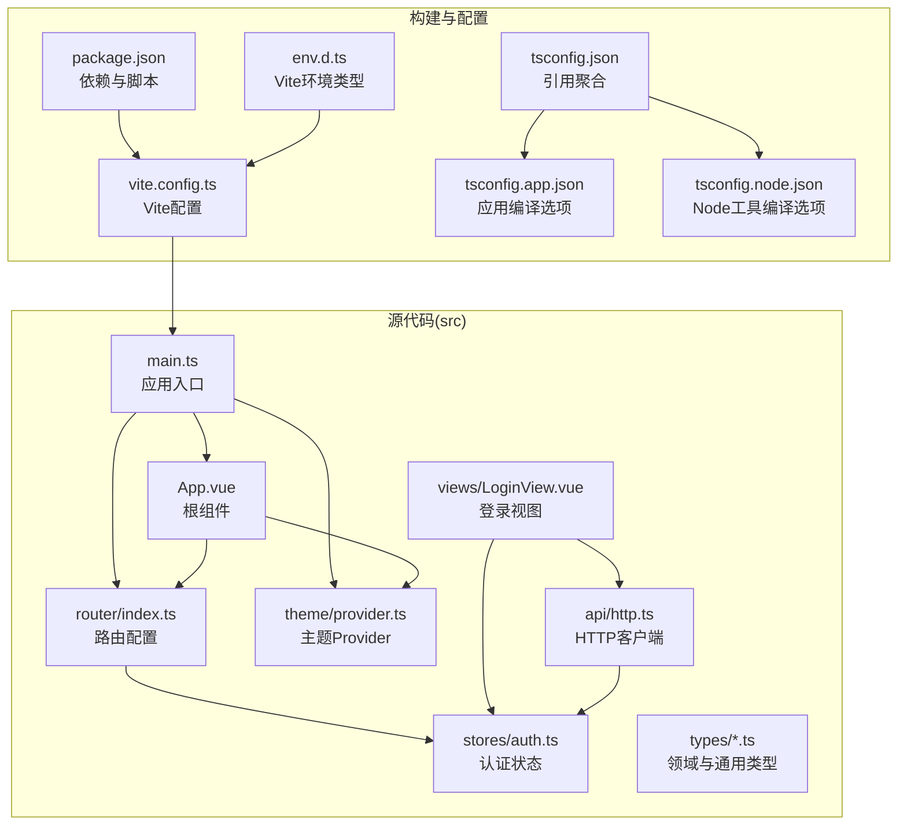
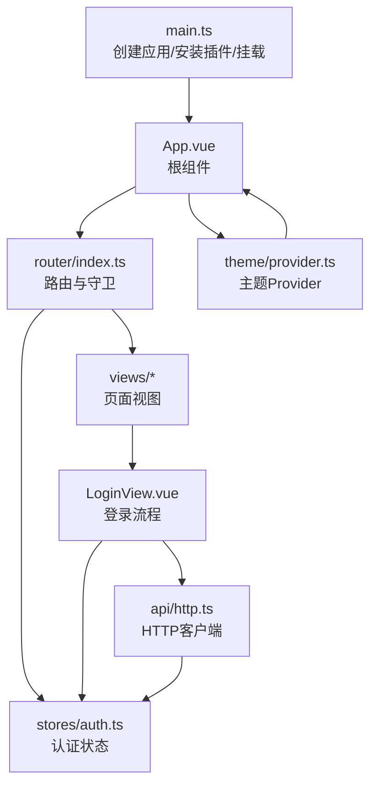
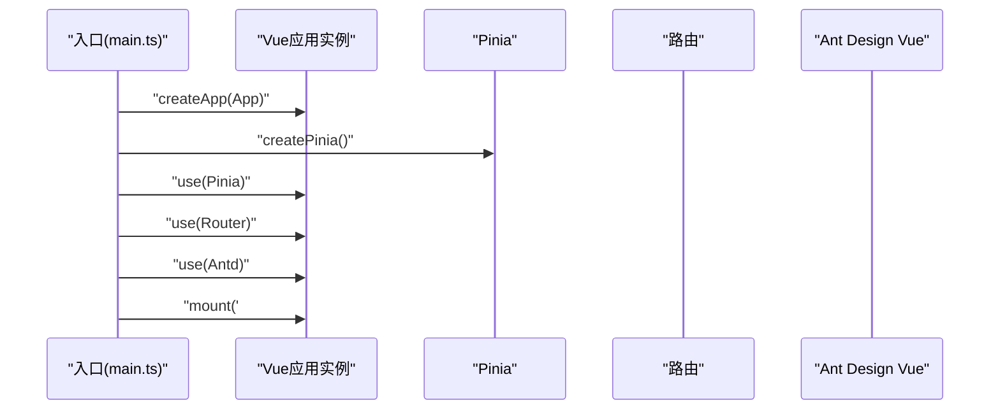
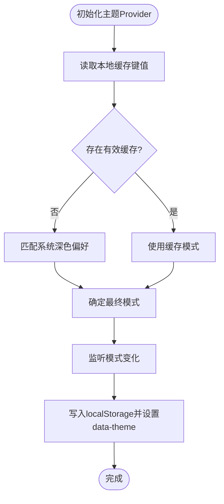
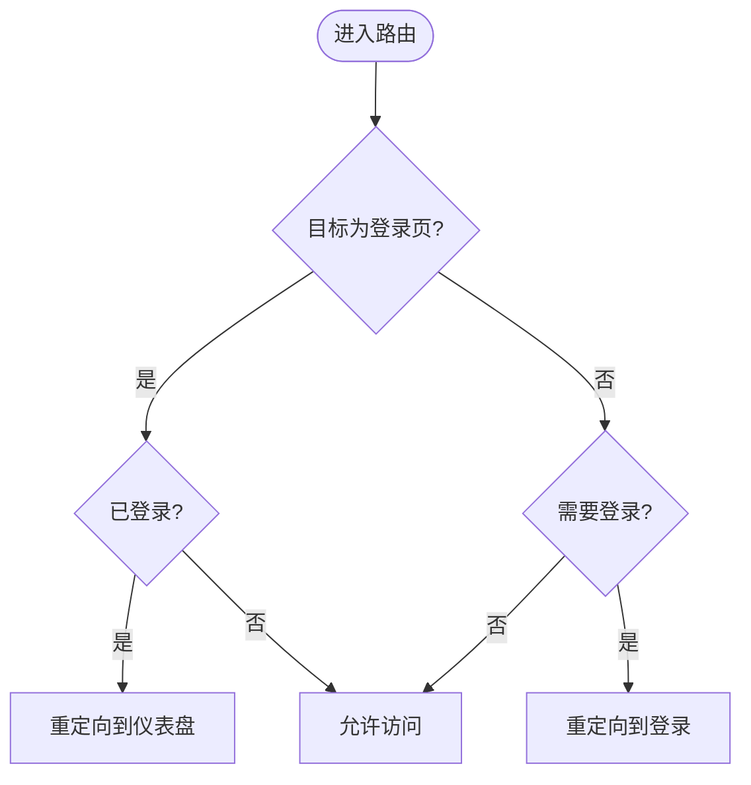
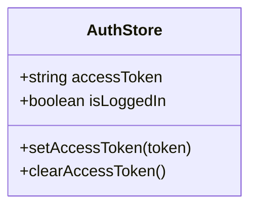
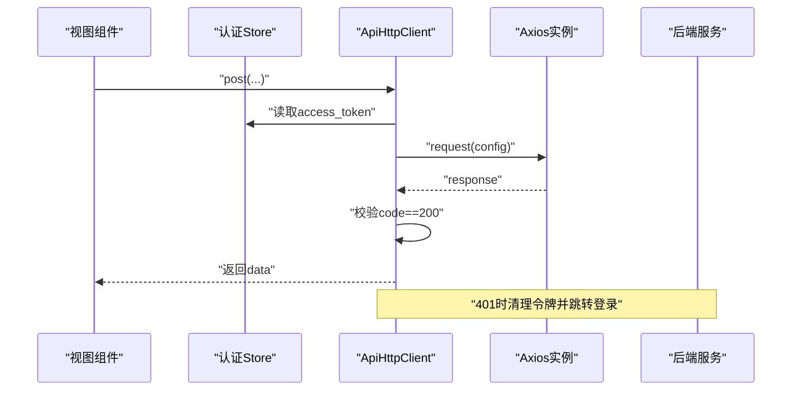
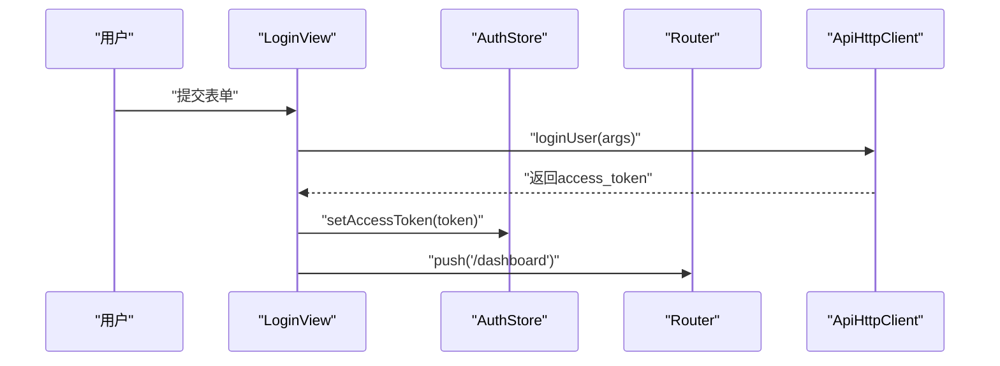
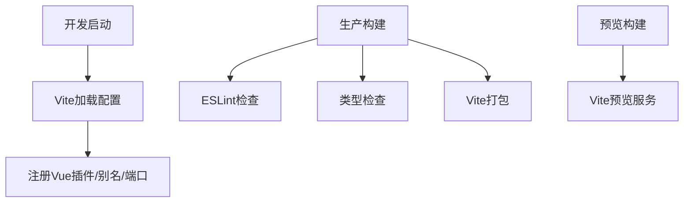
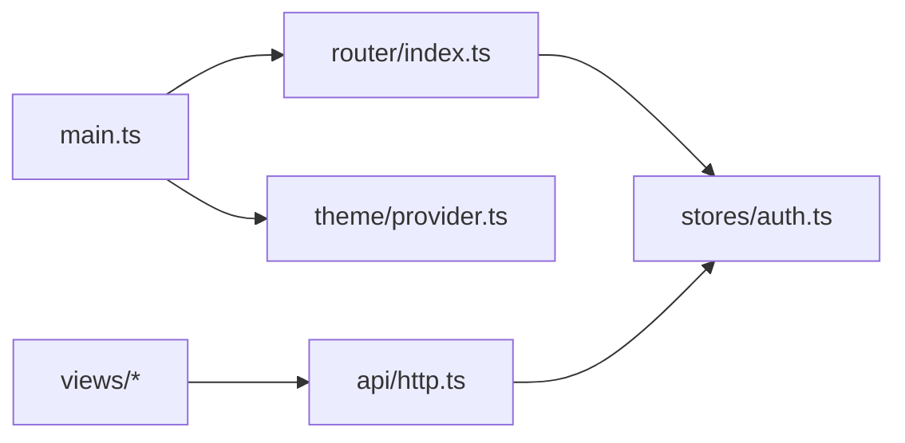

# 应用架构

<cite>
**本文引用的文件**
- [web/src/main.ts](file://web/src/main.ts)
- [web/src/App.vue](file://web/src/App.vue)
- [web/src/router/index.ts](file://web/src/router/index.ts)
- [web/src/theme/provider.ts](file://web/src/theme/provider.ts)
- [web/src/stores/auth.ts](file://web/src/stores/auth.ts)
- [web/src/api/http.ts](file://web/src/api/http.ts)
- [web/src/views/LoginView.vue](file://web/src/views/LoginView.vue)
- [web/src/env.d.ts](file://web/src/env.d.ts)
- [web/vite.config.ts](file://web/vite.config.ts)
- [web/package.json](file://web/package.json)
- [web/tsconfig.json](file://web/tsconfig.json)
- [web/tsconfig.app.json](file://web/tsconfig.app.json)
- [web/tsconfig.node.json](file://web/tsconfig.node.json)
</cite>

## 目录
1. [引言](#引言)
2. [项目结构](#项目结构)
3. [核心组件](#核心组件)
4. [架构总览](#架构总览)
5. [详细组件分析](#详细组件分析)
6. [依赖分析](#依赖分析)
7. [性能考虑](#性能考虑)
8. [故障排查指南](#故障排查指南)
9. [结论](#结论)
10. [附录](#附录)

## 引言
本文件面向 Poprako 前端应用，围绕基于 Vue.js 3.5.13 + TypeScript + Vite 6.2.2 的整体架构进行系统化说明。重点覆盖应用入口初始化流程（Vue 实例创建、Pinia 状态管理、路由配置、Ant Design Vue 组件库集成）、根组件设计与主题体系、HTTP 请求层与认证状态管理、构建与类型系统、模块化导入策略、开发服务器与热重载、生产构建优化、以及环境变量与跨域相关配置建议。

## 项目结构
前端工程位于 web 目录，采用“按功能域划分”的模块化组织方式：
- 入口与根组件：src/main.ts、src/App.vue
- 路由与视图：src/router、src/views
- 状态管理：src/stores
- 主题系统：src/theme
- API 层：src/api
- 类型定义：src/types
- 构建与类型配置：vite.config.ts、tsconfig.*.json
- 环境类型声明：src/env.d.ts
- 包管理与脚本：package.json

**图表来源**
- [web/src/main.ts:1-26](file://web/src/main.ts#L1-L26)
- [web/src/App.vue:1-45](file://web/src/App.vue#L1-L45)
- [web/src/router/index.ts:1-59](file://web/src/router/index.ts#L1-L59)
- [web/src/theme/provider.ts:1-97](file://web/src/theme/provider.ts#L1-L97)
- [web/src/stores/auth.ts:1-52](file://web/src/stores/auth.ts#L1-L52)
- [web/src/api/http.ts:1-196](file://web/src/api/http.ts#L1-L196)
- [web/src/views/LoginView.vue:1-157](file://web/src/views/LoginView.vue#L1-L157)
- [web/vite.config.ts:1-44](file://web/vite.config.ts#L1-L44)
- [web/package.json:1-36](file://web/package.json#L1-L36)
- [web/tsconfig.json:1-12](file://web/tsconfig.json#L1-L12)
- [web/tsconfig.app.json:1-9](file://web/tsconfig.app.json#L1-L9)
- [web/tsconfig.node.json:1-20](file://web/tsconfig.node.json#L1-L20)
- [web/src/env.d.ts:1-13](file://web/src/env.d.ts#L1-L13)

**章节来源**
- [web/src/main.ts:1-26](file://web/src/main.ts#L1-L26)
- [web/src/App.vue:1-45](file://web/src/App.vue#L1-L45)
- [web/src/router/index.ts:1-59](file://web/src/router/index.ts#L1-L59)
- [web/src/theme/provider.ts:1-97](file://web/src/theme/provider.ts#L1-L97)
- [web/src/stores/auth.ts:1-52](file://web/src/stores/auth.ts#L1-L52)
- [web/src/api/http.ts:1-196](file://web/src/api/http.ts#L1-L196)
- [web/src/views/LoginView.vue:1-157](file://web/src/views/LoginView.vue#L1-L157)
- [web/vite.config.ts:1-44](file://web/vite.config.ts#L1-L44)
- [web/package.json:1-36](file://web/package.json#L1-L36)
- [web/tsconfig.json:1-12](file://web/tsconfig.json#L1-L12)
- [web/tsconfig.app.json:1-9](file://web/tsconfig.app.json#L1-L9)
- [web/tsconfig.node.json:1-20](file://web/tsconfig.node.json#L1-L20)
- [web/src/env.d.ts:1-13](file://web/src/env.d.ts#L1-L13)

## 核心组件
- 应用入口 main.ts：负责创建 Vue 应用、安装 Pinia、注册路由与 Ant Design Vue，并完成挂载。
- 根组件 App.vue：通过 Ant Design Vue 的 ConfigProvider 注入主题配置，承载路由视图并在右下角提供主题切换控件。
- 路由 router/index.ts：定义登录、仪表盘、文件测试等页面路由，并实现前置守卫以校验登录态。
- 主题 Provider theme/provider.ts：统一管理亮/暗模式、Ant Design Vue 主题算法与 token、本地持久化与 DOM 数据集标记。
- 认证状态 stores/auth.ts：以 Pinia Store 形式维护访问令牌与登录态，提供设置与清理方法。
- HTTP 客户端 api/http.ts：Axios 封装，集中处理鉴权头注入、响应错误标准化、统一数据解包与通用 HTTP 方法。
- 登录视图 views/LoginView.vue：表单收集账号密码，调用登录接口，成功后写入令牌并导航至仪表盘。
- 环境类型声明 env.d.ts：为 import.meta.env 提供类型提示，声明 VITE_API_BASE_URL。
- 构建配置 vite.config.ts：注册 Vue 插件、配置路径别名、开发/预览端口与主机地址。
- 类型系统 tsconfig.*.json：分层编译配置，区分应用与 Node 工具链的编译目标与模块解析策略。
- 包管理 package.json：统一脚本（开发、构建、预览、类型检查、Lint）与依赖版本。

**章节来源**
- [web/src/main.ts:1-26](file://web/src/main.ts#L1-L26)
- [web/src/App.vue:1-45](file://web/src/App.vue#L1-L45)
- [web/src/router/index.ts:1-59](file://web/src/router/index.ts#L1-L59)
- [web/src/theme/provider.ts:1-97](file://web/src/theme/provider.ts#L1-L97)
- [web/src/stores/auth.ts:1-52](file://web/src/stores/auth.ts#L1-L52)
- [web/src/api/http.ts:1-196](file://web/src/api/http.ts#L1-L196)
- [web/src/views/LoginView.vue:1-157](file://web/src/views/LoginView.vue#L1-L157)
- [web/src/env.d.ts:1-13](file://web/src/env.d.ts#L1-L13)
- [web/vite.config.ts:1-44](file://web/vite.config.ts#L1-L44)
- [web/tsconfig.json:1-12](file://web/tsconfig.json#L1-L12)
- [web/tsconfig.app.json:1-9](file://web/tsconfig.app.json#L1-L9)
- [web/tsconfig.node.json:1-20](file://web/tsconfig.node.json#L1-L20)
- [web/package.json:1-36](file://web/package.json#L1-L36)

## 架构总览
下图展示了从应用入口到各子系统的交互关系，以及主题与认证状态如何贯穿 UI、路由与网络层。

**图表来源**
- [web/src/main.ts:16-23](file://web/src/main.ts#L16-L23)
- [web/src/App.vue:1-45](file://web/src/App.vue#L1-L45)
- [web/src/router/index.ts:47-56](file://web/src/router/index.ts#L47-L56)
- [web/src/theme/provider.ts:53-96](file://web/src/theme/provider.ts#L53-L96)
- [web/src/stores/auth.ts:15-51](file://web/src/stores/auth.ts#L15-L51)
- [web/src/views/LoginView.vue:69-82](file://web/src/views/LoginView.vue#L69-L82)
- [web/src/api/http.ts:33-195](file://web/src/api/http.ts#L33-L195)

## 详细组件分析

### 应用入口与初始化流程（main.ts）
- 初始化步骤
  - 创建 Vue 应用实例并传入根组件 App.vue
  - 创建并安装 Pinia 状态管理
  - 安装路由模块
  - 安装 Ant Design Vue 组件库
  - 将应用挂载到 #app 容器
- 设计要点
  - 统一注入路由与 UI 库，保证全局可用性
  - 通过函数式引导便于扩展与测试

**图表来源**
- [web/src/main.ts:16-23](file://web/src/main.ts#L16-L23)

**章节来源**
- [web/src/main.ts:1-26](file://web/src/main.ts#L1-L26)

### 根组件与主题系统（App.vue + theme/provider.ts）
- 根组件职责
  - 使用 Ant Design Vue 的 ConfigProvider 注入主题配置
  - 承载路由视图
  - 提供固定定位的主题切换开关
- 主题 Provider
  - 支持亮/暗两种模式，优先读取本地缓存，其次匹配系统偏好
  - 基于 Ant Design Vue 的算法与 token 动态生成主题配置
  - 通过 watch 将当前模式持久化到 localStorage，并更新 html[data-theme]

**图表来源**
- [web/src/theme/provider.ts:39-88](file://web/src/theme/provider.ts#L39-L88)

**章节来源**
- [web/src/App.vue:1-45](file://web/src/App.vue#L1-L45)
- [web/src/theme/provider.ts:1-97](file://web/src/theme/provider.ts#L1-L97)

### 路由与守卫（router/index.ts）
- 路由表
  - 根路径重定向至仪表盘
  - 登录页、仪表盘页、文件传输测试页均采用异步加载
- 前置守卫
  - 非登录页且未登录则重定向至登录
  - 登录页且已登录则重定向至仪表盘
  - 其余情况放行

**图表来源**
- [web/src/router/index.ts:47-56](file://web/src/router/index.ts#L47-L56)

**章节来源**
- [web/src/router/index.ts:1-59](file://web/src/router/index.ts#L1-L59)

### 认证状态管理（stores/auth.ts）
- 状态模型
  - 访问令牌：来自本地存储
  - 登录态：基于令牌长度计算
- 行为
  - 设置令牌：同步到本地存储
  - 清理令牌：移除本地存储项
- 与路由守卫协作：未登录时被重定向至登录

**图表来源**
- [web/src/stores/auth.ts:15-51](file://web/src/stores/auth.ts#L15-L51)

**章节来源**
- [web/src/stores/auth.ts:1-52](file://web/src/stores/auth.ts#L1-L52)

### HTTP 请求层与错误处理（api/http.ts）
- 统一客户端
  - 基于 Axios 创建实例，支持自定义 baseURL 与超时
  - 请求拦截：自动附加 Authorization Bearer 头
  - 响应拦截：标准化错误消息，401 时清理令牌并跳转登录
  - 数据解包：约定响应体包含 code/message/data 字段，仅当 code 为 200 时返回 data
- 通用方法：get/post/put/patch/delete
- 查询参数序列化：兼容 includes[] 数组格式

**图表来源**
- [web/src/api/http.ts:102-112](file://web/src/api/http.ts#L102-L112)
- [web/src/api/http.ts:82-97](file://web/src/api/http.ts#L82-L97)
- [web/src/stores/auth.ts:31-43](file://web/src/stores/auth.ts#L31-L43)

**章节来源**
- [web/src/api/http.ts:1-196](file://web/src/api/http.ts#L1-L196)
- [web/src/stores/auth.ts:1-52](file://web/src/stores/auth.ts#L1-L52)

### 登录视图与令牌写入（views/LoginView.vue）
- 表单收集 QQ 与密码
- 调用登录模块接口，成功后写入令牌并跳转仪表盘
- 使用消息组件反馈结果

**图表来源**
- [web/src/views/LoginView.vue:69-82](file://web/src/views/LoginView.vue#L69-L82)
- [web/src/stores/auth.ts:31-35](file://web/src/stores/auth.ts#L31-L35)
- [web/src/router/index.ts:52-54](file://web/src/router/index.ts#L52-L54)

**章节来源**
- [web/src/views/LoginView.vue:1-157](file://web/src/views/LoginView.vue#L1-L157)
- [web/src/stores/auth.ts:1-52](file://web/src/stores/auth.ts#L1-L52)
- [web/src/router/index.ts:1-59](file://web/src/router/index.ts#L1-L59)

### 构建配置与模块化导入（vite.config.ts + package.json + tsconfig.*.json）
- Vite 配置
  - 注册 @vitejs/plugin-vue
  - 路径别名 @ -> src
  - 开发/预览端口与主机可通过环境变量覆盖
- 类型系统
  - tsconfig.json 通过 references 聚合 tsconfig.app.json 与 tsconfig.node.json
  - tsconfig.app.json 启用 DOM 类库与 Vite 环境类型
  - tsconfig.node.json 配置 Node 工具链编译选项与模块解析策略
- 包脚本
  - dev、build、preview、lint、type-check 等命令串联开发与质量门禁

**图表来源**
- [web/vite.config.ts:21-42](file://web/vite.config.ts#L21-L42)
- [web/package.json:6-11](file://web/package.json#L6-L11)
- [web/tsconfig.json:3-10](file://web/tsconfig.json#L3-L10)
- [web/tsconfig.app.json:3-6](file://web/tsconfig.app.json#L3-L6)
- [web/tsconfig.node.json:2-17](file://web/tsconfig.node.json#L2-L17)

**章节来源**
- [web/vite.config.ts:1-44](file://web/vite.config.ts#L1-L44)
- [web/package.json:1-36](file://web/package.json#L1-L36)
- [web/tsconfig.json:1-12](file://web/tsconfig.json#L1-L12)
- [web/tsconfig.app.json:1-9](file://web/tsconfig.app.json#L1-L9)
- [web/tsconfig.node.json:1-20](file://web/tsconfig.node.json#L1-L20)

### 环境变量与跨域处理（env.d.ts + api/http.ts）
- 玩家可在运行时通过 VITE_API_BASE_URL 指定后端 API 基础地址，默认使用 /api/v1
- 由于前端为静态资源，跨域问题通常由后端服务端点或反向代理解决；如需本地联调，可在开发服务器中配置代理（见“开发服务器配置”）

**章节来源**
- [web/src/env.d.ts:6-12](file://web/src/env.d.ts#L6-L12)
- [web/src/api/http.ts:20-27](file://web/src/api/http.ts#L20-L27)

## 依赖分析
- 组件耦合与内聚
  - main.ts 低耦合地装配核心插件，利于扩展
  - App.vue 仅依赖主题 Provider 与路由，职责清晰
  - 路由守卫依赖认证 Store，形成稳定的访问控制层
  - HTTP 客户端集中处理网络层细节，降低视图层复杂度
- 外部依赖与集成点
  - Vue 3 生态：Vue Router、Pinia、Ant Design Vue
  - 构建生态：Vite、@vitejs/plugin-vue、TypeScript、ESLint
- 潜在循环依赖
  - 当前模块间为单向依赖（入口 → 插件 → 视图），无明显循环

**图表来源**
- [web/src/main.ts:4-10](file://web/src/main.ts#L4-L10)
- [web/src/router/index.ts:4-9](file://web/src/router/index.ts#L4-L9)
- [web/src/theme/provider.ts:1-5](file://web/src/theme/provider.ts#L1-L5)
- [web/src/stores/auth.ts:4-5](file://web/src/stores/auth.ts#L4-L5)
- [web/src/api/http.ts:4-11](file://web/src/api/http.ts#L4-L11)

**章节来源**
- [web/src/main.ts:1-26](file://web/src/main.ts#L1-L26)
- [web/src/router/index.ts:1-59](file://web/src/router/index.ts#L1-L59)
- [web/src/theme/provider.ts:1-97](file://web/src/theme/provider.ts#L1-L97)
- [web/src/stores/auth.ts:1-52](file://web/src/stores/auth.ts#L1-L52)
- [web/src/api/http.ts:1-196](file://web/src/api/http.ts#L1-L196)

## 性能考虑
- 代码分割
  - 路由级懒加载（异步组件）有助于首屏体积控制
- 构建优化
  - 生产构建默认启用压缩与 Tree Shaking；可结合实际需求开启产物分析
- 运行时优化
  - 主题切换使用计算属性与受控组件，避免不必要的重渲染
  - HTTP 客户端拦截器仅做必要处理，减少额外开销

## 故障排查指南
- 登录后仍被重定向到登录页
  - 检查认证 Store 是否正确写入令牌
  - 确认路由守卫逻辑与当前路径
- 401 错误频繁出现
  - 检查 HTTP 客户端是否正确附加 Authorization 头
  - 确认后端返回的 code 与 message 结构
- 主题切换不生效
  - 检查 localStorage 缓存键值与 html[data-theme] 是否更新
  - 确认 Ant Design Vue 主题算法与 token 配置
- 开发服务器无法访问或端口冲突
  - 通过环境变量覆盖 FRONTEND_PORT 或 FRONTEND_HOST
  - 确认防火墙与端口占用情况

**章节来源**
- [web/src/stores/auth.ts:31-43](file://web/src/stores/auth.ts#L31-L43)
- [web/src/router/index.ts:47-56](file://web/src/router/index.ts#L47-L56)
- [web/src/api/http.ts:66-77](file://web/src/api/http.ts#L66-L77)
- [web/src/api/http.ts:82-97](file://web/src/api/http.ts#L82-L97)
- [web/src/theme/provider.ts:80-88](file://web/src/theme/provider.ts#L80-L88)
- [web/vite.config.ts:8-25](file://web/vite.config.ts#L8-L25)

## 结论
Poprako 前端采用清晰的模块化架构：入口统一装配、路由与守卫保障访问控制、Pinia 管理认证状态、Ant Design Vue 提供一致的 UI 体验、Axios 封装统一网络层。配合 Vite 与 TypeScript 的现代化工具链，项目具备良好的可维护性与扩展性。后续可在代理配置、构建分析与主题扩展等方面进一步完善。

## 附录
- 项目结构组织原则
  - 按功能域划分目录（router、views、stores、theme、api、types）
  - 文件命名规范：PascalCase 用于组件与类型，camelCase 用于模块与变量
- 模块化导入策略
  - 使用 @ 路径别名指向 src，提升可读性与迁移稳定性
- 开发服务器配置
  - 通过环境变量 FRONTEND_PORT、FRONTEND_PREVIEW_PORT、FRONTEND_HOST 控制端口与主机
- 热重载机制
  - Vite 默认启用，无需额外配置
- 生产构建优化
  - 建议在构建后进行产物分析，按需开启压缩与分包策略
- 环境变量配置
  - VITE_API_BASE_URL 用于指定后端 API 基础地址
- 代理设置与跨域处理
  - 如需本地联调后端，请在开发服务器中添加代理规则；跨域问题通常由后端服务端点或反向代理解决

**章节来源**
- [web/vite.config.ts:21-42](file://web/vite.config.ts#L21-L42)
- [web/src/env.d.ts:6-12](file://web/src/env.d.ts#L6-L12)
- [web/src/api/http.ts:20-27](file://web/src/api/http.ts#L20-L27)
- [web/package.json:6-11](file://web/package.json#L6-L11)