# 开发工作流

<cite>
**本文引用的文件**
- [vite.config.ts](file://web/vite.config.ts)
- [package.json](file://web/package.json)
- [tsconfig.json](file://web/tsconfig.json)
- [tsconfig.app.json](file://web/tsconfig.app.json)
- [tsconfig.node.json](file://web/tsconfig.node.json)
- [eslint.config.mjs](file://web/eslint.config.mjs)
- [src/main.ts](file://web/src/main.ts)
- [src/env.d.ts](file://web/src/env.d.ts)
- [src/router/index.ts](file://web/src/router/index.ts)
- [src/stores/auth.ts](file://web/src/stores/auth.ts)
- [src/api/http.ts](file://web/src/api/http.ts)
- [src/api/modules/auth.ts](file://web/src/api/modules/auth.ts)
- [src/views/LoginView.vue](file://web/src/views/LoginView.vue)
- [src/App.vue](file://web/src/App.vue)
- [src/theme/provider.ts](file://web/src/theme/provider.ts)
</cite>

## 目录
1. [简介](#简介)
2. [项目结构](#项目结构)
3. [核心组件](#核心组件)
4. [架构总览](#架构总览)
5. [详细组件分析](#详细组件分析)
6. [依赖关系分析](#依赖关系分析)
7. [性能考量](#性能考量)
8. [故障排查指南](#故障排查指南)
9. [结论](#结论)
10. [附录](#附录)

## 简介
本文件面向 Poprako 前端团队，系统性梳理基于 Vite 6.2.2 的开发环境与构建流程，覆盖 TypeScript 编译配置、ESLint 规范与 Prettier 格式化（通过 ESLint 集成）、开发服务器启动与热重载、代理与环境变量、调试技巧、代码分割与 Tree Shaking、打包优化、构建产物分析与性能基准测试、版本控制与 CI/CD 流程等。内容以仓库现有实现为依据，避免臆测，便于不同技术背景的成员快速上手与协作。

## 项目结构
前端工程位于 web 目录，采用 Vite 作为构建工具与开发服务器，Vue 3 + TypeScript + Pinia + Vue Router + Ant Design Vue 技术栈。关键目录与文件职责概览：
- 配置层：vite.config.ts、tsconfig.*.json、eslint.config.mjs、package.json
- 应用入口：src/main.ts、src/App.vue、src/env.d.ts
- 路由与状态：src/router/index.ts、src/stores/auth.ts
- 网络层：src/api/http.ts、src/api/modules/*.ts
- 视图层：src/views/*.vue
- 主题层：src/theme/provider.ts

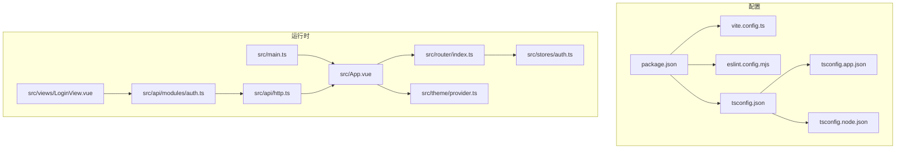

图表来源
- [vite.config.ts:1-44](file://web/vite.config.ts#L1-L44)
- [package.json:1-36](file://web/package.json#L1-L36)
- [tsconfig.json:1-12](file://web/tsconfig.json#L1-L12)
- [tsconfig.app.json:1-9](file://web/tsconfig.app.json#L1-L9)
- [tsconfig.node.json:1-20](file://web/tsconfig.node.json#L1-L20)
- [eslint.config.mjs:1-40](file://web/eslint.config.mjs#L1-L40)
- [src/main.ts:1-26](file://web/src/main.ts#L1-L26)
- [src/App.vue:1-45](file://web/src/App.vue#L1-L45)
- [src/router/index.ts:1-59](file://web/src/router/index.ts#L1-L59)
- [src/stores/auth.ts:1-52](file://web/src/stores/auth.ts#L1-L52)
- [src/api/http.ts:1-196](file://web/src/api/http.ts#L1-L196)
- [src/api/modules/auth.ts:1-157](file://web/src/api/modules/auth.ts#L1-L157)
- [src/views/LoginView.vue:1-157](file://web/src/views/LoginView.vue#L1-L157)
- [src/theme/provider.ts:1-97](file://web/src/theme/provider.ts#L1-L97)

章节来源
- [vite.config.ts:1-44](file://web/vite.config.ts#L1-L44)
- [package.json:1-36](file://web/package.json#L1-L36)
- [tsconfig.json:1-12](file://web/tsconfig.json#L1-L12)
- [tsconfig.app.json:1-9](file://web/tsconfig.app.json#L1-L9)
- [tsconfig.node.json:1-20](file://web/tsconfig.node.json#L1-L20)
- [eslint.config.mjs:1-40](file://web/eslint.config.mjs#L1-L40)
- [src/main.ts:1-26](file://web/src/main.ts#L1-L26)
- [src/App.vue:1-45](file://web/src/App.vue#L1-L45)
- [src/router/index.ts:1-59](file://web/src/router/index.ts#L1-L59)
- [src/stores/auth.ts:1-52](file://web/src/stores/auth.ts#L1-L52)
- [src/api/http.ts:1-196](file://web/src/api/http.ts#L1-L196)
- [src/api/modules/auth.ts:1-157](file://web/src/api/modules/auth.ts#L1-L157)
- [src/views/LoginView.vue:1-157](file://web/src/views/LoginView.vue#L1-L157)
- [src/theme/provider.ts:1-97](file://web/src/theme/provider.ts#L1-L97)

## 核心组件
- Vite 配置与开发服务器
  - 注册 Vue 插件，配置路径别名，支持动态端口与主机绑定，区分 dev 与 preview 端口解析逻辑。
  - 章节来源
    - [vite.config.ts:21-42](file://web/vite.config.ts#L21-L42)
- TypeScript 编译配置
  - 多 tsconfig 分层：根配置聚合子配置；应用编译选项扩展至 DOM 类型与 Vite 环境；Node 工具链配置启用 Bundler 解析与严格模式。
  - 章节来源
    - [tsconfig.json:1-12](file://web/tsconfig.json#L1-L12)
    - [tsconfig.app.json:1-9](file://web/tsconfig.app.json#L1-L9)
    - [tsconfig.node.json:1-20](file://web/tsconfig.node.json#L1-L20)
- ESLint 与类型检查
  - 使用 ESLint 与 TypeScript/ESLint/Vue Parser 组合，启用推荐规则集，忽略 dist 与 JS 类型声明文件，提供全局 DOM 与 URLSearchParams 等只读变量。
  - 章节来源
    - [eslint.config.mjs:1-40](file://web/eslint.config.mjs#L1-L40)
- 应用入口与运行时
  - 入口文件初始化 Vue、Pinia、Ant Design Vue、路由与样式，统一挂载。
  - 章节来源
    - [src/main.ts:1-26](file://web/src/main.ts#L1-L26)
- 路由与鉴权
  - 基于 History 模式的路由表，登录态守卫在进入非登录页且未登录时重定向至登录页，在登录页且已登录时重定向至仪表盘。
  - 章节来源
    - [src/router/index.ts:14-56](file://web/src/router/index.ts#L14-L56)
- 认证状态管理
  - 使用 Pinia Store 维护访问令牌与登录态，本地持久化键名固定，提供设置与清除方法。
  - 章节来源
    - [src/stores/auth.ts:15-50](file://web/src/stores/auth.ts#L15-L50)
- HTTP 客户端
  - Axios 封装统一请求层，自动注入 Authorization 头，处理 401 未授权跳转，按业务约定解包响应并抛错。
  - 章节来源
    - [src/api/http.ts:33-195](file://web/src/api/http.ts#L33-L195)
- 认证模块
  - 提供登录、注册、获取当前用户信息、头像上传预留等接口封装，统一调用 httpClient。
  - 章节来源
    - [src/api/modules/auth.ts:102-132](file://web/src/api/modules/auth.ts#L102-L132)
- 登录视图
  - 表单收集 QQ 与密码，提交后写入访问令牌并跳转仪表盘，异常提示统一使用消息组件。
  - 章节来源
    - [src/views/LoginView.vue:69-82](file://web/src/views/LoginView.vue#L69-L82)
- 主题 Provider
  - 基于 Ant Design Vue 主题算法，支持亮/暗模式切换与本地持久化，通过 dataset 传播主题到根元素。
  - 章节来源
    - [src/theme/provider.ts:53-96](file://web/src/theme/provider.ts#L53-L96)

## 架构总览
前端运行时架构围绕“入口 -> 路由守卫 -> 视图 -> 状态/主题 -> 网络”展开，HTTP 层对后端 API 进行统一封装，路由守卫保障登录态一致性。

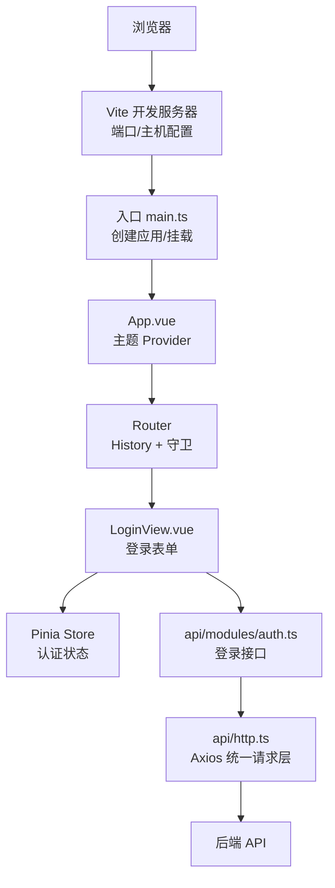

图表来源
- [src/main.ts:16-23](file://web/src/main.ts#L16-L23)
- [src/App.vue:19-28](file://web/src/App.vue#L19-L28)
- [src/router/index.ts:47-56](file://web/src/router/index.ts#L47-L56)
- [src/views/LoginView.vue:69-82](file://web/src/views/LoginView.vue#L69-L82)
- [src/stores/auth.ts:15-50](file://web/src/stores/auth.ts#L15-L50)
- [src/api/modules/auth.ts:102-109](file://web/src/api/modules/auth.ts#L102-L109)
- [src/api/http.ts:42-48](file://web/src/api/http.ts#L42-L48)

## 详细组件分析

### Vite 配置与开发服务器
- 端口解析与回退
  - 支持 FRONTEND_PORT 与 FRONTEND_PREVIEW_PORT 环境变量，非法或越界时回退到默认端口。
- 主机与别名
  - 支持 FRONTEND_HOST 自定义主机；@ 别名指向 src 目录。
- 插件与预览
  - 默认启用 @vitejs/plugin-vue；dev 与 preview 分离端口，便于本地联调。
- 章节来源
  - [vite.config.ts:8-42](file://web/vite.config.ts#L8-L42)

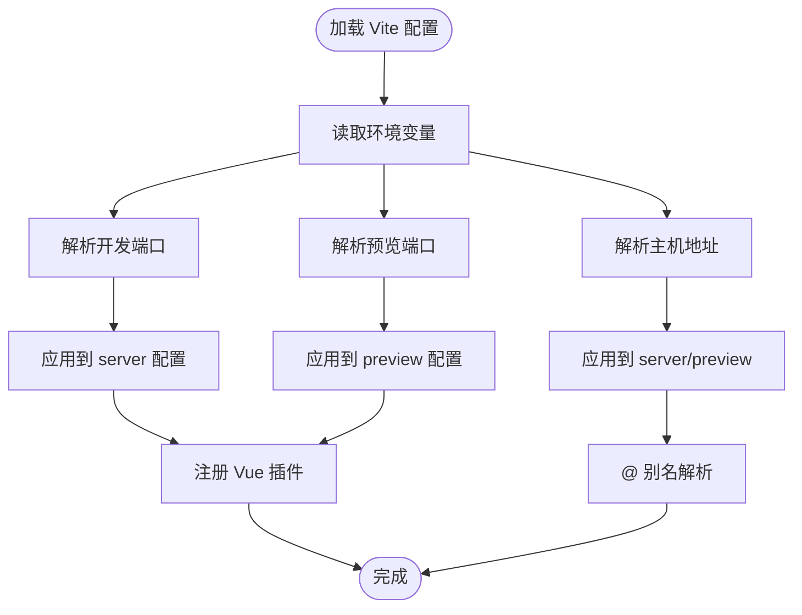

图表来源
- [vite.config.ts:21-42](file://web/vite.config.ts#L21-L42)

### TypeScript 编译配置
- 多配置分层
  - 根 tsconfig.json 通过 references 引入应用与 Node 两套配置，避免重复。
  - tsconfig.app.json 扩展 Node 配置，加入 DOM/Iterable 类型与 Vite client 类型，限定 src 下 TS/Vue 文件参与编译。
  - tsconfig.node.json 面向 Vite/TS 工具链，启用 ESNext/Bundler，严格模式与未使用项检查。
- 章节来源
  - [tsconfig.json:1-12](file://web/tsconfig.json#L1-L12)
  - [tsconfig.app.json:1-9](file://web/tsconfig.app.json#L1-L9)
  - [tsconfig.node.json:1-20](file://web/tsconfig.node.json#L1-L20)

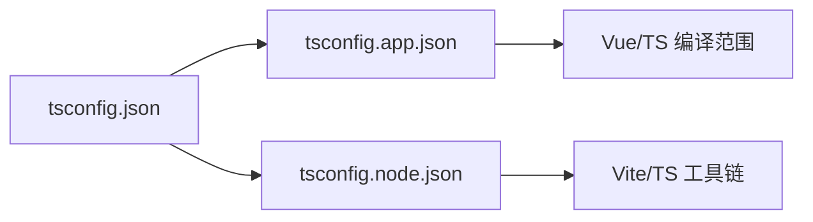

图表来源
- [tsconfig.json:3-10](file://web/tsconfig.json#L3-L10)
- [tsconfig.app.json:2-8](file://web/tsconfig.app.json#L2-L8)
- [tsconfig.node.json:2-18](file://web/tsconfig.node.json#L2-L18)

### ESLint 与代码规范
- 规则与插件
  - 使用 @typescript-eslint 与 eslint-plugin-vue，启用推荐规则集；关闭多词组件名强制与显式 any。
- 语言选项
  - Vue 解析器与 TypeScript 解析器组合，支持 .vue 文件，指定最新 ECMAScript 版本与模块源类型。
- 忽略规则
  - 忽略 dist、node_modules、.d.ts 与 .js 文件，减少噪声。
- 章节来源
  - [eslint.config.mjs:7-39](file://web/eslint.config.mjs#L7-L39)

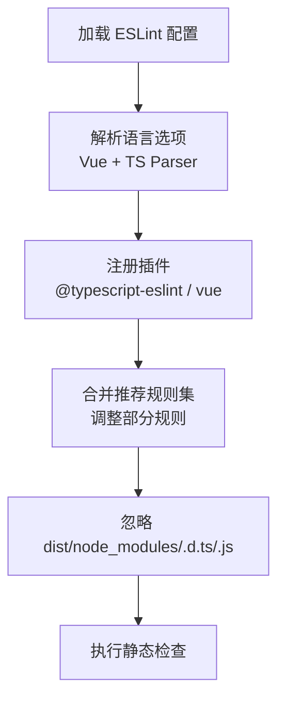

图表来源
- [eslint.config.mjs:10-39](file://web/eslint.config.mjs#L10-L39)

### 应用入口与运行时
- 初始化流程
  - 创建 Vue 应用，注册 Pinia、Router、Antd，并挂载到 #app。
- 章节来源
  - [src/main.ts:16-23](file://web/src/main.ts#L16-L23)

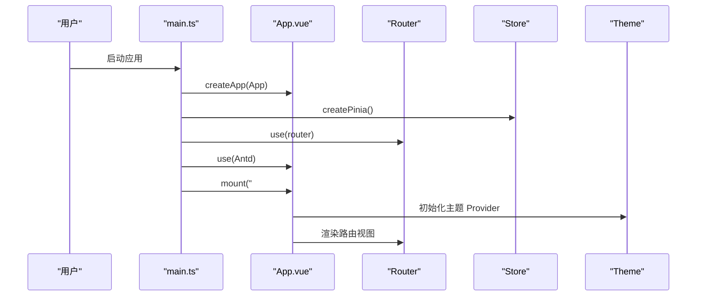

图表来源
- [src/main.ts:16-23](file://web/src/main.ts#L16-L23)
- [src/App.vue:19-28](file://web/src/App.vue#L19-L28)
- [src/router/index.ts:39-42](file://web/src/router/index.ts#L39-L42)
- [src/theme/provider.ts:53-96](file://web/src/theme/provider.ts#L53-L96)

### 路由与登录态守卫
- 路由表
  - 根路径重定向至仪表盘；登录页与仪表盘懒加载视图；文件传输测试页。
- 守卫逻辑
  - 非登录页且未登录：重定向 /login；登录页且已登录：重定向 /dashboard。
- 章节来源
  - [src/router/index.ts:14-56](file://web/src/router/index.ts#L14-L56)

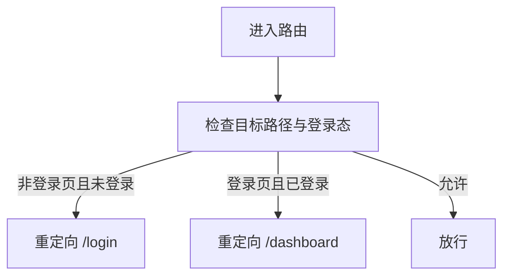

图表来源
- [src/router/index.ts:47-56](file://web/src/router/index.ts#L47-L56)

### 认证状态管理
- 数据模型
  - 访问令牌 ref + 登录态 computed；本地持久化键名固定。
- 方法
  - setAccessToken：写入本地存储；clearAccessToken：移除本地存储。
- 章节来源
  - [src/stores/auth.ts:15-50](file://web/src/stores/auth.ts#L15-L50)

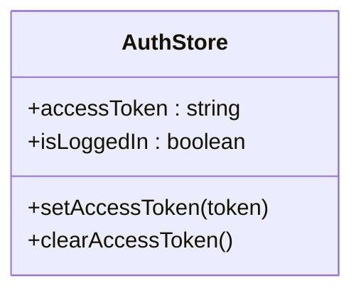

图表来源
- [src/stores/auth.ts:15-50](file://web/src/stores/auth.ts#L15-L50)

### HTTP 客户端与错误处理
- 基础配置
  - 自动注入 baseURL（优先 import.meta.env.VITE_API_BASE_URL，否则回退）与超时时间。
- 拦截器
  - 请求：若存在访问令牌，设置 Authorization 头。
  - 响应：标准化错误消息；401 时清理本地令牌并跳转登录。
- 请求方法
  - get/post/put/patch/delete 包装统一 request，按 code 字段判断业务成功与否。
- 章节来源
  - [src/api/http.ts:20-195](file://web/src/api/http.ts#L20-L195)

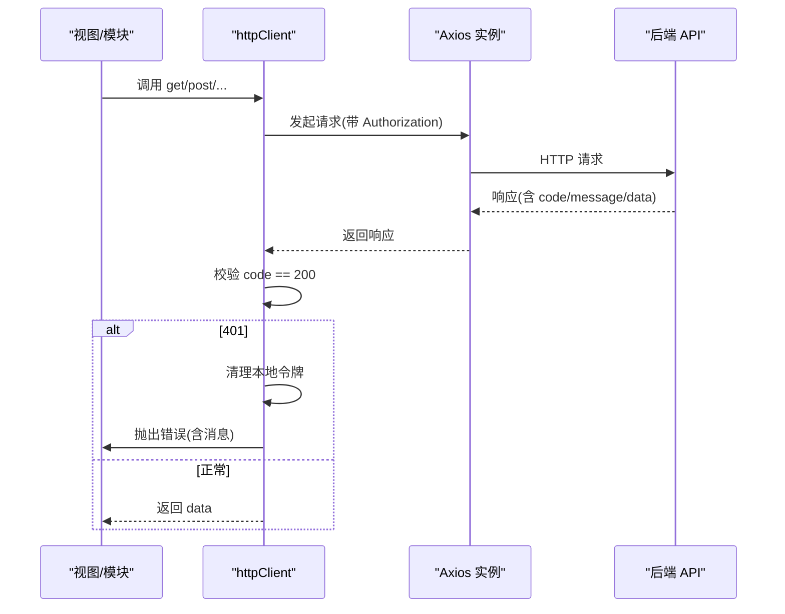

图表来源
- [src/api/http.ts:42-112](file://web/src/api/http.ts#L42-L112)

### 认证模块与登录视图
- 登录流程
  - LoginView.vue 收集表单，调用 api/modules/auth.ts 的 loginUser，成功后写入访问令牌并跳转仪表盘。
- 章节来源
  - [src/views/LoginView.vue:69-82](file://web/src/views/LoginView.vue#L69-L82)
  - [src/api/modules/auth.ts:102-109](file://web/src/api/modules/auth.ts#L102-L109)

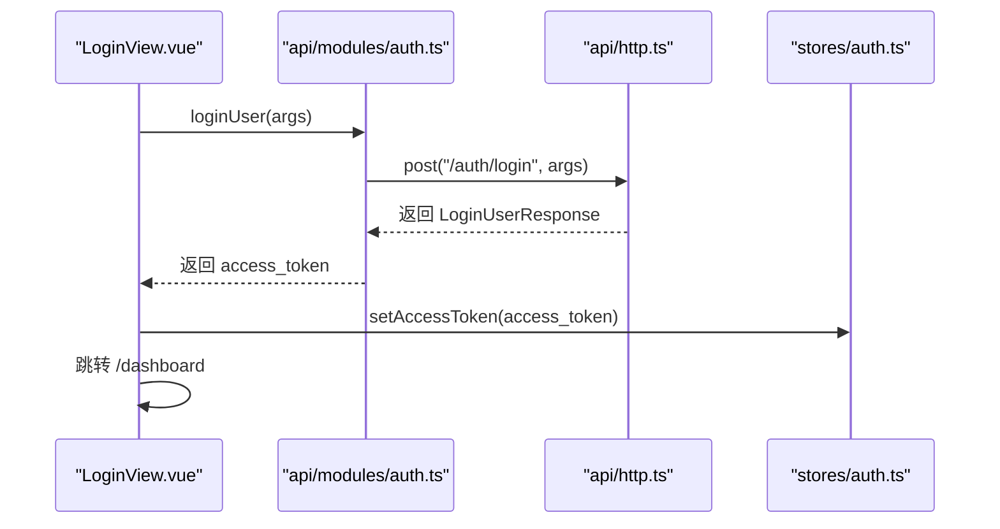

图表来源
- [src/views/LoginView.vue:69-82](file://web/src/views/LoginView.vue#L69-L82)
- [src/api/modules/auth.ts:102-109](file://web/src/api/modules/auth.ts#L102-L109)
- [src/api/http.ts:102-112](file://web/src/api/http.ts#L102-L112)
- [src/stores/auth.ts:31-35](file://web/src/stores/auth.ts#L31-L35)

### 主题 Provider
- 功能
  - 读取本地缓存或系统偏好决定初始主题；计算 Ant Design Vue 主题配置；监听变更写回本地存储并设置 documentElement.dataset.theme。
- 章节来源
  - [src/theme/provider.ts:39-96](file://web/src/theme/provider.ts#L39-L96)

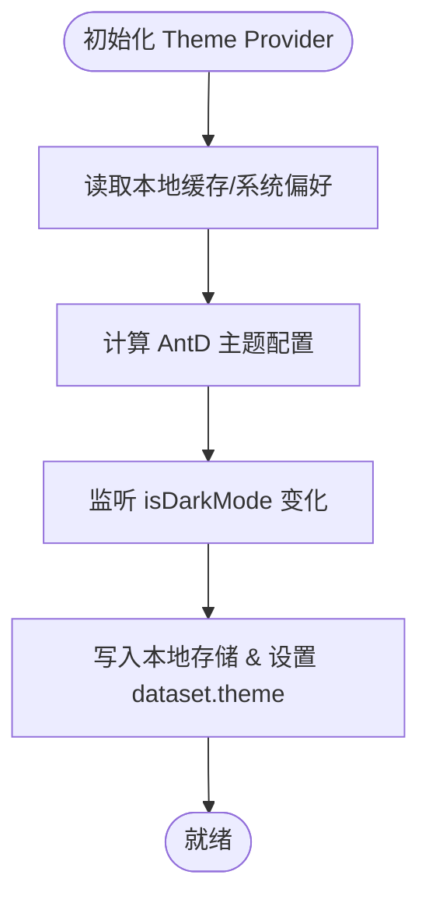

图表来源
- [src/theme/provider.ts:39-96](file://web/src/theme/provider.ts#L39-L96)

## 依赖关系分析
- 构建脚本与工具链
  - dev/build/preview/lint/type-check 串联 Vite、ESLint、Vue 类型检查。
- TypeScript 配置耦合
  - tsconfig.json 聚合 tsconfig.app.json 与 tsconfig.node.json，避免重复。
- 运行时依赖
  - Vue 生态与 Ant Design Vue 组件库；Axios 作为 HTTP 客户端；Pinia/Pinia Router 作为状态与路由管理。
- 章节来源
  - [package.json:6-11](file://web/package.json#L6-L11)
  - [tsconfig.json:3-10](file://web/tsconfig.json#L3-L10)

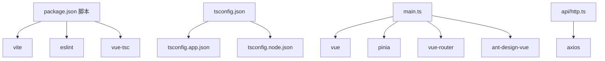

图表来源
- [package.json:6-11](file://web/package.json#L6-L11)
- [tsconfig.json:3-10](file://web/tsconfig.json#L3-L10)
- [src/main.ts:4-10](file://web/src/main.ts#L4-L10)
- [src/api/http.ts:4-11](file://web/src/api/http.ts#L4-L11)

## 性能考量
- 代码分割与懒加载
  - 路由级异步组件（如登录页与仪表盘）天然支持代码分割，建议继续沿用以降低首屏体积。
  - 章节来源
    - [src/router/index.ts:20-33](file://web/src/router/index.ts#L20-L33)
- Tree Shaking
  - 使用 ES Module 导入导出，避免副作用；第三方库按需引入（如 Ant Design Vue 图标），减少打包体积。
  - 章节来源
    - [package.json:13-20](file://web/package.json#L13-L20)
- 打包优化建议
  - 在生产构建中开启压缩与资源内联策略；对静态资源进行指纹化；合理拆分 vendor chunk。
  - 章节来源
    - [vite.config.ts:27-42](file://web/vite.config.ts#L27-L42)
- 构建产物分析
  - 使用 Vite 内置分析工具或第三方可视化工具查看包体构成，定位大体积依赖与重复模块。
- 性能基准测试
  - 使用浏览器性能面板记录首次内容绘制（FCP）、最大内容绘制（LCP）、交互时间（INP）等指标，结合真实网络环境评估。

## 故障排查指南
- 端口占用与主机绑定
  - 若开发端口被占用或越界，检查 FRONTEND_PORT 并确认回退逻辑生效；确认 FRONTEND_HOST 是否正确映射。
  - 章节来源
    - [vite.config.ts:8-25](file://web/vite.config.ts#L8-L25)
- 环境变量未生效
  - 确认 import.meta.env.VITE_API_BASE_URL 已在运行时注入；若为空则回落到默认路径。
  - 章节来源
    - [src/env.d.ts:6-8](file://web/src/env.d.ts#L6-L8)
    - [src/api/http.ts:20-27](file://web/src/api/http.ts#L20-L27)
- 401 未授权跳转循环
  - 检查本地存储 access_token 是否被清理；确认路由守卫逻辑与登录页路径一致。
  - 章节来源
    - [src/api/http.ts:89-96](file://web/src/api/http.ts#L89-L96)
    - [src/router/index.ts:47-56](file://web/src/router/index.ts#L47-L56)
- ESLint 报错
  - 检查文件是否被忽略；确认 Vue/TS 解析器版本与规则集匹配；必要时临时放宽规则定位问题。
  - 章节来源
    - [eslint.config.mjs:8-39](file://web/eslint.config.mjs#L8-L39)
- TypeScript 类型错误
  - 使用 vue-tsc --noEmit -p tsconfig.app.json 进行类型检查；核对 tsconfig.app.json 的 include 与 lib 配置。
  - 章节来源
    - [package.json:9-10](file://web/package.json#L9-L10)
    - [tsconfig.app.json:3-6](file://web/tsconfig.app.json#L3-L6)

## 结论
本前端工作流以 Vite 为核心，配合 TypeScript、ESLint、Vue 3 生态与 Axios 统一网络层，形成清晰的开发与构建闭环。通过路由守卫与 Pinia Store 保障登录态一致性，通过主题 Provider 提升用户体验。建议在现有基础上完善 CI/CD 流水线与性能监控，持续提升交付质量与稳定性。

## 附录
- 开发调试技巧
  - 浏览器调试：利用性能面板、网络面板与元素检查定位问题；结合 Vue DevTools 查看组件树与状态。
  - 网络请求监控：关注请求头 Authorization、响应体 code 与 message；对 401 场景进行断点调试。
- 版本控制与分支管理
  - 建议采用功能分支开发，主分支仅接受通过 CI 的 PR；使用语义化提交信息与变更日志。
- 持续集成与部署
  - 在 CI 中执行 lint、type-check、单元测试与构建；将构建产物部署至静态托管或反向代理；配置健康检查与回滚策略。