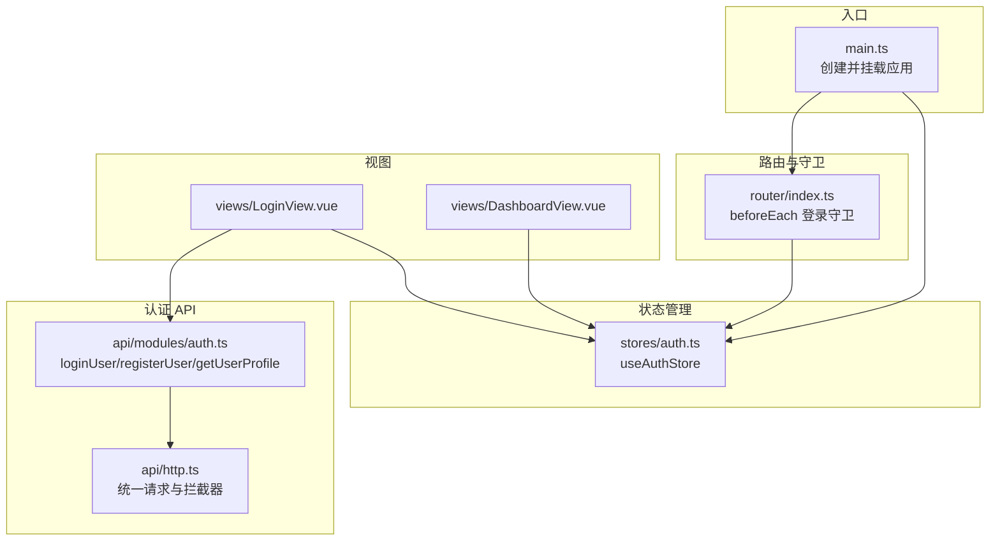
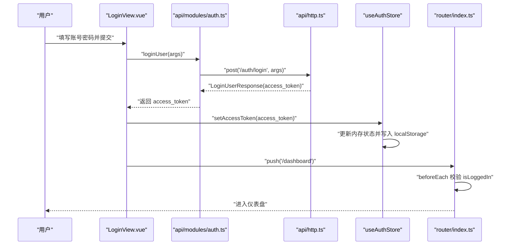
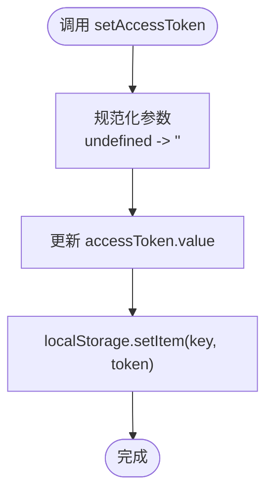
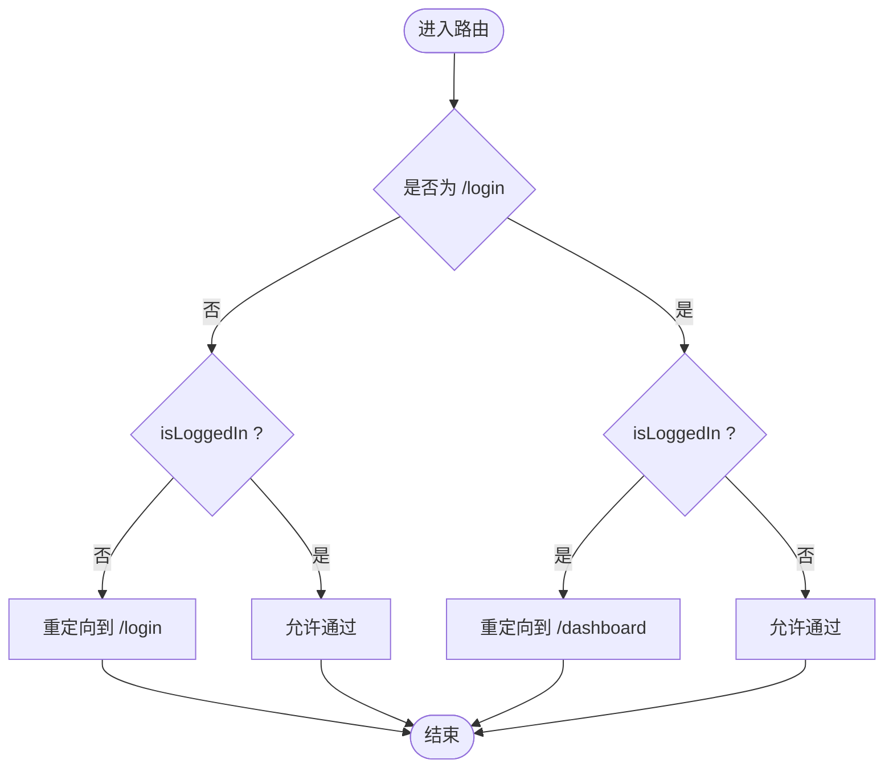
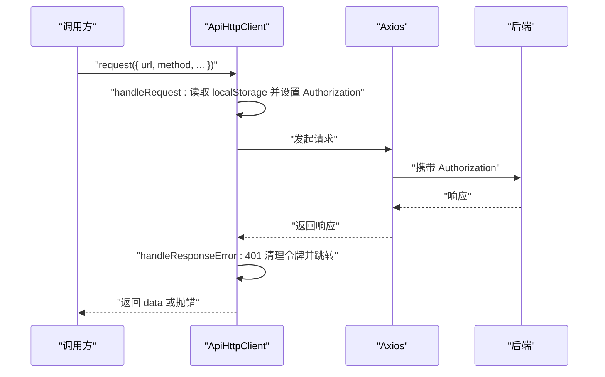
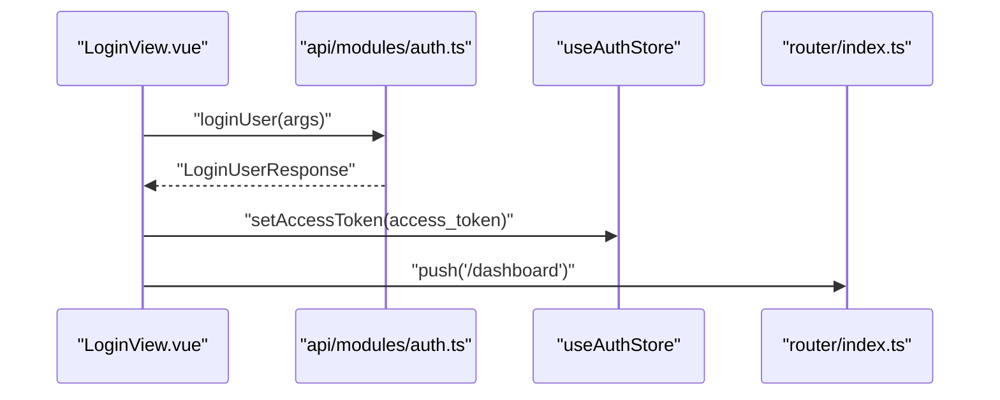
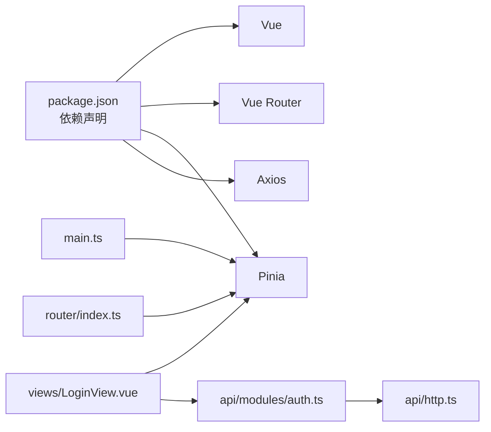

# 状态管理

<cite>
**本文引用的文件**
- [web/src/stores/auth.ts](file://web/src/stores/auth.ts)
- [web/src/main.ts](file://web/src/main.ts)
- [web/src/router/index.ts](file://web/src/router/index.ts)
- [web/src/api/http.ts](file://web/src/api/http.ts)
- [web/src/api/modules/auth.ts](file://web/src/api/modules/auth.ts)
- [web/src/views/LoginView.vue](file://web/src/views/LoginView.vue)
- [web/src/views/DashboardView.vue](file://web/src/views/DashboardView.vue)
- [web/src/types/domain.ts](file://web/src/types/domain.ts)
- [web/src/types/common.ts](file://web/src/types/common.ts)
- [web/package.json](file://web/package.json)
- [web/vite.config.ts](file://web/vite.config.ts)
- [web/tsconfig.app.json](file://web/tsconfig.app.json)
</cite>

## 目录
1. [引言](#引言)
2. [项目结构](#项目结构)
3. [核心组件](#核心组件)
4. [架构总览](#架构总览)
5. [详细组件分析](#详细组件分析)
6. [依赖分析](#依赖分析)
7. [性能考虑](#性能考虑)
8. [故障排查指南](#故障排查指南)
9. [结论](#结论)
10. [附录](#附录)

## 引言
本文件系统性梳理 Poprako 前端基于 Pinia 的状态管理实现，重点覆盖以下方面：
- Pinia 集成与入口初始化
- 认证状态管理设计（登录态、令牌、会话）
- store 模式最佳实践（状态、actions、getters）
- 状态持久化策略与同步机制
- 全局状态与局部状态的区分原则
- 类型安全的状态管理（TypeScript 接口与类型推断）
- 状态调试与性能优化建议

## 项目结构
前端采用模块化组织，状态管理集中在 stores 目录，认证相关 API 在 api/modules 下，路由守卫在 router 中，入口在 main.ts 初始化 Pinia 并挂载应用。

**图表来源**
- [web/src/main.ts:16-23](file://web/src/main.ts#L16-L23)
- [web/src/stores/auth.ts:15-51](file://web/src/stores/auth.ts#L15-L51)
- [web/src/router/index.ts:47-56](file://web/src/router/index.ts#L47-L56)
- [web/src/api/modules/auth.ts:102-132](file://web/src/api/modules/auth.ts#L102-L132)
- [web/src/api/http.ts:33-195](file://web/src/api/http.ts#L33-L195)
- [web/src/views/LoginView.vue:50-82](file://web/src/views/LoginView.vue#L50-L82)
- [web/src/views/DashboardView.vue:97-282](file://web/src/views/DashboardView.vue#L97-L282)

**章节来源**
- [web/src/main.ts:16-23](file://web/src/main.ts#L16-L23)
- [web/src/router/index.ts:14-56](file://web/src/router/index.ts#L14-L56)
- [web/src/stores/auth.ts:15-51](file://web/src/stores/auth.ts#L15-L51)
- [web/src/api/modules/auth.ts:102-132](file://web/src/api/modules/auth.ts#L102-L132)
- [web/src/api/http.ts:33-195](file://web/src/api/http.ts#L33-L195)

## 核心组件
- 认证 Store（useAuthStore）：集中管理访问令牌与登录态，提供设置与清空令牌的方法，并与本地存储进行同步。
- 路由守卫：在导航前检查登录态，未登录则强制跳转至登录页，已登录访问登录页则跳转至仪表盘。
- 统一请求层：在请求拦截器中自动附加 Bearer Token，在 401 时清理本地令牌并跳转登录页。
- 视图层交互：登录页调用认证 API 并写入令牌；仪表盘页在退出登录时清空令牌并跳转。

**章节来源**
- [web/src/stores/auth.ts:15-51](file://web/src/stores/auth.ts#L15-L51)
- [web/src/router/index.ts:47-56](file://web/src/router/index.ts#L47-L56)
- [web/src/api/http.ts:66-97](file://web/src/api/http.ts#L66-L97)
- [web/src/views/LoginView.vue:69-82](file://web/src/views/LoginView.vue#L69-L82)
- [web/src/views/DashboardView.vue:245-248](file://web/src/views/DashboardView.vue#L245-L248)

## 架构总览
下面以序列图展示登录流程与状态流转：

**图表来源**
- [web/src/views/LoginView.vue:69-82](file://web/src/views/LoginView.vue#L69-L82)
- [web/src/api/modules/auth.ts:102-109](file://web/src/api/modules/auth.ts#L102-L109)
- [web/src/api/http.ts:102-112](file://web/src/api/http.ts#L102-L112)
- [web/src/stores/auth.ts:31-35](file://web/src/stores/auth.ts#L31-L35)
- [web/src/router/index.ts:47-56](file://web/src/router/index.ts#L47-L56)

## 详细组件分析

### 认证 Store（useAuthStore）
- 状态定义
  - accessToken：当前访问令牌，来源于本地存储初始化。
  - isLoggedIn：基于 accessToken 长度计算的只读登录态。
- Actions
  - setAccessToken：规范化输入后更新内存状态并同步到本地存储。
  - clearAccessToken：清空内存状态并移除本地存储项。
- 设计要点
  - 使用 ref 与 computed 组合，确保响应式与派生状态一致性。
  - 本地存储键名常量化，便于统一管理。
  - 返回值包含状态与方法，便于在组件中直接解构使用。

**图表来源**
- [web/src/stores/auth.ts:31-35](file://web/src/stores/auth.ts#L31-L35)

**章节来源**
- [web/src/stores/auth.ts:15-51](file://web/src/stores/auth.ts#L15-L51)

### 路由守卫与登录态控制
- beforeEach 校验逻辑
  - 若目标非“/login”且未登录，则重定向到“/login”。
  - 若目标是“/login”且已登录，则重定向到“/dashboard”。
- 与 Store 的耦合
  - 守卫直接依赖 useAuthStore 的 isLoggedIn，实现声明式登录态保护。

**图表来源**
- [web/src/router/index.ts:47-56](file://web/src/router/index.ts#L47-L56)
- [web/src/stores/auth.ts:26](file://web/src/stores/auth.ts#L26)

**章节来源**
- [web/src/router/index.ts:47-56](file://web/src/router/index.ts#L47-L56)
- [web/src/stores/auth.ts:26](file://web/src/stores/auth.ts#L26)

### 统一请求层与鉴权拦截
- 请求拦截
  - 从 localStorage 读取 access_token 并设置 Authorization: Bearer 头。
- 响应拦截
  - 对 401 统一处理：清除本地令牌并跳转登录页。
- 类型与错误
  - 通过 ApiResponseEnvelope 校验 code 字段，非 200 抛错。
  - 统一错误结构 ApiErrorPayload，便于前端展示与日志。

**图表来源**
- [web/src/api/http.ts:66-97](file://web/src/api/http.ts#L66-L97)
- [web/src/api/http.ts:102-112](file://web/src/api/http.ts#L102-L112)

**章节来源**
- [web/src/api/http.ts:33-195](file://web/src/api/http.ts#L33-L195)

### 登录视图与状态联动
- 表单模型与提交
  - 使用 reactive 定义表单，handleSubmit 调用 loginUser 并接收 access_token。
- 写入状态与导航
  - 调用 authStore.setAccessToken 并跳转仪表盘。
- 错误处理
  - 统一捕获异常并提示，finally 中恢复提交状态。

**图表来源**
- [web/src/views/LoginView.vue:69-82](file://web/src/views/LoginView.vue#L69-L82)
- [web/src/api/modules/auth.ts:102-109](file://web/src/api/modules/auth.ts#L102-L109)
- [web/src/stores/auth.ts:31-35](file://web/src/stores/auth.ts#L31-L35)

**章节来源**
- [web/src/views/LoginView.vue:50-82](file://web/src/views/LoginView.vue#L50-L82)
- [web/src/api/modules/auth.ts:102-109](file://web/src/api/modules/auth.ts#L102-L109)

### 仪表盘视图与登出
- 数据刷新
  - onMounted 与 refreshAllData 并行拉取团队与分配数据。
- 登出流程
  - 调用 authStore.clearAccessToken 并跳转登录页。

**章节来源**
- [web/src/views/DashboardView.vue:97-282](file://web/src/views/DashboardView.vue#L97-L282)

### 类型安全与领域模型
- 领域类型
  - UserInfo、TeamInfo、WorksetInfo、ComicInfo、ChapterInfo、AssignmentInfo。
- API 类型
  - Login/Regist 参数与响应类型，头像预留上传类型等。
- 通用类型
  - PaginationQuery、IncludeQuery、ApiErrorPayload。

**章节来源**
- [web/src/types/domain.ts:7-88](file://web/src/types/domain.ts#L7-L88)
- [web/src/types/common.ts:7-40](file://web/src/types/common.ts#L7-L40)
- [web/src/api/modules/auth.ts:10-156](file://web/src/api/modules/auth.ts#L10-L156)

## 依赖分析
- 框架与库
  - Vue 3、Vue Router、Pinia、Axios。
- 构建与类型
  - Vite、TypeScript、vue-tsc。
- 关键依赖关系
  - main.ts 依赖 Pinia 并注入应用。
  - router/index.ts 依赖 useAuthStore 实现守卫。
  - LoginView.vue 依赖 useAuthStore 与认证 API。
  - api/http.ts 为所有 API 请求提供统一拦截与错误处理。

**图表来源**
- [web/package.json:13-34](file://web/package.json#L13-L34)
- [web/src/main.ts:17-19](file://web/src/main.ts#L17-L19)
- [web/src/router/index.ts:8](file://web/src/router/index.ts#L8)
- [web/src/views/LoginView.vue:54-55](file://web/src/views/LoginView.vue#L54-L55)
- [web/src/api/modules/auth.ts:4](file://web/src/api/modules/auth.ts#L4)
- [web/src/api/http.ts:11](file://web/src/api/http.ts#L11)

**章节来源**
- [web/package.json:13-34](file://web/package.json#L13-L34)
- [web/src/main.ts:17-19](file://web/src/main.ts#L17-L19)
- [web/src/router/index.ts:8](file://web/src/router/index.ts#L8)
- [web/src/views/LoginView.vue:54-55](file://web/src/views/LoginView.vue#L54-L55)
- [web/src/api/modules/auth.ts:4](file://web/src/api/modules/auth.ts#L4)
- [web/src/api/http.ts:11](file://web/src/api/http.ts#L11)

## 性能考虑
- 响应式粒度
  - 将登录态作为 computed，避免不必要的重渲染。
- 并行数据加载
  - 仪表盘使用 Promise.all 并行拉取多源数据，减少首屏等待。
- 本地存储同步
  - Store 写入与本地存储同步，避免重复 IO。
- 请求拦截
  - 自动注入 Authorization，减少重复设置与错误。
- 类型检查
  - 通过 tsconfig 与 vue-tsc 提前发现类型问题，降低运行时开销。

[本节为通用指导，不直接分析具体文件，故无“章节来源”]

## 故障排查指南
- 登录后仍被重定向到登录页
  - 检查登录 API 是否正确返回 access_token。
  - 确认 setAccessToken 已被调用且 localStorage 正确写入。
  - 核对路由守卫逻辑与 isLoggedIn 计算。
- 401 未触发自动跳转
  - 检查请求拦截器是否设置 Authorization。
  - 确认响应拦截器对 401 的处理逻辑。
- 令牌丢失导致频繁跳转
  - 确保在 401 时清理本地令牌并跳转登录页。
- 类型报错
  - 使用 tsconfig.app.json 与 vue-tsc 进行类型检查。
  - 确认领域类型与 API 返回结构一致。

**章节来源**
- [web/src/api/http.ts:66-97](file://web/src/api/http.ts#L66-L97)
- [web/src/stores/auth.ts:31-43](file://web/src/stores/auth.ts#L31-L43)
- [web/src/router/index.ts:47-56](file://web/src/router/index.ts#L47-L56)
- [web/tsconfig.app.json:3-6](file://web/tsconfig.app.json#L3-L6)

## 结论
Poprako 前端采用 Pinia 管理认证状态，结合路由守卫与统一请求层，实现了简洁可靠的登录态控制。通过类型安全的接口与清晰的模块划分，提升了可维护性与可扩展性。后续可在以下方向持续优化：
- 引入 Pinia 持久化插件以增强跨会话状态恢复能力。
- 在 Store 中增加权限与用户资料的派生状态，减少组件重复计算。
- 为 Store 添加调试工具配置（如 devtools），提升可观测性。
- 对高频更新的状态进行细粒度拆分，降低无关重渲染。

[本节为总结性内容，不直接分析具体文件，故无“章节来源”]

## 附录

### store 模式最佳实践清单
- 状态定义
  - 将派生状态放入 computed，避免冗余状态。
  - 将外部持久化介质（如 localStorage）纳入 Store 的职责边界。
- actions
  - 规范化输入（如空值处理），保证幂等性。
  - 同步更新内存状态与持久化介质。
- getters
  - 将复杂计算封装为 getters，便于复用与测试。
- 全局 vs 局部
  - 全局状态用于跨组件共享（如认证令牌），局部状态用于组件内部 UI 状态。
- 类型安全
  - 为每个 API 响应定义明确接口，配合类型推断减少运行时风险。
- 性能
  - 合理拆分 Store，避免大而全的单一 Store。
  - 使用 computed 与批量更新策略，减少不必要渲染。

[本节为通用指导，不直接分析具体文件，故无“章节来源”]