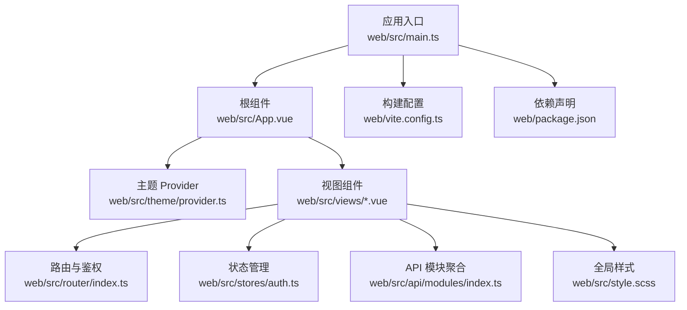
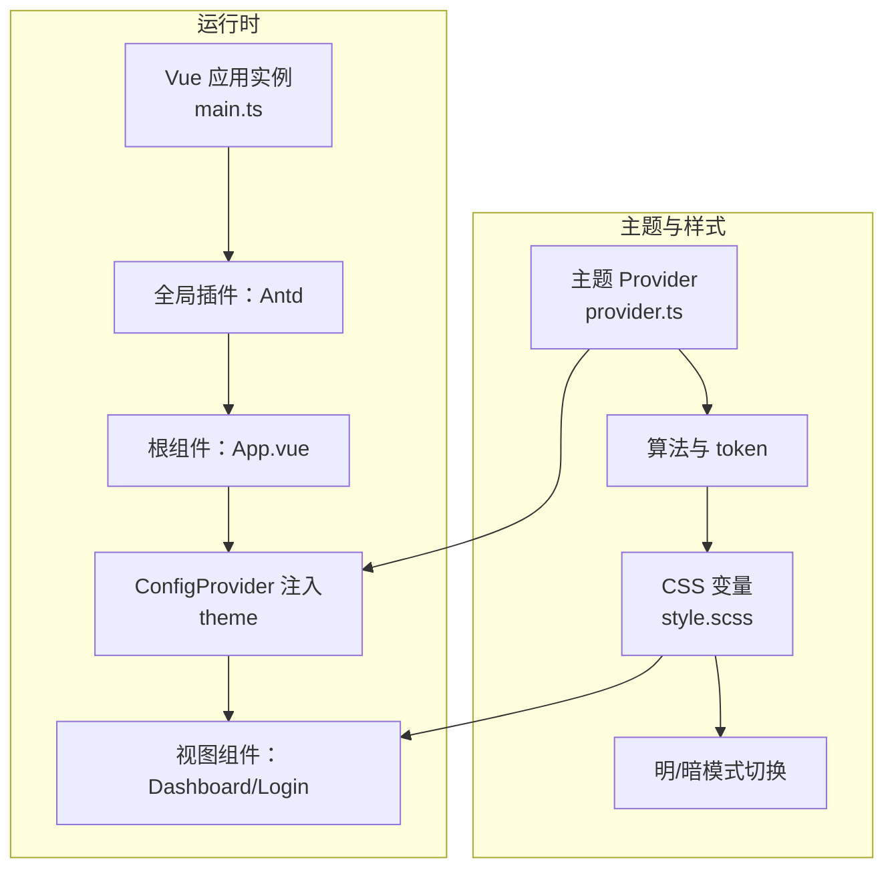
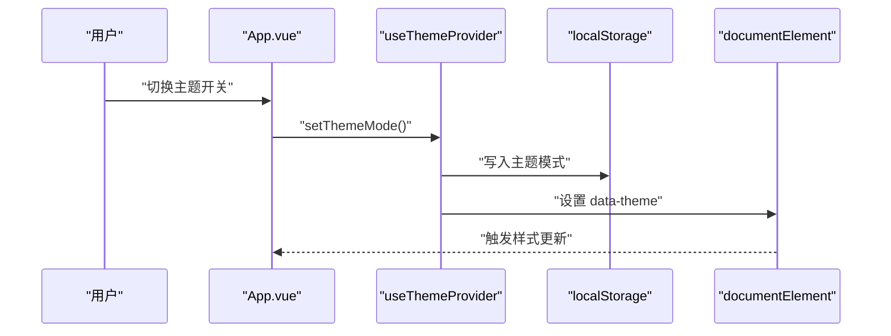
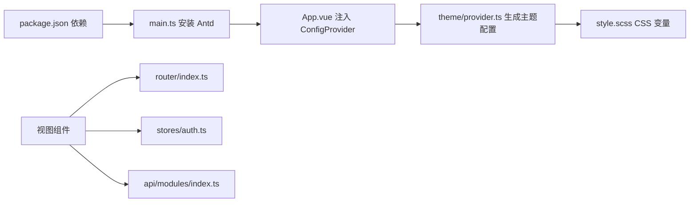

# UI 组件库集成

<cite>
**本文引用的文件**
- [web/package.json](file://web/package.json)
- [web/src/main.ts](file://web/src/main.ts)
- [web/src/theme/provider.ts](file://web/src/theme/provider.ts)
- [web/vite.config.ts](file://web/vite.config.ts)
- [web/src/App.vue](file://web/src/App.vue)
- [web/src/style.scss](file://web/src/style.scss)
- [web/src/views/DashboardView.vue](file://web/src/views/DashboardView.vue)
- [web/src/views/LoginView.vue](file://web/src/views/LoginView.vue)
- [web/src/router/index.ts](file://web/src/router/index.ts)
- [web/src/stores/auth.ts](file://web/src/stores/auth.ts)
- [web/src/api/modules/index.ts](file://web/src/api/modules/index.ts)
- [web/src/types/common.ts](file://web/src/types/common.ts)
</cite>

## 目录
1. [简介](#简介)
2. [项目结构](#项目结构)
3. [核心组件](#核心组件)
4. [架构总览](#架构总览)
5. [详细组件分析](#详细组件分析)
6. [依赖关系分析](#依赖关系分析)
7. [性能考虑](#性能考虑)
8. [故障排查指南](#故障排查指南)
9. [结论](#结论)
10. [附录](#附录)

## 简介
本文件面向 Poprako 前端工程中 Ant Design Vue 4.2.6 的集成与使用，围绕以下目标展开：
- 安装与依赖管理、版本兼容性说明
- 主题 Provider 的配置与使用，包括颜色系统、字体与断点
- 全局组件注册与按需导入策略
- 常用组件（Button、Form、Table、Modal 等）的基础用法与最佳实践
- 样式覆盖与 CSS 变量体系
- 国际化与本地化支持现状与建议
- 性能优化与懒加载策略

## 项目结构
前端工程位于 web 子目录，采用 Vite + Vue 3 + TypeScript 技术栈，Ant Design Vue 作为主要 UI 组件库。关键文件职责如下：
- 依赖与脚本：web/package.json
- 应用入口：web/src/main.ts
- 主题 Provider：web/src/theme/provider.ts
- 根组件与主题注入：web/src/App.vue
- 全局样式与 CSS 变量：web/src/style.scss
- 路由与鉴权：web/src/router/index.ts、web/src/stores/auth.ts
- 视图示例：web/src/views/DashboardView.vue、web/src/views/LoginView.vue
- API 模块聚合：web/src/api/modules/index.ts
- 通用类型：web/src/types/common.ts

**图表来源**
- [web/src/main.ts:1-26](file://web/src/main.ts#L1-L26)
- [web/src/App.vue:1-45](file://web/src/App.vue#L1-L45)
- [web/src/theme/provider.ts:1-97](file://web/src/theme/provider.ts#L1-L97)
- [web/src/router/index.ts:1-59](file://web/src/router/index.ts#L1-L59)
- [web/src/stores/auth.ts:1-52](file://web/src/stores/auth.ts#L1-L52)
- [web/src/api/modules/index.ts:1-10](file://web/src/api/modules/index.ts#L1-L10)
- [web/src/style.scss:1-147](file://web/src/style.scss#L1-L147)
- [web/vite.config.ts:1-44](file://web/vite.config.ts#L1-L44)
- [web/package.json:1-36](file://web/package.json#L1-L36)

**章节来源**
- [web/src/main.ts:1-26](file://web/src/main.ts#L1-L26)
- [web/src/App.vue:1-45](file://web/src/App.vue#L1-L45)
- [web/src/theme/provider.ts:1-97](file://web/src/theme/provider.ts#L1-L97)
- [web/src/style.scss:1-147](file://web/src/style.scss#L1-L147)
- [web/vite.config.ts:1-44](file://web/vite.config.ts#L1-L44)
- [web/package.json:1-36](file://web/package.json#L1-L36)

## 核心组件
- 应用入口与全局注入
  - 在应用入口完成 Vue、Pinia、路由与 Antd 的安装与挂载，Antd 以全局插件方式注入，便于全站使用。
  - 参考路径：[web/src/main.ts:16-23](file://web/src/main.ts#L16-L23)
- 主题 Provider
  - 提供亮/暗模式切换、算法选择与主题 token 配置，同时持久化用户偏好并写入 HTML 属性以驱动 CSS 变量。
  - 参考路径：[web/src/theme/provider.ts:53-96](file://web/src/theme/provider.ts#L53-L96)
- 根组件与主题注入
  - 根组件通过 ConfigProvider 注入主题配置，实现全局生效。
  - 参考路径：[web/src/App.vue:2](file://web/src/App.vue#L2)
- 全局样式与 CSS 变量
  - 使用 Sass 定义品牌色与明暗主题 token，并通过 CSS 变量在 :root 与 html[data-theme="dark"] 下切换。
  - 参考路径：[web/src/style.scss:1-147](file://web/src/style.scss#L1-L147)

**章节来源**
- [web/src/main.ts:16-23](file://web/src/main.ts#L16-L23)
- [web/src/theme/provider.ts:53-96](file://web/src/theme/provider.ts#L53-L96)
- [web/src/App.vue:2](file://web/src/App.vue#L2)
- [web/src/style.scss:1-147](file://web/src/style.scss#L1-L147)

## 架构总览
Ant Design Vue 在本项目中的集成遵循“全局安装 + 主题 Provider + 根组件注入”的模式，配合全局样式与 CSS 变量实现明暗主题切换与品牌风格统一。

**图表来源**
- [web/src/main.ts:6-21](file://web/src/main.ts#L6-L21)
- [web/src/App.vue:2](file://web/src/App.vue#L2)
- [web/src/theme/provider.ts:56-64](file://web/src/theme/provider.ts#L56-L64)
- [web/src/style.scss:56-113](file://web/src/style.scss#L56-L113)

## 详细组件分析

### 安装与依赖管理
- 依赖声明
  - Ant Design Vue 4.2.6、@ant-design/icons-vue、Vue 3、Pinia、Vue Router 等。
  - 参考路径：[web/package.json:13-20](file://web/package.json#L13-L20)
- 版本兼容性
  - Vue 3 与 Antd 4.x 生态匹配良好；图标库与组件库版本需保持兼容。
  - 参考路径：[web/package.json:14-15](file://web/package.json#L14-L15)
- 构建与路径别名
  - Vite 配置启用 Vue 插件与路径别名，便于模块化开发。
  - 参考路径：[web/vite.config.ts:21-33](file://web/vite.config.ts#L21-L33)

**章节来源**
- [web/package.json:13-20](file://web/package.json#L13-L20)
- [web/package.json:14-15](file://web/package.json#L14-L15)
- [web/vite.config.ts:21-33](file://web/vite.config.ts#L21-L33)

### 主题 Provider 配置
- 主题模式与算法
  - 通过算法选择亮/暗模式，token 中设置主色与圆角等。
  - 参考路径：[web/src/theme/provider.ts:56-64](file://web/src/theme/provider.ts#L56-L64)
- 持久化与 DOM 属性
  - 使用 localStorage 记忆用户偏好，同时设置 html[data-theme="..."] 以驱动 CSS 变量。
  - 参考路径：[web/src/theme/provider.ts:80-88](file://web/src/theme/provider.ts#L80-L88)
- 根组件注入
  - 根组件通过 ConfigProvider 接收主题配置，实现全局生效。
  - 参考路径：[web/src/App.vue:2](file://web/src/App.vue#L2)

**图表来源**
- [web/src/App.vue:26-28](file://web/src/App.vue#L26-L28)
- [web/src/theme/provider.ts:69-88](file://web/src/theme/provider.ts#L69-L88)

**章节来源**
- [web/src/theme/provider.ts:56-64](file://web/src/theme/provider.ts#L56-L64)
- [web/src/theme/provider.ts:80-88](file://web/src/theme/provider.ts#L80-L88)
- [web/src/App.vue:2](file://web/src/App.vue#L2)

### 全局样式与 CSS 变量
- 品牌色与明暗 token
  - 定义品牌主色、次色、强调色以及明/暗主题下的表面、文本、阴影等 token。
  - 参考路径：[web/src/style.scss:4-51](file://web/src/style.scss#L4-L51)
- 运行时变量与切换
  - :root 默认亮色，html[data-theme="dark"] 覆盖为暗色；组件样式通过 var(--...) 引用。
  - 参考路径：[web/src/style.scss:56-113](file://web/src/style.scss#L56-L113)
- 字体与过渡
  - 全局字体族与页面背景渐变、过渡动画等。
  - 参考路径：[web/src/style.scss:119-147](file://web/src/style.scss#L119-L147)

**章节来源**
- [web/src/style.scss:4-51](file://web/src/style.scss#L4-L51)
- [web/src/style.scss:56-113](file://web/src/style.scss#L56-L113)
- [web/src/style.scss:119-147](file://web/src/style.scss#L119-L147)

### 路由与鉴权
- 路由守卫
  - 非登录态访问非登录页重定向至登录；已登录访问登录页重定向至仪表盘。
  - 参考路径：[web/src/router/index.ts:47-56](file://web/src/router/index.ts#L47-L56)
- 认证状态
  - Pinia Store 维护访问令牌与登录态，持久化于 localStorage。
  - 参考路径：[web/src/stores/auth.ts:15-51](file://web/src/stores/auth.ts#L15-L51)

**章节来源**
- [web/src/router/index.ts:47-56](file://web/src/router/index.ts#L47-L56)
- [web/src/stores/auth.ts:15-51](file://web/src/stores/auth.ts#L15-L51)

### 常用组件使用示例与最佳实践

#### Button（按钮）
- 基础用法
  - 在仪表盘页中使用文本按钮与危险按钮，结合 loading 状态与事件绑定。
  - 参考路径：[web/src/views/DashboardView.vue:22-35](file://web/src/views/DashboardView.vue#L22-L35)
- 最佳实践
  - 对外链或重要操作使用危险按钮，避免误操作。
  - 长耗时操作显示 loading，提升交互反馈。

**章节来源**
- [web/src/views/DashboardView.vue:22-35](file://web/src/views/DashboardView.vue#L22-L35)

#### Form（表单）
- 基础用法
  - 登录页使用垂直布局表单，包含必填规则、输入框与提交按钮。
  - 参考路径：[web/src/views/LoginView.vue:11-45](file://web/src/views/LoginView.vue#L11-L45)
- 最佳实践
  - 表单项使用语义化 label 与占位符，必要时提供提示文案。
  - 提交前进行前端校验，错误信息通过消息组件提示。

**章节来源**
- [web/src/views/LoginView.vue:11-45](file://web/src/views/LoginView.vue#L11-L45)

#### Table（表格）
- 基础用法
  - 仪表盘页使用表格展示团队信息，设置列、数据源、行键与分页关闭。
  - 参考路径：[web/src/views/DashboardView.vue:59-66](file://web/src/views/DashboardView.vue#L59-L66)
- 最佳实践
  - 使用 size 控制密度，rowKey 确保渲染稳定。
  - 自定义渲染通过 customRender 实现，注意空值兜底。

**章节来源**
- [web/src/views/DashboardView.vue:59-66](file://web/src/views/DashboardView.vue#L59-L66)

#### Modal（对话框）
- 使用现状
  - 代码中未直接出现 Modal 组件调用。
- 建议
  - 通过 ConfigProvider 全局引入后，在需要的视图中按需使用，或通过组合其他组件模拟轻量弹窗。

**章节来源**
- [web/src/App.vue:2](file://web/src/App.vue#L2)

#### Menu（菜单）
- 使用现状
  - 仪表盘页使用 Menu 组件实现侧边导航。
  - 参考路径：[web/src/views/DashboardView.vue:10-17](file://web/src/views/DashboardView.vue#L10-L17)
- 最佳实践
  - 结合路由与鉴权，动态控制菜单项可见性与权限。

**章节来源**
- [web/src/views/DashboardView.vue:10-17](file://web/src/views/DashboardView.vue#L10-L17)

#### Card（卡片）、Statistic（数值）、List（列表）、Tag（标签）
- 使用现状
  - 仪表盘页使用 Card、Statistic、List、Tag 组合展示数据面板。
  - 参考路径：[web/src/views/DashboardView.vue:38-91](file://web/src/views/DashboardView.vue#L38-L91)
- 最佳实践
  - 使用 :gutter 控制栅格间距，响应式断点 xs/md/xl 精准适配。

**章节来源**
- [web/src/views/DashboardView.vue:38-91](file://web/src/views/DashboardView.vue#L38-L91)

### 样式覆盖与 CSS 变量
- 变量体系
  - 通过 Sass 定义品牌色与明/暗 token，再映射到 CSS 变量，组件样式统一引用 var(--...)。
  - 参考路径：[web/src/style.scss:4-113](file://web/src/style.scss#L4-L113)
- 覆盖策略
  - 在组件 scoped 样式中引用全局变量，必要时使用 :global(...) 作用域选择器覆盖第三方组件样式。
  - 参考路径：[web/src/views/DashboardView.vue:350-361](file://web/src/views/DashboardView.vue#L350-L361)

**章节来源**
- [web/src/style.scss:4-113](file://web/src/style.scss#L4-L113)
- [web/src/views/DashboardView.vue:350-361](file://web/src/views/DashboardView.vue#L350-L361)

### 国际化与本地化支持
- 现状
  - 项目未引入语言包与 ConfigProvider locale 配置。
- 建议
  - 引入语言包并在 ConfigProvider 上设置 locale，以支持日期、表格等组件的本地化文案。
  - 参考路径：[web/src/App.vue:2](file://web/src/App.vue#L2)

**章节来源**
- [web/src/App.vue:2](file://web/src/App.vue#L2)

## 依赖关系分析
- 组件库与入口
  - 应用入口安装 Antd 并注入全局样式，根组件通过 ConfigProvider 接收主题配置。
  - 参考路径：[web/src/main.ts:6-7](file://web/src/main.ts#L6-L7), [web/src/App.vue:2](file://web/src/App.vue#L2)
- 主题与样式
  - Theme Provider 生成主题配置，Style SCSS 提供 CSS 变量，二者共同驱动组件外观。
  - 参考路径：[web/src/theme/provider.ts:56-64](file://web/src/theme/provider.ts#L56-L64), [web/src/style.scss:56-113](file://web/src/style.scss#L56-L113)
- 视图与状态
  - 视图组件通过路由与鉴权 Store 获取数据与状态，API 模块聚合提供统一入口。
  - 参考路径：[web/src/router/index.ts:14-34](file://web/src/router/index.ts#L14-L34), [web/src/stores/auth.ts:15-51](file://web/src/stores/auth.ts#L15-L51), [web/src/api/modules/index.ts:1-10](file://web/src/api/modules/index.ts#L1-L10)

**图表来源**
- [web/package.json:13-20](file://web/package.json#L13-L20)
- [web/src/main.ts:6-21](file://web/src/main.ts#L6-L21)
- [web/src/App.vue:2](file://web/src/App.vue#L2)
- [web/src/theme/provider.ts:56-64](file://web/src/theme/provider.ts#L56-L64)
- [web/src/style.scss:56-113](file://web/src/style.scss#L56-L113)
- [web/src/router/index.ts:14-34](file://web/src/router/index.ts#L14-L34)
- [web/src/stores/auth.ts:15-51](file://web/src/stores/auth.ts#L15-L51)
- [web/src/api/modules/index.ts:1-10](file://web/src/api/modules/index.ts#L1-L10)

**章节来源**
- [web/package.json:13-20](file://web/package.json#L13-L20)
- [web/src/main.ts:6-21](file://web/src/main.ts#L6-L21)
- [web/src/App.vue:2](file://web/src/App.vue#L2)
- [web/src/theme/provider.ts:56-64](file://web/src/theme/provider.ts#L56-L64)
- [web/src/style.scss:56-113](file://web/src/style.scss#L56-L113)
- [web/src/router/index.ts:14-34](file://web/src/router/index.ts#L14-L34)
- [web/src/stores/auth.ts:15-51](file://web/src/stores/auth.ts#L15-L51)
- [web/src/api/modules/index.ts:1-10](file://web/src/api/modules/index.ts#L1-L10)

## 性能考虑
- 按需导入与 Tree Shaking
  - 当前以全局安装方式引入 Antd，建议结合工具链开启按需导入以减少打包体积。
- 图标按需引入
  - 项目已引入 @ant-design/icons-vue，可在组件中按需引入具体图标以减小体积。
- 组件懒加载
  - 路由层面已使用动态导入，建议对大型视图或复杂组件进一步拆分与懒加载。
- 样式优化
  - CSS 变量集中管理，避免重复定义；合理使用 scoped 与 :global(...) 控制作用域。
- 数据加载
  - 仪表盘页使用 Promise.all 并行加载数据，提升首屏性能。

**章节来源**
- [web/src/views/DashboardView.vue:224-230](file://web/src/views/DashboardView.vue#L224-L230)

## 故障排查指南
- 主题不生效
  - 检查根组件是否正确注入 ConfigProvider 与主题配置。
  - 参考路径：[web/src/App.vue:2](file://web/src/App.vue#L2), [web/src/theme/provider.ts:56-64](file://web/src/theme/provider.ts#L56-L64)
- 明暗主题切换无效
  - 确认 localStorage 写入与 html[data-theme] 属性设置是否正常。
  - 参考路径：[web/src/theme/provider.ts:80-88](file://web/src/theme/provider.ts#L80-L88)
- 样式覆盖不生效
  - 检查 scoped 与 :global(...) 的使用，确认 CSS 优先级与变量引用。
  - 参考路径：[web/src/views/DashboardView.vue:350-361](file://web/src/views/DashboardView.vue#L350-L361)
- 路由跳转异常
  - 检查鉴权 Store 与路由守卫逻辑，确保登录态判断正确。
  - 参考路径：[web/src/router/index.ts:47-56](file://web/src/router/index.ts#L47-L56), [web/src/stores/auth.ts:26](file://web/src/stores/auth.ts#L26)

**章节来源**
- [web/src/App.vue:2](file://web/src/App.vue#L2)
- [web/src/theme/provider.ts:56-64](file://web/src/theme/provider.ts#L56-L64)
- [web/src/theme/provider.ts:80-88](file://web/src/theme/provider.ts#L80-L88)
- [web/src/views/DashboardView.vue:350-361](file://web/src/views/DashboardView.vue#L350-L361)
- [web/src/router/index.ts:47-56](file://web/src/router/index.ts#L47-L56)
- [web/src/stores/auth.ts:26](file://web/src/stores/auth.ts#L26)

## 结论
本项目基于 Ant Design Vue 4.2.6 实现了完整的 UI 集成方案：全局安装、主题 Provider、根组件注入、CSS 变量体系与路由鉴权。通过明/暗主题切换、品牌色统一与响应式栅格，满足仪表盘类应用的视觉与交互需求。建议后续引入按需导入、国际化与更细粒度的性能优化策略，以进一步提升开发体验与运行效率。

## 附录
- 响应式断点参考
  - 项目中使用 xs、md、xl 断点，适配移动端与桌面端布局。
  - 参考路径：[web/src/views/DashboardView.vue:43-46](file://web/src/views/DashboardView.vue#L43-L46)

**章节来源**
- [web/src/views/DashboardView.vue:43-46](file://web/src/views/DashboardView.vue#L43-L46)