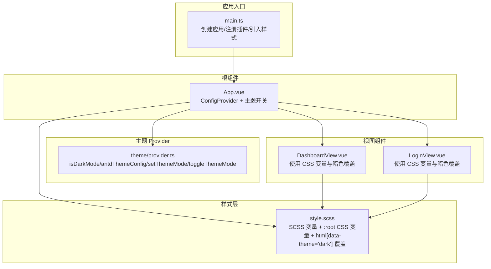
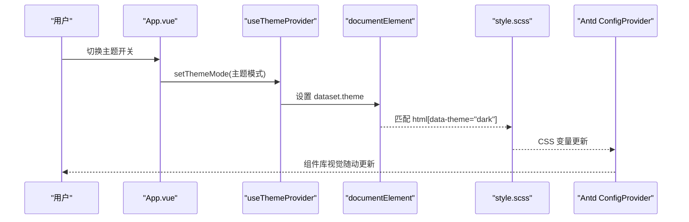
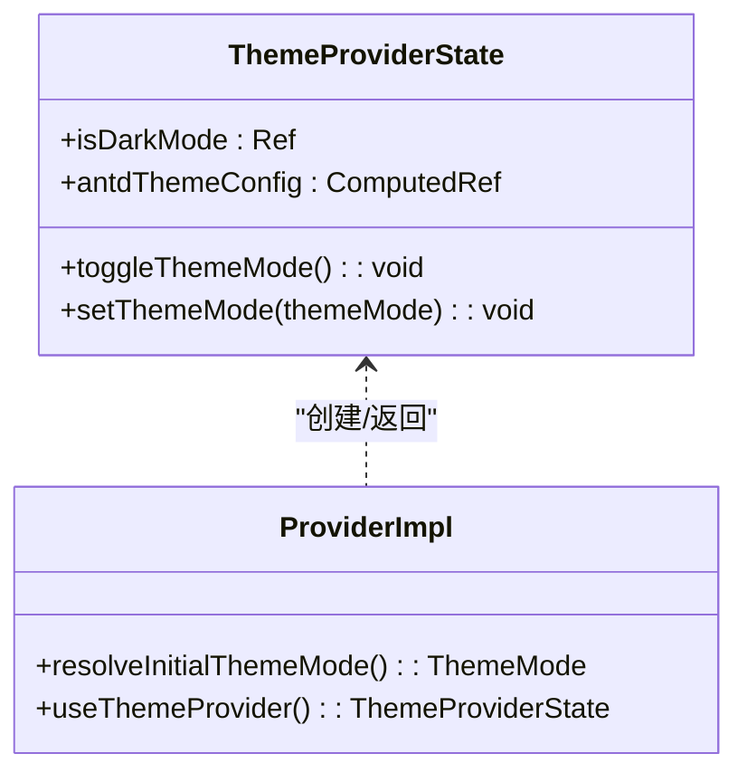
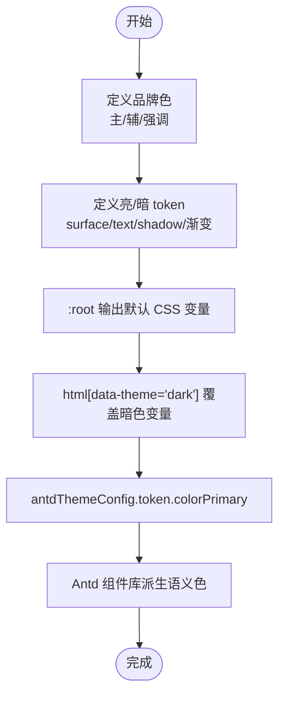
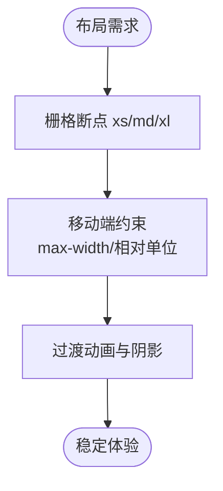
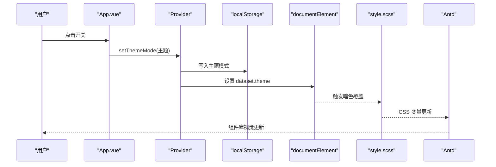
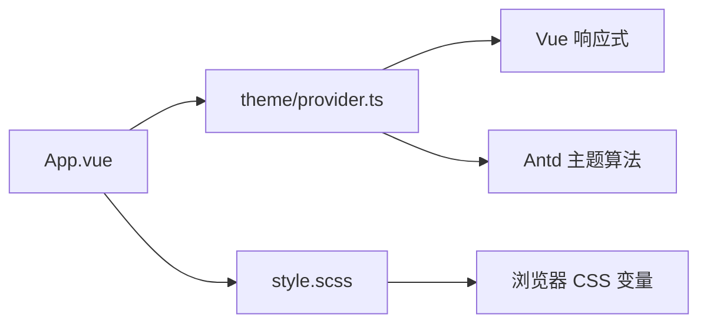

# 主题系统

<cite>
**本文引用的文件**
- [web/src/theme/provider.ts](file://web/src/theme/provider.ts)
- [web/src/style.scss](file://web/src/style.scss)
- [web/src/App.vue](file://web/src/App.vue)
- [web/src/main.ts](file://web/src/main.ts)
- [web/package.json](file://web/package.json)
- [web/vite.config.ts](file://web/vite.config.ts)
- [web/src/views/DashboardView.vue](file://web/src/views/DashboardView.vue)
- [web/src/views/LoginView.vue](file://web/src/views/LoginView.vue)
- [web/src/router/index.ts](file://web/src/router/index.ts)
</cite>

## 目录
1. [简介](#简介)
2. [项目结构](#项目结构)
3. [核心组件](#核心组件)
4. [架构总览](#架构总览)
5. [详细组件分析](#详细组件分析)
6. [依赖关系分析](#依赖关系分析)
7. [性能考量](#性能考量)
8. [故障排查指南](#故障排查指南)
9. [结论](#结论)
10. [附录](#附录)

## 简介
本文件系统性阐述 Poprako 前端的主题系统，涵盖以下方面：
- 主题 Provider 的实现原理与配置项
- 颜色系统设计规范（主色调、辅助色、语义色）
- 响应式设计与移动端适配策略
- SCSS 变量组织结构与命名规范
- 主题切换与动态样式更新机制
- 样式覆盖最佳实践与 CSS-in-JS 使用场景
- 暗色模式支持与无障碍访问考虑
- 主题定制工作流与开发调试方法

## 项目结构
前端主题系统围绕“全局 Provider + SCSS 变量 + Ant Design Vue 主题配置”三位一体展开：
- 入口文件负责应用初始化与全局样式引入
- 根组件通过 Provider 注入 Ant Design Vue 主题配置，并提供主题切换控件
- SCSS 层以变量与运行时 CSS 变量为核心，实现亮/暗两套主题 token，并通过 data-theme 属性驱动切换
- 视图组件通过 CSS 变量与选择器组合实现跨主题一致性

图表来源
- [web/src/main.ts:1-26](file://web/src/main.ts#L1-L26)
- [web/src/App.vue:1-45](file://web/src/App.vue#L1-L45)
- [web/src/theme/provider.ts:1-97](file://web/src/theme/provider.ts#L1-L97)
- [web/src/style.scss:1-147](file://web/src/style.scss#L1-L147)
- [web/src/views/DashboardView.vue:1-363](file://web/src/views/DashboardView.vue#L1-L363)
- [web/src/views/LoginView.vue:1-157](file://web/src/views/LoginView.vue#L1-L157)

章节来源
- [web/src/main.ts:1-26](file://web/src/main.ts#L1-L26)
- [web/src/App.vue:1-45](file://web/src/App.vue#L1-L45)
- [web/src/theme/provider.ts:1-97](file://web/src/theme/provider.ts#L1-L97)
- [web/src/style.scss:1-147](file://web/src/style.scss#L1-L147)

## 核心组件
- 主题 Provider（useThemeProvider）
  - 提供 isDarkMode、antdThemeConfig、setThemeMode、toggleThemeMode
  - 初始化时从本地存储或系统偏好解析主题模式
  - 通过 watch 将主题模式写回本地存储，并在 documentElement 上设置 data-theme，驱动 SCSS 暗色覆盖
- 根组件（App.vue）
  - 通过 a-config-provider 注入 antdThemeConfig
  - 提供主题开关控件，绑定 setThemeMode 实现切换
- 全局样式（style.scss）
  - 定义品牌色与亮/暗两套 token
  - 以 :root 定义默认 CSS 变量，html[data-theme="dark"] 覆盖暗色变量
  - 通过 var(--xxx) 在组件样式中统一消费

章节来源
- [web/src/theme/provider.ts:25-96](file://web/src/theme/provider.ts#L25-L96)
- [web/src/App.vue:19-28](file://web/src/App.vue#L19-L28)
- [web/src/style.scss:4-113](file://web/src/style.scss#L4-L113)

## 架构总览
主题系统采用“状态驱动 + CSS 变量 + 组件库算法”的分层设计：
- 状态层：Vue 响应式 ref/computed 管理 isDarkMode 与 antd 主题配置
- 渲染层：Ant Design Vue ConfigProvider 接收主题配置；组件库自动派生语义色
- 视觉层：SCSS 变量与 CSS 变量双轨制，通过 data-theme 切换暗色 token

图表来源
- [web/src/App.vue:26-28](file://web/src/App.vue#L26-L28)
- [web/src/theme/provider.ts:69-88](file://web/src/theme/provider.ts#L69-L88)
- [web/src/style.scss:90-113](file://web/src/style.scss#L90-L113)
- [web/src/theme/provider.ts:56-64](file://web/src/theme/provider.ts#L56-L64)

## 详细组件分析

### 主题 Provider 分析
- 数据结构与职责
  - isDarkMode：布尔型响应式状态
  - antdThemeConfig：ComputedRef，根据 isDarkMode 选择算法与主色、圆角等 token
  - setThemeMode/toggleThemeMode：对外暴露的变更接口
- 初始化与持久化
  - 优先读取本地存储；若无则依据 prefers-color-scheme
  - 切换时写入本地存储并设置 data-theme，触发 SCSS 暗色覆盖生效
- 与 Ant Design Vue 的集成
  - 通过 ConfigProvider 的 theme 属性注入，组件库自动派生主色系、禁用态、阴影等语义色

图表来源
- [web/src/theme/provider.ts:25-96](file://web/src/theme/provider.ts#L25-L96)

章节来源
- [web/src/theme/provider.ts:39-48](file://web/src/theme/provider.ts#L39-L48)
- [web/src/theme/provider.ts:56-64](file://web/src/theme/provider.ts#L56-L64)
- [web/src/theme/provider.ts:69-88](file://web/src/theme/provider.ts#L69-L88)

### 颜色系统与设计规范
- 品牌色
  - 主色：用于主要交互元素、强调信息
  - 辅助色：用于次要强调、装饰
  - 强调色：用于强调、操作按钮等
- 语义色
  - 表面层（surface）：卡片、面板、浮层背景
  - 文本（text-primary/text-muted）：标题、正文、辅助文本
  - 阴影（shadow-heavy）：卡片投影、浮层阴影
- 亮/暗两套 token
  - 通过 SCSS 变量定义，:root 默认输出亮色变量
  - html[data-theme="dark"] 覆盖暗色变量，形成完整主题 token
- 组件库主色
  - 通过 antdThemeConfig.token.colorPrimary 控制组件库主色派生链路

图表来源
- [web/src/style.scss:4-85](file://web/src/style.scss#L4-L85)
- [web/src/style.scss:90-113](file://web/src/style.scss#L90-L113)
- [web/src/theme/provider.ts:60-63](file://web/src/theme/provider.ts#L60-L63)

章节来源
- [web/src/style.scss:4-85](file://web/src/style.scss#L4-L85)
- [web/src/style.scss:90-113](file://web/src/style.scss#L90-L113)
- [web/src/theme/provider.ts:60-63](file://web/src/theme/provider.ts#L60-L63)

### 响应式设计与移动端适配
- 断点策略
  - 使用 Ant Design Vue 布局栅格的 xs/md/xl 等断点属性
  - Dashboard 中列布局在小屏与大屏呈现不同密度
- 移动端适配
  - 登录页使用 min(460px, calc(100vw - 32px)) 控制卡片最大宽度
  - 使用 place-items/width/min()/calc() 等现代 CSS 技术提升自适应表现
- 动画与过渡
  - 页面切换与背景渐变均带有过渡动画，提升暗色切换体验

图表来源
- [web/src/views/DashboardView.vue:43-46](file://web/src/views/DashboardView.vue#L43-L46)
- [web/src/views/DashboardView.vue:10-16](file://web/src/views/DashboardView.vue#L10-L16)
- [web/src/views/LoginView.vue:102-106](file://web/src/views/LoginView.vue#L102-L106)
- [web/src/style.scss:134-135](file://web/src/style.scss#L134-L135)

章节来源
- [web/src/views/DashboardView.vue:43-46](file://web/src/views/DashboardView.vue#L43-L46)
- [web/src/views/LoginView.vue:102-106](file://web/src/views/LoginView.vue#L102-L106)
- [web/src/style.scss:134-135](file://web/src/style.scss#L134-L135)

### SCSS 变量组织与命名规范
- 组织结构
  - 品牌色区段：$brand-primary/$brand-secondary/$brand-accent
  - 亮/暗 token 区段：$light-*/$dark-*
  - 运行时 CSS 变量区段：:root 声明默认变量；html[data-theme="dark"] 覆盖
- 命名规范
  - 采用语义化前缀（如 --surface/--text-primary/--shadow-heavy）
  - 保持 SCSS 变量与 CSS 变量命名一一对应，便于维护与替换
- 最佳实践
  - 在组件样式中统一使用 var(--xxx)，避免硬编码颜色
  - 通过 :global(html[data-theme="dark"]) 仅声明差异部分，减少重复

章节来源
- [web/src/style.scss:4-113](file://web/src/style.scss#L4-L113)

### 主题切换与动态样式更新机制
- 切换流程
  - 用户操作 -> setThemeMode -> isDarkMode 变更 -> watch 写入本地存储与 data-theme -> SCSS 暗色覆盖生效 -> antd 主题算法重新计算 -> 组件库视觉更新
- 关键点
  - data-theme 作为暗色覆盖的唯一条件选择器，确保 SCSS 覆盖精准生效
  - antdThemeConfig 仅需主色与圆角等少量 token，即可驱动全组件库语义色

图表来源
- [web/src/App.vue:26-28](file://web/src/App.vue#L26-L28)
- [web/src/theme/provider.ts:69-88](file://web/src/theme/provider.ts#L69-L88)
- [web/src/style.scss:90-113](file://web/src/style.scss#L90-L113)
- [web/src/theme/provider.ts:56-64](file://web/src/theme/provider.ts#L56-L64)

章节来源
- [web/src/App.vue:26-28](file://web/src/App.vue#L26-L28)
- [web/src/theme/provider.ts:69-88](file://web/src/theme/provider.ts#L69-L88)
- [web/src/style.scss:90-113](file://web/src/style.scss#L90-L113)

### 样式覆盖最佳实践与 CSS-in-JS 场景
- 最佳实践
  - 优先使用 CSS 变量与 SCSS 变量，集中管理 token
  - 通过 :global(html[data-theme="dark"]) 仅声明差异，避免重复定义
  - 组件内样式尽量使用 var(--xxx)，降低耦合度
- CSS-in-JS 场景
  - 本项目未直接使用 CSS-in-JS；若未来需要动态样式（如动态主色），可在 antdThemeConfig.token 中扩展，或在组件内通过内联样式补充局部覆盖

章节来源
- [web/src/views/DashboardView.vue:350-361](file://web/src/views/DashboardView.vue#L350-L361)
- [web/src/views/LoginView.vue:145-155](file://web/src/views/LoginView.vue#L145-L155)
- [web/src/theme/provider.ts:60-63](file://web/src/theme/provider.ts#L60-L63)

### 暗色模式支持与无障碍访问
- 暗色模式
  - 通过 html[data-theme="dark"] 与 CSS 变量覆盖实现完整暗色 token
  - 与系统偏好联动，尊重用户设置
- 无障碍访问
  - 组件库算法自动派生对比度与可读性
  - 建议在后续迭代中增加键盘导航、焦点可见性与高对比度模式验证

章节来源
- [web/src/style.scss:90-113](file://web/src/style.scss#L90-L113)
- [web/src/theme/provider.ts:44-47](file://web/src/theme/provider.ts#L44-L47)

### 主题定制工作流与开发调试
- 工作流
  - 修改 style.scss 中的 SCSS 变量或 antdThemeConfig.token
  - 通过 App.vue 的主题开关验证效果
  - 在各视图中统一使用 var(--xxx) 消费变量，避免硬编码
- 调试方法
  - 在浏览器开发者工具中切换 html[data-theme="dark"]，观察暗色覆盖是否生效
  - 检查 localStorage 中的主题键值，确认持久化正常
  - 在组件样式中使用 CSS 变量审查器定位具体 token 来源

章节来源
- [web/src/App.vue:4-11](file://web/src/App.vue#L4-L11)
- [web/src/theme/provider.ts:15-15](file://web/src/theme/provider.ts#L15-L15)
- [web/src/theme/provider.ts:84-85](file://web/src/theme/provider.ts#L84-L85)

## 依赖关系分析
- 组件耦合
  - App.vue 依赖 Provider 与样式；Provider 依赖 Vue 响应式与 antd 主题算法
  - 视图组件依赖全局样式变量，不直接依赖 Provider
- 外部依赖
  - Vue 3 响应式系统
  - Ant Design Vue 主题算法与 ConfigProvider
  - Sass 编译器（由 Vite 插件链路提供）

图表来源
- [web/src/App.vue:19-21](file://web/src/App.vue#L19-L21)
- [web/src/theme/provider.ts:56-64](file://web/src/theme/provider.ts#L56-L64)
- [web/src/style.scss:56-85](file://web/src/style.scss#L56-L85)

章节来源
- [web/src/App.vue:19-21](file://web/src/App.vue#L19-L21)
- [web/src/theme/provider.ts:56-64](file://web/src/theme/provider.ts#L56-L64)
- [web/src/style.scss:56-85](file://web/src/style.scss#L56-L85)

## 性能考量
- 样式体积
  - 通过 CSS 变量集中管理 token，减少重复定义
- 切换开销
  - data-theme 切换仅触发 CSS 变量重计算，成本低
- 渲染影响
  - antd 主题算法在配置变更时重算语义色，建议避免频繁切换

## 故障排查指南
- 主题未持久化
  - 检查本地存储键值是否存在与正确
  - 确认 watch 回调是否执行
- 暗色覆盖无效
  - 确认 html 是否存在 data-theme="dark"
  - 检查 :global(html[data-theme="dark"]) 覆盖是否被更高优先级规则覆盖
- 组件库颜色异常
  - 检查 antdThemeConfig.token.colorPrimary 是否正确传入
  - 确认 antd 的主题算法是否按预期切换

章节来源
- [web/src/theme/provider.ts:15-15](file://web/src/theme/provider.ts#L15-L15)
- [web/src/theme/provider.ts:84-85](file://web/src/theme/provider.ts#L84-L85)
- [web/src/style.scss:90-113](file://web/src/style.scss#L90-L113)
- [web/src/theme/provider.ts:56-64](file://web/src/theme/provider.ts#L56-L64)

## 结论
Poprako 的主题系统以 Provider 驱动、CSS 变量与 Ant Design Vue 算法为核心，实现了简洁而强大的亮/暗双主题能力。通过 SCSS 变量与运行时 CSS 变量的双轨制组织，配合 data-theme 切换，既保证了开发效率，也兼顾了可维护性与可扩展性。建议在后续迭代中进一步完善无障碍与高对比度支持，并持续优化主题定制流程。

## 附录
- 关键配置参考
  - 主题持久化键名：见 Provider 内常量定义
  - Ant Design Vue 主题算法：根据 isDarkMode 选择默认或暗色算法
  - 样式入口：main.ts 引入全局样式与组件库重置样式

章节来源
- [web/src/theme/provider.ts:15-15](file://web/src/theme/provider.ts#L15-L15)
- [web/src/theme/provider.ts:56-64](file://web/src/theme/provider.ts#L56-L64)
- [web/src/main.ts:10-10](file://web/src/main.ts#L10-L10)