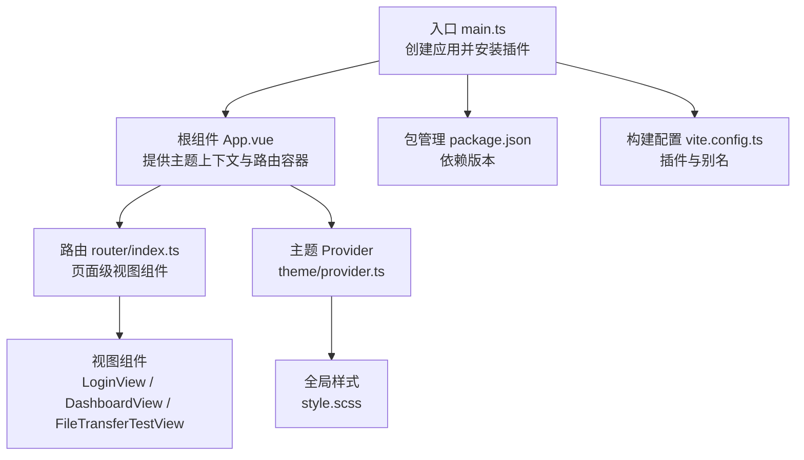
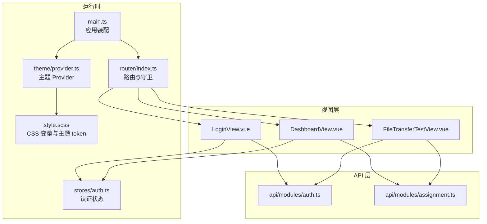
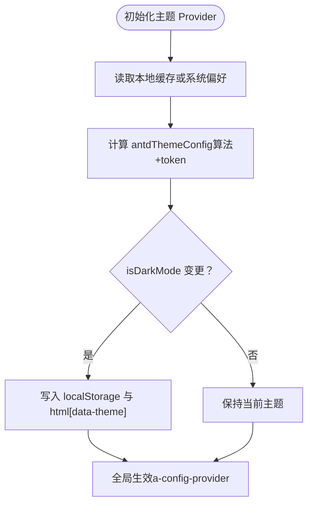
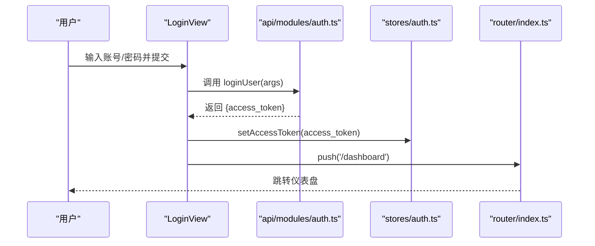
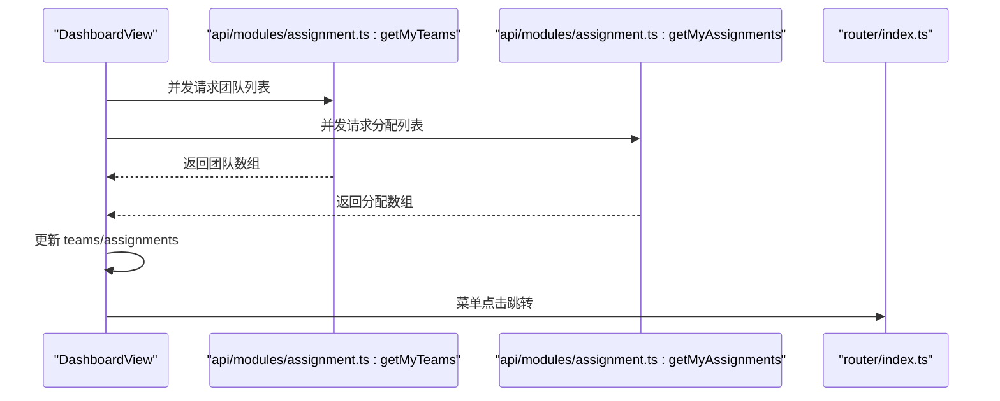
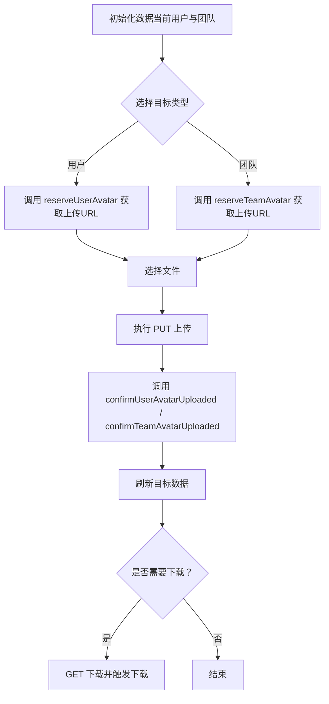
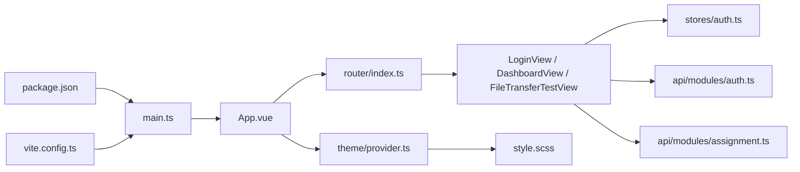

# 组件系统

<cite>
**本文引用的文件**
- [web/src/main.ts](file://web/src/main.ts)
- [web/src/App.vue](file://web/src/App.vue)
- [web/package.json](file://web/package.json)
- [web/vite.config.ts](file://web/vite.config.ts)
- [web/src/theme/provider.ts](file://web/src/theme/provider.ts)
- [web/src/style.scss](file://web/src/style.scss)
- [web/src/views/DashboardView.vue](file://web/src/views/DashboardView.vue)
- [web/src/views/LoginView.vue](file://web/src/views/LoginView.vue)
- [web/src/views/FileTransferTestView.vue](file://web/src/views/FileTransferTestView.vue)
- [web/src/router/index.ts](file://web/src/router/index.ts)
- [web/src/stores/auth.ts](file://web/src/stores/auth.ts)
- [web/src/api/modules/auth.ts](file://web/src/api/modules/auth.ts)
- [web/src/api/modules/assignment.ts](file://web/src/api/modules/assignment.ts)
- [web/src/types/domain.ts](file://web/src/types/domain.ts)
- [web/src/types/common.ts](file://web/src/types/common.ts)
</cite>

## 目录
1. [简介](#简介)
2. [项目结构](#项目结构)
3. [核心组件](#核心组件)
4. [架构总览](#架构总览)
5. [详细组件分析](#详细组件分析)
6. [依赖关系分析](#依赖关系分析)
7. [性能考虑](#性能考虑)
8. [故障排查指南](#故障排查指南)
9. [结论](#结论)
10. [附录](#附录)

## 简介
本文件面向 Poprako 前端组件系统，围绕基于 Ant Design Vue 4.2.6 的 UI 组件库集成与使用规范进行系统化说明。内容涵盖主题系统与样式覆盖、视图组件组织（DashboardView、LoginView、FileTransferTestView）、组件间通信（props 传递与 emits 事件处理）、响应式布局与数据展示、表单组件实践、组件复用策略与插槽使用建议，并提供测试、调试与性能优化的指导原则。

## 项目结构
前端工程位于 web 目录，采用 Vue 3 + TypeScript + Vite 技术栈，使用 Pinia 进行状态管理，Ant Design Vue 提供 UI 基础组件库。项目通过 a-config-provider 将主题配置注入至全局组件树，实现统一的主题切换与样式覆盖。

图表来源
- [web/src/main.ts:1-26](file://web/src/main.ts#L1-L26)
- [web/src/App.vue:1-45](file://web/src/App.vue#L1-L45)
- [web/src/router/index.ts:1-59](file://web/src/router/index.ts#L1-L59)
- [web/src/theme/provider.ts:1-97](file://web/src/theme/provider.ts#L1-L97)
- [web/src/style.scss:1-147](file://web/src/style.scss#L1-L147)
- [web/package.json:1-36](file://web/package.json#L1-L36)
- [web/vite.config.ts:1-44](file://web/vite.config.ts#L1-L44)

章节来源
- [web/src/main.ts:1-26](file://web/src/main.ts#L1-L26)
- [web/src/App.vue:1-45](file://web/src/App.vue#L1-L45)
- [web/src/router/index.ts:1-59](file://web/src/router/index.ts#L1-L59)
- [web/src/theme/provider.ts:1-97](file://web/src/theme/provider.ts#L1-L97)
- [web/src/style.scss:1-147](file://web/src/style.scss#L1-L147)
- [web/package.json:1-36](file://web/package.json#L1-L36)
- [web/vite.config.ts:1-44](file://web/vite.config.ts#L1-L44)

## 核心组件
- 入口与插件装配：在入口文件中创建应用实例，安装路由、Pinia 与 Antd 插件，完成全局依赖注入。
- 根组件与主题上下文：根组件通过 a-config-provider 包裹路由视图，并暴露主题切换控件，将主题配置传递给子组件。
- 视图组件：LoginView（登录页）、DashboardView（仪表盘）、FileTransferTestView（文件传输测试）分别承担认证、工作台与文件能力验证。
- 路由与守卫：定义页面路由与前置守卫，实现登录态校验与页面跳转。
- 认证状态：Pinia Store 统一维护访问令牌与登录态，支持持久化与清理。
- API 模块：封装认证、分配等接口，统一请求与响应类型。
- 类型系统：domain.ts 与 common.ts 定义领域模型与通用查询/错误结构，保障类型安全。

章节来源
- [web/src/main.ts:1-26](file://web/src/main.ts#L1-L26)
- [web/src/App.vue:1-45](file://web/src/App.vue#L1-L45)
- [web/src/views/LoginView.vue:1-157](file://web/src/views/LoginView.vue#L1-L157)
- [web/src/views/DashboardView.vue:1-363](file://web/src/views/DashboardView.vue#L1-L363)
- [web/src/views/FileTransferTestView.vue:1-405](file://web/src/views/FileTransferTestView.vue#L1-L405)
- [web/src/router/index.ts:1-59](file://web/src/router/index.ts#L1-L59)
- [web/src/stores/auth.ts:1-52](file://web/src/stores/auth.ts#L1-L52)
- [web/src/api/modules/auth.ts:1-157](file://web/src/api/modules/auth.ts#L1-L157)
- [web/src/api/modules/assignment.ts:1-101](file://web/src/api/modules/assignment.ts#L1-L101)
- [web/src/types/domain.ts:1-89](file://web/src/types/domain.ts#L1-L89)
- [web/src/types/common.ts:1-41](file://web/src/types/common.ts#L1-L41)

## 架构总览
整体采用“入口装配 → 根组件上下文 → 视图组件 → 状态与 API”的分层架构。Antd 组件贯穿视图层，配合响应式与计算属性实现动态交互；主题系统通过 Provider 与 CSS 变量实现明暗主题切换与样式覆盖。

图表来源
- [web/src/main.ts:1-26](file://web/src/main.ts#L1-L26)
- [web/src/router/index.ts:1-59](file://web/src/router/index.ts#L1-L59)
- [web/src/stores/auth.ts:1-52](file://web/src/stores/auth.ts#L1-L52)
- [web/src/theme/provider.ts:1-97](file://web/src/theme/provider.ts#L1-L97)
- [web/src/style.scss:1-147](file://web/src/style.scss#L1-L147)
- [web/src/views/LoginView.vue:1-157](file://web/src/views/LoginView.vue#L1-L157)
- [web/src/views/DashboardView.vue:1-363](file://web/src/views/DashboardView.vue#L1-L363)
- [web/src/views/FileTransferTestView.vue:1-405](file://web/src/views/FileTransferTestView.vue#L1-L405)
- [web/src/api/modules/auth.ts:1-157](file://web/src/api/modules/auth.ts#L1-L157)
- [web/src/api/modules/assignment.ts:1-101](file://web/src/api/modules/assignment.ts#L1-L101)

## 详细组件分析

### 主题系统与样式覆盖
- 主题 Provider：集中管理 isDarkMode、antdThemeConfig、切换与设置函数；通过 watch 将主题写入 localStorage 与 html[data-theme]，实现持久化与全局生效。
- Ant Design Vue 主题：通过 a-config-provider 注入算法与 token（如主色、圆角），确保全局组件风格一致。
- 样式覆盖：style.scss 使用 Sass 变量定义明/暗两套 token，并通过 CSS 变量映射到页面元素，暗色模式通过 html[data-theme="dark"] 进行覆盖。

图表来源
- [web/src/theme/provider.ts:39-88](file://web/src/theme/provider.ts#L39-L88)
- [web/src/App.vue:15-28](file://web/src/App.vue#L15-L28)
- [web/src/style.scss:56-113](file://web/src/style.scss#L56-L113)

章节来源
- [web/src/theme/provider.ts:1-97](file://web/src/theme/provider.ts#L1-L97)
- [web/src/App.vue:1-45](file://web/src/App.vue#L1-L45)
- [web/src/style.scss:1-147](file://web/src/style.scss#L1-L147)

### 登录视图组件（LoginView）
- 表单设计：垂直布局、必填校验、输入框尺寸与按钮块状样式统一。
- 交互流程：handleSubmit 中调用登录接口，成功后写入访问令牌并跳转仪表盘；异常时提示错误。
- 与认证 Store：通过 useAuthStore 写入令牌，路由守卫据此判断登录态。

图表来源
- [web/src/views/LoginView.vue:69-82](file://web/src/views/LoginView.vue#L69-L82)
- [web/src/api/modules/auth.ts:102-109](file://web/src/api/modules/auth.ts#L102-L109)
- [web/src/stores/auth.ts:31-35](file://web/src/stores/auth.ts#L31-L35)
- [web/src/router/index.ts:47-56](file://web/src/router/index.ts#L47-L56)

章节来源
- [web/src/views/LoginView.vue:1-157](file://web/src/views/LoginView.vue#L1-L157)
- [web/src/api/modules/auth.ts:1-157](file://web/src/api/modules/auth.ts#L1-L157)
- [web/src/stores/auth.ts:1-52](file://web/src/stores/auth.ts#L1-L52)
- [web/src/router/index.ts:1-59](file://web/src/router/index.ts#L1-L59)

### 仪表盘视图组件（DashboardView）
- 布局结构：左侧导航、顶部工具栏、内容区卡片与表格/列表组合，响应式栅格布局。
- 数据加载：并发拉取团队与分配数据，统一更新状态并提示成功/失败。
- 交互行为：菜单点击路由跳转、侧边栏折叠切换、刷新数据与退出登录。
- 自定义渲染：表格列自定义渲染、列表项模板插槽、标签颜色根据角色映射。

图表来源
- [web/src/views/DashboardView.vue:221-240](file://web/src/views/DashboardView.vue#L221-L240)
- [web/src/api/modules/assignment.ts:77-86](file://web/src/api/modules/assignment.ts#L77-L86)
- [web/src/router/index.ts:24-33](file://web/src/router/index.ts#L24-L33)

章节来源
- [web/src/views/DashboardView.vue:1-363](file://web/src/views/DashboardView.vue#L1-L363)
- [web/src/api/modules/assignment.ts:1-101](file://web/src/api/modules/assignment.ts#L1-L101)
- [web/src/types/domain.ts:1-89](file://web/src/types/domain.ts#L1-L89)

### 文件传输测试视图组件（FileTransferTestView）
- 功能模块：上传测试（预留 URL、选择文件、PUT 上传、确认上传）、下载测试（刷新目标数据、下载与新标签打开）。
- 控制流：根据目标类型（用户/团队）动态生成上传 URL 与下载 URL；上传后调用确认接口并刷新数据。
- 错误提示：针对跨域问题给出明确提示，区分上传与下载场景。

图表来源
- [web/src/views/FileTransferTestView.vue:192-222](file://web/src/views/FileTransferTestView.vue#L192-L222)
- [web/src/views/FileTransferTestView.vue:224-256](file://web/src/views/FileTransferTestView.vue#L224-L256)
- [web/src/views/FileTransferTestView.vue:282-326](file://web/src/views/FileTransferTestView.vue#L282-L326)
- [web/src/views/FileTransferTestView.vue:328-369](file://web/src/views/FileTransferTestView.vue#L328-L369)

章节来源
- [web/src/views/FileTransferTestView.vue:1-405](file://web/src/views/FileTransferTestView.vue#L1-L405)
- [web/src/api/modules/auth.ts:139-156](file://web/src/api/modules/auth.ts#L139-L156)

### 组件间通信与事件处理
- Props 传递：视图组件通过 props 接收 Antd 组件的 v-model、回调参数与配置项（如菜单项、表格列定义）。
- Emits 事件：通过原生事件绑定（如 @click、@finish）处理用户交互；在根组件中通过 a-config-provider 统一注入主题配置，避免逐层透传。
- 插槽与作用域插槽：列表项通过 #renderItem 与 #title/#description 等具名插槽实现自定义渲染；表格列通过 customRender 实现格式化输出。

章节来源
- [web/src/views/DashboardView.vue:100-108](file://web/src/views/DashboardView.vue#L100-L108)
- [web/src/views/DashboardView.vue:144-162](file://web/src/views/DashboardView.vue#L144-L162)
- [web/src/views/DashboardView.vue:74-87](file://web/src/views/DashboardView.vue#L74-L87)
- [web/src/App.vue:2-12](file://web/src/App.vue#L2-L12)

### 响应式布局与数据展示
- 响应式栅格：使用 a-row/a-col 的断点配置（xs/md/xl）适配不同屏幕宽度。
- 数据展示：a-statistic 展示统计卡片，a-table 展示团队列表，a-list 展示分配列表；均通过 v-for 与响应式数据驱动。
- 自定义渲染：表格列 customRender 与列表插槽实现时间格式化、标签颜色映射等。

章节来源
- [web/src/views/DashboardView.vue:39-91](file://web/src/views/DashboardView.vue#L39-L91)
- [web/src/views/DashboardView.vue:167-188](file://web/src/views/DashboardView.vue#L167-L188)
- [web/src/views/DashboardView.vue:266-275](file://web/src/views/DashboardView.vue#L266-L275)

### 表单组件最佳实践
- 表单布局：垂直布局提升可读性；必填项使用规则校验并在提交时触发 finish。
- 输入控件：大尺寸输入框与按钮提升可用性；密码输入框隐藏明文。
- 加载状态：通过 loading 属性反馈异步操作进度，避免重复提交。

章节来源
- [web/src/views/LoginView.vue:11-44](file://web/src/views/LoginView.vue#L11-L44)

### 组件复用与插槽使用
- 复用策略：将通用 UI 结构抽象为可复用卡片容器（a-card），在多个视图中复用布局与样式。
- 插槽使用：列表项与表格列通过插槽实现灵活渲染；避免在父组件中过度耦合具体展示细节。
- 作用域插槽：利用插槽上下文（如列表项数据）实现条件渲染与格式化。

章节来源
- [web/src/views/DashboardView.vue:58-89](file://web/src/views/DashboardView.vue#L58-L89)
- [web/src/views/DashboardView.vue:144-162](file://web/src/views/DashboardView.vue#L144-L162)

## 依赖关系分析
- 入口依赖：main.ts 依赖 Vue、Pinia、Antd 与路由；通过 a-config-provider 注入主题。
- 视图依赖：各视图依赖路由、状态与 API 模块；LoginView 依赖认证 API 与认证 Store；DashboardView 依赖分配 API；FileTransferTestView 依赖认证与头像上传 API。
- 构建与脚手架：package.json 管理依赖与脚本；vite.config.ts 配置插件与路径别名；style.scss 提供全局样式与主题 token。

图表来源
- [web/package.json:1-36](file://web/package.json#L1-L36)
- [web/vite.config.ts:1-44](file://web/vite.config.ts#L1-L44)
- [web/src/main.ts:1-26](file://web/src/main.ts#L1-L26)
- [web/src/App.vue:1-45](file://web/src/App.vue#L1-L45)
- [web/src/router/index.ts:1-59](file://web/src/router/index.ts#L1-L59)
- [web/src/stores/auth.ts:1-52](file://web/src/stores/auth.ts#L1-L52)
- [web/src/api/modules/auth.ts:1-157](file://web/src/api/modules/auth.ts#L1-L157)
- [web/src/api/modules/assignment.ts:1-101](file://web/src/api/modules/assignment.ts#L1-L101)
- [web/src/theme/provider.ts:1-97](file://web/src/theme/provider.ts#L1-L97)
- [web/src/style.scss:1-147](file://web/src/style.scss#L1-L147)

章节来源
- [web/package.json:1-36](file://web/package.json#L1-L36)
- [web/vite.config.ts:1-44](file://web/vite.config.ts#L1-L44)
- [web/src/main.ts:1-26](file://web/src/main.ts#L1-L26)
- [web/src/App.vue:1-45](file://web/src/App.vue#L1-L45)
- [web/src/router/index.ts:1-59](file://web/src/router/index.ts#L1-L59)
- [web/src/stores/auth.ts:1-52](file://web/src/stores/auth.ts#L1-L52)
- [web/src/api/modules/auth.ts:1-157](file://web/src/api/modules/auth.ts#L1-L157)
- [web/src/api/modules/assignment.ts:1-101](file://web/src/api/modules/assignment.ts#L1-L101)
- [web/src/theme/provider.ts:1-97](file://web/src/theme/provider.ts#L1-L97)
- [web/src/style.scss:1-147](file://web/src/style.scss#L1-L147)

## 性能考虑
- 异步加载与并发：仪表盘数据采用 Promise.all 并发拉取，减少总等待时间；登录与文件传输使用 loading 状态避免重复提交。
- 样式与主题：通过 CSS 变量与 a-config-provider 减少重复计算与重绘；暗色模式切换通过 dataset 主题标记快速生效。
- 资源体积：按需引入图标与组件，避免全量引入；路由采用异步组件加载，降低首屏体积。
- 建议：对长列表启用虚拟滚动（如后续扩展）、对频繁计算使用 computed 缓存、对网络请求增加超时与重试策略。

## 故障排查指南
- 登录失败：检查登录接口返回与错误消息；确认认证 Store 中 access_token 是否写入；查看路由守卫是否正确拦截。
- 上传/下载跨域：根据提示在对象存储 CORS 中放行前端来源 Origin、方法与请求头；核对 Content-Type 与上传 URL。
- 主题不生效：确认 html[data-theme] 是否正确写入；检查 a-config-provider 是否包裹根组件；核对 CSS 变量覆盖顺序。
- 菜单跳转无效：检查路由守卫逻辑与 selectedKeys 绑定；确认菜单 key 与路由 path 对应。

章节来源
- [web/src/views/LoginView.vue:69-82](file://web/src/views/LoginView.vue#L69-L82)
- [web/src/views/FileTransferTestView.vue:270-280](file://web/src/views/FileTransferTestView.vue#L270-L280)
- [web/src/theme/provider.ts:80-88](file://web/src/theme/provider.ts#L80-L88)
- [web/src/router/index.ts:47-56](file://web/src/router/index.ts#L47-L56)

## 结论
Poprako 前端组件系统以 Ant Design Vue 为基础，结合 Pinia、Vue Router 与自研主题 Provider，形成统一的主题体系与视图层架构。通过清晰的视图组件划分、规范的 props/emits 通信、响应式布局与数据展示实践，以及完善的 API 类型定义，系统具备良好的可维护性与扩展性。建议在后续迭代中进一步完善组件库封装、测试覆盖率与性能监控。

## 附录
- 开发与构建：使用 Vite 与 TypeScript，脚本包含 dev、lint、type-check、build、preview；路径别名为 @ 指向 src。
- 依赖版本：Ant Design Vue 4.2.6、Vue 3、Pinia、Axios、Vue Router 等。

章节来源
- [web/vite.config.ts:1-44](file://web/vite.config.ts#L1-L44)
- [web/package.json:1-36](file://web/package.json#L1-L36)