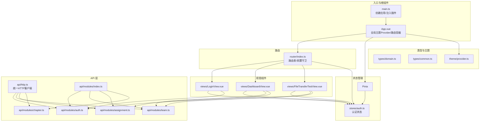
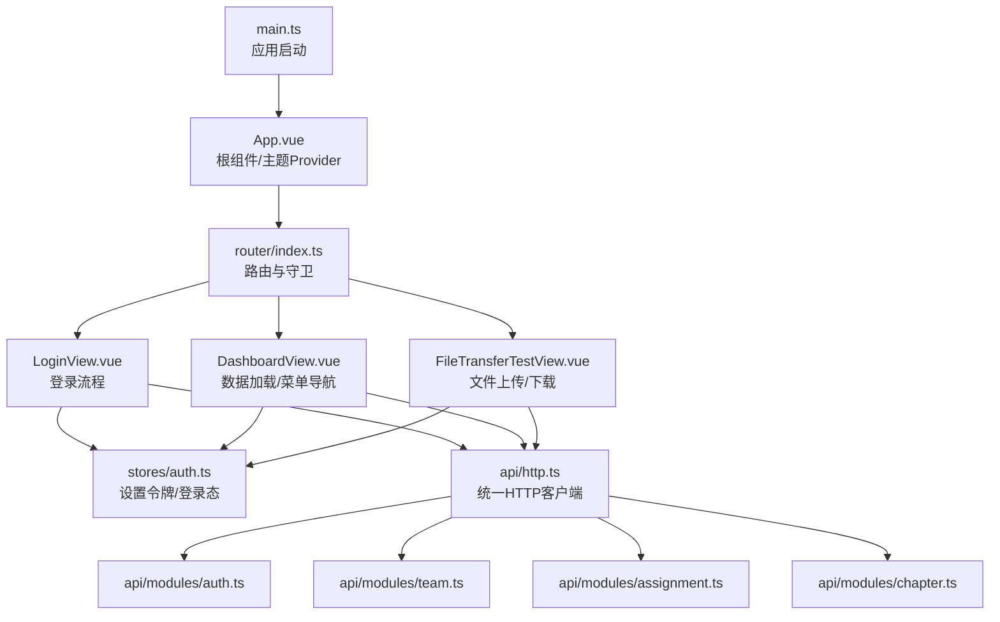
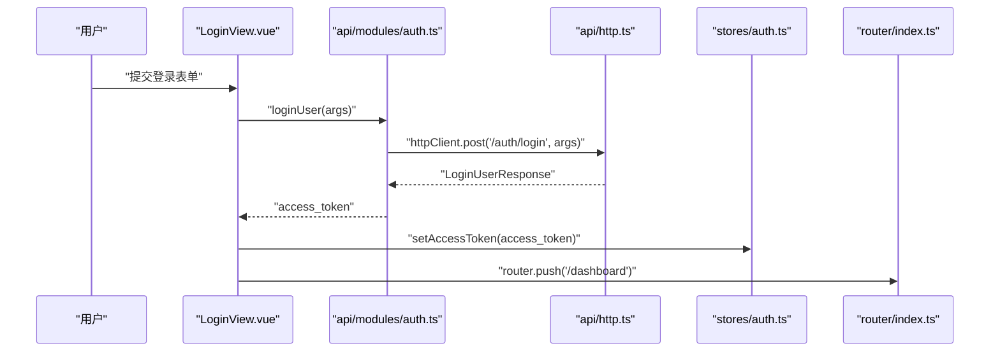
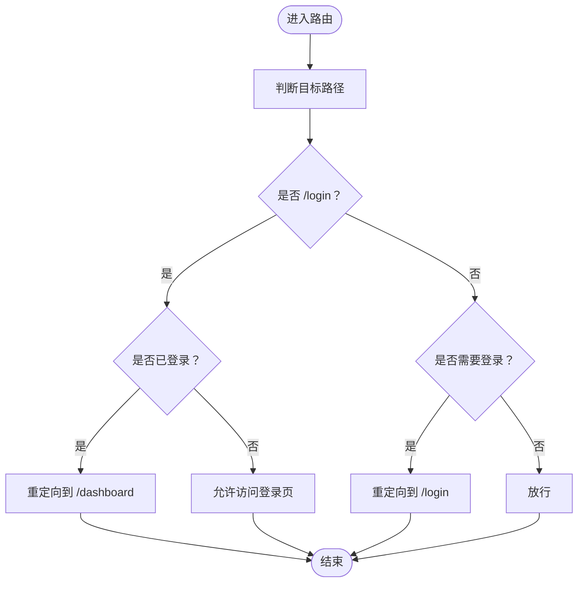
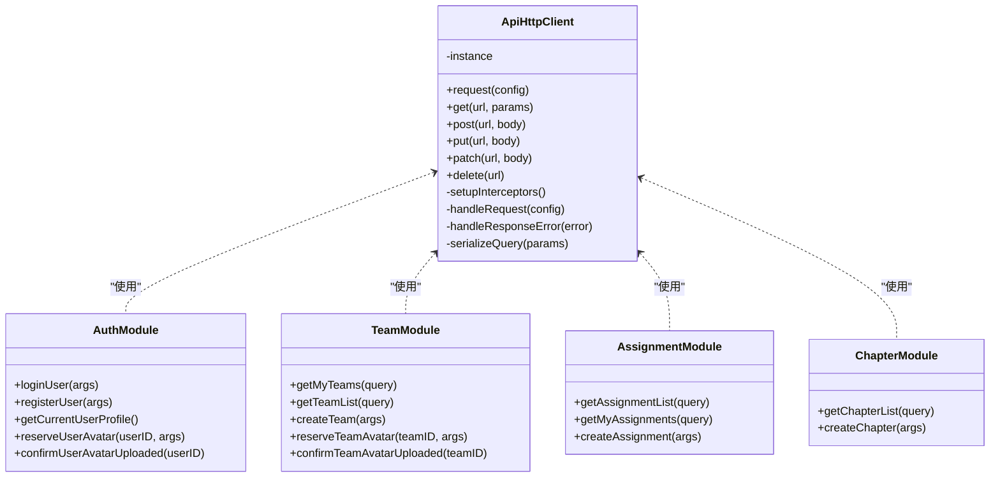
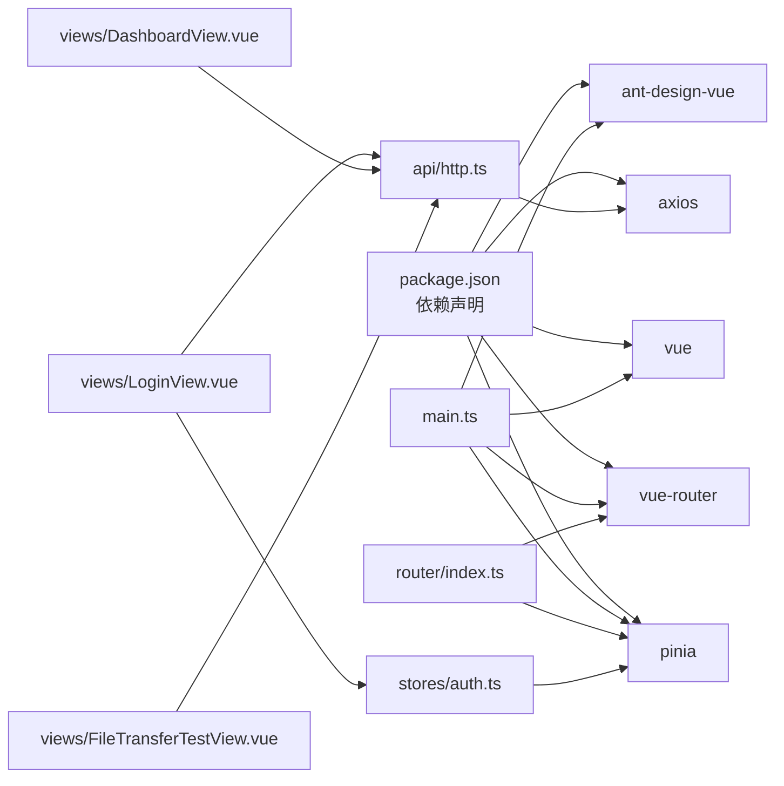

# 组件通信

<cite>
**本文引用的文件**
- [web/src/main.ts](file://web/src/main.ts)
- [web/src/App.vue](file://web/src/App.vue)
- [web/src/theme/provider.ts](file://web/src/theme/provider.ts)
- [web/src/router/index.ts](file://web/src/router/index.ts)
- [web/src/stores/auth.ts](file://web/src/stores/auth.ts)
- [web/src/api/http.ts](file://web/src/api/http.ts)
- [web/src/api/modules/auth.ts](file://web/src/api/modules/auth.ts)
- [web/src/api/modules/team.ts](file://web/src/api/modules/team.ts)
- [web/src/api/modules/assignment.ts](file://web/src/api/modules/assignment.ts)
- [web/src/api/modules/chapter.ts](file://web/src/api/modules/chapter.ts)
- [web/src/api/modules/index.ts](file://web/src/api/modules/index.ts)
- [web/src/views/DashboardView.vue](file://web/src/views/DashboardView.vue)
- [web/src/views/LoginView.vue](file://web/src/views/LoginView.vue)
- [web/src/views/FileTransferTestView.vue](file://web/src/views/FileTransferTestView.vue)
- [web/src/types/common.ts](file://web/src/types/common.ts)
- [web/src/types/domain.ts](file://web/src/types/domain.ts)
- [web/package.json](file://web/package.json)
</cite>

## 目录
1. [引言](#引言)
2. [项目结构](#项目结构)
3. [核心组件](#核心组件)
4. [架构总览](#架构总览)
5. [组件通信详解](#组件通信详解)
6. [依赖关系分析](#依赖关系分析)
7. [性能与内存优化](#性能与内存优化)
8. [故障排查与调试](#故障排查与调试)
9. [结论](#结论)
10. [附录](#附录)

## 引言
本文件系统性梳理 Poprako 前端的组件通信机制，覆盖父子组件 props 传递、事件 emits、兄弟组件通信策略、Pinia 状态管理、Vue Router 导航与参数传递、API 服务层与组件的数据交互模式，并给出性能优化、内存泄漏防范、异步与 loading 管理的最佳实践，以及测试与调试指南。内容面向不同技术背景读者，既提供高层概览也包含代码级映射。

## 项目结构
前端位于 web 子目录，采用 Vue 3 + TypeScript + Vite 技术栈，配合 Pinia 进行状态管理、Ant Design Vue 提供 UI 组件、Axios 封装统一 HTTP 客户端。路由采用 Vue Router，视图组件集中在 views 目录，API 层按领域模块拆分，类型定义位于 types 目录，主题 Provider 位于 theme 目录。

图表来源
- [web/src/main.ts:1-26](file://web/src/main.ts#L1-L26)
- [web/src/App.vue:1-45](file://web/src/App.vue#L1-L45)
- [web/src/router/index.ts:1-59](file://web/src/router/index.ts#L1-L59)
- [web/src/stores/auth.ts:1-52](file://web/src/stores/auth.ts#L1-L52)
- [web/src/theme/provider.ts:1-97](file://web/src/theme/provider.ts#L1-L97)
- [web/src/api/http.ts:1-196](file://web/src/api/http.ts#L1-L196)
- [web/src/api/modules/index.ts:1-10](file://web/src/api/modules/index.ts#L1-L10)
- [web/src/api/modules/auth.ts:1-157](file://web/src/api/modules/auth.ts#L1-L157)
- [web/src/api/modules/team.ts:1-135](file://web/src/api/modules/team.ts#L1-L135)
- [web/src/api/modules/assignment.ts:1-101](file://web/src/api/modules/assignment.ts#L1-L101)
- [web/src/api/modules/chapter.ts:1-72](file://web/src/api/modules/chapter.ts#L1-L72)
- [web/src/views/DashboardView.vue:1-363](file://web/src/views/DashboardView.vue#L1-L363)
- [web/src/views/LoginView.vue:1-157](file://web/src/views/LoginView.vue#L1-L157)
- [web/src/views/FileTransferTestView.vue:1-405](file://web/src/views/FileTransferTestView.vue#L1-L405)
- [web/src/types/common.ts:1-41](file://web/src/types/common.ts#L1-L41)
- [web/src/types/domain.ts:1-89](file://web/src/types/domain.ts#L1-L89)

章节来源
- [web/src/main.ts:1-26](file://web/src/main.ts#L1-L26)
- [web/src/App.vue:1-45](file://web/src/App.vue#L1-L45)
- [web/src/router/index.ts:1-59](file://web/src/router/index.ts#L1-L59)
- [web/src/stores/auth.ts:1-52](file://web/src/stores/auth.ts#L1-L52)
- [web/src/theme/provider.ts:1-97](file://web/src/theme/provider.ts#L1-L97)
- [web/src/api/http.ts:1-196](file://web/src/api/http.ts#L1-L196)
- [web/src/api/modules/index.ts:1-10](file://web/src/api/modules/index.ts#L1-L10)
- [web/src/api/modules/auth.ts:1-157](file://web/src/api/modules/auth.ts#L1-L157)
- [web/src/api/modules/team.ts:1-135](file://web/src/api/modules/team.ts#L1-L135)
- [web/src/api/modules/assignment.ts:1-101](file://web/src/api/modules/assignment.ts#L1-L101)
- [web/src/api/modules/chapter.ts:1-72](file://web/src/api/modules/chapter.ts#L1-L72)
- [web/src/views/DashboardView.vue:1-363](file://web/src/views/DashboardView.vue#L1-L363)
- [web/src/views/LoginView.vue:1-157](file://web/src/views/LoginView.vue#L1-L157)
- [web/src/views/FileTransferTestView.vue:1-405](file://web/src/views/FileTransferTestView.vue#L1-L405)
- [web/src/types/common.ts:1-41](file://web/src/types/common.ts#L1-L41)
- [web/src/types/domain.ts:1-89](file://web/src/types/domain.ts#L1-L89)

## 核心组件
- 应用入口与插件注入：在入口文件中创建应用实例，注入 Pinia、Vue Router、Ant Design Vue。
- 根组件：提供全局主题 Provider 与路由容器，处理主题切换并通过 Provider 暴露的状态影响全局 UI。
- 认证 Store：集中管理访问令牌与登录态，提供设置与清空令牌的方法。
- 路由：定义页面入口、重定向规则与前置守卫，实现登录态校验与页面跳转。
- 视图组件：登录页、仪表盘、文件传输测试页，承担用户交互与数据展示职责。
- API 层：统一 HTTP 客户端，封装鉴权头、错误处理、响应解包与常用方法；按领域模块导出具体接口。
- 类型系统：定义分页、包含字段、统一错误结构与领域对象类型，确保前后端契约清晰。

章节来源
- [web/src/main.ts:1-26](file://web/src/main.ts#L1-L26)
- [web/src/App.vue:1-45](file://web/src/App.vue#L1-L45)
- [web/src/stores/auth.ts:1-52](file://web/src/stores/auth.ts#L1-L52)
- [web/src/router/index.ts:1-59](file://web/src/router/index.ts#L1-L59)
- [web/src/api/http.ts:1-196](file://web/src/api/http.ts#L1-L196)
- [web/src/api/modules/index.ts:1-10](file://web/src/api/modules/index.ts#L1-L10)
- [web/src/types/common.ts:1-41](file://web/src/types/common.ts#L1-L41)
- [web/src/types/domain.ts:1-89](file://web/src/types/domain.ts#L1-L89)

## 架构总览
下图展示了从前端入口到视图组件、状态管理、路由与 API 层的整体交互路径，体现组件通信的关键节点与数据流向。

图表来源
- [web/src/main.ts:1-26](file://web/src/main.ts#L1-L26)
- [web/src/App.vue:1-45](file://web/src/App.vue#L1-L45)
- [web/src/router/index.ts:1-59](file://web/src/router/index.ts#L1-L59)
- [web/src/stores/auth.ts:1-52](file://web/src/stores/auth.ts#L1-L52)
- [web/src/api/http.ts:1-196](file://web/src/api/http.ts#L1-L196)
- [web/src/api/modules/auth.ts:1-157](file://web/src/api/modules/auth.ts#L1-L157)
- [web/src/api/modules/team.ts:1-135](file://web/src/api/modules/team.ts#L1-L135)
- [web/src/api/modules/assignment.ts:1-101](file://web/src/api/modules/assignment.ts#L1-L101)
- [web/src/api/modules/chapter.ts:1-72](file://web/src/api/modules/chapter.ts#L1-L72)
- [web/src/views/DashboardView.vue:1-363](file://web/src/views/DashboardView.vue#L1-L363)
- [web/src/views/LoginView.vue:1-157](file://web/src/views/LoginView.vue#L1-L157)
- [web/src/views/FileTransferTestView.vue:1-405](file://web/src/views/FileTransferTestView.vue#L1-L405)

## 组件通信详解

### 父子组件通信：props 与 emits
- 父传子（props）
  - 根组件通过 Provider 暴露的主题状态（如 isDarkMode、antdThemeConfig）向下传递给子组件，实现全局主题一致性。
  - 路由视图组件通过 props 接收路由参数与查询参数，结合路由守卫进行导航与权限控制。
- 子传父（emits）
  - 根组件在模板中通过事件监听处理主题切换，触发 setThemeMode 或 toggleThemeMode，从而更新全局主题状态。
  - 视图组件通过事件回调（如按钮点击、菜单项点击）触发导航或数据刷新，避免直接耦合。

章节来源
- [web/src/App.vue:19-28](file://web/src/App.vue#L19-L28)
- [web/src/theme/provider.ts:53-96](file://web/src/theme/provider.ts#L53-L96)
- [web/src/router/index.ts:47-56](file://web/src/router/index.ts#L47-L56)
- [web/src/views/DashboardView.vue:193-215](file://web/src/views/DashboardView.vue#L193-L215)

### 兄弟组件通信与事件总线
- 当前代码库未显式引入第三方事件总线库，兄弟组件间通信主要通过以下方式实现：
  - 通过共享状态（Pinia Store）进行数据同步，例如登录态变更后，其他组件通过订阅 store 状态更新 UI。
  - 通过路由参数与查询参数在页面间传递状态，减少跨组件耦合。
  - 通过统一 API 层的响应数据驱动多个兄弟面板的更新，避免直接事件广播。

章节来源
- [web/src/stores/auth.ts:15-51](file://web/src/stores/auth.ts#L15-L51)
- [web/src/router/index.ts:14-34](file://web/src/router/index.ts#L14-L34)
- [web/src/api/http.ts:102-112](file://web/src/api/http.ts#L102-L112)

### Pinia 状态管理与数据流
- 认证 Store 设计
  - 状态：accessToken、isLoggedIn。
  - 行为：setAccessToken、clearAccessToken，同时同步到本地存储。
  - 订阅：组件通过组合式 API 使用 store 实例，响应式更新 UI。
- 数据流管理
  - 写入：登录页调用登录接口后写入令牌，触发 store 更新。
  - 读取：HTTP 客户端在请求拦截器中读取本地存储的令牌并注入 Authorization 头。
  - 导航：路由守卫根据 store 的登录态决定是否放行或重定向。

图表来源
- [web/src/views/LoginView.vue:69-82](file://web/src/views/LoginView.vue#L69-L82)
- [web/src/api/modules/auth.ts:102-109](file://web/src/api/modules/auth.ts#L102-L109)
- [web/src/api/http.ts:102-135](file://web/src/api/http.ts#L102-L135)
- [web/src/stores/auth.ts:31-43](file://web/src/stores/auth.ts#L31-L43)
- [web/src/router/index.ts:47-56](file://web/src/router/index.ts#L47-L56)

章节来源
- [web/src/stores/auth.ts:15-51](file://web/src/stores/auth.ts#L15-L51)
- [web/src/api/http.ts:66-77](file://web/src/api/http.ts#L66-L77)
- [web/src/router/index.ts:47-56](file://web/src/router/index.ts#L47-L56)

### Vue Router 导航与参数传递
- 路由表与懒加载：登录页、仪表盘、文件测试页均采用动态导入，提升首屏性能。
- 前置守卫：非登录状态下访问受保护路由将被重定向至登录页；已登录访问登录页则重定向至仪表盘。
- 参数传递：通过路由参数与查询参数在页面间传递状态，避免跨组件事件总线。

图表来源
- [web/src/router/index.ts:47-56](file://web/src/router/index.ts#L47-L56)

章节来源
- [web/src/router/index.ts:14-34](file://web/src/router/index.ts#L14-L34)
- [web/src/router/index.ts:47-56](file://web/src/router/index.ts#L47-L56)

### API 服务层与组件交互模式
- 统一客户端：封装 baseURL、超时、请求拦截（注入 Authorization）、响应拦截（标准化错误、401 自动登出）、通用 GET/POST/PUT/PATCH/DELETE 方法与查询参数序列化。
- 模块化接口：按领域拆分模块（auth、team、assignment、chapter），每个模块导出类型与函数，统一通过 httpClient 调用。
- 组件调用：视图组件在生命周期或事件回调中发起 API 调用，接收数据后更新本地状态，驱动 UI 更新。

图表来源
- [web/src/api/http.ts:33-196](file://web/src/api/http.ts#L33-L196)
- [web/src/api/modules/auth.ts:102-157](file://web/src/api/modules/auth.ts#L102-L157)
- [web/src/api/modules/team.ts:78-135](file://web/src/api/modules/team.ts#L78-L135)
- [web/src/api/modules/assignment.ts:63-101](file://web/src/api/modules/assignment.ts#L63-L101)
- [web/src/api/modules/chapter.ts:53-72](file://web/src/api/modules/chapter.ts#L53-L72)

章节来源
- [web/src/api/http.ts:1-196](file://web/src/api/http.ts#L1-L196)
- [web/src/api/modules/index.ts:1-10](file://web/src/api/modules/index.ts#L1-L10)
- [web/src/api/modules/auth.ts:1-157](file://web/src/api/modules/auth.ts#L1-L157)
- [web/src/api/modules/team.ts:1-135](file://web/src/api/modules/team.ts#L1-L135)
- [web/src/api/modules/assignment.ts:1-101](file://web/src/api/modules/assignment.ts#L1-L101)
- [web/src/api/modules/chapter.ts:1-72](file://web/src/api/modules/chapter.ts#L1-L72)

### 异步数据与 loading 管理最佳实践
- 并行加载：仪表盘使用 Promise.all 并行获取团队与分配数据，减少总等待时间。
- 加载状态：在操作开始时设置 loading，在 finally 中关闭，避免状态残留。
- 错误处理：捕获异常并统一提示，区分网络错误与业务错误，必要时回退到默认值。
- 时间格式化：对后端时间字符串进行本地化格式化，增强可读性。

章节来源
- [web/src/views/DashboardView.vue:224-240](file://web/src/views/DashboardView.vue#L224-L240)
- [web/src/views/FileTransferTestView.vue:195-222](file://web/src/views/FileTransferTestView.vue#L195-L222)
- [web/src/views/LoginView.vue:69-82](file://web/src/views/LoginView.vue#L69-L82)

## 依赖关系分析
- 组件依赖
  - LoginView 依赖 AuthStore 与 API 模块；DashboardView 依赖 Team 与 Assignment 模块；FileTransferTestView 依赖多模块与本地状态。
  - App.vue 依赖 ThemeProvider 与 Router。
- 外部依赖
  - Vue 3、Vue Router、Pinia、Axios、Ant Design Vue。
- 内聚与耦合
  - API 模块与 HTTP 客户端内聚，组件通过模块函数解耦具体实现。
  - Store 与路由守卫共同保障登录态一致性，降低组件重复逻辑。

图表来源
- [web/package.json:13-20](file://web/package.json#L13-L20)
- [web/src/main.ts:4-22](file://web/src/main.ts#L4-L22)
- [web/src/router/index.ts:9,39-42](file://web/src/router/index.ts#L9,L39-L42)
- [web/src/stores/auth.ts:4-5](file://web/src/stores/auth.ts#L4-L5)
- [web/src/api/http.ts:4-11](file://web/src/api/http.ts#L4-L11)

章节来源
- [web/package.json:1-36](file://web/package.json#L1-L36)
- [web/src/main.ts:1-26](file://web/src/main.ts#L1-L26)
- [web/src/router/index.ts:1-59](file://web/src/router/index.ts#L1-L59)
- [web/src/stores/auth.ts:1-52](file://web/src/stores/auth.ts#L1-L52)
- [web/src/api/http.ts:1-196](file://web/src/api/http.ts#L1-L196)

## 性能与内存优化
- 路由懒加载：视图组件采用动态导入，减少首屏体积与加载时间。
- 并行请求：仪表盘与文件测试页使用 Promise.all 并行拉取数据，缩短等待时间。
- 响应拦截与错误收敛：统一处理 401 未授权与业务错误，避免组件分散处理导致的重复逻辑。
- 本地存储与主题持久化：令牌与主题偏好写入 localStorage，减少重复请求与重复计算。
- 内存泄漏防范
  - 避免在组件外持有长生命周期的事件监听器；使用组件生命周期钩子管理副作用。
  - 对定时器、轮询、订阅等资源在组件卸载时清理。
  - 使用响应式引用（ref/computed）而非手动 DOM 操作，减少不必要的渲染与内存占用。

章节来源
- [web/src/router/index.ts:20-33](file://web/src/router/index.ts#L20-L33)
- [web/src/views/DashboardView.vue:224-240](file://web/src/views/DashboardView.vue#L224-L240)
- [web/src/views/FileTransferTestView.vue:195-222](file://web/src/views/FileTransferTestView.vue#L195-L222)
- [web/src/api/http.ts:82-97](file://web/src/api/http.ts#L82-L97)
- [web/src/stores/auth.ts:19-43](file://web/src/stores/auth.ts#L19-L43)
- [web/src/theme/provider.ts:80-88](file://web/src/theme/provider.ts#L80-L88)

## 故障排查与调试
- 登录与鉴权
  - 若出现 401 未授权，检查本地存储中 access_token 是否存在；确认请求拦截器是否正确注入 Authorization 头。
  - 路由守卫逻辑：未登录访问受保护路由将重定向至登录页；已登录访问登录页将重定向至仪表盘。
- 数据加载
  - 使用 message 组件提示错误信息；检查 API 返回的 code 字段与 message 字段，定位业务错误。
  - 并行请求失败时，关注哪个分支报错并进行降级处理。
- 文件上传/下载
  - 上传失败常见于 CORS 配置不当，根据错误提示在对象存储桶中放行前端来源、方法与请求头。
  - 下载失败检查 URL 正确性与响应状态码，必要时在新标签页打开验证直链有效性。
- 调试建议
  - 在浏览器开发者工具 Network 面板观察请求与响应；在 Console 查看错误堆栈。
  - 在组件中打印关键状态变化（如 loading、数据源），辅助定位问题。

章节来源
- [web/src/api/http.ts:66-77](file://web/src/api/http.ts#L66-L77)
- [web/src/api/http.ts:82-97](file://web/src/api/http.ts#L82-L97)
- [web/src/router/index.ts:47-56](file://web/src/router/index.ts#L47-L56)
- [web/src/views/LoginView.vue:69-82](file://web/src/views/LoginView.vue#L69-L82)
- [web/src/views/FileTransferTestView.vue:270-326](file://web/src/views/FileTransferTestView.vue#L270-L326)

## 结论
Poprako 前端通过清晰的分层架构实现了稳定的组件通信：根组件统一主题与路由容器，Pinia 提供集中式登录态管理，Vue Router 保障导航与权限，API 层以统一客户端与模块化接口支撑视图组件的数据交互。当前代码库未使用事件总线，兄弟组件通信通过共享状态与路由参数实现，降低了耦合度。遵循本文提供的性能优化、内存泄漏防范与调试建议，可进一步提升系统的稳定性与可维护性。

## 附录
- 关键类型与模块
  - 通用类型：分页参数、包含字段、统一错误结构。
  - 领域类型：用户、团队、工作集、漫画、章节、分配。
  - API 模块：认证、团队、分配、章节、统一索引导出。
- 依赖清单
  - Vue 3、Vue Router、Pinia、Axios、Ant Design Vue。

章节来源
- [web/src/types/common.ts:1-41](file://web/src/types/common.ts#L1-L41)
- [web/src/types/domain.ts:1-89](file://web/src/types/domain.ts#L1-L89)
- [web/src/api/modules/index.ts:1-10](file://web/src/api/modules/index.ts#L1-L10)
- [web/package.json:13-20](file://web/package.json#L13-L20)