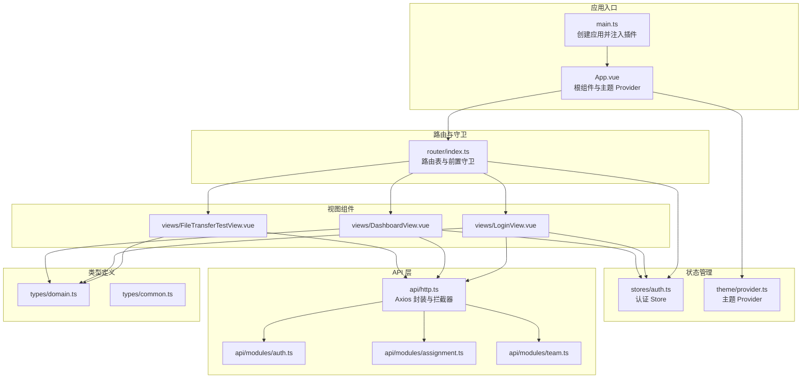
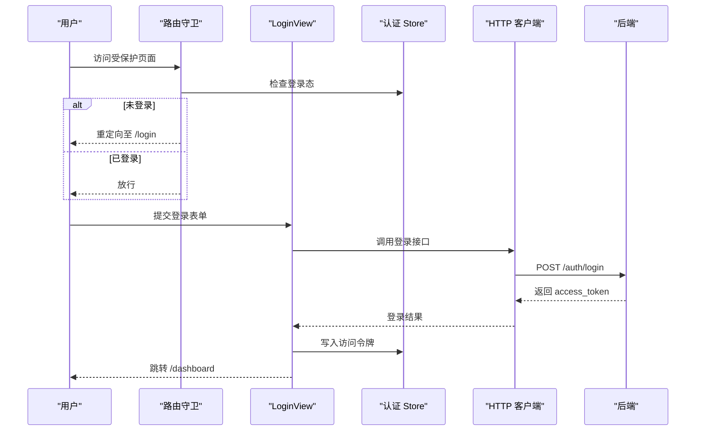
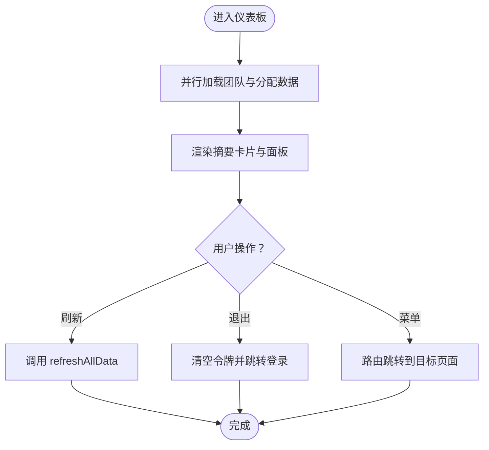
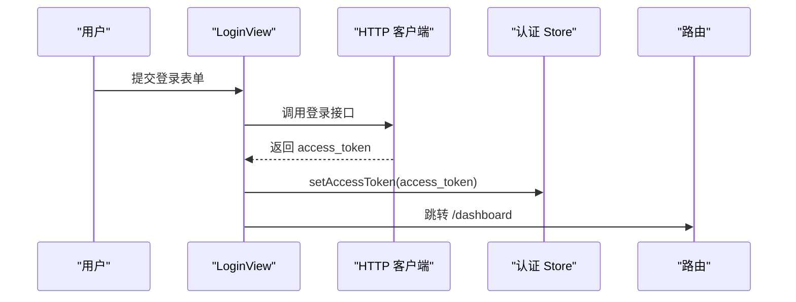
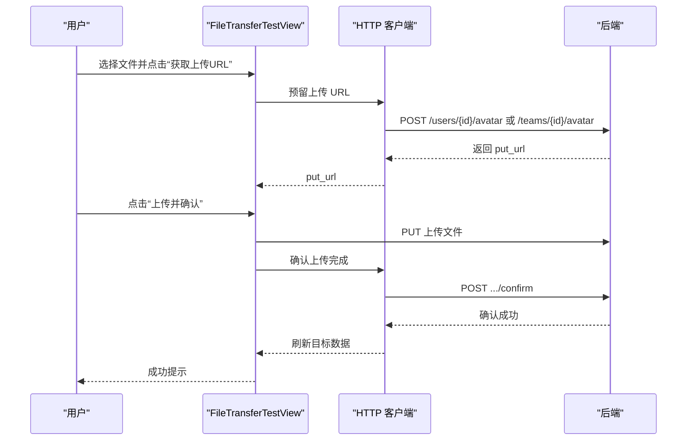
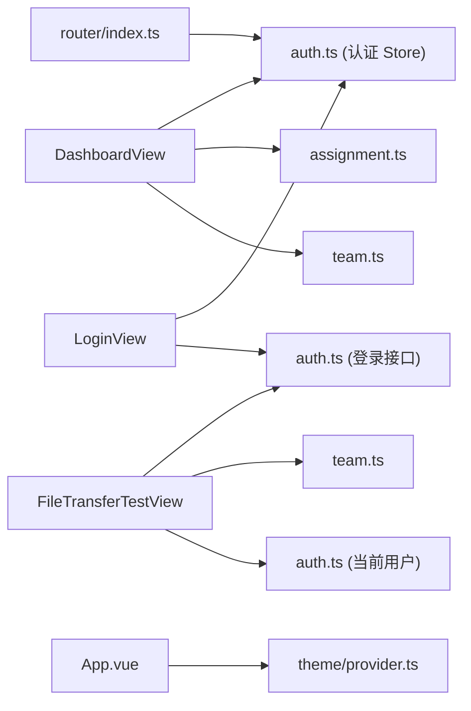

# 自定义组件

<cite>
**本文引用的文件**
- [DashboardView.vue](file://web/src/views/DashboardView.vue)
- [LoginView.vue](file://web/src/views/LoginView.vue)
- [FileTransferTestView.vue](file://web/src/views/FileTransferTestView.vue)
- [auth.ts](file://web/src/stores/auth.ts)
- [index.ts](file://web/src/router/index.ts)
- [http.ts](file://web/src/api/http.ts)
- [auth.ts](file://web/src/api/modules/auth.ts)
- [assignment.ts](file://web/src/api/modules/assignment.ts)
- [team.ts](file://web/src/api/modules/team.ts)
- [domain.ts](file://web/src/types/domain.ts)
- [common.ts](file://web/src/types/common.ts)
- [main.ts](file://web/src/main.ts)
- [App.vue](file://web/src/App.vue)
- [provider.ts](file://web/src/theme/provider.ts)
</cite>

## 目录
1. [引言](#引言)
2. [项目结构](#项目结构)
3. [核心组件](#核心组件)
4. [架构总览](#架构总览)
5. [组件详解](#组件详解)
6. [依赖关系分析](#依赖关系分析)
7. [性能考量](#性能考量)
8. [故障排查指南](#故障排查指南)
9. [结论](#结论)
10. [附录](#附录)

## 引言
本文件面向 Poprako 项目的前端自定义组件，系统性梳理三大核心视图组件的设计模式与实现细节：DashboardView 的仪表板布局、LoginView 的认证界面以及 FileTransferTestView 的文件传输测试界面。文档覆盖组件的 props 接口设计、事件发射机制、插槽使用、组件间数据流与状态管理、生命周期钩子与异步数据处理、错误边界与异常提示、以及测试与调试方法。目标是帮助开发者快速理解并高效复用这些组件。

## 项目结构
前端采用 Vue 3 + TypeScript + Pinia + Vue Router + Ant Design Vue 技术栈，遵循“视图组件 + 类型定义 + API 模块 + 状态管理 + 路由守卫”的分层组织方式。根组件负责主题 Provider 与路由容器，应用入口统一注入路由、状态与 UI 库。

图表来源
- [main.ts:1-26](file://web/src/main.ts#L1-L26)
- [App.vue:1-45](file://web/src/App.vue#L1-L45)
- [index.ts:1-59](file://web/src/router/index.ts#L1-L59)
- [auth.ts:1-52](file://web/src/stores/auth.ts#L1-L52)
- [provider.ts:1-97](file://web/src/theme/provider.ts#L1-L97)
- [DashboardView.vue:1-363](file://web/src/views/DashboardView.vue#L1-L363)
- [LoginView.vue:1-157](file://web/src/views/LoginView.vue#L1-L157)
- [FileTransferTestView.vue:1-405](file://web/src/views/FileTransferTestView.vue#L1-L405)
- [http.ts:1-196](file://web/src/api/http.ts#L1-L196)
- [auth.ts:1-157](file://web/src/api/modules/auth.ts#L1-L157)
- [assignment.ts:1-101](file://web/src/api/modules/assignment.ts#L1-L101)
- [team.ts:1-135](file://web/src/api/modules/team.ts#L1-L135)
- [domain.ts:1-89](file://web/src/types/domain.ts#L1-L89)
- [common.ts:1-41](file://web/src/types/common.ts#L1-L41)

章节来源
- [main.ts:1-26](file://web/src/main.ts#L1-L26)
- [App.vue:1-45](file://web/src/App.vue#L1-L45)
- [index.ts:1-59](file://web/src/router/index.ts#L1-L59)

## 核心组件
本节概述三大视图组件的职责与交互要点：
- DashboardView：提供仪表板布局、侧边菜单、摘要卡片、团队表格与任务列表，并支持刷新数据与退出登录。
- LoginView：提供登录表单、表单校验、提交流程与登录态更新。
- FileTransferTestView：提供上传/下载测试面板，支持用户/团队头像上传、预签名 URL 获取、上传确认与下载验证。

章节来源
- [DashboardView.vue:1-363](file://web/src/views/DashboardView.vue#L1-L363)
- [LoginView.vue:1-157](file://web/src/views/LoginView.vue#L1-L157)
- [FileTransferTestView.vue:1-405](file://web/src/views/FileTransferTestView.vue#L1-L405)

## 架构总览
组件间数据流与状态管理的关键路径如下：
- 路由守卫根据认证状态决定页面跳转，避免未登录访问受保护页面。
- 登录成功后写入访问令牌，DashboardView 与 FileTransferTestView 通过统一 HTTP 客户端自动携带 Authorization 头。
- DashboardView 使用 Pinia 认证 Store 缓存令牌并在退出时清除。
- 主题 Provider 控制全局亮/暗模式与 Ant Design Vue 主题算法。

图表来源
- [index.ts:44-56](file://web/src/router/index.ts#L44-L56)
- [auth.ts:102-109](file://web/src/api/modules/auth.ts#L102-L109)
- [http.ts:66-77](file://web/src/api/http.ts#L66-L77)
- [auth.ts:31-35](file://web/src/stores/auth.ts#L31-L35)

## 组件详解

### DashboardView 仪表板组件
- 设计模式：基于 Composition API 的单文件组件，使用模板语法与响应式数据驱动 UI 更新；通过计算属性动态生成摘要卡片与表格列。
- Props 接口设计：组件内部通过响应式引用与计算属性管理状态，未显式定义外部 props，适合内聚式布局组件。
- 事件发射机制：通过按钮点击事件触发方法，如切换侧边栏、刷新数据、退出登录；菜单点击事件通过路由跳转实现导航。
- 插槽使用：未使用具名/作用域插槽，采用默认插槽承载内容。
- 数据流向与状态管理：
  - 通过 API 模块获取团队与分配数据，使用 Promise.all 并行加载保证统计一致性。
  - 使用 Pinia 认证 Store 清除令牌并跳转登录页。
- 生命周期钩子：在 mounted 钩子中主动拉取初始数据。
- 异步数据处理：封装 refreshAllData，统一 loading 状态与错误提示。
- 错误边界与异常提示：捕获错误并以消息提示反馈；时间格式化函数对非法时间进行兜底。
- 复用策略与组合模式：可将摘要卡片、表格列与列表渲染抽象为可复用子组件，DashboardView 作为布局容器组合它们。

图表来源
- [DashboardView.vue:221-240](file://web/src/views/DashboardView.vue#L221-L240)
- [DashboardView.vue:245-248](file://web/src/views/DashboardView.vue#L245-L248)
- [DashboardView.vue:280-282](file://web/src/views/DashboardView.vue#L280-L282)

章节来源
- [DashboardView.vue:1-363](file://web/src/views/DashboardView.vue#L1-L363)
- [auth.ts:1-52](file://web/src/stores/auth.ts#L1-L52)
- [assignment.ts:77-86](file://web/src/api/modules/assignment.ts#L77-L86)
- [team.ts:78-89](file://web/src/api/modules/team.ts#L78-L89)

### LoginView 认证组件
- 设计模式：表单驱动的登录组件，使用表单校验规则与提交回调处理登录流程。
- Props 接口设计：未定义外部 props，内部通过响应式对象 loginForm 管理表单字段。
- 事件发射机制：表单 finish 事件触发 handleSubmit，内部处理提交状态与错误提示。
- 插槽使用：未使用插槽。
- 数据流向与状态管理：登录成功后写入访问令牌到 Pinia Store，并跳转到仪表板。
- 生命周期钩子：未使用生命周期钩子，表单提交即触发异步流程。
- 异步数据处理：封装登录请求，统一 loading 状态与错误提示。
- 错误边界与异常提示：捕获错误并以消息提示反馈。
- 复用策略与组合模式：可将登录表单抽象为独立组件，LoginView 作为页面容器组合它。

图表来源
- [LoginView.vue:69-82](file://web/src/views/LoginView.vue#L69-L82)
- [auth.ts:102-109](file://web/src/api/modules/auth.ts#L102-L109)
- [auth.ts:31-35](file://web/src/stores/auth.ts#L31-L35)

章节来源
- [LoginView.vue:1-157](file://web/src/views/LoginView.vue#L1-L157)
- [auth.ts:1-157](file://web/src/api/modules/auth.ts#L1-L157)
- [auth.ts:1-52](file://web/src/stores/auth.ts#L1-L52)

### FileTransferTestView 文件传输测试组件
- 设计模式：双面板布局，左侧上传测试，右侧下载测试，使用计算属性与 watch 控制可用状态与 URL 同步。
- Props 接口设计：未定义外部 props，内部通过多个响应式引用与计算属性管理上传/下载状态。
- 事件发射机制：按钮点击事件触发 reserveUploadUrl、uploadAndConfirm、downloadFile、openInNewTab 等方法；watch 监听目标类型与团队选择以同步下载 URL。
- 插槽使用：未使用插槽。
- 数据流向与状态管理：通过 API 模块获取当前用户与团队列表，预签名上传 URL，上传后确认并刷新目标数据。
- 生命周期钩子：mounted 钩子中主动拉取初始数据；watch 监听目标类型与团队选择。
- 异步数据处理：封装 reserveUploadUrl、uploadAndConfirm、downloadFile、refreshTargetData，统一 loading 状态与错误提示。
- 错误边界与异常提示：对网络错误构建 CORS 建议提示；对 HTTP 非 OK 状态抛出错误并提示。
- 复用策略与组合模式：可将上传面板与下载面板拆分为独立子组件，FileTransferTestView 作为页面容器组合它们。

图表来源
- [FileTransferTestView.vue:224-256](file://web/src/views/FileTransferTestView.vue#L224-L256)
- [FileTransferTestView.vue:282-326](file://web/src/views/FileTransferTestView.vue#L282-L326)
- [auth.ts:139-147](file://web/src/api/modules/auth.ts#L139-L147)
- [team.ts:119-127](file://web/src/api/modules/team.ts#L119-L127)

章节来源
- [FileTransferTestView.vue:1-405](file://web/src/views/FileTransferTestView.vue#L1-L405)
- [auth.ts:1-157](file://web/src/api/modules/auth.ts#L1-L157)
- [team.ts:1-135](file://web/src/api/modules/team.ts#L1-L135)

## 依赖关系分析
- 视图组件依赖：
  - DashboardView 依赖 Pinia 认证 Store、API 模块（团队与分配）、Ant Design Vue 组件与图标。
  - LoginView 依赖 API 模块（登录）、Pinia 认证 Store、路由。
  - FileTransferTestView 依赖 API 模块（用户/团队头像、当前用户资料）、路由。
- 状态与路由：
  - 路由守卫根据认证 Store 的登录态决定放行或重定向。
  - 认证 Store 与 HTTP 客户端共同维护访问令牌与请求头。
- 主题与 UI：
  - 根组件包裹 Ant Design Vue ConfigProvider，主题 Provider 控制亮/暗模式与算法。

图表来源
- [DashboardView.vue:109-111](file://web/src/views/DashboardView.vue#L109-L111)
- [LoginView.vue:54-55](file://web/src/views/LoginView.vue#L54-L55)
- [FileTransferTestView.vue:124](file://web/src/views/FileTransferTestView.vue#L124)
- [index.ts:47-56](file://web/src/router/index.ts#L47-L56)
- [auth.ts:15-51](file://web/src/stores/auth.ts#L15-L51)
- [App.vue:19-28](file://web/src/App.vue#L19-L28)
- [provider.ts:53-96](file://web/src/theme/provider.ts#L53-L96)

章节来源
- [DashboardView.vue:1-363](file://web/src/views/DashboardView.vue#L1-L363)
- [LoginView.vue:1-157](file://web/src/views/LoginView.vue#L1-L157)
- [FileTransferTestView.vue:1-405](file://web/src/views/FileTransferTestView.vue#L1-L405)
- [index.ts:1-59](file://web/src/router/index.ts#L1-L59)
- [auth.ts:1-52](file://web/src/stores/auth.ts#L1-L52)
- [App.vue:1-45](file://web/src/App.vue#L1-L45)
- [provider.ts:1-97](file://web/src/theme/provider.ts#L1-L97)

## 性能考量
- 并行加载：DashboardView 使用 Promise.all 并行获取团队与分配数据，减少首屏等待时间。
- 计算属性：通过 computed 动态生成摘要卡片与表格列，避免重复渲染。
- 请求拦截：HTTP 客户端统一注入 Authorization 头，减少重复代码与错误。
- 主题切换：主题 Provider 使用 watch 持久化用户偏好，避免频繁切换导致的样式抖动。
- 上传/下载：FileTransferTestView 对上传/下载过程设置 loading 状态，防止重复提交。

章节来源
- [DashboardView.vue:224-230](file://web/src/views/DashboardView.vue#L224-L230)
- [http.ts:66-77](file://web/src/api/http.ts#L66-L77)
- [provider.ts:80-88](file://web/src/theme/provider.ts#L80-L88)
- [FileTransferTestView.vue:282-326](file://web/src/views/FileTransferTestView.vue#L282-L326)

## 故障排查指南
- 登录失败：
  - 检查登录接口返回的错误消息，确认账号与密码正确。
  - 查看 HTTP 客户端拦截器是否正确注入 Authorization 头。
- 未登录访问受保护页面：
  - 确认路由守卫逻辑与认证 Store 的登录态。
- 上传/下载 CORS 错误：
  - FileTransferTestView 对网络错误构建 CORS 建议提示，检查对象存储桶 CORS 配置。
- 时间格式化异常：
  - DashboardView 的时间格式化函数对非法时间返回“-”，确保数据源正确。
- 主题切换无效：
  - 检查主题 Provider 的 watch 是否写入 documentElement.dataset.theme。

章节来源
- [http.ts:89-96](file://web/src/api/http.ts#L89-L96)
- [index.ts:47-56](file://web/src/router/index.ts#L47-L56)
- [FileTransferTestView.vue:312-322](file://web/src/views/FileTransferTestView.vue#L312-L322)
- [DashboardView.vue:266-275](file://web/src/views/DashboardView.vue#L266-L275)
- [provider.ts:80-88](file://web/src/theme/provider.ts#L80-L88)

## 结论
三大视图组件围绕统一的状态管理与 API 层实现了清晰的职责分离：LoginView 负责认证流程，DashboardView 负责数据聚合与导航，FileTransferTestView 负责文件传输测试。通过计算属性、watch 与并行加载优化用户体验；通过路由守卫与认证 Store 保障安全；通过主题 Provider 提供一致的视觉体验。建议进一步将公共 UI 片段抽象为可复用子组件，提升组合性与可维护性。

## 附录
- 组件复用策略建议：
  - 将摘要卡片、表格列、列表项等抽象为独立子组件，DashboardView 作为容器组合。
  - 将上传/下载面板拆分为独立子组件，FileTransferTestView 作为容器组合。
  - 将登录表单抽象为独立子组件，LoginView 作为页面容器组合。
- 测试与调试技巧：
  - 使用浏览器开发者工具断点调试异步流程，关注 Promise.all 与 watch 的触发时机。
  - 在本地存储中模拟 access_token 进行登录态测试。
  - 使用 Mock API 或代理服务模拟后端接口，隔离网络问题。
  - 对上传/下载流程添加单元测试，覆盖成功与失败分支。