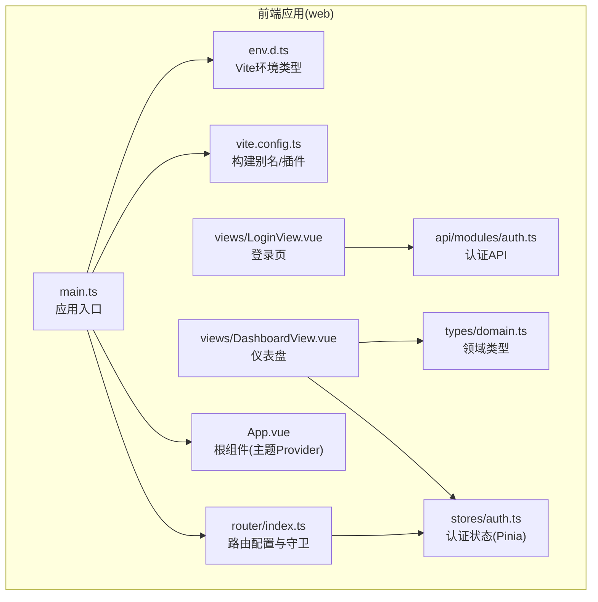
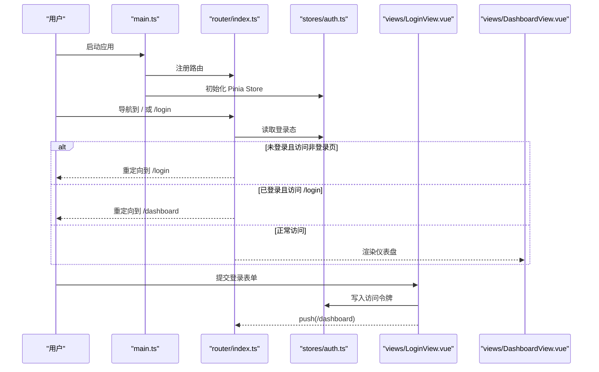
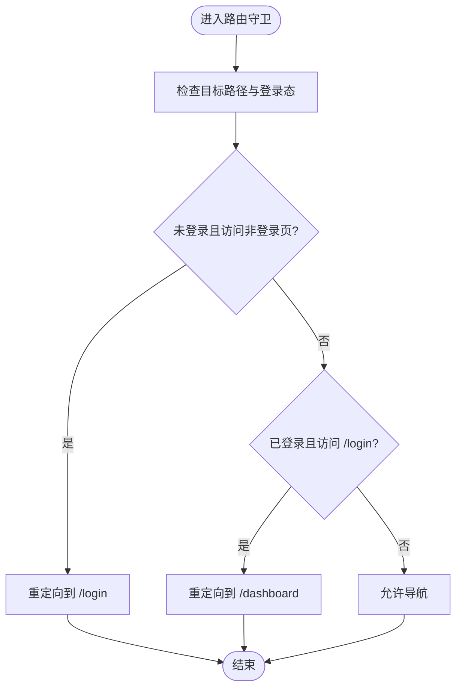
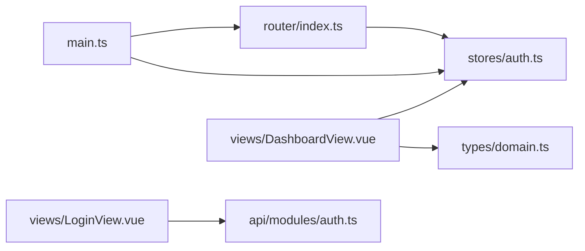

# 路由导航

<cite>
**本文引用的文件**
- [web/src/router/index.ts](file://web/src/router/index.ts)
- [web/src/main.ts](file://web/src/main.ts)
- [web/src/stores/auth.ts](file://web/src/stores/auth.ts)
- [web/src/views/LoginView.vue](file://web/src/views/LoginView.vue)
- [web/src/views/DashboardView.vue](file://web/src/views/DashboardView.vue)
- [web/src/App.vue](file://web/src/App.vue)
- [web/src/api/modules/auth.ts](file://web/src/api/modules/auth.ts)
- [web/src/types/domain.ts](file://web/src/types/domain.ts)
- [web/vite.config.ts](file://web/vite.config.ts)
- [web/src/env.d.ts](file://web/src/env.d.ts)
</cite>

## 目录
1. [简介](#简介)
2. [项目结构](#项目结构)
3. [核心组件](#核心组件)
4. [架构总览](#架构总览)
5. [详细组件分析](#详细组件分析)
6. [依赖关系分析](#依赖关系分析)
7. [性能考量](#性能考量)
8. [故障排查指南](#故障排查指南)
9. [结论](#结论)
10. [附录](#附录)

## 简介
本文件围绕 Poprako 前端路由导航系统进行系统化说明，重点覆盖以下方面：
- Vue Router 的配置与使用模式（路由定义、懒加载、历史模式）
- 路由守卫（全局前置守卫）与登录态校验
- 权限控制与路由导航的集成（基于访问令牌的简易 RBAC 思路）
- 路由参数传递、查询参数处理与路由元信息的使用建议
- SPA 导航体验优化（页面过渡动画与滚动位置恢复）
- 路由调试工具、导航历史管理与浏览器兼容性处理

## 项目结构
前端路由相关的关键文件集中在 web/src 下，采用“按功能模块”组织方式：
- 路由配置：web/src/router/index.ts
- 应用入口：web/src/main.ts
- 认证状态：web/src/stores/auth.ts
- 视图组件：web/src/views/*.vue
- API 模块：web/src/api/modules/*
- 类型定义：web/src/types/domain.ts
- 构建配置：web/vite.config.ts
- 环境类型声明：web/src/env.d.ts

图表来源
- [web/src/main.ts:1-26](file://web/src/main.ts#L1-L26)
- [web/src/router/index.ts:1-59](file://web/src/router/index.ts#L1-L59)
- [web/src/stores/auth.ts:1-52](file://web/src/stores/auth.ts#L1-L52)
- [web/src/views/LoginView.vue:1-157](file://web/src/views/LoginView.vue#L1-L157)
- [web/src/views/DashboardView.vue:1-363](file://web/src/views/DashboardView.vue#L1-L363)
- [web/src/App.vue:1-45](file://web/src/App.vue#L1-L45)
- [web/src/api/modules/auth.ts:1-157](file://web/src/api/modules/auth.ts#L1-L157)
- [web/src/types/domain.ts:1-89](file://web/src/types/domain.ts#L1-L89)
- [web/vite.config.ts:29-30](file://web/vite.config.ts#L29-L30)
- [web/src/env.d.ts:1](file://web/src/env.d.ts#L1)

章节来源
- [web/src/router/index.ts:1-59](file://web/src/router/index.ts#L1-L59)
- [web/src/main.ts:1-26](file://web/src/main.ts#L1-L26)
- [web/src/stores/auth.ts:1-52](file://web/src/stores/auth.ts#L1-L52)
- [web/src/views/LoginView.vue:1-157](file://web/src/views/LoginView.vue#L1-L157)
- [web/src/views/DashboardView.vue:1-363](file://web/src/views/DashboardView.vue#L1-L363)
- [web/src/App.vue:1-45](file://web/src/App.vue#L1-L45)
- [web/src/api/modules/auth.ts:1-157](file://web/src/api/modules/auth.ts#L1-L157)
- [web/src/types/domain.ts:1-89](file://web/src/types/domain.ts#L1-L89)
- [web/vite.config.ts:29-30](file://web/vite.config.ts#L29-L30)
- [web/src/env.d.ts:1](file://web/src/env.d.ts#L1)

## 核心组件
- 路由器实例与路由表：在路由配置中定义了根路径重定向、登录页、仪表盘与文件测试页，并启用 Web History 模式。
- 全局前置守卫：在进入任意路由前检查目标路径与登录态，未登录访问非登录页则重定向至登录页；已登录访问登录页则重定向至仪表盘。
- 认证状态管理：通过 Pinia Store 维护访问令牌与登录态，令牌持久化到本地存储。
- 视图组件：登录页负责调用认证 API 并写入令牌后跳转；仪表盘负责菜单导航、数据刷新与登出。

章节来源
- [web/src/router/index.ts:14-56](file://web/src/router/index.ts#L14-L56)
- [web/src/stores/auth.ts:15-51](file://web/src/stores/auth.ts#L15-L51)
- [web/src/views/LoginView.vue:69-82](file://web/src/views/LoginView.vue#L69-L82)
- [web/src/views/DashboardView.vue:201-248](file://web/src/views/DashboardView.vue#L201-L248)

## 架构总览
下图展示了从应用启动到路由导航、认证与视图渲染的整体流程。

图表来源
- [web/src/main.ts:16-23](file://web/src/main.ts#L16-L23)
- [web/src/router/index.ts:47-56](file://web/src/router/index.ts#L47-L56)
- [web/src/stores/auth.ts:31-43](file://web/src/stores/auth.ts#L31-L43)
- [web/src/views/LoginView.vue:69-82](file://web/src/views/LoginView.vue#L69-L82)
- [web/src/views/DashboardView.vue:201-248](file://web/src/views/DashboardView.vue#L201-L248)

## 详细组件分析

### 路由配置与懒加载
- 路由表包含根路径重定向、登录页、仪表盘与文件测试页。
- 登录页与仪表盘均采用异步组件（动态导入）实现懒加载，有利于首屏性能。
- 历史模式使用 Web History，适合现代浏览器与静态部署。

章节来源
- [web/src/router/index.ts:14-42](file://web/src/router/index.ts#L14-L42)

### 全局前置守卫与登录态校验
- 在进入任意路由前，读取认证 Store 的登录态。
- 若访问非登录页且未登录，则重定向到登录页。
- 若访问登录页且已登录，则重定向到仪表盘。
- 该守卫实现了基础的“未登录禁止访问”与“已登录禁止重复登录”的导航控制。

图表来源
- [web/src/router/index.ts:47-56](file://web/src/router/index.ts#L47-L56)
- [web/src/stores/auth.ts:26](file://web/src/stores/auth.ts#L26)

章节来源
- [web/src/router/index.ts:47-56](file://web/src/router/index.ts#L47-L56)
- [web/src/stores/auth.ts:26](file://web/src/stores/auth.ts#L26)

### 认证状态管理与令牌持久化
- 使用 Pinia Store 维护访问令牌与登录态。
- 访问令牌在本地存储中持久化，刷新页面后仍可保持登录态。
- 提供设置与清除令牌的方法，便于登录与登出流程。

章节来源
- [web/src/stores/auth.ts:15-51](file://web/src/stores/auth.ts#L15-L51)

### 登录流程与导航
- 登录页收集 QQ 与密码，调用认证 API 获取访问令牌。
- 成功后写入 Store 并跳转到仪表盘。
- 失败时提示错误信息。

章节来源
- [web/src/views/LoginView.vue:69-82](file://web/src/views/LoginView.vue#L69-L82)
- [web/src/api/modules/auth.ts:102-109](file://web/src/api/modules/auth.ts#L102-L109)

### 仪表盘导航与登出
- 仪表盘菜单支持导航到不同页面（当前示例仅保留部分入口）。
- 支持数据刷新与登出，登出时清除令牌并回到登录页。

章节来源
- [web/src/views/DashboardView.vue:201-248](file://web/src/views/DashboardView.vue#L201-L248)

### 嵌套路由与动态路由
- 当前路由表未见嵌套路由与动态路由参数定义。
- 如需扩展，可在路由表中添加子路由数组与动态段占位符，并结合路由元信息实现权限控制。

章节来源
- [web/src/router/index.ts:14-34](file://web/src/router/index.ts#L14-L34)

### 路由参数传递、查询参数与元信息
- 参数传递：可通过路由动态段与查询参数传参（当前示例未使用）。
- 查询参数：可通过编程式导航或模板语法传入。
- 路由元信息：可用于声明页面标题、权限要求等，配合守卫实现细粒度权限控制。

章节来源
- [web/src/router/index.ts:14-34](file://web/src/router/index.ts#L14-L34)

### 权限控制与路由导航集成
- 当前实现基于访问令牌存在与否进行简单访问控制。
- 建议在路由元信息中加入角色/权限字段，结合守卫对具体页面进行更细粒度的权限校验。

章节来源
- [web/src/router/index.ts:47-56](file://web/src/router/index.ts#L47-L56)
- [web/src/stores/auth.ts:26](file://web/src/stores/auth.ts#L26)

### SPA 导航体验优化
- 页面过渡动画：可在路由容器上配置过渡类名，结合 CSS 实现平滑切换。
- 滚动位置恢复：History 模式默认支持滚动位置恢复，可结合 keep-alive 与路由 meta 控制恢复策略。
- 主题切换：根组件提供主题 Provider，支持明暗主题切换，提升用户体验。

章节来源
- [web/src/App.vue:19-28](file://web/src/App.vue#L19-L28)

### 路由调试、历史管理与兼容性
- 调试：利用浏览器开发者工具的 Network 与 Sources 面板观察路由与网络请求；在守卫中打印日志辅助定位问题。
- 历史管理：History 模式支持 push/replace/go 等标准操作；注意服务端需正确配置回退。
- 兼容性：History 模式依赖 HTML5 History API；旧版 IE 可考虑 Hash 模式或引入 polyfill。

章节来源
- [web/src/router/index.ts:39-42](file://web/src/router/index.ts#L39-L42)

## 依赖关系分析
- 应用入口 main.ts 注册路由与 Pinia，确保路由守卫能访问 Store。
- 路由守卫依赖认证 Store 的登录态。
- 登录页与仪表盘分别依赖认证 API 与领域类型定义。

图表来源
- [web/src/main.ts:16-23](file://web/src/main.ts#L16-L23)
- [web/src/router/index.ts:47-56](file://web/src/router/index.ts#L47-L56)
- [web/src/stores/auth.ts:15-51](file://web/src/stores/auth.ts#L15-L51)
- [web/src/views/LoginView.vue:54-55](file://web/src/views/LoginView.vue#L54-L55)
- [web/src/views/DashboardView.vue:109-111](file://web/src/views/DashboardView.vue#L109-L111)
- [web/src/types/domain.ts:7-16](file://web/src/types/domain.ts#L7-L16)

章节来源
- [web/src/main.ts:16-23](file://web/src/main.ts#L16-L23)
- [web/src/router/index.ts:47-56](file://web/src/router/index.ts#L47-L56)
- [web/src/stores/auth.ts:15-51](file://web/src/stores/auth.ts#L15-L51)
- [web/src/views/LoginView.vue:54-55](file://web/src/views/LoginView.vue#L54-L55)
- [web/src/views/DashboardView.vue:109-111](file://web/src/views/DashboardView.vue#L109-L111)
- [web/src/types/domain.ts:7-16](file://web/src/types/domain.ts#L7-L16)

## 性能考量
- 代码分割：通过异步组件实现按需加载，降低首屏体积。
- 路由懒加载：登录页与仪表盘采用动态导入，减少初始包大小。
- 构建别名：Vite 配置了 @ 别名，便于模块解析与打包优化。

章节来源
- [web/src/router/index.ts:22-27](file://web/src/router/index.ts#L22-L27)
- [web/vite.config.ts:29-30](file://web/vite.config.ts#L29-L30)

## 故障排查指南
- 登录后无法进入仪表盘
  - 检查登录页是否正确写入访问令牌并触发导航。
  - 确认守卫逻辑未拦截正常导航。
- 已登录仍被重定向到登录页
  - 检查本地存储中是否存在有效令牌。
  - 确认 Store 的登录态计算是否正确。
- 导航异常或空白页
  - 检查路由表与组件导出是否匹配。
  - 确认 History 模式服务端回退配置。

章节来源
- [web/src/views/LoginView.vue:69-82](file://web/src/views/LoginView.vue#L69-L82)
- [web/src/stores/auth.ts:19-21](file://web/src/stores/auth.ts#L19-L21)
- [web/src/router/index.ts:47-56](file://web/src/router/index.ts#L47-L56)

## 结论
Poprako 的前端路由系统以最小实现提供了完整的登录态校验与基础导航能力。通过全局前置守卫与 Pinia Store 的结合，实现了简易但有效的访问控制。未来可在此基础上扩展嵌套路由、动态路由、路由元信息与细粒度权限控制，并结合懒加载与构建优化进一步提升性能与体验。

## 附录
- 环境类型声明：为 Vite 客户端提供 import.meta 的类型提示，避免 TS 报错。
- 构建别名：@ 指向 src 目录，简化导入路径。

章节来源
- [web/src/env.d.ts:1](file://web/src/env.d.ts#L1)
- [web/vite.config.ts:29-30](file://web/vite.config.ts#L29-L30)