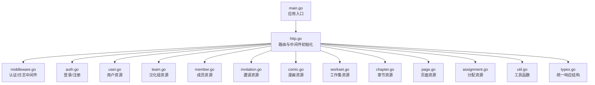
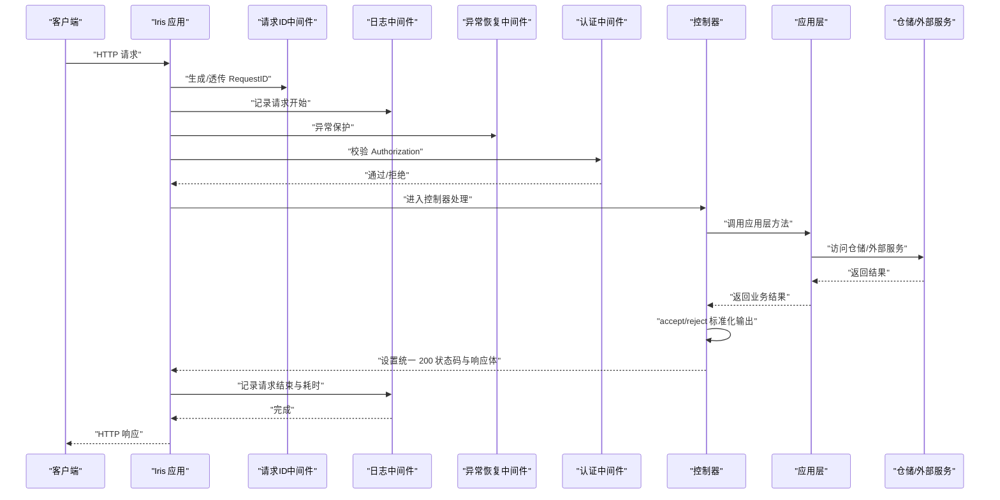
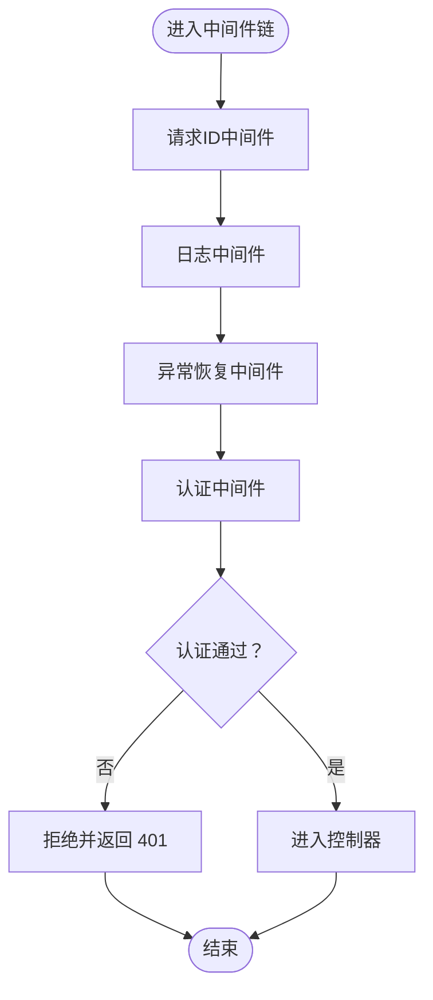
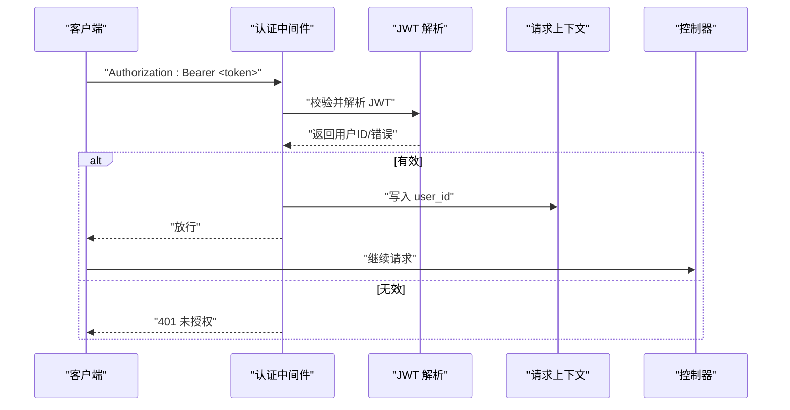
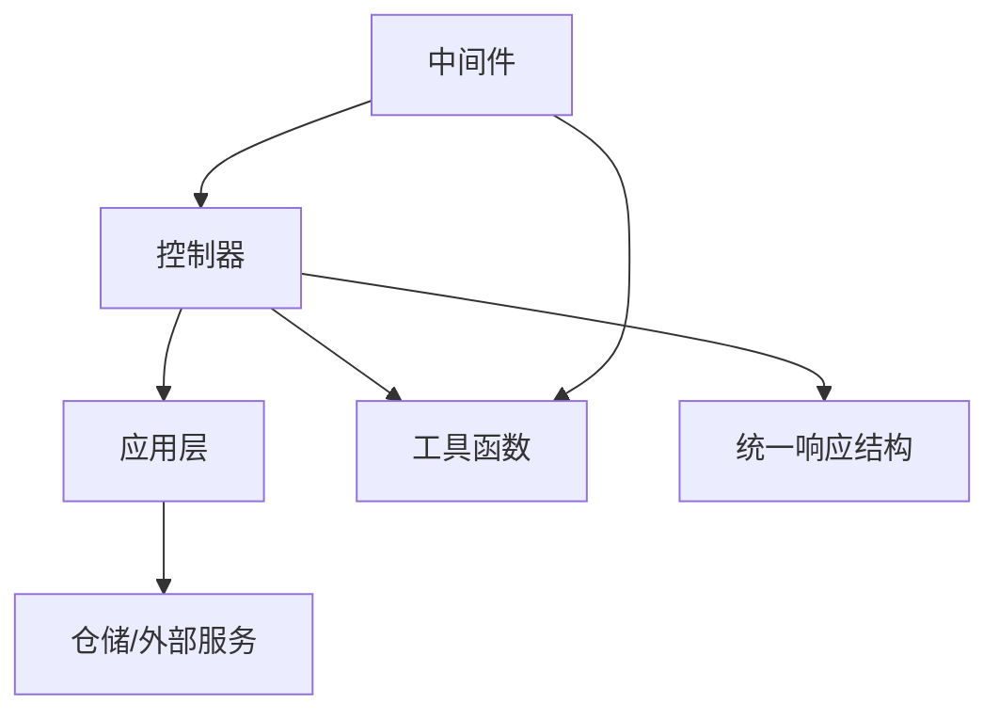

# API 接口层

<cite>
**本文引用的文件**
- [main.go](file://backend/backend-v1/main.go)
- [http.go](file://backend/backend-v1/internal/api/http/http.go)
- [middleware.go](file://backend/backend-v1/internal/api/http/middleware.go)
- [types.go](file://backend/backend-v1/internal/api/http/types.go)
- [util.go](file://backend/backend-v1/internal/api/http/util.go)
- [auth.go](file://backend/backend-v1/internal/api/http/auth.go)
- [user.go](file://backend/backend-v1/internal/api/http/user.go)
- [team.go](file://backend/backend-v1/internal/api/http/team.go)
- [member.go](file://backend/backend-v1/internal/api/http/member.go)
- [invitation.go](file://backend/backend-v1/internal/api/http/invitation.go)
- [comic.go](file://backend/backend-v1/internal/api/http/comic.go)
- [workset.go](file://backend/backend-v1/internal/api/http/workset.go)
- [chapter.go](file://backend/backend-v1/internal/api/http/chapter.go)
- [page.go](file://backend/backend-v1/internal/api/http/page.go)
- [assignment.go](file://backend/backend-v1/internal/api/http/assignment.go)
</cite>

## 目录
1. [简介](#简介)
2. [项目结构](#项目结构)
3. [核心组件](#核心组件)
4. [架构总览](#架构总览)
5. [详细组件分析](#详细组件分析)
6. [依赖分析](#依赖分析)
7. [性能考虑](#性能考虑)
8. [故障排查指南](#故障排查指南)
9. [结论](#结论)
10. [附录](#附录)

## 简介
本文件面向基于 Iris 框架的 HTTP API 接口层，系统性阐述路由设计原则、控制器架构、请求处理流程与中间件体系。文档覆盖认证中间件、日志中间件、错误处理中间件的设计与实现；解释请求参数校验、响应格式标准化与状态码管理策略；详述 JWT 认证流程、权限验证与安全防护；并提供 API 版本管理、文档生成与测试策略的实施建议。文末附带路由定义、控制器实现与中间件配置的参考路径，便于开发者快速理解与扩展。

## 项目结构
接口层位于 backend/backend-v1/internal/api/http 目录，采用“按功能域分包”的组织方式，每个领域模块对应一组路由与控制器处理函数。入口程序负责依赖注入与服务装配，随后启动 HTTP 服务器并挂载路由。

图表来源
- [main.go:25-145](file://backend/backend-v1/main.go#L25-L145)
- [http.go:16-151](file://backend/backend-v1/internal/api/http/http.go#L16-L151)

章节来源
- [main.go:25-145](file://backend/backend-v1/main.go#L25-L145)
- [http.go:16-151](file://backend/backend-v1/internal/api/http/http.go#L16-L151)

## 核心组件
- 应用入口与依赖注入
  - main.go 负责加载环境变量、配置、日志、数据库执行器与 OSS 客户端，构建各 Application 层实例，并注入到 AppState，最后启动 HTTP 服务器。
- 路由与中间件
  - http.go 定义了以 /api/v1 为前缀的路由分组，挂载全局中间件（请求 ID、日志、panic 恢复），并按领域划分子路由。
  - middleware.go 提供日志中间件与认证中间件，前者记录请求耗时与关键元信息，后者解析 Authorization 头并校验 JWT。
- 控制器与响应
  - 各领域控制器文件（如 auth.go、user.go、team.go 等）定义路由处理函数，统一读取 JSON/Query 参数，调用对应 Application 层方法，使用 accept/reject 输出标准化响应。
  - util.go 提供 accept/reject 与提取当前用户 ID 的工具函数，types.go 定义统一响应结构体。
- 文档生成
  - http.go 在非生产环境启用 Swagger UI，通过注解生成 API 文档。

章节来源
- [main.go:25-145](file://backend/backend-v1/main.go#L25-L145)
- [http.go:16-151](file://backend/backend-v1/internal/api/http/http.go#L16-L151)
- [middleware.go:15-79](file://backend/backend-v1/internal/api/http/middleware.go#L15-L79)
- [util.go:11-58](file://backend/backend-v1/internal/api/http/util.go#L11-L58)
- [types.go:3-9](file://backend/backend-v1/internal/api/http/types.go#L3-L9)

## 架构总览
下图展示从客户端到控制器、再到应用层与基础设施的整体调用链路，以及中间件在请求生命周期中的作用点。

图表来源
- [http.go:26-151](file://backend/backend-v1/internal/api/http/http.go#L26-L151)
- [middleware.go:15-79](file://backend/backend-v1/internal/api/http/middleware.go#L15-L79)
- [util.go:11-58](file://backend/backend-v1/internal/api/http/util.go#L11-L58)

## 详细组件分析

### 路由与版本管理
- 版本前缀
  - 所有路由均置于 /api/v1 下，便于未来多版本并存与平滑迁移。
- 分组策略
  - 认证路由（无需登录）置于 /api/v1/auth；
  - 其余路由通过 AuthorizeMiddleware 包裹，要求登录态。
- 领域路由
  - 用户、汉化组、成员、邀请、漫画、工作集、章节、页面、分配等资源均按 REST 风格划分子路由，遵循统一的命名与参数约定。

章节来源
- [http.go:38-151](file://backend/backend-v1/internal/api/http/http.go#L38-L151)

### 中间件系统
- 请求 ID 中间件
  - 为每个请求生成唯一标识，贯穿日志与追踪。
- 日志中间件
  - 在开发环境记录方法、路径、状态码、远端地址、请求 ID、耗时等关键信息。
- 异常恢复中间件
  - 捕获 panic，避免进程崩溃。
- 认证中间件
  - 解析 Authorization 头，校验 Bearer Token 格式与有效性，解析出用户 ID 并注入到上下文。

图表来源
- [http.go:26-36](file://backend/backend-v1/internal/api/http/http.go#L26-L36)
- [middleware.go:47-79](file://backend/backend-v1/internal/api/http/middleware.go#L47-L79)

章节来源
- [http.go:26-36](file://backend/backend-v1/internal/api/http/http.go#L26-L36)
- [middleware.go:15-79](file://backend/backend-v1/internal/api/http/middleware.go#L15-L79)

### 请求处理与响应标准化
- 请求参数读取
  - JSON 请求体通过 ReadJSON 读取，查询参数通过 ReadQuery 读取；参数解析失败统一返回 400。
- 响应格式
  - accept：统一返回 200 状态码与标准化响应体（code/message/data），业务状态码通过 code 字段表达。
  - reject：统一返回错误状态码与标准化响应体。
- 追踪与上下文
  - 通过 buildTraceScope 将 request_id 注入 TraceScope，便于日志与审计。

章节来源
- [util.go:11-58](file://backend/backend-v1/internal/api/http/util.go#L11-L58)
- [types.go:3-9](file://backend/backend-v1/internal/api/http/types.go#L3-L9)

### JWT 认证流程与权限验证
- 流程概览
  - 客户端携带 Authorization: Bearer <token> 发起请求；
  - 认证中间件解析并校验 JWT，解析出用户 ID；
  - 将用户 ID 写入上下文，后续控制器可直接提取。
- 权限验证
  - 当前实现以中间件拦截未授权访问为主；部分控制器在调用应用层前会再次校验当前用户是否为目标对象的操作者（如删除用户、更新成员角色等），并在权限不足时返回 403 或 401。
- 安全防护
  - 严格校验 Authorization 头格式；
  - 生产环境禁用 Swagger UI；
  - 统一日志与异常恢复，降低安全风险。

图表来源
- [middleware.go:47-79](file://backend/backend-v1/internal/api/http/middleware.go#L47-L79)

章节来源
- [middleware.go:47-79](file://backend/backend-v1/internal/api/http/middleware.go#L47-L79)
- [util.go:48-58](file://backend/backend-v1/internal/api/http/util.go#L48-L58)

### 认证与用户管理
- 登录/注册
  - 登录与注册接口无需登录即可访问，返回访问令牌；
  - 参数校验失败返回 400，认证失败返回 401。
- 当前用户信息
  - 通过 /users/mine 获取当前登录用户详情。

章节来源
- [auth.go:22-72](file://backend/backend-v1/internal/api/http/auth.go#L22-L72)
- [user.go:274-291](file://backend/backend-v1/internal/api/http/user.go#L274-L291)

### 汉化组与成员管理
- 汉化组
  - 支持创建、查询、更新、删除、头像上传预留与确认等操作；
  - 部分操作需管理员或相应角色权限。
- 成员
  - 支持创建成员、查询成员列表、查询当前用户成员身份、更新成员角色、通过邀请码加入、移除成员等；
  - 路径参数与请求体 ID 匹配校验，防止越权。

章节来源
- [team.go:23-288](file://backend/backend-v1/internal/api/http/team.go#L23-L288)
- [member.go:23-271](file://backend/backend-v1/internal/api/http/member.go#L23-L271)

### 邀请管理
- 列表、创建、更新（未使用）、删除邀请；
- 查询参数支持 includes 与分页；
- 删除与更新前进行权限校验。

章节来源
- [invitation.go:25-184](file://backend/backend-v1/internal/api/http/invitation.go#L25-L184)

### 漫画、工作集、章节、页面与分配
- 漫画与工作集
  - 支持分页查询、创建、更新、删除；
  - includes 参数用于嵌套关联信息查询。
- 章节
  - 支持分页查询、创建、局部更新（PATCH）、删除；
  - 局部更新时仅修改传入字段。
- 页面
  - 支持批量预留页面并返回预签名上传地址、更新单个页面、删除章节全部页面；
  - 删除接口按章节 ID 清空页面。
- 分配
  - 支持查询章节/我的分配列表、创建、更新（全量替换）、删除；
  - 需要当前用户在目标章节具备 reviewer 角色。

章节来源
- [comic.go:25-188](file://backend/backend-v1/internal/api/http/comic.go#L25-L188)
- [workset.go:25-188](file://backend/backend-v1/internal/api/http/workset.go#L25-L188)
- [chapter.go:25-184](file://backend/backend-v1/internal/api/http/chapter.go#L25-L184)
- [page.go:25-188](file://backend/backend-v1/internal/api/http/page.go#L25-L188)
- [assignment.go:25-227](file://backend/backend-v1/internal/api/http/assignment.go#L25-L227)

## 依赖分析
- 组件耦合
  - 控制器仅依赖 AppState 中的应用层实例，低耦合、高内聚；
  - 中间件与控制器之间通过 Iris 上下文传递用户 ID，避免硬编码依赖。
- 外部依赖
  - Iris v12 作为 Web 框架；
  - Swagger 用于文档生成；
  - ZAP 用于日志；
  - 应用层通过仓储与外部服务（如 OSS）交互。

图表来源
- [http.go:26-151](file://backend/backend-v1/internal/api/http/http.go#L26-L151)
- [util.go:11-58](file://backend/backend-v1/internal/api/http/util.go#L11-L58)
- [types.go:3-9](file://backend/backend-v1/internal/api/http/types.go#L3-L9)

章节来源
- [http.go:26-151](file://backend/backend-v1/internal/api/http/http.go#L26-L151)
- [util.go:11-58](file://backend/backend-v1/internal/api/http/util.go#L11-L58)
- [types.go:3-9](file://backend/backend-v1/internal/api/http/types.go#L3-L9)

## 性能考虑
- 中间件顺序
  - 请求 ID → 日志 → 异常恢复 → 认证，确保日志与追踪在异常恢复之前完成。
- 响应标准化
  - 统一 200 状态码与 code 字段承载业务状态，减少浏览器与前端解析负担。
- 日志级别
  - 开发环境记录详细信息，生产环境关闭 Swagger UI，避免敏感信息泄露。
- 并发与超时
  - 建议在网关或反向代理层配置连接数与超时，避免单点瓶颈。

## 故障排查指南
- 401 未授权
  - 检查 Authorization 头是否存在且格式为 Bearer <token>；
  - 确认 JWT 未过期且密钥正确。
- 400 请求参数错误
  - 检查 JSON 请求体与查询参数格式；
  - 确认路径参数与请求体内 ID 匹配。
- 403 权限不足
  - 确认当前用户对目标资源具备操作权限；
  - 检查应用层权限校验逻辑。
- 日志定位
  - 查看开发环境日志中的 method/path/status_code/request_id/duration 字段，结合 request_id 追踪完整链路。

章节来源
- [middleware.go:47-79](file://backend/backend-v1/internal/api/http/middleware.go#L47-L79)
- [util.go:11-58](file://backend/backend-v1/internal/api/http/util.go#L11-L58)

## 结论
该 API 接口层以 Iris 为基础，采用清晰的中间件链与领域控制器分层，实现了统一的请求处理与响应格式。通过 JWT 认证与权限校验，保障了接口的安全性；通过 Swagger 文档与注解，提升了可维护性与可测试性。建议在后续迭代中引入参数校验器、速率限制与更细粒度的权限控制，持续优化可观测性与安全性。

## 附录
- 路由定义参考
  - [路由初始化与分组:38-151](file://backend/backend-v1/internal/api/http/http.go#L38-L151)
- 中间件配置参考
  - [中间件安装与顺序:26-36](file://backend/backend-v1/internal/api/http/http.go#L26-L36)
  - [认证中间件实现:47-79](file://backend/backend-v1/internal/api/http/middleware.go#L47-L79)
  - [日志中间件实现:15-45](file://backend/backend-v1/internal/api/http/middleware.go#L15-L45)
- 控制器实现参考
  - [登录/注册:22-72](file://backend/backend-v1/internal/api/http/auth.go#L22-L72)
  - [用户资源:22-291](file://backend/backend-v1/internal/api/http/user.go#L22-L291)
  - [汉化组资源:23-288](file://backend/backend-v1/internal/api/http/team.go#L23-L288)
  - [成员资源:23-271](file://backend/backend-v1/internal/api/http/member.go#L23-L271)
  - [邀请资源:25-184](file://backend/backend-v1/internal/api/http/invitation.go#L25-L184)
  - [漫画资源:25-188](file://backend/backend-v1/internal/api/http/comic.go#L25-L188)
  - [工作集资源:25-188](file://backend/backend-v1/internal/api/http/workset.go#L25-L188)
  - [章节资源:25-184](file://backend/backend-v1/internal/api/http/chapter.go#L25-L184)
  - [页面资源:25-188](file://backend/backend-v1/internal/api/http/page.go#L25-L188)
  - [分配资源:25-227](file://backend/backend-v1/internal/api/http/assignment.go#L25-L227)
- 工具与类型参考
  - [响应标准化与追踪:11-58](file://backend/backend-v1/internal/api/http/util.go#L11-L58)
  - [统一响应结构:3-9](file://backend/backend-v1/internal/api/http/types.go#L3-L9)
- 应用入口与依赖注入参考
  - [主程序装配与启动:25-145](file://backend/backend-v1/main.go#L25-L145)