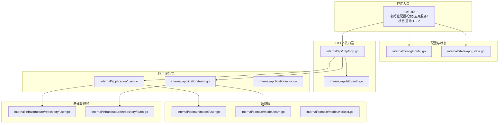
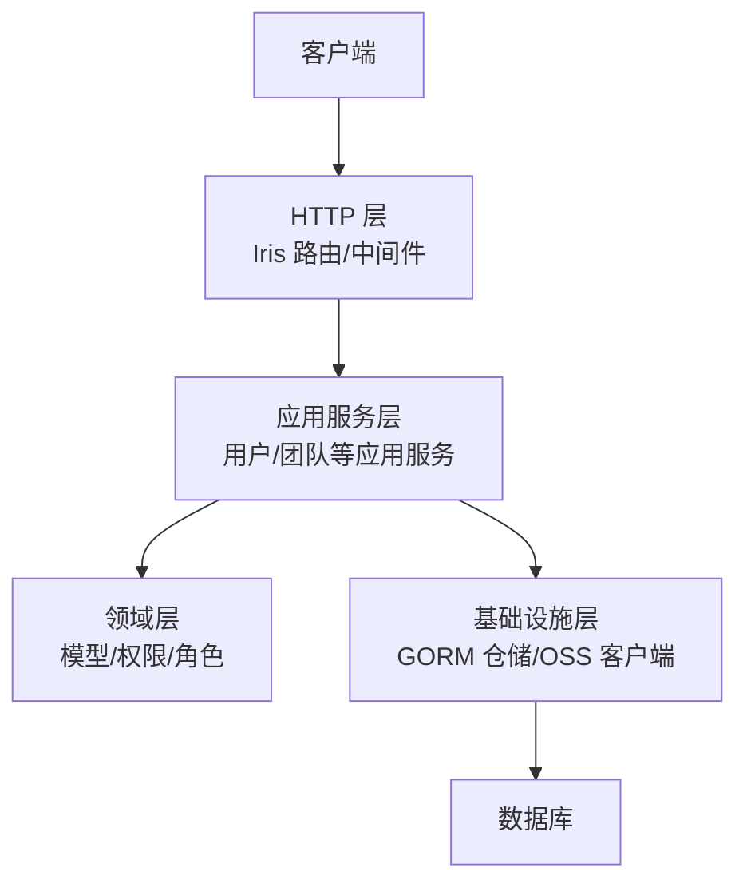
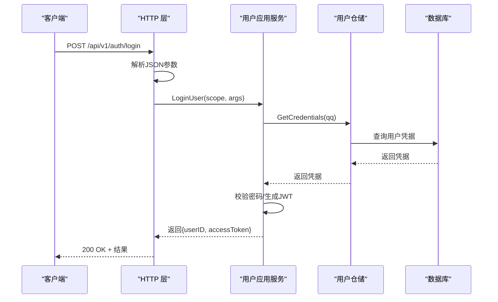
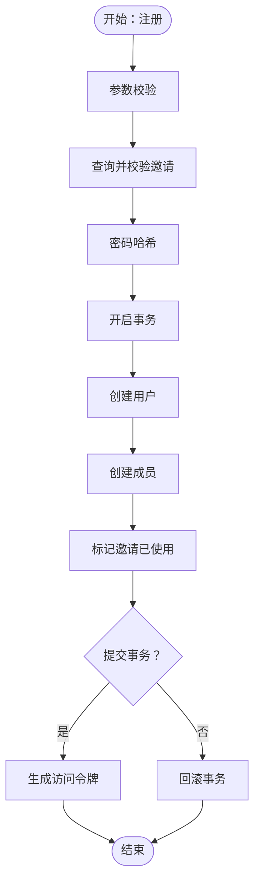
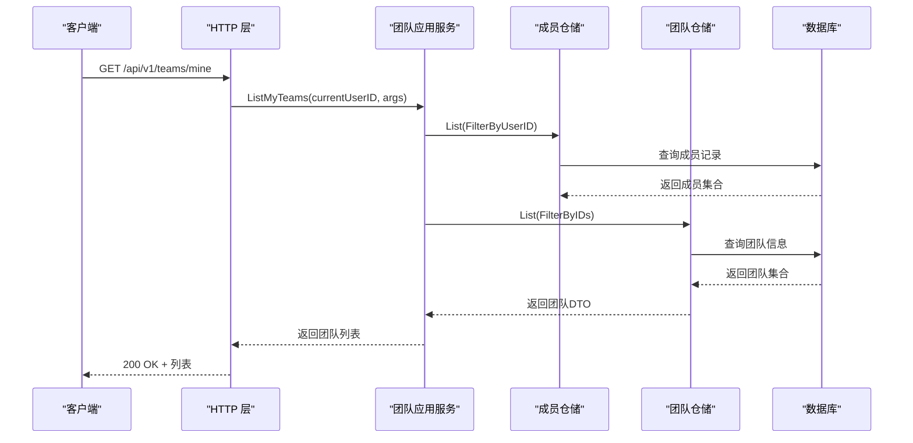
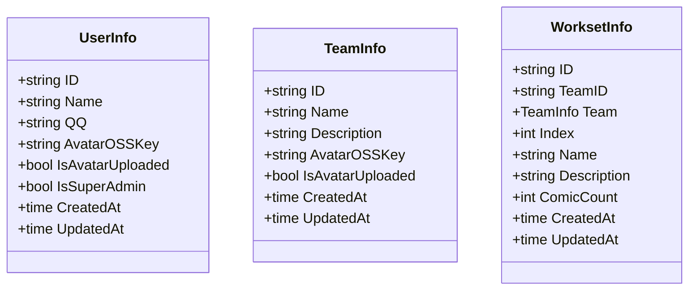
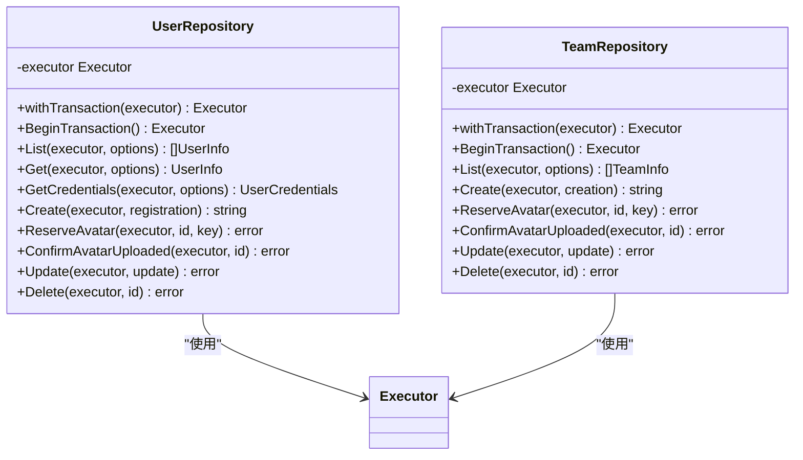
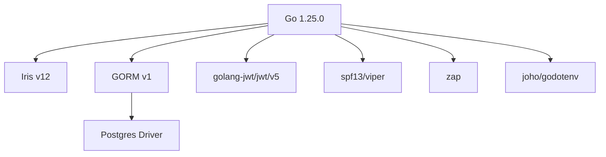

# 后端开发

<cite>
**本文引用的文件**
- [main.go](file://backend/backend-v1/main.go)
- [go.mod](file://backend/backend-v1/go.mod)
- [config.go](file://backend/backend-v1/internal/config/config.go)
- [app_state.go](file://backend/backend-v1/internal/state/app_state.go)
- [ARCHETECT.md](file://backend/backend-v1/docs/ARCHETECT.md)
- [http.go](file://backend/backend-v1/internal/api/http/http.go)
- [auth.go](file://backend/backend-v1/internal/api/http/auth.go)
- [error.go](file://backend/backend-v1/internal/application/error.go)
- [user.go](file://backend/backend-v1/internal/application/user.go)
- [team.go](file://backend/backend-v1/internal/application/team.go)
- [user.go](file://backend/backend-v1/internal/domain/model/user.go)
- [team.go](file://backend/backend-v1/internal/domain/model/team.go)
- [workset.go](file://backend/backend-v1/internal/domain/model/workset.go)
- [user.go](file://backend/backend-v1/internal/infrastructure/repository/user.go)
- [team.go](file://backend/backend-v1/internal/infrastructure/repository/team.go)
</cite>

## 目录
1. [简介](#简介)
2. [项目结构](#项目结构)
3. [核心组件](#核心组件)
4. [架构总览](#架构总览)
5. [详细组件分析](#详细组件分析)
6. [依赖分析](#依赖分析)
7. [性能考量](#性能考量)
8. [故障排查指南](#故障排查指南)
9. [结论](#结论)
10. [附录](#附录)

## 简介
本文件面向 Poprako 后端开发，围绕基于 Go 1.25.0 与 Iris 框架的实现，系统性梳理应用层、领域层、基础设施层的职责划分与交互关系；详解 GORM ORM 的使用模式与数据库操作最佳实践；说明 HTTP API 层设计（路由、中间件、认证与错误处理）；给出业务模块（用户管理、团队协作、漫画内容管理等）的实现指导；阐述仓储模式与数据访问层设计；包含 JWT 认证机制、权限控制与安全要点；并提供代码组织、命名约定与开发规范建议。

## 项目结构
后端采用“三层架构 + 应用服务”的组织方式，结合领域驱动设计（DDD）思想，将业务逻辑集中在应用层，仓储层负责数据持久化，HTTP 层负责请求接入与响应封装。核心目录与职责如下：
- internal/api/http：HTTP 接口层，Iris 路由、中间件、控制器
- internal/application：应用服务层，编排业务流程、事务控制、权限校验
- internal/domain：领域模型与服务，定义实体、值对象、权限/角色模型
- internal/infrastructure：基础设施层，GORM 仓储实现、外部服务（如 OSS）
- internal/config：配置加载
- internal/state：应用状态聚合
- internal/value：DTO/参数/结果值对象
- internal/util：工具类（UUID、时间、追踪等）

**图表来源**
- [main.go:25-145](file://backend/backend-v1/main.go#L25-L145)
- [config.go:11-59](file://backend/backend-v1/internal/config/config.go#L11-L59)
- [app_state.go:23-49](file://backend/backend-v1/internal/state/app_state.go#L23-L49)
- [http.go:16-151](file://backend/backend-v1/internal/api/http/http.go#L16-L151)
- [auth.go:22-72](file://backend/backend-v1/internal/api/http/auth.go#L22-L72)
- [user.go:106-278](file://backend/backend-v1/internal/application/user.go#L106-L278)
- [team.go:92-130](file://backend/backend-v1/internal/application/team.go#L92-L130)
- [user.go:1-100](file://backend/backend-v1/internal/domain/model/user.go#L1-L100)
- [team.go:1-63](file://backend/backend-v1/internal/domain/model/team.go#L1-L63)
- [workset.go:1-82](file://backend/backend-v1/internal/domain/model/workset.go#L1-L82)
- [user.go:12-150](file://backend/backend-v1/internal/infrastructure/repository/user.go#L12-L150)
- [team.go:12-110](file://backend/backend-v1/internal/infrastructure/repository/team.go#L12-L110)

**章节来源**
- [main.go:25-145](file://backend/backend-v1/main.go#L25-L145)
- [go.mod:3](file://backend/backend-v1/go.mod#L3)

## 核心组件
- 应用入口与依赖注入
  - 加载环境变量与配置，初始化日志、数据库执行器与各仓储实例，构造各应用服务，并注入到全局状态，最终启动 HTTP 服务器。
- 配置与状态
  - 配置加载包含服务地址、认证密钥、数据库连接等；应用状态聚合所有应用服务以便 HTTP 层按需调用。
- HTTP 层
  - 注册认证、用户、团队、成员、邀请、工作集、漫画、章节、页面、分配、单元等路由；内置请求 ID、恢复、日志中间件；Swagger UI 仅在非生产环境启用。
- 应用层
  - 用户：登录、注册、头像预留/确认、查询、更新、删除等；注册流程在事务中创建用户、成员并失效邀请码。
  - 团队：创建、查询、我的团队、头像预留/确认、更新、删除等；支持按成员关系过滤我的团队。
- 领域层
  - 用户、团队、工作集等模型定义；权限/角色模型用于鉴权。
- 基础设施层
  - GORM 仓储实现，统一处理查询选项、软删除、事务与实体映射。

**章节来源**
- [main.go:30-142](file://backend/backend-v1/main.go#L30-L142)
- [config.go:21-59](file://backend/backend-v1/internal/config/config.go#L21-L59)
- [app_state.go:8-21](file://backend/backend-v1/internal/state/app_state.go#L8-L21)
- [http.go:16-151](file://backend/backend-v1/internal/api/http/http.go#L16-L151)
- [user.go:21-104](file://backend/backend-v1/internal/application/user.go#L21-L104)
- [team.go:20-90](file://backend/backend-v1/internal/application/team.go#L20-L90)
- [user.go:1-100](file://backend/backend-v1/internal/domain/model/user.go#L1-L100)
- [team.go:1-63](file://backend/backend-v1/internal/domain/model/team.go#L1-L63)
- [workset.go:1-82](file://backend/backend-v1/internal/domain/model/workset.go#L1-L82)
- [user.go:12-150](file://backend/backend-v1/internal/infrastructure/repository/user.go#L12-L150)
- [team.go:12-110](file://backend/backend-v1/internal/infrastructure/repository/team.go#L12-L110)

## 架构总览
该系统采用“部分 DDD 三层架构”思路：
- 领域层：模型与权限/角色定义；部分领域服务以纯函数形式存在。
- 应用层：编排业务流程、事务控制、权限校验、DTO 封装。
- 基础设施层：GORM 仓储实现、外部服务（OSS）、数据库执行器。

**图表来源**
- [ARCHETECT.md:1-36](file://backend/backend-v1/docs/ARCHETECT.md#L1-L36)
- [http.go:16-151](file://backend/backend-v1/internal/api/http/http.go#L16-L151)
- [user.go:106-278](file://backend/backend-v1/internal/application/user.go#L106-L278)
- [team.go:92-130](file://backend/backend-v1/internal/application/team.go#L92-L130)
- [user.go:12-150](file://backend/backend-v1/internal/infrastructure/repository/user.go#L12-L150)
- [team.go:12-110](file://backend/backend-v1/internal/infrastructure/repository/team.go#L12-L110)

## 详细组件分析

### 组件一：HTTP API 层（Iris）
- 中间件
  - 请求 ID、日志、panic 恢复；非生产环境启用 Swagger UI。
- 路由分组
  - /api/v1 下按模块划分：认证、用户、团队、成员、邀请、工作集、漫画、章节、页面、分配、单元。
- 控制器
  - 登录/注册：读取 JSON 参数，调用应用服务，返回结果或错误。
- 错误处理
  - 统一 reject/accept 包装响应；错误码常量集中定义。

**图表来源**
- [http.go:38-49](file://backend/backend-v1/internal/api/http/http.go#L38-L49)
- [auth.go:22-40](file://backend/backend-v1/internal/api/http/auth.go#L22-L40)
- [user.go:106-154](file://backend/backend-v1/internal/application/user.go#L106-L154)
- [user.go:73-89](file://backend/backend-v1/internal/infrastructure/repository/user.go#L73-L89)

**章节来源**
- [http.go:16-167](file://backend/backend-v1/internal/api/http/http.go#L16-L167)
- [auth.go:10-73](file://backend/backend-v1/internal/api/http/auth.go#L10-L73)
- [error.go:3-7](file://backend/backend-v1/internal/application/error.go#L3-L7)

### 组件二：应用层（用户模块）
- 关键职责
  - 登录：凭据校验、生成访问令牌。
  - 注册：参数校验、邀请校验、密码哈希、事务创建用户/成员并失效邀请。
  - 头像：预留（生成预签名 PUT URL）、确认上传。
  - 查询与更新：鉴权后查询/更新用户信息。
  - 删除：鉴权后软删除。
- 事务与错误
  - 注册流程在单事务中执行，失败自动回滚。
  - 统一错误码常量，便于前端识别。

**图表来源**
- [user.go:156-278](file://backend/backend-v1/internal/application/user.go#L156-L278)
- [user.go:89-106](file://backend/backend-v1/internal/infrastructure/repository/user.go#L89-L106)

**章节来源**
- [user.go:21-104](file://backend/backend-v1/internal/application/user.go#L21-L104)
- [user.go:106-278](file://backend/backend-v1/internal/application/user.go#L106-L278)
- [user.go:12-150](file://backend/backend-v1/internal/infrastructure/repository/user.go#L12-L150)

### 组件三：应用层（团队模块）
- 关键职责
  - 创建/查询/我的团队/头像预留/确认/更新/删除。
  - 我的团队通过成员表过滤当前用户所在团队。
- 权限控制
  - 使用领域层权限模型进行鉴权，确保操作者具备相应权限。

**图表来源**
- [team.go:234-299](file://backend/backend-v1/internal/application/team.go#L234-L299)
- [team.go:12-110](file://backend/backend-v1/internal/infrastructure/repository/team.go#L12-L110)

**章节来源**
- [team.go:20-90](file://backend/backend-v1/internal/application/team.go#L20-L90)
- [team.go:92-130](file://backend/backend-v1/internal/application/team.go#L92-L130)
- [team.go:12-110](file://backend/backend-v1/internal/infrastructure/repository/team.go#L12-L110)

### 组件四：领域层（模型与权限）
- 用户模型
  - 用户基本信息、凭据、注册/更新参数等。
- 团队模型
  - 团队基本信息、创建/更新参数等。
- 工作集模型
  - 团队关联、索引、名称描述、漫画计数等。
- 权限/角色
  - 领域层定义权限检查方法，应用层在关键操作前进行鉴权。

**图表来源**
- [user.go:7-41](file://backend/backend-v1/internal/domain/model/user.go#L7-L41)
- [team.go:5-35](file://backend/backend-v1/internal/domain/model/team.go#L5-L35)
- [workset.go:5-42](file://backend/backend-v1/internal/domain/model/workset.go#L5-L42)

**章节来源**
- [user.go:1-100](file://backend/backend-v1/internal/domain/model/user.go#L1-L100)
- [team.go:1-63](file://backend/backend-v1/internal/domain/model/team.go#L1-L63)
- [workset.go:1-82](file://backend/backend-v1/internal/domain/model/workset.go#L1-L82)

### 组件五：基础设施层（GORM 仓储）
- 统一模式
  - 所有仓储共享 Executor，支持传入外部事务或使用默认执行器。
  - 查询统一追加软删除过滤条件，避免误查。
- 关键方法
  - List/Get/GetCredentials/Create/ReserveAvatar/ConfirmAvatarUploaded/Update/Delete/BeginTransaction 等。
- 实体映射
  - 仓储内部将数据库行转换为领域模型。

**图表来源**
- [user.go:12-150](file://backend/backend-v1/internal/infrastructure/repository/user.go#L12-L150)
- [team.go:12-110](file://backend/backend-v1/internal/infrastructure/repository/team.go#L12-L110)

**章节来源**
- [user.go:12-150](file://backend/backend-v1/internal/infrastructure/repository/user.go#L12-L150)
- [team.go:12-110](file://backend/backend-v1/internal/infrastructure/repository/team.go#L12-L110)

## 依赖分析
- 运行时依赖
  - Iris v12、GORM v1、Postgres 驱动、JWT、Viper、Zap、godotenv 等。
- 版本与兼容性
  - Go 1.25.0；Iris 与 Swagger 集成；GORM v1.x 驱动 Postgres。
- 外部集成
  - OSS 客户端抽象，便于替换实现（当前仓库包含 R2 OSS 客户端）。

**图表来源**
- [go.mod:3](file://backend/backend-v1/go.mod#L3)
- [go.mod:5-18](file://backend/backend-v1/go.mod#L5-L18)

**章节来源**
- [go.mod:1-113](file://backend/backend-v1/go.mod#L1-L113)

## 性能考量
- 查询优化
  - 统一软删除过滤，避免全表扫描；必要时为高频字段建立索引。
  - “我的团队”采用 N+1 查询策略，适用于中小规模数据；若团队数量增长，建议批量查询或缓存。
- 事务边界
  - 注册流程在单事务中完成，减少一致性风险；注意长事务可能带来的锁竞争。
- 缓存与预签名
  - 头像上传使用预签名 URL，降低后端压力；建议对常用资源增加 CDN 缓存。
- 日志与追踪
  - 请求 ID 中间件便于链路追踪；日志级别与字段应按环境调整。

## 故障排查指南
- 配置问题
  - 环境变量缺失（APP_ENVIRONMENT、JWT_SECRET_KEY、DATABASE_URL）会导致启动失败。
- 认证失败
  - 登录/注册返回 401/400，检查请求体格式、邀请码有效性、密码哈希是否正确。
- 权限不足
  - 返回“权限不足”，检查当前用户角色与目标资源归属关系。
- 事务异常
  - 注册失败回滚，检查数据库连接、唯一约束冲突、外键约束。
- Swagger 不可用
  - 非生产环境才会启用 Swagger UI，确认环境变量与路由路径。

**章节来源**
- [config.go:44-56](file://backend/backend-v1/internal/config/config.go#L44-L56)
- [auth.go:25-40](file://backend/backend-v1/internal/api/http/auth.go#L25-L40)
- [user.go:129-137](file://backend/backend-v1/internal/application/user.go#L129-L137)
- [team.go:151-157](file://backend/backend-v1/internal/application/team.go#L151-L157)
- [http.go:153-166](file://backend/backend-v1/internal/api/http/http.go#L153-L166)

## 结论
本后端以清晰的分层与职责划分支撑了用户、团队、漫画内容等核心业务；应用层承担编排与事务控制，仓储层屏蔽数据库细节，HTTP 层专注接口契约；配合 JWT 与权限模型，形成可扩展、可维护的架构基础。后续可在查询性能、缓存策略与可观测性方面持续优化。

## 附录

### 开发规范与命名约定
- 目录与模块
  - 按功能域划分：api/http、application、domain、infrastructure、value、util、log、state、config。
- 文件命名
  - 仓储实现以具体实体命名（如 user.go、team.go），应用服务以领域名词命名（如 user.go、team.go）。
- 接口与实现
  - 领域仓储接口与基础设施实现分离，便于替换与测试。
- 错误处理
  - 统一错误码常量与错误包装，便于前端识别与国际化。
- 配置
  - 使用 Viper 读取 JSON 配置，环境变量注入敏感信息。

### 安全与权限
- JWT
  - 登录成功生成访问令牌，有效期可配置；建议在生产环境启用 HTTPS 与安全头。
- 权限
  - 领域层定义权限模型，应用层在关键操作前进行鉴权；避免越权访问。
- 输入校验
  - HTTP 层与应用层均进行参数校验，拒绝非法输入。
- 预签名 URL
  - 头像上传使用预签名 URL，限制过期时间与范围。