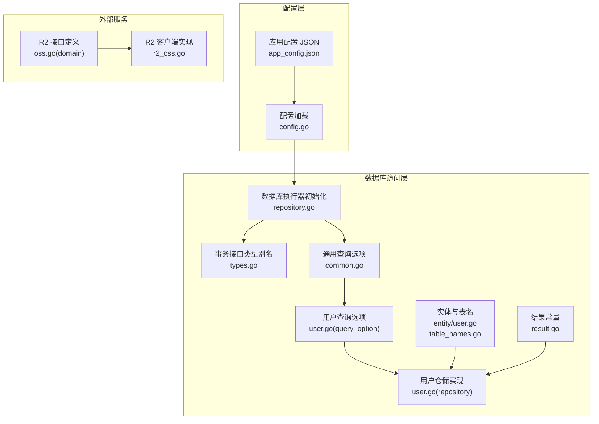
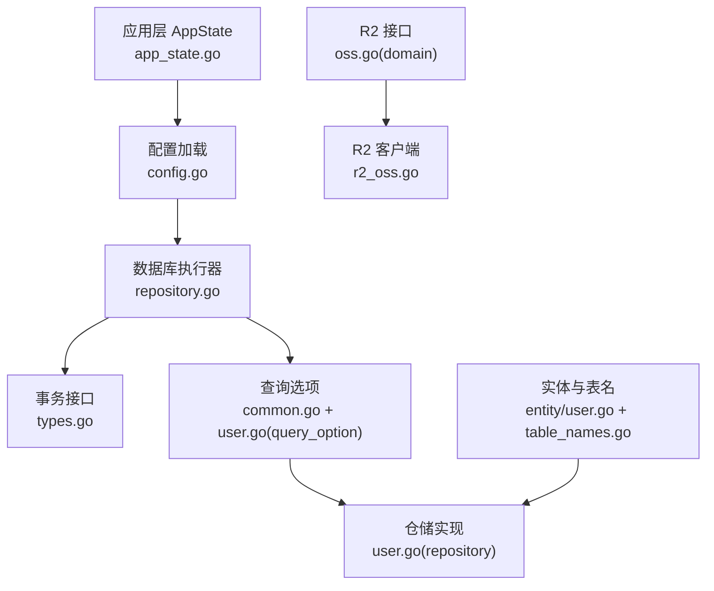
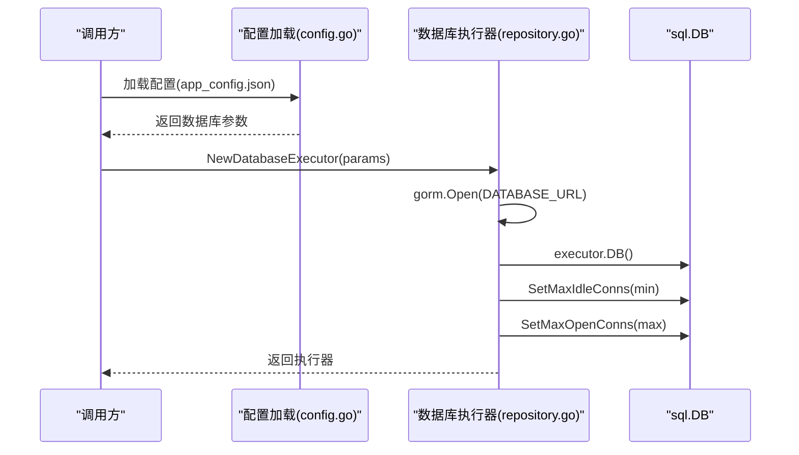
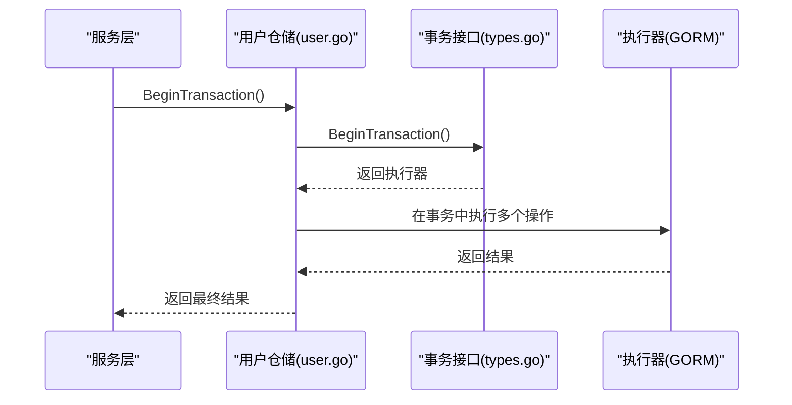
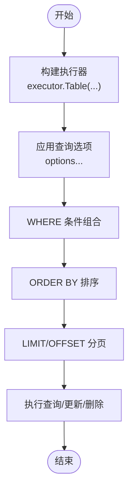
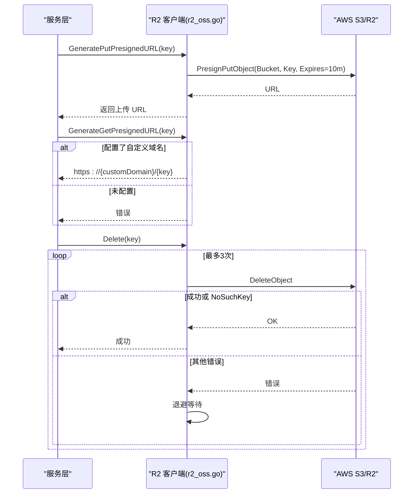
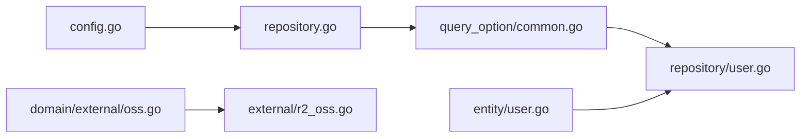

# 基础设施层

<cite>
**本文引用的文件**
- [repository.go](file://backend/backend-v1/internal/infrastructure/repository/repository.go)
- [r2_oss.go](file://backend/backend-v1/internal/infrastructure/external/r2_oss.go)
- [oss.go](file://backend/backend-v1/internal/domain/external/oss.go)
- [config.go](file://backend/backend-v1/internal/config/config.go)
- [app_config.json](file://backend/backend-v1/app_config.json)
- [types.go](file://backend/backend-v1/internal/domain/repository/types.go)
- [common.go](file://backend/backend-v1/internal/infrastructure/repository/query_option/common.go)
- [user.go](file://backend/backend-v1/internal/infrastructure/repository/user.go)
- [user.go](file://backend/backend-v1/internal/infrastructure/repository/query_option/user.go)
- [table_names.go](file://backend/backend-v1/internal/infrastructure/repository/table_names.go)
- [result.go](file://backend/backend-v1/internal/infrastructure/repository/result.go)
- [user.go](file://backend/backend-v1/internal/infrastructure/repository/entity/user.go)
- [app_state.go](file://backend/backend-v1/internal/state/app_state.go)
</cite>

## 目录
1. [引言](#引言)
2. [项目结构](#项目结构)
3. [核心组件](#核心组件)
4. [架构总览](#架构总览)
5. [详细组件分析](#详细组件分析)
6. [依赖分析](#依赖分析)
7. [性能考虑](#性能考虑)
8. [故障排查指南](#故障排查指南)
9. [结论](#结论)
10. [附录](#附录)

## 引言
本文件聚焦于基础设施层的设计与实现，系统性阐述其在整体架构中的支撑作用，涵盖以下方面：
- 数据访问与仓储模式：通用仓储接口、具体仓储实现、查询选项设计与组合式过滤。
- 数据库连接管理、事务处理与连接池配置：基于 GORM 的连接池参数化与事务封装。
- 外部服务集成：Cloudflare R2 对象存储的客户端封装，支持上传预签名 URL 生成、下载预签名 URL 生成与删除（含重试与幂等）。
- 外部 API 集成最佳实践：错误处理、重试机制与超时配置建议。
- 配置示例与使用模式：帮助开发者理解并扩展基础设施能力。

## 项目结构
基础设施层主要由以下子模块构成：
- 配置模块：负责应用配置加载与环境变量校验，提供数据库连接参数。
- 数据库访问层：GORM 初始化、连接池配置、事务接口与通用仓储实现。
- 查询选项模块：统一的查询选项函数集合，保证 SQL 安全与可组合性。
- 实体映射模块：面向不同查询场景的数据行结构与表名常量。
- 外部服务集成：R2 对象存储客户端，提供预签名 URL 生成与删除操作。

图表来源
- [config.go:11-101](file://backend/backend-v1/internal/config/config.go#L11-L101)
- [repository.go:11-30](file://backend/backend-v1/internal/infrastructure/repository/repository.go#L11-L30)
- [types.go:5-12](file://backend/backend-v1/internal/domain/repository/types.go#L5-L12)
- [common.go:15-51](file://backend/backend-v1/internal/infrastructure/repository/query_option/common.go#L15-L51)
- [user.go:1-30](file://backend/backend-v1/internal/infrastructure/repository/query_option/user.go#L1-L30)
- [user.go:1-150](file://backend/backend-v1/internal/infrastructure/repository/user.go#L1-L150)
- [user.go:9-58](file://backend/backend-v1/internal/infrastructure/repository/entity/user.go#L9-L58)
- [table_names.go:6-17](file://backend/backend-v1/internal/infrastructure/repository/table_names.go#L6-L17)
- [result.go:5](file://backend/backend-v1/internal/infrastructure/repository/result.go#L5)
- [oss.go:3-8](file://backend/backend-v1/internal/domain/external/oss.go#L3-L8)
- [r2_oss.go:29-79](file://backend/backend-v1/internal/infrastructure/external/r2_oss.go#L29-L79)

章节来源
- [config.go:11-101](file://backend/backend-v1/internal/config/config.go#L11-L101)
- [repository.go:11-30](file://backend/backend-v1/internal/infrastructure/repository/repository.go#L11-L30)
- [types.go:5-12](file://backend/backend-v1/internal/domain/repository/types.go#L5-L12)
- [common.go:15-51](file://backend/backend-v1/internal/infrastructure/repository/query_option/common.go#L15-L51)
- [user.go:1-150](file://backend/backend-v1/internal/infrastructure/repository/user.go#L1-L150)
- [oss.go:3-8](file://backend/backend-v1/internal/domain/external/oss.go#L3-L8)
- [r2_oss.go:29-79](file://backend/backend-v1/internal/infrastructure/external/r2_oss.go#L29-L79)

## 核心组件
- 数据库执行器与连接池
  - 通过 GORM 初始化 PostgreSQL 连接，并设置最小空闲连接数与最大打开连接数。
  - 提供连接池参数化配置，确保在高并发下的稳定性与资源利用率。
- 事务接口与封装
  - 将 GORM 的事务能力抽象为 Transactor 接口，便于在仓储中统一开启事务。
- 通用仓储与查询选项
  - 仓储方法接收可变数量的 QueryOption，按顺序组合 WHERE、ORDER、LIMIT/OFFSET 等条件。
  - 提供通用过滤器（如按 ID、时间排序、分页）与专用过滤器（如用户 QQ、昵称模糊匹配）。
- 实体映射与表名常量
  - 面向不同查询场景定义行结构（如用户信息、凭据、插入行），并集中管理表名常量，避免裸字符串。
- R2 对象存储客户端
  - 基于 AWS SDK v2 for Go，封装 R2 客户端与预签名客户端。
  - 支持上传/下载预签名 URL 生成、单个/批量删除（带重试与幂等处理）。

章节来源
- [repository.go:11-30](file://backend/backend-v1/internal/infrastructure/repository/repository.go#L11-L30)
- [types.go:9-12](file://backend/backend-v1/internal/domain/repository/types.go#L9-L12)
- [common.go:15-51](file://backend/backend-v1/internal/infrastructure/repository/query_option/common.go#L15-L51)
- [user.go:1-150](file://backend/backend-v1/internal/infrastructure/repository/user.go#L1-L150)
- [user.go:9-58](file://backend/backend-v1/internal/infrastructure/repository/entity/user.go#L9-L58)
- [table_names.go:6-17](file://backend/backend-v1/internal/infrastructure/repository/table_names.go#L6-L17)
- [oss.go:3-8](file://backend/backend-v1/internal/domain/external/oss.go#L3-L8)
- [r2_oss.go:29-79](file://backend/backend-v1/internal/infrastructure/external/r2_oss.go#L29-L79)

## 架构总览
基础设施层通过“配置 → 执行器 → 仓储 → 查询选项 → 实体映射”的链路完成数据持久化；通过“接口定义 → 客户端实现”的方式集成外部服务（R2）。应用层通过 AppState 统一注入各应用服务，形成清晰的依赖边界。

图表来源
- [app_state.go:23-50](file://backend/backend-v1/internal/state/app_state.go#L23-L50)
- [config.go:11-101](file://backend/backend-v1/internal/config/config.go#L11-L101)
- [repository.go:11-30](file://backend/backend-v1/internal/infrastructure/repository/repository.go#L11-L30)
- [types.go:5-12](file://backend/backend-v1/internal/domain/repository/types.go#L5-L12)
- [common.go:15-51](file://backend/backend-v1/internal/infrastructure/repository/query_option/common.go#L15-L51)
- [user.go:1-30](file://backend/backend-v1/internal/infrastructure/repository/query_option/user.go#L1-L30)
- [user.go:1-150](file://backend/backend-v1/internal/infrastructure/repository/user.go#L1-L150)
- [user.go:9-58](file://backend/backend-v1/internal/infrastructure/repository/entity/user.go#L9-L58)
- [oss.go:3-8](file://backend/backend-v1/internal/domain/external/oss.go#L3-L8)
- [r2_oss.go:29-79](file://backend/backend-v1/internal/infrastructure/external/r2_oss.go#L29-L79)

## 详细组件分析

### 数据库连接与连接池
- 初始化流程
  - 从配置加载 DATABASE_URL，使用 GORM 打开 PostgreSQL 连接。
  - 获取底层 sql.DB 并设置最小空闲连接与最大打开连接数。
- 连接池参数
  - 通过 app_config.json 的 min_idle_connections 与 max_open_connections 控制连接池规模。
- 使用模式
  - 在应用启动阶段创建全局执行器，供各仓储复用。
  - 通过 Transactor.BeginTransaction 获取事务执行器，确保一致性。

图表来源
- [repository.go:11-30](file://backend/backend-v1/internal/infrastructure/repository/repository.go#L11-L30)
- [config.go:85-100](file://backend/backend-v1/internal/config/config.go#L85-L100)
- [app_config.json:6-9](file://backend/backend-v1/app_config.json#L6-L9)

章节来源
- [repository.go:11-30](file://backend/backend-v1/internal/infrastructure/repository/repository.go#L11-L30)
- [config.go:85-100](file://backend/backend-v1/internal/config/config.go#L85-L100)
- [app_config.json:6-9](file://backend/backend-v1/app_config.json#L6-L9)

### 事务处理
- 接口抽象
  - Transactor 接口提供 BeginTransaction 方法，返回 GORM 执行器，便于后续链式调用。
- 仓储中的使用
  - 仓储方法内部通过 withTransaction 判断是否传入外部执行器（事务上下文）。
  - 若未传入，则使用默认执行器；若传入则复用该执行器，实现跨多个仓储操作的事务一致性。

图表来源
- [types.go:9-12](file://backend/backend-v1/internal/domain/repository/types.go#L9-L12)
- [user.go:28-30](file://backend/backend-v1/internal/infrastructure/repository/user.go#L28-L30)

章节来源
- [types.go:9-12](file://backend/backend-v1/internal/domain/repository/types.go#L9-L12)
- [user.go:20-30](file://backend/backend-v1/internal/infrastructure/repository/user.go#L20-L30)

### 仓储模式与查询选项
- 通用仓储接口
  - 仓储方法接收 Executor 与可变 QueryOption，按序组合查询条件。
- 通用查询选项
  - FilterByID、FilterByIDs：基于主表 id 精确/批量过滤。
  - CreatedAtDesc/Asc、UpdatedAtDesc：按时间字段排序。
  - Paginate：分页偏移与限制。
- 用户专属查询选项
  - FilterByQQ：按 QQ 精确匹配。
  - FilterByFuzzyName：按昵称模糊匹配。
- 实体映射与表名
  - 通过实体行结构与表名常量，避免裸字符串，提升可维护性与安全性。

图表来源
- [common.go:15-51](file://backend/backend-v1/internal/infrastructure/repository/query_option/common.go#L15-L51)
- [user.go:15-30](file://backend/backend-v1/internal/infrastructure/repository/query_option/user.go#L15-L30)
- [user.go:32-87](file://backend/backend-v1/internal/infrastructure/repository/user.go#L32-L87)

章节来源
- [common.go:15-51](file://backend/backend-v1/internal/infrastructure/repository/query_option/common.go#L15-L51)
- [user.go:15-30](file://backend/backend-v1/internal/infrastructure/repository/query_option/user.go#L15-L30)
- [user.go:32-87](file://backend/backend-v1/internal/infrastructure/repository/user.go#L32-L87)
- [table_names.go:6-17](file://backend/backend-v1/internal/infrastructure/repository/table_names.go#L6-L17)
- [user.go:9-58](file://backend/backend-v1/internal/infrastructure/repository/entity/user.go#L9-L58)

### Cloudflare R2 对象存储集成
- 客户端初始化
  - 从环境变量读取 R2_ACCOUNT_ID、R2_ACCESS_KEY_ID、R2_SECRET_ACCESS_KEY、R2_REGION、R2_BUCKET_NAME、R2_CUSTOM_DOMAIN。
  - 使用静态凭证与自定义 BaseEndpoint 指向 R2 端点。
- 功能实现
  - 上传预签名 URL：生成 PutObject 预签名链接，默认有效期 10 分钟，自动根据扩展名设置 Content-Type。
  - 下载预签名 URL：优先使用自定义域名；若未配置则返回错误。
  - 删除对象：单个与批量删除，内置最多 3 次重试与 500ms 退避，忽略 NoSuchKey 错误，确保幂等。
- 错误处理与重试
  - 对 NoSuchKey 类型错误进行特殊处理，视为成功返回。
  - 其他错误在达到最大重试次数后汇总返回。

图表来源
- [r2_oss.go:29-79](file://backend/backend-v1/internal/infrastructure/external/r2_oss.go#L29-L79)
- [r2_oss.go:81-99](file://backend/backend-v1/internal/infrastructure/external/r2_oss.go#L81-L99)
- [r2_oss.go:101-107](file://backend/backend-v1/internal/infrastructure/external/r2_oss.go#L101-L107)
- [r2_oss.go:109-140](file://backend/backend-v1/internal/infrastructure/external/r2_oss.go#L109-L140)
- [r2_oss.go:142-198](file://backend/backend-v1/internal/infrastructure/external/r2_oss.go#L142-L198)

章节来源
- [r2_oss.go:29-79](file://backend/backend-v1/internal/infrastructure/external/r2_oss.go#L29-L79)
- [r2_oss.go:81-99](file://backend/backend-v1/internal/infrastructure/external/r2_oss.go#L81-L99)
- [r2_oss.go:101-107](file://backend/backend-v1/internal/infrastructure/external/r2_oss.go#L101-L107)
- [r2_oss.go:109-140](file://backend/backend-v1/internal/infrastructure/external/r2_oss.go#L109-L140)
- [r2_oss.go:142-198](file://backend/backend-v1/internal/infrastructure/external/r2_oss.go#L142-L198)
- [oss.go:3-8](file://backend/backend-v1/internal/domain/external/oss.go#L3-L8)

### 应用状态与依赖注入
- AppState 将应用层所需的服务聚合，便于在启动阶段一次性注入。
- 基础设施层通过 NewDatabaseExecutor 与 R2 客户端工厂方法提供实例，再由应用层注入到 AppState。

章节来源
- [app_state.go:23-50](file://backend/backend-v1/internal/state/app_state.go#L23-L50)
- [repository.go:11-30](file://backend/backend-v1/internal/infrastructure/repository/repository.go#L11-L30)
- [r2_oss.go:29-79](file://backend/backend-v1/internal/infrastructure/external/r2_oss.go#L29-L79)

## 依赖分析
- 内聚与耦合
  - 仓储层对查询选项与实体映射有强依赖，但通过接口与常量降低耦合。
  - R2 客户端与 AWS SDK 解耦，通过接口对外暴露能力。
- 外部依赖
  - GORM（PostgreSQL）、AWS SDK v2 for Go（S3/R2）。
- 循环依赖
  - 未发现循环导入；配置、执行器、仓储与实体之间为单向依赖。

图表来源
- [config.go:11-101](file://backend/backend-v1/internal/config/config.go#L11-L101)
- [repository.go:11-30](file://backend/backend-v1/internal/infrastructure/repository/repository.go#L11-L30)
- [common.go:15-51](file://backend/backend-v1/internal/infrastructure/repository/query_option/common.go#L15-L51)
- [user.go:1-150](file://backend/backend-v1/internal/infrastructure/repository/user.go#L1-L150)
- [user.go:9-58](file://backend/backend-v1/internal/infrastructure/repository/entity/user.go#L9-L58)
- [oss.go:3-8](file://backend/backend-v1/internal/domain/external/oss.go#L3-L8)
- [r2_oss.go:29-79](file://backend/backend-v1/internal/infrastructure/external/r2_oss.go#L29-L79)

章节来源
- [config.go:11-101](file://backend/backend-v1/internal/config/config.go#L11-L101)
- [repository.go:11-30](file://backend/backend-v1/internal/infrastructure/repository/repository.go#L11-L30)
- [common.go:15-51](file://backend/backend-v1/internal/infrastructure/repository/query_option/common.go#L15-L51)
- [user.go:1-150](file://backend/backend-v1/internal/infrastructure/repository/user.go#L1-L150)
- [user.go:9-58](file://backend/backend-v1/internal/infrastructure/repository/entity/user.go#L9-L58)
- [oss.go:3-8](file://backend/backend-v1/internal/domain/external/oss.go#L3-L8)
- [r2_oss.go:29-79](file://backend/backend-v1/internal/infrastructure/external/r2_oss.go#L29-L79)

## 性能考虑
- 连接池
  - 合理设置最小空闲连接与最大打开连接，避免频繁创建/销毁连接带来的开销。
  - 在高并发场景下，适当提高 max_open_connections，同时监控数据库负载。
- 查询优化
  - 使用 FilterByID、FilterByIDs 等精确过滤，减少扫描范围。
  - 为高频查询列建立索引（如 user_table.qq、user_table.created_at）。
- R2 传输
  - 上传预签名 URL 有效期短（默认 10 分钟），避免长时间占用带宽。
  - 批量删除时尽量合并请求，减少网络往返。

## 故障排查指南
- 数据库连接失败
  - 检查 DATABASE_URL 是否正确，确认连接池参数是否合理。
  - 查看连接池状态与慢查询日志，定位阻塞原因。
- 记录不存在
  - 使用 ErrRecordNotFound 常量判断查询结果，避免误判。
- R2 删除失败
  - 关注 NoSuchKey 错误是否被正确忽略；其他错误需检查权限与键名。
  - 如批量删除出现部分失败，记录非 NoSuchKey 的错误列表以便重试或人工干预。

章节来源
- [repository.go:25-26](file://backend/backend-v1/internal/infrastructure/repository/repository.go#L25-L26)
- [result.go:5](file://backend/backend-v1/internal/infrastructure/repository/result.go#L5)
- [r2_oss.go:126-130](file://backend/backend-v1/internal/infrastructure/external/r2_oss.go#L126-L130)
- [r2_oss.go:171-182](file://backend/backend-v1/internal/infrastructure/external/r2_oss.go#L171-L182)

## 结论
基础设施层通过明确的职责划分与抽象接口，实现了数据访问与外部服务集成的稳定与可扩展性。结合统一的查询选项与实体映射，仓储层具备良好的可测试性与可维护性；R2 客户端在错误处理与重试方面提供了生产级保障。建议在实际部署中完善监控与告警，持续优化连接池与查询性能。

## 附录
- 配置示例（app_config.json）
  - server_address：服务监听地址
  - auth.expiration_hours：令牌过期小时数
  - database.min_idle_connections：最小空闲连接
  - database.max_open_connections：最大打开连接
- 环境变量
  - APP_ENVIRONMENT：应用环境（development/production）
  - DATABASE_URL：数据库连接串
  - JWT_SECRET_KEY：JWT 密钥
  - R2_ACCOUNT_ID、R2_ACCESS_KEY_ID、R2_SECRET_ACCESS_KEY、R2_REGION、R2_BUCKET_NAME、R2_CUSTOM_DOMAIN：R2 凭证与域名配置

章节来源
- [app_config.json:1-11](file://backend/backend-v1/app_config.json#L1-L11)
- [config.go:44-47](file://backend/backend-v1/internal/config/config.go#L44-L47)
- [config.go:92-95](file://backend/backend-v1/internal/config/config.go#L92-L95)
- [config.go:75-78](file://backend/backend-v1/internal/config/config.go#L75-L78)
- [r2_oss.go:30-53](file://backend/backend-v1/internal/infrastructure/external/r2_oss.go#L30-L53)