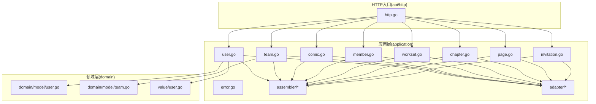
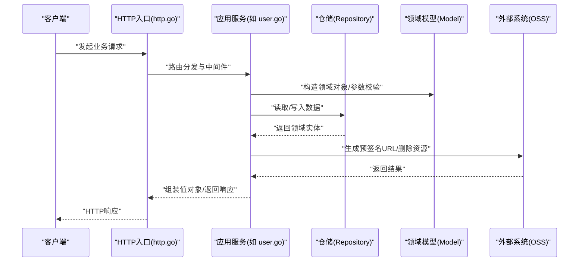
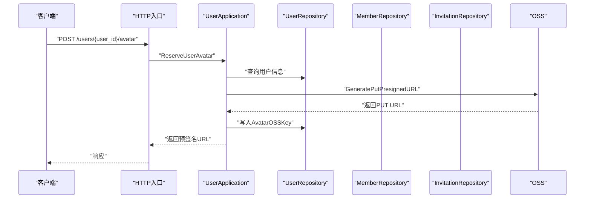
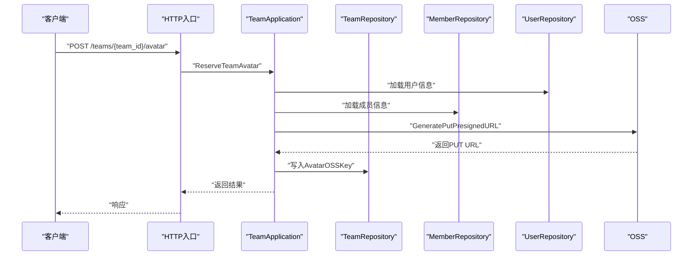
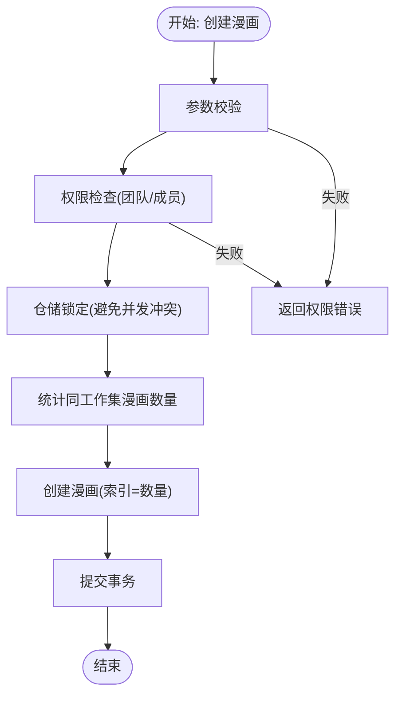
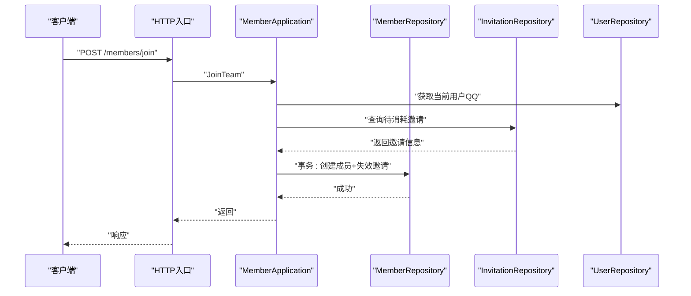
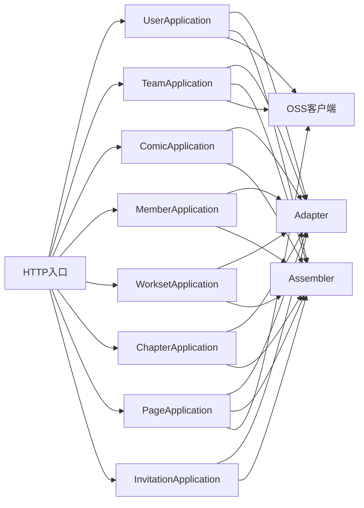

# 应用层设计

<cite>
**本文引用的文件**
- [backend/backend-v1/internal/application/user.go](file://backend/backend-v1/internal/application/user.go)
- [backend/backend-v1/internal/application/team.go](file://backend/backend-v1/internal/application/team.go)
- [backend/backend-v1/internal/application/comic.go](file://backend/backend-v1/internal/application/comic.go)
- [backend/backend-v1/internal/application/member.go](file://backend/backend-v1/internal/application/member.go)
- [backend/backend-v1/internal/application/workset.go](file://backend/backend-v1/internal/application/workset.go)
- [backend/backend-v1/internal/application/chapter.go](file://backend/backend-v1/internal/application/chapter.go)
- [backend/backend-v1/internal/application/page.go](file://backend/backend-v1/internal/application/page.go)
- [backend/backend-v1/internal/application/invitation.go](file://backend/backend-v1/internal/application/invitation.go)
- [backend/backend-v1/internal/application/error.go](file://backend/backend-v1/internal/application/error.go)
- [backend/backend-v1/internal/api/http/http.go](file://backend/backend-v1/internal/api/http/http.go)
- [backend/backend-v1/internal/application/assembler/user.go](file://backend/backend-v1/internal/application/assembler/user.go)
- [backend/backend-v1/internal/application/adapter/loader.go](file://backend/backend-v1/internal/application/adapter/loader.go)
- [backend/backend-v1/internal/domain/model/user.go](file://backend/backend-v1/internal/domain/model/user.go)
- [backend/backend-v1/internal/domain/model/team.go](file://backend/backend-v1/internal/domain/model/team.go)
- [backend/backend-v1/internal/value/user.go](file://backend/backend-v1/internal/value/user.go)
</cite>

## 目录
1. [引言](#引言)
2. [项目结构](#项目结构)
3. [核心组件](#核心组件)
4. [架构总览](#架构总览)
5. [详细组件分析](#详细组件分析)
6. [依赖分析](#依赖分析)
7. [性能考虑](#性能考虑)
8. [故障排查指南](#故障排查指南)
9. [结论](#结论)
10. [附录](#附录)

## 引言
本文件系统性阐述应用层在 DDD 架构中的职责与设计原则，聚焦于业务用例的编排、领域模型的协调与外部系统的交互。应用层负责：
- 封装业务规则与流程，统一错误处理与事务边界
- 协调多个仓储与服务，完成跨实体的业务编排
- 对外暴露清晰的接口契约，屏蔽底层实现细节
- 与基础设施层（如 OSS）协作，完成资源管理与外部集成

本文将结合用户管理、团队协作、漫画内容管理等模块，给出最佳实践与实现要点。

## 项目结构
应用层位于 backend/backend-v1/internal/application，按业务域划分文件，每个域包含：
- 应用服务接口与实现：如 user.go、team.go、comic.go 等
- 值对象与参数校验：位于 internal/value 下
- 领域模型：位于 internal/domain/model 下
- 组装器与适配器：assembler 与 adapter 目录
- HTTP 入口：internal/api/http/http.go 定义路由与中间件

图表来源
- [backend/backend-v1/internal/api/http/http.go:26-151](file://backend/backend-v1/internal/api/http/http.go#L26-L151)
- [backend/backend-v1/internal/application/user.go:1-104](file://backend/backend-v1/internal/application/user.go#L1-L104)
- [backend/backend-v1/internal/application/team.go:1-90](file://backend/backend-v1/internal/application/team.go#L1-L90)
- [backend/backend-v1/internal/application/comic.go:1-74](file://backend/backend-v1/internal/application/comic.go#L1-L74)
- [backend/backend-v1/internal/application/member.go:1-82](file://backend/backend-v1/internal/application/member.go#L1-L82)
- [backend/backend-v1/internal/application/workset.go:1-70](file://backend/backend-v1/internal/application/workset.go#L1-L70)
- [backend/backend-v1/internal/application/chapter.go:1-80](file://backend/backend-v1/internal/application/chapter.go#L1-L80)
- [backend/backend-v1/internal/application/page.go:1-91](file://backend/backend-v1/internal/application/page.go#L1-L91)
- [backend/backend-v1/internal/application/invitation.go:1-69](file://backend/backend-v1/internal/application/invitation.go#L1-L69)
- [backend/backend-v1/internal/application/assembler/user.go:1-34](file://backend/backend-v1/internal/application/assembler/user.go#L1-L34)
- [backend/backend-v1/internal/application/adapter/loader.go:1-71](file://backend/backend-v1/internal/application/adapter/loader.go#L1-L71)
- [backend/backend-v1/internal/domain/model/user.go:1-100](file://backend/backend-v1/internal/domain/model/user.go#L1-L100)
- [backend/backend-v1/internal/domain/model/team.go:1-63](file://backend/backend-v1/internal/domain/model/team.go#L1-L63)
- [backend/backend-v1/internal/value/user.go:1-171](file://backend/backend-v1/internal/value/user.go#L1-L171)

章节来源
- [backend/backend-v1/internal/api/http/http.go:26-151](file://backend/backend-v1/internal/api/http/http.go#L26-L151)

## 核心组件
应用层的核心职责包括：
- 业务用例编排：将多个仓储与服务组合，形成完整的业务流程
- 权限与审计：统一进行权限检查与日志追踪
- 事务与一致性：在跨实体写入时使用事务保证一致性
- 外部系统集成：与 OSS 等外部系统协作，生成预签名 URL 或删除资源
- 值对象组装：将领域模型转换为对外暴露的值对象

章节来源
- [backend/backend-v1/internal/application/user.go:106-154](file://backend/backend-v1/internal/application/user.go#L106-L154)
- [backend/backend-v1/internal/application/team.go:92-130](file://backend/backend-v1/internal/application/team.go#L92-L130)
- [backend/backend-v1/internal/application/comic.go:149-246](file://backend/backend-v1/internal/application/comic.go#L149-L246)
- [backend/backend-v1/internal/application/member.go:340-447](file://backend/backend-v1/internal/application/member.go#L340-L447)
- [backend/backend-v1/internal/application/workset.go:128-213](file://backend/backend-v1/internal/application/workset.go#L128-L213)
- [backend/backend-v1/internal/application/chapter.go:82-165](file://backend/backend-v1/internal/application/chapter.go#L82-L165)
- [backend/backend-v1/internal/application/page.go:93-187](file://backend/backend-v1/internal/application/page.go#L93-L187)
- [backend/backend-v1/internal/application/invitation.go:133-213](file://backend/backend-v1/internal/application/invitation.go#L133-L213)

## 架构总览
应用层在 DDD 中处于“用例编排”的位置，向上承接 HTTP 层请求，向下协调领域模型与仓储，向外集成外部系统。其典型交互如下：

图表来源
- [backend/backend-v1/internal/api/http/http.go:26-151](file://backend/backend-v1/internal/api/http/http.go#L26-L151)
- [backend/backend-v1/internal/application/user.go:106-154](file://backend/backend-v1/internal/application/user.go#L106-L154)
- [backend/backend-v1/internal/application/assembler/user.go:10-33](file://backend/backend-v1/internal/application/assembler/user.go#L10-L33)
- [backend/backend-v1/internal/application/adapter/loader.go:10-70](file://backend/backend-v1/internal/application/adapter/loader.go#L10-L70)

## 详细组件分析

### 用户管理应用服务
用户管理应用服务负责登录、注册、头像预留与确认、信息更新与删除等用例。其关键点：
- 登录：参数校验 → 查询凭证 → 密码校验 → 生成访问令牌
- 注册：参数校验 → 校验邀请 → 事务内创建用户/成员并标记邀请失效 → 生成访问令牌
- 头像：生成预签名 PUT URL 并预留 OSS Key，后续确认上传完成
- 权限：统一使用 PermUserXxx 检查，支持超级管理员与普通用户差异

图表来源
- [backend/backend-v1/internal/application/user.go:426-468](file://backend/backend-v1/internal/application/user.go#L426-L468)
- [backend/backend-v1/internal/application/assembler/user.go:10-33](file://backend/backend-v1/internal/application/assembler/user.go#L10-L33)
- [backend/backend-v1/internal/application/adapter/loader.go:10-14](file://backend/backend-v1/internal/application/adapter/loader.go#L10-L14)

章节来源
- [backend/backend-v1/internal/application/user.go:106-154](file://backend/backend-v1/internal/application/user.go#L106-L154)
- [backend/backend-v1/internal/application/user.go:156-278](file://backend/backend-v1/internal/application/user.go#L156-L278)
- [backend/backend-v1/internal/application/user.go:426-555](file://backend/backend-v1/internal/application/user.go#L426-L555)

### 团队协作应用服务
团队协作应用服务负责团队的创建、列表、头像管理与更新删除等用例。关键点：
- 创建团队：鉴权 → 创建团队 → 返回团队 ID
- 头像预留：生成预签名 PUT URL 并预留 OSS Key
- 权限：统一使用 PermTeamXxx 检查，支持成员与拥有者权限

图表来源
- [backend/backend-v1/internal/application/team.go:186-232](file://backend/backend-v1/internal/application/team.go#L186-L232)
- [backend/backend-v1/internal/application/adapter/loader.go:16-24](file://backend/backend-v1/internal/application/adapter/loader.go#L16-L24)

章节来源
- [backend/backend-v1/internal/application/team.go:92-130](file://backend/backend-v1/internal/application/team.go#L92-L130)
- [backend/backend-v1/internal/application/team.go:186-232](file://backend/backend-v1/internal/application/team.go#L186-L232)
- [backend/backend-v1/internal/application/team.go:301-380](file://backend/backend-v1/internal/application/team.go#L301-L380)

### 漫画内容管理应用服务
漫画内容管理应用服务覆盖工作集、漫画、章节、页面与分配等模块，统一遵循：
- 权限检查：基于成员角色与团队上下文
- 事务：在并发控制与一致性要求高的场景使用事务
- 并发控制：通过仓储层的 LockByXxx 与 Count 实现有序索引
- 外部系统：OSS 预签名 URL 与批量删除

图表来源
- [backend/backend-v1/internal/application/comic.go:149-246](file://backend/backend-v1/internal/application/comic.go#L149-L246)

章节来源
- [backend/backend-v1/internal/application/comic.go:76-147](file://backend/backend-v1/internal/application/comic.go#L76-L147)
- [backend/backend-v1/internal/application/comic.go:149-246](file://backend/backend-v1/internal/application/comic.go#L149-L246)
- [backend/backend-v1/internal/application/comic.go:248-353](file://backend/backend-v1/internal/application/comic.go#L248-L353)

### 成员与邀请应用服务
成员应用服务负责成员创建、列表、角色更新、移除与加入团队等用例；邀请应用服务负责邀请列表、创建、更新与删除。关键点：
- 加入团队：校验邀请 → 事务内创建成员并标记邀请失效
- 邀请创建：去重检查（同一团队已存在的 QQ）→ 生成唯一邀请码 → 创建邀请
- 权限：统一使用 PermMemberXxx 与 PermInvitationXxx 检查

图表来源
- [backend/backend-v1/internal/application/member.go:340-447](file://backend/backend-v1/internal/application/member.go#L340-L447)
- [backend/backend-v1/internal/application/invitation.go:133-213](file://backend/backend-v1/internal/application/invitation.go#L133-L213)

章节来源
- [backend/backend-v1/internal/application/member.go:340-447](file://backend/backend-v1/internal/application/member.go#L340-L447)
- [backend/backend-v1/internal/application/invitation.go:133-213](file://backend/backend-v1/internal/application/invitation.go#L133-L213)

### 页面与分配应用服务
页面应用服务负责页面预留（批量）、列表、更新与按章节批量删除；分配应用服务负责任务分配的查询与更新。关键点：
- 批量预留：先创建页面记录 → 生成预签名 URL → 提交事务
- 批量删除：锁定章节 → 查询页面 → 删除记录与 OSS 资源 → 提交事务
- 权限：基于分配关系与章节/漫画/工作集上下文

章节来源
- [backend/backend-v1/internal/application/page.go:93-187](file://backend/backend-v1/internal/application/page.go#L93-L187)
- [backend/backend-v1/internal/application/page.go:313-401](file://backend/backend-v1/internal/application/page.go#L313-L401)

## 依赖分析
应用层的依赖关系主要体现在：
- 接口与实现解耦：每个应用服务定义接口并在内部实现，便于测试与替换
- 适配器与组装器：adapter 提供领域模型加载函数，assembler 负责值对象组装
- 外部系统：OSS 客户端用于生成预签名 URL 与批量删除
- HTTP 入口：集中路由与中间件，统一鉴权与日志

图表来源
- [backend/backend-v1/internal/api/http/http.go:26-151](file://backend/backend-v1/internal/api/http/http.go#L26-L151)
- [backend/backend-v1/internal/application/adapter/loader.go:10-70](file://backend/backend-v1/internal/application/adapter/loader.go#L10-L70)
- [backend/backend-v1/internal/application/assembler/user.go:10-33](file://backend/backend-v1/internal/application/assembler/user.go#L10-L33)

章节来源
- [backend/backend-v1/internal/application/adapter/loader.go:1-71](file://backend/backend-v1/internal/application/adapter/loader.go#L1-L71)
- [backend/backend-v1/internal/application/assembler/user.go:1-34](file://backend/backend-v1/internal/application/assembler/user.go#L1-L34)

## 性能考虑
- 事务与并发控制：在需要保持顺序索引与一致性的场景（如创建漫画/章节/工作集），使用仓储层的锁定与计数，避免竞态条件
- 批量操作：页面批量删除时，先查询再批量删除记录与 OSS 资源，减少往返次数
- 预签名 URL：在事务内生成 PUT URL，确保资源预留与记录写入的一致性
- 查询优化：通过 IncludeXxx 与分页参数，按需加载关联信息，降低网络与序列化开销
- 日志与追踪：统一使用 TraceScope 记录关键路径日志，便于定位性能瓶颈

## 故障排查指南
- 参数校验失败：检查 value.*Args 的 Validate 方法，确保必填字段与格式约束
- 权限不足：核对 PermXxx 检查链路，确认当前用户在目标团队/工作集/漫画/章节中的角色
- 事务回滚：关注 defer 中的回滚日志，定位具体失败步骤
- 外部系统异常：OSS 预签名 URL 生成失败或批量删除失败，检查密钥与权限配置
- 内部错误码：统一使用 ErrInternalError 表示服务端内部逻辑错误

章节来源
- [backend/backend-v1/internal/application/error.go:1-8](file://backend/backend-v1/internal/application/error.go#L1-L8)
- [backend/backend-v1/internal/application/user.go:112-115](file://backend/backend-v1/internal/application/user.go#L112-L115)
- [backend/backend-v1/internal/application/team.go:112-118](file://backend/backend-v1/internal/application/team.go#L112-L118)
- [backend/backend-v1/internal/application/comic.go:189-203](file://backend/backend-v1/internal/application/comic.go#L189-L203)
- [backend/backend-v1/internal/application/page.go:123-137](file://backend/backend-v1/internal/application/page.go#L123-L137)

## 结论
应用层在 DDD 架构中承担“用例编排”的关键角色，通过统一的权限检查、事务管理与外部系统集成，保障业务流程的正确性与一致性。各业务模块的实现遵循相同的模式：参数校验 → 权限检查 → 事务/并发控制 → 领域模型与仓储交互 → 值对象组装与返回。建议在新增模块时复用现有模式，确保风格一致与可维护性。

## 附录
- 值对象与领域模型映射：应用层通过 assembler 将领域模型转换为对外暴露的值对象，适配器提供加载函数，确保权限检查与上下文信息的准确传递
- HTTP 路由：集中于 http.go，按业务域划分子路由，统一鉴权中间件与日志中间件

章节来源
- [backend/backend-v1/internal/application/assembler/user.go:10-33](file://backend/backend-v1/internal/application/assembler/user.go#L10-L33)
- [backend/backend-v1/internal/application/adapter/loader.go:10-70](file://backend/backend-v1/internal/application/adapter/loader.go#L10-L70)
- [backend/backend-v1/internal/api/http/http.go:26-151](file://backend/backend-v1/internal/api/http/http.go#L26-L151)