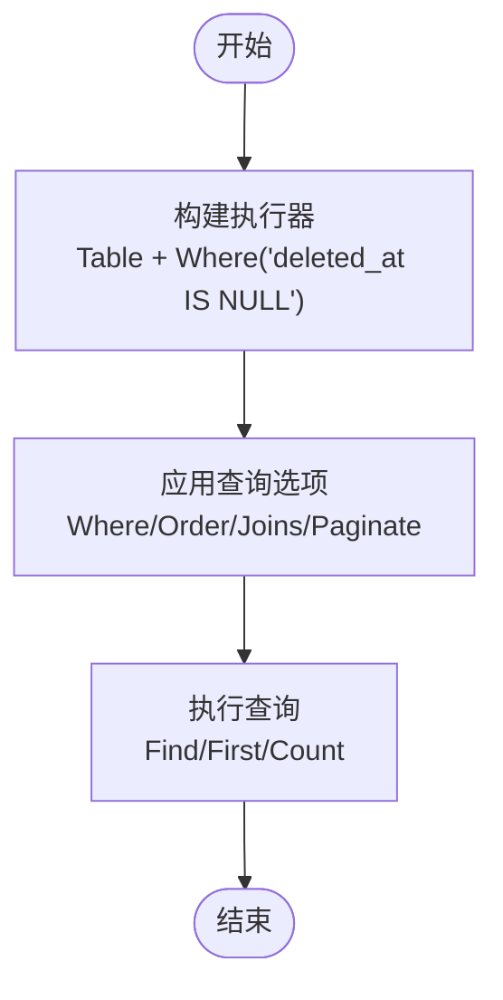
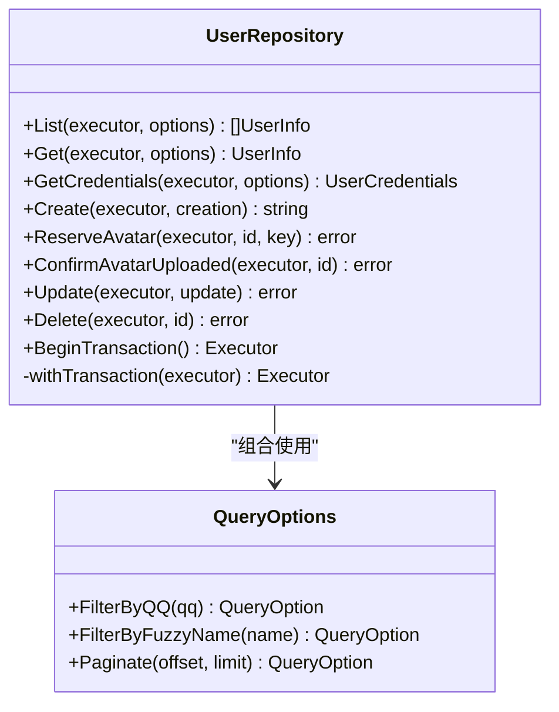
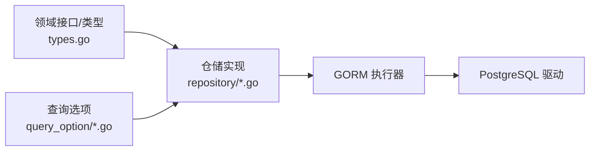

# 数据访问层

<cite>
**本文引用的文件**
- [repository.go](file://backend/backend-v1/internal/infrastructure/repository/repository.go)
- [result.go](file://backend/backend-v1/internal/infrastructure/repository/result.go)
- [table_names.go](file://backend/backend-v1/internal/infrastructure/repository/table_names.go)
- [types.go](file://backend/backend-v1/internal/domain/repository/types.go)
- [common.go](file://backend/backend-v1/internal/infrastructure/repository/query_option/common.go)
- [user.go](file://backend/backend-v1/internal/infrastructure/repository/query_option/user.go)
- [team.go](file://backend/backend-v1/internal/infrastructure/repository/query_option/team.go)
- [comic.go](file://backend/backend-v1/internal/infrastructure/repository/query_option/comic.go)
- [chapter.go](file://backend/backend-v1/internal/infrastructure/repository/query_option/chapter.go)
- [page.go](file://backend/backend-v1/internal/infrastructure/repository/query_option/page.go)
- [user.go](file://backend/backend-v1/internal/infrastructure/repository/user.go)
- [team.go](file://backend/backend-v1/internal/infrastructure/repository/team.go)
- [comic.go](file://backend/backend-v1/internal/infrastructure/repository/comic.go)
- [chapter.go](file://backend/backend-v1/internal/infrastructure/repository/chapter.go)
- [page.go](file://backend/backend-v1/internal/infrastructure/repository/page.go)
- [assignment.go](file://backend/backend-v1/internal/infrastructure/repository/assignment.go)
- [member.go](file://backend/backend-v1/internal/infrastructure/repository/member.go)
- [invitation.go](file://backend/backend-v1/internal/infrastructure/repository/invitation.go)
- [workset.go](file://backend/backend-v1/internal/infrastructure/repository/workset.go)
- [unit.go](file://backend/backend-v1/internal/infrastructure/repository/unit.go)
- [config.go](file://backend/backend-v1/internal/config/config.go)
- [assignment.go](file://backend/backend-v1/internal/infrastructure/repository/query_option/assignment.go)
- [member.go](file://backend/backend-v1/internal/infrastructure/repository/query_option/member.go)
- [invitation.go](file://backend/backend-v1/internal/infrastructure/repository/query_option/invitation.go)
- [workset.go](file://backend/backend-v1/internal/infrastructure/repository/query_option/workset.go)
- [unit.go](file://backend/backend-v1/internal/infrastructure/repository/query_option/unit.go)
- [assignment.go](file://backend/backend-v1/internal/infrastructure/repository/entity/assignment.go)
- [member.go](file://backend/backend-v1/internal/infrastructure/repository/entity/member.go)
- [invitation.go](file://backend/backend-v1/internal/infrastructure/repository/entity/invitation.go)
- [workset.go](file://backend/backend-v1/internal/infrastructure/repository/entity/workset.go)
- [unit.go](file://backend/backend-v1/internal/infrastructure/repository/entity/unit.go)
- [assignment.go](file://backend/backend-v1/internal/domain/model/assignment.go)
- [member.go](file://backend/backend-v1/internal/domain/model/member.go)
- [invitation.go](file://backend/backend-v1/internal/domain/model/invitation.go)
- [workset.go](file://backend/backend-v1/internal/domain/model/workset.go)
- [unit.go](file://backend/backend-v1/internal/domain/model/unit.go)
- [assignment.go](file://backend/backend-v1/internal/application/assembler/assignment.go)
- [member.go](file://backend/backend-v1/internal/application/assembler/member.go)
- [invitation.go](file://backend/backend-v1/internal/application/assembler/invitation.go)
- [workset.go](file://backend/backend-v1/internal/application/assembler/workset.go)
- [unit.go](file://backend/backend-v1/internal/application/assembler/unit.go)
- [assignment.go](file://backend/backend-v1/internal/infrastructure/repository/assignment.go)
- [member.go](file://backend/backend-v1/internal/infrastructure/repository/member.go)
- [invitation.go](file://backend/backend-v1/internal/infrastructure/repository/invitation.go)
- [workset.go](file://backend/backend-v1/internal/infrastructure/repository/workset.go)
- [unit.go](file://backend/backend-v1/internal/infrastructure/repository/unit.go)
- [assignment.go](file://backend/backend-v1/internal/infrastructure/repository/query_option/assignment.go)
- [member.go](file://backend/backend-v1/internal/infrastructure/repository/query_option/member.go)
- [invitation.go](file://backend/backend-v1/internal/infrastructure/repository/query_option/invitation.go)
- [workset.go](file://backend/backend-v1/internal/infrastructure/repository/query_option/workset.go)
- [unit.go](file://backend/backend-v1/internal/infrastructure/repository/query_option/unit.go)
- [assignment.go](file://backend/backend-v1/internal/infrastructure/repository/entity/assignment.go)
- [member.go](file://backend/backend-v1/internal/infrastructure/repository/entity/member.go)
- [invitation.go](file://backend/backend-v1/internal/infrastructure/repository/entity/invitation.go)
- [workset.go](file://backend/backend-v1/internal/infrastructure/repository/entity/workset.go)
- [unit.go](file://backend/backend-v1/internal/infrastructure/repository/entity/unit.go)
- [assignment.go](file://backend/backend-v1/internal/domain/model/assignment.go)
- [member.go](file://backend/backend-v1/internal/domain/model/member.go)
- [invitation.go](file://backend/backend-v1/internal/domain/model/invitation.go)
- [workset.go](file://backend/backend-v1/internal/domain/model/workset.go)
- [unit.go](file://backend/backend-v1/internal/domain/model/unit.go)
- [assignment.go](file://backend/backend-v1/internal/application/assembler/assignment.go)
- [member.go](file://backend/backend-v1/internal/application/assembler/member.go)
- [invitation.go](file://backend/backend-v1/internal/application/assembler/invitation.go)
- [workset.go](file://backend/backend-v1/internal/application/assembler/workset.go)
- [unit.go](file://backend/backend-v1/internal/application/assembler/unit.go)
- [20260306101211_workset-table.up.sql](file://backend/backend-v1/migrations/20260306101211_workset-table.up.sql)
- [20260306101212_comic-table.up.sql](file://backend/backend-v1/migrations/20260306101212_comic-table.up.sql)
- [20260306101213_chapter-table.up.sql](file://backend/backend-v1/migrations/20260306101213_chapter-table.up.sql)
- [20260306101214_page-table.up.sql](file://backend/backend-v1/migrations/20260306101214_page-table.up.sql)
- [20260306101215_assignment-table.up.sql](file://backend/backend-v1/migrations/20260306101215_assignment-table.up.sql)
- [20260306101216_unit-table.up.sql](file://backend/backend-v1/migrations/20260306101216_unit-table.up.sql)
- [20260301075641_member-table.up.sql](file://backend/backend-v1/migrations/20260301075641_member-table.up.sql)
- [20260301075642_invitation-table.up.sql](file://backend/backend-v1/migrations/20260301075642_invitation-table.up.sql)
- [20260301065010_features-enable.up.sql](file://backend/backend-v1/migrations/20260301065010_features-enable.up.sql)
- [20260301065022_user-table.up.sql](file://backend/backend-v1/migrations/20260301065022_user-table.up.sql)
- [20260301065012_team-table.up.sql](file://backend/backend-v1/migrations/20260301065012_team-table.up.sql)
</cite>

## 目录
1. [引言](#引言)
2. [项目结构](#项目结构)
3. [核心组件](#核心组件)
4. [架构总览](#架构总览)
5. [详细组件分析](#详细组件分析)
6. [依赖分析](#依赖分析)
7. [性能考量](#性能考量)
8. [故障排查指南](#故障排查指南)
9. [结论](#结论)
10. [附录](#附录)

## 引言
本文件系统性梳理基于 GORM 的数据访问层（Data Access Layer, DAL），覆盖查询构建策略、仓储模式实现、事务管理、连接池配置、性能监控、复杂查询（多表关联、子查询、聚合）、N+1 优化与缓存策略，以及数据库迁移与版本控制。目标是帮助开发者在不直接阅读源码的情况下，也能快速理解并正确使用 DAL。

## 项目结构
数据访问层主要由以下层次构成：
- 领域层接口与类型：定义统一的仓储接口、执行器类型与查询选项函数签名。
- 基础设施层实现：GORM 连接初始化、连接池配置、错误常量导出、表名常量导出。
- 查询选项层：按实体维度提供可组合的查询选项（过滤、排序、分页、联表聚合）。
- 仓储实现层：每个实体对应一个仓储实现，封装 CRUD、统计、锁记录等操作。
- 实体与模型：领域模型与数据库实体之间的映射与转换。
- 应用装配层：将仓储结果装配为应用服务所需的领域模型。
- 迁移脚本：按版本号管理数据库结构演进。

```mermaid
graph TB
subgraph "领域层"
DTypes["领域类型与接口<br/>types.go"]
end
subgraph "基础设施层"
RepoExec["数据库执行器初始化<br/>repository.go"]
ConnPool["连接池配置<br/>repository.go"]
ErrConst["错误常量导出<br/>result.go"]
TblNames["表名常量导出<br/>table_names.go"]
end
subgraph "查询选项层"
QCommon["通用查询选项<br/>query_option/common.go"]
QUser["用户查询选项<br/>query_option/user.go"]
QTeam["团队查询选项<br/>query_option/team.go"]
QComic["漫画查询选项<br/>query_option/comic.go"]
QChapter["章节查询选项<br/>query_option/chapter.go"]
QPage["页面查询选项<br/>query_option/page.go"]
QAss["作业查询选项<br/>query_option/assignment.go"]
QMem["成员查询选项<br/>query_option/member.go"]
QInv["邀请查询选项<br/>query_option/invitation.go"]
QWk["工作集查询选项<br/>query_option/workset.go"]
QUn["单元查询选项<br/>query_option/unit.go"]
end
subgraph "仓储实现层"
RUser["用户仓储实现<br/>repository/user.go"]
RTeam["团队仓储实现<br/>repository/team.go"]
RComic["漫画仓储实现<br/>repository/comic.go"]
RChapter["章节仓储实现<br/>repository/chapter.go"]
RPage["页面仓储实现<br/>repository/page.go"]
RAss["作业仓储实现<br/>repository/assignment.go"]
RMem["成员仓储实现<br/>repository/member.go"]
RInv["邀请仓储实现<br/>repository/invitation.go"]
RWk["工作集仓储实现<br/>repository/workset.go"]
RUn["单元仓储实现<br/>repository/unit.go"]
end
subgraph "实体与模型"
EAss["实体/作业<br/>entity/assignment.go"]
EMem["实体/成员<br/>entity/member.go"]
EInv["实体/邀请<br/>entity/invitation.go"]
EWk["实体/工作集<br/>entity/workset.go"]
EUn["实体/单元<br/>entity/unit.go"]
MAss["模型/作业<br/>model/assignment.go"]
MMem["模型/成员<br/>model/member.go"]
MInv["模型/邀请<br/>model/invitation.go"]
MWk["模型/工作集<br/>model/workset.go"]
MUn["模型/单元<br/>model/unit.go"]
AsmAss["装配器/作业<br/>assembler/assignment.go"]
AsmMem["装配器/成员<br/>assembler/member.go"]
AsmInv["装配器/邀请<br/>assembler/invitation.go"]
AsmWk["装配器/工作集<br/>assembler/workset.go"]
AsmUn["装配器/单元<br/>assembler/unit.go"]
end
DTypes --> RepoExec
RepoExec --> RUser
RepoExec --> RTeam
RepoExec --> RComic
RepoExec --> RChapter
RepoExec --> RPage
RepoExec --> RAss
RepoExec --> RMem
RepoExec --> RInv
RepoExec --> RWk
RepoExec --> RUn
QCommon --> RUser
QCommon --> RTeam
QCommon --> RComic
QCommon --> RChapter
QCommon --> RPage
QCommon --> RAss
QCommon --> RMem
QCommon --> RInv
QCommon --> RWk
QCommon --> RUn
QUser --> RUser
QTeam --> RTeam
QComic --> RComic
QChapter --> RChapter
QPage --> RPage
QAss --> RAss
QMem --> RMem
QInv --> RInv
QWk --> RWk
QUn --> RUn
RAss --> EAss
RMem --> EMem
RInv --> EInv
RWk --> EWk
RUn --> EUn
EAss --> MAss
EMem --> MMem
EInv --> MInv
EWk --> MWk
EUn --> MUn
MAss --> AsmAss
MMem --> AsmMem
MInv --> AsmInv
MWk --> AsmWk
MUn --> AsmUn
```



图表来源
- [repository.go:11-29](file://backend/backend-v1/internal/infrastructure/repository/repository.go#L11-L29)
- [types.go:5-11](file://backend/backend-v1/internal/domain/repository/types.go#L5-L11)
- [common.go:45-50](file://backend/backend-v1/internal/infrastructure/repository/query_option/common.go#L45-L50)
- [user.go:32-52](file://backend/backend-v1/internal/infrastructure/repository/user.go#L32-L52)
- [team.go:31-51](file://backend/backend-v1/internal/infrastructure/repository/team.go#L31-L51)
- [comic.go:34-54](file://backend/backend-v1/internal/infrastructure/repository/comic.go#L34-L54)
- [chapter.go:58-77](file://backend/backend-v1/internal/infrastructure/repository/chapter.go#L58-L77)
- [page.go:55-74](file://backend/backend-v1/internal/infrastructure/repository/page.go#L55-L74)

章节来源
- [repository.go:11-29](file://backend/backend-v1/internal/infrastructure/repository/repository.go#L11-L29)
- [types.go:5-11](file://backend/backend-v1/internal/domain/repository/types.go#L5-L11)
- [table_names.go:6-17](file://backend/backend-v1/internal/infrastructure/repository/table_names.go#L6-L17)

## 核心组件
- 执行器与事务
  - 执行器类型别名为 GORM 的 *gorm.DB，统一查询入口。
  - 事务接口提供 BeginTransaction 方法，各仓储通过 Executor.Begin() 启动事务。
- 查询选项
  - QueryOption 是一个函数式接口，接收 Executor 并返回新的 Executor，支持链式组合。
  - 提供通用过滤、排序、分页；以及按实体维度的过滤、排序与联表聚合。
- 错误处理
  - 统一导出 gorm.ErrRecordNotFound，便于上层识别“未找到”场景。
- 连接池
  - 初始化时设置最大空闲连接数与最大打开连接数，避免连接资源浪费或不足。

章节来源
- [types.go:5-11](file://backend/backend-v1/internal/domain/repository/types.go#L5-L11)
- [repository.go:20-26](file://backend/backend-v1/internal/infrastructure/repository/repository.go#L20-L26)
- [result.go:5](file://backend/backend-v1/internal/infrastructure/repository/result.go#L5)

## 架构总览
下图展示从应用服务到仓储、再到查询选项与数据库的调用链路，体现“函数式查询选项 + 仓储实现”的解耦设计。

```mermaid
sequenceDiagram
participant Svc as "应用服务"
participant Repo as "仓储实现"
participant Opt as "查询选项"
participant Exec as "执行器(gorm.DB)"
participant DB as "数据库"
Svc->>Repo : 调用 List/Get/Create/Update/Delete
Repo->>Repo : withTransaction(可选外部执行器)
Repo->>Exec : Table(...) + Where("deleted_at IS NULL")
Repo->>Opt : 传入多个 QueryOption 组合
Opt-->>Exec : Where/Order/Joins/Paginate
Repo->>Exec : Find/First/Count/Create/Updates/Delete
Exec->>DB : SQL 执行
DB-->>Exec : 结果集/影响行数
Exec-->>Repo : 结果
Repo-->>Svc : 领域模型/错误
```

图表来源
- [user.go:32-71](file://backend/backend-v1/internal/infrastructure/repository/user.go#L32-L71)
- [common.go:15-50](file://backend/backend-v1/internal/infrastructure/repository/query_option/common.go#L15-L50)
- [comic.go:34-70](file://backend/backend-v1/internal/infrastructure/repository/comic.go#L34-L70)
- [chapter.go:58-93](file://backend/backend-v1/internal/infrastructure/repository/chapter.go#L58-L93)
- [page.go:55-90](file://backend/backend-v1/internal/infrastructure/repository/page.go#L55-L90)

## 详细组件分析

### 通用查询选项与设计原则
- 设计原则
  - 过滤仅限主表字段；跨表过滤使用 On 前缀方法。
  - ID 精确过滤统一使用 FilterByID，避免重复定义。
  - 字段必须使用完整表名前缀，禁止裸字段。
- 通用能力
  - FilterByID/FilterByIDs：主键精确过滤。
  - CreatedAtDesc/Asc、UpdatedAtDesc：按时间排序。
  - Paginate：偏移与限制分页。
- 复杂查询
  - 支持 Joins 左/内连接与 Select 聚合字段，实现联表查询。



图表来源
- [common.go:15-50](file://backend/backend-v1/internal/infrastructure/repository/query_option/common.go#L15-L50)
- [user.go:32-52](file://backend/backend-v1/internal/infrastructure/repository/user.go#L32-L52)

章节来源
- [common.go:9-13](file://backend/backend-v1/internal/infrastructure/repository/query_option/common.go#L9-L13)
- [common.go:15-50](file://backend/backend-v1/internal/infrastructure/repository/query_option/common.go#L15-L50)

### 用户仓储（User）
- 能力概览
  - 列表、单条查询、凭据查询、创建、头像预留与确认、更新、软删除。
  - 支持查询选项组合，如按 QQ 精确、昵称模糊、分页等。
- 事务与锁
  - BeginTransaction 返回新事务执行器；内部 withTransaction 支持外部传入执行器。
- 性能要点
  - 使用 Where("deleted_at IS NULL") 实现软删除过滤。
  - 更新采用 Updates 映射，避免 N+1。



图表来源
- [user.go:12-150](file://backend/backend-v1/internal/infrastructure/repository/user.go#L12-L150)
- [user.go:32-71](file://backend/backend-v1/internal/infrastructure/repository/user.go#L32-L71)
- [user.go:89-106](file://backend/backend-v1/internal/infrastructure/repository/user.go#L89-L106)
- [user.go:129-140](file://backend/backend-v1/internal/infrastructure/repository/user.go#L129-L140)
- [user.go:142-149](file://backend/backend-v1/internal/infrastructure/repository/user.go#L142-L149)
- [user.go:28-30](file://backend/backend-v1/internal/infrastructure/repository/user.go#L28-L30)
- [user.go:20-26](file://backend/backend-v1/internal/infrastructure/repository/user.go#L20-L26)
- [user.go:73-87](file://backend/backend-v1/internal/infrastructure/repository/user.go#L73-L87)
- [user.go:108-118](file://backend/backend-v1/internal/infrastructure/repository/user.go#L108-L118)
- [user.go:120-127](file://backend/backend-v1/internal/infrastructure/repository/user.go#L120-L127)
- [user.go:130-140](file://backend/backend-v1/internal/infrastructure/repository/user.go#L130-L140)
- [user.go:143-149](file://backend/backend-v1/internal/infrastructure/repository/user.go#L143-L149)
- [user.go:32-52](file://backend/backend-v1/internal/infrastructure/repository/user.go#L32-L52)
- [user.go:54-71](file://backend/backend-v1/internal/infrastructure/repository/user.go#L54-L71)
- [user.go:73-87](file://backend/backend-v1/internal/infrastructure/repository/user.go#L73-L87)
- [user.go:89-106](file://backend/backend-v1/internal/infrastructure/repository/user.go#L89-L106)
- [user.go:108-118](file://backend/backend-v1/internal/infrastructure/repository/user.go#L108-L118)
- [user.go:120-127](file://backend/backend-v1/internal/infrastructure/repository/user.go#L120-L127)
- [user.go:129-140](file://backend/backend-v1/internal/infrastructure/repository/user.go#L129-L140)
- [user.go:142-149](file://backend/backend-v1/internal/infrastructure/repository/user.go#L142-L149)

章节来源
- [user.go:12-150](file://backend/backend-v1/internal/infrastructure/repository/user.go#L12-L150)

### 团队仓储（Team）
- 能力概览
  - 列表、创建、头像预留与确认、更新、软删除。
  - 支持查询选项组合，如分页、排序等。
- 性能要点
  - 使用 Where("deleted_at IS NULL") 实现软删除过滤。
  - 更新采用 Updates 映射，避免 N+1。

章节来源
- [team.go:12-110](file://backend/backend-v1/internal/infrastructure/repository/team.go#L12-L110)

### 漫画仓储（Comic）
- 能力概览
  - 列表、单条查询、计数、创建、更新、软删除、按工作集锁定。
  - 支持查询选项组合，如按创建者/工作集过滤、按最后活跃时间排序、联表聚合。
- 锁记录
  - 使用 GORM 锁定子句对记录进行 UPDATE 锁，防止并发修改。
- 性能要点
  - Count 与 List 分离，减少不必要的列读取。
  - 聚合查询通过 Joins + Select 将关联字段拼接至主表结果。

章节来源
- [comic.go:14-140](file://backend/backend-v1/internal/infrastructure/repository/comic.go#L14-L140)

### 章节仓储（Chapter）
- 能力概览
  - 列表、单条查询、统计查询、计数、创建、更新、更新统计、软删除、按 ID/漫画 ID 锁定。
  - 支持查询选项组合，如按漫画 ID 过滤、按索引降序、联表聚合。
- 统计查询
  - 通过 Select 指定统计字段，避免全表扫描。
- 锁记录
  - 使用 GORM 锁定子句对记录进行 UPDATE 锁。

章节来源
- [chapter.go:14-190](file://backend/backend-v1/internal/infrastructure/repository/chapter.go#L14-L190)

### 页面仓储（Page）
- 能力概览
  - 列表、单条查询、统计查询、批量创建、更新统计、更新、删除、批量删除。
  - 支持查询选项组合，如按章节 ID 过滤、按索引升序、联表聚合。
- 批量操作
  - CreateBatch 与 DeleteBatch 通过一次 SQL 完成批量插入与删除，降低网络往返。
- 锁记录
  - 使用 GORM 锁定子句对记录进行 UPDATE 锁。

章节来源
- [page.go:11-179](file://backend/backend-v1/internal/infrastructure/repository/page.go#L11-L179)

### 作业、成员、邀请、工作集、单元仓储
- 通用模式
  - 各实体仓储遵循相同模式：列表、单条、创建、更新、删除（软删或硬删）、统计（如有）、锁记录（如有）。
  - 查询选项按实体维度扩展，提供过滤、排序、联表聚合。
- 实体与模型
  - 实体与模型之间通过装配器进行转换，确保仓储只处理实体，应用层处理模型。
- 事务与连接
  - 事务接口与 BeginTransaction 在各仓储中保持一致行为。

章节来源
- [assignment.go](file://backend/backend-v1/internal/infrastructure/repository/assignment.go)
- [member.go](file://backend/backend-v1/internal/infrastructure/repository/member.go)
- [invitation.go](file://backend/backend-v1/internal/infrastructure/repository/invitation.go)
- [workset.go](file://backend/backend-v1/internal/infrastructure/repository/workset.go)
- [unit.go](file://backend/backend-v1/internal/infrastructure/repository/unit.go)
- [assignment.go](file://backend/backend-v1/internal/infrastructure/repository/query_option/assignment.go)
- [member.go](file://backend/backend-v1/internal/infrastructure/repository/query_option/member.go)
- [invitation.go](file://backend/backend-v1/internal/infrastructure/repository/query_option/invitation.go)
- [workset.go](file://backend/backend-v1/internal/infrastructure/repository/query_option/workset.go)
- [unit.go](file://backend/backend-v1/internal/infrastructure/repository/query_option/unit.go)
- [assignment.go](file://backend/backend-v1/internal/infrastructure/repository/entity/assignment.go)
- [member.go](file://backend/backend-v1/internal/infrastructure/repository/entity/member.go)
- [invitation.go](file://backend/backend-v1/internal/infrastructure/repository/entity/invitation.go)
- [workset.go](file://backend/backend-v1/internal/infrastructure/repository/entity/workset.go)
- [unit.go](file://backend/backend-v1/internal/infrastructure/repository/entity/unit.go)
- [assignment.go](file://backend/backend-v1/internal/domain/model/assignment.go)
- [member.go](file://backend/backend-v1/internal/domain/model/member.go)
- [invitation.go](file://backend/backend-v1/internal/domain/model/invitation.go)
- [workset.go](file://backend/backend-v1/internal/domain/model/workset.go)
- [unit.go](file://backend/backend-v1/internal/domain/model/unit.go)
- [assignment.go](file://backend/backend-v1/internal/application/assembler/assignment.go)
- [member.go](file://backend/backend-v1/internal/application/assembler/member.go)
- [invitation.go](file://backend/backend-v1/internal/application/assembler/invitation.go)
- [workset.go](file://backend/backend-v1/internal/application/assembler/workset.go)
- [unit.go](file://backend/backend-v1/internal/application/assembler/unit.go)

## 依赖分析
- 组件耦合
  - 仓储实现依赖领域接口与查询选项，但不直接依赖应用层，保持高内聚低耦合。
  - 查询选项层与仓储层通过函数式接口解耦，便于组合与测试。
- 外部依赖
  - GORM 作为 ORM，提供连接、事务、锁记录、联表与聚合能力。
  - PostgreSQL 驱动负责底层连接。
- 循环依赖
  - 未发现循环导入；查询选项与仓储通过接口解耦。



图表来源
- [types.go:5-11](file://backend/backend-v1/internal/domain/repository/types.go#L5-L11)
- [repository.go:11-29](file://backend/backend-v1/internal/infrastructure/repository/repository.go#L11-L29)
- [user.go:32-52](file://backend/backend-v1/internal/infrastructure/repository/user.go#L32-L52)

章节来源
- [types.go:5-11](file://backend/backend-v1/internal/domain/repository/types.go#L5-L11)
- [repository.go:11-29](file://backend/backend-v1/internal/infrastructure/repository/repository.go#L11-L29)

## 性能考量
- 连接池配置
  - 初始化时设置最大空闲与最大打开连接数，避免连接争用与泄漏。
- 查询优化
  - 使用 Where("deleted_at IS NULL") 实现软删除过滤，避免全表扫描。
  - 通过 Select 指定列，减少不必要的列读取。
  - 使用 Joins + Select 聚合关联字段，避免 N+1。
  - 使用 Paginate 控制结果集大小，结合 Count 进行分页统计。
- 批量操作
  - CreateBatch 与 DeleteBatch 降低网络往返与事务开销。
- 锁记录
  - 使用 GORM 锁定子句（UPDATE）保护关键路径，避免并发冲突。
- 统计查询
  - 通过 Select 指定统计字段，避免全表扫描。

章节来源
- [repository.go:20-26](file://backend/backend-v1/internal/infrastructure/repository/repository.go#L20-L26)
- [comic.go:72-82](file://backend/backend-v1/internal/infrastructure/repository/comic.go#L72-L82)
- [chapter.go:34-56](file://backend/backend-v1/internal/infrastructure/repository/chapter.go#L34-L56)
- [page.go:112-131](file://backend/backend-v1/internal/infrastructure/repository/page.go#L112-L131)
- [page.go:169-178](file://backend/backend-v1/internal/infrastructure/repository/page.go#L169-L178)

## 故障排查指南
- 记录未找到
  - 使用导出的 ErrRecordNotFound 进行判断，避免误判。
- 事务问题
  - 确保 BeginTransaction 正确提交或回滚；仓储内部 withTransaction 支持外部传入执行器。
- 连接池问题
  - 检查最小空闲与最大打开连接数配置是否合理；避免连接泄漏导致阻塞。
- 查询异常
  - 核对查询选项是否正确使用主表字段与表名前缀；避免裸字段引发 SQL 错误。
- 聚合查询
  - 确认 Joins 与 Select 的字段映射与实体结构一致，避免装配失败。

章节来源
- [result.go:5](file://backend/backend-v1/internal/infrastructure/repository/result.go#L5)
- [user.go:28-30](file://backend/backend-v1/internal/infrastructure/repository/user.go#L28-L30)
- [repository.go:20-26](file://backend/backend-v1/internal/infrastructure/repository/repository.go#L20-L26)
- [common.go:9-13](file://backend/backend-v1/internal/infrastructure/repository/query_option/common.go#L9-L13)

## 结论
该数据访问层以 GORM 为核心，采用函数式查询选项与仓储模式，实现了清晰的职责分离与良好的可扩展性。通过统一的连接池配置、事务接口、查询选项与实体模型转换，既保证了开发效率，也兼顾了性能与可维护性。建议在后续迭代中持续完善复杂查询的监控与缓存策略，并补充单元测试覆盖关键路径。

## 附录

### 复杂查询示例（概念性说明）
- 多表关联
  - 使用 Joins 左/内连接，配合 Select 聚合字段，实现主表与关联表字段拼接。
- 子查询
  - 可通过原生 SQL 或 GORM 原生表达式实现，注意字段别名与表名前缀一致性。
- 聚合查询
  - 使用聚合函数与 Group By，结合 Select 指定字段，避免全表扫描。

[本节为概念性说明，不直接分析具体文件，故无章节来源]

### 数据库迁移与版本控制
- 版本化脚本
  - 按时间戳版本号命名迁移脚本，先 up 再 down，确保可逆。
- 典型迁移
  - 功能开关、团队、用户、成员、邀请、工作集、漫画、章节、页面、作业、单元等表的创建与变更。
- 最佳实践
  - 迁移脚本应幂等且可重复执行；变更前备份；在测试环境验证后再上线。

章节来源
- [20260306101211_workset-table.up.sql](file://backend/backend-v1/migrations/20260306101211_workset-table.up.sql)
- [20260306101212_comic-table.up.sql](file://backend/backend-v1/migrations/20260306101212_comic-table.up.sql)
- [20260306101213_chapter-table.up.sql](file://backend/backend-v1/migrations/20260306101213_chapter-table.up.sql)
- [20260306101214_page-table.up.sql](file://backend/backend-v1/migrations/20260306101214_page-table.up.sql)
- [20260306101215_assignment-table.up.sql](file://backend/backend-v1/migrations/20260306101215_assignment-table.up.sql)
- [20260306101216_unit-table.up.sql](file://backend/backend-v1/migrations/20260306101216_unit-table.up.sql)
- [20260301075641_member-table.up.sql](file://backend/backend-v1/migrations/20260301075641_member-table.up.sql)
- [20260301075642_invitation-table.up.sql](file://backend/backend-v1/migrations/20260301075642_invitation-table.up.sql)
- [20260301065010_features-enable.up.sql](file://backend/backend-v1/migrations/20260301065010_features-enable.up.sql)
- [20260301065022_user-table.up.sql](file://backend/backend-v1/migrations/20260301065022_user-table.up.sql)
- [20260301065012_team-table.up.sql](file://backend/backend-v1/migrations/20260301065012_team-table.up.sql)