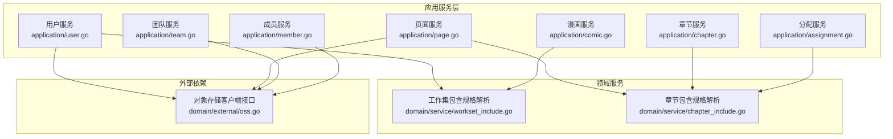
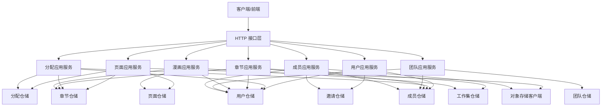
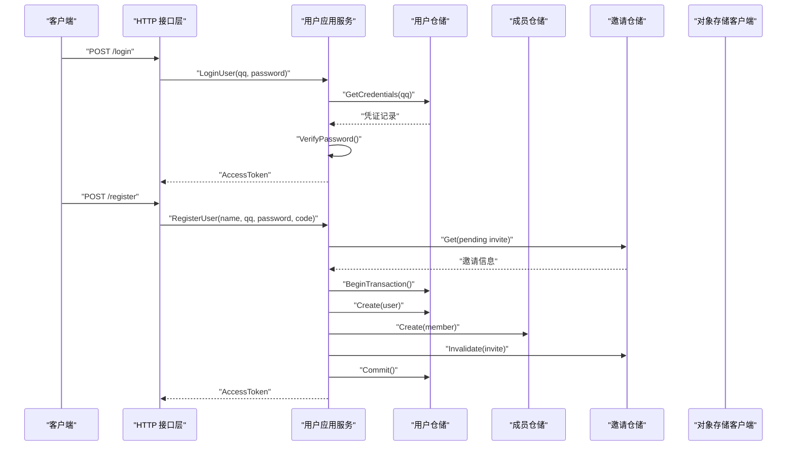
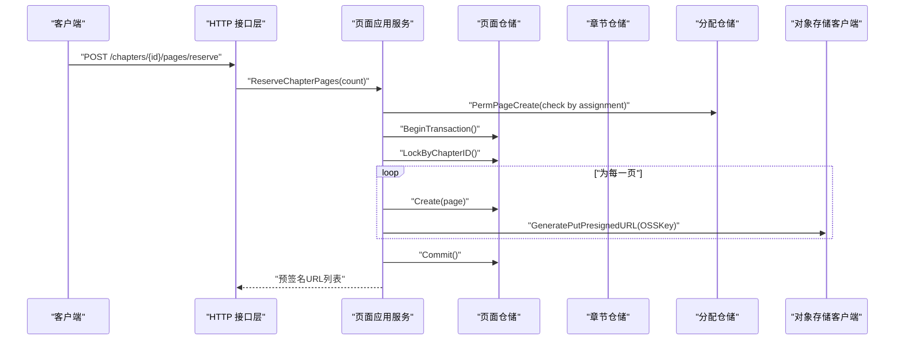
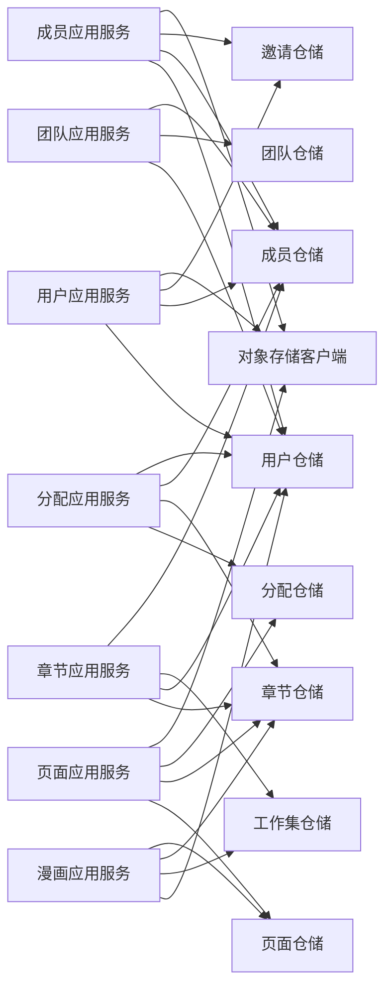
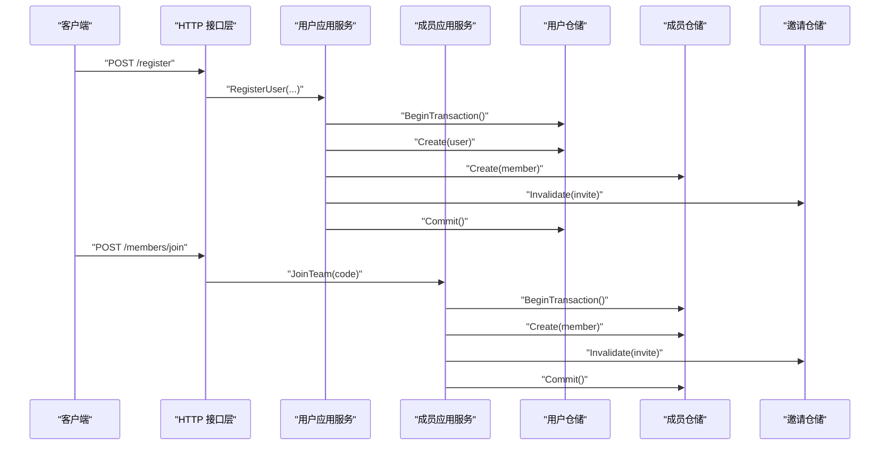

# 服务层实现

<cite>
**本文引用的文件**
- [application/user.go](file://backend/backend-v1/internal/application/user.go)
- [application/page.go](file://backend/backend-v1/internal/application/page.go)
- [application/assignment.go](file://backend/backend-v1/internal/application/assignment.go)
- [application/chapter.go](file://backend/backend-v1/internal/application/chapter.go)
- [application/comic.go](file://backend/backend-v1/internal/application/comic.go)
- [application/team.go](file://backend/backend-v1/internal/application/team.go)
- [application/member.go](file://backend/backend-v1/internal/application/member.go)
- [domain/service/workset_include.go](file://backend/backend-v1/internal/domain/service/workset_include.go)
- [domain/service/chapter_include.go](file://backend/backend-v1/internal/domain/service/chapter_include.go)
- [domain/external/oss.go](file://backend/backend-v1/internal/domain/external/oss.go)
</cite>

## 目录
1. [引言](#引言)
2. [项目结构](#项目结构)
3. [核心组件](#核心组件)
4. [架构总览](#架构总览)
5. [详细组件分析](#详细组件分析)
6. [依赖分析](#依赖分析)
7. [性能考虑](#性能考虑)
8. [故障排查指南](#故障排查指南)
9. [结论](#结论)
10. [附录](#附录)

## 引言
本文件系统性梳理后端服务层的实现，聚焦应用服务层如何封装业务逻辑、编排领域模型与基础设施、协调跨领域事务与外部依赖（如对象存储）。文档覆盖用户服务、页面管理服务、分配与章节管理、漫画与工作集、团队与成员管理等模块，阐述其职责边界、调用模式（同步/异步）、事务协调与错误处理策略，并给出扩展与插件化建议及典型业务场景示例。

## 项目结构
服务层位于 internal/application 目录，按“功能域”组织，每个域对应一个应用服务接口与实现，负责：
- 输入校验与鉴权
- 事务编排
- 领域模型组装与转换
- 与外部依赖（如 OSS）交互
- 返回应用层值对象

**图示来源**
- [application/user.go:1-601](file://backend/backend-v1/internal/application/user.go#L1-L601)
- [application/page.go:1-402](file://backend/backend-v1/internal/application/page.go#L1-L402)
- [application/assignment.go:1-358](file://backend/backend-v1/internal/application/assignment.go#L1-L358)
- [application/chapter.go:1-330](file://backend/backend-v1/internal/application/chapter.go#L1-L330)
- [application/comic.go:1-354](file://backend/backend-v1/internal/application/comic.go#L1-L354)
- [application/team.go:1-422](file://backend/backend-v1/internal/application/team.go#L1-L422)
- [application/member.go:1-448](file://backend/backend-v1/internal/application/member.go#L1-L448)
- [domain/service/workset_include.go:1-21](file://backend/backend-v1/internal/domain/service/workset_include.go#L1-L21)
- [domain/service/chapter_include.go:1-21](file://backend/backend-v1/internal/domain/service/chapter_include.go#L1-L21)
- [domain/external/oss.go:1-2](file://backend/backend-v1/internal/domain/external/oss.go#L1-L2)

**章节来源**
- [application/user.go:1-601](file://backend/backend-v1/internal/application/user.go#L1-L601)
- [application/page.go:1-402](file://backend/backend-v1/internal/application/page.go#L1-L402)
- [application/assignment.go:1-358](file://backend/backend-v1/internal/application/assignment.go#L1-L358)
- [application/chapter.go:1-330](file://backend/backend-v1/internal/application/chapter.go#L1-L330)
- [application/comic.go:1-354](file://backend/backend-v1/internal/application/comic.go#L1-L354)
- [application/team.go:1-422](file://backend/backend-v1/internal/application/team.go#L1-L422)
- [application/member.go:1-448](file://backend/backend-v1/internal/application/member.go#L1-L448)
- [domain/service/workset_include.go:1-21](file://backend/backend-v1/internal/domain/service/workset_include.go#L1-L21)
- [domain/service/chapter_include.go:1-21](file://backend/backend-v1/internal/domain/service/chapter_include.go#L1-L21)
- [domain/external/oss.go:1-2](file://backend/backend-v1/internal/domain/external/oss.go#L1-L2)

## 核心组件
- 应用服务接口与实现：每个域定义清晰的接口方法，实现类通过构造函数注入仓储与外部依赖，保证单一职责与可测试性。
- 事务编排：在需要一致性保障的流程中，统一使用仓储提供的事务执行器，确保数据库与外部资源（如 OSS）的一致性。
- 鉴权与权限：通过领域模型的权限检查器在进入业务逻辑前进行鉴权，避免越权访问。
- 包含规格解析：针对列表查询，通过领域服务解析 includes 参数，决定是否展开关联数据，减少不必要的查询开销。
- 外部依赖：统一通过对象存储客户端生成预签名 URL，实现安全的直传与拉取。

**章节来源**
- [application/user.go:21-105](file://backend/backend-v1/internal/application/user.go#L21-L105)
- [application/page.go:21-91](file://backend/backend-v1/internal/application/page.go#L21-L91)
- [application/assignment.go:20-90](file://backend/backend-v1/internal/application/assignment.go#L20-L90)
- [application/chapter.go:20-80](file://backend/backend-v1/internal/application/chapter.go#L20-L80)
- [application/comic.go:19-74](file://backend/backend-v1/internal/application/comic.go#L19-L74)
- [application/team.go:20-91](file://backend/backend-v1/internal/application/team.go#L20-L91)
- [application/member.go:20-82](file://backend/backend-v1/internal/application/member.go#L20-L82)
- [domain/service/workset_include.go:5-20](file://backend/backend-v1/internal/domain/service/workset_include.go#L5-L20)
- [domain/service/chapter_include.go:5-20](file://backend/backend-v1/internal/domain/service/chapter_include.go#L5-L20)
- [domain/external/oss.go:1-2](file://backend/backend-v1/internal/domain/external/oss.go#L1-L2)

## 架构总览
服务层围绕“应用服务 -> 领域模型/仓储 -> 外部依赖”的分层展开，应用服务负责编排与校验，仓储负责持久化，外部依赖（如 OSS）提供资源访问能力。

**图示来源**
- [application/user.go:67-104](file://backend/backend-v1/internal/application/user.go#L67-L104)
- [application/page.go:44-90](file://backend/backend-v1/internal/application/page.go#L44-L90)
- [application/assignment.go:48-89](file://backend/backend-v1/internal/application/assignment.go#L48-L89)
- [application/chapter.go:43-79](file://backend/backend-v1/internal/application/chapter.go#L43-L79)
- [application/comic.go:42-73](file://backend/backend-v1/internal/application/comic.go#L42-L73)
- [application/team.go:59-89](file://backend/backend-v1/internal/application/team.go#L59-L89)
- [application/member.go:53-81](file://backend/backend-v1/internal/application/member.go#L53-L81)
- [domain/external/oss.go:1-2](file://backend/backend-v1/internal/domain/external/oss.go#L1-L2)

## 详细组件分析

### 用户服务（UserApplication）
职责
- 登录与注册：校验参数、查询凭证、密码校验、签发访问令牌。
- 用户信息管理：查看他人/本人信息、更新、删除（仅管理员）。
- 头像预留与确认：生成预签名 URL，预留 OSS Key 并确认上传完成。

事务与一致性
- 注册流程在单个事务中完成：创建用户、创建成员、标记邀请为已使用，失败则回滚。

鉴权与权限
- 使用权限检查器校验用户对目标资源的操作权限，避免越权。

OSS 集成
- 通过对象存储客户端生成预签名 URL，支持头像上传与访问。

**图示来源**
- [application/user.go:107-279](file://backend/backend-v1/internal/application/user.go#L107-L279)

**章节来源**
- [application/user.go:21-601](file://backend/backend-v1/internal/application/user.go#L21-L601)

### 页面服务（PageApplication）
职责
- 预留章节页面：批量创建页面记录并生成预签名 PUT URL，支持并发安全。
- 列出章节页面：按索引升序列出，支持包含创建者信息。
- 更新页面状态：基于权限检查更新页面上传状态等字段。
- 批量删除页面：锁定章节，批量删除页面记录并清理 OSS 资源。

事务与一致性
- 预留与删除均使用事务，确保数据库与对象存储一致。

鉴权与权限
- 基于分配信息与章节/漫画/工作集/成员信息进行权限校验。

OSS 集成
- 生成预签名 URL 用于直传与拉取。

**图示来源**
- [application/page.go:93-187](file://backend/backend-v1/internal/application/page.go#L93-L187)

**章节来源**
- [application/page.go:21-402](file://backend/backend-v1/internal/application/page.go#L21-L402)

### 分配服务（AssignmentApplication）
职责
- 列出章节分配：支持包含用户与章节信息。
- 列出我的分配：按用户过滤。
- 创建分配：检查重复后创建。
- 更新/删除分配：基于目标分配的可信 ChapterID 进行权限校验。

鉴权与权限
- 通过加载分配信息与章节/漫画/工作集/成员信息进行权限校验。

OSS 集成
- 生成预签名 URL 用于资源访问。

**章节来源**
- [application/assignment.go:20-358](file://backend/backend-v1/internal/application/assignment.go#L20-L358)

### 章节服务（ChapterApplication）
职责
- 创建章节：锁定漫画，统计数量，计算索引，创建章节并提交事务。
- 列出章节：按索引排序，支持包含创建者信息。
- 更新/删除章节：基于漫画与工作集/成员信息进行权限校验。

事务与一致性
- 创建章节使用事务，确保索引一致性与约束满足。

鉴权与权限
- 通过成员、漫画、工作集信息进行权限校验。

**章节来源**
- [application/chapter.go:20-330](file://backend/backend-v1/internal/application/chapter.go#L20-L330)

### 漫画服务（ComicApplication）
职责
- 列出漫画：按最近活跃时间排序，支持包含工作集与创建者信息。
- 创建漫画：锁定工作集，统计数量，计算索引，创建漫画并提交事务。
- 更新/删除漫画：基于漫画、工作集与成员信息进行权限校验。

事务与一致性
- 创建漫画使用事务，确保索引一致性与约束满足。

鉴权与权限
- 通过工作集与成员信息进行权限校验。

**章节来源**
- [application/comic.go:19-354](file://backend/backend-v1/internal/application/comic.go#L19-L354)

### 团队服务（TeamApplication）
职责
- 创建/列出/列出我的团队：支持分页与包含信息。
- 头像预留与确认：生成预签名 PUT URL，预留 OSS Key 并确认上传完成。
- 更新/删除团队：基于用户与成员信息进行权限校验。

鉴权与权限
- 通过用户与成员信息进行权限校验。

OSS 集成
- 生成预签名 URL 用于头像上传与访问。

**章节来源**
- [application/team.go:20-422](file://backend/backend-v1/internal/application/team.go#L20-L422)

### 成员服务（MemberApplication）
职责
- 创建成员（管理员）：检查重复后创建。
- 列出成员/我的成员：支持包含用户或团队信息。
- 更新/删除成员：基于目标成员的可信 TeamID 进行权限校验。
- 加入团队：根据邀请码与 QQ 查找未使用邀请，创建成员并使邀请失效，事务保证一致性。

事务与一致性
- 加入团队使用事务，确保成员创建与邀请失效原子性。

鉴权与权限
- 通过成员信息与用户信息进行权限校验。

**章节来源**
- [application/member.go:20-448](file://backend/backend-v1/internal/application/member.go#L20-L448)

## 依赖分析
- 应用服务之间的耦合度低，主要通过领域模型与仓储接口交互。
- 外部依赖集中于对象存储客户端，统一生成预签名 URL，便于替换与扩展。
- 领域服务提供包含规格解析，降低应用层对查询细节的关注。

**图示来源**
- [application/user.go:67-104](file://backend/backend-v1/internal/application/user.go#L67-L104)
- [application/page.go:44-90](file://backend/backend-v1/internal/application/page.go#L44-L90)
- [application/assignment.go:48-89](file://backend/backend-v1/internal/application/assignment.go#L48-L89)
- [application/chapter.go:43-79](file://backend/backend-v1/internal/application/chapter.go#L43-L79)
- [application/comic.go:42-73](file://backend/backend-v1/internal/application/comic.go#L42-L73)
- [application/team.go:59-89](file://backend/backend-v1/internal/application/team.go#L59-L89)
- [application/member.go:53-81](file://backend/backend-v1/internal/application/member.go#L53-L81)

**章节来源**
- [application/user.go:67-104](file://backend/backend-v1/internal/application/user.go#L67-L104)
- [application/page.go:44-90](file://backend/backend-v1/internal/application/page.go#L44-L90)
- [application/assignment.go:48-89](file://backend/backend-v1/internal/application/assignment.go#L48-L89)
- [application/chapter.go:43-79](file://backend/backend-v1/internal/application/chapter.go#L43-L79)
- [application/comic.go:42-73](file://backend/backend-v1/internal/application/comic.go#L42-L73)
- [application/team.go:59-89](file://backend/backend-v1/internal/application/team.go#L59-L89)
- [application/member.go:53-81](file://backend/backend-v1/internal/application/member.go#L53-L81)

## 性能考虑
- 列表查询的包含规格解析：仅在需要时展开关联信息，减少查询与序列化开销。
- 批量操作：页面预留与删除采用批量插入/删除，降低多次往返成本。
- 预签名直传：利用对象存储直传，减轻服务端带宽压力。
- 事务粒度：在需要强一致性的流程中使用事务，避免中间态对外暴露。
- 锁策略：章节与漫画创建阶段使用行级锁，避免并发冲突导致的重复或索引错乱。

[本节为通用性能讨论，无需具体文件来源]

## 故障排查指南
常见问题与定位思路
- 参数校验失败：检查请求体与校验规则，关注日志中的字段与错误信息。
- 权限不足：核对当前用户在目标资源上的角色与权限检查器的输入参数。
- 事务回滚：关注回滚错误日志，确认异常分支是否正确设置事务错误并回滚。
- OSS 预签名失败：检查对象存储客户端初始化与权限配置，确认 Key 规则与 Content-Type。
- 记录不存在：区分 ErrRecordNotFound 与其它错误，避免泄露敏感信息。

**章节来源**
- [application/user.go:113-138](file://backend/backend-v1/internal/application/user.go#L113-L138)
- [application/page.go:123-137](file://backend/backend-v1/internal/application/page.go#L123-L137)
- [application/member.go:403-421](file://backend/backend-v1/internal/application/member.go#L403-L421)

## 结论
服务层通过清晰的接口划分、严格的鉴权与权限检查、统一的事务编排与外部依赖集成，有效封装了业务逻辑并提升了可维护性与可扩展性。面向未来，可在以下方面持续演进：
- 插件化与扩展点：引入适配器模式与工厂模式，支持不同仓储实现与外部依赖的替换。
- 异步处理：对耗时任务（如大文件上传回调、通知发送）采用消息队列或后台任务。
- 重试与熔断：对外部依赖增加指数退避重试与熔断策略，提升稳定性。
- 监控与可观测性：完善链路追踪与指标采集，结合日志与告警快速定位问题。

[本节为总结性内容，无需具体文件来源]

## 附录

### 业务场景示例：用户注册与加入团队
- 场景描述：用户通过邀请码注册，系统创建用户与成员记录，并标记邀请为已使用；随后用户使用邀请码加入团队，系统在事务中创建成员并失效邀请。
- 关键步骤
  - 用户注册：调用用户应用服务的注册方法，内部开启事务，依次创建用户、成员、标记邀请失效并提交。
  - 加入团队：调用成员应用服务的加入团队方法，内部开启事务，创建成员并失效邀请，提交事务。
- 错误处理：任一环节失败均回滚事务并返回错误信息；邀请不存在或已使用时明确提示。

**图示来源**
- [application/user.go:157-279](file://backend/backend-v1/internal/application/user.go#L157-L279)
- [application/member.go:340-447](file://backend/backend-v1/internal/application/member.go#L340-L447)

**章节来源**
- [application/user.go:157-279](file://backend/backend-v1/internal/application/user.go#L157-L279)
- [application/member.go:340-447](file://backend/backend-v1/internal/application/member.go#L340-L447)