# 领域模型

<cite>
**本文引用的文件**
- [backend/backend-v1/internal/domain/model/user.go](file://backend/backend-v1/internal/domain/model/user.go)
- [backend/backend-v1/internal/domain/model/team.go](file://backend/backend-v1/internal/domain/model/team.go)
- [backend/backend-v1/internal/domain/model/comic.go](file://backend/backend-v1/internal/domain/model/comic.go)
- [backend/backend-v1/internal/domain/model/chapter.go](file://backend/backend-v1/internal/domain/model/chapter.go)
- [backend/backend-v1/internal/domain/model/page.go](file://backend/backend-v1/internal/domain/model/page.go)
- [backend/backend-v1/internal/domain/model/member.go](file://backend/backend-v1/internal/domain/model/member.go)
- [backend/backend-v1/internal/domain/model/assignment.go](file://backend/backend-v1/internal/domain/model/assignment.go)
- [backend/backend-v1/internal/domain/model/workset.go](file://backend/backend-v1/internal/domain/model/workset.go)
- [backend/backend-v1/internal/domain/model/invitation.go](file://backend/backend-v1/internal/domain/model/invitation.go)
- [backend/backend-v1/internal/domain/model/unit.go](file://backend/backend-v1/internal/domain/model/unit.go)
- [backend/backend-v1/internal/domain/model/role.go](file://backend/backend-v1/internal/domain/model/role.go)
- [backend/backend-v1/internal/domain/model/permission.go](file://backend/backend-v1/internal/domain/model/permission.go)
- [backend/backend-v1/internal/domain/model/workflow.go](file://backend/backend-v1/internal/domain/model/workflow.go)
- [backend/backend-v1/internal/value/user.go](file://backend/backend-v1/internal/value/user.go)
- [backend/backend-v1/internal/value/team.go](file://backend/backend-v1/internal/value/team.go)
</cite>

## 目录
1. [引言](#引言)
2. [项目结构](#项目结构)
3. [核心组件](#核心组件)
4. [架构总览](#架构总览)
5. [详细组件分析](#详细组件分析)
6. [依赖分析](#依赖分析)
7. [性能考虑](#性能考虑)
8. [故障排查指南](#故障排查指南)
9. [结论](#结论)
10. [附录](#附录)

## 引言
本文件系统性梳理后端领域模型，围绕实体、值对象、聚合根与领域服务展开，结合用户、团队、漫画、任务分配等核心业务，阐述不变性保证、业务规则与状态转换，并总结聚合设计、边界划分与领域事件处理的最佳实践。文档同时提供面向代码级别的图示与路径指引，帮助读者快速定位实现细节。

## 项目结构
领域模型位于 backend/backend-v1/internal/domain/model 下，采用按“资源”分层的组织方式：每个资源（如 user、team、comic、chapter、page、member、assignment、workset、invitation、unit）均提供 Info/Creation/Update 三类数据载体，配合 role、permission、workflow 等支撑能力，形成清晰的 DDD 分层与职责边界。

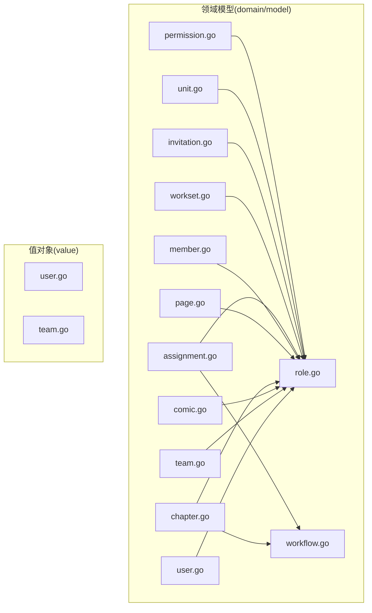

**图表来源**
- [backend/backend-v1/internal/domain/model/user.go:1-100](file://backend/backend-v1/internal/domain/model/user.go#L1-L100)
- [backend/backend-v1/internal/domain/model/team.go:1-63](file://backend/backend-v1/internal/domain/model/team.go#L1-L63)
- [backend/backend-v1/internal/domain/model/comic.go:1-107](file://backend/backend-v1/internal/domain/model/comic.go#L1-L107)
- [backend/backend-v1/internal/domain/model/chapter.go:1-260](file://backend/backend-v1/internal/domain/model/chapter.go#L1-L260)
- [backend/backend-v1/internal/domain/model/page.go:1-134](file://backend/backend-v1/internal/domain/model/page.go#L1-L134)
- [backend/backend-v1/internal/domain/model/member.go:1-205](file://backend/backend-v1/internal/domain/model/member.go#L1-L205)
- [backend/backend-v1/internal/domain/model/assignment.go:1-190](file://backend/backend-v1/internal/domain/model/assignment.go#L1-L190)
- [backend/backend-v1/internal/domain/model/workset.go:1-82](file://backend/backend-v1/internal/domain/model/workset.go#L1-L82)
- [backend/backend-v1/internal/domain/model/invitation.go:1-158](file://backend/backend-v1/internal/domain/model/invitation.go#L1-L158)
- [backend/backend-v1/internal/domain/model/unit.go:1-149](file://backend/backend-v1/internal/domain/model/unit.go#L1-L149)
- [backend/backend-v1/internal/domain/model/role.go:1-56](file://backend/backend-v1/internal/domain/model/role.go#L1-L56)
- [backend/backend-v1/internal/domain/model/permission.go:1-845](file://backend/backend-v1/internal/domain/model/permission.go#L1-L845)
- [backend/backend-v1/internal/domain/model/workflow.go:1-36](file://backend/backend-v1/internal/domain/model/workflow.go#L1-L36)
- [backend/backend-v1/internal/value/user.go:1-171](file://backend/backend-v1/internal/value/user.go#L1-L171)
- [backend/backend-v1/internal/value/team.go:1-112](file://backend/backend-v1/internal/value/team.go#L1-L112)

**章节来源**
- [backend/backend-v1/internal/domain/model/user.go:1-100](file://backend/backend-v1/internal/domain/model/user.go#L1-L100)
- [backend/backend-v1/internal/domain/model/team.go:1-63](file://backend/backend-v1/internal/domain/model/team.go#L1-L63)
- [backend/backend-v1/internal/domain/model/comic.go:1-107](file://backend/backend-v1/internal/domain/model/comic.go#L1-L107)
- [backend/backend-v1/internal/domain/model/chapter.go:1-260](file://backend/backend-v1/internal/domain/model/chapter.go#L1-L260)
- [backend/backend-v1/internal/domain/model/page.go:1-134](file://backend/backend-v1/internal/domain/model/page.go#L1-L134)
- [backend/backend-v1/internal/domain/model/member.go:1-205](file://backend/backend-v1/internal/domain/model/member.go#L1-L205)
- [backend/backend-v1/internal/domain/model/assignment.go:1-190](file://backend/backend-v1/internal/domain/model/assignment.go#L1-L190)
- [backend/backend-v1/internal/domain/model/workset.go:1-82](file://backend/backend-v1/internal/domain/model/workset.go#L1-L82)
- [backend/backend-v1/internal/domain/model/invitation.go:1-158](file://backend/backend-v1/internal/domain/model/invitation.go#L1-L158)
- [backend/backend-v1/internal/domain/model/unit.go:1-149](file://backend/backend-v1/internal/domain/model/unit.go#L1-L149)
- [backend/backend-v1/internal/domain/model/role.go:1-56](file://backend/backend-v1/internal/domain/model/role.go#L1-L56)
- [backend/backend-v1/internal/domain/model/permission.go:1-845](file://backend/backend-v1/internal/domain/model/permission.go#L1-L845)
- [backend/backend-v1/internal/domain/model/workflow.go:1-36](file://backend/backend-v1/internal/domain/model/workflow.go#L1-L36)
- [backend/backend-v1/internal/value/user.go:1-171](file://backend/backend-v1/internal/value/user.go#L1-L171)
- [backend/backend-v1/internal/value/team.go:1-112](file://backend/backend-v1/internal/value/team.go#L1-L112)

## 核心组件
- 实体与值对象
  - 用户：UserInfo、UserCreation、UserUpdate、UserCredentials（登录凭据）
  - 团队：TeamInfo、TeamCreation、TeamUpdate
  - 工作集：WorksetInfo、WorksetCreation、WorksetUpdate
  - 漫画：ComicInfo、ComicCreation、ComicUpdate
  - 章节：ChapterInfo、ChapterStats、ChapterCreation、ChapterUpdate
  - 页面：PageInfo、PageStats、PageCreation、PageUpdate
  - 单元：UnitInfo、UnitCreation、UnitPatch
  - 成员：MemberInfo、MemberCreation、MemberUpdate
  - 分配：AssignmentInfo、AssignmentCreation、AssignmentUpdate
  - 邀请：InvitationInfo、InvitationCreation、InvitationUpdate
  - 角色与权限：RoleFlag/RoleMask、Permission 授权器
  - 流程状态：Workflow、WorkflowStatus、IsValidWorkflowCombination
- 值对象（应用层对外）：value/user.go、value/team.go 中的参数与结果载体，承担输入校验与对外展示形态职责

**章节来源**
- [backend/backend-v1/internal/domain/model/user.go:1-100](file://backend/backend-v1/internal/domain/model/user.go#L1-L100)
- [backend/backend-v1/internal/domain/model/team.go:1-63](file://backend/backend-v1/internal/domain/model/team.go#L1-L63)
- [backend/backend-v1/internal/domain/model/workset.go:1-82](file://backend/backend-v1/internal/domain/model/workset.go#L1-L82)
- [backend/backend-v1/internal/domain/model/comic.go:1-107](file://backend/backend-v1/internal/domain/model/comic.go#L1-L107)
- [backend/backend-v1/internal/domain/model/chapter.go:1-260](file://backend/backend-v1/internal/domain/model/chapter.go#L1-L260)
- [backend/backend-v1/internal/domain/model/page.go:1-134](file://backend/backend-v1/internal/domain/model/page.go#L1-L134)
- [backend/backend-v1/internal/domain/model/unit.go:1-149](file://backend/backend-v1/internal/domain/model/unit.go#L1-L149)
- [backend/backend-v1/internal/domain/model/member.go:1-205](file://backend/backend-v1/internal/domain/model/member.go#L1-L205)
- [backend/backend-v1/internal/domain/model/assignment.go:1-190](file://backend/backend-v1/internal/domain/model/assignment.go#L1-L190)
- [backend/backend-v1/internal/domain/model/invitation.go:1-158](file://backend/backend-v1/internal/domain/model/invitation.go#L1-L158)
- [backend/backend-v1/internal/domain/model/role.go:1-56](file://backend/backend-v1/internal/domain/model/role.go#L1-L56)
- [backend/backend-v1/internal/domain/model/workflow.go:1-36](file://backend/backend-v1/internal/domain/model/workflow.go#L1-L36)
- [backend/backend-v1/internal/value/user.go:1-171](file://backend/backend-v1/internal/value/user.go#L1-L171)
- [backend/backend-v1/internal/value/team.go:1-112](file://backend/backend-v1/internal/value/team.go#L1-L112)

## 架构总览
领域模型遵循 DDD 分层：应用层通过值对象承载请求/响应；领域层以 Info/Creation/Update 数据载体表达聚合内状态与变更；权限与流程状态作为横切关注点贯穿各聚合。

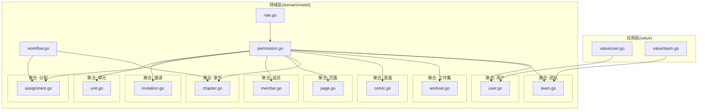

**图表来源**
- [backend/backend-v1/internal/value/user.go:1-171](file://backend/backend-v1/internal/value/user.go#L1-L171)
- [backend/backend-v1/internal/value/team.go:1-112](file://backend/backend-v1/internal/value/team.go#L1-L112)
- [backend/backend-v1/internal/domain/model/role.go:1-56](file://backend/backend-v1/internal/domain/model/role.go#L1-L56)
- [backend/backend-v1/internal/domain/model/workflow.go:1-36](file://backend/backend-v1/internal/domain/model/workflow.go#L1-L36)
- [backend/backend-v1/internal/domain/model/permission.go:1-845](file://backend/backend-v1/internal/domain/model/permission.go#L1-L845)
- [backend/backend-v1/internal/domain/model/user.go:1-100](file://backend/backend-v1/internal/domain/model/user.go#L1-L100)
- [backend/backend-v1/internal/domain/model/team.go:1-63](file://backend/backend-v1/internal/domain/model/team.go#L1-L63)
- [backend/backend-v1/internal/domain/model/workset.go:1-82](file://backend/backend-v1/internal/domain/model/workset.go#L1-L82)
- [backend/backend-v1/internal/domain/model/comic.go:1-107](file://backend/backend-v1/internal/domain/model/comic.go#L1-L107)
- [backend/backend-v1/internal/domain/model/chapter.go:1-260](file://backend/backend-v1/internal/domain/model/chapter.go#L1-L260)
- [backend/backend-v1/internal/domain/model/page.go:1-134](file://backend/backend-v1/internal/domain/model/page.go#L1-L134)
- [backend/backend-v1/internal/domain/model/member.go:1-205](file://backend/backend-v1/internal/domain/model/member.go#L1-L205)
- [backend/backend-v1/internal/domain/model/assignment.go:1-190](file://backend/backend-v1/internal/domain/model/assignment.go#L1-L190)
- [backend/backend-v1/internal/domain/model/invitation.go:1-158](file://backend/backend-v1/internal/domain/model/invitation.go#L1-L158)
- [backend/backend-v1/internal/domain/model/unit.go:1-149](file://backend/backend-v1/internal/domain/model/unit.go#L1-L149)

## 详细组件分析

### 用户(User)聚合
- 聚合根：UserInfo（对外暴露）
- 创建/更新：UserCreation、UserUpdate
- 登录凭据：UserCredentials（仅用于认证，不暴露完整信息）
- 关键不变性
  - 凭据与信息分离，登录阶段不泄露敏感字段
  - 注册时角色掩码由 RoleMask 统一构建
- 业务规则
  - 注册参数校验（名称、QQ、密码长度范围）
  - 更新参数校验（名称、QQ、密码长度范围）

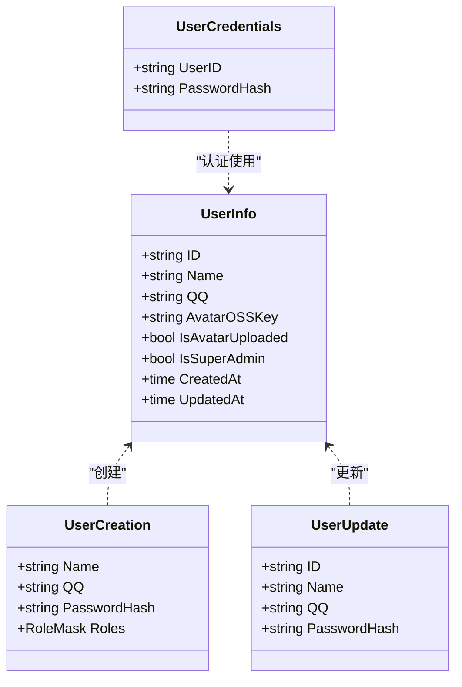

**图表来源**
- [backend/backend-v1/internal/domain/model/user.go:1-100](file://backend/backend-v1/internal/domain/model/user.go#L1-L100)
- [backend/backend-v1/internal/domain/model/role.go:1-56](file://backend/backend-v1/internal/domain/model/role.go#L1-L56)
- [backend/backend-v1/internal/value/user.go:1-171](file://backend/backend-v1/internal/value/user.go#L1-L171)

**章节来源**
- [backend/backend-v1/internal/domain/model/user.go:1-100](file://backend/backend-v1/internal/domain/model/user.go#L1-L100)
- [backend/backend-v1/internal/value/user.go:1-171](file://backend/backend-v1/internal/value/user.go#L1-L171)

### 团队(Team)聚合
- 聚合根：TeamInfo
- 创建/更新：TeamCreation、TeamUpdate
- 关键不变性
  - 名称与描述长度约束
- 业务规则
  - 创建/更新参数校验

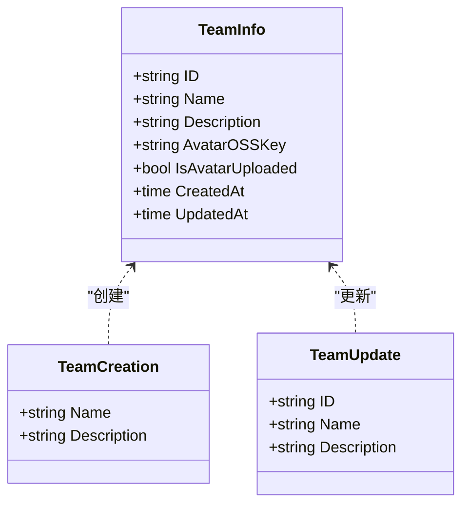

**图表来源**
- [backend/backend-v1/internal/domain/model/team.go:1-63](file://backend/backend-v1/internal/domain/model/team.go#L1-L63)
- [backend/backend-v1/internal/value/team.go:1-112](file://backend/backend-v1/internal/value/team.go#L1-L112)

**章节来源**
- [backend/backend-v1/internal/domain/model/team.go:1-63](file://backend/backend-v1/internal/domain/model/team.go#L1-L63)
- [backend/backend-v1/internal/value/team.go:1-112](file://backend/backend-v1/internal/value/team.go#L1-L112)

### 工作集(Workset)聚合
- 聚合根：WorksetInfo
- 创建/更新：WorksetCreation、WorksetUpdate
- 关键不变性
  - 外键 TeamID 存在性由上层调用方保障
- 业务规则
  - 描述长度限制

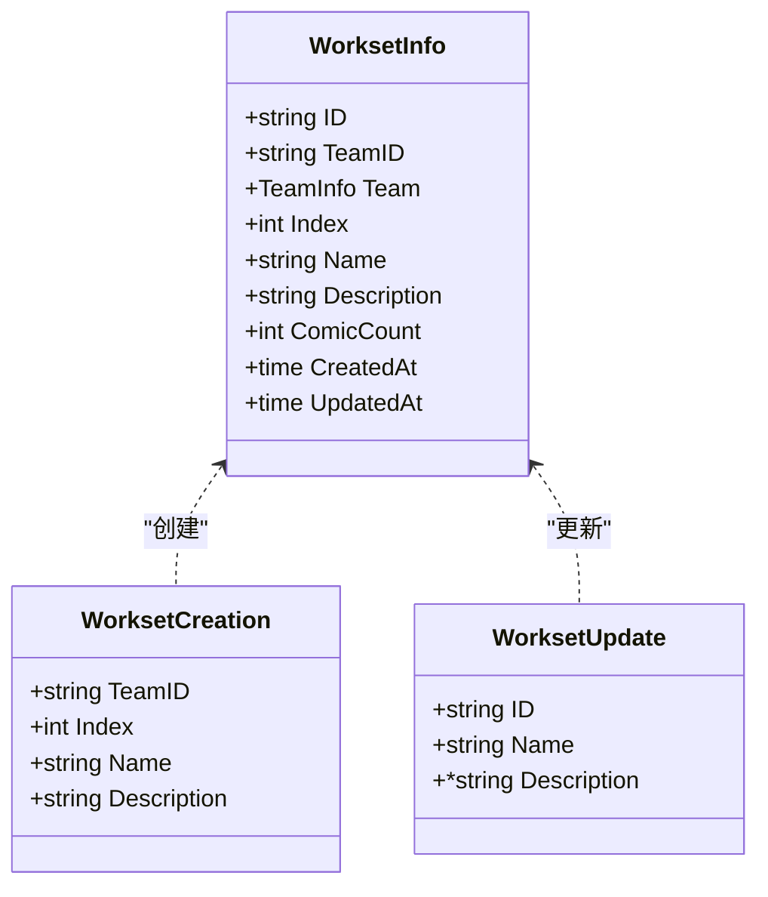

**图表来源**
- [backend/backend-v1/internal/domain/model/workset.go:1-82](file://backend/backend-v1/internal/domain/model/workset.go#L1-L82)

**章节来源**
- [backend/backend-v1/internal/domain/model/workset.go:1-82](file://backend/backend-v1/internal/domain/model/workset.go#L1-L82)

### 漫画(Comic)聚合
- 聚合根：ComicInfo
- 创建/更新：ComicCreation、ComicUpdate
- 关键不变性
  - 外键 WorksetID 存在性由上层调用方保障
- 业务规则
  - 标题/作者/描述长度限制

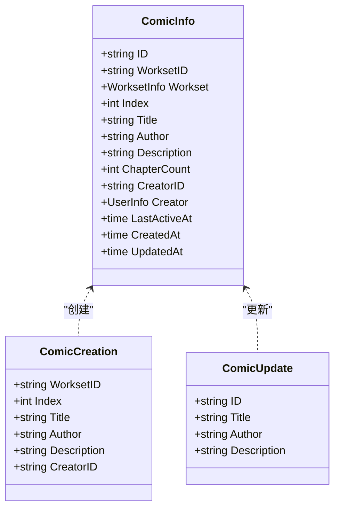

**图表来源**
- [backend/backend-v1/internal/domain/model/comic.go:1-107](file://backend/backend-v1/internal/domain/model/comic.go#L1-L107)

**章节来源**
- [backend/backend-v1/internal/domain/model/comic.go:1-107](file://backend/backend-v1/internal/domain/model/comic.go#L1-L107)

### 章节(Chapter)聚合
- 聚合根：ChapterInfo
- 统计：ChapterStats
- 创建/更新：ChapterCreation、ChapterUpdate
- 关键不变性
  - 状态流转遵循 WorkflowStatus 与 IsValidWorkflowCombination
- 业务规则
  - 上传/评审/发布仅支持 pending/completed
  - 翻译/校对/排版支持 pending/in_progress/completed
  - 更新时保留已设时间戳（如已完成状态）

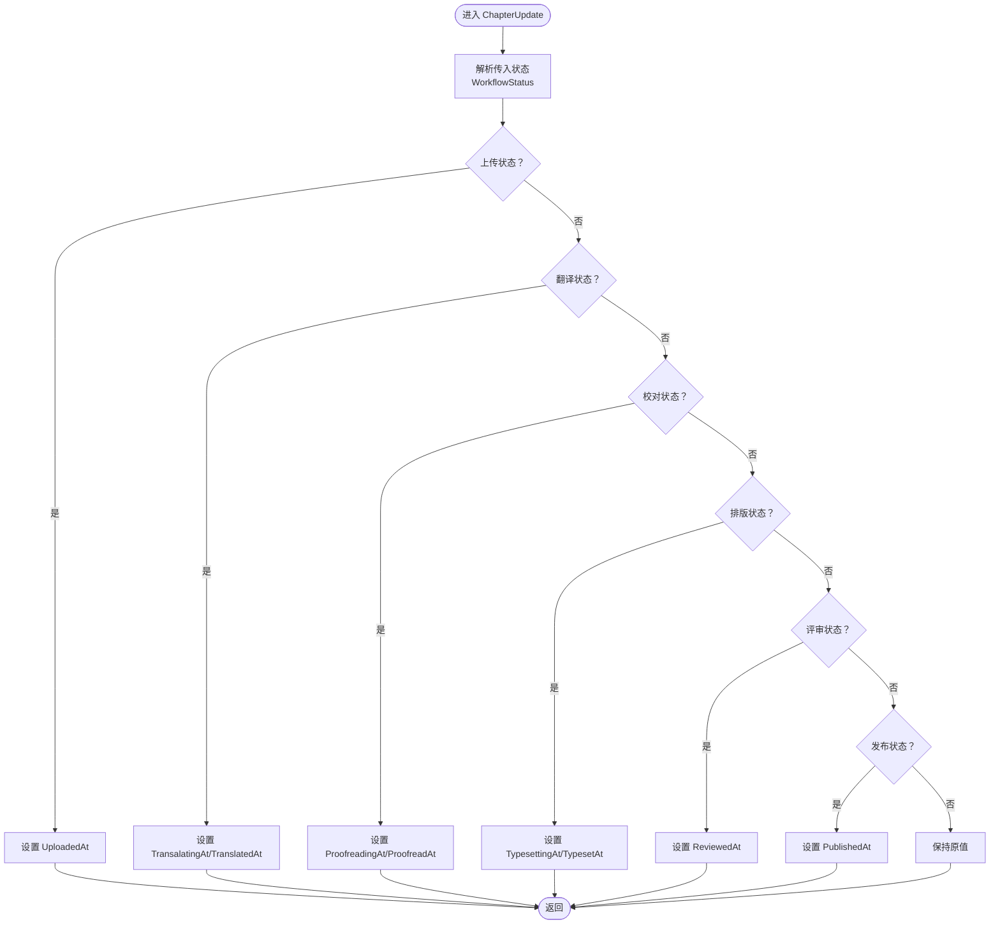

**图表来源**
- [backend/backend-v1/internal/domain/model/chapter.go:1-260](file://backend/backend-v1/internal/domain/model/chapter.go#L1-L260)
- [backend/backend-v1/internal/domain/model/workflow.go:1-36](file://backend/backend-v1/internal/domain/model/workflow.go#L1-L36)

**章节来源**
- [backend/backend-v1/internal/domain/model/chapter.go:1-260](file://backend/backend-v1/internal/domain/model/chapter.go#L1-L260)
- [backend/backend-v1/internal/domain/model/workflow.go:1-36](file://backend/backend-v1/internal/domain/model/workflow.go#L1-L36)

### 页面(Page)聚合
- 聚合根：PageInfo
- 统计：PageStats
- 创建/更新：PageCreation、PageUpdate
- 关键不变性
  - 索引为 0-based
- 业务规则
  - 更新时可选择性覆盖索引、OSSKey、上传标记与统计字段

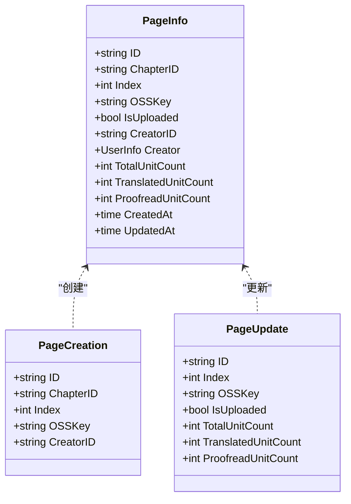

**图表来源**
- [backend/backend-v1/internal/domain/model/page.go:1-134](file://backend/backend-v1/internal/domain/model/page.go#L1-L134)

**章节来源**
- [backend/backend-v1/internal/domain/model/page.go:1-134](file://backend/backend-v1/internal/domain/model/page.go#L1-L134)

### 成员(Member)聚合
- 聚合根：MemberInfo
- 创建/更新：MemberCreation、MemberUpdate
- 关键不变性
  - 角色掩码由 AssignedXxxAt 时间戳体现
- 业务规则
  - 角色集合与 HasAnyRole/Roles 查询一致
  - 更新时保留已有角色的时间戳

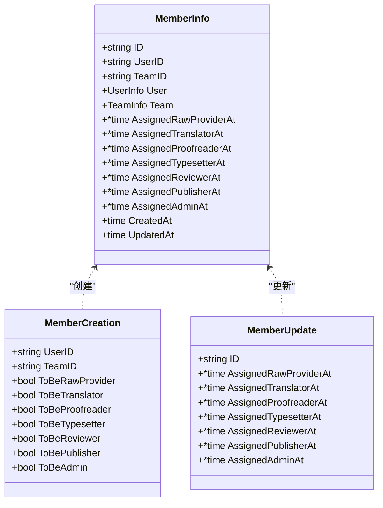

**图表来源**
- [backend/backend-v1/internal/domain/model/member.go:1-205](file://backend/backend-v1/internal/domain/model/member.go#L1-L205)

**章节来源**
- [backend/backend-v1/internal/domain/model/member.go:1-205](file://backend/backend-v1/internal/domain/model/member.go#L1-L205)

### 分配(Assignment)聚合
- 聚合根：AssignmentInfo
- 创建/更新：AssignmentCreation、AssignmentUpdate
- 关键不变性
  - 角色掩码由 AssignedXxxAt 时间戳体现
- 业务规则
  - 创建时按目标角色掩码批量赋值当前时间
  - 更新时保留已有角色的时间戳

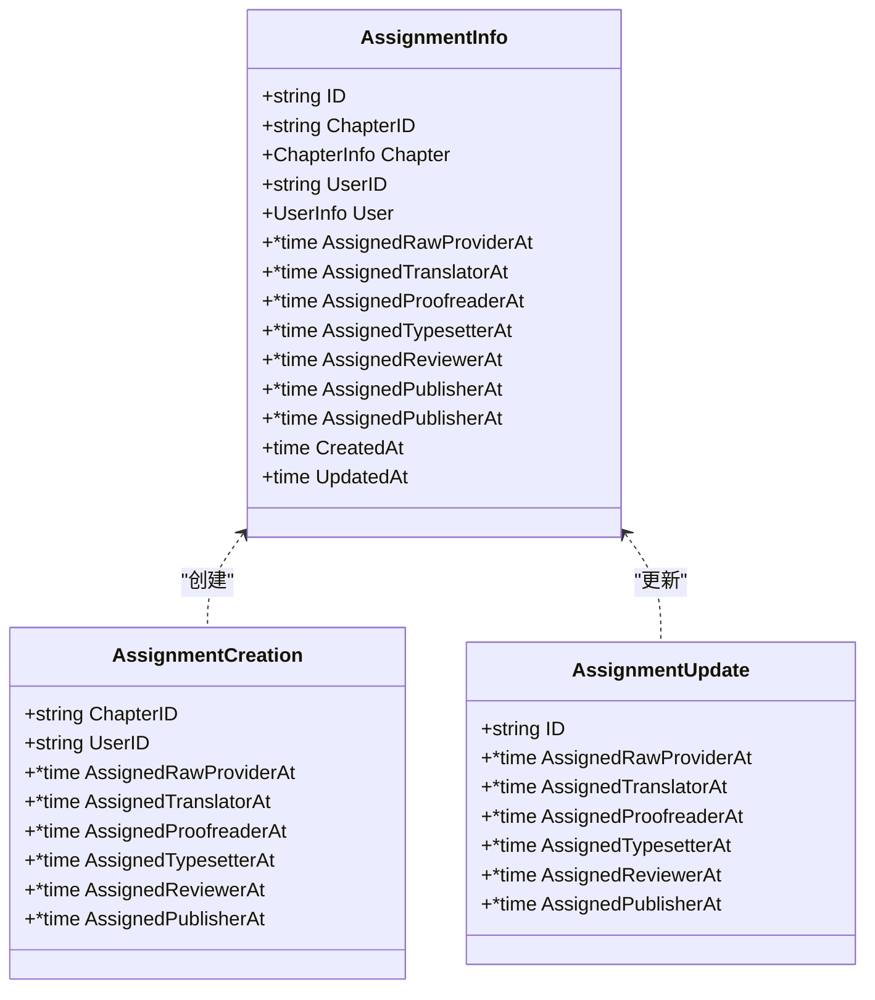

**图表来源**
- [backend/backend-v1/internal/domain/model/assignment.go:1-190](file://backend/backend-v1/internal/domain/model/assignment.go#L1-L190)

**章节来源**
- [backend/backend-v1/internal/domain/model/assignment.go:1-190](file://backend/backend-v1/internal/domain/model/assignment.go#L1-L190)

### 邀请(Invitation)聚合
- 聚合根：InvitationInfo
- 创建/更新：InvitationCreation、InvitationUpdate
- 关键不变性
  - 角色掩码由 ToBeXxx 字段构成
- 业务规则
  - 角色集合与 RoleMask 计算一致

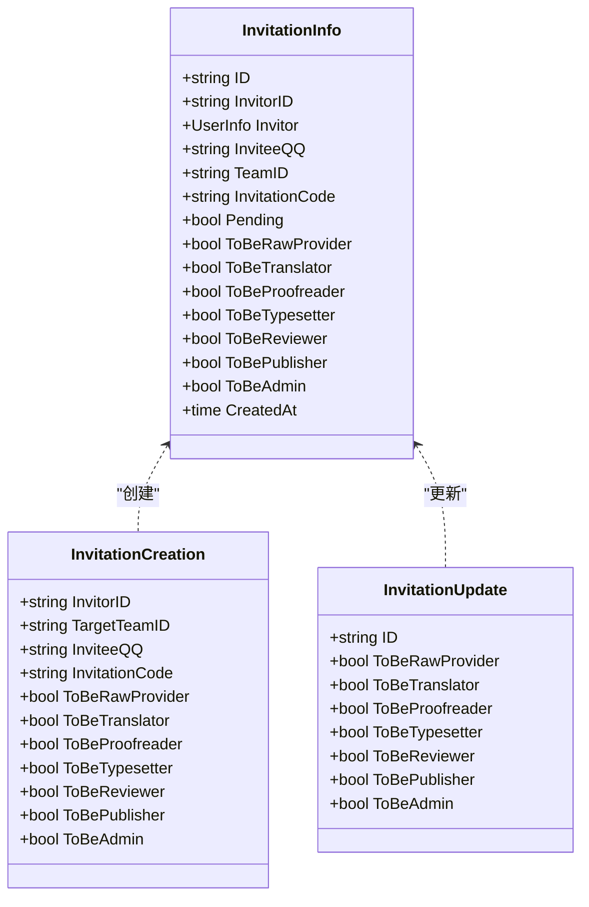

**图表来源**
- [backend/backend-v1/internal/domain/model/invitation.go:1-158](file://backend/backend-v1/internal/domain/model/invitation.go#L1-L158)

**章节来源**
- [backend/backend-v1/internal/domain/model/invitation.go:1-158](file://backend/backend-v1/internal/domain/model/invitation.go#L1-L158)

### 单元(Unit)聚合
- 聚合根：UnitInfo
- 创建：UnitCreation（别名 UnitInfo）
- 更新：UnitPatch（纯补丁，Option 控制是否修改）
- 关键不变性
  - Patch 语义仅修改显式提供的字段
- 业务规则
  - 坐标、气泡、翻译/校对文本与评论、ID 等字段按 Option 决定是否写入

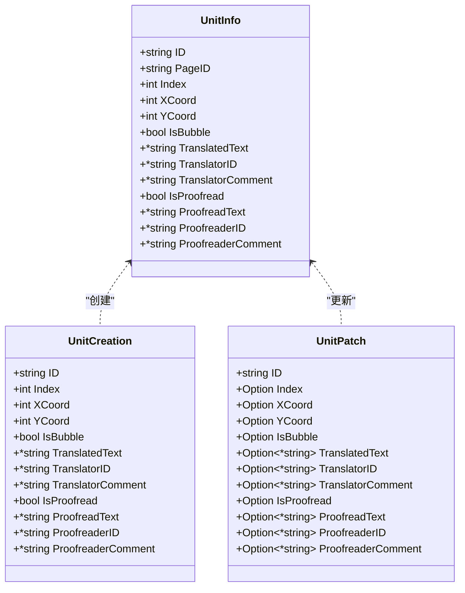

**图表来源**
- [backend/backend-v1/internal/domain/model/unit.go:1-149](file://backend/backend-v1/internal/domain/model/unit.go#L1-L149)

**章节来源**
- [backend/backend-v1/internal/domain/model/unit.go:1-149](file://backend/backend-v1/internal/domain/model/unit.go#L1-L149)

### 权限与流程状态
- 角色与掩码：RoleFlag/RoleMask 提供位掩码语义，支持 MaskRoles/UnmaskRoles
- 流程状态：Workflow/WorkflowStatus 定义工作流阶段与状态枚举，提供组合有效性校验
- 权限：permission.go 将各类资源的权限检查封装为类型化授权器，统一加载与校验流程

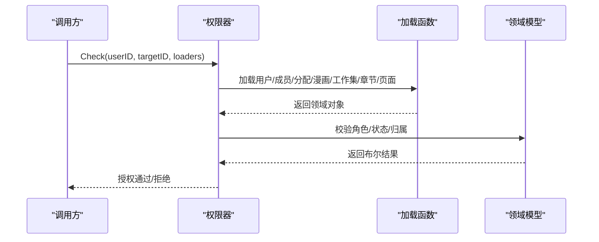

**图表来源**
- [backend/backend-v1/internal/domain/model/permission.go:1-845](file://backend/backend-v1/internal/domain/model/permission.go#L1-L845)
- [backend/backend-v1/internal/domain/model/role.go:1-56](file://backend/backend-v1/internal/domain/model/role.go#L1-L56)
- [backend/backend-v1/internal/domain/model/workflow.go:1-36](file://backend/backend-v1/internal/domain/model/workflow.go#L1-L36)

**章节来源**
- [backend/backend-v1/internal/domain/model/permission.go:1-845](file://backend/backend-v1/internal/domain/model/permission.go#L1-L845)
- [backend/backend-v1/internal/domain/model/role.go:1-56](file://backend/backend-v1/internal/domain/model/role.go#L1-L56)
- [backend/backend-v1/internal/domain/model/workflow.go:1-36](file://backend/backend-v1/internal/domain/model/workflow.go#L1-L36)

## 依赖分析
- 聚合内依赖
  - ChapterInfo/AssignmentInfo/MemberInfo/InvitationInfo/WorksetInfo/ComicInfo/PageInfo/UserInfo 互不直接依赖，通过外键 ID 关联
  - UnitInfo 依赖 PageID，UnitPatch 依赖 UnitInfo 的 ID
- 聚合间依赖
  - ComicInfo.WorksetID -> WorksetInfo
  - WorksetInfo.TeamID -> TeamInfo
  - ChapterInfo.ComicID -> ComicInfo
  - PageInfo.ChapterID -> ChapterInfo
  - AssignmentInfo.ChapterID -> ChapterInfo, UserID -> UserInfo
  - MemberInfo.UserID -> UserInfo, TeamID -> TeamInfo
  - InvitationInfo.TargetTeamID -> TeamInfo
- 横切依赖
  - role.go 提供角色常量与掩码工具
  - workflow.go 提供流程状态与校验
  - permission.go 通过加载器函数访问各聚合信息，实现统一授权

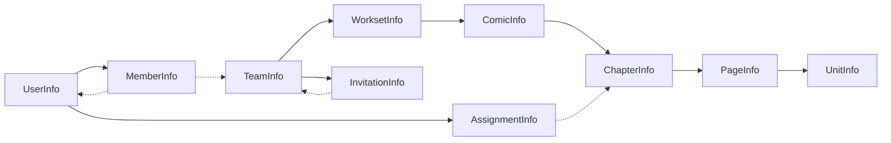

**图表来源**
- [backend/backend-v1/internal/domain/model/user.go:1-100](file://backend/backend-v1/internal/domain/model/user.go#L1-L100)
- [backend/backend-v1/internal/domain/model/team.go:1-63](file://backend/backend-v1/internal/domain/model/team.go#L1-L63)
- [backend/backend-v1/internal/domain/model/workset.go:1-82](file://backend/backend-v1/internal/domain/model/workset.go#L1-L82)
- [backend/backend-v1/internal/domain/model/comic.go:1-107](file://backend/backend-v1/internal/domain/model/comic.go#L1-L107)
- [backend/backend-v1/internal/domain/model/chapter.go:1-260](file://backend/backend-v1/internal/domain/model/chapter.go#L1-L260)
- [backend/backend-v1/internal/domain/model/page.go:1-134](file://backend/backend-v1/internal/domain/model/page.go#L1-L134)
- [backend/backend-v1/internal/domain/model/unit.go:1-149](file://backend/backend-v1/internal/domain/model/unit.go#L1-L149)
- [backend/backend-v1/internal/domain/model/assignment.go:1-190](file://backend/backend-v1/internal/domain/model/assignment.go#L1-L190)
- [backend/backend-v1/internal/domain/model/member.go:1-205](file://backend/backend-v1/internal/domain/model/member.go#L1-L205)
- [backend/backend-v1/internal/domain/model/invitation.go:1-158](file://backend/backend-v1/internal/domain/model/invitation.go#L1-L158)

**章节来源**
- [backend/backend-v1/internal/domain/model/user.go:1-100](file://backend/backend-v1/internal/domain/model/user.go#L1-L100)
- [backend/backend-v1/internal/domain/model/team.go:1-63](file://backend/backend-v1/internal/domain/model/team.go#L1-L63)
- [backend/backend-v1/internal/domain/model/workset.go:1-82](file://backend/backend-v1/internal/domain/model/workset.go#L1-L82)
- [backend/backend-v1/internal/domain/model/comic.go:1-107](file://backend/backend-v1/internal/domain/model/comic.go#L1-L107)
- [backend/backend-v1/internal/domain/model/chapter.go:1-260](file://backend/backend-v1/internal/domain/model/chapter.go#L1-L260)
- [backend/backend-v1/internal/domain/model/page.go:1-134](file://backend/backend-v1/internal/domain/model/page.go#L1-L134)
- [backend/backend-v1/internal/domain/model/unit.go:1-149](file://backend/backend-v1/internal/domain/model/unit.go#L1-L149)
- [backend/backend-v1/internal/domain/model/assignment.go:1-190](file://backend/backend-v1/internal/domain/model/assignment.go#L1-L190)
- [backend/backend-v1/internal/domain/model/member.go:1-205](file://backend/backend-v1/internal/domain/model/member.go#L1-L205)
- [backend/backend-v1/internal/domain/model/invitation.go:1-158](file://backend/backend-v1/internal/domain/model/invitation.go#L1-L158)

## 性能考虑
- 延迟加载策略
  - Info 结构体中包含关联对象指针（如 ChapterInfo.Comic、PageInfo.Creator），仅在 includes 参数启用时填充，避免不必要的跨表查询
- 掩码与状态计算
  - 角色掩码与流程状态计算为 O(1)，避免复杂遍历
- 更新策略
  - AssignmentUpdate/MemberUpdate/ChapterUpdate 通过保留已有时间戳与按需赋值，减少冗余写入
- 分页与过滤
  - 应用层值对象提供分页参数校验，建议在仓储层实现分页与索引优化

## 故障排查指南
- 常见错误来源
  - 参数校验失败：注册/更新用户、创建/更新团队、章节状态更新等
  - 权限不足：需要管理员或特定角色才能执行的操作
  - 状态非法：章节状态组合不符合 IsValidWorkflowCombination
- 定位方法
  - 查看 permission.go 中对应权限器的 Check 方法与加载链路
  - 校验 ChapterUpdate/AssignmentUpdate/MemberUpdate 的时间戳保留逻辑
  - 使用 role.go 的掩码工具核对角色集合

**章节来源**
- [backend/backend-v1/internal/value/user.go:1-171](file://backend/backend-v1/internal/value/user.go#L1-L171)
- [backend/backend-v1/internal/value/team.go:1-112](file://backend/backend-v1/internal/value/team.go#L1-L112)
- [backend/backend-v1/internal/domain/model/permission.go:1-845](file://backend/backend-v1/internal/domain/model/permission.go#L1-L845)
- [backend/backend-v1/internal/domain/model/workflow.go:1-36](file://backend/backend-v1/internal/domain/model/workflow.go#L1-L36)
- [backend/backend-v1/internal/domain/model/chapter.go:1-260](file://backend/backend-v1/internal/domain/model/chapter.go#L1-L260)
- [backend/backend-v1/internal/domain/model/assignment.go:1-190](file://backend/backend-v1/internal/domain/model/assignment.go#L1-L190)
- [backend/backend-v1/internal/domain/model/member.go:1-205](file://backend/backend-v1/internal/domain/model/member.go#L1-L205)

## 结论
本领域模型以清晰的聚合边界与数据载体（Info/Creation/Update）表达业务不变性与规则，配合角色/权限/流程状态的横切能力，形成可维护、可扩展的 DDD 设计。建议在后续演进中：
- 明确聚合根与边界，避免跨聚合循环依赖
- 对关键状态转换补充领域事件与审计日志
- 在仓储层落实延迟加载与索引优化，提升读性能

## 附录
- 最佳实践清单
  - 聚合设计
    - 以业务语义定义聚合根，保持聚合内一致性
    - 通过外键 ID 关联，避免循环依赖
  - 边界划分
    - 将授权与状态校验下沉至 permission.go/workflow.go
    - 输入校验放在应用层值对象，领域层专注业务规则
  - 领域事件
    - 在关键状态转换处引入事件，解耦下游处理
  - 代码示例路径
    - 用户注册与校验：[backend/backend-v1/internal/value/user.go:41-69](file://backend/backend-v1/internal/value/user.go#L41-L69)
    - 章节状态更新与保留时间戳：[backend/backend-v1/internal/domain/model/chapter.go:141-259](file://backend/backend-v1/internal/domain/model/chapter.go#L141-L259)
    - 分配创建与角色掩码：[backend/backend-v1/internal/domain/model/assignment.go:127-149](file://backend/backend-v1/internal/domain/model/assignment.go#L127-L149)
    - 成员角色查询与掩码：[backend/backend-v1/internal/domain/model/member.go:101-164](file://backend/backend-v1/internal/domain/model/member.go#L101-L164)
    - 权限检查统一入口：[backend/backend-v1/internal/domain/model/permission.go:212-246](file://backend/backend-v1/internal/domain/model/permission.go#L212-L246)