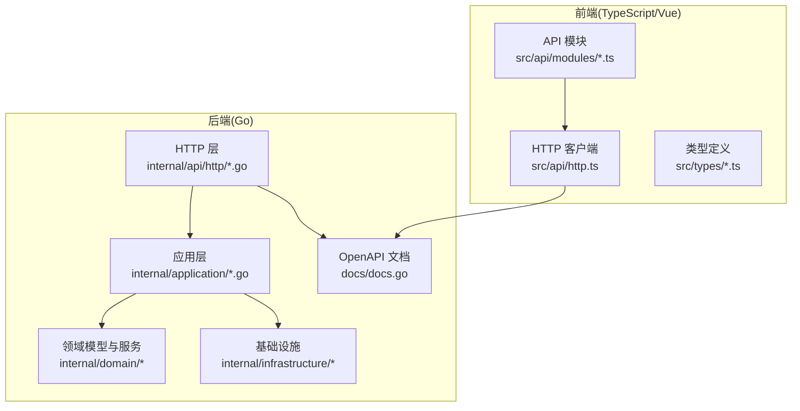
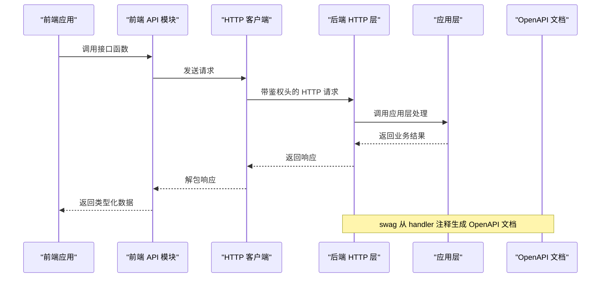
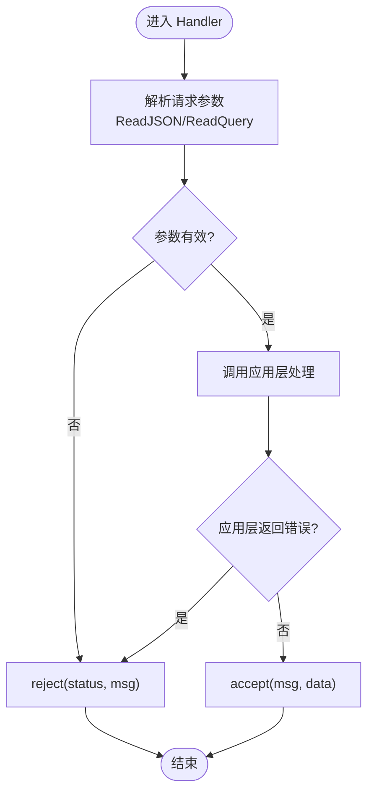
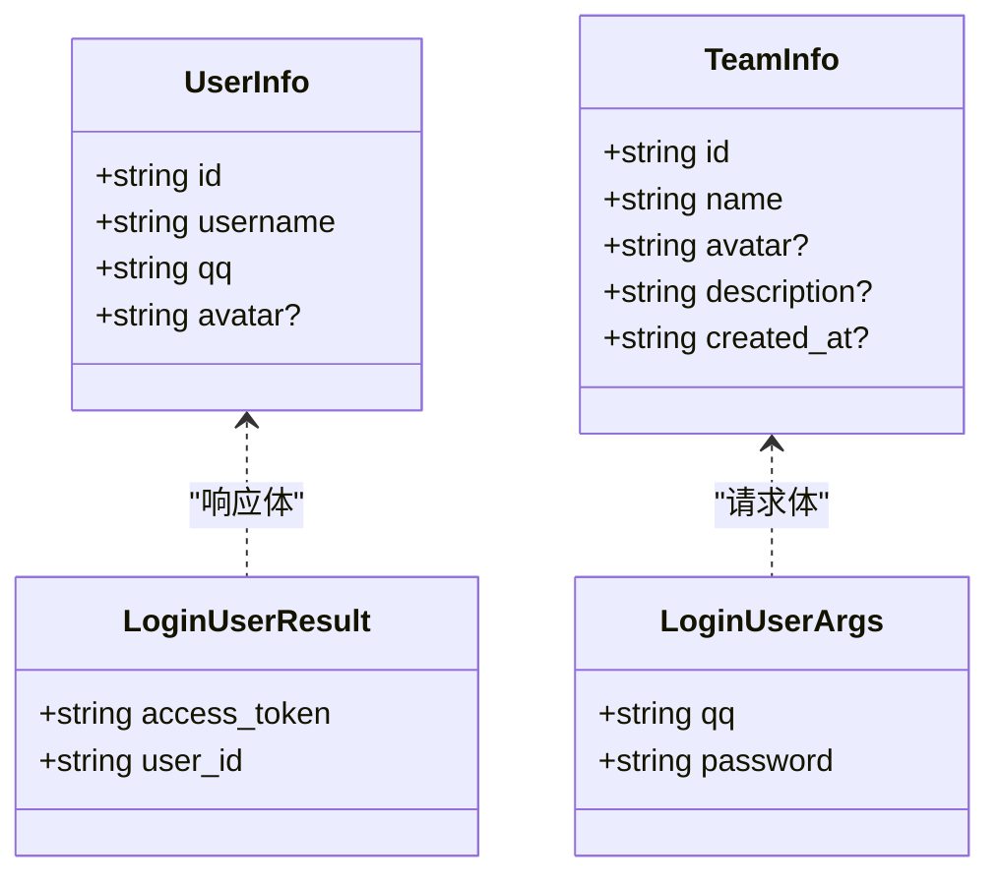
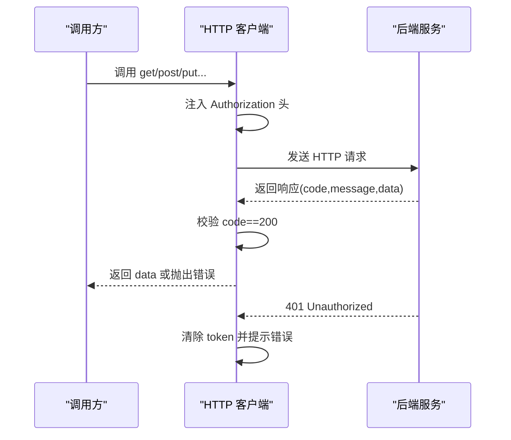
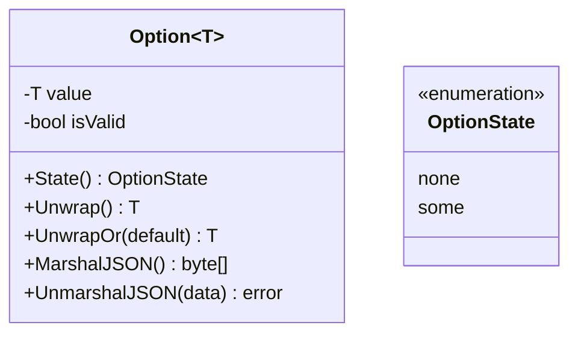
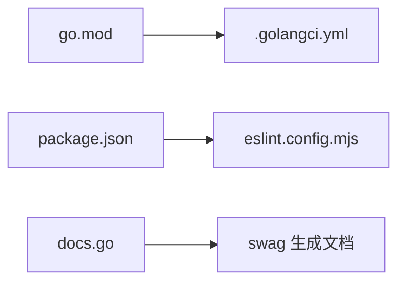

# 代码风格规范

<cite>
**本文引用的文件**
- [go.mod](file://backend/backend-v1/go.mod)
- [.golangci.yml](file://backend/backend-v1/.golangci.yml)
- [docs-comment-format.md](file://backend/backend-v1/docs/docs-comment-format.md)
- [docs.go](file://backend/backend-v1/docs/docs.go)
- [auth.go](file://backend/backend-v1/internal/api/http/auth.go)
- [team.go](file://backend/backend-v1/internal/api/http/team.go)
- [user.go](file://backend/backend-v1/internal/api/http/user.go)
- [user.go](file://backend/backend-v1/internal\application/user.go)
- [option.go](file://backend/backend-v1/internal/util/option.go)
- [error.go](file://backend/backend-v1/internal/application/error.go)
- [package.json](file://web/package.json)
- [eslint.config.mjs](file://web/eslint.config.mjs)
- [tsconfig.json](file://web/tsconfig.json)
- [auth.ts](file://web/src/api/modules/auth.ts)
- [http.ts](file://web/src/api/http.ts)
- [domain.ts](file://web/src/types/domain.ts)
</cite>

## 目录
1. [引言](#引言)
2. [项目结构](#项目结构)
3. [核心组件](#核心组件)
4. [架构总览](#架构总览)
5. [详细组件分析](#详细组件分析)
6. [依赖分析](#依赖分析)
7. [性能考虑](#性能考虑)
8. [故障排查指南](#故障排查指南)
9. [结论](#结论)
10. [附录](#附录)

## 引言
本文件为 Poprako 项目的代码风格规范文档，覆盖以下方面：
- Go 编码标准：命名约定、函数设计、错误处理、注释格式与 OpenAPI 文档注解规范
- TypeScript/Vue.js 编码规范：组件命名、接口定义、类型约束与 ESLint 规则
- 代码格式化与检查工具：gofmt、golangci-lint、prettier、ESLint 的配置与使用
- 注释与文档生成：OpenAPI declarative comment 的标签标准、注释格式与文档生成流程
- 实际示例路径：通过“章节来源”定位到仓库中的具体实现与注释示例

## 项目结构
Poprako 采用前后端分离的模块化组织方式：
- 后端（Go）：基于 Iris 框架，采用分层架构（HTTP 层、应用层、领域层、基础设施层）
- 前端（TypeScript/Vue.js）：基于 Vite + Vue 3 + TypeScript，统一的 HTTP 客户端封装与类型定义

图示来源
- [auth.go:1-73](file://backend/backend-v1/internal/api/http/auth.go#L1-L73)
- [team.go:1-289](file://backend/backend-v1/internal/api/http/team.go#L1-L289)
- [user.go:1-292](file://backend/backend-v1/internal/api/http/user.go#L1-L292)
- [user.go:1-594](file://backend/backend-v1/internal\application/user.go#L1-L594)
- [docs.go:1-2958](file://backend/backend-v1/docs/docs.go#L1-L2958)
- [auth.ts:1-157](file://web/src/api/modules/auth.ts#L1-L157)
- [http.ts:1-196](file://web/src/api/http.ts#L1-L196)
- [domain.ts:1-89](file://web/src/types/domain.ts#L1-L89)

章节来源
- [go.mod:1-113](file://backend/backend-v1/go.mod#L1-L113)
- [tsconfig.json:1-12](file://web/tsconfig.json#L1-L12)

## 核心组件
- 后端 HTTP 层：负责路由与请求处理，使用 OpenAPI declarative comment 提供文档元数据
- 应用层：编排业务流程，统一错误处理与日志追踪
- 前端 API 层：封装 HTTP 客户端，统一鉴权、错误处理与响应解包
- 类型系统：前后端类型一一对应，保证契约一致性

章节来源
- [auth.go:10-40](file://backend/backend-v1/internal/api/http/auth.go#L10-L40)
- [team.go:10-86](file://backend/backend-v1/internal/api/http/team.go#L10-L86)
- [user.go:10-49](file://backend/backend-v1/internal/api/http/user.go#L10-L49)
- [user.go:21-64](file://backend/backend-v1/internal\application/user.go#L21-L64)
- [auth.ts:1-157](file://web/src/api/modules/auth.ts#L1-L157)
- [http.ts:33-196](file://web/src/api/http.ts#L33-L196)
- [domain.ts:1-89](file://web/src/types/domain.ts#L1-L89)

## 架构总览
后端通过 swag 从 HTTP handler 的注释中提取 OpenAPI 文档，前端通过统一 HTTP 客户端与后端交互。

图示来源
- [auth.ts:102-123](file://web/src/api/modules/auth.ts#L102-L123)
- [http.ts:102-112](file://web/src/api/http.ts#L102-L112)
- [auth.go:22-40](file://backend/backend-v1/internal/api/http/auth.go#L22-L40)
- [docs.go:242-274](file://backend/backend-v1/docs/docs.go#L242-L274)

## 详细组件分析

### Go 代码风格与 OpenAPI 注释规范
- 命名约定
  - 包名小写、简短且具描述性
  - 结构体与接口采用名词形式，如 UserInfo、UserApplication
  - 方法遵循动宾结构，如 GetUser、LoginUser
- 函数设计
  - Handler 函数统一返回 iris.Handler，内部使用闭包处理请求
  - 参数解析优先使用 ctx.ReadJSON 或 ctx.ReadQuery，失败时统一调用 reject 并返回
  - 成功响应统一使用 accept 包裹消息与数据
- 错误处理
  - 应用层使用常量 ErrInternalError 表示内部错误码
  - 对外错误统一返回客户端可理解的消息，避免泄露内部细节
- OpenAPI 注释规范
  - 使用 swag 注解，严格遵循 @Summary、@Description、@Param、@Tags、@Accept、@Produce、@Success、@Router 等标签
  - @Param 的 in 字段支持 path、query、body，类型与必填项需与值对象一致
  - @Success 的 schema 使用 value.* 类型，确保与前端类型定义一致

图示来源
- [auth.go:22-40](file://backend/backend-v1/internal/api/http/auth.go#L22-L40)
- [team.go:62-85](file://backend/backend-v1/internal/api/http/team.go#L62-L85)
- [user.go:22-48](file://backend/backend-v1/internal/api/http/user.go#L22-L48)
- [error.go:3-7](file://backend/backend-v1/internal/application/error.go#L3-L7)

章节来源
- [docs-comment-format.md:1-29](file://backend/backend-v1/docs/docs-comment-format.md#L1-L29)
- [docs.go:242-274](file://backend/backend-v1/docs/docs.go#L242-L274)
- [auth.go:10-21](file://backend/backend-v1/internal/api/http/auth.go#L10-L21)
- [team.go:49-61](file://backend/backend-v1/internal/api/http/team.go#L49-L61)
- [user.go:10-21](file://backend/backend-v1/internal/api/http/user.go#L10-L21)
- [error.go:3-7](file://backend/backend-v1/internal/application/error.go#L3-L7)

### TypeScript/Vue.js 代码风格
- 组件命名
  - 文件名使用 PascalCase，如 LoginView.vue
  - 组件导出名称与文件名一致
- 接口定义
  - 与后端 Swagger 值对象一一对应，使用清晰的字段注释
  - 请求体与响应体分别定义为独立接口，便于复用
- 类型约束
  - 使用只读属性与可选字段（?）表达可选性
  - 使用联合类型表达枚举值（如 role）
- ESLint 规则
  - 使用 @typescript-eslint 与 eslint-plugin-vue 的推荐规则
  - 关闭 vue 组件多词命名限制，允许单字母组件名
  - 放宽 any 类型警告，提升迁移阶段灵活性

图示来源
- [domain.ts:7-16](file://web/src/types/domain.ts#L7-L16)
- [domain.ts:21-32](file://web/src/types/domain.ts#L21-L32)
- [auth.ts:10-15](file://web/src/api/modules/auth.ts#L10-L15)
- [auth.ts:42-47](file://web/src/api/modules/auth.ts#L42-L47)

章节来源
- [auth.ts:1-157](file://web/src/api/modules/auth.ts#L1-L157)
- [domain.ts:1-89](file://web/src/types/domain.ts#L1-L89)
- [eslint.config.mjs:1-40](file://web/eslint.config.mjs#L1-L40)
- [package.json:6-11](file://web/package.json#L6-L11)

### HTTP 客户端与统一错误处理
- 鉴权：自动从 localStorage 读取 access_token 并注入 Authorization 头
- 错误处理：标准化响应体，401 自动清除 token 并跳转登录
- 响应解包：统一从响应体中提取 code、message、data，并按需返回

图示来源
- [http.ts:66-77](file://web/src/api/http.ts#L66-L77)
- [http.ts:82-97](file://web/src/api/http.ts#L82-L97)
- [http.ts:102-112](file://web/src/api/http.ts#L102-L112)

章节来源
- [http.ts:1-196](file://web/src/api/http.ts#L1-L196)

### Option 泛型与 JSON 序列化
- Option 模式用于表达可选值，None 时序列化为 null，Some 时序列化内部值
- 支持指针类型的特判，避免 nil 指针导致的异常

图示来源
- [option.go:10-101](file://backend/backend-v1/internal/util/option.go#L10-L101)

章节来源
- [option.go:1-101](file://backend/backend-v1/internal/util/option.go#L1-L101)

## 依赖分析
- 后端依赖管理：go.mod 声明了 Iris、GORM、Swag、Zap 等关键库
- Lint 配置：.golangci.yml 启用 govet、staticcheck、errcheck、unused、gosec、gocritic、misspell 等
- 前端依赖：package.json 定义了开发脚本与依赖，eslint.config.mjs 配置 ESLint 规则

图示来源
- [go.mod:1-113](file://backend/backend-v1/go.mod#L1-L113)
- [.golangci.yml:1-31](file://backend/backend-v1/.golangci.yml#L1-L31)
- [package.json:1-36](file://web/package.json#L1-L36)
- [eslint.config.mjs:1-40](file://web/eslint.config.mjs#L1-L40)
- [docs.go:1-2958](file://backend/backend-v1/docs/docs.go#L1-L2958)

章节来源
- [go.mod:1-113](file://backend/backend-v1/go.mod#L1-L113)
- [.golangci.yml:1-31](file://backend/backend-v1/.golangci.yml#L1-L31)
- [package.json:1-36](file://web/package.json#L1-L36)
- [eslint.config.mjs:1-40](file://web/eslint.config.mjs#L1-L40)

## 性能考虑
- 后端
  - 使用事务封装多步骤写操作，减少数据库往返
  - 通过 includes 参数控制关联信息加载，避免 N+1 查询
  - 使用预签名 URL 进行直传，降低网关压力
- 前端
  - 统一的查询参数序列化，兼容 includes[] 数组格式
  - 本地鉴权头注入，避免重复拼装

## 故障排查指南
- OpenAPI 文档未更新
  - 确认 handler 注释符合规范，执行 swag 初始化命令
  - 检查 docs.go 是否包含对应路径与参数定义
- 前端请求 401
  - 检查本地是否存在 access_token
  - 确认后端鉴权中间件与路由匹配
- 参数解析失败
  - 后端：检查 ctx.ReadJSON/ctx.ReadQuery 的参数名与类型
  - 前端：确认请求体与查询参数与接口定义一致

章节来源
- [docs-comment-format.md:1-29](file://backend/backend-v1/docs/docs-comment-format.md#L1-L29)
- [docs.go:1-2958](file://backend/backend-v1/docs/docs.go#L1-L2958)
- [http.ts:82-97](file://web/src/api/http.ts#L82-L97)
- [auth.ts:102-123](file://web/src/api/modules/auth.ts#L102-L123)

## 结论
本规范明确了 Poprako 项目的 Go 与 TypeScript/Vue.js 编码风格、注释与文档生成规则、以及工具链配置。建议团队在日常开发中：
- 严格遵循 OpenAPI 注释规范，确保文档与实现一致
- 使用统一的 HTTP 客户端与类型定义，保证前后端契约稳定
- 通过工具链自动化检查与格式化，提升代码质量与协作效率

## 附录

### Go 命名与注释示例路径
- Handler 注释模板与标签使用：[auth.go:10-21](file://backend/backend-v1/internal/api/http/auth.go#L10-L21)
- 带安全与参数的注释示例：[team.go:49-61](file://backend/backend-v1/internal/api/http/team.go#L49-L61)
- 路径参数与 Body 参数示例：[user.go:10-21](file://backend/backend-v1/internal/api/http/user.go#L10-L21)

章节来源
- [auth.go:10-21](file://backend/backend-v1/internal/api/http/auth.go#L10-L21)
- [team.go:49-61](file://backend/backend-v1/internal/api/http/team.go#L49-L61)
- [user.go:10-21](file://backend/backend-v1/internal/api/http/user.go#L10-L21)

### TypeScript 接口与类型示例路径
- 用户信息与团队信息接口：[domain.ts:7-32](file://web/src/types/domain.ts#L7-L32)
- 认证相关请求与响应接口：[auth.ts:10-67](file://web/src/api/modules/auth.ts#L10-L67)
- HTTP 客户端封装与错误处理：[http.ts:33-196](file://web/src/api/http.ts#L33-L196)

章节来源
- [domain.ts:1-89](file://web/src/types/domain.ts#L1-L89)
- [auth.ts:1-157](file://web/src/api/modules/auth.ts#L1-L157)
- [http.ts:1-196](file://web/src/api/http.ts#L1-L196)

### 工具链配置与使用
- Go 格式化与检查
  - gofmt：由 golangci-lint 的 formatters 启用
  - golangci-lint：启用 govet、staticcheck、errcheck、unused、gosec、gocritic、misspell
- 前端格式化与检查
  - ESLint：使用 @typescript-eslint 与 eslint-plugin-vue 的推荐规则
  - 脚本：lint、type-check、build、preview

章节来源
- [.golangci.yml:20-31](file://backend/backend-v1/.golangci.yml#L20-L31)
- [package.json:6-11](file://web/package.json#L6-L11)
- [eslint.config.mjs:32-39](file://web/eslint.config.mjs#L32-L39)