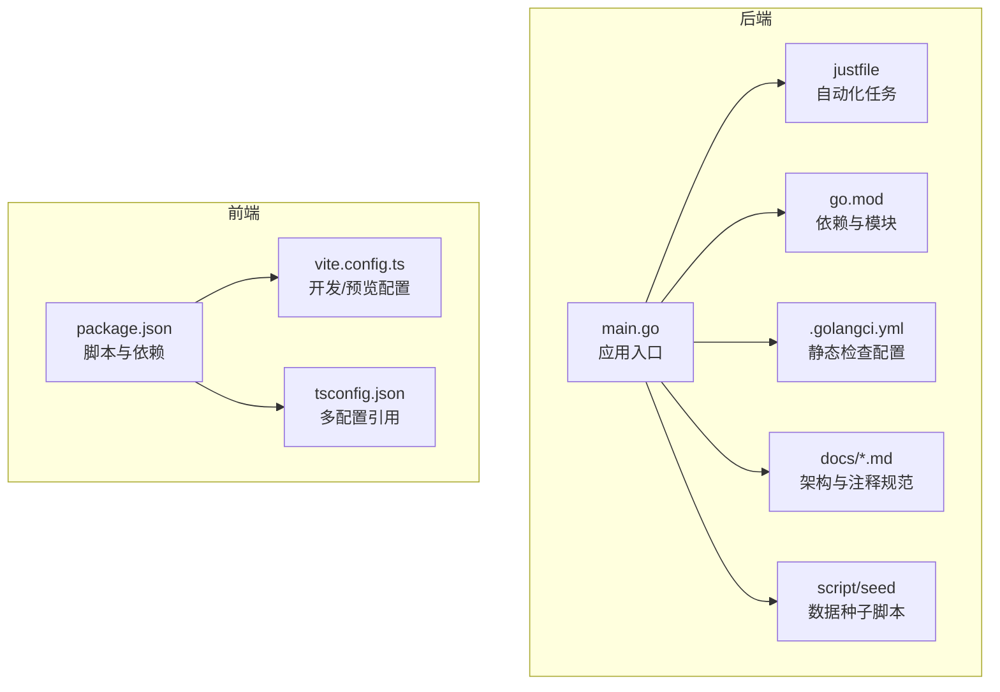
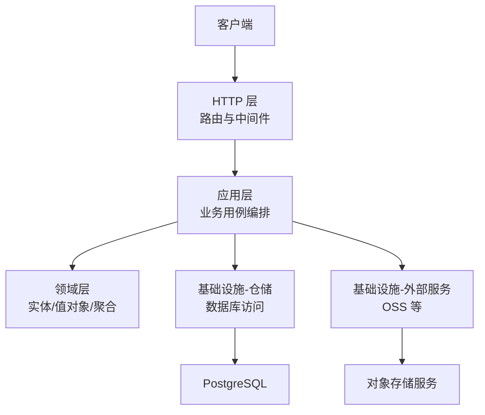
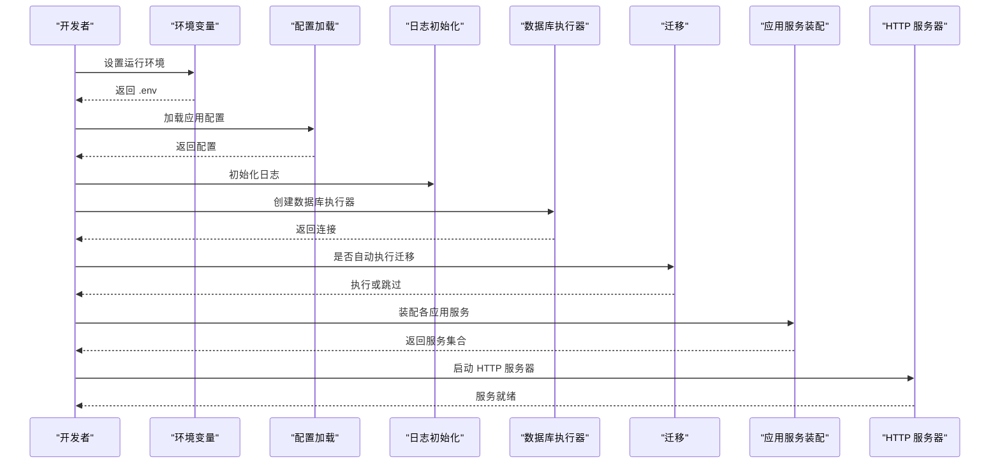
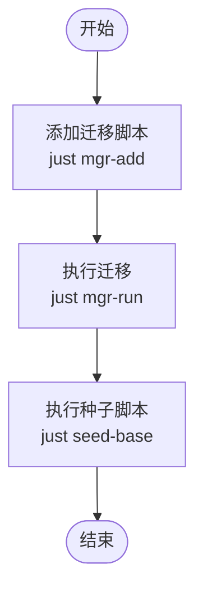
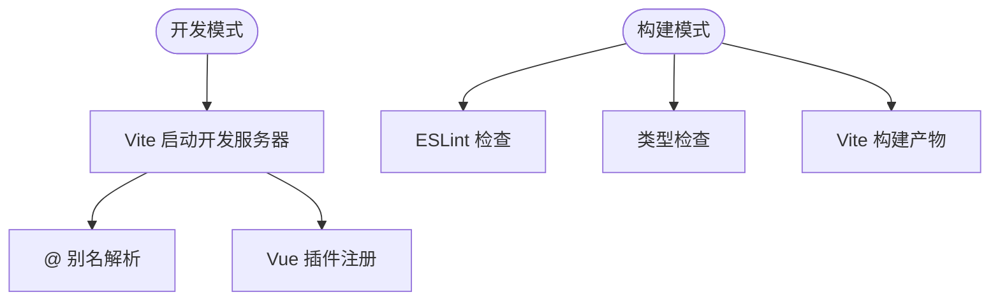
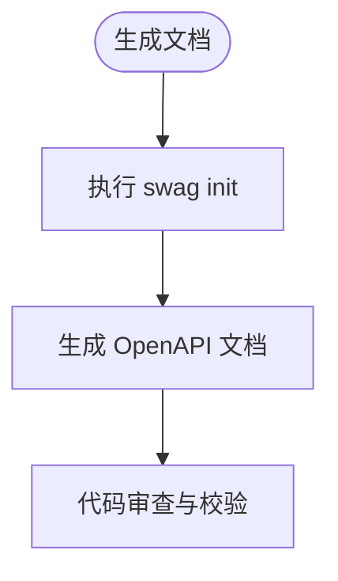
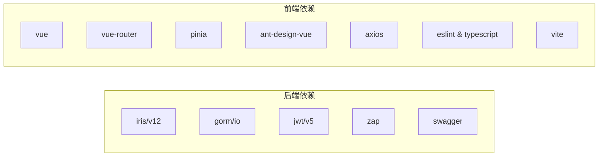

# 开发工作流

<cite>
**本文引用的文件**
- [backend/justfile](file://backend/justfile)
- [backend/go.mod](file://backend/go.mod)
- [backend/main.go](file://backend/main.go)
- [backend/.golangci.yml](file://backend/.golangci.yml)
- [web/package.json](file://web/package.json)
- [web/vite.config.ts](file://web/vite.config.ts)
- [web/tsconfig.json](file://web/tsconfig.json)
- [backend/script/seed/README.md](file://backend/script/seed/README.md)
- [backend/docs/docs-comment-format.md](file://backend/docs/docs-comment-format.md)
- [backend/docs/refactor-progress.md](file://backend/docs/refactor-progress.md)
- [backend/docs/workset-include-internal-logic.md](file://backend/docs/workset-include-internal-logic.md)
- [backend/docs/ARCHETECT.md](file://backend/docs/ARCHETECT.md)
</cite>

## 目录
1. [简介](#简介)
2. [项目结构](#项目结构)
3. [核心组件](#核心组件)
4. [架构总览](#架构总览)
5. [详细组件分析](#详细组件分析)
6. [依赖分析](#依赖分析)
7. [性能考虑](#性能考虑)
8. [故障排除指南](#故障排除指南)
9. [结论](#结论)
10. [附录](#附录)

## 简介
本文件面向 Poprako 项目的开发团队，系统化梳理从本地开发到代码审查、质量门禁与发布的完整工作流。内容覆盖：
- Git 分支策略与提交规范
- 代码审查流程与质量门禁
- 发布流程与版本管理建议
- 开发环境搭建（后端 Go、前端 Vue、数据库）
- IDE 推荐配置（VS Code 插件与工具链）
- 开发工具与自动化任务（Justfile、代码生成、调试）
- 团队协作流程（任务分配、进度跟踪、沟通规范）
- 常见开发场景操作指南与故障排除

## 项目结构
项目采用前后端分离架构：
- 后端（Go）位于 backend 目录，包含应用主程序、领域模型、应用层、基础设施与脚本等模块。
- 前端（Vue 3 + TypeScript）位于 web 目录，使用 Vite 构建，包含路由、状态管理、API 模块与主题配置。
- 根目录包含 Git 子模块配置与种子脚本目录。

**图表来源**
- [backend/main.go:1-170](file://backend/main.go#L1-L170)
- [backend/justfile:1-39](file://backend/justfile#L1-L39)
- [backend/go.mod:1-114](file://backend/go.mod#L1-L114)
- [backend/.golangci.yml:1-31](file://backend/.golangci.yml#L1-L31)
- [web/package.json:1-36](file://web/package.json#L1-L36)
- [web/vite.config.ts:1-44](file://web/vite.config.ts#L1-L44)
- [web/tsconfig.json:1-12](file://web/tsconfig.json#L1-L12)

**章节来源**
- [backend/main.go:1-170](file://backend/main.go#L1-L170)
- [backend/justfile:1-39](file://backend/justfile#L1-L39)
- [backend/go.mod:1-114](file://backend/go.mod#L1-L114)
- [backend/.golangci.yml:1-31](file://backend/.golangci.yml#L1-L31)
- [web/package.json:1-36](file://web/package.json#L1-L36)
- [web/vite.config.ts:1-44](file://web/vite.config.ts#L1-L44)
- [web/tsconfig.json:1-12](file://web/tsconfig.json#L1-L12)

## 核心组件
- 后端应用入口负责加载环境变量、初始化日志、数据库迁移、装配各应用服务，并启动 HTTP 服务器。
- Justfile 提供统一的开发与运维任务，包括代码格式化、静态检查、Swagger 文档生成、数据库迁移与种子脚本执行。
- 前端通过 Vite 提供开发服务器与构建能力，支持 ESLint 类型检查与构建预览。
- 文档目录包含架构说明、注释规范与重构进度，便于团队协同与知识沉淀。

**章节来源**
- [backend/main.go:28-156](file://backend/main.go#L28-L156)
- [backend/justfile:6-38](file://backend/justfile#L6-L38)
- [web/vite.config.ts:21-42](file://web/vite.config.ts#L21-L42)
- [backend/docs/ARCHETECT.md](file://backend/docs/ARCHETECT.md)

## 架构总览
后端采用分层架构：表示层（HTTP）、应用层（业务用例）、领域层（实体与值对象）、基础设施层（外部服务与存储）。应用入口集中装配各应用服务并启动 HTTP 服务器。

**图表来源**
- [backend/main.go:67-133](file://backend/main.go#L67-L133)

**章节来源**
- [backend/main.go:67-133](file://backend/main.go#L67-L133)

## 详细组件分析

### 后端应用入口与启动流程
- 加载环境变量与配置
- 初始化日志
- 可选自动执行数据库迁移
- 装配各应用服务（用户、团队、邀请、成员、作品集、漫画、章节、页面、任务、单元等）
- 启动 HTTP 服务器

**图表来源**
- [backend/main.go:28-156](file://backend/main.go#L28-L156)

**章节来源**
- [backend/main.go:28-156](file://backend/main.go#L28-L156)

### 数据库迁移与种子脚本
- 迁移命令通过 Justfile 统一管理，支持添加与执行迁移。
- 种子脚本位于 backend/script/seed，提供基础数据初始化能力。

**图表来源**
- [backend/justfile:24-38](file://backend/justfile#L24-L38)
- [backend/script/seed/README.md](file://backend/script/seed/README.md)

**章节来源**
- [backend/justfile:24-38](file://backend/justfile#L24-L38)
- [backend/script/seed/README.md](file://backend/script/seed/README.md)

### 前端构建与开发配置
- 使用 Vite 提供开发服务器与预览，支持自定义主机与端口。
- 包管理脚本包含开发、类型检查、ESLint 检查与构建预览。

**图表来源**
- [web/vite.config.ts:21-42](file://web/vite.config.ts#L21-L42)
- [web/package.json:6-12](file://web/package.json#L6-L12)

**章节来源**
- [web/vite.config.ts:1-44](file://web/vite.config.ts#L1-L44)
- [web/package.json:1-36](file://web/package.json#L1-L36)

### 代码生成与文档
- Swagger 文档生成通过 Justfile 的 swag 任务触发。
- 文档目录包含注释规范与架构说明，便于统一风格与知识沉淀。

**图表来源**
- [backend/justfile:6-7](file://backend/justfile#L6-L7)
- [backend/docs/docs-comment-format.md](file://backend/docs/docs-comment-format.md)

**章节来源**
- [backend/justfile:6-7](file://backend/justfile#L6-L7)
- [backend/docs/docs-comment-format.md](file://backend/docs/docs-comment-format.md)

## 依赖分析
- 后端依赖管理与模块声明位于 go.mod，包含 Web 框架、ORM、加密、JWT、Swagger、日志与数据库驱动等。
- 前端依赖由 package.json 管理，包含 Vue 3、Vue Router、Pinia、Ant Design Vue、Axios、ESLint、TypeScript 与 Vite 生态。

**图表来源**
- [backend/go.mod:5-18](file://backend/go.mod#L5-L18)
- [web/package.json:13-34](file://web/package.json#L13-L34)

**章节来源**
- [backend/go.mod:1-114](file://backend/go.mod#L1-L114)
- [web/package.json:1-36](file://web/package.json#L1-L36)

## 性能考虑
- 后端启动时可选择是否自动执行数据库迁移，避免在生产环境误触发。
- 前端构建阶段集成 ESLint 与类型检查，提前发现潜在问题，减少运行时开销。
- 使用 Justfile 将常用任务标准化，降低重复劳动与出错概率。

**章节来源**
- [backend/main.go:47-53](file://backend/main.go#L47-L53)
- [web/package.json:8-10](file://web/package.json#L8-L10)
- [backend/justfile:18-22](file://backend/justfile#L18-L22)

## 故障排除指南
- 后端启动失败
  - 检查环境变量与配置加载是否成功。
  - 确认数据库连接参数与迁移开关设置。
  - 查看日志初始化与 HTTP 服务器启动错误信息。
- 前端开发服务器无法访问
  - 校验 Vite 主机与端口配置，确保未被占用。
  - 清理缓存并重新安装依赖。
- 数据库迁移异常
  - 使用 Justfile 的迁移任务进行回滚或重试。
  - 检查迁移脚本与数据库权限。
- 代码生成失败
  - 确保 swag 工具可用并正确初始化。
  - 检查注释规范与接口定义。

**章节来源**
- [backend/main.go:28-53](file://backend/main.go#L28-L53)
- [web/vite.config.ts:8-25](file://web/vite.config.ts#L8-L25)
- [backend/justfile:24-38](file://backend/justfile#L24-L38)
- [backend/docs/docs-comment-format.md](file://backend/docs/docs-comment-format.md)

## 结论
本工作流文档提供了从本地开发到代码审查与发布的全链路指南。通过统一的工具链（Justfile、Vite、ESLint、golangci-lint）与清晰的文档规范，团队可以高效协作并保持代码质量与一致性。

## 附录

### Git 分支策略与提交规范
- 分支命名
  - 功能分支：feature/功能点描述
  - 修复分支：fix/问题编号或简述
  - 热修复：hotfix/紧急修复
- 提交规范
  - 类型：feat、fix、docs、style、refactor、test、chore
  - 格式：类型(作用域): 概要描述；正文说明变更原因与影响；关闭 Issue 编号
- 合并流程
  - PR 必须通过 CI 与代码审查
  - 合并前需更新变更日志与相关文档

### 代码审查流程与质量门禁
- 代码审查
  - 至少一名维护者批准
  - 关注安全性、可读性与一致性
- 质量门禁
  - 后端：golangci-lint 全部通过
  - 前端：ESLint 无警告、类型检查通过、构建成功
  - 文档：新增接口需补充注释与示例

**章节来源**
- [backend/.golangci.yml:7-23](file://backend/.golangci.yml#L7-L23)
- [web/package.json:8-10](file://web/package.json#L8-L10)
- [backend/docs/docs-comment-format.md](file://backend/docs/docs-comment-format.md)

### 发布流程
- 版本管理
  - 语义化版本：主版本.次版本.修订号
  - 发布前更新变更日志与依赖版本
- 后端发布
  - 生成 Linux 架构二进制产物
  - 部署至目标环境并验证迁移与日志
- 前端发布
  - 构建产物上传至静态资源服务
  - 验证路由与接口连通性

**章节来源**
- [backend/justfile:21-22](file://backend/justfile#L21-L22)
- [web/package.json](file://web/package.json#L10)

### 开发环境搭建
- 后端
  - 安装 Go 与数据库（PostgreSQL）
  - 安装 sqlx 与 swag 工具
  - 初始化依赖与环境变量
- 前端
  - 安装 Node.js 与包管理器
  - 安装依赖并启动开发服务器
- 数据库
  - 配置连接字符串与迁移开关
  - 执行迁移并导入种子数据

**章节来源**
- [backend/go.mod:1-114](file://backend/go.mod#L1-L114)
- [backend/justfile:24-38](file://backend/justfile#L24-L38)
- [web/package.json:1-36](file://web/package.json#L1-L36)

### IDE 配置推荐（VS Code）
- Go
  - 插件：Go、Gotools、GitLens
  - 设置：启用 vet、staticcheck、gofmt、goimports
- Vue/TypeScript
  - 插件：Vue Language Features、ESLint、TypeScript Importer
  - 设置：启用 ESLint、类型检查、自动格式化
- 通用
  - 使用 .editorconfig 与 Prettier 规范统一格式

### 开发工具与自动化任务
- Justfile
  - 代码格式化、静态检查、Swagger 生成、迁移与种子脚本
- 代码生成
  - Swagger 文档生成
- 调试
  - 后端：Delve 或 IDE 断点调试
  - 前端：浏览器开发者工具与 Vite 调试

**章节来源**
- [backend/justfile:1-39](file://backend/justfile#L1-L39)
- [backend/.golangci.yml:7-23](file://backend/.golangci.yml#L7-L23)

### 团队协作流程
- 任务分配
  - 使用 Issue 与里程碑规划迭代
  - 分配负责人与截止日期
- 进度跟踪
  - 每日站会同步进展与阻塞项
  - 使用看板可视化任务状态
- 沟通规范
  - 重要决策记录在文档中
  - PR 与讨论必须明确结论与后续动作

### 常见开发场景操作指南
- 新增接口
  - 后端：编写控制器、应用服务与仓储；更新 Swagger 注释
  - 前端：新增 API 模块与类型定义；更新路由与视图
- 数据库变更
  - 添加迁移脚本并测试回滚
  - 更新种子脚本以保证测试数据一致
- 本地联调
  - 前端代理后端接口或使用 CORS
  - 统一端口与主机配置，避免冲突

**章节来源**
- [backend/docs/workset-include-internal-logic.md](file://backend/docs/workset-include-internal-logic.md)
- [backend/docs/refactor-progress.md](file://backend/docs/refactor-progress.md)
- [backend/docs/ARCHETECT.md](file://backend/docs/ARCHETECT.md)