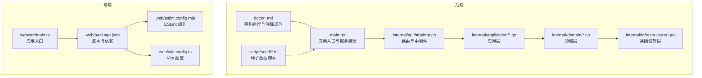
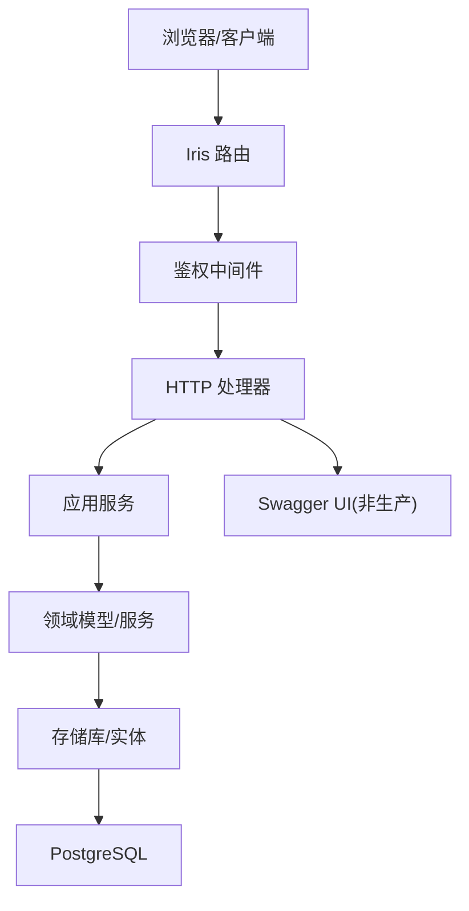
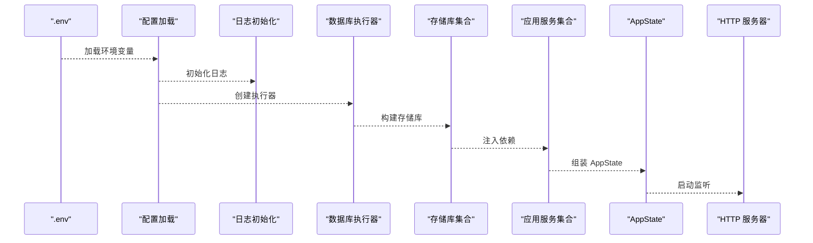
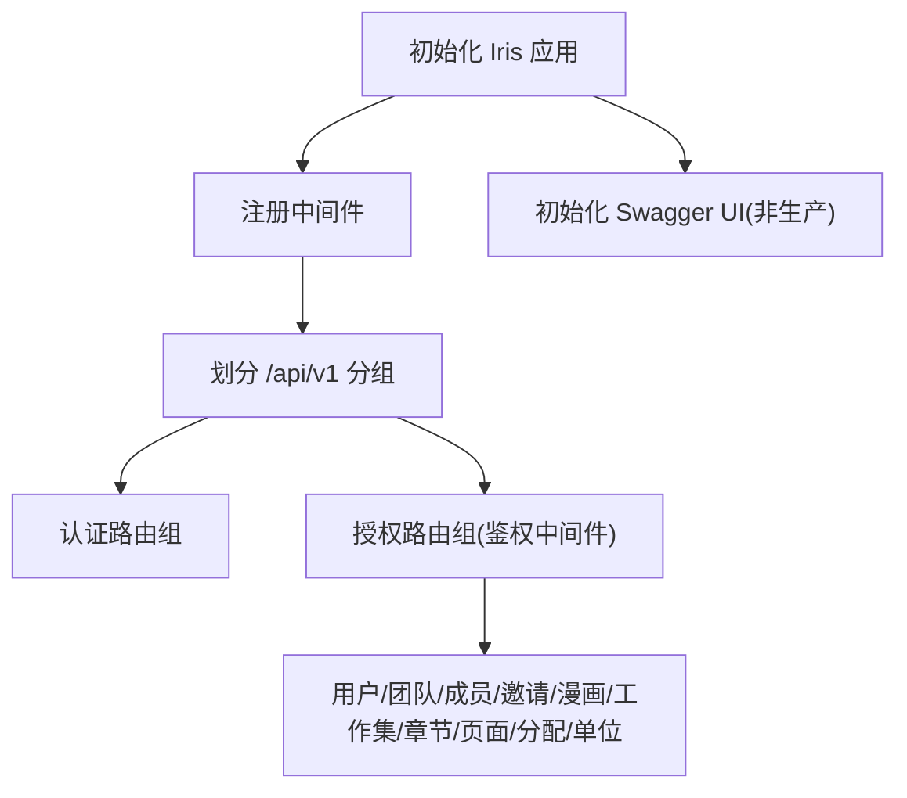
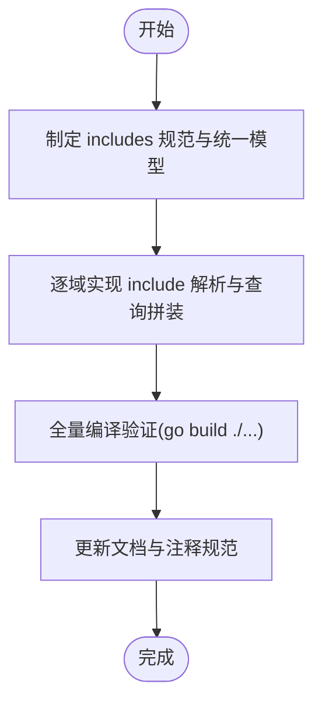
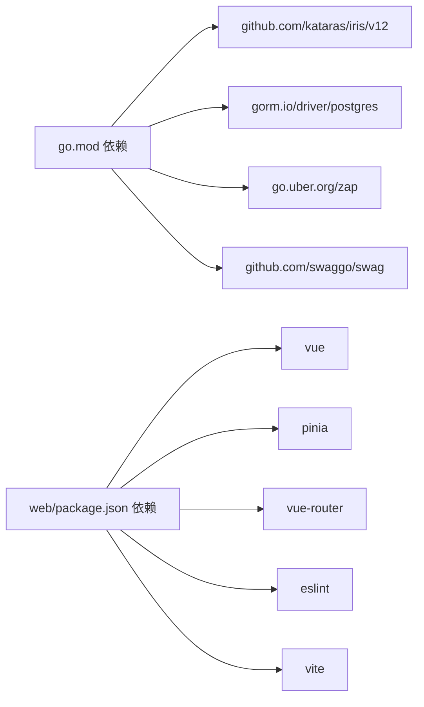

# 开发指南

<cite>
**本文引用的文件**
- [backend/README.md](file://backend/README.md)
- [backend/backend-v1/README.md](file://backend/backend-v1/README.md)
- [backend/backend-v1/go.mod](file://backend/backend-v1/go.mod)
- [backend/backend-v1/.golangci.yml](file://backend/backend-v1/.golangci.yml)
- [backend/backend-v1/justfile](file://backend/backend-v1/justfile)
- [backend/backend-v1/main.go](file://backend/backend-v1/main.go)
- [backend/backend-v1/internal/api/http/http.go](file://backend/backend-v1/internal/api/http/http.go)
- [backend/backend-v1/docs/refactor-progress.md](file://backend/backend-v1/docs/refactor-progress.md)
- [backend/backend-v1/docs/docs-comment-format.md](file://backend/backend-v1/docs/docs-comment-format.md)
- [backend/backend-v1/script/seed/README.md](file://backend/backend-v1/script/seed/README.md)
- [web/package.json](file://web/package.json)
- [web/eslint.config.mjs](file://web/eslint.config.mjs)
- [web/vite.config.ts](file://web/vite.config.ts)
- [web/src/main.ts](file://web/src/main.ts)
</cite>

## 目录
1. [简介](#简介)
2. [项目结构](#项目结构)
3. [核心组件](#核心组件)
4. [架构总览](#架构总览)
5. [详细组件分析](#详细组件分析)
6. [依赖关系分析](#依赖关系分析)
7. [性能考虑](#性能考虑)
8. [故障排查指南](#故障排查指南)
9. [结论](#结论)
10. [附录](#附录)

## 简介
本开发指南面向 Poprako 团队，系统性阐述代码风格规范、Git 工作流、测试规范与质量门禁、Go 与 TypeScript 编码标准、重构进度与代码质量要求、单元/集成/端到端测试编写指导、代码审查流程、开发工具与 IDE 配置、调试技巧、性能优化与并发最佳实践、文档与注释规范，以及团队协作与版本管理策略。内容基于仓库现有实现与文档，确保新老成员快速上手并保持一致的工程实践。

## 项目结构
项目采用前后端分离架构：
- 后端（Go）位于 backend/backend-v1，使用 Iris 框架、GORM 数据库访问层、Zap 日志、Swag/Swagger 文档生成、golangci-lint 质量检查。
- 前端（TypeScript/Vue3）位于 web，使用 Vite 构建、ESLint/Vue/TS 规则、Ant Design Vue 组件库、Pinia 状态管理、Vue Router 路由。
- 提供 Justfile 与脚本用于本地开发、迁移、文档生成与种子数据初始化。

图表来源
- [backend/backend-v1/main.go:1-146](file://backend/backend-v1/main.go#L1-L146)
- [backend/backend-v1/internal/api/http/http.go:1-167](file://backend/backend-v1/internal/api/http/http.go#L1-L167)
- [backend/backend-v1/docs/refactor-progress.md:1-224](file://backend/backend-v1/docs/refactor-progress.md#L1-L224)
- [backend/backend-v1/script/seed/README.md:1-16](file://backend/backend-v1/script/seed/README.md#L1-L16)
- [web/package.json:1-36](file://web/package.json#L1-L36)
- [web/eslint.config.mjs:1-40](file://web/eslint.config.mjs#L1-L40)
- [web/vite.config.ts:1-44](file://web/vite.config.ts#L1-L44)
- [web/src/main.ts:1-26](file://web/src/main.ts#L1-L26)

章节来源
- [backend/backend-v1/README.md:1-2](file://backend/backend-v1/README.md#L1-L2)
- [backend/backend-v1/go.mod:1-113](file://backend/backend-v1/go.mod#L1-L113)
- [web/package.json:1-36](file://web/package.json#L1-L36)

## 核心组件
- 应用入口与装配：后端通过 main.go 组装配置、日志、数据库执行器、存储库与应用服务，并启动 HTTP 服务器。
- HTTP 层：路由分派、鉴权中间件、Swagger 文档在非生产环境启用。
- 应用层：封装业务用例，协调存储库与外部服务（如 OSS）。
- 领域层：模型、值对象与服务，承载业务规则与校验。
- 基础设施层：数据库实体、查询选项、外部客户端（如 R2 OSS）。
- 前端入口：初始化 Vue、Pinia、Ant Design Vue、路由与样式。
- 质量工具：golangci-lint、ESLint、Vue/TS 类型检查、Vite 构建链路。

章节来源
- [backend/backend-v1/main.go:25-145](file://backend/backend-v1/main.go#L25-L145)
- [backend/backend-v1/internal/api/http/http.go:16-167](file://backend/backend-v1/internal/api/http/http.go#L16-L167)
- [web/src/main.ts:16-26](file://web/src/main.ts#L16-L26)

## 架构总览
后端采用分层架构（HTTP → 应用 → 领域 → 基础设施），通过依赖注入与接口解耦，支持可选嵌套查询（includes）与统一信息模型，提升可维护性与可扩展性。前端通过 Vite 构建，使用 ESLint/TS 类型检查保障质量。

图表来源
- [backend/backend-v1/internal/api/http/http.go:26-151](file://backend/backend-v1/internal/api/http/http.go#L26-L151)
- [backend/backend-v1/main.go:37-136](file://backend/backend-v1/main.go#L37-L136)

## 详细组件分析

### 后端入口与服务装配
- 加载 .env、读取配置、初始化日志。
- 构建数据库执行器与各类存储库。
- 组装应用服务并注入依赖。
- 初始化 AppState 并启动 HTTP 服务器。

图表来源
- [backend/backend-v1/main.go:25-145](file://backend/backend-v1/main.go#L25-L145)

章节来源
- [backend/backend-v1/main.go:25-145](file://backend/backend-v1/main.go#L25-L145)

### HTTP 路由与中间件
- 中间件：请求 ID、日志、panic 恢复。
- 路由分组：认证、用户、团队、成员、邀请、漫画、工作集、章节、页面、分配、单位。
- Swagger UI：非生产环境自动暴露文档。

图表来源
- [backend/backend-v1/internal/api/http/http.go:26-167](file://backend/backend-v1/internal/api/http/http.go#L26-L167)

章节来源
- [backend/backend-v1/internal/api/http/http.go:16-167](file://backend/backend-v1/internal/api/http/http.go#L16-L167)

### 重构进度与代码质量要求
- 重构目标：统一 info 层，将硬编码 JOIN 改为由 includes[] 驱动的可选嵌套查询，消除分裂返回类型。
- 已完成：Member/Team/User 域接入 includes，Comic/Chapter/Assignment 域进入第二阶段重构。
- 质量门禁：全量编译验证通过，确保 go build ./... 无错误。

图表来源
- [backend/backend-v1/docs/refactor-progress.md:131-224](file://backend/backend-v1/docs/refactor-progress.md#L131-L224)

章节来源
- [backend/backend-v1/docs/refactor-progress.md:1-224](file://backend/backend-v1/docs/refactor-progress.md#L1-L224)

### 文档注释与 OpenAPI 生成
- Handler 注释遵循 swag 格式，@Summary/@Description/@Param/@Tags/@Produce/@Success/@Router 等标签严格规范。
- 通过 swag init 生成 Swagger 文档，非生产环境自动暴露 UI。

章节来源
- [backend/backend-v1/docs/docs-comment-format.md:1-29](file://backend/backend-v1/docs/docs-comment-format.md#L1-L29)
- [backend/backend-v1/internal/api/http/http.go:153-167](file://backend/backend-v1/internal/api/http/http.go#L153-L167)

### 前端入口与构建配置
- 入口：初始化 Vue、Pinia、Ant Design Vue、路由与样式。
- 构建：Vite + ESLint + TS 类型检查 + 构建产物。
- 配置：支持自定义开发/预览端口与主机地址。

章节来源
- [web/src/main.ts:16-26](file://web/src/main.ts#L16-L26)
- [web/package.json:6-12](file://web/package.json#L6-L12)
- [web/vite.config.ts:21-42](file://web/vite.config.ts#L21-L42)

## 依赖关系分析
- 后端依赖：Iris、GORM、Zap、Swag、JWT、UUID、Viper、godotenv 等。
- 前端依赖：Vue3、Ant Design Vue、Axios、Pinia、Vue Router、ESLint、Vite、TS 等。
- 质量工具：golangci-lint、ESLint、Vue/TS 类型检查。

图表来源
- [backend/backend-v1/go.mod:5-18](file://backend/backend-v1/go.mod#L5-L18)
- [web/package.json:13-34](file://web/package.json#L13-L34)

章节来源
- [backend/backend-v1/go.mod:1-113](file://backend/backend-v1/go.mod#L1-L113)
- [web/package.json:1-36](file://web/package.json#L1-L36)

## 性能考虑
- 查询优化：通过 includes[] 动态拼装 JOIN，避免不必要的关联与字段加载，减少网络与序列化开销。
- 并发与锁：仓储层支持事务与行级锁（如 unit 锁定），保证高并发场景下的一致性与正确性。
- 日志与监控：Zap 提供高性能日志；结合请求 ID 中间件便于追踪。
- 前端构建：Vite 快速冷启动与热更新；ESLint/类型检查前置，降低运行时错误。

章节来源
- [backend/backend-v1/internal/infrastructure/repository/unit.go:32-42](file://backend/backend-v1/internal/infrastructure/repository/unit.go#L32-L42)
- [backend/backend-v1/internal/api/http/http.go:29-36](file://backend/backend-v1/internal/api/http/http.go#L29-L36)

## 故障排查指南
- 启动失败：检查 .env 是否正确加载、配置项是否完整、数据库连接是否可用。
- 路由异常：确认中间件顺序与鉴权逻辑，核对路由分组与路径。
- 文档不显示：确认非生产环境且 Swagger 初始化逻辑已执行。
- 前端构建报错：优先执行类型检查与 ESLint，修复告警后重试构建。
- 种子数据：使用 Bun 运行 seed 脚本，确保 API 地址与权限配置正确。

章节来源
- [backend/backend-v1/main.go:25-42](file://backend/backend-v1/main.go#L25-L42)
- [backend/backend-v1/internal/api/http/http.go:153-167](file://backend/backend-v1/internal/api/http/http.go#L153-L167)
- [backend/backend-v1/script/seed/README.md:1-16](file://backend/backend-v1/script/seed/README.md#L1-L16)
- [web/package.json:8-11](file://web/package.json#L8-L11)

## 结论
本指南总结了 Poprako 项目的工程实践与最佳实践，涵盖代码风格、质量门禁、测试策略、重构路线、工具配置与性能优化。建议团队在日常开发中严格遵循，持续改进，确保系统稳定、可维护与可扩展。

## 附录

### 代码风格与规范
- Go
  - 使用 golangci-lint 默认启用的 vet、staticcheck、errcheck、ineffassign、unused、gosec、gocritic、misspell 等检查器。
  - 格式化与导入排序通过 gofmt 与 goimports 自动化。
  - Handler 注释遵循 swag 格式，确保 OpenAPI 文档一致性。
- TypeScript/Vue
  - ESLint 规则基于 @typescript-eslint 与 eslint-plugin-vue，推荐使用 vue3-recommended。
  - 类型检查通过 vue-tsc 与 tsconfig 控制。
  - Vite 提供开发与预览端口配置，支持自定义主机与端口解析。

章节来源
- [backend/backend-v1/.golangci.yml:7-23](file://backend/backend-v1/.golangci.yml#L7-L23)
- [backend/backend-v1/docs/docs-comment-format.md:1-29](file://backend/backend-v1/docs/docs-comment-format.md#L1-L29)
- [web/eslint.config.mjs:32-38](file://web/eslint.config.mjs#L32-L38)
- [web/package.json:8-11](file://web/package.json#L8-L11)
- [web/vite.config.ts:8-25](file://web/vite.config.ts#L8-L25)

### Git 工作流与版本管理
- 分支策略：建议采用功能分支开发，主分支仅接受经审查的 PR。
- 提交规范：建议使用清晰的 subject 与 body，描述变更动机与影响范围。
- 版本标记：通过语义化版本控制，配合变更日志与发布说明。
- 依赖更新：定期同步 go.mod 与 package.json，关注安全与兼容性。

[本节为通用实践建议，不直接分析具体文件]

### 测试规范与编写指导
- 单元测试：针对应用层与领域层关键函数，覆盖正常/异常路径与边界条件。
- 集成测试：围绕仓储层与数据库交互，验证 includes[] 查询与事务行为。
- 端到端测试：结合前端与后端，验证核心业务流程与 API 行为。
- 质量门禁：所有测试必须通过，golangci-lint 与 ESLint/类型检查通过后方可合入。

[本节为通用实践建议，不直接分析具体文件]

### 代码审查流程与质量门禁
- 审查清单：代码风格、安全性、性能、可测试性、文档与注释完整性。
- 门禁标准：通过 CI（golangci-lint、ESLint、类型检查、测试覆盖率阈值）。
- 审查工具：利用 IDE/编辑器插件与 LSP 提升审查效率。

[本节为通用实践建议，不直接分析具体文件]

### 开发工具配置与 IDE 设置
- Go：启用 gofmt/goimports、静态检查、测试运行与覆盖率导出。
- TypeScript/Vue：启用 ESLint、TS 类型检查、Vite Dev Server、断点调试。
- 前端：VSCode 推荐安装 Vue/TS/ESLint 插件，启用保存时格式化。

[本节为通用实践建议，不直接分析具体文件]

### 调试技巧
- 后端：结合 Zap 日志与请求 ID，定位慢查询与异常路径；必要时开启数据库日志。
- 前端：利用浏览器开发者工具与 Vue DevTools，检查网络请求与状态变化。
- 一体化：通过 Swagger UI 快速验证接口行为与参数约束。

[本节为通用实践建议，不直接分析具体文件]