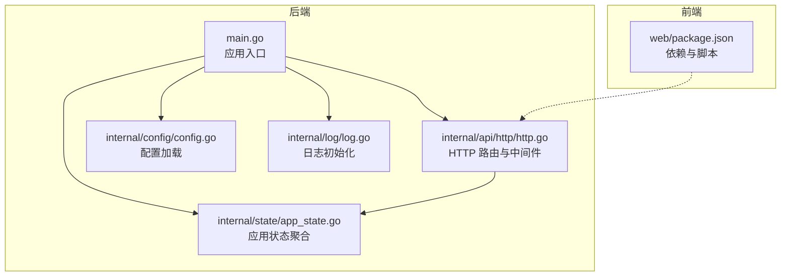
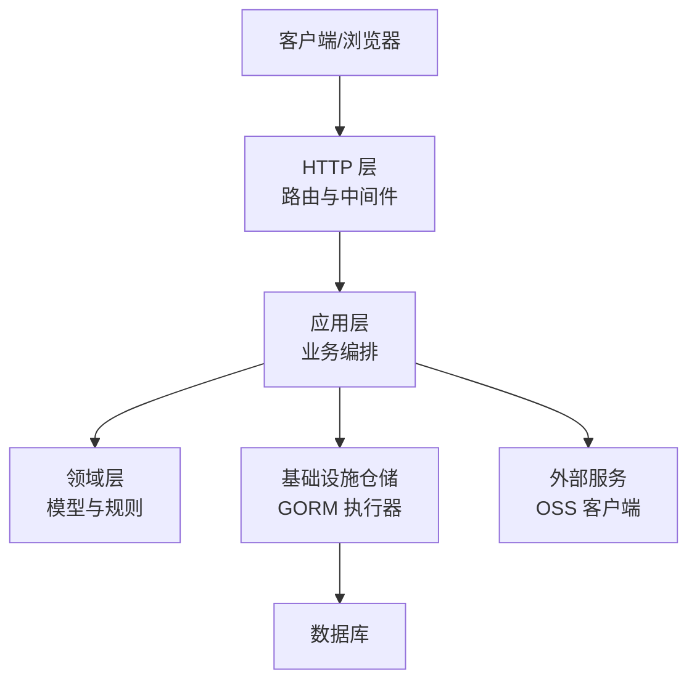
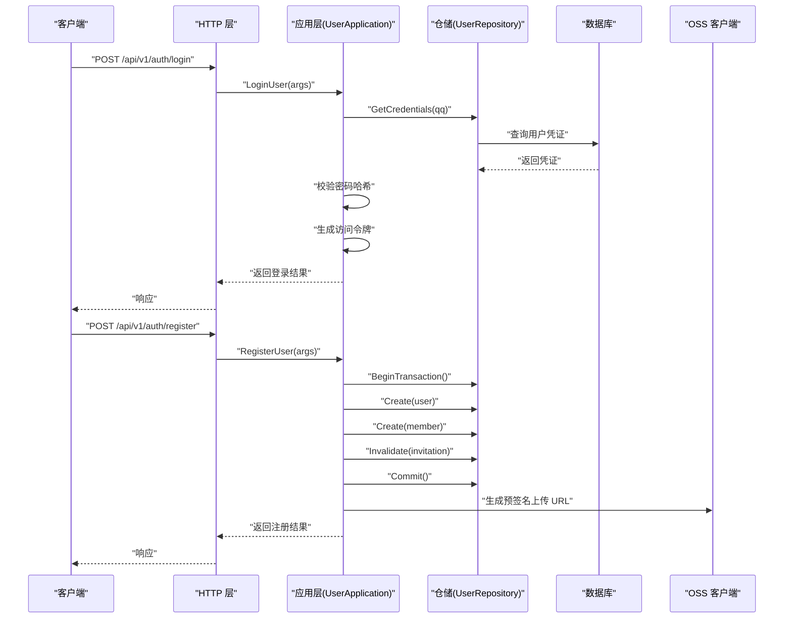
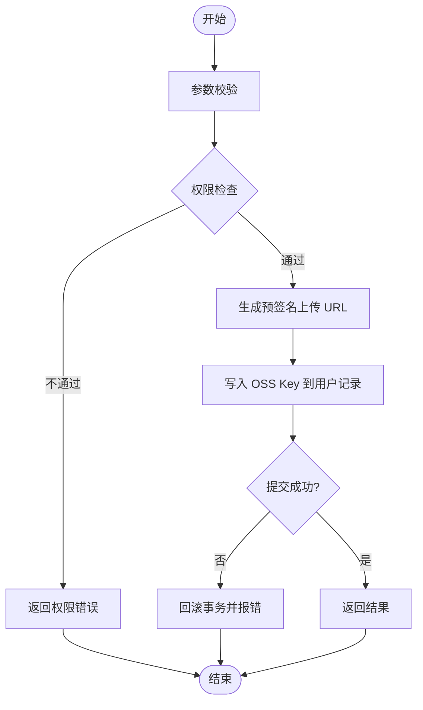
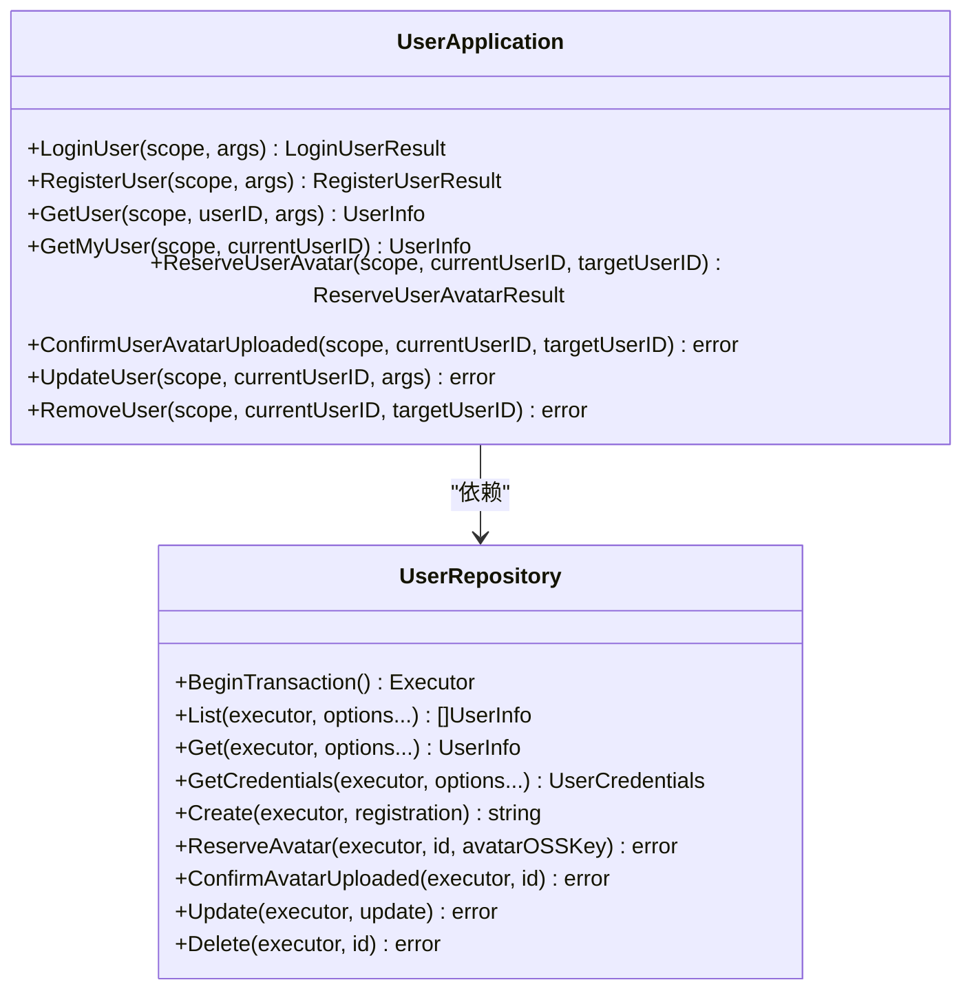
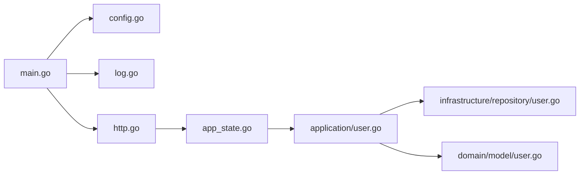

# 测试策略

<cite>
**本文引用的文件**   
- [main.go](file://backend/backend-v1/main.go)
- [http.go](file://backend/backend-v1/internal/api/http/http.go)
- [config.go](file://backend/backend-v1/internal/config/config.go)
- [log.go](file://backend/backend-v1/internal/log/log.go)
- [app_state.go](file://backend/backend-v1/internal/state/app_state.go)
- [user.go](file://backend/backend-v1/internal/application/user.go)
- [user.go](file://backend/backend-v1/internal/domain/model/user.go)
- [user.go](file://backend/backend-v1/internal/infrastructure/repository/user.go)
- [.golangci.yml](file://backend/backend-v1/.golangci.yml)
- [go.mod](file://backend/backend-v1/go.mod)
- [package.json](file://web/package.json)
</cite>

## 目录
1. [引言](#引言)
2. [项目结构](#项目结构)
3. [核心组件](#核心组件)
4. [架构总览](#架构总览)
5. [详细组件分析](#详细组件分析)
6. [依赖分析](#依赖分析)
7. [性能考虑](#性能考虑)
8. [故障排查指南](#故障排查指南)
9. [结论](#结论)
10. [附录](#附录)

## 引言
本测试策略文档面向 Poprako 项目，目标是建立覆盖单元测试、集成测试与端到端测试的完整测试体系，明确测试金字塔分层、覆盖率要求与测试分类标准；提供 Go 语言 testing 框架与断言库使用指南；制定前端组件测试、API 测试与用户交互测试策略；规范测试数据准备、Mock 对象使用与测试环境配置；并给出性能测试、压力测试与安全测试的实施建议，以及在持续集成中自动化的测试执行策略。

## 项目结构
Poprako 采用前后端分离架构：
- 后端基于 Iris 框架，采用分层架构（API 层、应用层、领域层、基础设施层），通过 AppState 注入各应用服务，统一由 main.go 启动。
- 前端基于 Vue 3 + TypeScript + Vite，使用 axios 进行 HTTP 请求，Pinia 管理状态，Vue Router 管理路由。

**图示来源**
- [main.go:25-145](file://backend/backend-v1/main.go#L25-L145)
- [http.go:16-167](file://backend/backend-v1/internal/api/http/http.go#L16-L167)
- [config.go:11-101](file://backend/backend-v1/internal/config/config.go#L11-L101)
- [log.go:13-84](file://backend/backend-v1/internal/log/log.go#L13-L84)
- [app_state.go:23-49](file://backend/backend-v1/internal/state/app_state.go#L23-L49)
- [package.json:1-36](file://web/package.json#L1-L36)

**章节来源**
- [main.go:25-145](file://backend/backend-v1/main.go#L25-L145)
- [http.go:16-167](file://backend/backend-v1/internal/api/http/http.go#L16-L167)
- [config.go:11-101](file://backend/backend-v1/internal/config/config.go#L11-L101)
- [log.go:13-84](file://backend/backend-v1/internal/log/log.go#L13-L84)
- [app_state.go:23-49](file://backend/backend-v1/internal/state/app_state.go#L23-L49)
- [package.json:1-36](file://web/package.json#L1-L36)

## 核心组件
- 应用入口与启动：main.go 负责加载环境变量与配置、初始化日志、构建仓储与应用层实例、注入 AppState 并启动 HTTP 服务器。
- HTTP 层：http.go 定义路由分组、鉴权中间件与 Swagger 文档，集中注册认证、用户、团队、成员、邀请、漫画、工作集、章节、页面、分配、单元等接口。
- 配置与日志：config.go 提供配置加载与环境判断；log.go 根据环境选择开发/生产日志策略。
- 应用层：以用户模块为例，application/user.go 实现登录、注册、头像预留与确认、更新、删除等业务逻辑，贯穿参数校验、权限检查、事务处理与外部服务调用。
- 领域模型：domain/model/user.go 定义用户信息、凭证、创建与更新等值对象。
- 基础设施仓储：infrastructure/repository/user.go 封装 GORM 执行器，实现查询、创建、更新、软删除与事务控制。

**章节来源**
- [main.go:25-145](file://backend/backend-v1/main.go#L25-L145)
- [http.go:16-167](file://backend/backend-v1/internal/api/http/http.go#L16-L167)
- [config.go:11-101](file://backend/backend-v1/internal/config/config.go#L11-L101)
- [log.go:13-84](file://backend/backend-v1/internal/log/log.go#L13-L84)
- [user.go:106-278](file://backend/backend-v1/internal/application/user.go#L106-L278)
- [user.go:21-100](file://backend/backend-v1/internal/domain/model/user.go#L21-L100)
- [user.go:89-150](file://backend/backend-v1/internal/infrastructure/repository/user.go#L89-L150)

## 架构总览
后端采用“HTTP 层 -> 应用层 -> 领域层 -> 基础设施层”的分层设计，数据流从路由进入，经应用层业务编排，访问仓储持久化，必要时调用外部服务（如 OSS）。前端通过 HTTP 层提供的 REST 接口进行交互。

**图示来源**
- [http.go:26-151](file://backend/backend-v1/internal/api/http/http.go#L26-L151)
- [user.go:106-278](file://backend/backend-v1/internal/application/user.go#L106-L278)
- [user.go:89-150](file://backend/backend-v1/internal/infrastructure/repository/user.go#L89-L150)

## 详细组件分析

### 组件 A：用户登录与注册（应用层）
该组件覆盖参数校验、权限检查、事务处理与外部服务调用，是典型的业务编排点，适合进行单元测试与集成测试。

**图示来源**
- [http.go:40-49](file://backend/backend-v1/internal/api/http/http.go#L40-L49)
- [user.go:106-154](file://backend/backend-v1/internal/application/user.go#L106-L154)
- [user.go:156-278](file://backend/backend-v1/internal/application/user.go#L156-L278)
- [user.go:73-87](file://backend/backend-v1/internal/infrastructure/repository/user.go#L73-L87)
- [user.go:89-106](file://backend/backend-v1/internal/infrastructure/repository/user.go#L89-L106)

**章节来源**
- [http.go:40-49](file://backend/backend-v1/internal/api/http/http.go#L40-L49)
- [user.go:106-278](file://backend/backend-v1/internal/application/user.go#L106-L278)
- [user.go:73-106](file://backend/backend-v1/internal/infrastructure/repository/user.go#L73-L106)

### 组件 B：用户头像预留与确认
该流程涉及 OSS 预签名 URL 生成与数据库状态变更，需重点测试鉴权、权限检查与事务一致性。

**图示来源**
- [user.go:426-468](file://backend/backend-v1/internal/application/user.go#L426-L468)
- [user.go:108-118](file://backend/backend-v1/internal/infrastructure/repository/user.go#L108-L118)

**章节来源**
- [user.go:426-468](file://backend/backend-v1/internal/application/user.go#L426-L468)
- [user.go:108-118](file://backend/backend-v1/internal/infrastructure/repository/user.go#L108-L118)

### 组件 C：应用层类关系（简化）

**图示来源**
- [user.go:21-104](file://backend/backend-v1/internal/application/user.go#L21-L104)
- [user.go:12-18](file://backend/backend-v1/internal/infrastructure/repository/user.go#L12-L18)

**章节来源**
- [user.go:21-104](file://backend/backend-v1/internal/application/user.go#L21-L104)
- [user.go:12-18](file://backend/backend-v1/internal/infrastructure/repository/user.go#L12-L18)

### 前端测试策略
- 组件测试：使用 Vue Test Utils 与 Vitest 对 Vue 组件进行快照与行为测试，覆盖 props、事件与渲染结果。
- API 测试：通过 axios 拦截或 Mock 适配器，模拟后端接口响应，验证请求构造、错误处理与状态管理。
- 用户交互测试：结合 Playwright 或 Cypress 进行 E2E，覆盖登录、头像上传、列表与表单提交等关键路径。
- 端到端测试：在隔离环境（Docker）中运行后端与数据库，前端通过代理访问后端，确保端到端链路可用。

**章节来源**
- [package.json:1-36](file://web/package.json#L1-L36)

## 依赖分析
后端依赖 Go 生态主流库，包括 Iris Web 框架、GORM ORM、JWT、Zap 日志、Viper 配置等。这些依赖影响测试策略的选择与 Mock 方案。

**图示来源**
- [main.go:25-145](file://backend/backend-v1/main.go#L25-L145)
- [config.go:11-101](file://backend/backend-v1/internal/config/config.go#L11-L101)
- [log.go:13-84](file://backend/backend-v1/internal/log/log.go#L13-L84)
- [http.go:16-167](file://backend/backend-v1/internal/api/http/http.go#L16-L167)
- [app_state.go:23-49](file://backend/backend-v1/internal/state/app_state.go#L23-L49)
- [user.go:106-278](file://backend/backend-v1/internal/application/user.go#L106-L278)
- [user.go:89-150](file://backend/backend-v1/internal/infrastructure/repository/user.go#L89-L150)
- [user.go:21-100](file://backend/backend-v1/internal/domain/model/user.go#L21-L100)

**章节来源**
- [go.mod:5-18](file://backend/backend-v1/go.mod#L5-L18)
- [main.go:25-145](file://backend/backend-v1/main.go#L25-L145)

## 性能考虑
- 单元测试：优先使用内存数据库或轻量级嵌入式数据库，避免真实 IO；对热点函数进行基准测试（Benchmark）。
- 集成测试：使用 Docker Compose 启动最小化后端与数据库，减少依赖启动时间；对关键接口进行延迟与吞吐量监控。
- 端到端测试：在 CI 中使用缓存镜像与共享数据库实例，缩短冷启动时间；对慢接口进行超时与重试策略测试。
- 性能基线：为关键接口设定 P95/P99 延迟阈值与并发用户数，作为回归指标。

## 故障排查指南
- 配置与环境：检查 APP_ENVIRONMENT、JWT_SECRET_KEY、DATABASE_URL 是否正确设置；确认 config.go 的加载顺序与错误返回。
- 日志：开发环境输出彩色控制台日志，生产环境输出 JSON 并轮转；利用 Zap 全局日志定位问题。
- 中间件：HTTP 层启用 request-id 与 recover 中间件，便于追踪请求链路与异常恢复。
- 事务与一致性：应用层事务提交/回滚路径必须覆盖；仓储层软删除与条件更新需验证 WHERE 条件。

**章节来源**
- [config.go:29-59](file://backend/backend-v1/internal/config/config.go#L29-L59)
- [log.go:13-84](file://backend/backend-v1/internal/log/log.go#L13-L84)
- [http.go:26-35](file://backend/backend-v1/internal/api/http/http.go#L26-L35)
- [user.go:200-262](file://backend/backend-v1/internal/application/user.go#L200-L262)
- [user.go:142-149](file://backend/backend-v1/internal/infrastructure/repository/user.go#L142-L149)

## 结论
本测试策略以测试金字塔为核心，强调单元测试的高密度与快速反馈，集成测试覆盖关键路径与外部依赖，端到端测试保障用户旅程闭环。通过合理的 Mock 与测试数据准备、严格的覆盖率与质量门禁、以及在 CI 中自动化的执行策略，确保系统在演进过程中保持高质量与稳定性。

## 附录

### 测试金字塔与覆盖率要求
- 单元测试：占 70%，针对应用层与仓储层核心函数，覆盖率不低于 80%。
- 集成测试：占 20%，覆盖路由、鉴权中间件、事务与外部服务调用，覆盖率不低于 60%。
- 端到端测试：占 10%，覆盖关键用户旅程，如登录、头像上传、团队协作等。
- 覆盖率统计：使用 Go 1.25+ 的 testing 内置覆盖率与工具链，结合 CI 报告阈值。

### Go 测试框架与断言库使用指南
- testing：使用 t.Run 进行子测试，使用 Benchmark 进行性能测试；使用 t.Cleanup 清理资源。
- 断言库：推荐使用 testify 或自定义断言封装，统一错误比较与结构体断言。
- Mock：对应用层依赖（如 OSS 客户端、仓储接口）使用接口与结构体替换，避免真实 IO。
- 数据准备：使用种子数据或内存数据库，保证测试可重复性；对敏感字段（如密码）使用哈希或占位符。

### 前端测试策略要点
- 组件测试：验证 props 输入、事件触发与渲染输出；对异步逻辑使用 advanceTimers 或 fake timers。
- API 测试：拦截 axios 请求，返回固定响应或错误；验证错误提示与重试逻辑。
- 用户交互测试：使用真实浏览器引擎，覆盖移动端与桌面端；对关键流程录制快照回归。

### 测试环境配置
- 开发环境：启用 Swagger UI、彩色日志与详细错误堆栈；使用本地数据库与模拟 OSS。
- 测试环境：独立数据库实例、隔离的 OSS 存储桶；开启严格日志级别与慢查询告警。
- 生产环境：只读测试（如只读接口）、灰度发布前的最小化回归测试。

### 性能测试、压力测试与安全测试
- 性能测试：对登录、注册、头像上传等关键接口进行基准测试，记录延迟与内存分配。
- 压力测试：使用 wrk 或 k6 对路由进行并发压测，观察错误率与响应时间曲线。
- 安全测试：对鉴权中间件、SQL 注入、XSS 与 CSRF 进行专项测试；对敏感接口增加速率限制与审计日志。

### 持续集成中的测试执行策略
- 触发策略：PR 合并请求触发单元与集成测试；主分支推送触发端到端测试与安全扫描。
- 缓存与并行：缓存 Go 模块与前端依赖；并行执行不同模块测试任务。
- 报告与门禁：覆盖率低于阈值或测试失败阻塞合并；生成 HTML/Coverage 报告与测试视频。