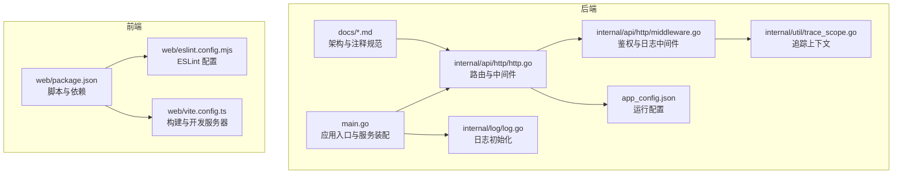
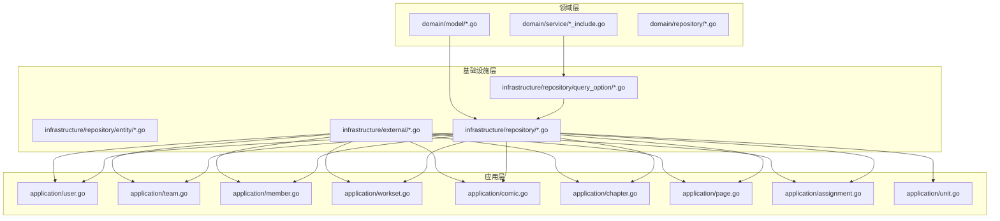
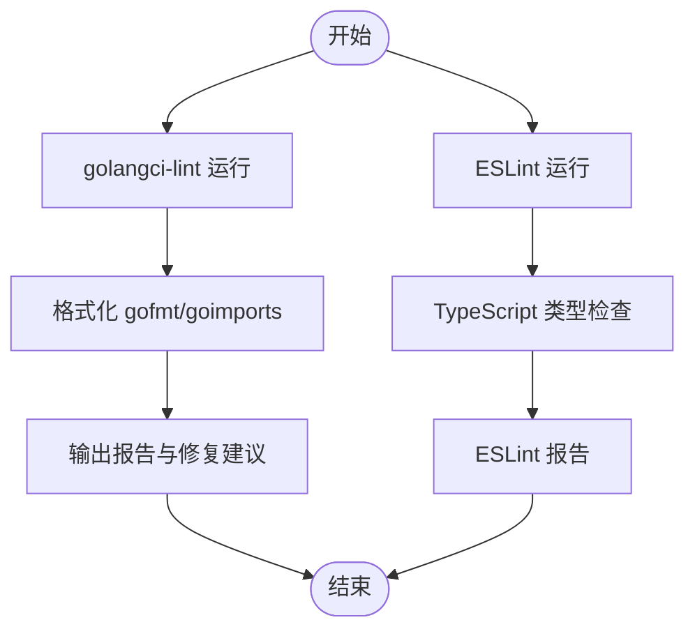
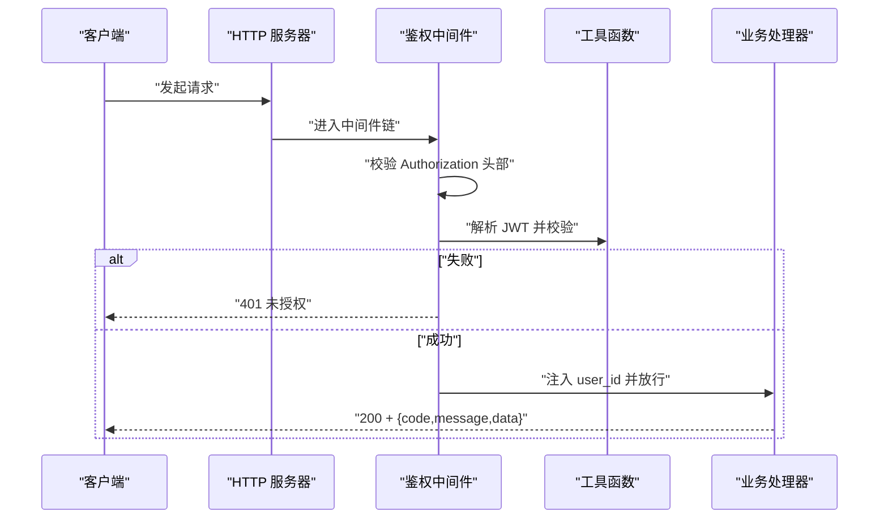
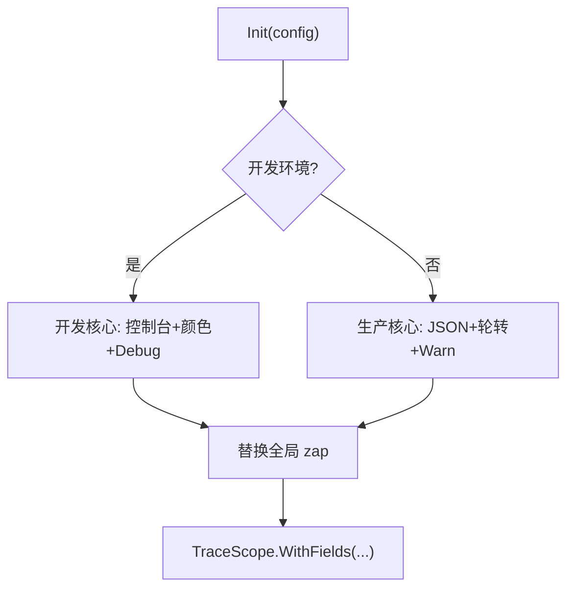
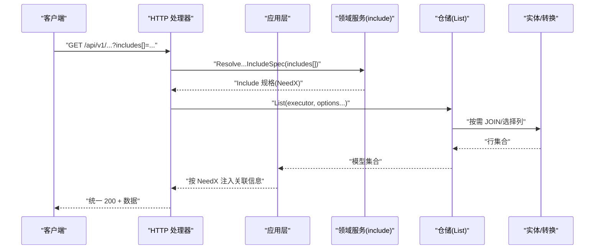
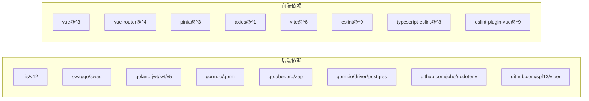

# 质量保证

<cite>
**本文引用的文件**
- [backend/.golangci.yml](file://backend/backend-v1/.golangci.yml)
- [backend/go.mod](file://backend/backend-v1/go.mod)
- [backend/main.go](file://backend/backend-v1/main.go)
- [backend/docs/ARCHETECT.md](file://backend/backend-v1/docs/ARCHETECT.md)
- [backend/docs/refactor-progress.md](file://backend/backend-v1/docs/refactor-progress.md)
- [backend/docs/workset-include-internal-logic.md](file://backend/backend-v1/docs/workset-include-internal-logic.md)
- [backend/docs/docs-comment-format.md](file://backend/backend-v1/docs/docs-comment-format.md)
- [backend/internal/api/http/http.go](file://backend/backend-v1/internal/api/http/http.go)
- [backend/internal/api/http/middleware.go](file://backend/backend-v1/internal/api/http/middleware.go)
- [backend/internal/api/http/util.go](file://backend/backend-v1/internal/api/http/util.go)
- [backend/internal/log/log.go](file://backend/backend-v1/internal/log/log.go)
- [backend/internal/util/trace_scope.go](file://backend/backend-v1/internal/util/trace_scope.go)
- [backend/app_config.json](file://backend/backend-v1/app_config.json)
- [web/eslint.config.mjs](file://web/eslint.config.mjs)
- [web/package.json](file://web/package.json)
- [web/vite.config.ts](file://web/vite.config.ts)
</cite>

## 目录
1. [引言](#引言)
2. [项目结构](#项目结构)
3. [核心组件](#核心组件)
4. [架构总览](#架构总览)
5. [详细组件分析](#详细组件分析)
6. [依赖分析](#依赖分析)
7. [性能考虑](#性能考虑)
8. [故障排查指南](#故障排查指南)
9. [结论](#结论)
10. [附录](#附录)

## 引言
本质量保证文档面向 Poprako 项目，系统化阐述代码质量标准、性能基准与安全要求，覆盖后端 Go 与前端 Vue 的静态分析配置、重构指导原则、性能监控与内存优化、并发最佳实践、安全编码规范、输入验证与数据保护、代码覆盖率与测试质量标准、发布前检查清单以及质量度量与持续改进流程。文档同时结合后端重构进度与 include 驱动的可选嵌套查询模式，提供可落地的实施建议。

## 项目结构
后端采用模块化分层架构，参考领域驱动设计（DDD）的三层划分，结合应用层统一编排与基础设施层的具体实现。前端采用 Vue 3 + TypeScript + Vite 技术栈，ESLint 与 TypeScript 类型检查共同保障代码质量。

**图表来源**
- [backend/main.go:25-145](file://backend/backend-v1/main.go#L25-L145)
- [backend/internal/api/http/http.go:16-53](file://backend/backend-v1/internal/api/http/http.go#L16-L53)
- [backend/internal/api/http/middleware.go:15-79](file://backend/backend-v1/internal/api/http/middleware.go#L15-L79)
- [backend/internal/log/log.go:13-83](file://backend/backend-v1/internal/log/log.go#L13-L83)
- [backend/app_config.json:1-10](file://backend/backend-v1/app_config.json#L1-L10)
- [backend/docs/ARCHETECT.md:1-36](file://backend/backend-v1/docs/ARCHETECT.md#L1-L36)
- [web/package.json:6-12](file://web/package.json#L6-L12)
- [web/eslint.config.mjs:1-40](file://web/eslint.config.mjs#L1-L40)
- [web/vite.config.ts:21-43](file://web/vite.config.ts#L21-L43)

**章节来源**
- [backend/main.go:25-145](file://backend/backend-v1/main.go#L25-L145)
- [backend/docs/ARCHETECT.md:1-36](file://backend/backend-v1/docs/ARCHETECT.md#L1-L36)
- [web/package.json:6-12](file://web/package.json#L6-L12)

## 核心组件
- 静态代码分析与格式化
  - 后端：golangci-lint 已启用 vet、staticcheck、errcheck、ineffassign、unused、gosec、gocritic、misspell 等 linter，并启用 gofmt 与 goimports 格式化器。
  - 前端：ESLint 使用 @typescript-eslint 与 vue 插件，遵循 recommended 规则集，忽略 dist 与 JS 文件，关闭多字组件名与显式 any 规则。
- 安全与鉴权
  - HTTP 中间件实现 Bearer Token 鉴权，校验头部格式与 JWT 有效性；统一响应包装，错误通过 code 字段传达。
- 日志与追踪
  - zap 初始化开发/生产环境不同策略，支持请求级 TraceScope 与 request_id 关联。
- 配置与连接池
  - app_config.json 提供 server 地址、鉴权过期时间与数据库连接池参数。
- 架构与注释规范
  - 架构文档说明领域层、应用层与仓库层职责；OpenAPI 注释格式规范确保 swag 文档生成一致性。

**章节来源**
- [backend/.golangci.yml:1-31](file://backend/backend-v1/.golangci.yml#L1-L31)
- [web/eslint.config.mjs:7-39](file://web/eslint.config.mjs#L7-L39)
- [backend/internal/api/http/middleware.go:47-79](file://backend/backend-v1/internal/api/http/middleware.go#L47-L79)
- [backend/internal/api/http/util.go:11-58](file://backend/backend-v1/internal/api/http/util.go#L11-L58)
- [backend/internal/log/log.go:13-83](file://backend/backend-v1/internal/log/log.go#L13-L83)
- [backend/internal/util/trace_scope.go:1-30](file://backend/backend-v1/internal/util/trace_scope.go#L1-L30)
- [backend/app_config.json:1-10](file://backend/backend-v1/app_config.json#L1-L10)
- [backend/docs/docs-comment-format.md:1-29](file://backend/backend-v1/docs/docs-comment-format.md#L1-L29)

## 架构总览
后端采用“领域模型 + 领域服务 + 领域仓库”的分层，应用层统一编排事务与查询选项，基础设施层实现具体仓储与外部集成。include 驱动的可选嵌套查询通过“解析 include -> 构建 query option -> 统一 List -> 注入返回值”的流水线实现，避免硬编码 JOIN 与分裂返回类型。

**图表来源**
- [backend/docs/refactor-progress.md:111-127](file://backend/backend-v1/docs/refactor-progress.md#L111-L127)
- [backend/docs/refactor-progress.md:153-171](file://backend/backend-v1/docs/refactor-progress.md#L153-L171)
- [backend/docs/refactor-progress.md:175-192](file://backend/backend-v1/docs/refactor-progress.md#L175-L192)
- [backend/docs/refactor-progress.md:196-212](file://backend/backend-v1/docs/refactor-progress.md#L196-L212)
- [backend/docs/workset-include-internal-logic.md:24-86](file://backend/backend-v1/docs/workset-include-internal-logic.md#L24-L86)

**章节来源**
- [backend/docs/ARCHETECT.md:1-36](file://backend/backend-v1/docs/ARCHETECT.md#L1-L36)
- [backend/docs/refactor-progress.md:131-150](file://backend/backend-v1/docs/refactor-progress.md#L131-L150)
- [backend/docs/refactor-progress.md:216-224](file://backend/backend-v1/docs/refactor-progress.md#L216-L224)
- [backend/docs/workset-include-internal-logic.md:1-87](file://backend/backend-v1/docs/workset-include-internal-logic.md#L1-L87)

## 详细组件分析

### 静态代码分析与格式化
- 后端 golangci-lint
  - 已启用：govet、staticcheck、errcheck、ineffassign、unused、gosec、gocritic、misspell。
  - 已启用格式化：gofmt、goimports。
  - 建议：根据团队规范逐步开放更多 linter，如 revive 或 gosimple；限制相同问题数以避免堆积。
- 前端 ESLint
  - 使用 @typescript-eslint 与 vue 插件，继承 recommended 规则集。
  - 忽略 dist、node_modules、*.d.ts、*.js；关闭多字组件名与显式 any。
  - 建议：在 CI 中将 max-warnings 设为 0，确保规则严格执行；可引入自定义规则补充业务约束。

**图表来源**
- [backend/.golangci.yml:3-31](file://backend/backend-v1/.golangci.yml#L3-L31)
- [web/eslint.config.mjs:7-39](file://web/eslint.config.mjs#L7-L39)
- [web/package.json:8-10](file://web/package.json#L8-L10)

**章节来源**
- [backend/.golangci.yml:1-31](file://backend/backend-v1/.golangci.yml#L1-L31)
- [web/eslint.config.mjs:1-40](file://web/eslint.config.mjs#L1-L40)
- [web/package.json:6-12](file://web/package.json#L6-L12)

### 安全与鉴权
- 鉴权中间件
  - 校验 Authorization 头部格式（Bearer <token>），解析 JWT 并提取用户 ID，注入上下文。
  - 未授权时统一拒绝响应，避免泄露内部错误。
- 统一响应包装
  - accept/reject 封装统一 JSON 响应结构，业务状态通过 code 字段传达，HTTP 状态码统一为 200 以兼容中间件链。

**图表来源**
- [backend/internal/api/http/middleware.go:47-79](file://backend/backend-v1/internal/api/http/middleware.go#L47-L79)
- [backend/internal/api/http/util.go:11-58](file://backend/backend-v1/internal/api/http/util.go#L11-L58)

**章节来源**
- [backend/internal/api/http/middleware.go:15-79](file://backend/backend-v1/internal/api/http/middleware.go#L15-L79)
- [backend/internal/api/http/util.go:24-39](file://backend/backend-v1/internal/api/http/util.go#L24-L39)

### 日志与追踪
- 日志初始化
  - 开发环境：控制台彩色输出，时间格式 ISO8601，Debug 级别。
  - 生产环境：JSON 输出，日志轮转（大小、备份数、保留天数），Warn 级别以上落盘。
- 追踪上下文
  - TraceScope 通过 WithFields 注入 request_id 等字段，便于跨模块串联日志。

**图表来源**
- [backend/internal/log/log.go:13-83](file://backend/backend-v1/internal/log/log.go#L13-L83)
- [backend/internal/util/trace_scope.go:12-30](file://backend/backend-v1/internal/util/trace_scope.go#L12-L30)

**章节来源**
- [backend/internal/log/log.go:13-83](file://backend/backend-v1/internal/log/log.go#L13-L83)
- [backend/internal/util/trace_scope.go:1-30](file://backend/backend-v1/internal/util/trace_scope.go#L1-L30)

### include 驱动的可选嵌套查询（重构参考）
- 解析职责下沉到领域服务纯函数，仅解释 include 请求，不触发 IO。
- 应用层根据解析结果构建 query option，统一调用仓储 List，避免分支与重复 JOIN。
- 基础设施层提供 IncludeXxxInfo() 与实体转换函数，按需注入返回值，保持返回类型统一。

**图表来源**
- [backend/docs/workset-include-internal-logic.md:24-86](file://backend/backend-v1/docs/workset-include-internal-logic.md#L24-L86)
- [backend/docs/refactor-progress.md:131-150](file://backend/backend-v1/docs/refactor-progress.md#L131-L150)
- [backend/docs/refactor-progress.md:216-224](file://backend/backend-v1/docs/refactor-progress.md#L216-L224)

**章节来源**
- [backend/docs/workset-include-internal-logic.md:1-87](file://backend/backend-v1/docs/workset-include-internal-logic.md#L1-L87)
- [backend/docs/refactor-progress.md:94-128](file://backend/backend-v1/docs/refactor-progress.md#L94-L128)

### 重构指导原则（基于 refactor-progress.md）
- 统一信息模型：以 MemberInfo、TeamInfo、UserInfo 等统一值对象替代分裂返回类型，减少歧义。
- include 规格解析：在领域服务层新增 ResolveXxxListIncludeSpec 纯函数，输出 NeedX 标志，驱动应用层按需构建查询。
- 仓储统一 List：移除硬编码 JOIN 的多个方法，统一 List(executor, options...)，通过 query option 组合。
- 实体与转换：新增 XxxWithInfoRow 与 ToXxxWithInfo，按零值判断是否注入关联信息。
- 应用层编排：解析 includes -> 构建基础 options -> 条件追加 IncludeXxx -> 统一 List -> 注入返回值。
- 编译验证：每步重构后执行 go build ./...，确保类型与依赖无误。

**章节来源**
- [backend/docs/refactor-progress.md:131-150](file://backend/backend-v1/docs/refactor-progress.md#L131-L150)
- [backend/docs/refactor-progress.md:216-224](file://backend/backend-v1/docs/refactor-progress.md#L216-L224)

## 依赖分析
- 后端依赖
  - Web 框架：iris/v12；Swagger：swaggo/swag、iris-contrib/swagger；JWT：golang-jwt/jwt/v5；加密：golang.org/x/crypto；ORM：gorm.io/gorm、gorm.io/driver/postgres；日志：go.uber.org/zap；dotenv：github.com/joho/godotenv；Viper：github.com/spf13/viper。
- 前端依赖
  - Vue 3、Vue Router、Pinia、Ant Design Icons/Vue、Axios；构建：Vite；类型检查：vue-tsc；样式：Sass；ESLint 与 TypeScript 插件。

**图表来源**
- [backend/go.mod:5-18](file://backend/backend-v1/go.mod#L5-L18)
- [backend/go.mod:20-112](file://backend/backend-v1/go.mod#L20-L112)
- [web/package.json:13-34](file://web/package.json#L13-L34)

**章节来源**
- [backend/go.mod:1-113](file://backend/backend-v1/go.mod#L1-L113)
- [web/package.json:1-36](file://web/package.json#L1-L36)

## 性能考虑
- 连接池与超时
  - app_config.json 提供最小空闲连接与最大打开连接数，建议结合压测结果调整。
- include 驱动的按需加载
  - 通过解析 includes[] 动态构建查询，避免不必要的 JOIN 与字段传输，降低网络与 CPU 开销。
- 日志级别与输出
  - 生产环境提升日志级别并启用轮转，减少磁盘 IO；开发环境开启彩色与详细编码器便于定位。
- 并发最佳实践
  - 使用源码级并发安全的包（如 go.uber.org/atomic、golang.org/x/sync）；避免共享可变状态；使用带超时的 context；合理设置 goroutine 数与缓冲通道长度。
- 内存优化
  - 避免大对象复制；优先使用切片扩容策略；及时释放资源；利用 defer 管理资源；关注 GC 压力，避免短生命周期高频分配。
- 监控指标建议
  - QPS、P95/P99 延迟、错误率、连接池利用率、GC 次数与暂停时间、CPU/内存使用、请求数分布、慢查询占比。

[本节为通用性能指导，不直接分析具体文件，故不附加章节来源]

## 故障排查指南
- 鉴权失败
  - 检查 Authorization 头部格式与 Bearer token 是否有效；确认 JWT 秘钥与过期时间配置；查看中间件日志。
- 统一响应异常
  - 确认 accept/reject 的调用路径与返回结构；核对业务 code 与 message 的约定。
- 日志缺失
  - 检查环境配置与日志级别；确认生产环境轮转文件路径与权限；核对 TraceScope 字段注入。
- include 查询异常
  - 核对 includes[] 语法与允许路径；确认领域服务解析函数与应用层编排逻辑；检查仓储 List 与实体转换。

**章节来源**
- [backend/internal/api/http/middleware.go:47-79](file://backend/backend-v1/internal/api/http/middleware.go#L47-L79)
- [backend/internal/api/http/util.go:11-58](file://backend/backend-v1/internal/api/http/util.go#L11-L58)
- [backend/internal/log/log.go:13-83](file://backend/backend-v1/internal/log/log.go#L13-L83)
- [backend/docs/workset-include-internal-logic.md:24-86](file://backend/backend-v1/docs/workset-include-internal-logic.md#L24-L86)

## 结论
本质量保证文档建立了覆盖静态分析、安全鉴权、日志追踪、include 重构模式与性能优化的完整体系。建议在 CI 中强制执行 golangci-lint 与 ESLint，结合类型检查与构建流程，确保每次提交均满足质量门槛；在发布前进行端到端回归与性能回归测试，持续完善质量度量与改进闭环。

## 附录

### 代码质量标准
- 后端
  - 通过 golangci-lint 全量检查；禁止忽略 err；统一 gofmt/goimports；OpenAPI 注释遵循 docs-comment-format.md。
- 前端
  - ESLint max-warnings=0；TypeScript 类型检查通过；Vite 构建前执行 lint 与类型检查。

**章节来源**
- [backend/.golangci.yml:1-31](file://backend/backend-v1/.golangci.yml#L1-L31)
- [backend/docs/docs-comment-format.md:1-29](file://backend/backend-v1/docs/docs-comment-format.md#L1-L29)
- [web/eslint.config.mjs:7-39](file://web/eslint.config.mjs#L7-L39)
- [web/package.json:8-10](file://web/package.json#L8-L10)

### 安全要求
- 鉴权
  - Bearer Token 格式校验；JWT 解析与用户 ID 提取；未授权统一拒绝。
- 输入验证
  - 查询参数 includes[] 与分页参数需在应用层解析并校验；仓储层避免 SQL 注入（使用 ORM/参数化查询）。
- 数据保护
  - 生产环境日志 JSON 输出与轮转；敏感配置通过 dotenv/Viper 管理；最小权限原则访问数据库与外部服务。

**章节来源**
- [backend/internal/api/http/middleware.go:47-79](file://backend/backend-v1/internal/api/http/middleware.go#L47-L79)
- [backend/internal/log/log.go:52-83](file://backend/backend-v1/internal/log/log.go#L52-L83)
- [backend/go.mod:5-18](file://backend/backend-v1/go.mod#L5-L18)

### 测试质量标准与覆盖率
- 单元测试
  - 领域服务纯函数（如 ResolveXxxListIncludeSpec）具备高可测试性，建议覆盖边界与错误路径。
- 集成测试
  - 仓储 List 与实体转换；应用层编排；HTTP handler 行为。
- 覆盖率
  - 建议后端整体行覆盖率不低于 80%，关键路径不低于 90%；前端组件与工具函数覆盖率不低于 85%。

[本节为通用测试指导，不直接分析具体文件，故不附加章节来源]

### 发布前检查清单
- 代码
  - golangci-lint 通过；ESLint 通过；TypeScript 类型检查通过；构建产物可正常生成。
- 安全
  - 鉴权中间件可用；日志级别与输出符合环境；敏感配置未提交。
- 性能
  - 连接池参数合理；include 查询按需加载；无明显慢查询。
- 文档
  - OpenAPI 注释完整；架构与注释规范遵循。

**章节来源**
- [backend/.golangci.yml:3-31](file://backend/backend-v1/.golangci.yml#L3-L31)
- [web/eslint.config.mjs:7-39](file://web/eslint.config.mjs#L7-L39)
- [web/package.json:8-10](file://web/package.json#L8-L10)
- [backend/docs/docs-comment-format.md:1-29](file://backend/backend-v1/docs/docs-comment-format.md#L1-L29)

### 质量度量与持续改进
- 度量指标
  - Lint 失败次数、ESLint 警告数、构建失败率、测试通过率、覆盖率、P95 延迟、错误率、GC 指标。
- 改进流程
  - 每次提交触发 CI；对新规则与阈值变更进行评审；定期回顾质量趋势并调整策略。

[本节为通用流程指导，不直接分析具体文件，故不附加章节来源]