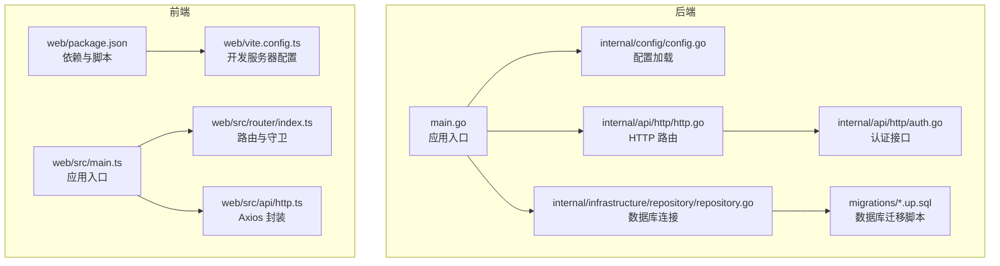
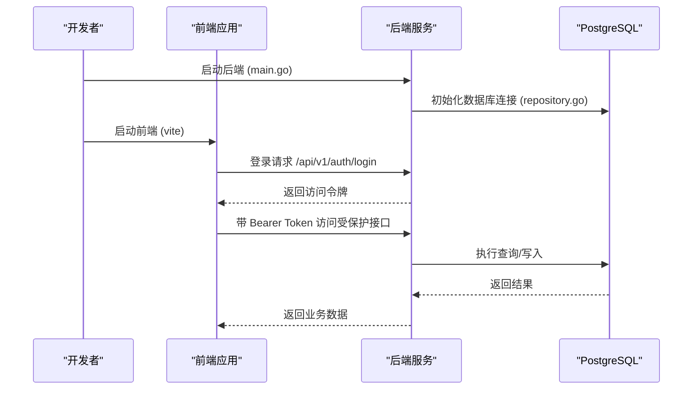
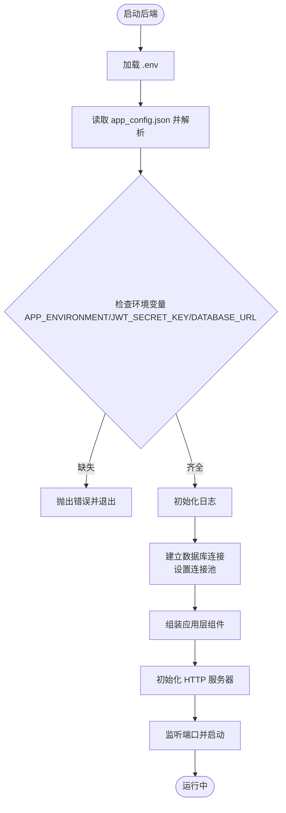
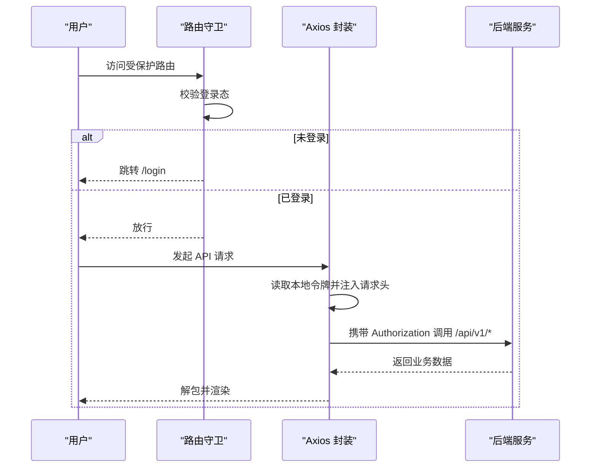
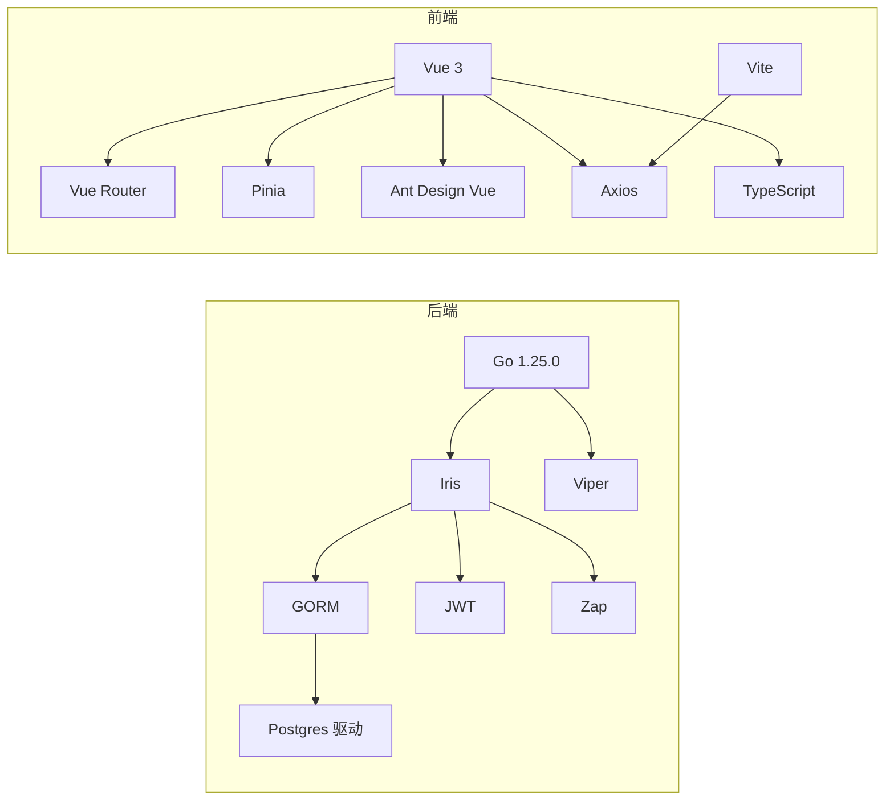

# 快速开始

<cite>
**本文引用的文件**
- [backend\backend-v1\app_config.json](file://backend/backend-v1/app_config.json)
- [backend\backend-v1\go.mod](file://backend/backend-v1/go.mod)
- [backend\backend-v1\main.go](file://backend/backend-v1/main.go)
- [backend\backend-v1\internal\config\config.go](file://backend/backend-v1/internal/config/config.go)
- [backend\backend-v1\internal\api\http\http.go](file://backend/backend-v1/internal/api/http/http.go)
- [backend\backend-v1\internal\api\http\auth.go](file://backend/backend-v1/internal/api/http/auth.go)
- [backend\backend-v1\internal\infrastructure\repository\repository.go](file://backend/backend-v1/internal/infrastructure/repository/repository.go)
- [backend\backend-v1\migrations\20260306101212_comic-table.up.sql](file://backend/backend-v1/migrations/20260306101212_comic-table.up.sql)
- [backend\backend-v1\script\seed\README.md](file://backend/backend-v1/script/seed/README.md)
- [backend\backend-v1\justfile](file://backend/backend-v1/justfile)
- [web\package.json](file://web/package.json)
- [web\vite.config.ts](file://web/vite.config.ts)
- [web\src\main.ts](file://web/src/main.ts)
- [web\src\router\index.ts](file://web/src/router/index.ts)
- [web\src\api\http.ts](file://web/src/api/http.ts)
</cite>

## 目录
1. [简介](#简介)
2. [项目结构](#项目结构)
3. [核心组件](#核心组件)
4. [架构总览](#架构总览)
5. [详细组件分析](#详细组件分析)
6. [依赖关系分析](#依赖关系分析)
7. [性能注意事项](#性能注意事项)
8. [故障排查指南](#故障排查指南)
9. [结论](#结论)
10. [附录](#附录)

## 简介
本指南面向新开发者，帮助你在约 30 分钟内完成 Poprako 项目的环境搭建、数据库初始化、配置准备与本地联调启动。你将学会：
- 准备 Go 1.25.0 与 Node.js（推荐使用 pnpm）环境
- 安装后端 Go 模块与前端 npm 包
- 配置 PostgreSQL 数据库并初始化表结构
- 设置应用配置文件与环境变量
- 启动本地开发服务器并完成前后端联调
- 基本使用示例与常见问题解决

## 项目结构
项目采用前后端分离架构：
- 后端（Go 1.25.0）：基于 Iris 框架，提供 REST API，使用 GORM 连接 PostgreSQL，配置通过 JSON 文件与环境变量组合加载。
- 前端（Vue 3 + TypeScript + Vite）：使用 Axios 统一请求，Pinia 状态管理，Ant Design Vue 组件库，路由守卫控制登录态。

图表来源
- [backend\backend-v1\main.go:25-145](file://backend/backend-v1/main.go#L25-L145)
- [backend\backend-v1\internal\config\config.go:11-59](file://backend/backend-v1/internal/config/config.go#L11-L59)
- [backend\backend-v1\internal\api\http\http.go:16-151](file://backend/backend-v1/internal/api/http/http.go#L16-L151)
- [backend\backend-v1\internal\api\http\auth.go:10-73](file://backend/backend-v1/internal/api/http/auth.go#L10-L73)
- [backend\backend-v1\internal\infrastructure\repository\repository.go:11-29](file://backend/backend-v1/internal/infrastructure/repository/repository.go#L11-L29)
- [backend\backend-v1\migrations\20260306101212_comic-table.up.sql:1-37](file://backend/backend-v1/migrations/20260306101212_comic-table.up.sql#L1-L37)
- [web\package.json:1-36](file://web/package.json#L1-L36)
- [web\vite.config.ts:21-43](file://web/vite.config.ts#L21-L43)
- [web\src\main.ts:16-26](file://web/src/main.ts#L16-L26)
- [web\src\router\index.ts:39-59](file://web/src/router/index.ts#L39-L59)
- [web\src\api\http.ts:20-27](file://web/src/api/http.ts#L20-L27)

章节来源
- [backend\backend-v1\main.go:25-145](file://backend/backend-v1/main.go#L25-L145)
- [web\package.json:1-36](file://web/package.json#L1-L36)

## 核心组件
- 后端配置与启动
  - 配置文件：app_config.json 提供服务地址、认证过期小时数、数据库连接池参数；结合环境变量加载。
  - 入口程序：main.go 加载 .env、读取配置、初始化日志、建立数据库连接、组装应用层与 HTTP 服务器。
- 前端配置与启动
  - 依赖与脚本：package.json 定义开发、构建、预览脚本。
  - 开发服务器：vite.config.ts 支持通过环境变量 FRONTEND_PORT/FRONTEND_HOST 控制开发端口与主机。
  - 应用入口：src/main.ts 注入路由、状态管理与 UI 组件库。
  - 路由守卫：src/router/index.ts 控制登录态跳转。
  - 请求封装：src/api/http.ts 统一处理鉴权头、错误与响应解包。

章节来源
- [backend\backend-v1\app_config.json:1-11](file://backend/backend-v1/app_config.json#L1-L11)
- [backend\backend-v1\internal\config\config.go:21-59](file://backend/backend-v1/internal/config/config.go#L21-L59)
- [backend\backend-v1\main.go:25-145](file://backend/backend-v1/main.go#L25-L145)
- [web\package.json:6-12](file://web/package.json#L6-L12)
- [web\vite.config.ts:21-43](file://web/vite.config.ts#L21-L43)
- [web\src\main.ts:16-26](file://web/src/main.ts#L16-L26)
- [web\src\router\index.ts:39-59](file://web/src/router/index.ts#L39-L59)
- [web\src\api\http.ts:20-27](file://web/src/api/http.ts#L20-L27)

## 架构总览
后端通过 Iris 暴露 /api/v1 接口，前端通过 Axios 请求这些接口。认证接口位于 /auth，其余接口需登录后访问。数据库通过 GORM 连接 PostgreSQL，迁移脚本定义了初始表结构。

图表来源
- [backend\backend-v1\main.go:25-145](file://backend/backend-v1/main.go#L25-L145)
- [backend\backend-v1\internal\api\http\http.go:16-151](file://backend/backend-v1/internal/api/http/http.go#L16-L151)
- [backend\backend-v1\internal\api\http\auth.go:10-73](file://backend/backend-v1/internal/api/http/auth.go#L10-L73)
- [backend\backend-v1\internal\infrastructure\repository\repository.go:11-29](file://backend/backend-v1/internal/infrastructure/repository/repository.go#L11-L29)
- [web\src\api\http.ts:66-77](file://web/src/api/http.ts#L66-L77)

## 详细组件分析

### 后端配置与启动流程
- 配置加载顺序
  - 读取 app_config.json 的基础字段
  - 读取环境变量 APP_ENVIRONMENT、JWT_SECRET_KEY、DATABASE_URL
  - 解析为结构体并校验必填项
- 数据库连接
  - 通过 DATABASE_URL 连接 PostgreSQL
  - 设置最大空闲连接数与最大打开连接数
- HTTP 服务器
  - 初始化 Iris 应用，注册中间件（请求 ID、日志、恢复）
  - 挂载 /api/v1 下的各模块路由
  - 非生产环境启用 Swagger UI

图表来源
- [backend\backend-v1\main.go:25-145](file://backend/backend-v1/main.go#L25-L145)
- [backend\backend-v1\internal\config\config.go:29-59](file://backend/backend-v1/internal/config/config.go#L29-L59)
- [backend\backend-v1\internal\infrastructure\repository\repository.go:11-29](file://backend/backend-v1/internal/infrastructure/repository/repository.go#L11-L29)
- [backend\backend-v1\internal\api\http\http.go:16-151](file://backend/backend-v1/internal/api/http/http.go#L16-L151)

章节来源
- [backend\backend-v1\app_config.json:1-11](file://backend/backend-v1/app_config.json#L1-L11)
- [backend\backend-v1\internal\config\config.go:29-59](file://backend/backend-v1/internal/config/config.go#L29-L59)
- [backend\backend-v1\internal\infrastructure\repository\repository.go:11-29](file://backend/backend-v1/internal/infrastructure/repository/repository.go#L11-L29)
- [backend\backend-v1\internal\api\http\http.go:16-151](file://backend/backend-v1/internal/api/http/http.go#L16-L151)

### 前端开发与联调要点
- 开发服务器
  - 通过 FRONTEND_PORT/FRONTEND_HOST 控制前端端口与主机
  - 默认端口 5173，可通过环境变量覆盖
- 路由与登录态
  - 未登录访问受保护路由将重定向到登录页
  - 已登录访问登录页将重定向到仪表盘
- 请求封装
  - 自动从本地存储读取访问令牌并添加到请求头
  - 统一处理 401 未授权并跳转登录

图表来源
- [web\src\router\index.ts:47-56](file://web/src/router/index.ts#L47-L56)
- [web\src\api\http.ts:66-77](file://web/src/api/http.ts#L66-L77)
- [web\src\api\http.ts:82-97](file://web/src/api/http.ts#L82-L97)

章节来源
- [web\vite.config.ts:21-43](file://web/vite.config.ts#L21-L43)
- [web\src\router\index.ts:39-59](file://web/src/router/index.ts#L39-L59)
- [web\src\api\http.ts:20-27](file://web/src/api/http.ts#L20-L27)
- [web\src\api\http.ts:66-77](file://web/src/api/http.ts#L66-L77)
- [web\src\api\http.ts:82-97](file://web/src/api/http.ts#L82-L97)

## 依赖关系分析
- 后端依赖
  - Go 版本要求：1.25.0
  - 主要库：Iris（Web）、GORM（ORM）、Postgres 驱动、JWT（认证）、Viper（配置）、Zap（日志）
- 前端依赖
  - Vue 3、Vue Router、Pinia、Ant Design Vue、Axios、Vite、TypeScript

图表来源
- [backend\backend-v1\go.mod:3-18](file://backend/backend-v1/go.mod#L3-L18)
- [web\package.json:13-34](file://web/package.json#L13-L34)

章节来源
- [backend\backend-v1\go.mod:3-18](file://backend/backend-v1/go.mod#L3-L18)
- [web\package.json:13-34](file://web/package.json#L13-L34)

## 性能注意事项
- 数据库连接池
  - 最大空闲连接与最大打开连接数在配置文件中设定，建议根据并发量调整
- 日志与中间件
  - 开发环境默认开启日志与恢复中间件，生产环境可根据需要裁剪
- 前端构建
  - 生产构建会进行类型检查与 ESLint 校验，确保质量但会增加构建时间

[本节为通用指导，不直接分析具体文件]

## 故障排查指南
- 后端启动报错“读取配置失败/解析配置失败”
  - 检查 app_config.json 是否存在且格式正确
  - 确认环境变量 APP_ENVIRONMENT、JWT_SECRET_KEY、DATABASE_URL 是否设置
- 后端启动报错“创建数据库执行器失败”
  - 检查 DATABASE_URL 是否指向可用的 PostgreSQL 实例
  - 确认数据库驱动与连接字符串格式正确
- 前端无法访问后端接口
  - 确认后端监听地址与端口（默认 127.0.0.1:8080）与前端代理或 baseURL 一致
  - 如使用 Swagger UI，请确认非生产环境已启用
- 登录后仍被重定向到登录页
  - 检查本地存储是否存在访问令牌
  - 确认后端返回的令牌有效且未过期

章节来源
- [backend\backend-v1\internal\config\config.go:36-59](file://backend/backend-v1/internal/config/config.go#L36-L59)
- [backend\backend-v1\internal\infrastructure\repository\repository.go:11-29](file://backend/backend-v1/internal/infrastructure/repository/repository.go#L11-L29)
- [backend\backend-v1\internal\api\http\http.go:153-166](file://backend/backend-v1/internal/api/http/http.go#L153-L166)
- [web\src\api\http.ts:66-77](file://web/src/api/http.ts#L66-L77)

## 结论
按照本指南，你可以在 30 分钟内完成环境准备、数据库初始化、配置设置与本地联调启动。建议后续逐步完善数据库种子数据与接口测试，以提升开发效率与系统稳定性。

[本节为总结性内容，不直接分析具体文件]

## 附录

### 环境与工具准备
- Go 1.25.0
  - 参考版本声明：[go.mod](file://backend/backend-v1/go.mod#L3)
- Node.js 与包管理器
  - 推荐使用 pnpm；若使用其他包管理器，请注意 scripts 中的命令与 pnpm 对齐
  - 参考脚本定义：[package.json:6-12](file://web/package.json#L6-L12)

章节来源
- [backend\backend-v1\go.mod](file://backend/backend-v1/go.mod#L3)
- [web\package.json:6-12](file://web/package.json#L6-L12)

### 依赖安装步骤
- 后端 Go 模块
  - 在 backend/backend-v1 目录下执行模块下载
  - 参考模块清单：[go.mod:5-18](file://backend/backend-v1/go.mod#L5-L18)
- 前端 npm 包
  - 在 web 目录下执行依赖安装（推荐 pnpm）
  - 参考依赖定义：[package.json:13-34](file://web/package.json#L13-L34)

章节来源
- [backend\backend-v1\go.mod:5-18](file://backend/backend-v1/go.mod#L5-L18)
- [web\package.json:13-34](file://web/package.json#L13-L34)

### 数据库 PostgreSQL 配置与初始化
- 配置
  - 设置环境变量 DATABASE_URL，指向你的 PostgreSQL 实例
  - 参考配置加载逻辑：[config.go:91-100](file://backend/backend-v1/internal/config/config.go#L91-L100)
- 初始化
  - 使用迁移脚本创建表结构
  - 示例迁移文件：[20260306101212_comic-table.up.sql:1-37](file://backend/backend-v1/migrations/20260306101212_comic-table.up.sql#L1-L37)
  - 迁移工具链参考：[justfile:27-28](file://backend/backend-v1/justfile#L27-L28)
- 种子数据（可选）
  - 使用 Bun 运行种子脚本
  - 参考种子说明：[script/seed/README.md:1-16](file://backend/backend-v1/script/seed/README.md#L1-L16)

章节来源
- [backend\backend-v1\internal\config\config.go:91-100](file://backend/backend-v1/internal/config/config.go#L91-L100)
- [backend\backend-v1\migrations\20260306101212_comic-table.up.sql:1-37](file://backend/backend-v1/migrations/20260306101212_comic-table.up.sql#L1-L37)
- [backend\backend-v1\justfile:27-28](file://backend/backend-v1/justfile#L27-L28)
- [backend\backend-v1\script\seed\README.md:1-16](file://backend/backend-v1/script/seed/README.md#L1-L16)

### 应用配置文件设置
- app_config.json 参数说明
  - server_address：后端监听地址与端口
  - auth.expiration_hours：JWT 令牌过期小时数
  - database.min_idle_connections / max_open_connections：数据库连接池参数
  - 参考配置文件：[app_config.json:1-11](file://backend/backend-v1/app_config.json#L1-L11)
- 环境变量
  - APP_ENVIRONMENT：环境标识（development/production）
  - JWT_SECRET_KEY：JWT 签名密钥
  - DATABASE_URL：PostgreSQL 连接字符串
  - 参考加载逻辑：[config.go:44-56](file://backend/backend-v1/internal/config/config.go#L44-L56)

章节来源
- [backend\backend-v1\app_config.json:1-11](file://backend/backend-v1/app_config.json#L1-L11)
- [backend\backend-v1\internal\config\config.go:44-56](file://backend/backend-v1/internal/config/config.go#L44-L56)

### 本地开发服务器启动流程
- 后端
  - 在 backend/backend-v1 目录下启动
  - 参考入口与启动逻辑：[main.go:25-145](file://backend/backend-v1/main.go#L25-L145)
  - 参考配置加载：[config.go:11-59](file://backend/backend-v1/internal/config/config.go#L11-L59)
- 前端
  - 在 web 目录下启动
  - 开发端口与主机可通过环境变量 FRONTEND_PORT/FRONTEND_HOST 控制
  - 参考脚本与配置：[package.json:6-12](file://web/package.json#L6-L12)，[vite.config.ts:21-43](file://web/vite.config.ts#L21-L43)
- 联调
  - 前端默认请求 /api/v1，可在环境变量中通过 VITE_API_BASE_URL 覆盖
  - 参考请求封装：[web/src/api/http.ts:20-27](file://web/src/api/http.ts#L20-L27)

章节来源
- [backend\backend-v1\main.go:25-145](file://backend/backend-v1/main.go#L25-L145)
- [backend\backend-v1\internal\config\config.go:11-59](file://backend/backend-v1/internal/config/config.go#L11-L59)
- [web\package.json:6-12](file://web/package.json#L6-L12)
- [web\vite.config.ts:21-43](file://web/vite.config.ts#L21-L43)
- [web\src\api\http.ts:20-27](file://web/src/api/http.ts#L20-L27)

### 基本使用示例
- 登录
  - 路径：/api/v1/auth/login
  - 方法：POST
  - 作用：凭账号与密码获取访问令牌
  - 参考实现：[auth.go:10-40](file://backend/backend-v1/internal/api/http/auth.go#L10-L40)
- 获取当前用户信息
  - 路径：/api/v1/users/mine
  - 方法：GET
  - 作用：返回当前登录用户信息
  - 参考路由：[http.go:50-60](file://backend/backend-v1/internal/api/http/http.go#L50-L60)
- 前端调用
  - Axios 封装会自动注入 Authorization 头
  - 参考封装：[web/src/api/http.ts:66-77](file://web/src/api/http.ts#L66-L77)

章节来源
- [backend\backend-v1\internal\api\http\auth.go:10-40](file://backend/backend-v1/internal/api/http/auth.go#L10-L40)
- [backend\backend-v1\internal\api\http\http.go:50-60](file://backend/backend-v1/internal/api/http/http.go#L50-L60)
- [web\src\api\http.ts:66-77](file://web/src/api/http.ts#L66-L77)