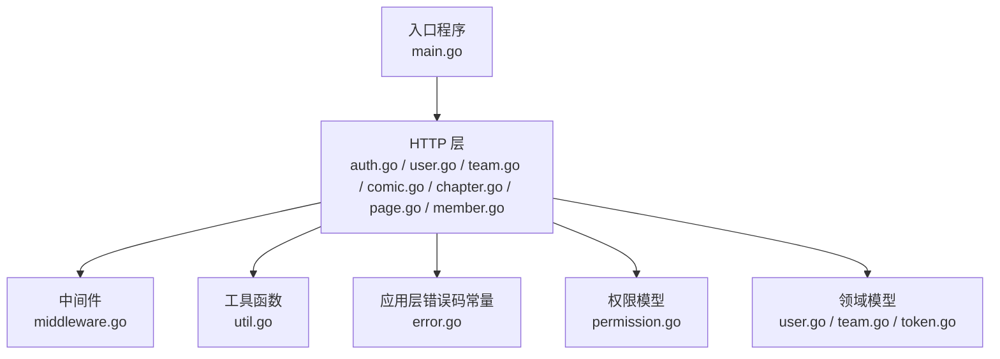
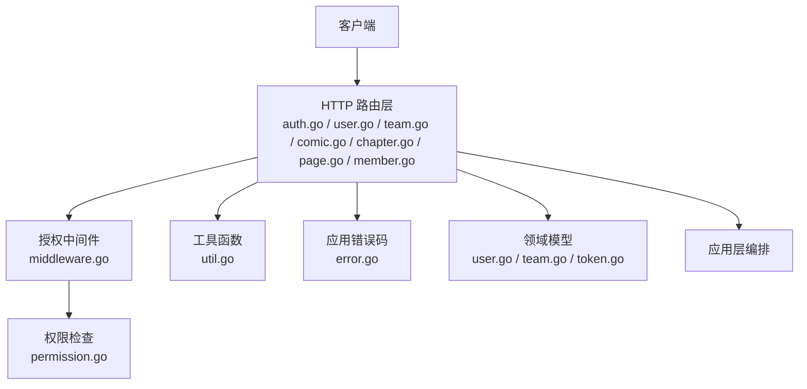
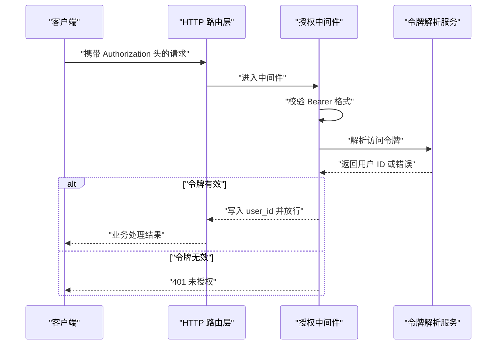
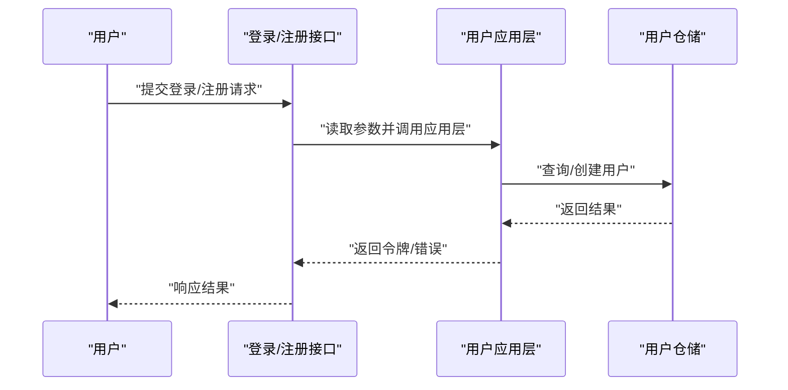
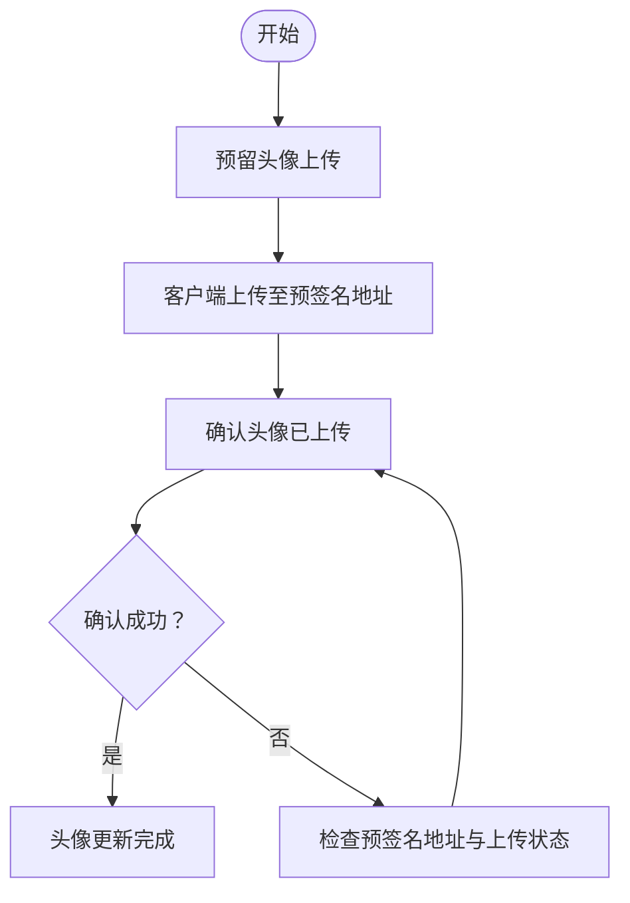
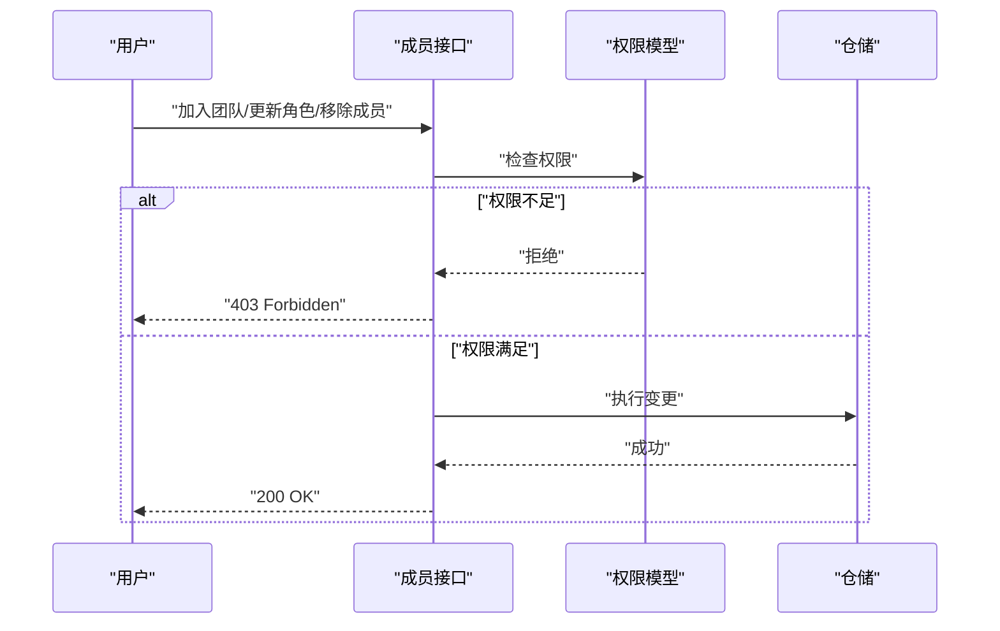
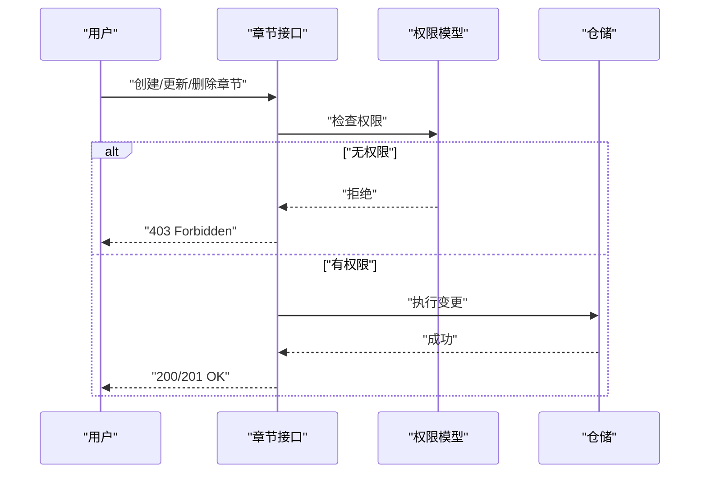
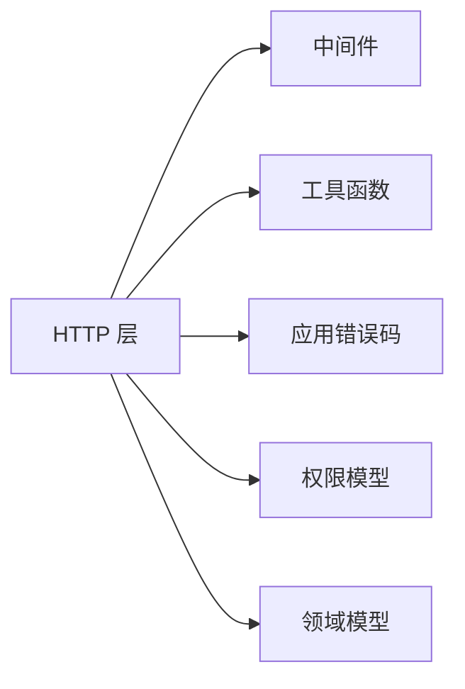

# 常见问题

<cite>
**本文引用的文件**
- [main.go](file://backend/backend-v1/main.go)
- [auth.go](file://backend/backend-v1/internal/api/http/auth.go)
- [user.go](file://backend/backend-v1/internal/api/http/user.go)
- [team.go](file://backend/backend-v1/internal/api/http/team.go)
- [comic.go](file://backend/backend-v1/internal/api/http/comic.go)
- [chapter.go](file://backend/backend-v1/internal/api/http/chapter.go)
- [page.go](file://backend/backend-v1/internal/api/http/page.go)
- [member.go](file://backend/backend-v1/internal/api/http/member.go)
- [middleware.go](file://backend/backend-v1/internal/api/http/middleware.go)
- [util.go](file://backend/backend-v1/internal/api/http/util.go)
- [error.go](file://backend/backend-v1/internal/application/error.go)
- [permission.go](file://backend/backend-v1/internal/domain/model/permission.go)
- [token.go](file://backend/backend-v1/internal/domain/model/token.go)
- [user.go](file://backend/backend-v1/internal/domain/model/user.go)
- [team.go](file://backend/backend-v1/internal/domain/model/team.go)
</cite>

## 目录
1. [简介](#简介)
2. [项目结构](#项目结构)
3. [核心组件](#核心组件)
4. [架构总览](#架构总览)
5. [详细组件分析](#详细组件分析)
6. [依赖分析](#依赖分析)
7. [性能考虑](#性能考虑)
8. [故障排查指南](#故障排查指南)
9. [结论](#结论)
10. [附录](#附录)

## 简介
本常见问题解答面向 Poprako 用户与运维人员，聚焦于使用过程中常见的登录失败、注册异常、权限不足、数据加载失败等问题，提供具体表现、原因分析与解决步骤。内容覆盖认证（JWT 过期、QQ 登录失败）、用户管理（头像上传失败、信息更新异常）、团队管理（邀请链接失效、成员权限异常）以及漫画管理（章节上传失败、页面显示异常）等场景，并给出错误代码对照与处理建议。

## 项目结构
后端采用分层架构：入口程序负责装配应用与基础设施，HTTP 层定义路由与中间件，应用层编排业务逻辑，领域模型与仓库层负责数据与权限规则。

图表来源
- [main.go:25-145](file://backend/backend-v1/main.go#L25-L145)
- [auth.go:10-72](file://backend/backend-v1/internal/api/http/auth.go#L10-L72)
- [user.go:10-291](file://backend/backend-v1/internal/api/http/user.go#L10-L291)
- [team.go:10-288](file://backend/backend-v1/internal/api/http/team.go#L10-L288)
- [comic.go:10-188](file://backend/backend-v1/internal/api/http/comic.go#L10-L188)
- [chapter.go:10-184](file://backend/backend-v1/internal/api/http/chapter.go#L10-L184)
- [page.go:10-188](file://backend/backend-v1/internal/api/http/page.go#L10-L188)
- [member.go:10-271](file://backend/backend-v1/internal/api/http/member.go#L10-L271)
- [middleware.go:47-79](file://backend/backend-v1/internal/api/http/middleware.go#L47-L79)
- [util.go:48-58](file://backend/backend-v1/internal/api/http/util.go#L48-L58)
- [error.go:3-7](file://backend/backend-v1/internal/application/error.go#L3-L7)
- [permission.go:15-845](file://backend/backend-v1/internal/domain/model/permission.go#L15-L845)
- [user.go:7-100](file://backend/backend-v1/internal/domain/model/user.go#L7-L100)
- [team.go:5-63](file://backend/backend-v1/internal/domain/model/team.go#L5-L63)
- [token.go:5-8](file://backend/backend-v1/internal/domain/model/token.go#L5-L8)

章节来源
- [main.go:25-145](file://backend/backend-v1/main.go#L25-L145)

## 核心组件
- 认证与授权
  - 授权中间件解析 Authorization 头，校验 Bearer 令牌有效性，并将用户 ID 写入上下文。
  - 令牌声明包含用户标识，用于后续权限判定。
- 用户管理
  - 提供登录、注册、获取当前用户、更新用户信息、头像预留与确认上传等接口。
- 团队管理
  - 支持创建、更新、删除团队，头像上传流程与成员管理。
- 漫画与章节
  - 支持漫画 CRUD、章节列表与创建、更新、删除。
- 页面管理
  - 批量预留页面并返回预签名上传地址，支持页面更新与删除。
- 权限模型
  - 以“权限对象 + Check”模式实现细粒度权限控制，涵盖邀请、用户、团队、成员、漫画、章节、分配、页面、单元、工作集等。

章节来源
- [middleware.go:47-79](file://backend/backend-v1/internal/api/http/middleware.go#L47-L79)
- [token.go:5-8](file://backend/backend-v1/internal/domain/model/token.go#L5-L8)
- [user.go:10-291](file://backend/backend-v1/internal/api/http/user.go#L10-L291)
- [team.go:10-288](file://backend/backend-v1/internal/api/http/team.go#L10-L288)
- [comic.go:10-188](file://backend/backend-v1/internal/api/http/comic.go#L10-L188)
- [chapter.go:10-184](file://backend/backend-v1/internal/api/http/chapter.go#L10-L184)
- [page.go:10-188](file://backend/backend-v1/internal/api/http/page.go#L10-L188)
- [permission.go:15-845](file://backend/backend-v1/internal/domain/model/permission.go#L15-L845)

## 架构总览
下图展示请求从 HTTP 层进入，经中间件与权限校验，到达应用层并最终落库或外部存储的关键路径。

图表来源
- [auth.go:10-72](file://backend/backend-v1/internal/api/http/auth.go#L10-L72)
- [user.go:10-291](file://backend/backend-v1/internal/api/http/user.go#L10-L291)
- [team.go:10-288](file://backend/backend-v1/internal/api/http/team.go#L10-L288)
- [comic.go:10-188](file://backend/backend-v1/internal/api/http/comic.go#L10-L188)
- [chapter.go:10-184](file://backend/backend-v1/internal/api/http/chapter.go#L10-L184)
- [page.go:10-188](file://backend/backend-v1/internal/api/http/page.go#L10-L188)
- [member.go:10-271](file://backend/backend-v1/internal/api/http/member.go#L10-L271)
- [middleware.go:47-79](file://backend/backend-v1/internal/api/http/middleware.go#L47-L79)
- [util.go:48-58](file://backend/backend-v1/internal/api/http/util.go#L48-L58)
- [error.go:3-7](file://backend/backend-v1/internal/application/error.go#L3-L7)
- [permission.go:15-845](file://backend/backend-v1/internal/domain/model/permission.go#L15-L845)
- [user.go:7-100](file://backend/backend-v1/internal/domain/model/user.go#L7-L100)
- [team.go:5-63](file://backend/backend-v1/internal/domain/model/team.go#L5-L63)
- [token.go:5-8](file://backend/backend-v1/internal/domain/model/token.go#L5-L8)

## 详细组件分析

### 认证与授权（JWT 令牌）
- 表现
  - 登录成功但后续接口返回未授权或提示令牌无效。
  - 偶发出现“访问令牌不包含用户信息”。
- 原因
  - Authorization 头缺失或格式不正确（非 Bearer）。
  - 令牌签名密钥不一致或被篡改。
  - 令牌过期或服务重启导致密钥变化。
- 解决步骤
  - 确认请求头格式为 Bearer <token>。
  - 重新登录获取新令牌。
  - 检查服务端 JWT 密钥配置是否一致。
  - 如涉及多实例部署，确保共享同一密钥。

图表来源
- [middleware.go:47-79](file://backend/backend-v1/internal/api/http/middleware.go#L47-L79)
- [token.go:5-8](file://backend/backend-v1/internal/domain/model/token.go#L5-L8)

章节来源
- [middleware.go:47-79](file://backend/backend-v1/internal/api/http/middleware.go#L47-L79)
- [token.go:5-8](file://backend/backend-v1/internal/domain/model/token.go#L5-L8)

### 登录与注册
- 登录失败
  - 表现：输入 QQ 与密码后返回未授权。
  - 原因：请求体格式错误、用户名不存在或密码不匹配。
  - 解决：检查请求体 JSON 结构与字段；确认账号存在且密码正确。
- 注册异常
  - 表现：返回请求体格式错误或注册失败。
  - 原因：请求体格式错误、邀请码无效或重复 QQ。
  - 解决：核对注册参数；确保邀请码有效且未被占用。

图表来源
- [auth.go:10-72](file://backend/backend-v1/internal/api/http/auth.go#L10-L72)

章节来源
- [auth.go:10-72](file://backend/backend-v1/internal/api/http/auth.go#L10-L72)

### 用户管理（头像上传、信息更新）
- 头像上传失败
  - 表现：预留头像返回成功，但确认上传时报错或头像未生效。
  - 原因：客户端未实际上传至 OSS 预签名地址，或确认流程未触发。
  - 解决：确保客户端按预签名地址完成上传后再调用确认接口。
- 信息更新异常
  - 表现：更新用户信息返回 400。
  - 原因：请求体格式错误或目标用户与当前用户不一致（非超级管理员）。
  - 解决：检查请求体 JSON；确认操作者权限或目标用户一致。

图表来源
- [user.go:96-175](file://backend/backend-v1/internal/api/http/user.go#L96-L175)

章节来源
- [user.go:96-175](file://backend/backend-v1/internal/api/http/user.go#L96-L175)

### 团队管理（邀请链接、成员权限）
- 邀请链接失效
  - 表现：使用邀请码加入团队时报错。
  - 原因：邀请码不存在、已被使用或权限不足。
  - 解决：确认邀请码有效；确保当前用户已登录；检查是否具备管理员权限。
- 成员权限异常
  - 表现：更新成员角色或移除成员返回 403。
  - 原因：当前用户非管理员或目标成员不存在。
  - 解决：确认当前用户在目标团队的管理员身份；检查成员 ID 正确性。

图表来源
- [member.go:10-271](file://backend/backend-v1/internal/api/http/member.go#L10-L271)
- [permission.go:363-395](file://backend/backend-v1/internal/domain/model/permission.go#L363-L395)

章节来源
- [member.go:10-271](file://backend/backend-v1/internal/api/http/member.go#L10-L271)
- [permission.go:363-395](file://backend/backend-v1/internal/domain/model/permission.go#L363-L395)

### 漫画管理（章节上传、页面显示）
- 章节上传失败
  - 表现：创建章节返回 400。
  - 原因：请求体格式错误或当前用户无管理员权限。
  - 解决：检查请求体 JSON；确认在所属团队具有管理员身份。
- 页面显示异常
  - 表现：列出页面为空或返回 403。
  - 原因：当前用户非团队成员或权限不足。
  - 解决：确认已在团队中；检查章节归属与权限链路。

图表来源
- [chapter.go:54-184](file://backend/backend-v1/internal/api/http/chapter.go#L54-L184)
- [permission.go:496-539](file://backend/backend-v1/internal/domain/model/permission.go#L496-L539)

章节来源
- [chapter.go:54-184](file://backend/backend-v1/internal/api/http/chapter.go#L54-L184)
- [permission.go:496-539](file://backend/backend-v1/internal/domain/model/permission.go#L496-L539)

## 依赖分析
- 控制流耦合
  - HTTP 层依赖中间件与工具函数；应用层依赖仓储与外部存储；权限模型贯穿业务层。
- 错误传播
  - HTTP 层统一使用 accept/reject 输出；应用层错误码常量用于标识内部错误。

图表来源
- [util.go:48-58](file://backend/backend-v1/internal/api/http/util.go#L48-L58)
- [error.go:3-7](file://backend/backend-v1/internal/application/error.go#L3-L7)
- [permission.go:15-845](file://backend/backend-v1/internal/domain/model/permission.go#L15-L845)
- [user.go:7-100](file://backend/backend-v1/internal/domain/model/user.go#L7-L100)
- [team.go:5-63](file://backend/backend-v1/internal/domain/model/team.go#L5-L63)

章节来源
- [util.go:48-58](file://backend/backend-v1/internal/api/http/util.go#L48-L58)
- [error.go:3-7](file://backend/backend-v1/internal/application/error.go#L3-L7)
- [permission.go:15-845](file://backend/backend-v1/internal/domain/model/permission.go#L15-L845)

## 性能考虑
- 日志与追踪
  - 开发环境下中间件会记录请求耗时与关键上下文，便于定位慢请求。
- 统一状态码
  - HTTP 层统一返回 200，业务状态通过自定义 code 字段表达，避免浏览器缓存干扰。

章节来源
- [middleware.go:15-44](file://backend/backend-v1/internal/api/http/middleware.go#L15-L44)
- [util.go:24-39](file://backend/backend-v1/internal/api/http/util.go#L24-L39)

## 故障排查指南

### 通用排查清单
- 网络与代理
  - 确认网络连通性与代理设置；检查跨域与证书问题。
- 请求头与参数
  - 确认 Authorization 头为 Bearer <token>；检查请求体 JSON 格式与必填字段。
- 权限与角色
  - 确认当前用户在目标团队的身份与角色；必要时联系管理员。
- 日志与追踪
  - 查看服务端日志中的 request_id 与耗时，定位问题环节。

章节来源
- [middleware.go:47-79](file://backend/backend-v1/internal/api/http/middleware.go#L47-L79)
- [util.go:48-58](file://backend/backend-v1/internal/api/http/util.go#L48-L58)

### 错误代码对照与处理建议
- 400 请求错误
  - 触发点：请求体格式错误、路径参数缺失、ID 不匹配。
  - 处理：核对请求体结构与路径参数；确保请求体中的 ID 与路径一致。
- 401 未授权
  - 触发点：未提供 Authorization 头、格式不正确、令牌无效或不包含用户信息。
  - 处理：重新登录获取令牌；确认 Bearer 格式；检查服务端密钥一致性。
- 403 禁止访问
  - 触发点：权限不足（非管理员或非团队成员）。
  - 处理：确认当前用户身份；联系管理员提升权限。
- 500 内部错误
  - 触发点：应用层内部错误码。
  - 处理：查看服务端日志；重试或回滚变更。

章节来源
- [util.go:11-22](file://backend/backend-v1/internal/api/http/util.go#L11-L22)
- [middleware.go:47-79](file://backend/backend-v1/internal/api/http/middleware.go#L47-L79)
- [error.go:3-7](file://backend/backend-v1/internal/application/error.go#L3-L7)

## 结论
通过明确的中间件授权、清晰的权限模型与统一的错误输出，Poprako 在认证与权限方面提供了稳健的基础。遇到问题时，优先检查请求头与参数、确认用户身份与角色、结合日志追踪定位问题，通常可快速恢复服务。

## 附录

### 权限检查要点速查
- 邀请管理：仅管理员可查看/创建/更新/删除邀请。
- 用户管理：仅超级管理员可查看/删除用户；更新需本人或超级管理员。
- 团队管理：仅超级管理员可创建/删除团队；更新需超级管理员或团队管理员。
- 成员管理：仅管理员可查看/更新/删除成员。
- 漫画管理：仅管理员可创建/更新/删除漫画。
- 章节管理：仅管理员可创建/更新/删除章节。
- 页面管理：仅具备相应分工的角色可创建/更新/删除页面。
- 单元管理：仅具备翻译或校对分工的角色可查看与保存单元。

章节来源
- [permission.go:200-845](file://backend/backend-v1/internal/domain/model/permission.go#L200-L845)