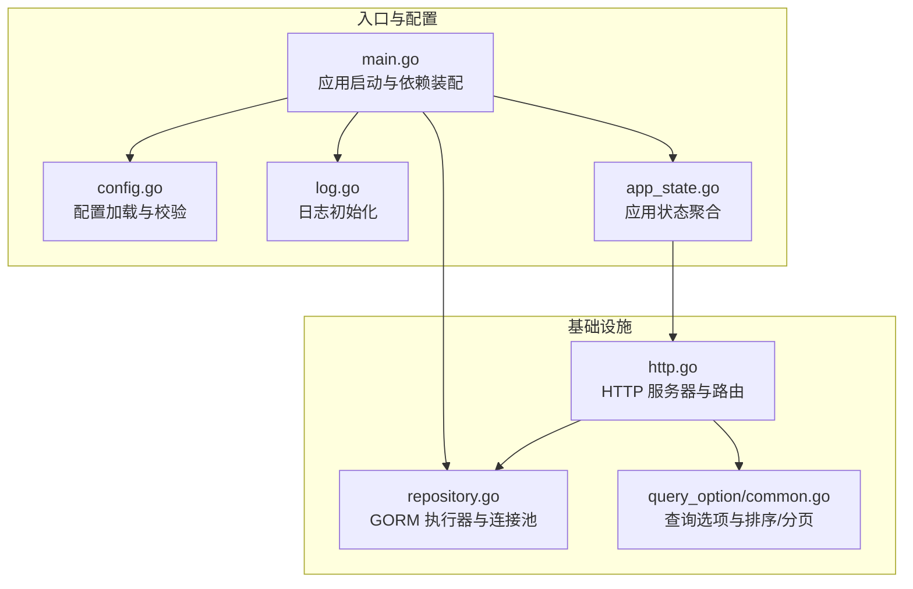
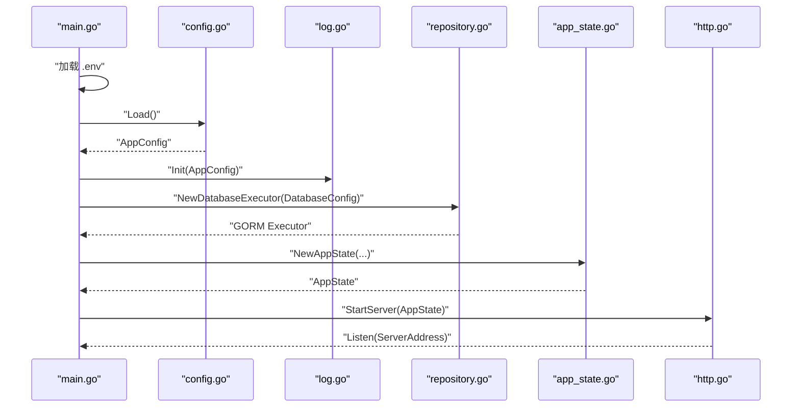
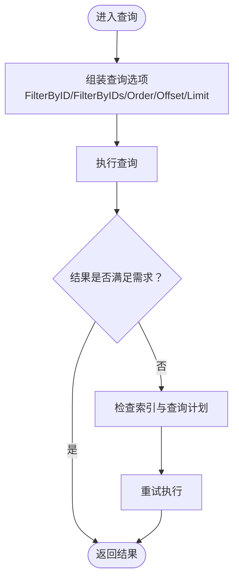
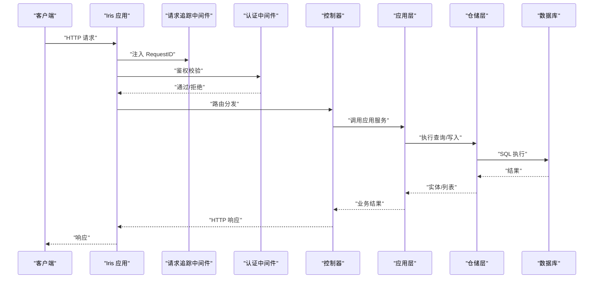
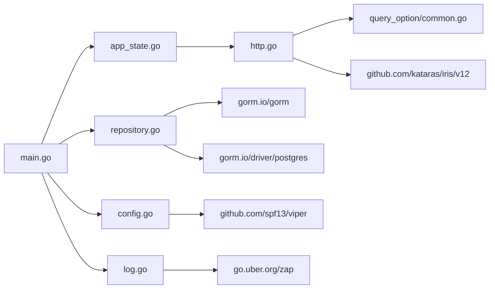

# 性能优化

<cite>
**本文引用的文件**
- [backend/main.go](file://backend/main.go)
- [backend/internal/config/config.go](file://backend/internal/config/config.go)
- [backend/internal/log/log.go](file://backend/internal/log/log.go)
- [backend/internal/state/app_state.go](file://backend/internal/state/app_state.go)
- [backend/internal/api/http/http.go](file://backend/internal/api/http/http.go)
- [backend/internal/infrastructure/repository/repository.go](file://backend/internal/infrastructure/repository/repository.go)
- [backend/internal/infrastructure/repository/query_option/common.go](file://backend/internal/infrastructure/repository/query_option/common.go)
- [backend/internal/util/trace_scope.go](file://backend/internal/util/trace_scope.go)
- [backend/go.mod](file://backend/go.mod)
</cite>

## 目录
1. [简介](#简介)
2. [项目结构](#项目结构)
3. [核心组件](#核心组件)
4. [架构总览](#架构总览)
5. [详细组件分析](#详细组件分析)
6. [依赖分析](#依赖分析)
7. [性能考虑](#性能考虑)
8. [故障排查指南](#故障排查指南)
9. [结论](#结论)
10. [附录](#附录)

## 简介
本指南面向 Poprako 后端服务，聚焦于性能优化实践与落地方法，覆盖数据库查询优化、API 响应时间优化、内存使用优化、查询选项与索引优化、查询计划分析、批量操作优化、缓存策略（Redis 与数据库查询缓存）、性能监控指标与采集、以及负载与压力测试方法。文档结合代码仓库中的实际实现进行分析，并提供可操作的优化建议。

## 项目结构
后端采用 Go 语言与 Iris 框架，基于 GORM 进行 PostgreSQL 数据访问；通过配置模块加载运行参数，日志模块按环境切换输出策略；应用状态集中管理各业务应用层实例；HTTP 层负责路由注册与中间件装配。

**图示来源**
- [backend/main.go:28-156](file://backend/main.go#L28-L156)
- [backend/internal/config/config.go:11-59](file://backend/internal/config/config.go#L11-L59)
- [backend/internal/log/log.go:13-83](file://backend/internal/log/log.go#L13-L83)
- [backend/internal/state/app_state.go:23-49](file://backend/internal/state/app_state.go#L23-L49)
- [backend/internal/api/http/http.go:16-151](file://backend/internal/api/http/http.go#L16-L151)
- [backend/internal/infrastructure/repository/repository.go:11-29](file://backend/internal/infrastructure/repository/repository.go#L11-L29)
- [backend/internal/infrastructure/repository/query_option/common.go:15-50](file://backend/internal/infrastructure/repository/query_option/common.go#L15-L50)

**章节来源**
- [backend/main.go:28-156](file://backend/main.go#L28-L156)
- [backend/internal/config/config.go:11-59](file://backend/internal/config/config.go#L11-L59)
- [backend/internal/log/log.go:13-83](file://backend/internal/log/log.go#L13-L83)
- [backend/internal/state/app_state.go:23-49](file://backend/internal/state/app_state.go#L23-L49)
- [backend/internal/api/http/http.go:16-151](file://backend/internal/api/http/http.go#L16-L151)
- [backend/internal/infrastructure/repository/repository.go:11-29](file://backend/internal/infrastructure/repository/repository.go#L11-L29)
- [backend/internal/infrastructure/repository/query_option/common.go:15-50](file://backend/internal/infrastructure/repository/query_option/common.go#L15-L50)

## 核心组件
- 应用启动与依赖装配：从环境变量加载配置，初始化日志，构建数据库执行器与迁移，实例化各业务应用层，最终启动 HTTP 服务器。
- 配置系统：支持环境切换、认证密钥、数据库连接池参数加载。
- 日志系统：开发与生产环境差异化输出，生产环境启用日志轮转。
- HTTP 层：注册路由、中间件（请求追踪、恢复、认证），Swagger 文档在非生产环境启用。
- 数据访问层：GORM 执行器与连接池配置；查询选项统一规范（过滤、排序、分页、ID 精确匹配）。

**章节来源**
- [backend/main.go:28-156](file://backend/main.go#L28-L156)
- [backend/internal/config/config.go:21-59](file://backend/internal/config/config.go#L21-L59)
- [backend/internal/log/log.go:13-83](file://backend/internal/log/log.go#L13-L83)
- [backend/internal/api/http/http.go:16-151](file://backend/internal/api/http/http.go#L16-L151)
- [backend/internal/infrastructure/repository/repository.go:11-29](file://backend/internal/infrastructure/repository/repository.go#L11-L29)
- [backend/internal/infrastructure/repository/query_option/common.go:15-50](file://backend/internal/infrastructure/repository/query_option/common.go#L15-L50)

## 架构总览
下图展示启动流程、配置与日志初始化、数据库连接池建立、应用状态聚合、HTTP 服务器启动与路由装配的关键节点。

**图示来源**
- [backend/main.go:28-156](file://backend/main.go#L28-L156)
- [backend/internal/config/config.go:11-59](file://backend/internal/config/config.go#L11-L59)
- [backend/internal/log/log.go:13-83](file://backend/internal/log/log.go#L13-L83)
- [backend/internal/infrastructure/repository/repository.go:11-29](file://backend/internal/infrastructure/repository/repository.go#L11-L29)
- [backend/internal/state/app_state.go:23-49](file://backend/internal/state/app_state.go#L23-L49)
- [backend/internal/api/http/http.go:16-24](file://backend/internal/api/http/http.go#L16-L24)

## 详细组件分析

### 组件一：数据库查询优化与连接池
- 连接池参数
  - 最大空闲连接数：由配置项控制，用于限制空闲连接数量，避免资源浪费。
  - 最大打开连接数：由配置项控制，限制并发连接上限，防止数据库过载。
- 查询选项规范
  - ID 精确匹配：统一使用带表前缀的过滤函数，确保 SQL 安全性与可维护性。
  - 排序：提供按创建/更新时间升/降序的通用选项，避免在业务层重复拼写。
  - 分页：提供偏移与限制的通用分页选项，便于在控制器中组合使用。
- 优化建议
  - 为高频查询字段建立合适索引（如用户 ID、团队 ID、漫画 ID 等）。
  - 使用查询选项组合时，优先将过滤条件放在 ORDER BY 之前，减少排序范围。
  - 对批量读取场景，尽量使用 IN 子句一次性拉取，减少往返次数。
  - 对只读报表类查询，考虑使用只读副本或连接池专用账号。

**图示来源**
- [backend/internal/infrastructure/repository/query_option/common.go:15-50](file://backend/internal/infrastructure/repository/query_option/common.go#L15-L50)
- [backend/internal/infrastructure/repository/repository.go:25-26](file://backend/internal/infrastructure/repository/repository.go#L25-L26)

**章节来源**
- [backend/internal/infrastructure/repository/repository.go:11-29](file://backend/internal/infrastructure/repository/repository.go#L11-L29)
- [backend/internal/infrastructure/repository/query_option/common.go:15-50](file://backend/internal/infrastructure/repository/query_option/common.go#L15-L50)

### 组件二：API 响应时间优化
- 中间件
  - 请求追踪：为每个请求生成唯一标识，便于端到端链路追踪。
  - 异常恢复：捕获 panic，避免进程崩溃影响整体可用性。
  - 认证中间件：在授权路由上统一鉴权，减少重复逻辑。
- 路由设计
  - 将公开接口与受保护接口分离，减少不必要的鉴权开销。
  - 控制器层尽量薄，将复杂逻辑下沉至应用层，提升可测性与可维护性。
- 优化建议
  - 对热点接口开启响应缓存（见“缓存策略”）。
  - 合理拆分接口，避免单次请求返回过多数据。
  - 对图片/静态资源使用对象存储直传与 CDN 加速。

**图示来源**
- [backend/internal/api/http/http.go:26-151](file://backend/internal/api/http/http.go#L26-L151)

**章节来源**
- [backend/internal/api/http/http.go:26-151](file://backend/internal/api/http/http.go#L26-L151)

### 组件三：内存使用优化
- 日志与追踪
  - 开发环境使用控制台彩色输出，便于调试但不引入磁盘 IO。
  - 生产环境启用日志轮转，避免单文件过大导致内存占用上升。
  - 使用轻量级追踪上下文，避免在热路径上频繁分配。
- 连接池
  - 合理设置最大空闲/打开连接数，避免过度占用内存。
- 优化建议
  - 对大对象序列化/反序列化使用流式处理。
  - 控制响应体大小，必要时采用分页/流式传输。
  - 使用对象池或缓冲区复用（如字节缓冲池）降低 GC 压力。

**章节来源**
- [backend/internal/log/log.go:13-83](file://backend/internal/log/log.go#L13-L83)
- [backend/internal/util/trace_scope.go:12-31](file://backend/internal/util/trace_scope.go#L12-L31)
- [backend/internal/infrastructure/repository/repository.go:25-26](file://backend/internal/infrastructure/repository/repository.go#L25-L26)

### 组件四：查询选项与索引优化
- 查询选项
  - ID 精确匹配：统一使用带表前缀的过滤，避免跨表误用。
  - 排序：按创建/更新时间排序，减少业务层重复实现。
  - 分页：提供 Offset/Limit 组合，便于控制器层灵活使用。
- 索引优化
  - 为过滤字段（如用户 ID、团队 ID、漫画 ID）建立索引。
  - 对排序字段（created_at/updated_at）建立复合索引以提升排序效率。
  - 对 IN 列表长度进行限制，避免大 IN 导致索引失效。
- 查询计划分析
  - 使用 EXPLAIN/EXPLAIN ANALYZE 分析慢查询，关注索引扫描与回表情况。
  - 关注隐式类型转换、函数包裹导致的索引失效。
- 批量操作优化
  - 使用事务批量插入/更新，减少网络往返。
  - 对批量删除/更新使用分批策略，避免长事务锁表。

**章节来源**
- [backend/internal/infrastructure/repository/query_option/common.go:15-50](file://backend/internal/infrastructure/repository/query_option/common.go#L15-L50)

### 组件五：缓存策略
- Redis 缓存
  - 热点读取：对用户资料、团队信息、漫画元数据等设置短 TTL 的缓存。
  - 写一致性：采用“先写数据库，再删缓存”的策略，避免脏读。
  - 缓存穿透：对不存在的数据也缓存空值或默认值，设置较短 TTL。
  - 缓存雪崩：为 TTL 添加随机抖动，避免同时过期。
- 数据库查询缓存
  - 仅适用于只读报表类、低变更频率的查询。
  - 结合查询选项的稳定输入（如固定排序、固定分页）以提高命中率。
- 使用建议
  - 明确缓存键命名规则，避免冲突。
  - 对多表关联查询不建议直接缓存，优先缓存基础数据并按需拼装。

（本节为通用实践指导，不直接分析具体源码文件）

### 组件六：性能监控指标
- 关键指标
  - 响应时间：P50/P90/P99 延迟，区分不同路由与方法。
  - 吞吐量：每秒请求数（QPS），区分成功与失败。
  - 错误率：HTTP 5xx/4xx 比例，定位异常峰值。
  - 资源指标：CPU、内存、GC 次数与暂停时间、连接池使用率。
- 采集与可视化
  - 使用埋点中间件统计路由维度指标。
  - 集成 Prometheus/Grafana 或云监控平台进行可视化。
- 告警策略
  - 延迟突增、错误率上升、连接池耗尽等触发告警。

（本节为通用实践指导，不直接分析具体源码文件）

### 组件七：负载与压力测试
- 工具选择
  - 本地压测：wrk、ab、k6。
  - 远程压测：JMeter、Locust、Chaos Mesh（混沌工程）。
- 场景设计
  - 端到端场景：登录 → 获取漫画列表 → 下载封面 → 登出。
  - 热点场景：高并发读取漫画详情、成员列表、页面列表。
  - 极限场景：数据库连接池耗尽、Redis 连接池耗尽、GC 抖动。
- 结果分析
  - 关注延迟分布、错误率、资源使用趋势与瓶颈点。
  - 结合日志与追踪 ID 进行根因分析。

（本节为通用实践指导，不直接分析具体源码文件）

## 依赖分析
- 框架与库
  - Iris：Web 框架，提供路由、中间件与 Swagger 支持。
  - GORM + pgx：ORM 与 PostgreSQL 驱动，提供连接池与事务能力。
  - Viper：配置加载与解析。
  - Zap：高性能日志库，支持开发/生产差异化输出与轮转。
- 依赖关系
  - main.go 依赖 config、log、repository、state、http。
  - http.go 依赖 state 注入各应用层。
  - repository.go 依赖 config 提供数据库连接参数。

**图示来源**
- [backend/go.mod:5-18](file://backend/go.mod#L5-L18)
- [backend/main.go:12-26](file://backend/main.go#L12-L26)
- [backend/internal/api/http/http.go:3-14](file://backend/internal/api/http/http.go#L3-L14)
- [backend/internal/infrastructure/repository/repository.go:7-9](file://backend/internal/infrastructure/repository/repository.go#L7-L9)

**章节来源**
- [backend/go.mod:5-18](file://backend/go.mod#L5-L18)
- [backend/main.go:12-26](file://backend/main.go#L12-L26)
- [backend/internal/api/http/http.go:3-14](file://backend/internal/api/http/http.go#L3-L14)
- [backend/internal/infrastructure/repository/repository.go:7-9](file://backend/internal/infrastructure/repository/repository.go#L7-L9)

## 性能考虑
- 数据库层
  - 合理设置连接池参数，避免过高/过低导致性能波动。
  - 使用查询选项统一规范，减少 SQL 拼接与潜在安全风险。
  - 对高频字段建立索引，定期分析慢查询并调整索引策略。
- 应用层
  - 控制中间件数量与顺序，避免在热路径上增加额外开销。
  - 将复杂逻辑下沉至应用层，便于缓存与测试。
- 网络与存储
  - 对静态资源与图片采用 CDN 与对象存储直传，降低服务端压力。
  - 合理设置超时与重试策略，避免请求堆积。
- 监控与告警
  - 建立端到端链路追踪，结合日志与指标快速定位问题。
  - 对关键路径进行基线监控，及时发现异常波动。

（本节为通用实践指导，不直接分析具体源码文件）

## 故障排查指南
- 启动阶段
  - 环境变量缺失：检查 DATABASE_URL、JWT_SECRET_KEY、APP_ENVIRONMENT 是否正确设置。
  - 配置解析失败：确认 app_config.json 格式与字段名称一致。
- 运行阶段
  - 数据库连接异常：检查连接池参数与数据库可达性，观察日志中的错误堆栈。
  - 响应缓慢：结合请求追踪 ID 与日志，定位耗时环节（鉴权、应用层、仓储层）。
  - 内存增长：关注 GC 次数与暂停时间，检查是否存在大对象与内存泄漏。
- 常见问题定位步骤
  - 快速复现：构造最小化请求，逐步缩小范围。
  - 指标观测：查看延迟、错误率、连接池使用率。
  - 日志与追踪：结合请求 ID 串联日志，定位异常点。

**章节来源**
- [backend/internal/config/config.go:29-59](file://backend/internal/config/config.go#L29-L59)
- [backend/internal/log/log.go:13-83](file://backend/internal/log/log.go#L13-L83)
- [backend/internal/api/http/http.go:26-36](file://backend/internal/api/http/http.go#L26-L36)

## 结论
通过规范的查询选项、合理的连接池配置、完善的中间件与日志体系、以及可落地的缓存与监控策略，Poprako 后端可在保证可维护性的前提下获得稳定的性能表现。建议持续进行压测与指标治理，形成闭环优化机制。

## 附录
- 配置项清单
  - APP_ENVIRONMENT：运行环境（development/production）
  - DATABASE_URL：数据库连接字符串
  - JWT_SECRET_KEY：JWT 密钥
  - min_idle_connections / max_open_connections：数据库连接池参数
- 建议的索引字段
  - 用户：id、username、email
  - 团队：id、owner_id
  - 成员：id、team_id、user_id
  - 邀请：id、team_id、invitee_id
  - 工作集：id、team_id
  - 漫画：id、workset_id
  - 章节：id、comic_id
  - 页面：id、chapter_id
  - 分配：id、chapter_id、assignee_id
  - 单元：id、page_id

（本节为通用实践指导，不直接分析具体源码文件）