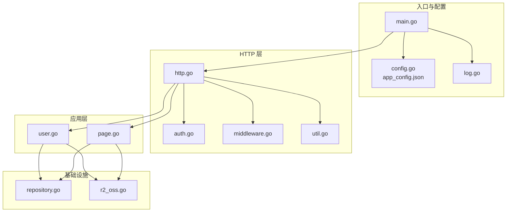
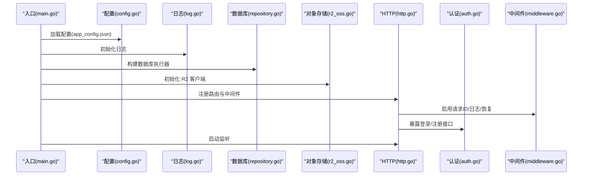
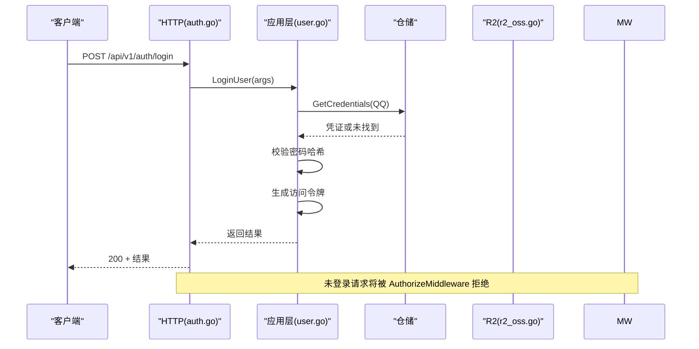
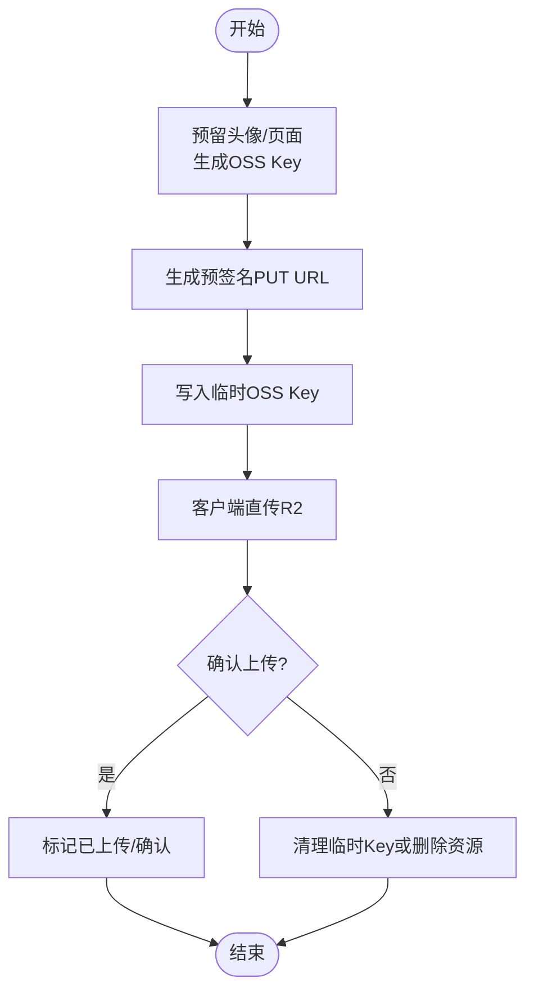
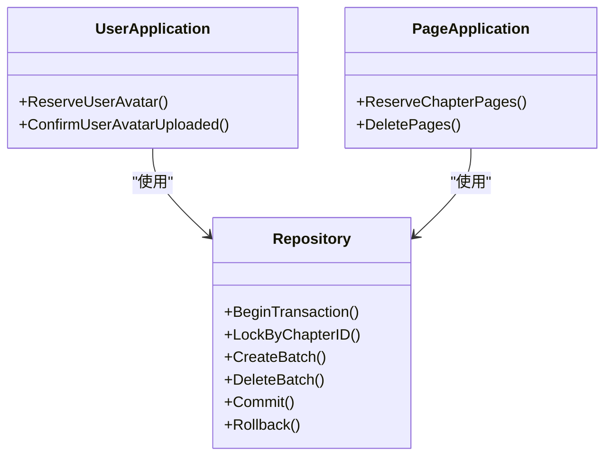
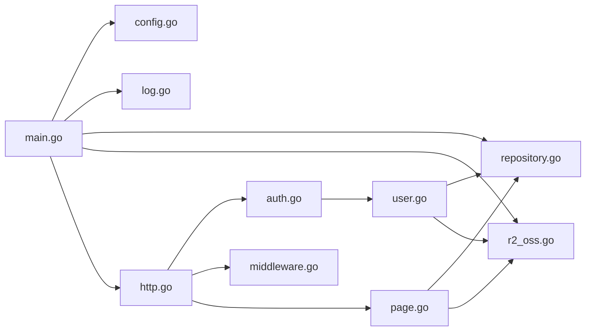

# 故障排除

<cite>
**本文引用的文件**
- [main.go](file://backend/backend-v1/main.go)
- [log.go](file://backend/backend-v1/internal/log/log.go)
- [config.go](file://backend/backend-v1/internal/config/config.go)
- [http.go](file://backend/backend-v1/internal/api/http/http.go)
- [auth.go](file://backend/backend-v1/internal/api/http/auth.go)
- [middleware.go](file://backend/backend-v1/internal/api/http/middleware.go)
- [util.go](file://backend/backend-v1/internal/api/http/util.go)
- [repository.go](file://backend/backend-v1/internal/infrastructure/repository/repository.go)
- [r2_oss.go](file://backend/backend-v1/internal/infrastructure/external/r2_oss.go)
- [user.go](file://backend/backend-v1/internal/application/user.go)
- [page.go](file://backend/backend-v1/internal/application/page.go)
- [app_config.json](file://backend/backend-v1/app_config.json)
</cite>

## 目录
1. [简介](#简介)
2. [项目结构](#项目结构)
3. [核心组件](#核心组件)
4. [架构总览](#架构总览)
5. [详细组件分析](#详细组件分析)
6. [依赖分析](#依赖分析)
7. [性能考虑](#性能考虑)
8. [故障排除指南](#故障排除指南)
9. [结论](#结论)
10. [附录](#附录)

## 简介
本指南面向 Poprako 后端服务的运维与开发人员，提供系统化的故障排除方法与实践。内容覆盖认证问题、数据库连接问题、文件上传问题、日志分析、性能优化、调试工具使用、标准排查流程、监控与告警、健康检查与自愈、备份恢复与数据修复，以及紧急预案与恢复策略。

## 项目结构
后端采用分层架构：入口程序负责装配应用与基础设施；HTTP 层定义路由与中间件；应用层封装业务逻辑；领域模型与仓库接口定义数据契约；外部存储通过 R2 OSS 客户端对接 Cloudflare R2。

**图表来源**
- [main.go:25-145](file://backend/backend-v1/main.go#L25-L145)
- [http.go:16-167](file://backend/backend-v1/internal/api/http/http.go#L16-L167)
- [auth.go:10-73](file://backend/backend-v1/internal/api/http/auth.go#L10-L73)
- [middleware.go:15-80](file://backend/backend-v1/internal/api/http/middleware.go#L15-L80)
- [repository.go:11-30](file://backend/backend-v1/internal/infrastructure/repository/repository.go#L11-L30)
- [r2_oss.go:29-79](file://backend/backend-v1/internal/infrastructure/external/r2_oss.go#L29-L79)
- [user.go:75-104](file://backend/backend-v1/internal/application/user.go#L75-L104)
- [page.go:54-91](file://backend/backend-v1/internal/application/page.go#L54-L91)

**章节来源**
- [main.go:25-145](file://backend/backend-v1/main.go#L25-L145)
- [http.go:16-167](file://backend/backend-v1/internal/api/http/http.go#L16-L167)

## 核心组件
- 应用入口与装配：加载环境变量与配置、初始化日志、构建数据库执行器与各仓储、组装应用层服务、启动 HTTP 服务器。
- HTTP 服务：注册路由、接入请求 ID、日志中间件、panic 恢复、鉴权中间件（Bearer Token）。
- 应用层：用户登录/注册、头像预留与确认、章节页面预留与上传、权限校验与事务管理。
- 数据库：基于 GORM 的 PostgreSQL 连接池配置。
- 对象存储：R2 OSS 客户端，支持预签名上传 URL 生成、批量删除与重试。

**章节来源**
- [main.go:30-145](file://backend/backend-v1/main.go#L30-L145)
- [http.go:16-167](file://backend/backend-v1/internal/api/http/http.go#L16-L167)
- [repository.go:11-30](file://backend/backend-v1/internal/infrastructure/repository/repository.go#L11-L30)
- [r2_oss.go:29-79](file://backend/backend-v1/internal/infrastructure/external/r2_oss.go#L29-L79)
- [user.go:106-278](file://backend/backend-v1/internal/application/user.go#L106-L278)
- [page.go:93-187](file://backend/backend-v1/internal/application/page.go#L93-L187)

## 架构总览
服务启动顺序与组件交互如下：

**图表来源**
- [main.go:25-145](file://backend/backend-v1/main.go#L25-L145)
- [config.go:11-59](file://backend/backend-v1/internal/config/config.go#L11-L59)
- [log.go:13-30](file://backend/backend-v1/internal/log/log.go#L13-L30)
- [repository.go:11-30](file://backend/backend-v1/internal/infrastructure/repository/repository.go#L11-L30)
- [r2_oss.go:29-79](file://backend/backend-v1/internal/infrastructure/external/r2_oss.go#L29-L79)
- [http.go:16-167](file://backend/backend-v1/internal/api/http/http.go#L16-L167)
- [auth.go:22-72](file://backend/backend-v1/internal/api/http/auth.go#L22-L72)
- [middleware.go:15-80](file://backend/backend-v1/internal/api/http/middleware.go#L15-L80)

## 详细组件分析

### 认证与鉴权
- 登录/注册：接收 JSON 参数，调用应用层执行校验与业务逻辑，返回统一响应结构。
- 鉴权中间件：从 Authorization 头提取 Bearer Token，解析 JWT 并注入用户 ID 至上下文。
- 统一响应：成功返回 200，业务错误通过 Code 字段表达；拒绝时返回对应 HTTP 状态码。

**图表来源**
- [auth.go:22-72](file://backend/backend-v1/internal/api/http/auth.go#L22-L72)
- [user.go:106-154](file://backend/backend-v1/internal/application/user.go#L106-L154)
- [middleware.go:47-79](file://backend/backend-v1/internal/api/http/middleware.go#L47-L79)

**章节来源**
- [auth.go:10-73](file://backend/backend-v1/internal/api/http/auth.go#L10-L73)
- [user.go:106-154](file://backend/backend-v1/internal/application/user.go#L106-L154)
- [middleware.go:47-79](file://backend/backend-v1/internal/api/http/middleware.go#L47-L79)
- [util.go:11-59](file://backend/backend-v1/internal/api/http/util.go#L11-L59)

### 文件上传与头像处理
- 预留头像：生成 OSS Key，返回预签名 PUT URL，写入临时 Key。
- 确认上传：标记头像已上传，后续可通过 Get 预签名 URL 访问。
- 章节页面预留：批量创建页面记录，生成多个预签名 URL，事务保证一致性。
- 批量删除：对页面资源进行批量删除并带重试与 NoSuchKey 忽略。

**图表来源**
- [user.go:426-468](file://backend/backend-v1/internal/application/user.go#L426-L468)
- [user.go:521-555](file://backend/backend-v1/internal/application/user.go#L521-L555)
- [page.go:93-187](file://backend/backend-v1/internal/application/page.go#L93-L187)
- [r2_oss.go:109-198](file://backend/backend-v1/internal/infrastructure/external/r2_oss.go#L109-L198)

**章节来源**
- [user.go:426-555](file://backend/backend-v1/internal/application/user.go#L426-L555)
- [page.go:93-187](file://backend/backend-v1/internal/application/page.go#L93-L187)
- [r2_oss.go:81-107](file://backend/backend-v1/internal/infrastructure/external/r2_oss.go#L81-L107)

### 数据库连接与事务
- 连接池：通过配置设置最小空闲与最大打开连接数。
- 事务：应用层关键路径使用 BeginTransaction/Rollback/Commit，确保一致性。
- 锁定：页面预留前对章节记录加锁，避免并发冲突。

**图表来源**
- [repository.go:11-30](file://backend/backend-v1/internal/infrastructure/repository/repository.go#L11-L30)
- [user.go:426-468](file://backend/backend-v1/internal/application/user.go#L426-L468)
- [page.go:93-187](file://backend/backend-v1/internal/application/page.go#L93-L187)

**章节来源**
- [repository.go:11-30](file://backend/backend-v1/internal/infrastructure/repository/repository.go#L11-L30)
- [user.go:426-555](file://backend/backend-v1/internal/application/user.go#L426-L555)
- [page.go:93-187](file://backend/backend-v1/internal/application/page.go#L93-L187)

## 依赖分析
- 入口依赖配置、日志、数据库与对象存储初始化，随后装配应用层服务并启动 HTTP 服务器。
- HTTP 层依赖中间件与应用层；应用层依赖仓储与外部 OSS 客户端。
- 配置来源于 JSON 文件与环境变量，数据库与鉴权密钥均需正确设置。

**图表来源**
- [main.go:30-145](file://backend/backend-v1/main.go#L30-L145)
- [http.go:16-167](file://backend/backend-v1/internal/api/http/http.go#L16-L167)
- [user.go:75-104](file://backend/backend-v1/internal/application/user.go#L75-L104)
- [page.go:54-91](file://backend/backend-v1/internal/application/page.go#L54-L91)

**章节来源**
- [main.go:30-145](file://backend/backend-v1/main.go#L30-L145)
- [http.go:16-167](file://backend/backend-v1/internal/api/http/http.go#L16-L167)

## 性能考虑
- 连接池参数：根据并发与数据库承载能力调整最小空闲与最大打开连接数。
- 预签名直传：减少服务端中转，降低 CPU 与内存压力。
- 事务批处理：批量创建/删除页面时，尽量合并数据库往返。
- 日志级别：生产环境使用 Warn 级别以上，避免过多 I/O。

**章节来源**
- [app_config.json:6-9](file://backend/backend-v1/app_config.json#L6-L9)
- [repository.go:25-26](file://backend/backend-v1/internal/infrastructure/repository/repository.go#L25-L26)
- [r2_oss.go:81-99](file://backend/backend-v1/internal/infrastructure/external/r2_oss.go#L81-L99)
- [log.go:52-83](file://backend/backend-v1/internal/log/log.go#L52-L83)

## 故障排除指南

### 通用排查流程
- 确认环境变量与配置文件齐全且正确。
- 查看服务启动日志，定位初始化阶段异常。
- 使用 Swagger UI 或 curl 验证路由可达与鉴权头有效。
- 关注请求 ID，串联一次请求的全链路日志。
- 对照错误码与业务返回结构，快速定位问题域。

**章节来源**
- [config.go:11-59](file://backend/backend-v1/internal/config/config.go#L11-L59)
- [log.go:13-30](file://backend/backend-v1/internal/log/log.go#L13-L30)
- [http.go:153-166](file://backend/backend-v1/internal/api/http/http.go#L153-L166)
- [util.go:41-46](file://backend/backend-v1/internal/api/http/util.go#L41-L46)

### 认证问题
- 现象
  - 登录失败或提示“用户不存在或密码错误”。
  - 鉴权中间件返回 401，提示未提供或无效的 Authorization 头。
- 排查步骤
  - 确认 JWT_SECRET_KEY 环境变量已设置。
  - 检查请求头是否为 Bearer <token> 格式。
  - 核对登录参数格式与必填字段。
  - 查看应用层日志中的参数验证与凭证查询结果。
- 解决方案
  - 补充缺失的环境变量。
  - 修正 Authorization 头格式。
  - 修复前端参数构造逻辑。

**章节来源**
- [config.go:74-83](file://backend/backend-v1/internal/config/config.go#L74-L83)
- [middleware.go:47-79](file://backend/backend-v1/internal/api/http/middleware.go#L47-L79)
- [auth.go:22-72](file://backend/backend-v1/internal/api/http/auth.go#L22-L72)
- [user.go:106-154](file://backend/backend-v1/internal/application/user.go#L106-L154)

### 数据库连接问题
- 现象
  - 启动时报错“创建数据库执行器失败”或“加载配置失败”。
  - 运行中出现连接超时、连接池耗尽。
- 排查步骤
  - 检查 DATABASE_URL 环境变量是否设置。
  - 核对 app_config.json 中连接池参数是否合理。
  - 观察日志中数据库初始化与连接池设置是否成功。
- 解决方案
  - 补充 DATABASE_URL。
  - 调整最小空闲与最大打开连接数。
  - 检查数据库网络连通性与账号权限。

**章节来源**
- [config.go:91-100](file://backend/backend-v1/internal/config/config.go#L91-L100)
- [repository.go:11-30](file://backend/backend-v1/internal/infrastructure/repository/repository.go#L11-L30)
- [app_config.json:6-9](file://backend/backend-v1/app_config.json#L6-L9)

### 文件上传问题
- 现象
  - 预签名 URL 生成失败。
  - 客户端直传 R2 失败或返回 403/404。
  - 确认上传后头像未生效。
  - 批量删除页面资源失败。
- 排查步骤
  - 检查 R2_ACCOUNT_ID、R2_ACCESS_KEY_ID、R2_SECRET_ACCESS_KEY、R2_BUCKET_NAME 是否设置。
  - 确认 R2 自定义域名配置（如使用）。
  - 查看应用层日志中预签名 URL 生成与 OSS Key 写入过程。
  - 对于批量删除，关注 NoSuchKey 是否被忽略，以及最终错误汇总。
- 解决方案
  - 补充缺失的 R2 环境变量。
  - 核对 Bucket 与 Key 命名规则。
  - 重试并确认客户端直传成功后再调用确认接口。
  - 对于批量删除，按错误列表逐项排查。

**章节来源**
- [r2_oss.go:29-79](file://backend/backend-v1/internal/infrastructure/external/r2_oss.go#L29-L79)
- [r2_oss.go:81-99](file://backend/backend-v1/internal/infrastructure/external/r2_oss.go#L81-L99)
- [r2_oss.go:109-198](file://backend/backend-v1/internal/infrastructure/external/r2_oss.go#L109-L198)
- [user.go:426-468](file://backend/backend-v1/internal/application/user.go#L426-L468)
- [page.go:93-187](file://backend/backend-v1/internal/application/page.go#L93-L187)

### 日志分析与关键条目
- 开发环境
  - 输出到控制台，包含时间、级别、调用者、请求详情与耗时。
  - 可通过 Debug 级别观察详细流程。
- 生产环境
  - 输出 JSON，同时落盘至 logs/main-service.log，自动轮转。
  - 默认 Warn 级别，建议结合请求 ID 与错误码定位问题。
- 关键字段
  - request_id：串联一次请求的全链路日志。
  - duration：请求耗时，辅助性能分析。
  - error/stacktrace：定位异常堆栈。

**章节来源**
- [log.go:13-83](file://backend/backend-v1/internal/log/log.go#L13-L83)
- [middleware.go:15-45](file://backend/backend-v1/internal/api/http/middleware.go#L15-L45)

### 性能问题识别与优化
- 识别
  - 高慢查询：数据库层慢 SQL 与锁等待。
  - 高延迟：鉴权与预签名 URL 生成耗时。
  - 高吞吐瓶颈：连接池过小或直传未启用。
- 优化
  - 调整连接池参数，增加最大打开连接数。
  - 使用预签名直传，减少服务端 CPU 与内存占用。
  - 对热点接口增加缓存（如用户信息），并评估事务范围。
  - 监控请求耗时与错误率，定位异常峰值时段。

**章节来源**
- [repository.go:25-26](file://backend/backend-v1/internal/infrastructure/repository/repository.go#L25-L26)
- [r2_oss.go:81-99](file://backend/backend-v1/internal/infrastructure/external/r2_oss.go#L81-L99)
- [middleware.go:15-45](file://backend/backend-v1/internal/api/http/middleware.go#L15-L45)

### 调试工具与技巧
- Swagger UI：非生产环境提供在线文档与调试界面。
- 请求 ID：中间件注入，便于跨模块关联日志。
- 统一响应：前端可依据 Code 字段进行错误提示与降级。
- 本地联调：优先使用本地数据库与对象存储模拟器，减少线上风险。

**章节来源**
- [http.go:153-166](file://backend/backend-v1/internal/api/http/http.go#L153-L166)
- [util.go:41-46](file://backend/backend-v1/internal/api/http/util.go#L41-L46)

### 监控指标与告警
- 指标
  - QPS、错误率、P95/P99 延迟。
  - 数据库连接池使用率、等待时间。
  - OSS 请求成功率与延迟。
- 告警
  - 错误率突增、延迟越线、连接池耗尽、R2 删除失败率上升。
  - 建议结合请求 ID 与日志进行根因分析。

[本节为通用指导，无需特定文件引用]

### 健康检查与自愈
- 健康检查
  - 提供轻量级 GET 健康端点，检查数据库连通与关键依赖可用性。
- 自愈
  - 对 OSS 删除失败进行有限次重试与错误聚合。
  - 事务失败自动回滚并记录错误。

**章节来源**
- [r2_oss.go:109-198](file://backend/backend-v1/internal/infrastructure/external/r2_oss.go#L109-L198)

### 备份恢复与数据修复
- 备份
  - 数据库定期快照与归档 WAL。
  - 对象存储按前缀导出清单，配合冷存储。
- 恢复
  - 先恢复数据库，再重建应用层缓存。
  - 对象存储资源缺失时，优先通过数据库重建 Key 并重新上传。
- 数据修复
  - 使用事务包裹修复脚本，失败即回滚。
  - 对批量修复任务进行幂等设计与进度追踪。

[本节为通用指导，无需特定文件引用]

### 紧急预案与恢复策略
- 预案
  - 认证密钥泄露：立即轮换并滚动重启。
  - 数据库不可用：切换只读副本或降级缓存模式。
  - OSS 不可用：启用备用域名或临时离线上传。
- 恢复
  - 快速隔离问题影响面，限制写入与高风险操作。
  - 逐步回滚变更，验证修复后恢复全量流量。

[本节为通用指导，无需特定文件引用]

## 结论
通过标准化的排查流程、完善的日志体系、合理的性能优化与监控告警，Poprako 后端可在生产环境中保持稳定与高效。建议持续完善自动化巡检与演练，确保在突发情况下能够快速定位与恢复。

## 附录

### 常见错误码与含义
- internal_error：内部逻辑错误，通常由应用层捕获并返回。

**章节来源**
- [application/error.go:1-8](file://backend/backend-v1/internal/application/error.go#L1-L8)

### 配置清单与环境变量
- app_config.json
  - server_address：监听地址与端口。
  - auth.expiration_hours：JWT 过期小时数。
  - database.min_idle_connections / max_open_connections：连接池参数。
- 环境变量
  - APP_ENVIRONMENT：development/production。
  - JWT_SECRET_KEY：JWT 密钥。
  - DATABASE_URL：数据库连接串。
  - R2_ACCOUNT_ID、R2_ACCESS_KEY_ID、R2_SECRET_ACCESS_KEY、R2_BUCKET_NAME、R2_REGION、R2_CUSTOM_DOMAIN：R2 凭证与配置。

**章节来源**
- [app_config.json:1-11](file://backend/backend-v1/app_config.json#L1-L11)
- [config.go:44-83](file://backend/backend-v1/internal/config/config.go#L44-L83)
- [r2_oss.go:30-56](file://backend/backend-v1/internal/infrastructure/external/r2_oss.go#L30-L56)