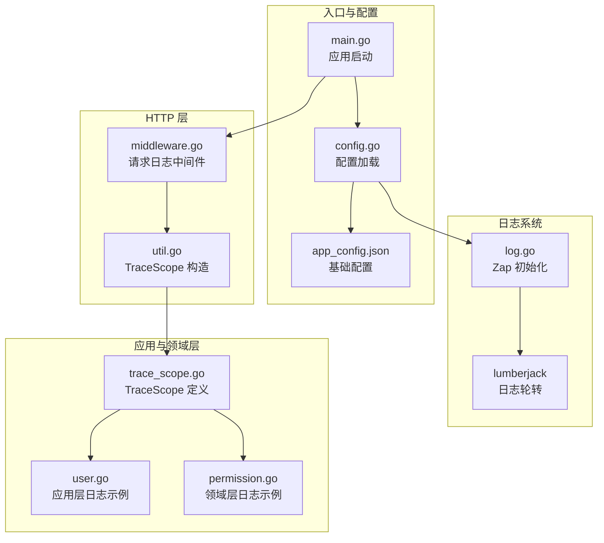
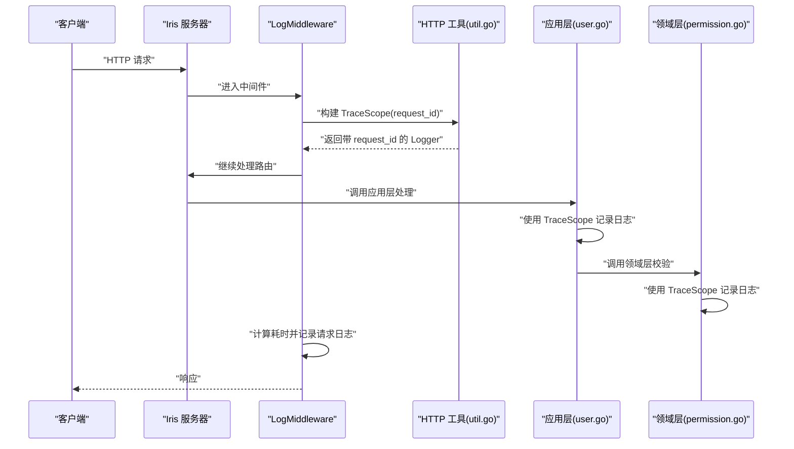
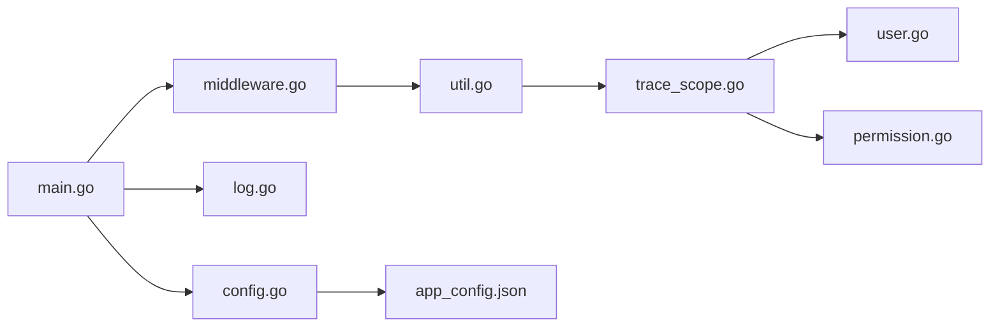

# 日志分析

<cite>
**本文引用的文件**
- [main.go](file://backend/backend-v1/main.go)
- [log.go](file://backend/backend-v1/internal/log/log.go)
- [config.go](file://backend/backend-v1/internal/config/config.go)
- [middleware.go](file://backend/backend-v1/internal/api/http/middleware.go)
- [util.go](file://backend/backend-v1/internal/api/http/util.go)
- [trace_scope.go](file://backend/backend-v1/internal/util/trace_scope.go)
- [app_config.json](file://backend/backend-v1/app_config.json)
- [user.go](file://backend/backend-v1/internal/application/user.go)
- [permission.go](file://backend/backend-v1/internal/domain/model/permission.go)
- [error.go](file://backend/backend-v1/internal/application/error.go)
</cite>

## 目录
1. [简介](#简介)
2. [项目结构](#项目结构)
3. [核心组件](#核心组件)
4. [架构总览](#架构总览)
5. [详细组件分析](#详细组件分析)
6. [依赖分析](#依赖分析)
7. [性能考虑](#性能考虑)
8. [故障排查指南](#故障排查指南)
9. [结论](#结论)
10. [附录](#附录)

## 简介
本指南面向 Poprako 后端服务的运维与开发人员，系统讲解日志系统的配置与使用，覆盖开发与生产环境的日志级别差异、关键日志条目的含义与解读、日志搜索与过滤技巧、Trace ID 的生成与链路追踪方法，以及日志轮转与存储管理策略。文档基于实际代码实现，确保内容可追溯、可落地。

## 项目结构
后端采用 Go 语言与 Iris 框架，日志系统由 Zap 提供，结合 lumberjack 实现生产环境日志轮转；HTTP 层通过中间件记录请求级日志；应用层与领域层广泛使用 TraceScope 串联请求上下文，形成统一的链路标识。

图表来源
- [main.go:25-35](file://backend/backend-v1/main.go#L25-L35)
- [config.go:11-59](file://backend/backend-v1/internal/config/config.go#L11-L59)
- [log.go:13-30](file://backend/backend-v1/internal/log/log.go#L13-L30)
- [middleware.go:15-45](file://backend/backend-v1/internal/api/http/middleware.go#L15-L45)
- [util.go:41-46](file://backend/backend-v1/internal/api/http/util.go#L41-L46)
- [trace_scope.go:8-31](file://backend/backend-v1/internal/util/trace_scope.go#L8-L31)
- [user.go:106-154](file://backend/backend-v1/internal/application/user.go#L106-L154)
- [permission.go:28-45](file://backend/backend-v1/internal/domain/model/permission.go#L28-L45)

章节来源
- [main.go:25-35](file://backend/backend-v1/main.go#L25-L35)
- [config.go:11-59](file://backend/backend-v1/internal/config/config.go#L11-L59)
- [log.go:13-30](file://backend/backend-v1/internal/log/log.go#L13-L30)

## 核心组件
- 日志初始化与环境适配：根据配置决定开发或生产模式，分别采用控制台彩色输出与 JSON 文件输出，并启用堆栈跟踪与调用者信息。
- 请求日志中间件：在开发环境下记录方法、路径、状态码、远端地址、请求 ID 与耗时。
- TraceScope：在请求进入 HTTP 层时注入 request_id，贯穿应用层与领域层，便于跨模块关联。
- 日志轮转：生产环境将 JSON 日志写入 logs/main-service.log，并按大小、天数与备份数进行轮转压缩。

章节来源
- [log.go:13-83](file://backend/backend-v1/internal/log/log.go#L13-L83)
- [middleware.go:15-45](file://backend/backend-v1/internal/api/http/middleware.go#L15-L45)
- [util.go:41-46](file://backend/backend-v1/internal/api/http/util.go#L41-L46)
- [trace_scope.go:8-31](file://backend/backend-v1/internal/util/trace_scope.go#L8-L31)

## 架构总览
下图展示从请求进入 HTTP 层到日志输出的关键流程，以及 Trace ID 的生成与传播路径。

图表来源
- [middleware.go:15-45](file://backend/backend-v1/internal/api/http/middleware.go#L15-L45)
- [util.go:41-46](file://backend/backend-v1/internal/api/http/util.go#L41-L46)
- [user.go:106-154](file://backend/backend-v1/internal/application/user.go#L106-L154)
- [permission.go:28-45](file://backend/backend-v1/internal/domain/model/permission.go#L28-L45)

## 详细组件分析

### 日志初始化与环境配置
- 开发环境
  - 使用开发编码器，启用颜色输出与 ISO 时间格式。
  - 输出级别：Debug。
  - 输出目标：控制台。
  - 行为：自动添加调用者信息与 Panic 级别堆栈。
- 生产环境
  - 使用生产编码器，启用 JSON 输出与 ISO 时间格式。
  - 输出级别：Warn。
  - 输出目标：控制台 + lumberjack 文件同步器。
  - 行为：自动添加调用者信息与 Panic 级别堆栈。
- 日志轮转参数（生产）
  - 文件名：logs/main-service.log
  - 单文件最大大小：50MB
  - 最大备份数：3
  - 保留天数：7
  - 压缩：开启

章节来源
- [log.go:13-83](file://backend/backend-v1/internal/log/log.go#L13-L83)
- [config.go:61-67](file://backend/backend-v1/internal/config/config.go#L61-L67)

### 请求日志中间件
- 作用：在开发环境下记录每次请求的完成信息，包括方法、路径、状态码、远端地址、请求 ID 与耗时。
- 关键点：依赖 Iris 的 requestid 中间件，需保证在 LogMiddleware 之前注册。

章节来源
- [middleware.go:15-45](file://backend/backend-v1/internal/api/http/middleware.go#L15-L45)

### TraceScope 与请求 ID 注入
- TraceScope：封装 zap.Logger 并提供 WithFields 扩展能力，便于在请求生命周期内注入统一字段（如 request_id）。
- 构造方式：在 HTTP 工具函数中从 Iris 上下文提取 request_id，并注入到 TraceScope 中，随后在各层复用该 Scope 记录日志。

章节来源
- [trace_scope.go:8-31](file://backend/backend-v1/internal/util/trace_scope.go#L8-L31)
- [util.go:41-46](file://backend/backend-v1/internal/api/http/util.go#L41-L46)

### 应用层与领域层日志实践
- 应用层示例：在用户登录、注册等关键流程中，使用 TraceScope 记录 Debug/Warn/Error/Panic 等不同级别的日志，包含关键参数与错误信息。
- 领域层示例：在权限校验等关键路径中，记录失败原因与上下文信息，便于定位权限相关问题。

章节来源
- [user.go:106-154](file://backend/backend-v1/internal/application/user.go#L106-L154)
- [permission.go:28-45](file://backend/backend-v1/internal/domain/model/permission.go#L28-L45)

### 配置文件与环境变量
- app_config.json：定义 server_address、auth.expiration_hours、database.min/max connections 等基础配置。
- 环境变量：
  - APP_ENVIRONMENT：决定开发/生产模式。
  - JWT_SECRET_KEY：用于签发与解析访问令牌。
  - DATABASE_URL：数据库连接字符串。

章节来源
- [app_config.json:1-11](file://backend/backend-v1/app_config.json#L1-L11)
- [config.go:44-47](file://backend/backend-v1/internal/config/config.go#L44-L47)
- [config.go:74-83](file://backend/backend-v1/internal/config/config.go#L74-L83)
- [config.go:91-99](file://backend/backend-v1/internal/config/config.go#L91-L99)

## 依赖分析
- 入口依赖：main.go 加载 .env、读取配置、初始化日志、构造应用状态并启动 HTTP 服务器。
- 日志依赖：log.go 根据配置选择编码器与输出目标，并替换全局 Logger。
- HTTP 依赖：middleware.go 依赖 requestid 中间件与 Iris 上下文；util.go 依赖 requestid 与 TraceScope。
- 应用/领域依赖：user.go 与 permission.go 通过 TraceScope 与 zap.L() 记录日志。

图表来源
- [main.go:25-35](file://backend/backend-v1/main.go#L25-L35)
- [config.go:11-59](file://backend/backend-v1/internal/config/config.go#L11-L59)
- [log.go:13-30](file://backend/backend-v1/internal/log/log.go#L13-L30)
- [middleware.go:15-45](file://backend/backend-v1/internal/api/http/middleware.go#L15-L45)
- [util.go:41-46](file://backend/backend-v1/internal/api/http/util.go#L41-L46)
- [trace_scope.go:8-31](file://backend/backend-v1/internal/util/trace_scope.go#L8-L31)
- [user.go:106-154](file://backend/backend-v1/internal/application/user.go#L106-L154)
- [permission.go:28-45](file://backend/backend-v1/internal/domain/model/permission.go#L28-L45)

章节来源
- [main.go:25-35](file://backend/backend-v1/main.go#L25-L35)
- [config.go:11-59](file://backend/backend-v1/internal/config/config.go#L11-L59)
- [log.go:13-30](file://backend/backend-v1/internal/log/log.go#L13-L30)

## 性能考虑
- 开发环境：Debug 级别输出更丰富，便于调试；但会带来额外开销，建议仅在本地或测试环境使用。
- 生产环境：Warn 级别减少冗余日志；JSON 结构利于日志采集与检索；lumberjack 轮转避免单文件过大影响 IO。
- 建议：对高频路径的日志尽量使用 Debug/Warn 级别，避免在热路径频繁记录 Error/Panic；必要时使用采样或条件判断降低开销。

## 故障排查指南

### 如何区分日志级别与含义
- 开发环境
  - Debug：调试信息，包含调用者与堆栈，适合本地开发定位细节。
  - Info：应用启动、关闭等关键事件。
- 生产环境
  - Warn：潜在问题或异常分支，需要关注。
  - Error：业务错误或外部依赖失败。
  - Panic：严重异常，通常伴随堆栈输出。

章节来源
- [log.go:16-27](file://backend/backend-v1/internal/log/log.go#L16-L27)
- [log.go:78-82](file://backend/backend-v1/internal/log/log.go#L78-L82)

### 关键日志条目解读
- 请求完成日志（开发）
  - 字段：method、path、status_code、remote_addr、request_id、duration。
  - 用途：快速定位慢请求、错误接口与异常来源。
- 应用层日志
  - 示例：LoginUser/RegisterUser 等流程中记录参数校验失败、外部依赖错误、事务失败等。
  - 用途：定位业务异常与边界条件。
- 领域层日志
  - 示例：权限校验失败时记录 userID/teamID/comicID 等上下文。
  - 用途：定位权限相关问题。

章节来源
- [middleware.go:34-42](file://backend/backend-v1/internal/api/http/middleware.go#L34-L42)
- [user.go:112-115](file://backend/backend-v1/internal/application/user.go#L112-L115)
- [user.go:130-132](file://backend/backend-v1/internal/application/user.go#L130-L132)
- [permission.go:35-41](file://backend/backend-v1/internal/domain/model/permission.go#L35-L41)

### 日志搜索与过滤技巧
- 按 Trace ID 追踪
  - 在 HTTP 层注入 request_id，后续所有日志均带有该字段，可在日志平台按 request_id 过滤完整链路。
- 按时间范围与级别
  - 生产日志为 JSON，便于结构化检索；按 level、time、request_id、module 等字段组合过滤。
- 按接口与状态
  - 在开发日志中可按 method/path/status_code 快速筛选异常接口。
- 按错误类型
  - 使用错误码常量（如 internal_error）与错误消息关键字定位内部错误。

章节来源
- [util.go:41-46](file://backend/backend-v1/internal/api/http/util.go#L41-L46)
- [error.go:3-7](file://backend/backend-v1/internal/application/error.go#L3-L7)

### Trace ID 的生成与使用
- 生成：Iris requestid 中间件自动生成唯一请求 ID。
- 使用：HTTP 工具函数提取 request_id，注入 TraceScope，随后在应用层/领域层复用该 Scope 记录日志。
- 追踪：在日志平台按 request_id 聚合，即可还原一次请求的全链路行为。

章节来源
- [util.go:41-46](file://backend/backend-v1/internal/api/http/util.go#L41-L46)
- [trace_scope.go:8-31](file://backend/backend-v1/internal/util/trace_scope.go#L8-L31)

### 日志轮转与存储策略
- 轮转参数（生产）
  - 文件：logs/main-service.log
  - 单文件最大：50MB
  - 备份数：3
  - 保留天数：7
  - 压缩：开启
- 存储建议
  - 将 logs 目录挂载到持久化卷，避免容器重启丢失。
  - 结合日志采集器（如 Fluent Bit/Fluentd/Filebeat）集中收集并转发至日志平台。
  - 定期清理过期日志，确保磁盘空间。

章节来源
- [log.go:64-70](file://backend/backend-v1/internal/log/log.go#L64-L70)

### 日志文件管理与清理
- 手动清理：删除超过 MaxAge 的旧文件，保留最多 MaxBackups 个备份。
- 自动清理：lumberjack 在写入新文件时自动触发轮转与压缩。
- 建议：监控磁盘使用率，设置告警阈值，定期审计日志目录大小。

章节来源
- [log.go:64-70](file://backend/backend-v1/internal/log/log.go#L64-L70)

## 结论
Poprako 的日志体系以 Zap 为核心，结合 Iris 的 requestid 中间件与自定义 TraceScope，实现了从请求入口到业务处理的统一链路追踪。开发与生产环境采用差异化配置，既满足本地调试需求，又兼顾生产稳定性与可观测性。配合结构化 JSON 日志与 lumberjack 轮转，能够高效支撑问题定位与长期运维。

## 附录

### 开发环境与生产环境配置要点
- 开发环境
  - APP_ENVIRONMENT=development
  - 输出：控制台彩色 Debug 日志
  - 适用：本地开发、联调、压测
- 生产环境
  - APP_ENVIRONMENT=production
  - 输出：控制台 + 文件 JSON，Warn 级别及以上
  - 适用：线上运行、生产监控

章节来源
- [config.go:61-67](file://backend/backend-v1/internal/config/config.go#L61-L67)
- [log.go:16-27](file://backend/backend-v1/internal/log/log.go#L16-L27)
- [log.go:78-82](file://backend/backend-v1/internal/log/log.go#L78-L82)