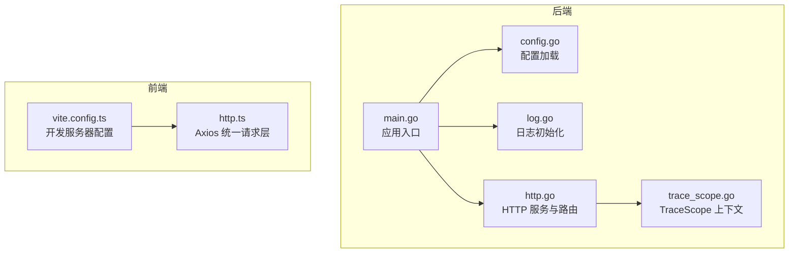
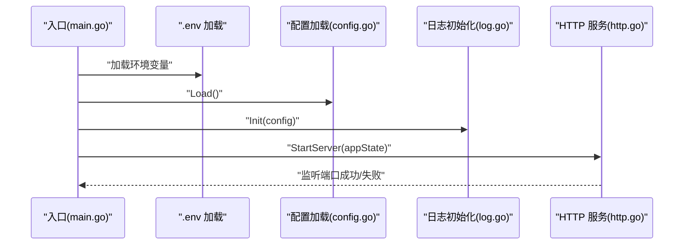
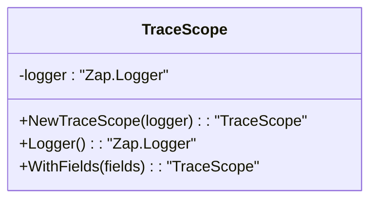
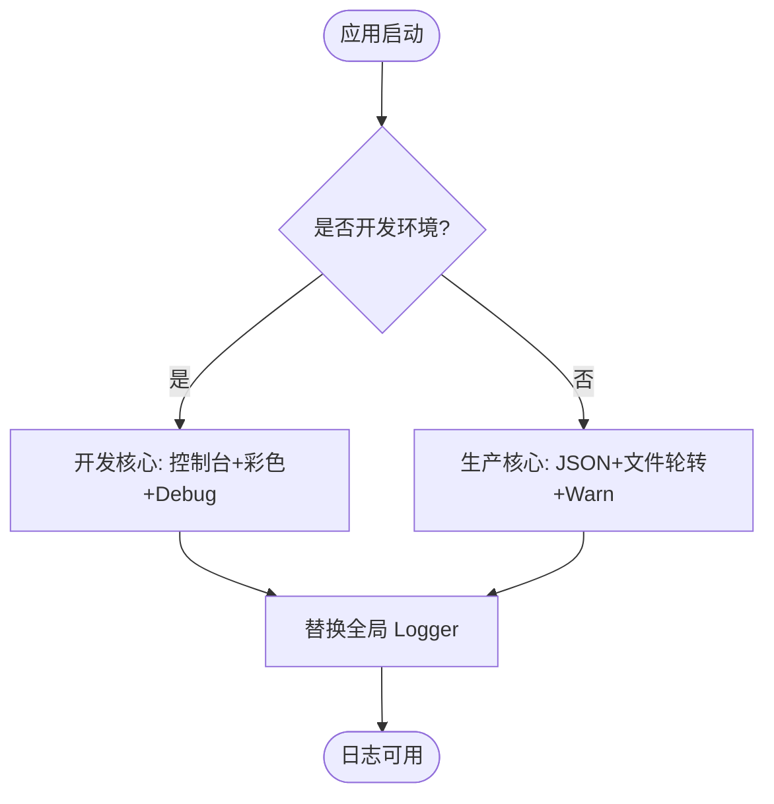
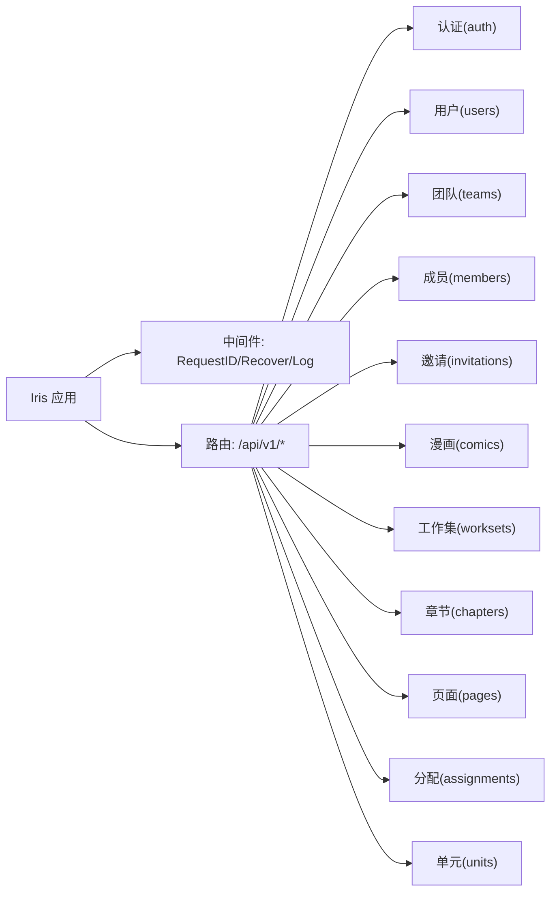
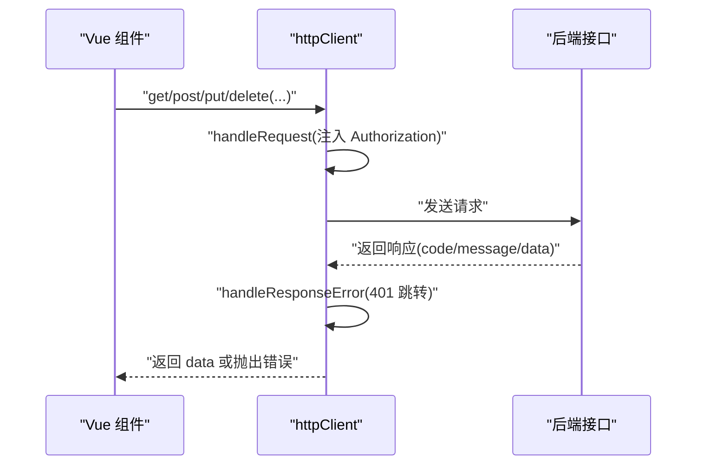
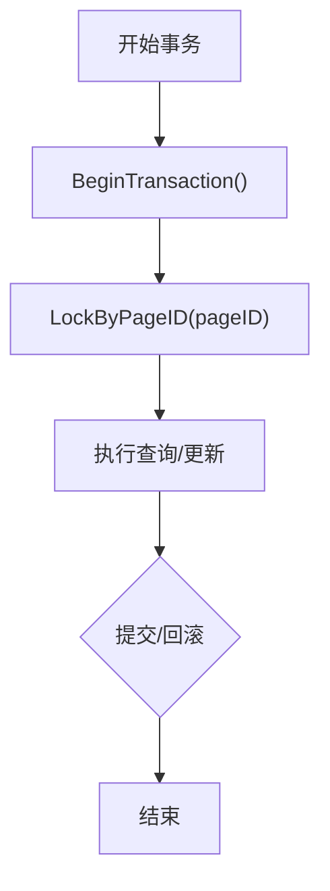
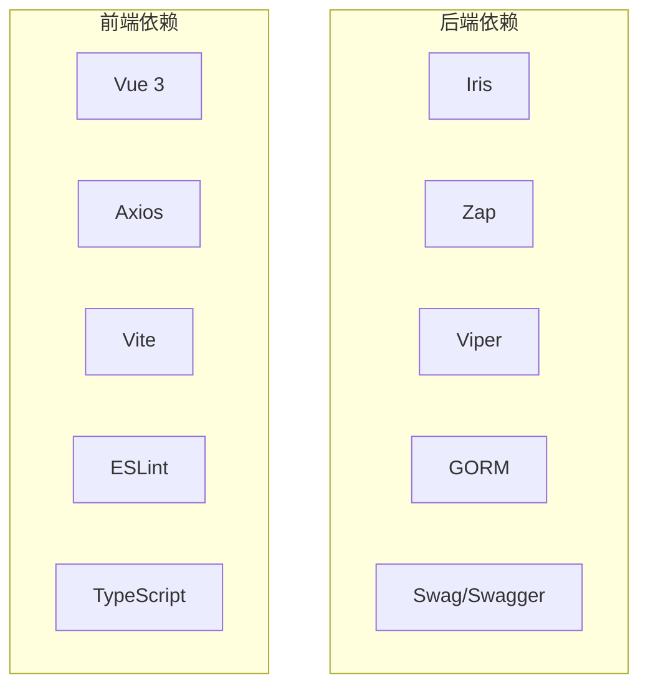

# 调试指南

<cite>
**本文引用的文件**
- [main.go](file://backend/backend-v1/main.go)
- [http.go](file://backend/backend-v1/internal/api/http/http.go)
- [log.go](file://backend/backend-v1/internal/log/log.go)
- [config.go](file://backend/backend-v1/internal/config/config.go)
- [trace_scope.go](file://backend/backend-v1/internal/util/trace_scope.go)
- [vite.config.ts](file://web/vite.config.ts)
- [http.ts](file://web/src/api/http.ts)
- [.golangci.yml](file://backend/backend-v1/.golangci.yml)
- [justfile](file://backend/backend-v1/justfile)
- [unit.go](file://backend/backend-v1/internal/infrastructure/repository/unit.go)
</cite>

## 目录
1. [简介](#简介)
2. [项目结构](#项目结构)
3. [核心组件](#核心组件)
4. [架构总览](#架构总览)
5. [详细组件分析](#详细组件分析)
6. [依赖分析](#依赖分析)
7. [性能考虑](#性能考虑)
8. [故障排查指南](#故障排查指南)
9. [结论](#结论)
10. [附录](#附录)

## 简介
本调试指南面向 Poprako 项目的后端与前端，覆盖以下主题：
- 后端 Go 调试器使用、IDE 调试配置与远程调试
- Trace Scope 的使用与调试上下文创建
- 断点设置最佳实践与条件断点技巧
- 前端浏览器开发者工具调试（网络请求、控制台、性能）
- 单元测试与集成测试调试方法
- 测试覆盖率工具与问题定位

## 项目结构
后端采用 Iris 框架与 GORM 数据层，日志通过 Zap 输出；前端基于 Vue 3 + Vite，使用 Axios 封装 HTTP 请求。

**图表来源**
- [main.go:25-145](file://backend/backend-v1/main.go#L25-L145)
- [http.go:16-167](file://backend/backend-v1/internal/api/http/http.go#L16-L167)
- [log.go:13-84](file://backend/backend-v1/internal/log/log.go#L13-L84)
- [config.go:11-101](file://backend/backend-v1/internal/config/config.go#L11-L101)
- [trace_scope.go:8-31](file://backend/backend-v1/internal/util/trace_scope.go#L8-L31)
- [vite.config.ts:21-43](file://web/vite.config.ts#L21-L43)
- [http.ts:33-196](file://web/src/api/http.ts#L33-L196)

**章节来源**
- [main.go:25-145](file://backend/backend-v1/main.go#L25-L145)
- [http.go:16-167](file://backend/backend-v1/internal/api/http/http.go#L16-L167)
- [log.go:13-84](file://backend/backend-v1/internal/log/log.go#L13-L84)
- [config.go:11-101](file://backend/backend-v1/internal/config/config.go#L11-L101)
- [trace_scope.go:8-31](file://backend/backend-v1/internal/util/trace_scope.go#L8-L31)
- [vite.config.ts:21-43](file://web/vite.config.ts#L21-L43)
- [http.ts:33-196](file://web/src/api/http.ts#L33-L196)

## 核心组件
- 应用入口与生命周期：负责加载环境变量、配置、初始化日志、构建应用状态并启动 HTTP 服务器。
- HTTP 服务与路由：注册中间件（请求 ID、恢复、日志）、分派各模块路由。
- 日志系统：开发模式彩色控制台输出，生产模式 JSON + 文件轮转，支持堆栈追踪。
- 配置系统：从 JSON 配置文件与环境变量加载运行参数。
- TraceScope：轻量级链路日志上下文，支持字段透传与链式调用。
- 前端请求层：Axios 统一封装，自动注入 Token、错误标准化、查询参数序列化。

**章节来源**
- [main.go:25-145](file://backend/backend-v1/main.go#L25-L145)
- [http.go:16-167](file://backend/backend-v1/internal/api/http/http.go#L16-L167)
- [log.go:13-84](file://backend/backend-v1/internal/log/log.go#L13-L84)
- [config.go:11-101](file://backend/backend-v1/internal/config/config.go#L11-L101)
- [trace_scope.go:8-31](file://backend/backend-v1/internal/util/trace_scope.go#L8-L31)
- [http.ts:33-196](file://web/src/api/http.ts#L33-L196)

## 架构总览
后端启动流程：入口函数加载 .env → 读取 app_config.json → 初始化日志 → 构建仓储与应用层 → 注册 HTTP 路由 → 启动服务。

**图表来源**
- [main.go:25-145](file://backend/backend-v1/main.go#L25-L145)
- [config.go:11-101](file://backend/backend-v1/internal/config/config.go#L11-L101)
- [log.go:13-84](file://backend/backend-v1/internal/log/log.go#L13-L84)
- [http.go:16-24](file://backend/backend-v1/internal/api/http/http.go#L16-L24)

## 详细组件分析

### TraceScope 使用与调试上下文
- 作用：在业务链路中注入结构化日志字段，便于跨模块串联追踪。
- 关键点：构造函数接收 Zap Logger；Logger() 支持空值回退；WithFields() 返回自身用于链式调用。
- 调试建议：在关键入口/事务边界创建 TraceScope，按模块追加领域字段，避免污染全局 Logger。

**图表来源**
- [trace_scope.go:8-31](file://backend/backend-v1/internal/util/trace_scope.go#L8-L31)

**章节来源**
- [trace_scope.go:8-31](file://backend/backend-v1/internal/util/trace_scope.go#L8-L31)

### 日志系统与调试上下文
- 开发模式：控制台输出、彩色级别、ISO 时间、Debug 级别、堆栈追踪。
- 生产模式：JSON 编码、多写入器（控制台+文件）、轮转策略、Warn 级别。
- 调试建议：在本地开发时观察控制台彩色输出快速定位问题；生产环境结合日志文件与告警。

**图表来源**
- [log.go:13-84](file://backend/backend-v1/internal/log/log.go#L13-L84)

**章节来源**
- [log.go:13-84](file://backend/backend-v1/internal/log/log.go#L13-L84)

### HTTP 服务与路由调试
- 中间件：请求 ID、panic 恢复、日志记录。
- 路由：按模块划分（认证、用户、团队、成员、邀请、漫画、工作集、章节、页面、分配、单元）。
- 调试建议：优先使用 Swagger UI（非生产环境）验证接口；结合请求 ID 快速定位请求链路。

**图表来源**
- [http.go:26-167](file://backend/backend-v1/internal/api/http/http.go#L26-L167)

**章节来源**
- [http.go:26-167](file://backend/backend-v1/internal/api/http/http.go#L26-L167)

### 前端请求层与浏览器调试
- 自动注入 Authorization 头（localStorage 中的 access_token）。
- 统一错误处理：401 清理 Token 并跳转登录。
- 查询参数序列化：兼容 includes[] 数组格式。
- 调试建议：打开 Network 面板查看请求头/体与响应；Console 面板查看错误消息；利用断点定位数据流。

**图表来源**
- [http.ts:33-196](file://web/src/api/http.ts#L33-L196)

**章节来源**
- [http.ts:33-196](file://web/src/api/http.ts#L33-L196)

### 数据库事务与并发调试
- 仓储层支持 BeginTransaction 与锁查询（示例：按页 ID 锁定单元）。
- 调试建议：在高并发场景下关注锁等待与死锁；结合日志观察事务边界与耗时。

**图表来源**
- [unit.go:28-42](file://backend/backend-v1/internal/infrastructure/repository/unit.go#L28-L42)

**章节来源**
- [unit.go:28-42](file://backend/backend-v1/internal/infrastructure/repository/unit.go#L28-L42)

## 依赖分析
- 后端依赖：Iris（Web）、Zap（日志）、Viper（配置）、GORM（ORM）、Swag/Swagger（文档）。
- 前端依赖：Vue 3、Axios、Vite、ESLint、TypeScript。

**图表来源**
- [go.mod:5-18](file://backend/backend-v1/go.mod#L5-L18)
- [package.json:13-34](file://web/package.json#L13-L34)

**章节来源**
- [go.mod:5-18](file://backend/backend-v1/go.mod#L5-L18)
- [package.json:13-34](file://web/package.json#L13-L34)

## 性能考虑
- 后端
  - 使用 TraceScope 标注关键阶段耗时，结合日志时间戳定位慢点。
  - 生产环境启用 JSON 日志与文件轮转，避免控制台输出带来的开销。
  - 合理设置数据库连接池参数（最小空闲、最大连接数），避免连接争用。
- 前端
  - 利用浏览器 Performance 面板分析渲染与网络瓶颈。
  - 减少不必要的响应式更新与重复请求，使用缓存策略。

## 故障排查指南
- 后端
  - 环境变量缺失：确认 APP_ENVIRONMENT、JWT_SECRET_KEY、DATABASE_URL 是否正确设置。
  - 配置加载失败：检查 app_config.json 格式与字段映射。
  - 日志不可见：开发模式应输出到控制台；生产模式检查 logs/main-service.log。
  - 接口异常：开启 Swagger UI（非生产环境）核对路径与参数；结合请求 ID 定位。
- 前端
  - 无法登录/401：检查 localStorage 中 access_token 是否存在；Network 面板确认 Authorization 头。
  - 请求失败：查看响应体中的 code/message 字段；Console 面板查看错误堆栈。
  - 跨域问题：确认 Vite 代理或后端 CORS 配置（如需）。
- 通用
  - 使用断点与条件断点：在关键函数入口、分支处设置断点；对高频循环设置条件断点过滤无效样本。
  - 远程调试：后端可通过 Delve 远程 attach；前端可在浏览器中启用“保持断点”与“忽略休眠”。

**章节来源**
- [config.go:44-50](file://backend/backend-v1/internal/config/config.go#L44-L50)
- [log.go:13-84](file://backend/backend-v1/internal/log/log.go#L13-L84)
- [http.go:153-166](file://backend/backend-v1/internal/api/http/http.go#L153-L166)
- [http.ts:82-97](file://web/src/api/http.ts#L82-L97)

## 结论
通过 TraceScope、Zap 日志与 Iris 中间件，后端具备良好的可观测性；前端 Axios 统一层简化了调试与错误处理。结合浏览器开发者工具与后端断点/条件断点，可高效定位问题并优化性能。

## 附录

### Go 调试器与 IDE 配置
- 使用 Delve 启动后端
  - 开发启动：使用 justfile 的 dev 目标直接运行 main.go。
  - IDE 配置：在 VSCode/GoLand 中设置运行配置，选择 main.go 作为入口，传递必要的环境变量（APP_ENVIRONMENT、JWT_SECRET_KEY、DATABASE_URL）。
- 远程调试
  - 后端：以 headless 模式启动 Delve，绑定远端 IDE；注意防火墙与端口映射。
  - 前端：在浏览器中启用“保持断点”、“忽略休眠”，配合源码映射定位问题。

**章节来源**
- [justfile:18-19](file://backend/backend-v1/justfile#L18-L19)
- [main.go:25-28](file://backend/backend-v1/main.go#L25-L28)
- [config.go:44-50](file://backend/backend-v1/internal/config/config.go#L44-L50)

### Trace Scope 使用与调试上下文
- 在业务入口创建 TraceScope，按模块追加字段（如用户 ID、团队 ID、请求 ID）。
- 在事务开始/结束、关键分支处记录日志，便于回溯。
- 避免在高频循环中频繁创建新上下文，尽量复用。

**章节来源**
- [trace_scope.go:12-31](file://backend/backend-v1/internal/util/trace_scope.go#L12-L31)

### 断点设置最佳实践与条件断点
- 入口断点：路由处理器、服务层方法入口。
- 分支断点：鉴权失败、参数校验失败、数据库异常。
- 条件断点：仅在特定用户 ID、特定请求路径或错误码出现时触发。
- 远程断点：在生产环境开启必要的日志采样，结合 TraceScope 字段定位。

**章节来源**
- [http.go:40-146](file://backend/backend-v1/internal/api/http/http.go#L40-L146)

### 浏览器开发者工具调试
- 网络请求分析：查看请求头、响应体、状态码与耗时；关注 401/422 等错误。
- 控制台调试：打印关键变量、调用栈；利用断点暂停执行。
- 性能分析：录制性能时间线，识别长任务与重绘热点。

**章节来源**
- [http.ts:66-97](file://web/src/api/http.ts#L66-L97)

### 单元测试与集成测试调试
- 后端
  - 使用 golangci-lint 检查静态问题；在 CI 中启用测试与超时控制。
  - 对关键函数编写单元测试，使用条件断点与日志辅助定位失败用例。
- 前端
  - 使用 Vitest/Jest（如引入）进行单元测试；在浏览器中启用“保持断点”。
  - 集成测试：通过 Cypress/Puppeteer 模拟真实交互，结合 Network 面板核对请求。

**章节来源**
- [.golangci.yml:9-18](file://backend/backend-v1/.golangci.yml#L9-L18)
- [justfile:9-10](file://backend/backend-v1/justfile#L9-L10)

### 测试覆盖率与问题定位
- 后端覆盖率：结合测试命令生成覆盖率报告，定位未覆盖路径（如错误分支、边界条件）。
- 前端覆盖率：在测试框架中启用覆盖率统计，结合断点与日志定位未覆盖的组件分支。

**章节来源**
- [.golangci.yml:3-5](file://backend/backend-v1/.golangci.yml#L3-L5)