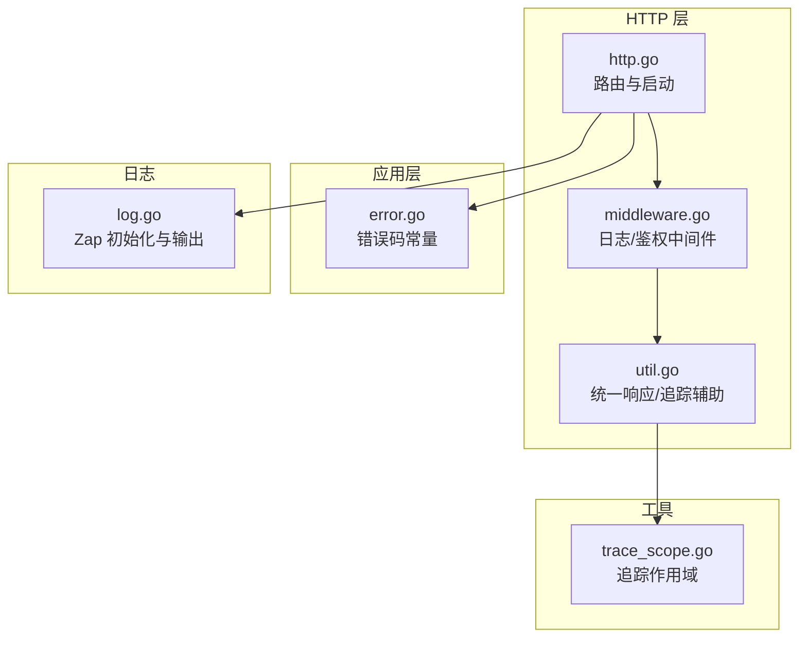
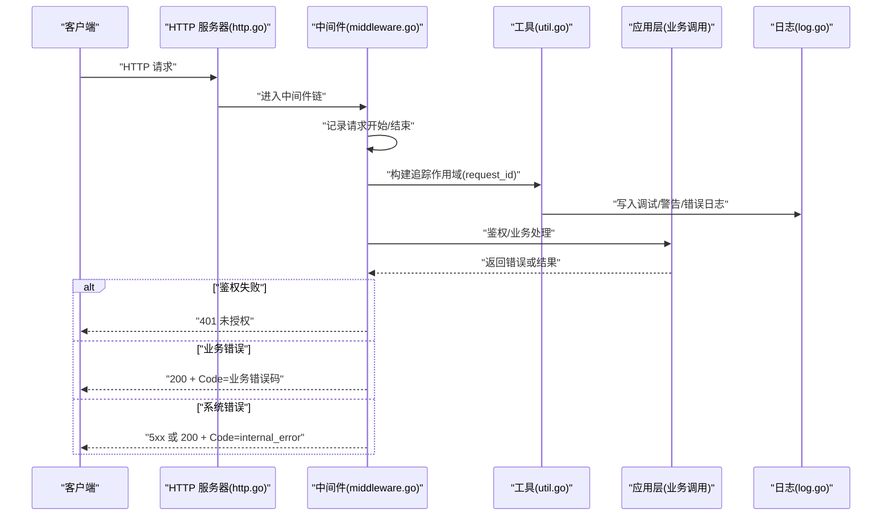
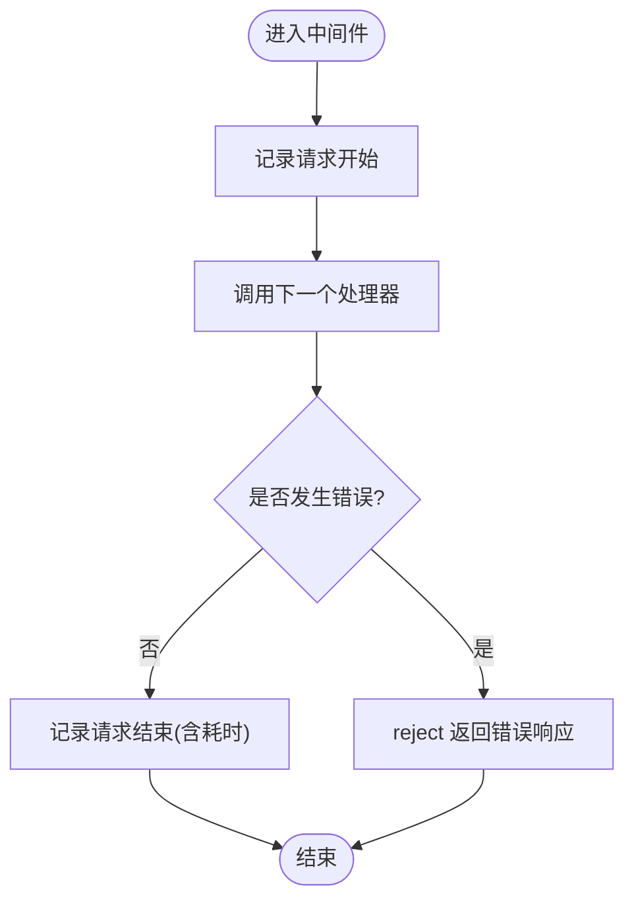
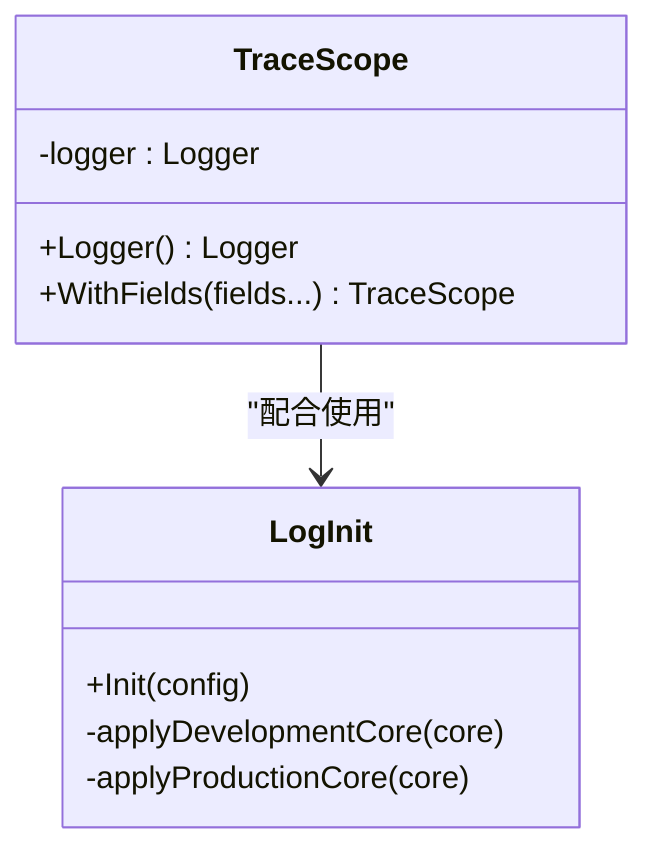
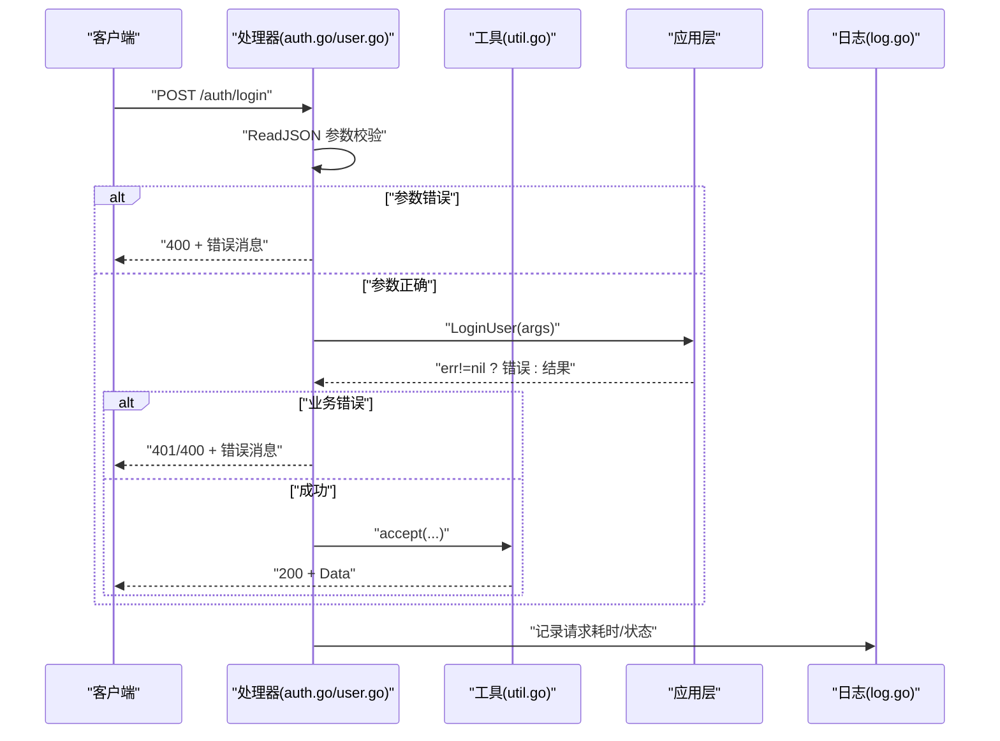
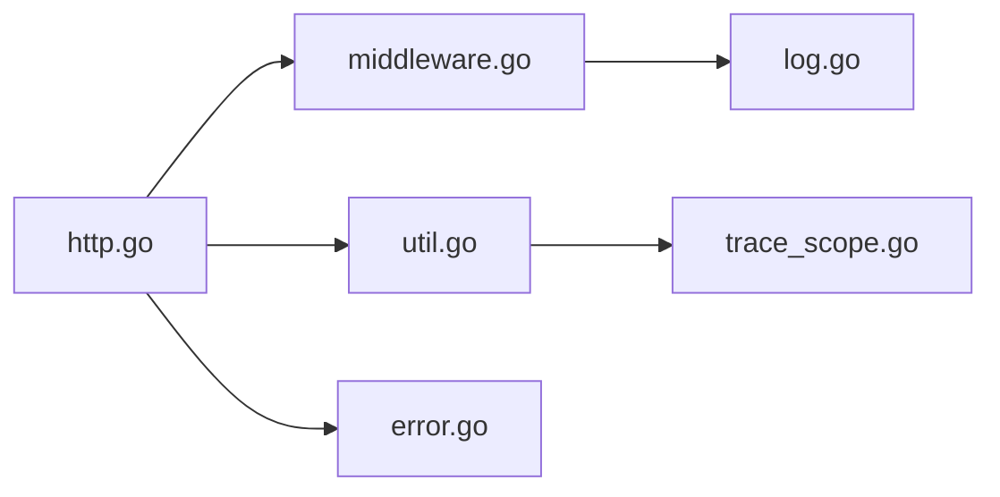

# 错误处理

<cite>
**本文引用的文件**
- [error.go](file://backend/backend-v1/internal/application/error.go)
- [log.go](file://backend/backend-v1/internal/log/log.go)
- [http.go](file://backend/backend-v1/internal/api/http/http.go)
- [middleware.go](file://backend/backend-v1/internal/api/http/middleware.go)
- [util.go](file://backend/backend-v1/internal/api/http/util.go)
- [auth.go](file://backend/backend-v1/internal/api/http/auth.go)
- [user.go](file://backend/backend-v1/internal/api/http/user.go)
- [trace_scope.go](file://backend/backend-v1/internal/util/trace_scope.go)
</cite>

## 目录
1. [简介](#简介)
2. [项目结构](#项目结构)
3. [核心组件](#核心组件)
4. [架构总览](#架构总览)
5. [详细组件分析](#详细组件分析)
6. [依赖分析](#依赖分析)
7. [性能考虑](#性能考虑)
8. [故障排查指南](#故障排查指南)
9. [结论](#结论)
10. [附录](#附录)

## 简介
本指南面向 Poprako 后端服务，系统性阐述错误处理机制与最佳实践，覆盖业务错误、系统错误、网络错误的分类与处理策略；解释错误在 HTTP 层、应用层、领域层之间的传播与包装方式；给出统一的错误响应格式、日志记录标准与关键字段采集方法；并提供优雅降级、重试与熔断的实现建议，以及错误监控与告警配置思路与统计分析工具使用方法。

## 项目结构
后端采用分层架构：HTTP 层负责路由与中间件；应用层编排业务流程；领域层承载模型与规则；基础设施层对接外部系统；日志模块提供统一日志初始化与输出策略。

图示来源
- [http.go:16-151](file://backend/backend-v1/internal/api/http/http.go#L16-L151)
- [middleware.go:15-79](file://backend/backend-v1/internal/api/http/middleware.go#L15-L79)
- [util.go:11-59](file://backend/backend-v1/internal/api/http/util.go#L11-L59)
- [error.go:3-7](file://backend/backend-v1/internal/application/error.go#L3-L7)
- [log.go:13-83](file://backend/backend-v1/internal/log/log.go#L13-L83)
- [trace_scope.go:7-31](file://backend/backend-v1/internal/util/trace_scope.go#L7-L31)

章节来源
- [http.go:16-151](file://backend/backend-v1/internal/api/http/http.go#L16-L151)
- [middleware.go:15-79](file://backend/backend-v1/internal/api/http/middleware.go#L15-L79)
- [util.go:11-59](file://backend/backend-v1/internal/api/http/util.go#L11-L59)
- [error.go:3-7](file://backend/backend-v1/internal/application/error.go#L3-L7)
- [log.go:13-83](file://backend/backend-v1/internal/log/log.go#L13-L83)
- [trace_scope.go:7-31](file://backend/backend-v1/internal/util/trace_scope.go#L7-L31)

## 核心组件
- 错误码常量：集中定义内部错误码，便于统一识别与统计。
- HTTP 中间件：统一日志记录、请求追踪、异常恢复与鉴权。
- 统一响应工具：封装错误与成功响应，确保接口一致性。
- 日志模块：按环境差异化输出，支持开发与生产场景。
- 追踪作用域：在请求生命周期内注入 request_id 等上下文字段，便于跨层关联。

章节来源
- [error.go:3-7](file://backend/backend-v1/internal/application/error.go#L3-L7)
- [middleware.go:15-79](file://backend/backend-v1/internal/api/http/middleware.go#L15-L79)
- [util.go:11-59](file://backend/backend-v1/internal/api/http/util.go#L11-L59)
- [log.go:13-83](file://backend/backend-v1/internal/log/log.go#L13-L83)
- [trace_scope.go:7-31](file://backend/backend-v1/internal/util/trace_scope.go#L7-L31)

## 架构总览
下图展示一次典型请求从进入 HTTP 层到返回响应的错误处理路径，包括中间件拦截、鉴权失败、业务错误与系统错误的处理策略。

图示来源
- [http.go:16-151](file://backend/backend-v1/internal/api/http/http.go#L16-L151)
- [middleware.go:15-79](file://backend/backend-v1/internal/api/http/middleware.go#L15-L79)
- [util.go:11-59](file://backend/backend-v1/internal/api/http/util.go#L11-L59)
- [log.go:13-83](file://backend/backend-v1/internal/log/log.go#L13-L83)

## 详细组件分析

### 错误码与错误类型
- 内部错误码：集中定义内部错误标识，用于系统错误或内部逻辑异常。
- 业务错误：由应用层/领域层抛出，HTTP 层以统一 200 响应返回，通过自定义 Code 字段表达业务错误类型。
- 系统错误：底层异常或不可预期错误，HTTP 层以 5xx 或统一内部错误码返回。

建议
- 将业务错误细分为“参数错误”“权限不足”“资源不存在”“业务规则冲突”等子类，便于前端与监控侧区分。
- 对外统一返回结构，避免泄露敏感信息。

章节来源
- [error.go:3-7](file://backend/backend-v1/internal/application/error.go#L3-L7)
- [util.go:11-39](file://backend/backend-v1/internal/api/http/util.go#L11-L39)

### HTTP 中间件与统一响应
- 日志中间件：记录请求方法、路径、状态码、远端地址、请求耗时、request_id 等关键信息。
- 鉴权中间件：解析 Authorization 头，校验 JWT 并注入用户上下文；失败时直接拒绝。
- 统一响应工具：reject 接口返回错误；accept 接口返回成功数据，HTTP 状态统一为 200，业务状态通过 Code 字段表达。

图示来源
- [middleware.go:15-45](file://backend/backend-v1/internal/api/http/middleware.go#L15-L45)
- [util.go:11-39](file://backend/backend-v1/internal/api/http/util.go#L11-L39)

章节来源
- [middleware.go:15-79](file://backend/backend-v1/internal/api/http/middleware.go#L15-L79)
- [util.go:11-59](file://backend/backend-v1/internal/api/http/util.go#L11-L59)

### 追踪与日志
- 追踪作用域：基于 request_id 构造 TraceScope，贯穿请求全链路，便于跨层关联。
- 日志初始化：开发环境输出到控制台，支持彩色与堆栈；生产环境输出 JSON 到控制台与文件，开启日志轮转与级别过滤。

图示来源
- [trace_scope.go:7-31](file://backend/backend-v1/internal/util/trace_scope.go#L7-L31)
- [log.go:13-83](file://backend/backend-v1/internal/log/log.go#L13-L83)

章节来源
- [trace_scope.go:7-31](file://backend/backend-v1/internal/util/trace_scope.go#L7-L31)
- [log.go:13-83](file://backend/backend-v1/internal/log/log.go#L13-L83)

### 典型 API 的错误处理
- 登录/注册：参数解析失败返回 400；业务失败返回 401/400；成功返回 200 + Data。
- 用户管理：参数缺失/格式错误返回 400；鉴权失败返回 401；权限不足返回 403；内部错误返回 500 或统一内部错误码。

图示来源
- [auth.go:22-40](file://backend/backend-v1/internal/api/http/auth.go#L22-L40)
- [user.go:24-51](file://backend/backend-v1/internal/api/http/user.go#L24-L51)
- [util.go:11-39](file://backend/backend-v1/internal/api/http/util.go#L11-L39)
- [log.go:13-83](file://backend/backend-v1/internal/log/log.go#L13-L83)

章节来源
- [auth.go:22-40](file://backend/backend-v1/internal/api/http/auth.go#L22-L40)
- [user.go:24-51](file://backend/backend-v1/internal/api/http/user.go#L24-L51)
- [util.go:11-39](file://backend/backend-v1/internal/api/http/util.go#L11-L39)

## 依赖分析
- HTTP 层依赖中间件与工具模块；中间件依赖日志模块；工具模块依赖追踪作用域；应用层依赖错误码常量。
- 关键耦合点：统一响应工具与错误码常量；日志初始化与环境配置；鉴权中间件与应用层服务。

图示来源
- [http.go:16-151](file://backend/backend-v1/internal/api/http/http.go#L16-L151)
- [middleware.go:15-79](file://backend/backend-v1/internal/api/http/middleware.go#L15-L79)
- [util.go:11-59](file://backend/backend-v1/internal/api/http/util.go#L11-L59)
- [error.go:3-7](file://backend/backend-v1/internal/application/error.go#L3-L7)
- [log.go:13-83](file://backend/backend-v1/internal/log/log.go#L13-L83)
- [trace_scope.go:7-31](file://backend/backend-v1/internal/util/trace_scope.go#L7-L31)

章节来源
- [http.go:16-151](file://backend/backend-v1/internal/api/http/http.go#L16-L151)
- [middleware.go:15-79](file://backend/backend-v1/internal/api/http/middleware.go#L15-L79)
- [util.go:11-59](file://backend/backend-v1/internal/api/http/util.go#L11-L59)
- [error.go:3-7](file://backend/backend-v1/internal/application/error.go#L3-L7)
- [log.go:13-83](file://backend/backend-v1/internal/log/log.go#L13-L83)
- [trace_scope.go:7-31](file://backend/backend-v1/internal/util/trace_scope.go#L7-L31)

## 性能考虑
- 中间件链路尽量轻量，避免在日志中输出大对象或高成本计算。
- 生产环境日志级别提升至 Warn，减少 Info/Debug 的 IO 压力。
- 统一响应的 JSON 序列化开销可控，避免重复构造结构体。
- 对于高频错误（如鉴权失败），可考虑短时限缓存统计，降低重复日志压力。

## 故障排查指南
- 定位请求：优先使用 request_id 关联日志与追踪作用域。
- 区分错误：检查 HTTP 状态与响应 Code 字段，快速判断是参数/权限/业务还是系统错误。
- 日志级别：开发环境关注 Debug，生产环境关注 Warn+，必要时临时提升。
- 常见问题
  - 缺少 Authorization 头或格式不正确：鉴权中间件直接返回 401。
  - 参数解析失败：ReadJSON 失败返回 400。
  - 业务失败：应用层返回错误，HTTP 层以 401/400/403/500 或内部错误码返回。
  - 系统异常：panic 恢复中间件兜底，同时记录堆栈信息。

章节来源
- [middleware.go:47-79](file://backend/backend-v1/internal/api/http/middleware.go#L47-L79)
- [util.go:11-39](file://backend/backend-v1/internal/api/http/util.go#L11-L39)
- [log.go:13-83](file://backend/backend-v1/internal/log/log.go#L13-L83)

## 结论
Poprako 的错误处理遵循“中间件统一拦截、应用层错误显式返回、HTTP 层统一响应”的设计。通过 request_id 串联请求链路，结合 Zap 的差异化输出策略，能够有效支撑开发调试与生产监控。建议后续补充更细粒度的业务错误码、完善的重试与熔断策略，以及可观测性平台的接入方案，进一步提升系统的稳定性与可维护性。

## 附录

### 错误传播与包装最佳实践
- 在应用层捕获底层错误，包装为带上下文的业务错误，保留原始错误以便定位。
- 对外统一返回结构，HTTP 状态码用于语义，业务 Code 用于语义化错误类型。
- 对系统错误使用统一内部错误码，便于集中统计与告警。

### 错误日志记录标准
- 必填字段：时间戳、级别、模块、请求 ID、方法、路径、状态码、耗时、远端地址。
- 可选字段：错误码、错误消息、堆栈（仅在错误级别）。
- 环境差异：开发环境彩色输出与堆栈，生产环境 JSON 输出与日志轮转。

章节来源
- [middleware.go:15-45](file://backend/backend-v1/internal/api/http/middleware.go#L15-L45)
- [log.go:13-83](file://backend/backend-v1/internal/log/log.go#L13-L83)

### 优雅降级与错误恢复
- 重试策略：对瞬时网络错误与幂等操作进行有限次数重试，指数退避。
- 熔断机制：对下游不稳定接口开启熔断，超阈值失败率触发熔断，定时探测恢复。
- 降级开关：在网关或服务入口根据指标动态切换降级策略（如只读、缓存、兜底数据）。
- 建议：以上策略需与追踪作用域结合，确保降级路径可审计、可回滚。

### 错误监控与告警
- 指标：错误总数、错误分布（按 Code/路径/用户/上游）、P95/P99 响应时延、熔断触发次数。
- 告警：错误突增、熔断持续、关键路径超时、系统错误占比异常。
- 工具：Prometheus + Grafana + Alertmanager；或云原生日志/指标平台。

### 错误统计与分析
- 使用 request_id 做跨层关联，结合日志与追踪系统做根因分析。
- 对高频错误建立工单与回归清单，持续优化业务规则与边界条件。