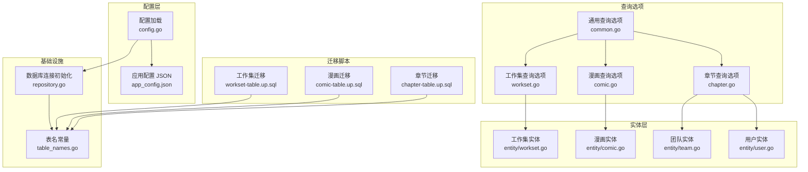
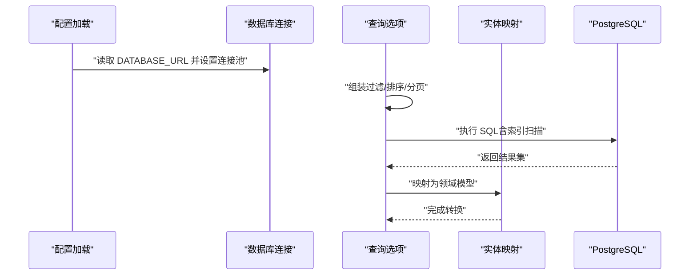
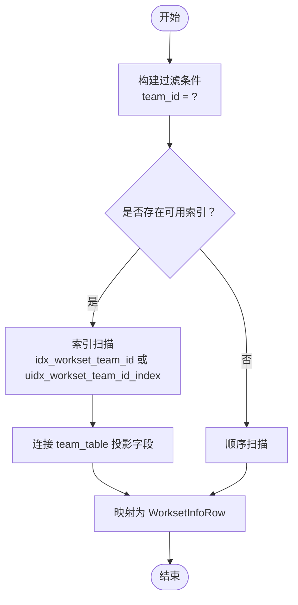
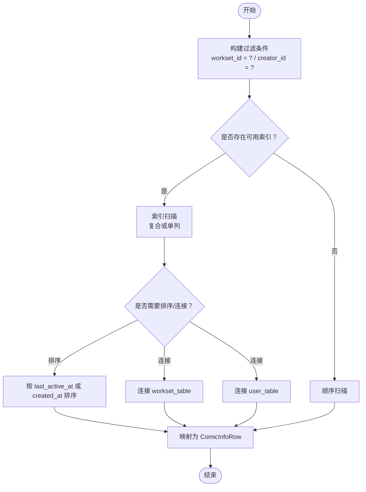
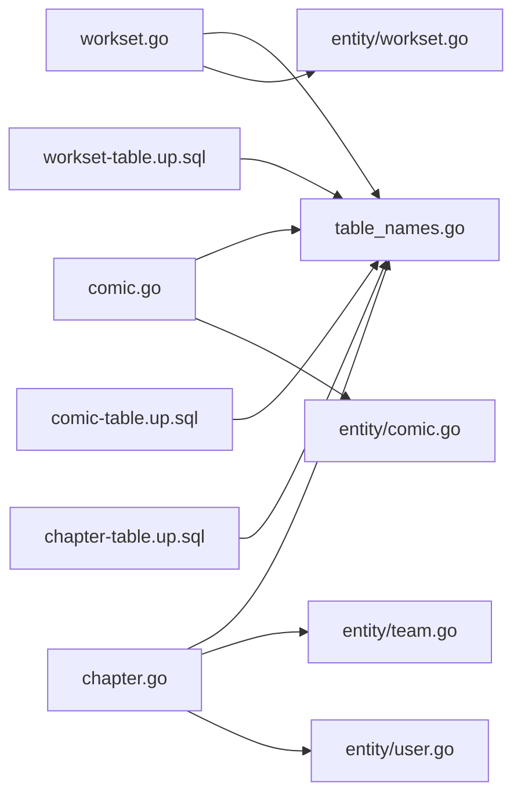

# 性能优化与索引策略

<cite>
**本文引用的文件**
- [backend-v1 内部配置 config.go](file://backend/backend-v1/internal/config/config.go)
- [后端应用配置 app_config.json](file://backend/backend-v1/app_config.json)
- [数据库连接初始化 repository.go](file://backend/backend-v1/internal/infrastructure/repository/repository.go)
- [表名常量定义 table_names.go](file://backend/backend-v1/internal/infrastructure/repository/table_names.go)
- [通用查询选项 common.go](file://backend/backend-v1/internal/infrastructure/repository/query_option/common.go)
- [工作集查询选项 workset.go](file://backend/backend-v1/internal/infrastructure/repository/query_option/workset.go)
- [漫画查询选项 comic.go](file://backend/backend-v1/internal/infrastructure/repository/query_option/comic.go)
- [章节查询选项 chapter.go](file://backend/backend-v1/internal/infrastructure/repository/query_option/chapter.go)
- [工作集实体定义 workset.go](file://backend/backend-v1/internal/infrastructure/registry/entity/workset.go)
- [漫画实体定义 comic.go](file://backend/backend-v1/internal/infrastructure/registry/entity/comic.go)
- [团队实体定义 team.go](file://backend/backend-v1/internal/infrastructure/registry/entity/team.go)
- [用户实体定义 user.go](file://backend/backend-v1/internal/infrastructure/registry/entity/user.go)
- [工作集表迁移 up.sql](file://backend/backend-v1/migrations/20260306101211_workset-table.up.sql)
- [漫画表迁移 up.sql](file://backend/backend-v1/migrations/20260306101212_comic-table.up.sql)
- [章节表迁移 up.sql](file://backend/backend-v1/migrations/20260306101213_chapter-table.up.sql)
</cite>

## 目录
1. [简介](#简介)
2. [项目结构](#项目结构)
3. [核心组件](#核心组件)
4. [架构总览](#架构总览)
5. [详细组件分析](#详细组件分析)
6. [依赖关系分析](#依赖关系分析)
7. [性能考量](#性能考量)
8. [故障排查指南](#故障排查指南)
9. [结论](#结论)
10. [附录](#附录)

## 简介
本文件面向 Poprako 后端数据库的性能优化与索引策略，结合现有代码库中的表结构、查询选项与连接配置，系统阐述以下主题：
- 数据库查询优化技术与索引设计原则
- 不同类型查询的索引策略与性能考量
- 查询计划分析与执行效率评估方法
- 复合索引的设计与使用场景
- 索引维护与重建策略
- 统计信息收集与更新机制
- 慢查询识别与优化方案
- 数据库参数调优与资源配置建议
- 分区表与分片策略的应用场景

## 项目结构
后端采用 GORM + PostgreSQL 的数据访问层，通过迁移脚本定义表结构与索引，并在运行时通过配置注入连接池参数。查询选项包提供统一的过滤、排序与聚合拼接能力，实体层负责 ORM 映射。

图表来源
- [backend-v1 内部配置 config.go:1-101](file://backend/backend-v1/internal/config/config.go#L1-L101)
- [后端应用配置 app_config.json:1-11](file://backend/backend-v1/app_config.json#L1-L11)
- [数据库连接初始化 repository.go:1-30](file://backend/backend-v1/internal/infrastructure/repository/repository.go#L1-L30)
- [表名常量定义 table_names.go:1-18](file://backend/backend-v1/internal/infrastructure/registry/table_names.go#L1-L18)
- [通用查询选项 common.go:1-51](file://backend/backend-v1/internal/infrastructure/registry/query_option/common.go#L1-L51)
- [工作集查询选项 workset.go:1-38](file://backend/backend-v1/internal/infrastructure/registry/query_option/workset.go#L1-L38)
- [漫画查询选项 comic.go:1-91](file://backend/backend-v1/internal/infrastructure/registry/query_option/comic.go#L1-L91)
- [章节查询选项 chapter.go:1-41](file://backend/backend-v1/internal/infrastructure/registry/query_option/chapter.go#L1-L41)
- [工作集实体定义 workset.go:1-73](file://backend/backend-v1/internal/infrastructure/registry/entity/workset.go#L1-L73)
- [漫画实体定义 comic.go:1-112](file://backend/backend-v1/internal/infrastructure/registry/entity/comic.go#L1-L112)
- [团队实体定义 team.go:1-47](file://backend/backend-v1/internal/infrastructure/registry/entity/team.go#L1-L47)
- [用户实体定义 user.go:1-58](file://backend/backend-v1/internal/infrastructure/registry/entity/user.go#L1-L58)
- [工作集表迁移 up.sql:1-19](file://backend/backend-v1/migrations/20260306101211_workset-table.up.sql#L1-L19)
- [漫画表迁移 up.sql:1-37](file://backend/backend-v1/migrations/20260306101212_comic-table.up.sql#L1-L37)
- [章节表迁移 up.sql:1-38](file://backend/backend-v1/migrations/20260306101213_chapter-table.up.sql#L1-L38)

章节来源
- [backend-v1 内部配置 config.go:1-101](file://backend/backend-v1/internal/config/config.go#L1-L101)
- [后端应用配置 app_config.json:1-11](file://backend/backend-v1/app_config.json#L1-L11)
- [数据库连接初始化 repository.go:1-30](file://backend/backend-v1/internal/infrastructure/repository/repository.go#L1-L30)
- [表名常量定义 table_names.go:1-18](file://backend/backend-v1/internal/infrastructure/registry/table_names.go#L1-L18)

## 核心组件
- 配置与连接
  - 应用配置通过 JSON 文件加载，包含数据库连接池参数（最小空闲连接数、最大打开连接数）。
  - 运行时通过环境变量注入数据库 URL，GORM 初始化连接并设置连接池上限与下限。
- 查询选项
  - 提供统一的过滤、排序、分页与 JOIN 聚合选项，确保查询条件与 SQL 片段可组合、可复用且避免裸字段。
- 实体映射
  - 每个领域模型对应 ORM 实体，包含查询结果映射结构与插入结构，便于按需投影字段。
- 迁移脚本
  - 定义表结构与索引，包括单列索引、唯一索引与条件索引（WHERE 条件），覆盖主要查询路径。

章节来源
- [backend-v1 内部配置 config.go:85-100](file://backend/backend-v1/internal/config/config.go#L85-L100)
- [后端应用配置 app_config.json:6-9](file://backend/backend-v1/app_config.json#L6-L9)
- [数据库连接初始化 repository.go:11-29](file://backend/backend-v1/internal/infrastructure/repository/repository.go#L11-L29)
- [通用查询选项 common.go:9-51](file://backend/backend-v1/internal/infrastructure/registry/query_option/common.go#L9-L51)
- [工作集查询选项 workset.go:13-37](file://backend/backend-v1/internal/infrastructure/registry/query_option/workset.go#L13-L37)
- [漫画查询选项 comic.go:13-90](file://backend/backend-v1/internal/infrastructure/registry/query_option/comic.go#L13-L90)
- [章节查询选项 chapter.go:11-40](file://backend/backend-v1/internal/infrastructure/registry/query_option/chapter.go#L11-L40)
- [工作集实体定义 workset.go:11-73](file://backend/backend-v1/internal/infrastructure/registry/entity/workset.go#L11-L73)
- [漫画实体定义 comic.go:11-112](file://backend/backend-v1/internal/infrastructure/registry/entity/comic.go#L11-L112)
- [团队实体定义 team.go:11-47](file://backend/backend-v1/internal/infrastructure/registry/entity/team.go#L11-L47)
- [用户实体定义 user.go:11-58](file://backend/backend-v1/internal/infrastructure/registry/entity/user.go#L11-L58)
- [工作集表迁移 up.sql:15-19](file://backend/backend-v1/migrations/20260306101211_workset-table.up.sql#L15-L19)
- [漫画表迁移 up.sql:22-36](file://backend/backend-v1/migrations/20260306101212_comic-table.up.sql#L22-L36)
- [章节表迁移 up.sql:31-37](file://backend/backend-v1/migrations/20260306101213_chapter-table.up.sql#L31-L37)

## 架构总览
下图展示从配置到查询执行的关键路径，以及索引在查询计划中的作用。

图表来源
- [backend-v1 内部配置 config.go:91-100](file://backend/backend-v1/internal/config/config.go#L91-L100)
- [数据库连接初始化 repository.go:11-29](file://backend/backend-v1/internal/infrastructure/repository/repository.go#L11-L29)
- [通用查询选项 common.go:15-50](file://backend/backend-v1/internal/infrastructure/registry/query_option/common.go#L15-L50)
- [漫画查询选项 comic.go:35-90](file://backend/backend-v1/internal/infrastructure/registry/query_option/comic.go#L35-L90)
- [章节查询选项 chapter.go:26-40](file://backend/backend-v1/internal/infrastructure/registry/query_option/chapter.go#L26-L40)

## 详细组件分析

### 工作集模块（Workset）
- 查询路径
  - 按团队精确过滤：FilterByTeamID → 使用索引 idx_workset_team_id
  - 按索引升序排序：OrderByIndexAsc → 与复合索引 uidx_workset_team_id_index 协同
  - 聚合团队信息：IncludeTeamInfo → JOIN 团队表并投影必要字段
- 索引策略
  - 单列索引 idx_workset_team_id 支持按团队过滤
  - 唯一索引 uidx_workset_team_id_index 支持“团队+索引”的去重与高效定位
- 实体映射
  - WorksetInfoRow 用于完整信息列表/详情映射；WorksetInsertRow 仅包含写入所需字段

图表来源
- [工作集查询选项 workset.go:13-37](file://backend/backend-v1/internal/infrastructure/registry/query_option/workset.go#L13-L37)
- [工作集表迁移 up.sql:15-19](file://backend/backend-v1/migrations/20260306101211_workset-table.up.sql#L15-L19)
- [工作集实体定义 workset.go:11-73](file://backend/backend-v1/internal/infrastructure/registry/entity/workset.go#L11-L73)

章节来源
- [工作集查询选项 workset.go:13-37](file://backend/backend-v1/internal/infrastructure/registry/query_option/workset.go#L13-L37)
- [工作集表迁移 up.sql:15-19](file://backend/backend-v1/migrations/20260306101211_workset-table.up.sql#L15-L19)
- [工作集实体定义 workset.go:11-73](file://backend/backend-v1/internal/infrastructure/registry/entity/workset.go#L11-L73)

### 漫画模块（Comic）
- 查询路径
  - 按创建者过滤：FilterByCreatorID → 使用索引 idx_comic_creator_id
  - 按工作集过滤：FilterByWorksetID → 使用索引 idx_comic_workset_id_created_at_desc
  - 最后活跃时间降序：OrderByLastActiveAtDesc → 与索引协同
  - 聚合工作集与创建者信息：IncludeWorksetInfo、IncludeCreatorInfo、IncludeWorksetAndCreatorInfo
- 索引策略
  - 唯一索引 uidx_comic_workset_id_index（带 deleted_at IS NULL）支持“工作集+索引”去重
  - 复合索引 idx_comic_workset_id_created_at_desc 支持“工作集+创建时间降序”查询
  - 单列索引 idx_comic_creator_id 支持按创建者过滤
  - 复合索引 idx_comic_last_active_at_desc 支持活跃度排序
- 实体映射
  - ComicInfoRow 支持多表投影；ComicInsertRow 仅写入必要字段

图表来源
- [漫画查询选项 comic.go:13-90](file://backend/backend-v1/internal/infrastructure/registry/query_option/comic.go#L13-L90)
- [漫画表迁移 up.sql:22-36](file://backend/backend-v1/migrations/20260306101212_comic-table.up.sql#L22-L36)
- [漫画实体定义 comic.go:11-112](file://backend/backend-v1/internal/infrastructure/registry/entity/comic.go#L11-L112)

章节来源
- [漫画查询选项 comic.go:13-90](file://backend/backend-v1/internal/infrastructure/registry/query_option/comic.go#L13-L90)
- [漫画表迁移 up.sql:22-36](file://backend/backend-v1/migrations/20260306101212_comic-table.up.sql#L22-L36)
- [漫画实体定义 comic.go:11-112](file://backend/backend-v1/internal/infrastructure/registry/entity/comic.go#L11-L112)

### 章节模块（Chapter）
- 查询路径
  - 按漫画过滤：FilterByComicID → 使用索引 idx_chapter_comic_id
  - 按索引降序：OrderByIndexDesc → 与复合索引 uidx_chapter_comic_id_index 协同
  - 聚合创建者信息：IncludeCreatorInfo → JOIN 用户表并投影字段
- 索引策略
  - 唯一索引 uidx_chapter_comic_id_index（带 deleted_at IS NULL）支持“漫画+索引”去重
  - 单列索引 idx_chapter_comic_id 支持按漫画过滤
- 实体映射
  - ChapterInfoRow 支持投影；ChapterInsertRow 仅写入必要字段

图表来源
- [章节查询选项 chapter.go:11-40](file://backend/backend-v1/internal/infrastructure/registry/query_option/chapter.go#L11-L40)
- [章节表迁移 up.sql:31-37](file://backend/backend-v1/migrations/20260306101213_chapter-table.up.sql#L31-L37)
- [团队实体定义 team.go:11-47](file://backend/backend-v1/internal/infrastructure/registry/entity/team.go#L11-L47)
- [用户实体定义 user.go:11-58](file://backend/backend-v1/internal/infrastructure/registry/entity/user.go#L11-L58)

章节来源
- [章节查询选项 chapter.go:11-40](file://backend/backend-v1/internal/infrastructure/registry/query_option/chapter.go#L11-L40)
- [章节表迁移 up.sql:31-37](file://backend/backend-v1/migrations/20260306101213_chapter-table.up.sql#L31-L37)
- [团队实体定义 team.go:11-47](file://backend/backend-v1/internal/infrastructure/registry/entity/team.go#L11-L47)
- [用户实体定义 user.go:11-58](file://backend/backend-v1/internal/infrastructure/registry/entity/user.go#L11-L58)

### 通用查询选项与连接池
- 通用查询选项
  - FilterByID/FilterByIDs：统一 ID 过滤，避免裸字段
  - CreatedAt/UpdatedAt 排序：支持升序/降序
  - Paginate：偏移/限制分页
- 连接池配置
  - 通过 app_config.json 设置最小空闲连接与最大打开连接
  - 运行时由 repository.go 注入到 sql.DB

章节来源
- [通用查询选项 common.go:15-50](file://backend/backend-v1/internal/infrastructure/registry/query_option/common.go#L15-L50)
- [后端应用配置 app_config.json:6-9](file://backend/backend-v1/app_config.json#L6-L9)
- [数据库连接初始化 repository.go:25-26](file://backend/backend-v1/internal/infrastructure/repository/repository.go#L25-L26)

## 依赖关系分析
- 查询选项对表名的依赖通过 table_names.go 统一管理，避免硬编码表名
- 查询选项对实体的依赖体现在 Select 投影与 JOIN 关系
- 迁移脚本定义了索引，直接影响查询计划与执行效率

图表来源
- [工作集查询选项 workset.go:1-38](file://backend/backend-v1/internal/infrastructure/registry/query_option/workset.go#L1-L38)
- [漫画查询选项 comic.go:1-91](file://backend/backend-v1/internal/infrastructure/registry/query_option/comic.go#L1-L91)
- [章节查询选项 chapter.go:1-41](file://backend/backend-v1/internal/infrastructure/registry/query_option/chapter.go#L1-L41)
- [表名常量定义 table_names.go:1-18](file://backend/backend-v1/internal/infrastructure/registry/table_names.go#L1-L18)
- [工作集实体定义 workset.go:1-73](file://backend/backend-v1/internal/infrastructure/registry/entity/workset.go#L1-L73)
- [漫画实体定义 comic.go:1-112](file://backend/backend-v1/internal/infrastructure/registry/entity/comic.go#L1-L112)
- [团队实体定义 team.go:1-47](file://backend/backend-v1/internal/infrastructure/registry/entity/team.go#L1-L47)
- [用户实体定义 user.go:1-58](file://backend/backend-v1/internal/infrastructure/registry/entity/user.go#L1-L58)
- [工作集表迁移 up.sql:1-19](file://backend/backend-v1/migrations/20260306101211_workset-table.up.sql#L1-L19)
- [漫画表迁移 up.sql:1-37](file://backend/backend-v1/migrations/20260306101212_comic-table.up.sql#L1-L37)
- [章节表迁移 up.sql:1-38](file://backend/backend-v1/migrations/20260306101213_chapter-table.up.sql#L1-L38)

章节来源
- [表名常量定义 table_names.go:1-18](file://backend/backend-v1/internal/infrastructure/registry/table_names.go#L1-L18)
- [工作集查询选项 workset.go:1-38](file://backend/backend-v1/internal/infrastructure/registry/query_option/workset.go#L1-L38)
- [漫画查询选项 comic.go:1-91](file://backend/backend-v1/internal/infrastructure/registry/query_option/comic.go#L1-L91)
- [章节查询选项 chapter.go:1-41](file://backend/backend-v1/internal/infrastructure/registry/query_option/chapter.go#L1-L41)

## 性能考量

### 查询优化技术与索引设计原则
- 最左前缀原则：复合索引中，查询条件应尽量从最左侧列开始，以命中索引
- 覆盖索引：当查询所需字段均在索引中时，可避免回表，显著提升性能
- 索引选择性：高选择性的列更适合建立索引；低选择性列（如布尔值）需谨慎
- 索引维护成本：索引越多，写入代价越高；需平衡读写比例
- 统计信息：PostgreSQL 需要准确的统计信息以生成合理执行计划

### 不同类型查询的索引策略与性能考量
- 等值过滤（FilterByID/FilterByTeamID/FilterByWorksetID/FilterByComicID）
  - 建议使用单列索引或唯一索引，保证等值查找 O(log N)
- 范围过滤（OrderByLastActiveAtDesc/OrderByIndexDesc）
  - 建议使用复合索引，将过滤列放在前，排序列放在后，必要时使用表达式或函数索引
- 聚合查询（IncludeTeamInfo/IncludeWorksetInfo/IncludeCreatorInfo）
  - 建议在 JOIN 关键字上建立索引，减少连接成本；同时考虑投影字段是否可被索引覆盖
- 分页查询（Paginate）
  - 对于大偏移量，建议使用基于游标（cursor-based pagination）替代 OFFSET/LIMIT，降低扫描成本

### 查询计划分析与执行效率评估方法
- 使用 EXPLAIN/EXPLAIN ANALYZE 分析 SQL 执行计划，关注：
  - 是否发生全表扫描（Seq Scan）
  - 是否发生 Hash Join/Nest Loop
  - 是否发生排序（Sort）与临时文件写入
  - 估算行数与实际行数差异
- 结合业务热点查询，定期审查索引使用情况与失效风险

### 复合索引的设计与使用场景
- 工作集：(team_id, index) 唯一索引，满足“团队+索引”去重与快速定位
- 漫画：(workset_id, created_at DESC) 复合索引，满足“工作集内按创建时间倒序”
- 漫画：(workset_id, last_active_at DESC) 复合索引，满足“活跃度排序”
- 章节：(comic_id, index DESC) 唯一索引，满足“漫画+章节顺序”去重
- 漫画：(workset_id, index) 唯一索引（带 deleted_at IS NULL），避免软删除干扰

章节来源
- [工作集表迁移 up.sql:15-19](file://backend/backend-v1/migrations/20260306101211_workset-table.up.sql#L15-L19)
- [漫画表迁移 up.sql:22-36](file://backend/backend-v1/migrations/20260306101212_comic-table.up.sql#L22-L36)
- [章节表迁移 up.sql:31-37](file://backend/backend-v1/migrations/20260306101213_chapter-table.up.sql#L31-L37)

### 索引维护与重建策略
- 定期重建索引以消除碎片，保持 B-Tree 索引高度与选择性
- 对高并发写入场景，建议在业务低峰期进行索引重建
- 监控索引使用率，清理长期不使用的索引

### 统计信息收集与更新机制
- PostgreSQL 通过 ANALYZE 维护表与索引统计信息，影响查询优化器决策
- 建议在批量导入/归档后执行 ANALYZE，或启用自动统计更新策略

### 慢查询识别与优化方案
- 识别手段：结合日志与监控工具，定位执行时间长、锁等待、I/O 高的查询
- 优化方案：
  - 为热点查询添加合适索引
  - 将频繁 JOIN 的表按连接键建立索引
  - 减少 SELECT *，使用覆盖索引
  - 对大结果集分页采用游标分页
  - 避免在 WHERE 子句中对索引列使用函数或表达式

### 数据库参数调优与资源配置建议
- 连接池参数
  - min_idle_connections：维持一定空闲连接，降低连接开销
  - max_open_connections：根据并发峰值与数据库承载能力设定
- PostgreSQL 参数（建议项）
  - shared_buffers：物理内存的 25%
  - effective_cache_size：物理内存的 50%~60%
  - work_mem：根据复杂查询与并行度调整
  - maintenance_work_mem：索引重建与 VACUUM 期间使用
  - checkpoint_completion_target：延长检查点周期，降低写放大
  - autovacuum：开启并合理配置阈值与频率

章节来源
- [后端应用配置 app_config.json:6-9](file://backend/backend-v1/app_config.json#L6-L9)
- [数据库连接初始化 repository.go:25-26](file://backend/backend-v1/internal/infrastructure/repository/repository.go#L25-L26)

### 分区表与分片策略的应用场景
- 分区表（按时间/业务维度）
  - 适用于超大表的历史数据归档与冷热分离，例如漫画/章节的按月分区
  - 优点：简化归档、提升查询局部性、降低维护成本
  - 注意：分区键选择需与常见查询过滤一致
- 分片（Sharding）
  - 适用于水平扩展，按团队/用户 ID 哈希分片
  - 注意：跨分片 JOIN 与事务一致性成本较高，需谨慎设计

## 故障排查指南
- 连接池耗尽
  - 现象：请求堆积、超时
  - 排查：检查 max_open_connections 与业务并发；确认连接泄漏
- 索引未命中
  - 现象：全表扫描频繁
  - 排查：使用 EXPLAIN 检查执行计划；确认 WHERE 条件与索引列顺序
- 统计信息过旧
  - 现象：执行计划异常、性能波动
  - 排查：执行 ANALYZE；检查批量写入后的统计更新
- 聚合查询性能差
  - 现象：JOIN 与排序开销大
  - 排查：为 JOIN 键建立索引；考虑物化视图或缓存热点数据

章节来源
- [通用查询选项 common.go:45-50](file://backend/backend-v1/internal/infrastructure/registry/query_option/common.go#L45-L50)
- [漫画查询选项 comic.go:35-90](file://backend/backend-v1/internal/infrastructure/registry/query_option/comic.go#L35-L90)
- [章节查询选项 chapter.go:26-40](file://backend/backend-v1/internal/infrastructure/registry/query_option/chapter.go#L26-L40)

## 结论
通过对现有迁移脚本与查询选项的分析，Poprako 的数据库层已具备较为完善的索引基础。建议在生产环境中：
- 持续监控执行计划与索引使用情况
- 在业务低峰期进行索引重建与统计更新
- 针对热点查询补充覆盖索引与游标分页
- 结合业务增长趋势评估分区与分片策略

## 附录
- 关键索引清单
  - 工作集：idx_workset_team_id、uidx_workset_team_id_index
  - 漫画：uidx_comic_workset_id_index、idx_comic_workset_id_created_at_desc、idx_comic_creator_id、idx_comic_last_active_at_desc
  - 章节：uidx_chapter_comic_id_index、idx_chapter_comic_id

章节来源
- [工作集表迁移 up.sql:15-19](file://backend/backend-v1/migrations/20260306101211_workset-table.up.sql#L15-L19)
- [漫画表迁移 up.sql:22-36](file://backend/backend-v1/migrations/20260306101212_comic-table.up.sql#L22-L36)
- [章节表迁移 up.sql:31-37](file://backend/backend-v1/migrations/20260306101213_chapter-table.up.sql#L31-L37)