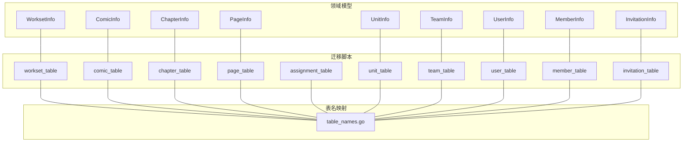
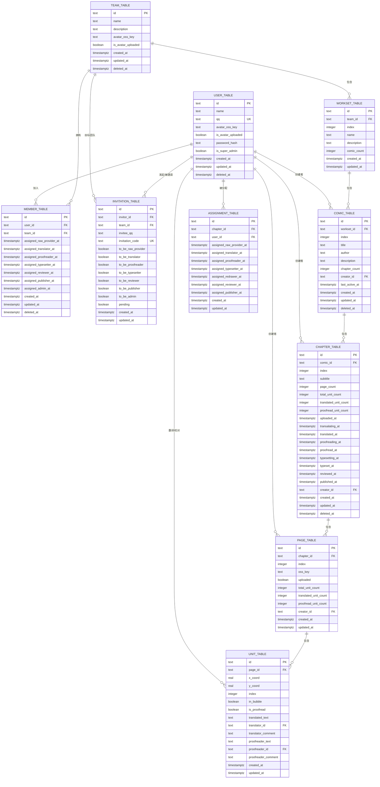
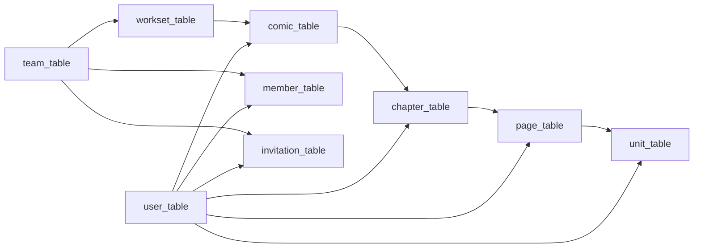

# 数据库架构

<cite>
**本文引用的文件**
- [20260306101211_workset-table.up.sql](file://backend/backend-v1/migrations/20260306101211_workset-table.up.sql)
- [20260306101212_comic-table.up.sql](file://backend/backend-v1/migrations/20260306101212_comic-table.up.sql)
- [20260306101213_chapter-table.up.sql](file://backend/backend-v1/migrations/20260306101213_chapter-table.up.sql)
- [20260306101214_page-table.up.sql](file://backend/backend-v1/migrations/20260306101214_page-table.up.sql)
- [20260306101215_assignment-table.up.sql](file://backend/backend-v1/migrations/20260306101215_assignment-table.up.sql)
- [20260306101216_unit-table.up.sql](file://backend/backend-v1/migrations/20260306101216_unit-table.up.sql)
- [20260301065012_team-table.up.sql](file://backend/backend-v1/migrations/20260301065012_team-table.up.sql)
- [20260301065022_user-table.up.sql](file://backend/backend-v1/migrations/20260301065022_user-table.up.sql)
- [20260301075641_member-table.up.sql](file://backend/backend-v1/migrations/20260301075641_member-table.up.sql)
- [20260301075642_invitation-table.up.sql](file://backend/backend-v1/migrations/20260301075642_invitation-table.up.sql)
- [table_names.go](file://backend/backend-v1/internal/infrastructure/repository/table_names.go)
- [workset.go](file://backend/backend-v1/internal/domain/model/workset.go)
- [comic.go](file://backend/backend-v1/internal/domain/model/comic.go)
- [chapter.go](file://backend/backend-v1/internal/domain/model/chapter.go)
- [page.go](file://backend/backend-v1/internal/domain/model/page.go)
- [unit.go](file://backend/backend-v1/internal/domain/model/unit.go)
- [team.go](file://backend/backend-v1/internal/domain/model/team.go)
- [user.go](file://backend/backend-v1/internal/domain/model/user.go)
- [member.go](file://backend/backend-v1/internal/domain/model/member.go)
- [invitation.go](file://backend/backend-v1/internal/domain/model/invitation.go)
</cite>

## 目录
1. [简介](#简介)
2. [项目结构](#项目结构)
3. [核心组件](#核心组件)
4. [架构总览](#架构总览)
5. [详细组件分析](#详细组件分析)
6. [依赖分析](#依赖分析)
7. [性能考虑](#性能考虑)
8. [故障排查指南](#故障排查指南)
9. [结论](#结论)
10. [附录](#附录)

## 简介
本文件面向 Poprako 项目的数据库层，基于 PostgreSQL 设计与实现，系统化梳理了整体数据库架构、表结构设计、实体关系映射、数据模型定义、索引策略与性能优化方案，并给出命名约定与表名映射规则。读者可据此理解从领域模型到数据库表的落地方式，以及各表之间的主外键关系与约束设计。

## 项目结构
数据库相关的核心内容分布在以下位置：
- 迁移脚本：位于 backend/backend-v1/migrations，按版本号顺序定义表结构与索引。
- 领域模型：位于 backend/backend-v1/internal/domain/model，定义业务实体与字段含义。
- 表名映射：位于 backend/backend-v1/internal/infrastructure/repository/table_names.go，统一管理数据库表名。

图表来源
- [20260306101211_workset-table.up.sql:1-19](file://backend/backend-v1/migrations/20260306101211_workset-table.up.sql#L1-L19)
- [20260306101212_comic-table.up.sql:1-37](file://backend/backend-v1/migrations/20260306101212_comic-table.up.sql#L1-L37)
- [20260306101213_chapter-table.up.sql:1-38](file://backend/backend-v1/migrations/20260306101213_chapter-table.up.sql#L1-L38)
- [20260306101214_page-table.up.sql:1-25](file://backend/backend-v1/migrations/20260306101214_page-table.up.sql#L1-L25)
- [20260306101215_assignment-table.up.sql:1-26](file://backend/backend-v1/migrations/20260306101215_assignment-table.up.sql#L1-L26)
- [20260306101216_unit-table.up.sql:1-30](file://backend/backend-v1/migrations/20260306101216_unit-table.up.sql#L1-L30)
- [20260301065012_team-table.up.sql:1-16](file://backend/backend-v1/migrations/20260301065012_team-table.up.sql#L1-L16)
- [20260301065022_user-table.up.sql:1-52](file://backend/backend-v1/migrations/20260301065022_user-table.up.sql#L1-L52)
- [20260301075641_member-table.up.sql:1-63](file://backend/backend-v1/migrations/20260301075641_member-table.up.sql#L1-L63)
- [20260301075642_invitation-table.up.sql:1-27](file://backend/backend-v1/migrations/20260301075642_invitation-table.up.sql#L1-L27)
- [table_names.go](file://backend/backend-v1/internal/infrastructure/repository/table_names.go)

章节来源
- [20260306101211_workset-table.up.sql:1-19](file://backend/backend-v1/migrations/20260306101211_workset-table.up.sql#L1-L19)
- [20260306101212_comic-table.up.sql:1-37](file://backend/backend-v1/migrations/20260306101212_comic-table.up.sql#L1-L37)
- [20260306101213_chapter-table.up.sql:1-38](file://backend/backend-v1/migrations/20260306101213_chapter-table.up.sql#L1-L38)
- [20260306101214_page-table.up.sql:1-25](file://backend/backend-v1/migrations/20260306101214_page-table.up.sql#L1-L25)
- [20260306101215_assignment-table.up.sql:1-26](file://backend/backend-v1/migrations/20260306101215_assignment-table.up.sql#L1-L26)
- [20260306101216_unit-table.up.sql:1-30](file://backend/backend-v1/migrations/20260306101216_unit-table.up.sql#L1-L30)
- [20260301065012_team-table.up.sql:1-16](file://backend/backend-v1/migrations/20260301065012_team-table.up.sql#L1-L16)
- [20260301065022_user-table.up.sql:1-52](file://backend/backend-v1/migrations/20260301065022_user-table.up.sql#L1-L52)
- [20260301075641_member-table.up.sql:1-63](file://backend/backend-v1/migrations/20260301075641_member-table.up.sql#L1-L63)
- [20260301075642_invitation-table.up.sql:1-27](file://backend/backend-v1/migrations/20260301075642_invitation-table.up.sql#L1-L27)
- [table_names.go](file://backend/backend-v1/internal/infrastructure/repository/table_names.go)

## 核心组件
本节概述数据库中的核心表及其职责边界：
- 团队与成员：team_table、member_table、invitation_table、user_table
- 工作集与漫画：workset_table、comic_table
- 章节与页面：chapter_table、page_table
- 单元与任务分配：unit_table、assignment_table

章节来源
- [20260301065012_team-table.up.sql:1-16](file://backend/backend-v1/migrations/20260301065012_team-table.up.sql#L1-L16)
- [20260301065022_user-table.up.sql:1-52](file://backend/backend-v1/migrations/20260301065022_user-table.up.sql#L1-L52)
- [20260301075641_member-table.up.sql:1-63](file://backend/backend-v1/migrations/20260301075641_member-table.up.sql#L1-L63)
- [20260301075642_invitation-table.up.sql:1-27](file://backend/backend-v1/migrations/20260301075642_invitation-table.up.sql#L1-L27)
- [20260306101211_workset-table.up.sql:1-19](file://backend/backend-v1/migrations/20260306101211_workset-table.up.sql#L1-L19)
- [20260306101212_comic-table.up.sql:1-37](file://backend/backend-v1/migrations/20260306101212_comic-table.up.sql#L1-L37)
- [20260306101213_chapter-table.up.sql:1-38](file://backend/backend-v1/migrations/20260306101213_chapter-table.up.sql#L1-L38)
- [20260306101214_page-table.up.sql:1-25](file://backend/backend-v1/migrations/20260306101214_page-table.up.sql#L1-L25)
- [20260306101215_assignment-table.up.sql:1-26](file://backend/backend-v1/migrations/20260306101215_assignment-table.up.sql#L1-L26)
- [20260306101216_unit-table.up.sql:1-30](file://backend/backend-v1/migrations/20260306101216_unit-table.up.sql#L1-L30)

## 架构总览
下图展示数据库层的整体架构与实体关系，涵盖团队、用户、成员、邀请、工作集、漫画、章节、页面、单元与任务分配等核心实体。

图表来源
- [20260301065012_team-table.up.sql:1-16](file://backend/backend-v1/migrations/20260301065012_team-table.up.sql#L1-L16)
- [20260301065022_user-table.up.sql:1-52](file://backend/backend-v1/migrations/20260301065022_user-table.up.sql#L1-L52)
- [20260301075641_member-table.up.sql:1-63](file://backend/backend-v1/migrations/20260301075641_member-table.up.sql#L1-L63)
- [20260301075642_invitation-table.up.sql:1-27](file://backend/backend-v1/migrations/20260301075642_invitation-table.up.sql#L1-L27)
- [20260306101211_workset-table.up.sql:1-19](file://backend/backend-v1/migrations/20260306101211_workset-table.up.sql#L1-L19)
- [20260306101212_comic-table.up.sql:1-37](file://backend/backend-v1/migrations/20260306101212_comic-table.up.sql#L1-L37)
- [20260306101213_chapter-table.up.sql:1-38](file://backend/backend-v1/migrations/20260306101213_chapter-table.up.sql#L1-L38)
- [20260306101214_page-table.up.sql:1-25](file://backend/backend-v1/migrations/20260306101214_page-table.up.sql#L1-L25)
- [20260306101215_assignment-table.up.sql:1-26](file://backend/backend-v1/migrations/20260306101215_assignment-table.up.sql#L1-L26)
- [20260306101216_unit-table.up.sql:1-30](file://backend/backend-v1/migrations/20260306101216_unit-table.up.sql#L1-L30)

## 详细组件分析

### 用户与身份（user_table）
- 主键：id
- 唯一性：qq
- 约束：密码哈希、是否超管、软删除字段 deleted_at
- 索引：名称模糊匹配索引、qq 索引、时间倒序索引
- 字段说明：名称、QQ、头像 OSS 键、是否已上传头像、密码哈希、是否超管、创建/更新时间、软删除时间

章节来源
- [20260301065022_user-table.up.sql:1-52](file://backend/backend-v1/migrations/20260301065022_user-table.up.sql#L1-L52)
- [user.go:7-19](file://backend/backend-v1/internal/domain/model/user.go#L7-L19)

### 团队（team_table）
- 主键：id
- 唯一性：name
- 约束：软删除字段 deleted_at
- 索引：名称唯一索引（配合软删除过滤）
- 字段说明：名称、描述、头像 OSS 键、是否已上传头像、创建/更新时间、软删除时间

章节来源
- [20260301065012_team-table.up.sql:1-16](file://backend/backend-v1/migrations/20260301065012_team-table.up.sql#L1-L16)
- [team.go:5-15](file://backend/backend-v1/internal/domain/model/team.go#L5-L15)

### 成员（member_table）
- 主键：id
- 外键：user_id → user_table.id、team_id → team_table.id
- 约束：软删除字段 deleted_at；多角色时间戳字段
- 索引：user_id、team_id、各角色时间戳的条件索引（仅当对应时间戳非空且未软删）
- 字段说明：用户、团队、各角色任命时间、创建/更新时间、软删除时间

章节来源
- [20260301075641_member-table.up.sql:1-63](file://backend/backend-v1/migrations/20260301075641_member-table.up.sql#L1-L63)
- [member.go:48-99](file://backend/backend-v1/internal/domain/model/member.go#L48-L99)

### 邀请（invitation_table）
- 主键：id
- 外键：invitor_id → user_table.id、team_id → team_table.id
- 唯一性：invitation_code
- 约束：invitee_qq、角色布尔位、pending 状态
- 索引：团队+创建时间倒序（仅处理完成的邀请）
- 字段说明：邀请人、目标团队、被邀请 QQ、邀请码、角色标记、状态、创建/更新时间

章节来源
- [20260301075642_invitation-table.up.sql:1-27](file://backend/backend-v1/migrations/20260301075642_invitation-table.up.sql#L1-L27)
- [invitation.go:63-84](file://backend/backend-v1/internal/domain/model/invitation.go#L63-L84)

### 工作集（workset_table）
- 主键：id
- 外键：team_id → team_table.id
- 唯一性：(team_id, index)
- 索引：team_id
- 字段说明：所属团队、序号、名称、描述、漫画数量、创建/更新时间

章节来源
- [20260306101211_workset-table.up.sql:1-19](file://backend/backend-v1/migrations/20260306101211_workset-table.up.sql#L1-L19)
- [workset.go:5-18](file://backend/backend-v1/internal/domain/model/workset.go#L5-L18)

### 漫画（comic_table）
- 主键：id
- 外键：workset_id → workset_table.id、creator_id → user_table.id
- 唯一性：(workset_id, index)
- 索引：workset_id+index（配合软删除）、workset_id+created_at 倒序、creator_id、workset_id+last_active_at 倒序
- 字段说明：所属工作集、序号、标题、作者、描述、章节数量、创建者、活跃时间、创建/更新/删除时间

章节来源
- [20260306101212_comic-table.up.sql:1-37](file://backend/backend-v1/migrations/20260306101212_comic-table.up.sql#L1-L37)
- [comic.go:5-26](file://backend/backend-v1/internal/domain/model/comic.go#L5-L26)

### 章节（chapter_table）
- 主键：id
- 外键：comic_id → comic_table.id、creator_id → user_table.id
- 唯一性：(comic_id, index)（注意索引中 index 使用倒序）
- 索引：comic_id+index（倒序）、comic_id
- 字段说明：所属漫画、序号、副标题、页面数、单元统计、各流程节点时间、创建者、创建/更新/删除时间

章节来源
- [20260306101213_chapter-table.up.sql:1-38](file://backend/backend-v1/migrations/20260306101213_chapter-table.up.sql#L1-L38)
- [chapter.go:5-35](file://backend/backend-v1/internal/domain/model/chapter.go#L5-L35)

### 页面（page_table）
- 主键：id
- 外键：chapter_id → chapter_table.id、creator_id → user_table.id
- 唯一性：(chapter_id, index)
- 索引：chapter_id
- 字段说明：所属章节、序号、OSS 键、是否已上传、单元统计、创建者、创建/更新时间

章节来源
- [20260306101214_page-table.up.sql:1-25](file://backend/backend-v1/migrations/20260306101214_page-table.up.sql#L1-L25)
- [page.go:5-22](file://backend/backend-v1/internal/domain/model/page.go#L5-L22)

### 任务分配（assignment_table）
- 主键：id
- 外键：chapter_id → chapter_table.id、user_id → user_table.id
- 唯一性：(chapter_id, user_id)
- 索引：chapter_id、user_id
- 字段说明：章节与用户的一对多任务映射，记录各环节分配时间、创建/更新时间

章节来源
- [20260306101215_assignment-table.up.sql:1-26](file://backend/backend-v1/migrations/20260306101215_assignment-table.up.sql#L1-L26)
- [chapter.go:105-124](file://backend/backend-v1/internal/domain/model/chapter.go#L105-L124)

### 单元（unit_table）
- 主键：id
- 外键：page_id → page_table.id、translator_id/proofreader_id → user_table.id（允许为空）
- 唯一性：(page_id, index)
- 索引：page_id
- 字段说明：所属页面、坐标、序号、气泡标记、翻译/校对文本与人员、评论、创建/更新时间

章节来源
- [20260306101216_unit-table.up.sql:1-30](file://backend/backend-v1/migrations/20260306101216_unit-table.up.sql#L1-L30)
- [unit.go:7-29](file://backend/backend-v1/internal/domain/model/unit.go#L7-L29)

### 表名映射与命名约定
- 表名采用 snake_case，后缀统一为 _table（如 user_table、team_table）。
- 字段名采用 snake_case。
- 软删除使用 deleted_at 字段，配合索引中的 WHERE 条件过滤未删除记录。
- 时间戳统一使用 timestamptz 类型并默认 NOW()。
- 唯一性索引通常使用复合索引，如 (team_id, index)、(workset_id, index)、(chapter_id, index)、invitation_code 等。
- 名称搜索使用 GIN + trigram 索引以支持模糊匹配。

章节来源
- [table_names.go](file://backend/backend-v1/internal/infrastructure/repository/table_names.go)
- [20260301065022_user-table.up.sql:19-22](file://backend/backend-v1/migrations/20260301065022_user-table.up.sql#L19-L22)

## 依赖分析
- 外键依赖链路清晰，遵循“团队 → 工作集 → 漫画 → 章节 → 页面 → 单元”的层级关系。
- 用户与团队通过成员表建立关联，成员表再与邀请表形成“邀请 → 加入团队”的闭环。
- 任务分配表连接章节与用户，支撑工作流角色分工。
- 软删除字段贯穿多表，确保历史数据可追溯。

图表来源
- [20260301065022_user-table.up.sql:1-52](file://backend/backend-v1/migrations/20260301065022_user-table.up.sql#L1-L52)
- [20260301065012_team-table.up.sql:1-16](file://backend/backend-v1/migrations/20260301065012_team-table.up.sql#L1-L16)
- [20260306101211_workset-table.up.sql:1-19](file://backend/backend-v1/migrations/20260306101211_workset-table.up.sql#L1-L19)
- [20260306101212_comic-table.up.sql:1-37](file://backend/backend-v1/migrations/20260306101212_comic-table.up.sql#L1-L37)
- [20260306101213_chapter-table.up.sql:1-38](file://backend/backend-v1/migrations/20260306101213_chapter-table.up.sql#L1-L38)
- [20260306101214_page-table.up.sql:1-25](file://backend/backend-v1/migrations/20260306101214_page-table.up.sql#L1-L25)
- [20260306101216_unit-table.up.sql:1-30](file://backend/backend-v1/migrations/20260306101216_unit-table.up.sql#L1-L30)
- [20260301075641_member-table.up.sql:1-63](file://backend/backend-v1/migrations/20260301075641_member-table.up.sql#L1-L63)
- [20260301075642_invitation-table.up.sql:1-27](file://backend/backend-v1/migrations/20260301075642_invitation-table.up.sql#L1-L27)

## 性能考虑
- 复合索引优先：针对高频查询路径建立复合索引，如 workset_id+index、chapter_id+index、team_id 等。
- 软删除过滤：所有涉及逻辑删除的索引均使用 WHERE 条件过滤 deleted_at IS NULL，避免全表扫描。
- 时间倒序索引：对 created_at/updated_at/last_active_at 等常用排序字段建立倒序索引，提升分页与排序性能。
- 名称模糊搜索：对 user.name 建立 GIN + trigram 索引，满足模糊匹配场景。
- 角色时间戳索引：对 member_table 的各角色时间戳字段建立条件索引，加速角色查询。
- 统一时间类型：使用 timestamptz 并默认 NOW()，保证跨时区一致性与默认值可控。
- 唯一键设计：尽量使用复合唯一键，避免单列唯一带来的维护成本与并发冲突风险。

## 故障排查指南
- 插入失败（唯一约束冲突）：检查复合唯一键是否被占用，如 (team_id, index)、(workset_id, index)、(chapter_id, index)、invitation_code 等。
- 查询性能差：确认是否命中复合索引或倒序索引；对于软删除表，确保查询条件包含 deleted_at IS NULL。
- 名称搜索无结果：确认是否正确使用 trigram 匹配；注意大小写与前缀匹配。
- 外键约束报错：检查关联对象是否存在且未被软删除；确认外键字段值是否正确。
- 时间字段异常：确认应用层传入的 timestamptz 是否正确；数据库默认值为 NOW()，避免显式覆盖导致不一致。

章节来源
- [20260306101211_workset-table.up.sql:15-19](file://backend/backend-v1/migrations/20260306101211_workset-table.up.sql#L15-L19)
- [20260306101212_comic-table.up.sql:22-37](file://backend/backend-v1/migrations/20260306101212_comic-table.up.sql#L22-L37)
- [20260306101213_chapter-table.up.sql:31-38](file://backend/backend-v1/migrations/20260306101213_chapter-table.up.sql#L31-L38)
- [20260306101214_page-table.up.sql:20-25](file://backend/backend-v1/migrations/20260306101214_page-table.up.sql#L20-L25)
- [20260306101215_assignment-table.up.sql:18-26](file://backend/backend-v1/migrations/20260306101215_assignment-table.up.sql#L18-L26)
- [20260306101216_unit-table.up.sql:25-30](file://backend/backend-v1/migrations/20260306101216_unit-table.up.sql#L25-L30)
- [20260301065022_user-table.up.sql:19-22](file://backend/backend-v1/migrations/20260301065022_user-table.up.sql#L19-L22)

## 结论
本数据库架构围绕“团队—工作集—漫画—章节—页面—单元”的创作流程展开，结合软删除、复合唯一键与条件索引，兼顾数据完整性与查询性能。通过统一的命名约定与表名映射，确保领域模型与数据库结构的一致性与可维护性。建议在后续迭代中持续关注查询模式与热点数据，适时扩展索引与分区策略。

## 附录
- 数据类型与长度选择原则
  - 文本类：统一使用 TEXT，避免过短长度限制；必要时通过应用层校验长度。
  - 数值类：整型使用 INTEGER；坐标使用 REAL，满足像素级定位精度。
  - 时间类：统一使用 TIMESTAMPTZ，保证跨时区一致性；默认值使用 NOW()。
  - 布尔类：使用 BOOLEAN，语义明确。
- 约束与检查
  - 主键：所有表均设置主键 id。
  - 唯一性：QQ、邀请码、复合唯一键等。
  - 外键：严格参照迁移脚本中的 REFERENCES 与 ON DELETE 策略。
  - 检查约束：通过索引过滤软删除与条件索引替代显式 CHECK。