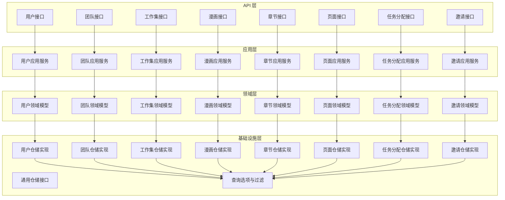
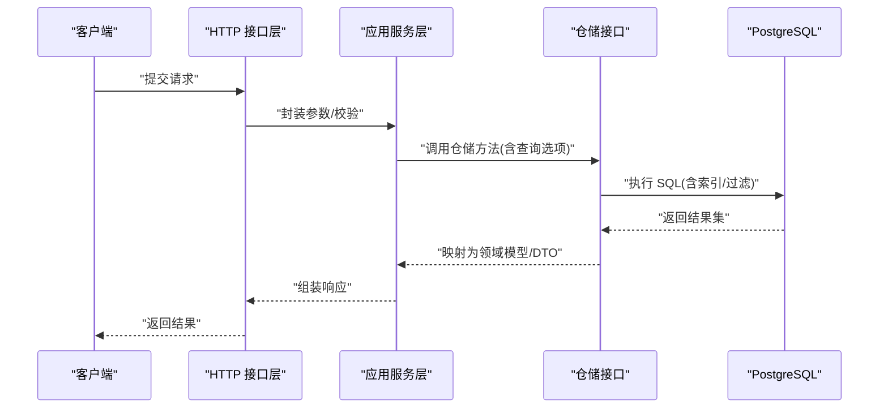
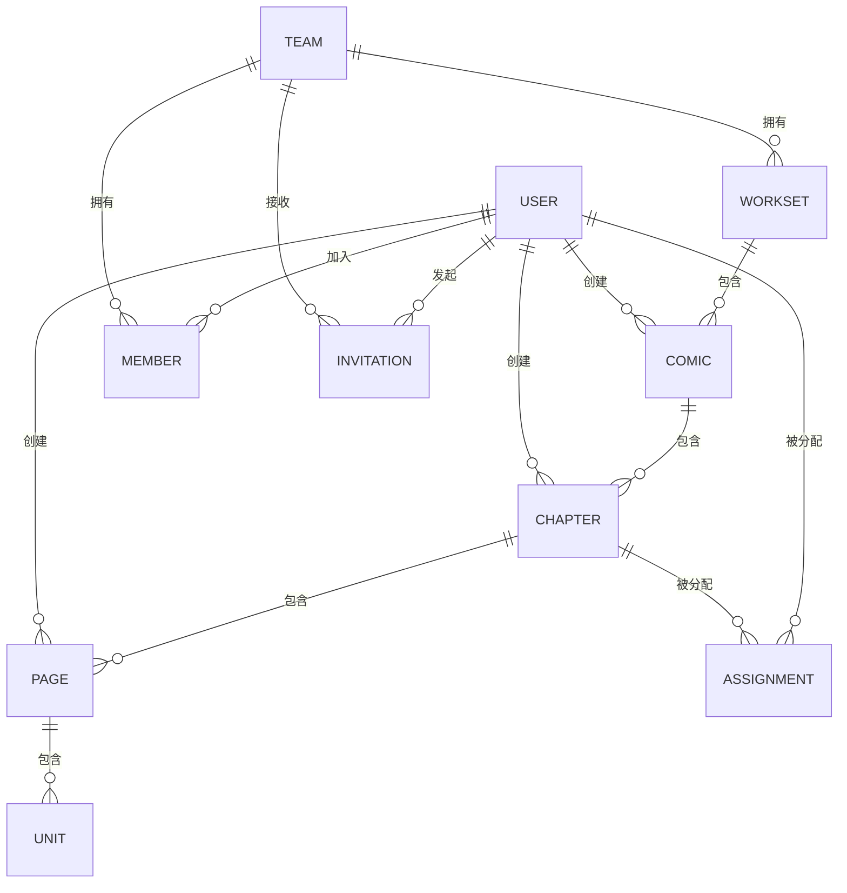

# 数据库设计

<cite>
**本文引用的文件**
- [20260306101215_assignment-table.up.sql](file://backend/backend-v1/migrations/20260306101215_assignment-table.up.sql)
- [20260306101212_comic-table.up.sql](file://backend/backend-v1/migrations/20260306101212_comic-table.up.sql)
- [20260306101213_chapter-table.up.sql](file://backend/backend-v1/migrations/20260306101213_chapter-table.up.sql)
- [20260306101214_page-table.up.sql](file://backend/backend-v1/migrations/20260306101214_page-table.up.sql)
- [20260306101211_workset-table.up.sql](file://backend/backend-v1/migrations/20260306101211_workset-table.up.sql)
- [20260306101216_unit-table.up.sql](file://backend/backend-v1/migrations/20260306101216_unit-table.up.sql)
- [20260301075641_member-table.up.sql](file://backend/backend-v1/migrations/20260301075641_member-table.up.sql)
- [20260301075642_invitation-table.up.sql](file://backend/backend-v1/migrations/20260301075642_invitation-table.up.sql)
- [20260301065012_team-table.up.sql](file://backend/backend-v1/migrations/20260301065012_team-table.up.sql)
- [20260301065022_user-table.up.sql](file://backend/backend-v1/migrations/20260301065022_user-table.up.sql)
- [repository.go](file://backend/backend-v1/internal/infrastructure/repository/repository.go)
- [table_names.go](file://backend/backend-v1/internal/infrastructure/repository/table_names.go)
- [common.go](file://backend/backend-v1/internal/infrastructure/repository/query_option/common.go)
- [assignment.go](file://backend/backend-v1/internal/infrastructure/repository/query_option/assignment.go)
- [chapter.go](file://backend/backend-v1/internal/infrastructure/repository/query_option/chapter.go)
- [comic.go](file://backend/backend-v1/internal/infrastructure/repository/query_option/comic.go)
- [member.go](file://backend/backend-v1/internal/infrastructure/repository/query_option/member.go)
- [page.go](file://backend/backend-v1/internal/infrastructure/repository/query_option/page.go)
- [team.go](file://backend/backend-v1/internal/infrastructure/repository/query_option/team.go)
- [user.go](file://backend/backend-v1/internal/infrastructure/repository/query_option/user.go)
- [workset.go](file://backend/backend-v1/internal/infrastructure/repository/query_option/workset.go)
- [assignment.go](file://backend/backend-v1/internal/domain/repository/assignment.go)
- [chapter.go](file://backend/backend-v1/internal/domain/repository/chapter.go)
- [comic.go](file://backend/backend-v1/internal/domain/repository/comic.go)
- [member.go](file://backend/backend-v1/internal/domain/repository/member.go)
- [page.go](file://backend/backend-v1/internal/domain/repository/page.go)
- [team.go](file://backend/backend-v1/internal/domain/repository/team.go)
- [user.go](file://backend/backend-v1/internal/domain/repository/user.go)
- [workset.go](file://backend/backend-v1/internal/domain/repository/workset.go)
- [assignment.go](file://backend/backend-v1/internal/application/assembler/assignment.go)
- [chapter.go](file://backend/backend-v1/internal/application/assembler/chapter.go)
- [comic.go](file://backend/backend-v1/internal/application/assembler/comic.go)
- [member.go](file://backend/backend-v1/internal/application/assembler/member.go)
- [page.go](file://backend/backend-v1/internal/application/assembler/page.go)
- [team.go](file://backend/backend-v1/internal/application/assembler/team.go)
- [user.go](file://backend/backend-v1/internal/application/assembler/user.go)
- [workset.go](file://backend/backend-v1/internal/application/assembler/workset.go)
- [assignment.go](file://backend/backend-v1/internal/application/assignment.go)
- [chapter.go](file://backend/backend-v1/internal/application/chapter.go)
- [comic.go](file://backend/backend-v1/internal/application/comic.go)
- [member.go](file://backend/backend-v1/internal/application/member.go)
- [page.go](file://backend/backend-v1/internal/application/page.go)
- [team.go](file://backend/backend-v1/internal/application/team.go)
- [user.go](file://backend/backend-v1/internal/application/user.go)
- [workset.go](file://backend/backend-v1/internal/application/workset.go)
- [user.go](file://backend/backend-v1/internal/api/http/user.go)
- [team.go](file://backend/backend-v1/internal/api/http/team.go)
- [workset.go](file://backend/backend-v1/internal/api/http/workset.go)
- [comic.go](file://backend/backend-v1/internal/api/http/comic.go)
- [chapter.go](file://backend/backend-v1/internal/api/http/chapter.go)
- [page.go](file://backend/backend-v1/internal/api/http/page.go)
- [assignment.go](file://backend/backend-v1/internal/api/http/assignment.go)
- [invitation.go](file://backend/backend-v1/internal/api/http/invitation.go)
- [allmg.sql](file://backend/backend-v1/legacy/migrations/allmg.sql)
- [comic_info.sql](file://backend/backend-v1/legacy/migrations/comic_info.sql)
- [forum.sql](file://backend/backend-v1/legacy/migrations/forum.sql)
</cite>

## 目录
1. [简介](#简介)
2. [项目结构](#项目结构)
3. [核心组件](#核心组件)
4. [架构总览](#架构总览)
5. [详细组件分析](#详细组件分析)
6. [依赖关系分析](#依赖关系分析)
7. [性能与查询优化](#性能与查询优化)
8. [故障排查指南](#故障排查指南)
9. [结论](#结论)
10. [附录](#附录)

## 简介
本文件面向 Poprako 项目的数据库设计与实现，围绕基于 PostgreSQL 的表结构、索引策略、查询选项与过滤机制、数据一致性与事务处理、并发控制、备份与监控、以及数据安全与访问控制进行系统化说明。文档同时梳理了数据库迁移脚本的版本管理与演进过程，并总结数据访问层（仓储模式）的设计思路与实现要点。

## 项目结构
后端采用分层架构：API 层负责请求接入与参数校验；应用层编排业务流程；领域层定义实体与仓库接口；基础设施层实现仓储与 SQL 查询选项；值对象与装配器用于 DTO 转换与组装。数据库迁移脚本按时间戳版本号组织，确保可重复部署与回滚。

图表来源
- [user.go](file://backend/backend-v1/internal/api/http/user.go)
- [team.go](file://backend/backend-v1/internal/api/http/team.go)
- [workset.go](file://backend/backend-v1/internal/api/http/workset.go)
- [comic.go](file://backend/backend-v1/internal/api/http/comic.go)
- [chapter.go](file://backend/backend-v1/internal/api/http/chapter.go)
- [page.go](file://backend/backend-v1/internal/api/http/page.go)
- [assignment.go](file://backend/backend-v1/internal/api/http/assignment.go)
- [invitation.go](file://backend/backend-v1/internal/api/http/invitation.go)
- [user.go](file://backend/backend-v1/internal/application/user.go)
- [team.go](file://backend/backend-v1/internal/application/team.go)
- [workset.go](file://backend/backend-v1/internal/application/workset.go)
- [comic.go](file://backend/backend-v1/internal/application/comic.go)
- [chapter.go](file://backend/backend-v1/internal/application/chapter.go)
- [page.go](file://backend/backend-v1/internal/application/page.go)
- [assignment.go](file://backend/backend-v1/internal/application/assignment.go)
- [invitation.go](file://backend/backend-v1/internal/application/invitation.go)
- [user.go](file://backend/backend-v1/internal/domain/repository/user.go)
- [team.go](file://backend/backend-v1/internal/domain/repository/team.go)
- [workset.go](file://backend/backend-v1/internal/domain/repository/workset.go)
- [comic.go](file://backend/backend-v1/internal/domain/repository/comic.go)
- [chapter.go](file://backend/backend-v1/internal/domain/repository/chapter.go)
- [page.go](file://backend/backend-v1/internal/domain/repository/page.go)
- [assignment.go](file://backend/backend-v1/internal/domain/repository/assignment.go)
- [invitation.go](file://backend/backend-v1/internal/domain/repository/invitation.go)
- [repository.go](file://backend/backend-v1/internal/infrastructure/repository/repository.go)

章节来源
- [user.go](file://backend/backend-v1/internal/api/http/user.go)
- [team.go](file://backend/backend-v1/internal/api/http/team.go)
- [workset.go](file://backend/backend-v1/internal/api/http/workset.go)
- [comic.go](file://backend/backend-v1/internal/api/http/comic.go)
- [chapter.go](file://backend/backend-v1/internal/api/http/chapter.go)
- [page.go](file://backend/backend-v1/internal/api/http/page.go)
- [assignment.go](file://backend/backend-v1/internal/api/http/assignment.go)
- [invitation.go](file://backend/backend-v1/internal/api/http/invitation.go)

## 核心组件
- 用户与身份：用户表存储唯一标识、昵称、QQ、头像 OSS 键、密码哈希、是否超级管理员等信息，并提供名称模糊匹配索引与时间维度索引。
- 团队与成员：团队表记录团队元数据与软删除字段；成员表关联用户与团队并记录各类角色分配时间戳。
- 工作集：工作集表与团队关联，维护序号与名称，支持唯一性约束。
- 漫画、章节、页面、单元：漫画表与工作集关联并统计章节数量；章节表与漫画关联并跟踪多阶段状态时间戳；页面表与章节关联并统计单元计数；单元表与页面关联并记录翻译与校对状态。
- 任务分配：任务分配表记录用户在章节上的各阶段分配时间戳，避免重复分配。
- 邀请：邀请表记录发起人、目标团队、被邀请 QQ、角色偏好与待处理状态。

章节来源
- [20260301065022_user-table.up.sql](file://backend/backend-v1/migrations/20260301065022_user-table.up.sql)
- [20260301065012_team-table.up.sql](file://backend/backend-v1/migrations/20260301065012_team-table.up.sql)
- [20260301075641_member-table.up.sql](file://backend/backend-v1/migrations/20260301075641_member-table.up.sql)
- [20260306101211_workset-table.up.sql](file://backend/backend-v1/migrations/20260306101211_workset-table.up.sql)
- [20260306101212_comic-table.up.sql](file://backend/backend-v1/migrations/20260306101212_comic-table.up.sql)
- [20260306101213_chapter-table.up.sql](file://backend/backend-v1/migrations/20260306101213_chapter-table.up.sql)
- [20260306101214_page-table.up.sql](file://backend/backend-v1/migrations/20260306101214_page-table.up.sql)
- [20260306101216_unit-table.up.sql](file://backend/backend-v1/migrations/20260306101216_unit-table.up.sql)
- [20260306101215_assignment-table.up.sql](file://backend/backend-v1/migrations/20260306101215_assignment-table.up.sql)
- [20260301075642_invitation-table.up.sql](file://backend/backend-v1/migrations/20260301075642_invitation-table.up.sql)

## 架构总览
下图展示数据库层与应用层之间的交互，以及仓储接口如何承载查询选项与过滤逻辑。

图表来源
- [user.go](file://backend/backend-v1/internal/api/http/user.go)
- [team.go](file://backend/backend-v1/internal/api/http/team.go)
- [workset.go](file://backend/backend-v1/internal/api/http/workset.go)
- [comic.go](file://backend/backend-v1/internal/api/http/comic.go)
- [chapter.go](file://backend/backend-v1/internal/api/http/chapter.go)
- [page.go](file://backend/backend-v1/internal/api/http/page.go)
- [assignment.go](file://backend/backend-v1/internal/api/http/assignment.go)
- [invitation.go](file://backend/backend-v1/internal/api/http/invitation.go)
- [user.go](file://backend/backend-v1/internal/application/user.go)
- [team.go](file://backend/backend-v1/internal/application/team.go)
- [workset.go](file://backend/backend-v1/internal/application/workset.go)
- [comic.go](file://backend/backend-v1/internal/application/comic.go)
- [chapter.go](file://backend/backend-v1/internal/application/chapter.go)
- [page.go](file://backend/backend-v1/internal/application/page.go)
- [assignment.go](file://backend/backend-v1/internal/application/assignment.go)
- [invitation.go](file://backend/backend-v1/internal/application/invitation.go)
- [repository.go](file://backend/backend-v1/internal/infrastructure/repository/repository.go)

## 详细组件分析

### 用户(User)
- 表结构要点
  - 主键：文本型 ID
  - 唯一约束：QQ
  - 字段：昵称、头像 OSS 键、是否上传头像、密码哈希、是否超级管理员、创建/更新时间、软删除时间
- 索引策略
  - 名称三字母组(GIN trigram)索引，支持模糊搜索
  - QQ 唯一索引
  - 按创建/更新时间倒序索引，便于分页与排序
- 查询与过滤
  - 支持按 QQ 精确查找
  - 支持按名称模糊匹配
  - 支持按创建/更新时间范围与排序
- 安全与一致性
  - 密码使用强哈希存储
  - 软删除字段配合查询选项实现“可见性”控制
- 迁移与版本
  - 版本脚本包含预插入超级管理员记录

章节来源
- [20260301065022_user-table.up.sql](file://backend/backend-v1/migrations/20260301065022_user-table.up.sql)
- [user.go](file://backend/backend-v1/internal/infrastructure/repository/query_option/user.go)
- [user.go](file://backend/backend-v1/internal/domain/repository/user.go)
- [user.go](file://backend/backend-v1/internal/application/assembler/user.go)
- [user.go](file://backend/backend-v1/internal/application/user.go)

### 团队(Team)
- 表结构要点
  - 主键：文本型 ID
  - 字段：名称、描述、头像 OSS 键、是否上传头像、创建/更新时间、软删除时间
  - 唯一索引：名称（结合软删除）
- 查询与过滤
  - 支持按名称精确或模糊匹配
  - 支持按创建/更新时间排序
- 并发与一致性
  - 软删除保障历史审计与并发读取一致性

章节来源
- [20260301065012_team-table.up.sql](file://backend/backend-v1/migrations/20260301065012_team-table.up.sql)
- [team.go](file://backend/backend-v1/internal/infrastructure/repository/query_option/team.go)
- [team.go](file://backend/backend-v1/internal/domain/repository/team.go)
- [team.go](file://backend/backend-v1/internal/application/assembler/team.go)
- [team.go](file://backend/backend-v1/internal/application/team.go)

### 成员(Member)
- 表结构要点
  - 复合主键：文本型 ID
  - 关联：用户与团队外键，级联删除
  - 角色分配时间戳：原始提供者、翻译、校对、排版、重绘、审核、发布、管理
  - 软删除时间
- 索引策略
  - user_id、team_id 普通索引（结合软删除）
  - 各角色分配时间戳的条件索引，仅索引非空且未删除的行
- 查询与过滤
  - 支持按团队筛选成员
  - 支持按角色分配状态筛选
  - 支持按创建时间排序

章节来源
- [20260301075641_member-table.up.sql](file://backend/backend-v1/migrations/20260301075641_member-table.up.sql)
- [member.go](file://backend/backend-v1/internal/infrastructure/repository/query_option/member.go)
- [member.go](file://backend/backend-v1/internal/domain/repository/member.go)
- [member.go](file://backend/backend-v1/internal/application/assembler/member.go)
- [member.go](file://backend/backend-v1/internal/application/member.go)

### 工作集(Workset)
- 表结构要点
  - 主键：文本型 ID
  - 关联：团队外键，级联删除
  - 字段：序号、名称、描述、漫画数量、创建/更新时间
  - 唯一索引：团队+序号
- 索引策略
  - team_id 普通索引
  - 唯一索引：团队+序号

章节来源
- [20260306101211_workset-table.up.sql](file://backend/backend-v1/migrations/20260306101211_workset-table.up.sql)
- [workset.go](file://backend/backend-v1/internal/infrastructure/repository/query_option/workset.go)
- [workset.go](file://backend/backend-v1/internal/domain/repository/workset.go)
- [workset.go](file://backend/backend-v1/internal/application/assembler/workset.go)
- [workset.go](file://backend/backend-v1/internal/application/workset.go)

### 漫画(Comic)
- 表结构要点
  - 主键：文本型 ID
  - 关联：工作集与创建者外键
  - 字段：序号、标题、作者、描述、章节数、最后活跃时间、创建/更新/删除时间
  - 约束：章节计数默认 0
- 索引策略
  - 唯一索引：工作集+序号（未删除）
  - 组合索引：工作集+创建时间降序（未删除）
  - creator_id 索引（未删除）
  - last_active_at 降序索引（未删除）

章节来源
- [20260306101212_comic-table.up.sql](file://backend/backend-v1/migrations/20260306101212_comic-table.up.sql)
- [comic.go](file://backend/backend-v1/internal/infrastructure/repository/query_option/comic.go)
- [comic.go](file://backend/backend-v1/internal/domain/repository/comic.go)
- [comic.go](file://backend/backend-v1/internal/application/assembler/comic.go)
- [comic.go](file://backend/backend-v1/internal/application/comic.go)

### 章节(Chapter)
- 表结构要点
  - 主键：文本型 ID
  - 关联：漫画与创建者外键
  - 字段：序号、副标题、页面数、单元总数、翻译/校对进度、多阶段时间戳、创建/更新/删除时间
- 索引策略
  - 唯一索引：漫画+序号降序（未删除）
  - 普通索引：漫画 ID（未删除）

章节来源
- [20260306101213_chapter-table.up.sql](file://backend/backend-v1/migrations/20260306101213_chapter-table.up.sql)
- [chapter.go](file://backend/backend-v1/internal/infrastructure/repository/query_option/chapter.go)
- [chapter.go](file://backend/backend-v1/internal/domain/repository/chapter.go)
- [chapter.go](file://backend/backend-v1/internal/application/assembler/chapter.go)
- [chapter.go](file://backend/backend-v1/internal/application/chapter.go)

### 页面(Page)
- 表结构要点
  - 主键：文本型 ID
  - 关联：章节与创建者外键
  - 字段：序号、OSS 键、是否已上传、单元统计、创建/更新时间
- 索引策略
  - 唯一索引：章节+序号
  - 普通索引：章节 ID

章节来源
- [20260306101214_page-table.up.sql](file://backend/backend-v1/migrations/20260306101214_page-table.up.sql)
- [page.go](file://backend/backend-v1/internal/infrastructure/repository/query_option/page.go)
- [page.go](file://backend/backend-v1/internal/domain/repository/page.go)
- [page.go](file://backend/backend-v1/internal/application/assembler/page.go)
- [page.go](file://backend/backend-v1/internal/application/page.go)

### 单元(Unit)
- 表结构要点
  - 主键：文本型 ID
  - 关联：页面外键
  - 字段：坐标(x,y)、序号、是否气泡、是否已校对、翻译/校对文本与人员、评论、创建/更新时间
- 索引策略
  - 唯一索引：页面+序号
  - 普通索引：页面 ID

章节来源
- [20260306101216_unit-table.up.sql](file://backend/backend-v1/migrations/20260306101216_unit-table.up.sql)
- [unit.go](file://backend/backend-v1/internal/value/unit.go)
- [page.go](file://backend/backend-v1/internal/application/page.go)

### 任务分配(Assignment)
- 表结构要点
  - 主键：文本型 ID
  - 关联：章节与用户外键，级联删除
  - 字段：各阶段分配时间戳、创建/更新时间
  - 约束：章节+用户唯一
- 索引策略
  - 普通索引：章节 ID、用户 ID

章节来源
- [20260306101215_assignment-table.up.sql](file://backend/backend-v1/migrations/20260306101215_assignment-table.up.sql)
- [assignment.go](file://backend/backend-v1/internal/infrastructure/repository/query_option/assignment.go)
- [assignment.go](file://backend/backend-v1/internal/domain/repository/assignment.go)
- [assignment.go](file://backend/backend-v1/internal/application/assembler/assignment.go)
- [assignment.go](file://backend/backend-v1/internal/application/assignment.go)

### 邀请(Invitation)
- 表结构要点
  - 主键：文本型 ID
  - 关联：发起人与团队外键，级联删除
  - 字段：被邀请 QQ、邀请码唯一、角色偏好布尔位、待处理状态、创建/更新时间
- 索引策略
  - 条件索引：团队+创建时间降序（仅针对非待处理）

章节来源
- [20260301075642_invitation-table.up.sql](file://backend/backend-v1/migrations/20260301075642_invitation-table.up.sql)
- [invitation.go](file://backend/backend-v1/internal/infrastructure/repository/query_option/invitation.go)
- [invitation.go](file://backend/backend-v1/internal/domain/repository/invitation.go)
- [invitation.go](file://backend/backend-v1/internal/application/assembler/invitation.go)
- [invitation.go](file://backend/backend-v1/internal/application/invitation.go)

## 依赖关系分析
- 外键关系
  - team → workset(team_id)
  - workset → comic(workset_id)
  - comic → chapter(comic_id)
  - chapter → page(chapter_id)
  - page → unit(page_id)
  - user → member(user_id)
  - team → member(team_id)
  - user → assignment(user_id)
  - chapter → assignment(chapter_id)
  - user → invitation(invitor_id)
  - team → invitation(team_id)
  - user → comic(creator_id)
  - user → chapter(creator_id)
  - user → page(creator_id)
- 级联行为
  - 删除团队/章节/页面会级联删除其子资源
  - 删除用户会级联删除成员与邀请（但漫画/章节/页面的创建者删除受 RESTRICT 约束）
- 查询选项与过滤
  - 仓储层通过查询选项模块统一构建 WHERE/HAVING/LIMIT/OFFSET/ORDER BY
  - 条件索引与组合索引支撑高效过滤与排序

图表来源
- [20260301065012_team-table.up.sql](file://backend/backend-v1/migrations/20260301065012_team-table.up.sql)
- [20260306101211_workset-table.up.sql](file://backend/backend-v1/migrations/20260306101211_workset-table.up.sql)
- [20260306101212_comic-table.up.sql](file://backend/backend-v1/migrations/20260306101212_comic-table.up.sql)
- [20260306101213_chapter-table.up.sql](file://backend/backend-v1/migrations/20260306101213_chapter-table.up.sql)
- [20260306101214_page-table.up.sql](file://backend/backend-v1/migrations/20260306101214_page-table.up.sql)
- [20260306101216_unit-table.up.sql](file://backend/backend-v1/migrations/20260306101216_unit-table.up.sql)
- [20260301075641_member-table.up.sql](file://backend/backend-v1/migrations/20260301075641_member-table.up.sql)
- [20260306101215_assignment-table.up.sql](file://backend/backend-v1/migrations/20260306101215_assignment-table.up.sql)
- [20260301075642_invitation-table.up.sql](file://backend/backend-v1/migrations/20260301075642_invitation-table.up.sql)

## 性能与查询优化
- 索引策略
  - 名称模糊搜索：GIN trigram 索引
  - 唯一性约束：组合唯一索引（如漫画/章节/页面/工作集序号）
  - 条件索引：软删除过滤、角色分配状态过滤
  - 组合索引：常用过滤+排序组合（如 team_id+created_at DESC）
- 查询选项与过滤
  - 通过查询选项模块统一构建过滤条件，减少重复 SQL
  - 使用 LIMIT/OFFSET 实现分页，结合索引避免全表扫描
- 事务与并发
  - 对写入密集路径使用短事务，减少锁竞争
  - 使用 SELECT ... FOR UPDATE 实现关键更新的互斥
  - 对只读查询启用只读事务，降低写放大
- 监控与诊断
  - 使用 EXPLAIN/EXPLAIN ANALYZE 分析慢查询
  - 结合 pg_stat_statements 或 AWR 报告定位热点
- 迁移与版本管理
  - 时间戳前缀的迁移脚本，确保幂等与可回滚
  - 先建表再建索引，避免重建索引带来的锁等待

章节来源
- [common.go](file://backend/backend-v1/internal/infrastructure/repository/query_option/common.go)
- [user.go](file://backend/backend-v1/internal/infrastructure/repository/query_option/user.go)
- [team.go](file://backend/backend-v1/internal/infrastructure/repository/query_option/team.go)
- [workset.go](file://backend/backend-v1/internal/infrastructure/repository/query_option/workset.go)
- [comic.go](file://backend/backend-v1/internal/infrastructure/repository/query_option/comic.go)
- [chapter.go](file://backend/backend-v1/internal/infrastructure/repository/query_option/chapter.go)
- [page.go](file://backend/backend-v1/internal/infrastructure/repository/query_option/page.go)
- [assignment.go](file://backend/backend-v1/internal/infrastructure/repository/query_option/assignment.go)
- [member.go](file://backend/backend-v1/internal/infrastructure/repository/query_option/member.go)
- [invitation.go](file://backend/backend-v1/internal/infrastructure/repository/query_option/invitation.go)

## 故障排查指南
- 常见问题
  - 唯一冲突：检查组合唯一索引（如漫画/章节/页面/工作集序号）
  - 外键约束失败：确认父记录存在且未软删除
  - 查询性能差：确认 WHERE 子句是否命中索引，避免隐式转换
- 诊断步骤
  - 使用 EXPLAIN ANALYZE 查看执行计划
  - 检查索引是否被使用
  - 核对查询选项是否正确拼接
- 修复建议
  - 为高频过滤列补充条件索引
  - 将排序列纳入组合索引
  - 对大表分页时避免 OFFSET 过大，考虑游标分页

章节来源
- [common.go](file://backend/backend-v1/internal/infrastructure/repository/query_option/common.go)
- [repository.go](file://backend/backend-v1/internal/infrastructure/repository/repository.go)

## 结论
本设计以清晰的层级与职责分离为基础，通过严格的外键关系、唯一性与条件索引保障数据一致性与查询效率。仓储模式与查询选项模块使数据访问层具备良好的可测试性与可扩展性。迁移脚本采用时间戳版本号，确保演进过程可控、可回滚。建议在生产环境中结合监控工具持续评估与优化索引与查询计划。

## 附录

### 数据库迁移与版本管理
- 迁移脚本组织
  - 新迁移：按时间戳命名，先 up 再 down
  - 旧迁移：legacy 目录保留历史脚本
- 版本演进
  - 从团队、用户、成员、邀请到工作集、漫画、章节、页面、单元逐步完善
  - 每个版本聚焦单一主题，降低变更风险
- 回滚策略
  - 使用 down 脚本逐版本回退
  - 注意外键级联与软删除的影响

章节来源
- [20260301065012_team-table.up.sql](file://backend/backend-v1/migrations/20260301065012_team-table.up.sql)
- [20260301065022_user-table.up.sql](file://backend/backend-v1/migrations/20260301065022_user-table.up.sql)
- [20260301075641_member-table.up.sql](file://backend/backend-v1/migrations/20260301075641_member-table.up.sql)
- [20260301075642_invitation-table.up.sql](file://backend/backend-v1/migrations/20260301075642_invitation-table.up.sql)
- [20260306101211_workset-table.up.sql](file://backend/backend-v1/migrations/20260306101211_workset-table.up.sql)
- [20260306101212_comic-table.up.sql](file://backend/backend-v1/migrations/20260306101212_comic-table.up.sql)
- [20260306101213_chapter-table.up.sql](file://backend/backend-v1/migrations/20260306101213_chapter-table.up.sql)
- [20260306101214_page-table.up.sql](file://backend/backend-v1/migrations/20260306101214_page-table.up.sql)
- [20260306101215_assignment-table.up.sql](file://backend/backend-v1/migrations/20260306101215_assignment-table.up.sql)
- [20260306101216_unit-table.up.sql](file://backend/backend-v1/migrations/20260306101216_unit-table.up.sql)
- [allmg.sql](file://backend/backend-v1/legacy/migrations/allmg.sql)
- [comic_info.sql](file://backend/backend-v1/legacy/migrations/comic_info.sql)
- [forum.sql](file://backend/backend-v1/legacy/migrations/forum.sql)

### 数据访问层与仓储模式
- 仓储接口
  - 定义通用 CRUD 与查询方法，屏蔽 SQL 细节
- 查询选项
  - 统一封装过滤、排序、分页、软删除等
- 实体映射
  - 通过装配器将仓储结果映射为领域模型或 DTO
- 应用服务
  - 编排业务流程，协调多个仓储与领域模型

章节来源
- [repository.go](file://backend/backend-v1/internal/infrastructure/repository/repository.go)
- [table_names.go](file://backend/backend-v1/internal/infrastructure/repository/table_names.go)
- [common.go](file://backend/backend-v1/internal/infrastructure/repository/query_option/common.go)
- [assignment.go](file://backend/backend-v1/internal/application/assignment.go)
- [chapter.go](file://backend/backend-v1/internal/application/chapter.go)
- [comic.go](file://backend/backend-v1/internal/application/comic.go)
- [member.go](file://backend/backend-v1/internal/application/member.go)
- [page.go](file://backend/backend-v1/internal/application/page.go)
- [team.go](file://backend/backend-v1/internal/application/team.go)
- [user.go](file://backend/backend-v1/internal/application/user.go)
- [workset.go](file://backend/backend-v1/internal/application/workset.go)

### 数据一致性、事务与并发控制
- 一致性
  - 唯一索引与组合唯一约束防止重复
  - 软删除字段统一“可见性”控制
- 事务
  - 写操作短事务，必要时使用 FOR UPDATE
  - 批量写入使用事务包裹，失败回滚
- 并发
  - 读写分离与只读事务降低锁竞争
  - 对高并发写入场景使用序列化级别或重试机制

章节来源
- [20260301065022_user-table.up.sql](file://backend/backend-v1/migrations/20260301065022_user-table.up.sql)
- [20260301065012_team-table.up.sql](file://backend/backend-v1/migrations/20260301065012_team-table.up.sql)
- [20260306101212_comic-table.up.sql](file://backend/backend-v1/migrations/20260306101212_comic-table.up.sql)
- [20260306101213_chapter-table.up.sql](file://backend/backend-v1/migrations/20260306101213_chapter-table.up.sql)
- [20260306101214_page-table.up.sql](file://backend/backend-v1/migrations/20260306101214_page-table.up.sql)
- [20260306101216_unit-table.up.sql](file://backend/backend-v1/migrations/20260306101216_unit-table.up.sql)
- [20260306101215_assignment-table.up.sql](file://backend/backend-v1/migrations/20260306101215_assignment-table.up.sql)
- [20260301075641_member-table.up.sql](file://backend/backend-v1/migrations/20260301075641_member-table.up.sql)
- [20260301075642_invitation-table.up.sql](file://backend/backend-v1/migrations/20260301075642_invitation-table.up.sql)

### 备份、恢复与监控
- 备份
  - 使用逻辑备份（如 pg_dump）定期导出
  - 对热数据表进行增量备份
- 恢复
  - 基于时间点恢复（PITR），结合 WAL 归档
  - 验证备份完整性与可恢复性
- 监控
  - 指标：连接数、锁等待、慢查询、表膨胀
  - 告警：查询延迟、索引缺失、DDL 阻塞

章节来源
- [repository.go](file://backend/backend-v1/internal/infrastructure/repository/repository.go)

### 数据安全、隐私保护与访问控制
- 安全
  - 密码使用强哈希存储
  - 超级管理员权限最小化使用
- 隐私
  - 软删除替代物理删除，满足审计与合规
- 访问控制
  - 基于团队与成员角色的资源访问控制
  - 邀请码与角色偏好限制跨团队越权

章节来源
- [20260301065022_user-table.up.sql](file://backend/backend-v1/migrations/20260301065022_user-table.up.sql)
- [20260301075641_member-table.up.sql](file://backend/backend-v1/migrations/20260301075641_member-table.up.sql)
- [20260301075642_invitation-table.up.sql](file://backend/backend-v1/migrations/20260301075642_invitation-table.up.sql)