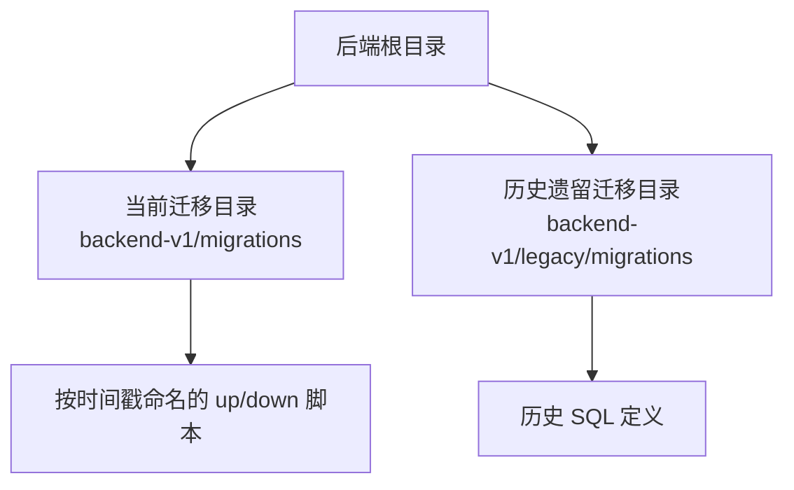
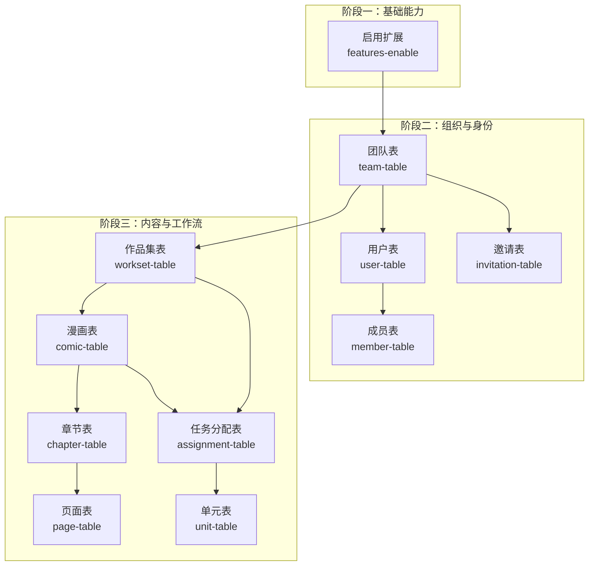
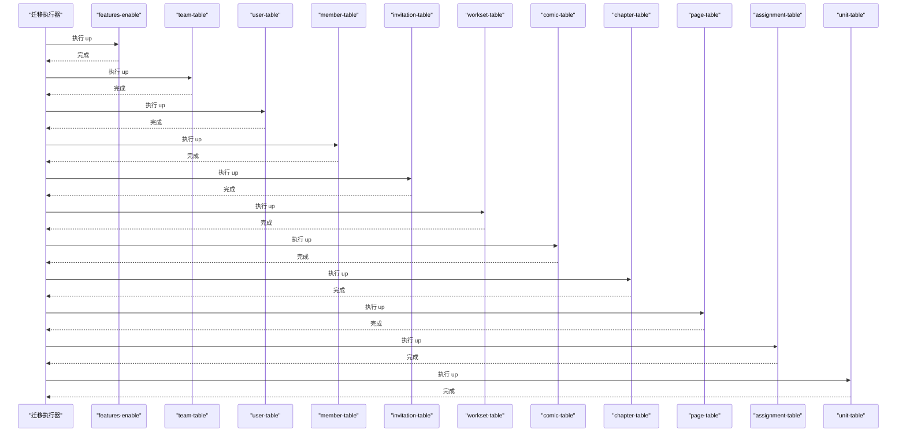
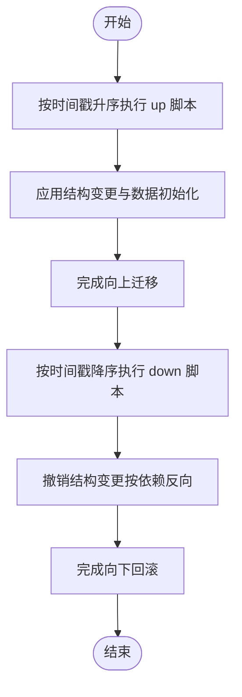
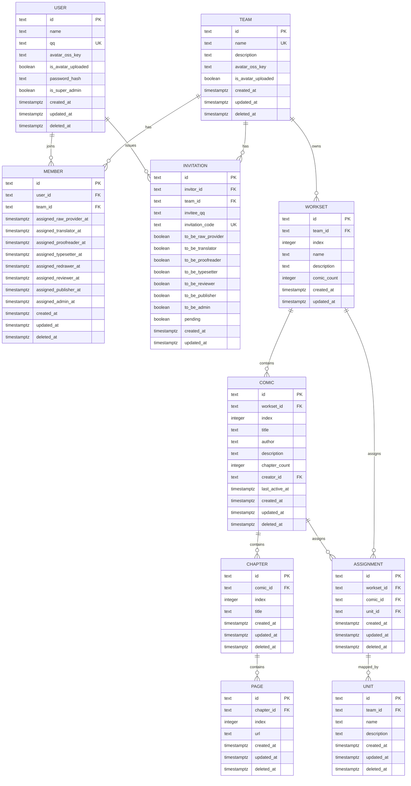

# 数据库迁移管理

<cite>
**本文引用的文件**
- [20260301065010_features-enable.up.sql](file://backend/backend-v1/migrations/20260301065010_features-enable.up.sql)
- [20260301065010_features-enable.down.sql](file://backend/backend-v1/migrations/20260301065010_features-enable.down.sql)
- [20260301065012_team-table.up.sql](file://backend/backend-v1/migrations/20260301065012_team-table.up.sql)
- [20260301065012_team-table.down.sql](file://backend/backend-v1/migrations/20260301065012_team-table.down.sql)
- [20260301065022_user-table.up.sql](file://backend/backend-v1/migrations/20260301065022_user-table.up.sql)
- [20260301065022_user-table.down.sql](file://backend/backend-v1/migrations/20260301065022_user-table.down.sql)
- [20260301075641_member-table.up.sql](file://backend/backend-v1/migrations/20260301075641_member-table.up.sql)
- [20260301075641_member-table.down.sql](file://backend/backend-v1/migrations/20260301075641_member-table.down.sql)
- [20260301075642_invitation-table.up.sql](file://backend/backend-v1/migrations/20260301075642_invitation-table.up.sql)
- [20260301075642_invitation-table.down.sql](file://backend/backend-v1/migrations/20260301075642_invitation-table.down.sql)
- [20260306101211_workset-table.up.sql](file://backend/backend-v1/migrations/20260306101211_workset-table.up.sql)
- [20260306101211_workset-table.down.sql](file://backend/backend-v1/migrations/20260306101211_workset-table.down.sql)
- [20260306101212_comic-table.up.sql](file://backend/backend-v1/migrations/20260306101212_comic-table.up.sql)
- [20260306101212_comic-table.down.sql](file://backend/backend-v1/migrations/20260306101212_comic-table.down.sql)
- [20260306101213_chapter-table.up.sql](file://backend/backend-v1/migrations/20260306101213_chapter-table.up.sql)
- [20260306101213_chapter-table.down.sql](file://backend/backend-v1/migrations/20260306101213_chapter-table.down.sql)
- [20260306101214_page-table.up.sql](file://backend/backend-v1/migrations/20260306101214_page-table.up.sql)
- [20260306101214_page-table.down.sql](file://backend/backend-v1/migrations/20260306101214_page-table.down.sql)
- [20260306101215_assignment-table.up.sql](file://backend/backend-v1/migrations/20260306101215_assignment-table.up.sql)
- [20260306101215_assignment-table.down.sql](file://backend/backend-v1/migrations/20260306101215_assignment-table.down.sql)
- [20260306101216_unit-table.up.sql](file://backend/backend-v1/migrations/20260306101216_unit-table.up.sql)
- [20260306101216_unit-table.down.sql](file://backend/backend-v1/migrations/20260306101216_unit-table.down.sql)
- [allmg.sql](file://backend/backend-v1/legacy/migrations/allmg.sql)
- [comic_info.sql](file://backend/backend-v1/legacy/migrations/comic_info.sql)
- [forum.sql](file://backend/backend-v1/legacy/migrations/forum.sql)
</cite>

## 目录
1. [简介](#简介)
2. [项目结构](#项目结构)
3. [核心组件](#核心组件)
4. [架构总览](#架构总览)
5. [详细组件分析](#详细组件分析)
6. [依赖分析](#依赖分析)
7. [性能考虑](#性能考虑)
8. [故障排查指南](#故障排查指南)
9. [结论](#结论)
10. [附录](#附录)

## 简介
本文件面向 Poprako 项目的数据库迁移管理，系统性说明迁移脚本的版本管理策略、演进过程与命名规范；逐项解析各迁移脚本的作用（建表、结构变更、数据迁移）；明确迁移执行顺序与依赖关系；解释向上迁移与向下回滚流程；给出最佳实践与注意事项；并提供生产环境部署流程、备份与恢复策略以及迁移失败与回滚处理方法。

## 项目结构
- 迁移脚本位于后端目录下的独立迁移文件夹中，采用“时间戳+描述”的命名方式，每个迁移包含对应的 up/down 脚本对。
- 项目同时保留了历史遗留迁移脚本，用于兼容或参考。
- 迁移文件均为 SQL 脚本，遵循 PostgreSQL 语法与特性（如扩展启用、GIN 索引、Timestamptz 类型等）。

**章节来源**
- [20260301065010_features-enable.up.sql:1-2](file://backend/backend-v1/migrations/20260301065010_features-enable.up.sql#L1-L2)
- [allmg.sql:1-16](file://backend/backend-v1/legacy/migrations/allmg.sql#L1-L16)

## 核心组件
- 版本命名与排序：迁移文件名以时间戳前缀确保自然顺序，便于按序执行。
- 迁移对：每个 up 脚本对应一个 down 脚本，实现可逆的结构变更。
- 扩展启用：通过启用扩展支持全文检索等能力。
- 表结构与索引：统一使用文本主键、软删除字段、时区时间戳字段，并建立多维索引提升查询性能。
- 关系约束：外键约束保证团队、用户、作品集、漫画、章节、页面、任务单元之间的引用完整性。
- 数据初始化：在用户表迁移中预置超级管理员账户，便于快速初始化。

**章节来源**
- [20260301065010_features-enable.up.sql:1-2](file://backend/backend-v1/migrations/20260301065010_features-enable.up.sql#L1-L2)
- [20260301065022_user-table.up.sql:36-51](file://backend/backend-v1/migrations/20260301065022_user-table.up.sql#L36-L51)

## 架构总览
下图展示迁移脚本的总体演进与依赖关系：先启用扩展，再逐步建立团队、用户、成员、邀请、作品集、漫画、章节、页面、任务单元等表，并建立必要的索引与约束。

**图表来源**
- [20260301065010_features-enable.up.sql:1-2](file://backend/backend-v1/migrations/20260301065010_features-enable.up.sql#L1-L2)
- [20260301065012_team-table.up.sql:1-16](file://backend/backend-v1/migrations/20260301065012_team-table.up.sql#L1-L16)
- [20260301065022_user-table.up.sql:1-52](file://backend/backend-v1/migrations/20260301065022_user-table.up.sql#L1-L52)
- [20260301075641_member-table.up.sql:1-63](file://backend/backend-v1/migrations/20260301075641_member-table.up.sql#L1-L63)
- [20260301075642_invitation-table.up.sql:1-27](file://backend/backend-v1/migrations/20260301075642_invitation-table.up.sql#L1-L27)
- [20260306101211_workset-table.up.sql:1-19](file://backend/backend-v1/migrations/20260306101211_workset-table.up.sql#L1-L19)
- [20260306101212_comic-table.up.sql:1-37](file://backend/backend-v1/migrations/20260306101212_comic-table.up.sql#L1-L37)
- [20260306101213_chapter-table.up.sql:1-1](file://backend/backend-v1/migrations/20260306101213_chapter-table.up.sql#L1-L1)
- [20260306101214_page-table.up.sql:1-1](file://backend/backend-v1/migrations/20260306101214_page-table.up.sql#L1-L1)
- [20260306101215_assignment-table.up.sql:1-1](file://backend/backend-v1/migrations/20260306101215_assignment-table.up.sql#L1-L1)
- [20260306101216_unit-table.up.sql:1-1](file://backend/backend-v1/migrations/20260306101216_unit-table.up.sql#L1-L1)

## 详细组件分析

### 命名规则与版本号管理
- 文件命名：采用“YYYYMMDDHHMMSS_描述.方向.sql”格式，时间戳确保全局唯一且天然有序。
- 方向区分：up.sql 用于向上迁移，down.sql 用于向下回滚。
- 版本演进：按业务模块分阶段推进，先基础能力（扩展），再组织与身份，最后内容与工作流。

**章节来源**
- [20260301065010_features-enable.up.sql:1-2](file://backend/backend-v1/migrations/20260301065010_features-enable.up.sql#L1-L2)
- [20260301065012_team-table.up.sql:1-16](file://backend/backend-v1/migrations/20260301065012_team-table.up.sql#L1-L16)

### 迁移执行顺序与依赖关系
- 顺序原则：按文件名时间戳升序执行；若存在跨文件依赖，需确保被依赖对象先于依赖对象创建。
- 显式依赖链：
  - 团队表 → 成员表、邀请表、作品集表
  - 用户表 → 成员表、邀请表、漫画表
  - 作品集表 → 漫画表、任务分配表
  - 漫画表 → 章节表、任务分配表
  - 章节表 → 页面表
  - 任务分配表 → 单元表

**图表来源**
- [20260301065010_features-enable.up.sql:1-2](file://backend/backend-v1/migrations/20260301065010_features-enable.up.sql#L1-L2)
- [20260301065012_team-table.up.sql:1-16](file://backend/backend-v1/migrations/20260301065012_team-table.up.sql#L1-L16)
- [20260301065022_user-table.up.sql:1-52](file://backend/backend-v1/migrations/20260301065022_user-table.up.sql#L1-L52)
- [20260301075641_member-table.up.sql:1-63](file://backend/backend-v1/migrations/20260301075641_member-table.up.sql#L1-L63)
- [20260301075642_invitation-table.up.sql:1-27](file://backend/backend-v1/migrations/20260301075642_invitation-table.up.sql#L1-L27)
- [20260306101211_workset-table.up.sql:1-19](file://backend/backend-v1/migrations/20260306101211_workset-table.up.sql#L1-L19)
- [20260306101212_comic-table.up.sql:1-37](file://backend/backend-v1/migrations/20260306101212_comic-table.up.sql#L1-L37)
- [20260306101213_chapter-table.up.sql:1-1](file://backend/backend-v1/migrations/20260306101213_chapter-table.up.sql#L1-L1)
- [20260306101214_page-table.up.sql:1-1](file://backend/backend-v1/migrations/20260306101214_page-table.up.sql#L1-L1)
- [20260306101215_assignment-table.up.sql:1-1](file://backend/backend-v1/migrations/20260306101215_assignment-table.up.sql#L1-L1)
- [20260306101216_unit-table.up.sql:1-1](file://backend/backend-v1/migrations/20260306101216_unit-table.up.sql#L1-L1)

### 向上迁移与向下回滚流程
- 向上迁移（up）：按时间戳顺序依次执行各 up 脚本，完成数据库结构升级与初始数据填充。
- 向下回滚（down）：按相反顺序执行各 down 脚本，逐层撤销结构变更，确保数据安全与一致性。

**图表来源**
- [20260301065010_features-enable.down.sql:1-2](file://backend/backend-v1/migrations/20260301065010_features-enable.down.sql#L1-L2)
- [20260301065012_team-table.down.sql:1-1](file://backend/backend-v1/migrations/20260301065012_team-table.down.sql#L1-L1)
- [20260301065022_user-table.down.sql:1-2](file://backend/backend-v1/migrations/20260301065022_user-table.down.sql#L1-L2)

### 迁移脚本详解

#### 基础能力：启用扩展
- 目标：启用文本相似度扩展，为后续全文检索与模糊匹配提供能力。
- 影响范围：全局扩展启用，影响后续索引与查询优化。

**章节来源**
- [20260301065010_features-enable.up.sql:1-2](file://backend/backend-v1/migrations/20260301065010_features-enable.up.sql#L1-L2)
- [20260301065010_features-enable.down.sql:1-2](file://backend/backend-v1/migrations/20260301065010_features-enable.down.sql#L1-L2)

#### 组织与身份：团队、用户、成员、邀请
- 团队表：存储团队信息与软删除字段，建立名称唯一索引。
- 用户表：存储用户信息、头像、密码哈希、超级管理员标识；建立多维索引；预置超级管理员。
- 成员表：关联用户与团队，记录各角色分配时间；建立多维索引。
- 邀请表：存储邀请发起人、受邀人 QQ、目标团队与角色集合；建立筛选索引。

**章节来源**
- [20260301065012_team-table.up.sql:1-16](file://backend/backend-v1/migrations/20260301065012_team-table.up.sql#L1-L16)
- [20260301065012_team-table.down.sql:1-1](file://backend/backend-v1/migrations/20260301065012_team-table.down.sql#L1-L1)
- [20260301065022_user-table.up.sql:1-52](file://backend/backend-v1/migrations/20260301065022_user-table.up.sql#L1-L52)
- [20260301075641_member-table.up.sql:1-63](file://backend/backend-v1/migrations/20260301075641_member-table.up.sql#L1-L63)
- [20260301075642_invitation-table.up.sql:1-27](file://backend/backend-v1/migrations/20260301075642_invitation-table.up.sql#L1-L27)

#### 内容与工作流：作品集、漫画、章节、页面、任务分配、单元
- 作品集表：按团队分组，维护索引与唯一约束。
- 漫画表：关联作品集与创建者，维护计数与活跃时间；建立多维索引。
- 章节、页面、任务分配、单元：作为内容层级与工作流节点，建立必要索引与外键约束。

**章节来源**
- [20260306101211_workset-table.up.sql:1-19](file://backend/backend-v1/migrations/20260306101211_workset-table.up.sql#L1-L19)
- [20260306101212_comic-table.up.sql:1-37](file://backend/backend-v1/migrations/20260306101212_comic-table.up.sql#L1-L37)
- [20260306101213_chapter-table.up.sql:1-1](file://backend/backend-v1/migrations/20260306101213_chapter-table.up.sql#L1-L1)
- [20260306101214_page-table.up.sql:1-1](file://backend/backend-v1/migrations/20260306101214_page-table.up.sql#L1-L1)
- [20260306101215_assignment-table.up.sql:1-1](file://backend/backend-v1/migrations/20260306101215_assignment-table.up.sql#L1-L1)
- [20260306101216_unit-table.up.sql:1-1](file://backend/backend-v1/migrations/20260306101216_unit-table.up.sql#L1-L1)

### 历史遗留迁移
- allmg：历史同步表定义，MyISAM 引擎与 UTF-8 字符集。
- comic_info：历史漫画信息表定义。
- forum：论坛相关历史定义。

这些脚本可用于理解历史数据结构或迁移路径参考，但不参与当前迁移序列。

**章节来源**
- [allmg.sql:1-16](file://backend/backend-v1/legacy/migrations/allmg.sql#L1-L16)
- [comic_info.sql](file://backend/backend-v1/legacy/migrations/comic_info.sql)
- [forum.sql](file://backend/backend-v1/legacy/migrations/forum.sql)

## 依赖分析
- 外键依赖链清晰：团队 → 成员/邀请/作品集；用户 → 成员/邀请/漫画；作品集 → 漫画/任务；漫画 → 章节/任务；章节 → 页面；任务 → 单元。
- 索引覆盖关键查询路径：名称、QQ、创建/更新时间、角色分配时间、团队索引、唯一索引等。
- 软删除字段贯穿多表，配合 WHERE 条件过滤逻辑删除数据。

**图表来源**
- [20260301065012_team-table.up.sql:1-16](file://backend/backend-v1/migrations/20260301065012_team-table.up.sql#L1-L16)
- [20260301065022_user-table.up.sql:1-52](file://backend/backend-v1/migrations/20260301065022_user-table.up.sql#L1-L52)
- [20260301075641_member-table.up.sql:1-63](file://backend/backend-v1/migrations/20260301075641_member-table.up.sql#L1-L63)
- [20260301075642_invitation-table.up.sql:1-27](file://backend/backend-v1/migrations/20260301075642_invitation-table.up.sql#L1-L27)
- [20260306101211_workset-table.up.sql:1-19](file://backend/backend-v1/migrations/20260306101211_workset-table.up.sql#L1-L19)
- [20260306101212_comic-table.up.sql:1-37](file://backend/backend-v1/migrations/20260306101212_comic-table.up.sql#L1-L37)
- [20260306101213_chapter-table.up.sql:1-1](file://backend/backend-v1/migrations/20260306101213_chapter-table.up.sql#L1-L1)
- [20260306101214_page-table.up.sql:1-1](file://backend/backend-v1/migrations/20260306101214_page-table.up.sql#L1-L1)
- [20260306101215_assignment-table.up.sql:1-1](file://backend/backend-v1/migrations/20260306101215_assignment-table.up.sql#L1-L1)
- [20260306101216_unit-table.up.sql:1-1](file://backend/backend-v1/migrations/20260306101216_unit-table.up.sql#L1-L1)

## 性能考虑
- 索引设计：针对常用查询条件建立复合索引与 GIN 索引，减少全表扫描。
- 时间字段：统一使用带时区的时间戳类型，便于跨时区查询与排序。
- 软删除：通过删除标记字段配合索引条件过滤，避免物理删除带来的连锁影响。
- 扩展启用：提前启用文本相似度扩展，降低后续查询成本。

[本节为通用指导，无需列出具体文件来源]

## 故障排查指南
- 常见问题
  - 外键冲突：检查依赖表是否已创建，确认执行顺序正确。
  - 唯一约束冲突：检查重复键值，必要时清理或调整数据。
  - 索引失效：确认 WHERE 条件与索引列一致，避免函数包裹导致索引不生效。
- 回滚策略
  - down 脚本按相反顺序执行，优先撤销依赖方，再撤销被依赖方。
  - 若中途失败，建议先修复错误，再重试失败的迁移步骤。
- 日志与审计
  - 记录每次迁移的起止时间、影响对象与结果，便于追踪与回溯。

**章节来源**
- [20260301065012_team-table.down.sql:1-1](file://backend/backend-v1/migrations/20260301065012_team-table.down.sql#L1-L1)
- [20260301065022_user-table.down.sql:1-2](file://backend/backend-v1/migrations/20260301065022_user-table.down.sql#L1-L2)

## 结论
Poprako 的数据库迁移采用清晰的命名与顺序管理，结合 up/down 对称设计，确保结构演进的可控与可逆。通过外键与索引设计保障数据完整性与查询性能，预置初始化数据提升开发与测试效率。建议在生产环境中严格遵循迁移流程与备份策略，确保变更安全可控。

[本节为总结性内容，无需列出具体文件来源]

## 附录

### 生产环境迁移部署流程
- 准备阶段
  - 制定迁移计划，明确变更范围与风险评估。
  - 在非高峰时段执行，预留回滚窗口。
- 执行步骤
  - 备份数据库（逻辑备份与物理备份并行）。
  - 应用迁移（按时间戳顺序执行 up 脚本）。
  - 验证结构与数据（检查表结构、索引、约束与关键数据）。
  - 发布服务，监控系统指标与日志。
- 回滚步骤
  - 如遇异常，按相反顺序执行 down 脚本。
  - 验证回滚结果，必要时进行二次修复与重试。

[本节为通用流程说明，无需列出具体文件来源]

### 数据库备份与恢复策略
- 备份策略
  - 全量备份：定期执行全库导出，保留多个周期的历史快照。
  - 增量备份：结合 WAL 日志，缩短恢复时间。
  - 跨区域冗余：异地存放备份副本，防灾备灾。
- 恢复策略
  - 快速恢复：优先使用最近一次全量备份 + 最近增量日志。
  - 精准恢复：针对特定表或时间点进行 PITR（Point-In-Time Recovery）。

[本节为通用策略说明，无需列出具体文件来源]

### 迁移最佳实践与注意事项
- 命名与版本
  - 使用时间戳前缀，避免手动编号冲突。
  - up/down 脚本必须成对存在，语义保持一致。
- 结构变更
  - 尽量使用非阻塞 DDL（PostgreSQL 支持的在线变更）。
  - 避免在大表上直接添加强约束，优先分步实施。
- 数据迁移
  - 预留回滚路径，确保数据一致性。
  - 对敏感字段进行脱敏处理，遵守合规要求。
- 测试与验证
  - 在测试环境完整演练迁移流程。
  - 验证索引命中率与查询性能回归。
- 文档与沟通
  - 记录每次迁移的变更清单与影响面。
  - 与运维、测试、产品团队同步变更计划。

[本节为通用指导，无需列出具体文件来源]